# Ch8. Functions And Macros

Looking back on the material covered in this book so far, CMake’s syntax is already starting to look a lot like a programming language in its own right. It supports variables, if-then-else logic, looping and inclusion of other files to be processed. It should be no surprise to learn that CMake also supports the common programming concepts of functions and macros too. Much like their role in other programming languages, functions and macros are the primary mechanism for projects and developers to extend CMake’s functionality and to encapsulate repetitive tasks in a natural way. They allow the developer to define reusable blocks of CMake code which can be called just like regular built-in CMake commands. They are also a cornerstone of CMake’s own module system (covered separately in “Chapter 11, Modules”).

【译】回顾到目前为止本书所涵盖的材料，CMake的语法本身已经开始看起来很像一种编程语言。它支持变量、if-then-else逻辑、循环和包含其他要处理的文件。得知CMake也支持函数和宏的常见编程概念也就不足为奇了。就像它们在其他编程语言中的作用一样，函数和宏是项目和开发人员扩展CMake功能并以自然方式封装重复任务的主要机制。它们允许开发人员定义可重用的CMake代码块，这些代码块可以像常规的内置CMake命令一样调用。它们也是CMake自己的模块系统的基石（在“第11章，模块”中单独介绍）。

## 8.1. The Basics 

Functions and macros in CMake have very similar characteristics to their same-named counterparts in C/C++. Functions introduce a new scope and the function arguments become variables accessible inside the function body. Macros, on the other hand, effectively paste their body into the point of the call and the macro arguments are substituted as simple string replacements. These behaviors mirror the way functions and \#define macros work in C/C++. A CMake function or macro is defined as follows:

【译】CMake中的函数和宏与C/C++中同名的对应函数和宏具有非常相似的特性。**函数引入了一个新的作用域**，函数参数成为函数体内可访问的变量。 另一方面，宏有效地将其主体粘贴到调用点，宏参数被替换为简单的字符串替换。这些行为反映了C/C++中函数和#define宏的工作方式。CMake函数或宏定义如下：

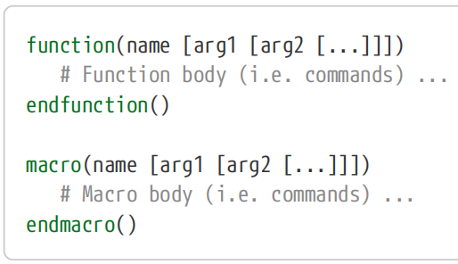

Once defined, the function or macro is called in exactly the same way as any other CMake command. The function or macro’s body is then executed at the point of the call. For example:

【译】一旦定义，函数或宏的调用方式与任何其他CMake命令完全相同。然后在调用点执行函数或宏的主体。例如：

\#-------------------------------------------\>\>\>

function(print_me)

message("Hello from inside a function")

message("All done")

endfunction()

\# Called like so:

print_me()

\#-------------------------------------------\<\<\<

As shown above, the name argument defines the name used to call the function or macro and it should only contain letters, numbers and underscores. The name will be treated case-insensitively, so upper/lowercase conventions are more a matter of style (the CMake documentation follows the convention that command names are all lowercase with words separated by underscores). Very early versions of CMake required the name to be repeated as an argument to endfunction() or endmacro(), but new projects should avoid this as it only adds unnecessary clutter.

【译】如上所示，name参数定义了用于调用函数或宏的名称，它应该只包含字母、数字和下划线。名称将不区分大小写，因此大小写约定更像是一种风格问题（CMake文档遵循的约定是命令名称都是小写的，单词用下划线分隔）。CMake的早期版本要求将该名称作为endfunction()或endmacro()的参数重复，但新项目应避免这种情况，因为它只会增加不必要的混乱。

## 8.2. Argument Handling Essentials

The argument handling of functions and macros is the same except for one very important difference. For functions, each argument is a CMake variable and has all the usual behaviors of a CMake variable. For example, they can be tested in if() statements as variables. In comparison, macro arguments are string replacements, so whatever was used as the argument to the macro call is essentially pasted into wherever that argument appears in the macro body. If a macro argument is used in an if() statement, it would be treated as a string rather than a variable. The following example and its output demonstrate the difference:

【译】函数和宏的参数处理是相同的，除了一个非常重要的区别。

对于函数，每个参数都是一个CMake变量，并具有CMake变量的所有常见行为。例如，它们可以在if()语句中作为变量进行测试。

相比之下，**宏参数是字符串替换**，因此用作宏调用参数的任何内容基本上都会粘贴到宏体中该参数出现的任何位置。如果在if()语句中使用宏参数，它将被视为字符串而不是变量。以下示例及其输出演示了差异：

\##------------------------------------------------\>\>\>

function(func arg)

if(DEFINED arg)

message("Function arg is a defined variable")

else()

message("Function arg is NOT a defined variable")

endif()

endfunction()

macro(macr arg)

if(DEFINED arg)

message("Macro arg is a defined variable")

else()

message("Macro arg is NOT a defined variable")

endif()

endmacro()

func(foobar)

macr(foobar)

\##------------------------------------------------\<\<\<

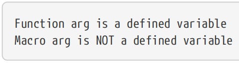

Aside from that difference, functions and macros both support the same features when it comes to argument processing. Each argument in the function definition serves as a case-sensitive label for the argument it represents. For functions, that label acts like a variable, whereas for macros it acts like a string substitution. The value of that argument can be accessed in the function or macro body using the usual variable notation, even though macro arguments are not technically variables.

【译】除了这个区别之外，函数和宏在参数处理方面都支持相同的功能。函数定义中的每个参数都作为它所代表的参数的区分大小写的标签。 对于函数，该标签的作用就像一个变量，而对于宏，它的作用就像字符串替换。 可以 使用通常的变量表示法 在函数或宏体中访问该参数的值，即使宏参数在技术上不是变量。

\#-----------------------------------------------\>\>\>

function(func myArg)

message("myArg = \${myArg}")

endfunction()

macro(macr myArg)

message("myArg = \${myArg}")

endmacro()

func(foobar)

macr(foobar)

\#-----------------------------------------------\<\<\<

Both the call to func() and the call to macr() print the same thing:

调用func()和调用macr()都打印相同的内容：

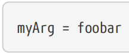

In addition to the named arguments, functions and macros come with a set of automatically defined variables which allow processing of arguments in addition to or instead of the named ones:

【译】除了命名参数外，函数和宏还附带了一组自动定义的变量，这些变量允许处理除命名参数之外的参数或代替命名参数的参数：

\#\>\>\>\>\>\>\>\>\>\>\>\>\>\>\>\>\>\>\>\>\>\>\>\>\>\>\>\>\>\>\>\>\>\>\>\>\>\>\>\>\>\>\>\>\>\>\>\>

\#(1)ARGC

This will be set to the total number of arguments passed to the function. It counts the named arguments plus any additional unnamed arguments that were given. 这将被设置为传递给函数的参数总数。阅读详细信息。

\#(2)ARGV

This is a list variable containing each of the arguments passed to the function, including both the named arguments and any additional unnamed arguments that were given. 【译】这是一个列表变量，包含传递给函数的每个参数，包括命名参数和给定的任何其他未命名参数。

\#(3)ARGN

Like ARGV, except this only contains arguments beyond the named ones (i.e. the optional, unnamed arguments). 【译】与ARGV一样，除了它只包含命名参数之外的参数（即可选的、未命名的参数）。

\#\<\<\<\<\<\<\<\<\<\<\<\<\<\<\<\<\<\<\<\<\<\<\<\<\<\<\<\<\<\<\<\<\<\<\<\<\<\<\<\<\<\<\<\<\<\<\<\<

In addition to the above, each individual argument can be referenced with a name of the form ARG# where \# is the number of the argument (e.g. ARG1, ARG2, etc.). This includes the named arguments, so the first named argument could also be referenced via ARG1, etc.

【译】除上述内容外，每个单独的参数都可以用ARG#形式的名称引用，其中#是参数的编号（例如ARG1、ARG2等）。这包括命名参数，因此第一个命名参数也可以通过ARG1等引用。

Typical situations where the ARG… variables are used include supporting optional arguments and implementing a command which can take an arbtrary number of items to be processed. Consider a function that defines an executable target, links that target to some library and defines a test case for it. Such a function is frequently encountered when writing test cases (a topic covered in “Chapter 24, Testing”). Rather than repeating the steps for every test case, the function allows the steps to be defined once and then each test case becomes a simple one-line definition.

【译】使用ARG…变量的典型情况包括支持可选参数和实现一个可以处理任意数量项目的命令。考虑一个定义可执行目标、将该目标链接到某个库并为其定义测试用例的函数。在编写测试用例时经常遇到这样的函数（“第24章，测试”中涵盖的主题）。该函数允许定义一次步骤，然后每个测试用例都变成一个简单的单行定义，而不是对每个测试用例重复这些步骤。

\##--------------------------\>\>\>

\# Use a named argument for the target and treat all remaining

\# (unnamed) arguments as the source files for the test case

function(add_mytest targetName)

add_executable(\${targetName} \${ARGN})

target_link_libraries(\${targetName} PRIVATE foobar)

add_test(NAME \${targetName}

COMMAND \${targetName}

)

endfunction()

\# Define some test cases using the above function

add_mytest(smallTest small.cpp)

add_mytest(bigTest big.cpp algo.cpp net.cpp)

\##--------------------------\<\<\<

The above example shows the usefulness of the ARGN variable in particular. It allows a function or macro to take a variable number of arguments, yet still specify a set of named arguments which must be provided. There is, however, a specific case to be aware of which can result in unexpected behavior. Because macros treat their arguments as string substitutions rather than as variables, if they use ARGN in a place where a variable name is expected, the variable it will refer to will be in the scope from which the macro is called, not the ARGN from the macro’s own arguments. The following example highlights the situation:

上述示例特别展示了ARGN变量的实用性。它允许函数或宏接受可变数量的参数，但仍然指定一组必须提供的命名参数。然而，有一个特定的情况需要注意，这可能会导致意外的行为。因为宏将它们的参数视为字符串替换而不是变量，所以如果它们在需要变量名的地方使用ARGN，它将引用的变量将在调用宏的范围内，而不是宏自身参数的ARGN。以下示例突出了这种情况：

\##------------------------------------------------\>\>\>

\# WARNING: This macro is misleading

macro(dangerous)

\# Which ARGN?

foreach(arg IN LISTS ARGN)

message("Argument: \${arg}")

endforeach()

endmacro()

function(func)

dangerous(1 2)

endfunction()

func(3)

\##------------------------------------------------\<\<\<

The output from the above would be:上述输出将是：

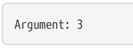

When using the LISTS keyword with foreach(), a variable name has to be given, but the ARGN provided for a macro is not a variable name. When the macro is called from inside another function, the macro ends up using the ARGN *variable* from that enclosing function, not the ARGN from the macro itself. The situation becomes clear when pasting the contents of the macro body directly into the function where it is called (which is effectively what CMake will do with it):

当将LISTS关键字与foreach()一起使用时，必须给出变量名，但为宏提供的ARGN不是变量名。当从另一个函数内部调用宏时，宏最终会使用该封闭函数中的ARGN变量，而不是宏本身的ARGN。当将宏体的内容直接粘贴到调用它的函数中时（这实际上是CMake将用它做的事情），情况就变得很清楚了：

\##-------------------------------------------------------\>\>\>

function(func)

\# Now it is clear, ARGN here will use the arguments from func

foreach(arg IN LISTS ARGN)

message("Argument: \${arg}")

endforeach()

endfunction()

\##-------------------------------------------------------\<\<\<

In such cases, consider making the macro a function instead, or if it must remain a macro then avoid treating arguments as variables. For the above example, the implementation of dangerous() could be changed to use foreach(arg IN ITEMS \${ARGN}) instead.

在这种情况下，考虑将宏设置为函数，或者如果它必须保持为宏，则避免将参数视为变量。对于上面的示例，dangerous()的实现可以更改为使用foreach(arg IN ITEMS \${ARGN})。

## 8.3. Keyword Arguments

The previous section illustrated how the ARG… variables can be used to handle a variable set of arguments. That functionality is sufficient for the simple case where only one set of variable or optional arguments is needed, but if multiple optional or variable sets of arguments must be supported, the processing becomes quite tedious. Furthermore, the basic argument handling described above is quite rigid compared to many of CMake’s own built-in commands which support keyword-based arguments and flexible argument ordering. Consider the target_link_libraries() command:

【译】上一节说明了如何使用ARG…变量来处理一组变量参数。对于只需要一组变量或可选参数的简单情况，该功能就足够了，但如果必须支持多组可选或可变参数，处理就会变得相当乏味。此外，与许多支持基于关键字的参数和灵活的参数排序的CMake内置命令相比，上述基本参数处理非常严格。考虑target_link_libraries()命令：

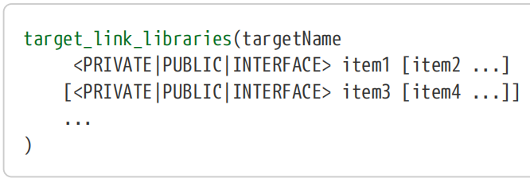

The targetName is required as the first argument, but after that, callers can provide any number of PRIVATE, PUBLIC or INTERFACE sections in any order, with each section permitted to contain any number of items. User-defined functions and macros can support the same flexibility by using the cmake_parse_arguments() command:

【译】targetName作为第一个参数是必需的，但之后，调用者可以以任何顺序提供任意数量的PRIVATE、PUBLIC或INTERFACE部分，每个部分允许包含任意数量的项目。用户定义的函数和宏可以通过使用cmake_parse_arguments()命令来支持相同的灵活性：

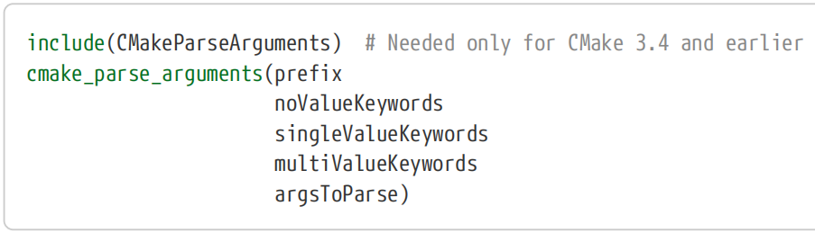

The cmake_parse_arguments() command used to be provided by the CMakeParseArguments module, but it became a built-in command in CMake 3.5. The include(CMakeParseArguments) line will do nothing in CMake 3.5 and later, while for earlier versions of CMake it will define the cmake_parse_arguments() command (see “Chapter 11, Modules” for more on this sort of usage of include()). The above form ensures the command is available regardless of what CMake version is being used.

【译】cmake_parse_arguments()命令过去由CMakeParseArguments模块提供，但它在cmake 3.5中成为内置命令。include（CMakeParseArguments）行在CMake 3.5及更高版本中什么也不做，而对于早期版本的CMake，它将定义CMake_parse_arguments()命令（有关include()的更多用法，请参阅“第11章，模块”）。上面的表单确保了无论使用哪个CMake版本，该命令都是可用的。

cmake_parse_arguments() takes the arguments supplied as the argsToParse parameter and processes them according to the specified sets of keywords. Typically, argsToParse is given as \${ARGN}, which is the set of unnamed arguments passed to the enclosing function or macro. Each of the keyword arguments is a list of keyword names supported by that function or macro, so they should each be surrounded by quotes to ensure they are parsed correctly.

【译】cmake_parse_arguments()接受作为argsToParse 参数提供的参数，并根据指定的关键字集对其进行处理。通常，argsToParse的形式为\${ARGN}，这是传递给封闭函数或宏的一组未命名参数。每个关键字参数都是该函数或宏支持的关键字名称列表，因此每个参数都应该用引号括起来，以确保正确解析。

The noValueKeywords define standalone keyword arguments which act like boolean switches. The keyword being present specifies one thing, its absence another. The singleValueKeywords each require exactly one additional argument after the keyword when they are used, whereas multiValueKeywords require zero or more additional arguments after the keyword. While not required, the prevailing convention is for keywords to be all uppercase, with words separated by underscores if required. Note, however, that keywords should not be too long or they can be cumbersome to use.

【译】noValueKeywords定义了独立的关键字参数，其作用类似于布尔开关。关键字存在表示一件事，不存在表示另一件事。\|\|\|\| 使用singleValueKeywords时，每个关键字后面都需要一个额外的参数，\|\|\|\| 而multiValueKeywords在关键字后面需要零个或多个额外的变量。虽然不是必需的，但普遍的惯例是关键字全部大写，必要时用下划线分隔单词。但是请注意，关键字不应该太长，否则使用起来可能会很麻烦。

When cmake_parse_arguments() returns, for every keyword, a corresponding variable will be available whose name consists of the specified prefix, an underscore and the keyword name. For example, with a prefix of ARG, the variable corresponding to a keyword named FOO would be ARG_FOO. If a particular keyword isn’t present in the argsToParse, its corresponding variable will be empty. An example best illustrates how the three different keyword types are defined and handled:

【译】当cmake_parse_arguments()返回时，对于每个关键字，将有一个相应的变量可用，其名称由指定的前缀、下划线和关键字名称组成。例如，如果前缀为ARG，则与名为FOO的关键字对应的变量将是ARG_FOO。如果args ToParse中不存在特定关键字，则其对应的变量将为空。一个例子最好地说明了如何定义和处理三种不同的关键字类型：

\#------------------------------------------------------\>\>\>\>\>\>

function(func)

\# Define the supported set of keywords

set(prefix ARG)

set(noValues ENABLE_NET COOL_STUFF)

set(singleValues TARGET)

set(multiValues SOURCES IMAGES)

\# Process the arguments passed in

include(CMakeParseArguments)

cmake_parse_arguments(\${prefix}

> "\${noValues}"
>
> "\${singleValues}"
>
> "\${multiValues}"
>
> \${ARGN})

\# Log details for each supported keyword

message("Option summary:")

foreach(arg IN LISTS noValues)

> if(\${\${prefix}\_\${arg}})
>
> message(" \${arg} enabled")
>
> else()
>
> message(" \${arg} disabled")
>
> endif()

endforeach()

foreach(arg IN LISTS singleValues multiValues)

> \# Single argument values will print as a simple string
>
> \# Multiple argument values will print as a list
>
> message(" \${arg} = \${\${prefix}\_\${arg}}")

endforeach()

endfunction()

\# Examples of calling with different combinations

\# of keyword arguments

func(SOURCES foo.cpp bar.cpp TARGET myApp ENABLE_NET)

func(COOL_STUFF TARGET dummy IMAGES here.png there.png gone.png)

\#------------------------------------------------------\<\<\<\<\<\<

The corresponding output would look like this:

相应的输出如下：

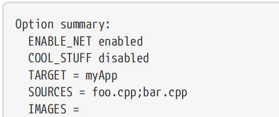

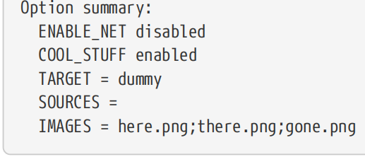

Compared to basic argument handling using named arguments and/or the ARG… variables, the advantages of cmake_parse_arguments() are numerous.【译】与使用命名参数和/或ARG…变量的基本参数处理相比，cmake_parse_arguments()的优点很多。

• Being keyword-based, the calling site has improved readability, since the arguments essentially become self-documenting. Other developers reading the call site usually won’t need to look at the function implementation or its documentation to understand what each of the arguments mean. 【译】由于基于关键字，调用站点提高了可读性，因为参数本质上是自文档化的。阅读调用站点的其他开发人员通常不需要查看函数实现或其文档来理解每个参数的含义。

• The caller gets to choose the order in which the arguments are given. 【译】调用者可以选择给出参数的顺序。

• The caller can simply omit those arguments which don’t need to be provided. 【译】调用者可以简单地省略那些不需要提供的参数。

• Since each of the supported keywords has to be passed to cmake_parse_arguments() and it is typically called near the top of the function, it is generally very clear what arguments the function supports. 【译】由于每个支持的关键字都必须传递给cmake_parse_arguments()，并且通常在函数顶部附近调用，因此通常很清楚函数支持哪些参数。

• Since parsing of the keyword based arguments is handled by the cmake_parse_arguments() command rather than from an ad hoc, manually coded parser, argument parsing bugs are virtually eliminated. 【译】由于基于关键字的参数解析是由cmake_parse_arguments()命令处理的，而不是从临时的手动编码的解析器处理的，因此几乎消除了参数解析错误。

## 8.4. Scope

A fundamental difference between functions and macros is that functions introduce a new scope, whereas macros do not. Variables defined or modified inside a function have no effect on variables of the same name outside of the function. Any policy changes made inside the function are local to the function as well, so the policy settings of the caller are not affected. The function is essentially its own self-contained sandbox, unlike a macro which has full access to the caller’s variables and policies, meaning a macro has the ability to modify the environment of its caller in ways a function cannot.

【译】函数和宏之间的一个根本区别是，函数引入了一个新的作用域，而宏则没有。函数内定义或修改的变量对函数外同名变量没有影响。在函数内部进行的任何策略更改也是函数本地的，因此调用者的策略设置不受影响。该函数本质上是一个自包含的沙箱，与宏不同，宏可以完全访问调用者的变量和策略，这意味着宏能够以函数无法做到的方式修改调用者的环境。

Unlike their C/C++ counterparts, CMake functions and macros do not support returning a value directly. Furthermore, since functions introduce their own scope, it may seem that there is no easy way to pass information back to the caller, but this is not the case. The same approach as was discussed for add_subdirectory() in Section 7.1.2, “Scope” can be used for functions too. The set() command’s PARENT_SCOPE keyword can be used to modify a variable in the caller’s scope rather than a local variable within the function. While this isn’t the same as returning a value from the function, it does allow a value (or multiple values) to be passed back to the caller.

【译】与C/C++不同，CMake函数和宏不支持直接返回值。此外，由于函数引入了自己的作用域，似乎没有简单的方法将信息传递回调用者，但事实并非如此。与第7.1.2节中讨论的add_subdirectory()方法相同，“Scope”也可用于函数。set()命令的PARENT_SCOPE关键字可用于修改调用者作用域中的变量，而不是函数中的局部变量。虽然这与从函数返回值不同，但它确实允许将一个值（或多个值）传递回调用者。

A common approach is to allow a variable name to be passed in as a function argument so that the caller is still in control of the name of variables where function results are set. This is the approach used by cmake_parse_arguments(), with its prefix argument determining the prefix of all the variable names it sets in the caller’s scope. The following example demonstrates how to implement the technique:

【译】一种常见的方法是允许将变量名作为函数参数传递，这样调用者仍然可以控制设置函数结果的变量名。这是cmake_parse_arguments()使用的方法，其前缀参数决定了它在调用者范围内设置的所有变量名的前缀。以下示例演示了如何实现该技术：

\##--------------------------------------------\>\>\>\>\>\>

function(func resultVar1 resultVar2)

set(\${resultVar1} "First result" PARENT_SCOPE)

set(\${resultVar2} "Second result" PARENT_SCOPE)

endfunction()

func(myVar otherVar)

message("myVar: \${myVar}")

message("otherVar: \${otherVar}")

\##--------------------------------------------\<\<\<\<\<\<

The output of the above would be:【译】上述输出将是：

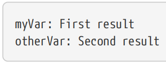

Another alternative is for a function to document the variables it sets rather than allowing the caller to specify the variable names. This is less desirable, since it reduces the flexibility of the function and opens up opportunities for variable name clashes. Where possible, it is better to use the above method to give the caller the control over variable names being set or modified.

【译】另一种选择是让函数记录它设置的变量，而不是允许调用者指定变量名。这不太可取，因为它降低了函数的灵活性，并为变量名冲突提供了机会。在可能的情况下，最好使用上述方法让调用者控制正在设置或修改的变量名。

Macros can be handled the same way as functions, specifying the names of variables to be set by passing them in as arguments. The only difference is that the PARENT_SCOPE keyword should not be used within the macro since it already modifies the variables in the caller’s scope. ////In fact, about the only reason one would use a macro instead of a function is if many variables need to be set in the calling scope. A macro will affect the calling scope with every set() call, whereas a function only affects the calling scope when PARENT_SCOPE is explicitly given to set().

【译】宏可以像函数一样处理，通过将变量作为参数传递来指定要设置的变量的名称。唯一的区别是，不应在宏中使用PARENT_SCOPE关键字，因为它已经修改了调用者作用域中的变量。事实上，使用宏而不是函数的唯一原因是需要在调用范围内设置许多变量。每次调用set()时，宏都会影响调用范围，而函数只有在显式地向set()提供PARENT_SCOPE 时才会影响调用范围。

In Section 7.3, “Ending Processing Early”, the return() statement was discussed as a way to end processing early within a file or function. As explained above, return() does not return a value, it only returns processing to the parent scope. If return() is called within a function, processing returns immediately to the caller, i.e. the rest of the function is skipped. The behavior of return() within a macro, on the other hand, is very different. Because a macro does not introduce a new scope, the behavior of the return() statement is dependent on where the macro is called. Recall that a macro effectively pastes its commands at the call site. That being the case, any return() statement from a macro will actually be returning from the scope of whatever called the macro, not from the macro itself. Consider the following example:

在第7.3节“提前结束处理”中，return()语句被讨论为在文件或函数中提前结束处理的一种方式。如上所述，return()不返回值，它只将处理返回给父作用域。如果在函数内调用return()，处理将立即返回给调用者，即跳过函数的其余部分。另一方面，宏中return()的行为非常不同。因为宏不会引入新的作用域，return()语句的行为取决于宏的调用位置。回想一下，宏在调用站点上有效地粘贴了它的命令。在这种情况下，宏中的任何return()语句实际上都是从宏的作用域返回的，而不是从宏本身返回的。考虑以下示例：

\##-------------------------------------------\>\>\>\>\>\>

macro(inner)

message("From inner")

return() \# Usually dangerous within a macro

message("Never printed")

endmacro()

function(outer)

message("From outer before calling inner")

inner()

message("Also never printed")

endfunction()

outer()

\##-------------------------------------------\<\<\<\<\<\<

The output from the above would be:【译】上述输出将是：

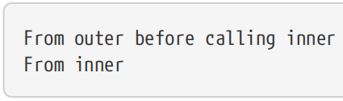

To highlight why the second message in the function body is never printed, paste the contents of the macro body into where it is called:

【译】要突出显示为什么函数体中的第二条消息永远不会打印，请将宏体的内容粘贴到调用它的位置：

\##-------------------------\>\>\>\>\>\>

function(outer)

message("From outer before calling inner")

\# === Pasted macro body ===

message("From inner")

return()

message("Never printed")

\# === End of macro body ===

message("Also never printed")

endfunction()

outer()

\##-------------------------\<\<\<\<\<\<

It is now much clearer why the return() statement causes processing to leave the function, even though it was originally called from inside the macro. This highlights the danger of using return() within macros. Because macros do not create their own scope, the result of a return() statement is often not what was expected.

【译】现在更清楚了为什么return()语句会导致处理离开函数，即使它最初是从宏内部调用的。这突显了在宏中使用return()的危险。因为宏不创建自己的作用域，return()语句的结果通常不是预期的。

## 8.5. Overriding Commands

When function() or macro() is called to define a new command, if a command already exists with that name, the undocumented CMake behavior is to make the old command available using the same name except with an underscore prepended. This applies whether the old name is for a builtin command or a custom function or macro. Developers who are aware of this behavior are sometimes tempted to exploit it to try to create a wrapper around an existing command like so:

【译】当调用function()或macro()来定义新命令时，如果已经存在同名命令，则未成文的CMake行为是使用相同的名称使旧命令可用，除非前缀有下划线。无论旧名称是用于内置命令还是自定义函数或宏，这都适用。意识到这种行为的开发人员有时会试图利用它来尝试围绕现有命令创建一个包装器，如下所示：

\##---------------------------\>\>\>\>\>\>

function(someFunc)

\# Do something...

endfunction()

\# Later in the project...

function(someFunc)

if(...)

\# Override the behavior with something else...

else()

\# WARNING: Intended to call the original command, but it is not safe

\_someFunc()

endif()

endfunction()

\##---------------------------\<\<\<\<\<\<

If the command is only ever overridden like this once, it appears to work, but if it is overridden again, then the original command is no longer accessible. The prepending of one underscore to "save" the previous command only applies to the current name, it is not applied recursively to all previous overrides. This has the potential to lead to infinite recursion, as the following contrived example demonstrates:

【译】如果命令只像这样被覆盖过一次，它似乎可以工作，但如果再次被覆盖，那么原始命令将不再可访问。在“保存”前添加一个下划线仅适用于当前名称，不会递归应用于所有先前的覆盖。这有可能导致无限递归，如以下人为示例所示：

\##---------------------------------------------------\>\>\>\>\>\>

function(printme)

message("Hello from first")

endfunction()

function(printme)

message("Hello from second")

\_printme()

endfunction()

function(printme)

message("Hello from third")

\_printme()

endfunction()

printme()

\##---------------------------------------------------\<\<\<\<\<\<

One would naively expect the output to be as follows:【译】人们会天真地期望输出如下：

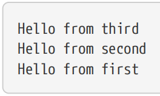

But instead, the first implementation is never called because the second one ends up calling itself in an infinite loop. When CMake processes the above, here’s what occurs:【译】但是，第一个实现永远不会被调用，因为第二个实现最终会在无限循环中调用自己。当CMake处理上述内容时，会发生以下情况：

1\. The first implementation of printme is created and made available as a command of that name. No command by that name previously existed, so no further action is required. 【译】printme的第一个实现被创建，并作为该名称的命令提供。以前不存在同名命令，因此不需要采取进一步行动。

2\. The second implementation of printme is encountered. CMake finds an existing command by that name, so it defines the name \_printme to point to the old command and sets printme to point to the new definition. 【译】遇到了printme的第二个实现。CMake通过该名称查找现有命令，因此它定义了名称_printme以指向旧命令，并将printme设置为指向新定义。

3\. The third implementation of printme is encountered. Again, CMake finds an existing command by that name, so it redefines the name \_printme to point to the old command (which is the second implementation) and sets printme to point to the new definition.【译】遇到了printme的第三个实现。同样，CMake通过该名称找到一个现有的命令，因此它重新定义了名称_printme以指向旧命令（这是第二个实现），并将printme设置为指向新定义。

When printme() is called, execution enters the third implementation, which calls \_printme(). This enters the second implementation which also calls \_printme(), but \_printme() points back at the second implementation again and infinite recursion results. Execution never reaches the first implementation.【译】当调用printme()函数时，执行流程会进入第三个实现，该实现会调用_printme()。这又会进入第二个实现，该实现同样会调用_printme()，但_printme()又再次指向第二个实现，从而引发无限递归。执行流程永远不会到达第一个实现。

In general, it is fine to override a function or macro as long as it does not try to call the previous implementation like in the above discussion. Projects should simply assume that the new implementation replaces the old one, with the old one considered to be no longer available.

【译】一般来说，重写函数或宏是可以的，只要它不像上面讨论的那样尝试调用之前的实现。项目应该简单地假设新的实现取代了旧的实现，旧的实现被认为不再可用。

## 8.6. Recommended Practices

8.6. 推荐做法

Functions and macros are a great way to re-use the same piece of CMake code throughout a project. In general, prefer to use functions rather than macros, since the use of a new scope within the function better isolates that function’s effects on the calling scope. Macros should generally only be used where the contents of the macro body really do need to be executed within the scope of the caller. These situations should generally be relatively rare. To avoid unexpected behavior, also avoid calling return() from inside a macro.

【译】函数和宏是在整个项目中重用同一段CMake代码的好方法。一般来说，更喜欢使用函数而不是宏，因为在函数中使用新的作用域可以更好地隔离该函数对调用作用域的影响。宏通常只应在宏体的内容确实需要在调用者的范围内执行的情况下使用。这些情况通常应该相对罕见。为了避免意外行为，也要避免从宏内部调用return()。

For all but very trivial functions or macros, it is highly recommended to use the keyword-based argument handling provided by cmake_parse_arguments(). This leads to better usability and improved robustness of calling code (e.g. little chance of getting arguments mixed up). It also allows the function to be more easily extended in the future because there is no reliance on argument ordering or for all arguments to always be provided, even if not relevant.

【译】对于除非常琐碎的函数或宏之外的所有函数或宏，强烈建议使用cmake_parse_arguments()提供的基于关键字的参数处理。这提高了调用代码的可用性和健壮性（例如，参数混淆的可能性很小）。它还允许该函数在未来更容易扩展，因为不依赖于参数顺序，也不需要始终提供所有参数，即使不相关。

Rather than distributing functions and macros throughout the source tree, a common practice is to nominate a particular directory (usually just below the top level of the project) where various XXX.cmake files can be collected. That directory acts like a catalog of ready-to-use functionality, able to be conveniently accessed from anywhere in the project. Each of the files can provide functions, macros, variables and other features as appropriate. Using a .cmake file name suffix allows the include() command to find the files as modules, a topic covered in detail in “Chapter 11, Modules”. It also tends to allow IDE tools to recognize the file type and apply CMake syntax highlighting. 【译】与其在整个源代码树中分发函数和宏，一种常见的做法是指定一个特定的目录（通常就在项目的顶层之下），在那里可以收集各种XXX.make文件。该目录就像一个现成功能的目录，可以从项目中的任何地方方便地访问。每个文件都可以根据需要提供函数、宏、变量和其他功能。使用.cmake文件名后缀允许include()命令将文件作为模块查找，这一主题在“第11章，模块”中有详细介绍。它还倾向于允许IDE工具识别文件类型并应用CMake语法高亮显示。

Do not define or call a function or macro with a name that starts with a single underscore. In particular, do not rely on the undocumented behavior whereby the old implementation of a command is made available by such a name when a function or macro redefines an existing command. Once a command has been overridden more than once, its original implementation is no longer accessible. This undocumented behavior may even be removed in a future version of CMake, so it should not be used. Along similar lines, do not override any builtin CMake command, consider those to be off-limits so that projects will always be able to assume the builtin commands behave as per the official documentation and there will be no opportunity for the original command to become inaccessible. 【译】不要定义或调用名称以单个下划线开头的函数或宏。特别是，不要依赖于未成文的行为，即当函数或宏重新定义现有命令时，命令的旧实现通过这样的名称可用。一旦命令被重写多次，其原始实现就不再可访问。这种未成文的行为甚至可能在CMake的未来版本中被删除，因此不应该使用。同样，不要覆盖任何内置的CMake命令，将其视为禁区，以便项目始终能够假设内置命令的行为符合官方文档，并且原始命令不会变得不可访问。
