# Ch9. Properties

Properties affect just about all aspects of the build process, from how a source file is compiled into an object file, right through to the install location of built binaries in a packaged installer. They are always attached to a specific entity, whether that be a directory, target, source file, test case, cache variable or even the overall build process itself. Rather than holding a standalone value like a variable does, a property provides information specific to the entity it is attached to.

【译】属性几乎影响构建过程的所有方面，从源文件如何编译为目标文件，一直到打包安装程序中构建二进制文件的安装位置。它们总是附加到特定的实体，无论是目录、目标、源文件、测试用例、缓存变量，还是整个构建过程本身。属性提供特定于其所附加实体的信息，而不是像变量那样保存独立值。

For those new to CMake, properties are sometimes confused with variables. Though both may initially seem similar in terms of function and features, properties serve a very different purpose. A variable is not attached to any particular entity and it is very common for projects to define and use their own variables. Compare this with properties which are typically well defined and documented by CMake and which always apply to a specific entity. A likely contributor to the confusion between the two is that a property’s default value is sometimes provided by a variable. The names CMake uses for related properties and variables usually follow the same pattern, with the variable name being the property name with CMAKE\_ prepended.

【译】对于那些刚接触CMake的人来说，属性有时会与变量混淆。虽然两者在功能和特征方面最初看起来很相似，但属性的用途却截然不同。变量不附加到任何特定的实体，项目定义和使用自己的变量是很常见的。将其与CMake通常定义良好并记录在案的属性进行比较，这些属性始终适用于特定实体。造成这两者混淆的一个可能原因是，属性的默认值有时是由变量提供的。CMake用于相关属性和变量的名称通常遵循相同的模式，变量名是前缀为CMake_的属性名。

## 9.1. General Property Commands

CMake provides a number of commands for manipulating properties. The most generic of these, set_property() and get_property(), allow setting and getting any property on any type of entity. These commands require the type of entity to be specified as command arguments along with some entity-specific information.

【译】CMake提供了许多用于操纵属性的命令。其中最通用的set_property()和get_property()允许设置和获取任何类型实体的任何属性。这些命令要求将实体的类型指定为命令参数以及一些特定于实体的信息。

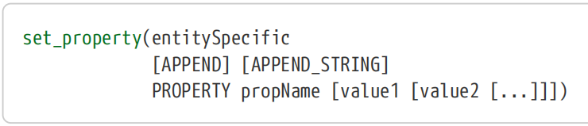

entitySpecific defines the entity whose property is being set. It must be one of the following:

【译】entitySpecific定义了正在设置其属性的实体。它必须是以下之一：

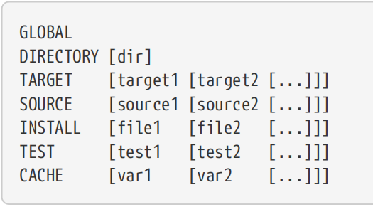

The first word of each of the above defines the type of entity whose property is being set. GLOBAL means the build itself, so there is no specific entity name required. For DIRECTORY, if no dir is named, the current source directory is used. For all the other types of entities, any number of items of that type can be listed.

【译】上述每个单词的第一个单词定义了其属性被设置的实体的类型。GLOBAL表示构建本身，因此不需要特定的实体名称。对于DIRECTORY，如果没有命名dir，则使用当前源目录。对于所有其他类型的实体，可以列出任意数量的该类型的项目。

The PROPERTY keyword marks all remaining arguments as defining the property name and its value(s). The propName would normally match one of the properties defined in the CMake documentation, a number of which are discussed in later chapters. The meaning of the value(s) are property specific. It is also permitted for a project to create new properties apart from those already defined by CMake. It would be up to the project what such project-specific properties mean and how they might affect the build. If choosing to do this, it would be wise for projects to use some project-specific prefix on the property name to avoid potential name clashes with properties defined by CMake or other third party packages.

【译】PROPERTY关键字将所有剩余参数标记为定义属性名称及其值。propName通常与CMake文档中定义的属性之一相匹配，其中一些属性将在后面的章节中讨论。值的含义因属性而异。除了CMake已经定义的属性外，项目还可以创建新的属性。这将取决于项目，这些项目特定的属性意味着什么，以及它们如何影响构建。如果选择这样做，项目最好在属性名称上使用一些特定于项目的前缀，以避免与CMake或其他第三方软件包定义的属性发生潜在的名称冲突。

The APPEND and APPEND_STRING keywords can be used to control how the named property is updated if it already has a value. With neither keyword specified, the value(s) given replace any previous value. The APPEND keyword changes the behavior to append the value(s) to the existing one, forming a list, whereas the APPEND_STRING keyword takes the existing value and appends the new value(s) by concatenating the two as strings rather than as a list (see also the special note for inherited properties further below). The following table demonstrates the differences.

【译】如果命名属性已经有值，则可以使用APPEND和APPEND_STRING关键字来控制如何更新命名属性。未指定任何关键字时，给定的值将替换之前的任何值。APPEND关键字改变了将值附加到现有值的行为，形成了一个列表，而APPEND_STRING关键字则接受现有值，并通过将两个值连接为字符串而不是列表来附加新值（另见下面关于继承属性的特别说明）。下表显示了差异。

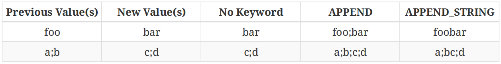

The get_property() command follows a similar form:【译】get_property()命令遵循类似的形式：

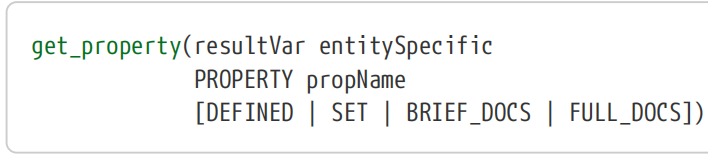

The PROPERTY keyword is always required and is always followed by the name of the property to retrieve. The result of the retrieval is stored in a variable whose name is given by resultVar. The entitySpecific part is similar to that for set_property() and must be one of the following:

【译】PROPERTY关键字始终是必需的，并且后面总是要检索的属性的名称。检索结果存储在一个变量中，该变量的名称由resultVar给出。entitySpecific部分类似于set_property()的部分，必须是以下之一：

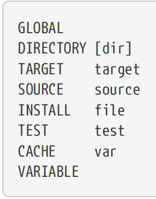

As before, GLOBAL refers to the build as a whole and therefore requires no specific entity to be named. DIRECTORY can be used with or without specifying a particular directory, with the current source directory being assumed if no directory is provided. For most of the other scopes, the particular entity within that scope must be named and the requested property attached to that entity will be retrieved.

【译】如前所述，GLOBAL是指整个构建，因此不需要命名特定的实体。DIRECTORY可以在指定或不指定特定目录的情况下使用，如果没有提供目录，则假定为当前源目录。对于大多数其他作用域，必须命名该作用域内的特定实体，并检索附加到该实体的请求属性。

The VARIABLE type is a bit different, with the variable name being specified as the propName rather than being attached to the VARIABLE keyword. This can seem somewhat unintuitive, but consider the situation if the variable was named as the entity along with the VARIABLE keyword, just like for the other entity type keywords. In that situation, there would be nothing to specify for the property name. It may help to think of VARIABLE as specifying the current scope, then the property of interest is the variable named by propName. When understood this way, VARIABLE is consistent with how the other entity types are handled.

【译】VARIABLE类型有点不同，变量名被指定为propName，而不是附加到VARIABLE关键字上。这似乎有点不直观，但考虑一下如果变量与variable关键字一起被命名为实体的情况，就像其他实体类型关键字一样。在这种情况下，属性名称没有什么可指定的。将VARIABLE视为指定当前范围可能会有所帮助，那么感兴趣的属性就是由propName命名的变量。当以这种方式理解时，VARIABLE与其他实体类型的处理方式是一致的。

If none of the optional keywords are given, the value of the named property is retrieved. This is the typical usage of the get_property() command. Note that in practice, the use of VARIABLE scope with get_property() is relatively uncommon. Variable values can be obtained directly with the \${} syntax, which is both clearer and simpler than using get_property().

【译】如果没有给出任何可选关键字，则检索命名属性的值。这是get_property()命令的典型用法。请注意，在实践中，将VARIABLE作用域与get_property()一起使用相对不常见。变量值可以直接使用\${}语法获得，这比使用get_property()更清晰、更简单。

The optional keywords can be used to retrieve details about the property other than just its value:【译】可选关键字可用于检索属性的详细信息，而不仅仅是其值：

\#\>\>\>\>\>\>\>\>\>\>\>\>\>\>\>\>\>\>\>\>\>\>\>\>\>\>\>\>\>\>\>\>\>\>\>\>\>\>\>\>\>\>\>\>\>\>\>\>

\#(1)DEFINED

The result of the retrieval will be a boolean value indicating whether or not the named property has been defined. In the case of VARIABLE scope queries, the result will only be true if the named variable has been explicitly defined with the define_property() command (see below).

【译】检索的结果将是一个布尔值，指示是否已定义命名属性。在VARIABLE范围查询的情况下，只有使用define_property()命令显式定义了命名变量，结果才会为真（见下文）。

\#(2)SET

The result of the retrieval will be a boolean value indicating whether or not the named property has been set. This is a stronger test than DEFINED in that it tests whether the named property has actually been given a value (the value itself is irrelevant). A property can return TRUE for DEFINED and FALSE for SET, or vice versa.

【译】检索的结果将是一个布尔值，指示是否已设置命名属性。这是一个比DEFINED更强的测试，因为它测试命名属性是否实际被赋予了值（值本身无关紧要）。属性可以为DEFINED返回TRUE，为SET返回FALSE，反之亦然。

\#(3)BRIEF_DOCS

Retrieves the brief documentation string for the named property. If no brief documentation has been defined for the property, the result will be the string NOTFOUND.

【译】检索命名属性的简短文档字符串。如果没有为该属性定义简短的文档，则结果将是字符串NOTFOUND。

\#(4)FULL_DOCS

Retrieves the full documentation for the named property. If no brief documentation has been defined for the property, the result will be the string NOTFOUND. 【译】检索命名属性的完整文档。如果没有为该属性定义简短的文档，则结果将是字符串NOTFOUND。

\#\<\<\<\<\<\<\<\<\<\<\<\<\<\<\<\<\<\<\<\<\<\<\<\<\<\<\<\<\<\<\<\<\<\<\<\<\<\<\<\<\<\<\<\<\<\<\<\<

Of the optional keywords, all but SET have little value unless the project has explicitly called define_property() to populate the requested information for the particular entity. This rarely used command has the following form:

【译】在可选关键字中，除了SET之外，所有关键字都没有什么价值，除非项目明确调用define_property()来填充特定实体的请求信息。这个很少使用的命令有以下形式：

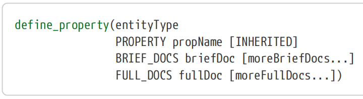

Importantly, this command does not set the property’s value, only its documentation and whether or not it inherits its value from elsewhere if it has not been set. The entityType must be one of GLOBAL, DIRECTORY, TARGET, SOURCE, TEST, VARIABLE or CACHED_VARIABLE and the propName specifies the property being defined. No entity is specified, although like for the get_property() command, in the case of VARIABLE the variable name is specified as propName. The brief docs should generally be kept to one relatively short line, while the full docs can be longer and span across multiple lines if required.

【译】重要的是，此命令不设置属性的值，只设置其文档，以及如果未设置，是否从其他地方继承其值。entityType必须是GLOBAL、DIRECTORY、TARGET、SOURCE、TEST、VARIABLE或CACHED_VARIABLE之一，propName指定要定义的属性。没有指定实体，尽管与get_property()命令一样，在VARIABLE的情况下，变量名被指定为propName。简要文档通常应保持在一行相对较短的行中，而完整文档可以更长，如果需要，可以跨越多行。

If the INHERITED option is used when defining a property, the get_property() command will chain up to the parent scope if that property is not set in the named scope. For example, if a DIRECTORY property is requested but is not set for the directory specified, its parent directory scope’s property is queried recursively up the directory scope hierarchy until the property is found or the top level of the source tree is reached. If still not found at the top level directory, then the GLOBAL scope will be searched. Similarly, if a TARGET, SOURCE or TEST property is requested but is not set for the specified entity, the DIRECTORY scope will be searched (including recursively up the directory hierarchy and ultimately to the GLOBAL scope if necessary). No such chaining functionality is provided for VARIABLE or CACHE, since these already chain to the parent variable scope by design.

【译】如果在定义属性时使用了INHERITED选项，如果该属性未在命名范围内设置，则get_property()命令将链接到父范围。例如，如果请求了DIRECTORY属性，但没有为指定的目录设置该属性，则会在目录作用域层次结构中递归查询其父目录作用域的属性，直到找到该属性或到达源树的顶层。如果在顶级目录中仍未找到，则将搜索GLOBAL范围。同样，如果请求了TARGET、SOURCE或TEST属性，但未为指定实体设置，则将搜索DIRECTORY范围（包括递归向上搜索目录层次结构，并在必要时最终搜索GLOBAL范围）。VARIABLE或CACHE没有提供这样的链接功能，因为它们已经通过设计链接到父变量范围。

The inheriting behavior of INHERITED properties only applies to the get_property() command and its analogous get\_… functions for specific property types (covered in the sections below). When calling set_property() with APPEND or APPEND_STRING options, only the immediate value of the property is considered (i.e. no inheriting occurs when working out the value to append to).

【译】INHERITED属性的继承行为仅适用于get_property()命令及其针对特定属性类型的类似get\_…函数（将在下面的部分中介绍）。当使用APPEND或APPEND_STRING选项调用set_property（）时，只考虑属性的直接值（即在计算要追加的值时不会发生继承）。

CMake has a large number of pre-defined properties of each type. Developers should consult the CMake reference documentation for the available properties and their intended purpose. In later chapters, many of these properties are discussed and their relationship to other CMake commands, variables and features are explored.

【译】CMake每种类型都有大量预定义的属性。开发人员应查阅CMake参考文档，了解可用属性及其预期用途。在后面的章节中，将讨论其中许多属性，并探讨它们与其他CMake命令、变量和功能的关系。

## 9.2. Global Properties

Global properties relate to the overall build as a whole. They are typically used for things like modifying how build tools are launched or other aspects of tool behavior, for defining aspects of how project files are structured and for providing some degree of build-level information.

【译】全局属性与整体构建有关。它们通常用于修改构建工具的启动方式或工具行为的其他方面，用于定义项目文件的结构方面，以及提供一定程度的构建级信息。

In addition to the generic set_property() and get_property() commands, CMake also provides get_cmake_property() for querying global entities. It is more than just shorthand for get_property(), although it can be used simply to retrieve the value of any global property.

【译】除了通用的set_property()和get_property()命令外，CMake还提供了get_cmake_property()来查询全局实体。它不仅仅是get_property()的简写，尽管它可以简单地用于检索任何全局属性的值。

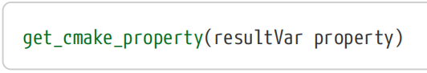

Just like for get_property(), resultVar is the name of a variable in which the value of the requested property will be stored when the command returns. The property argument can be the name of any global property or one of the following pseudo properties:

【译】就像get_property()一样，resultVar是一个变量的名称，当命令返回时，所请求属性的值将存储在该变量中。属性参数可以是任何全局属性的名称，也可以是以下伪属性之一：

\##\>\>\>\>\>\>\>\>\>\>\>\>\>\>\>\>\>\>\>\>\>\>\>\>\>\>\>\>\>\>\>\>\>\>\>\>\>\>\>\>\>\>\>

**\#(1)VARIABLES**

Return a list of all regular (i.e. non-cache) variables.

【译】返回所有常规（即非缓存）变量的列表。

**\#(2)CACHE_VARIABLES**

Return a list of all cache variables. 【译】返回所有缓存变量的列表。

**\#(3)COMMANDS**

Return a list of all defined commands, functions and macros. Commands are pre-defined by CMake, whereas functions and macros can be defined either by CMake (typically through modules) or by projects themselves. Some of the returned names may correspond to undocumented or internal entities not intended for projects to use directly. The names may be returned with different upper/lower case than the way they were originally defined.

【译】返回所有已定义命令、函数和宏的列表。命令由CMake预定义，而函数和宏可以由CMake（通常通过模块）或项目本身定义。一些返回的名称可能对应于未记录的或内部实体，这些实体不打算直接用于项目。返回的名称大小写可能与最初定义的方式不同。

**\#(4)MACROS**

Return a list of just the defined macros. This will be a subset of what the COMMANDS pseudo property would return, but note that the upper/lower case of the names can be different to what the COMMANDS pseudo property reports.

【译】返回仅包含已定义宏的列表。这将是COMMAND伪属性返回内容的一个子集，但请注意，名称的大小写可能与COMMAND伪特性报告的内容不同。

**\#(5)COMPONENTS**

Return a list of all components defined by install() commands, which is covered in “Chapter 25, Installing”. 【译】返回由install()命令定义的所有组件的列表，详见“第25章，安装”。

\##\<\<\<\<\<\<\<\<\<\<\<\<\<\<\<\<\<\<\<\<\<\<\<\<\<\<\<\<\<\<\<\<\<\<\<\<\<\<\<\<\<\<\<

These read-only pseudo properties are technically not global properties (they cannot be retrieved using get_property(), for example), but they are notionally very similar. They can only be retrieved via get_cmake_property().

【译】这些只读伪属性在技术上不是全局属性（例如，它们不能使用get_property()检索），但它们在概念上非常相似。它们只能通过get_make_property()检索。

## 9.3. Directory Properties

Directories also support their own set of properties. Logically, directory properties sit somewhere between global properties which apply everywhere and target properties which only affect individual targets. As such, directory properties mostly focus on setting defaults for target properties and overriding global properties or defaults for the current directory. A few read-only directory properties also provide a degree of introspection, holding information about how the build reached the directory, what things have been defined at that point, etc.

【译】目录还支持自己的属性集。从逻辑上讲，目录属性介于适用于所有地方的全局属性和仅影响单个目标的目标属性之间。因此，目录属性主要侧重于为目标属性设置默认值，并覆盖全局属性或当前目录的默认值。一些只读目录属性也提供了一定程度的自省，保存了关于构建如何到达目录、当时定义了什么等信息。

For convenience, CMake provides dedicated commands for setting and getting directory properties which are a little more concise than their generic counterparts. The setter command is defined as follows:

【译】为了方便起见，CMake提供了用于设置和获取目录属性的专用命令，这些命令比通用命令更简洁。setter命令定义如下：

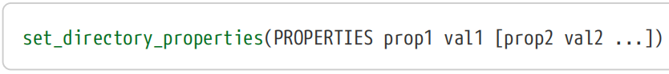

While being a little more concise, this directory-specific setter command lacks any APPEND or APPEND_STRING option. This means it can only be used to set or replace a property, it cannot be used to add to an existing property directly. A further restriction of this command compared to the more generic set_property() is that it always applies to the current directory. Projects may choose to use this more specific form where it is convenient and use the generic form elsewhere, or for consistency the more generic form may be used everywhere. Neither approach is more correct, it’s more a matter of preference.

【译】虽然更简洁一些，但这个特定于目录的setter命令缺少任何APPEND或APPEND_STRING选项。这意味着它只能用于设置或替换属性，不能直接用于添加到现有属性。与更通用的set_property()相比，此命令的另一个限制是它始终适用于当前目录。项目可以选择在方便的地方使用这种更具体的形式，并在其他地方使用通用形式，或者为了一致性，可以在任何地方使用更通用的形式。这两种方法都不正确，这更多的是一个偏好问题。

The directory-specific getter command has two forms:【译】特定于目录的getter命令有两种形式：

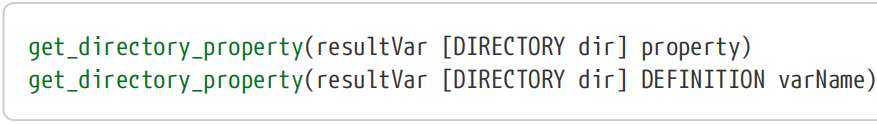

The first form is used to get the value of a property from a particular directory or from the current directory if the DIRECTORY argument is not used. The second form retrieves the value of a variable, which may not seem all that useful, but it provides a means of obtaining a variable’s value from a different directory scope other than the current one (when the DIRECTORY argument is used). In practice, this second form should rarely be needed and its use should be avoided for scenarios other than debugging the build or similar temporary tasks.

【译】第一种形式用于从特定目录或当前目录（如果不使用directory参数）获取属性的值。第二种形式检索变量的值，这可能看起来没那么有用，但它提供了一种从当前目录范围以外的其他目录范围（使用directory参数时）获取变量值的方法。在实践中，很少需要第二种形式，除了调试构建或类似的临时任务外，应避免在其他场景中使用它。

For either form of the get_directory_property() command, if the DIRECTORY argument is used, the named directory must have already been processed by CMake. It is not possible for CMake to know the properties of a directory scope it has not yet encountered.

【译】对于任何一种形式的get_directory_property()命令，如果使用了directory参数，则指定的目录必须已经由CMake处理过。CMake不可能知道它尚未遇到的目录作用域的属性。

## 9.4. Target Properties

Few things in CMake have such a strong and direct influence on how targets are built as target properties. They control and provide information about everything from the flags used to compile source files through to the type and location of the built binaries and intermediate files. Some target properties affect how targets are presented in the developer’s IDE project, while others affect the tools used when compiling/linking. In short, target properties are where most of the details about how to actually turn source files into binaries are collected and applied.

【译】CMake中很少有东西对如何将目标构建为目标属性有如此强烈和直接的影响。它们控制并提供有关所有内容的信息，从用于编译源文件的标志到构建的二进制文件和中间文件的类型和位置。一些目标属性会影响目标在开发人员的IDE项目中的呈现方式，而另一些则会影响编译/链接时使用的工具。简而言之，目标属性是收集和应用有关如何将源文件实际转换为二进制文件的大部分细节的地方。

A number of methods have evolved in CMake for manipulating target properties. In addition to the generic set_property() and get_property() commands, CMake also provides some target-specific equivalents for convenience:

【译】CMake中已经发展出许多操纵目标属性的方法。除了通用的set_property()和get_property()命令外，CMake还提供了一些特定于目标的等效命令以方便使用：

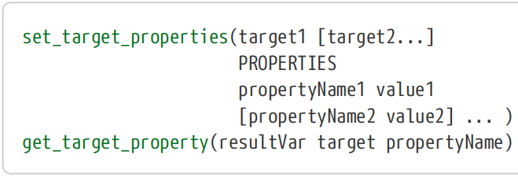

As for the set_directory_properties() command, set_target_properties() lacks the full flexibility of set_property() but provides a simpler syntax for common cases. The set_target_properties() command does not support appending to existing property values and if a list value needs to be provided for a given property, the set_target_properties() command requires that value to be specified in string form, e.g. "this;is;a;list".

【译】至于set_directory_properties()命令，set_target_properties()缺乏set_property()的全部灵活性，但为常见情况提供了更简单的语法。set_target_properties()命令不支持附加到现有属性值，如果需要为给定属性提供列表值，set_target_properties()命令要求以字符串形式指定该值，例如“this;is;a;list”。

The get_target_property() command is the simplified version of get_property(). It focuses purely on providing a simple way to obtain the value of a target property and is basically just a shorthand version of the generic command.

【译】get_target_property()命令是get_property()的简化版本。它纯粹专注于提供一种获取目标属性值的简单方法，基本上只是通用命令的简写版本。

In addition to the generic and target-specific property getters and setters, CMake also has a number of other commands which modify target properties. In particular, the family of target\_…() commands are a critical part of CMake and all but the most trivial of CMake projects would typically use them. These commands define not only properties for a particular target, they also define how that information might be propagated to other targets that link against it. “Chapter 14, Compiler And Linker Essentials” covers those commands and how they relate to target properties in depth.

【译】除了通用和特定于目标的属性getter和setter之外，CMake还有许多其他命令可以修改目标属性。特别是target\_…()命令家族是CMake的关键部分，除了最微不足道的CMake项目外，所有其他项目通常都会使用它们。这些命令不仅定义了特定目标的属性，还定义了如何将该信息传播到与其链接的其他目标。“第14章，编译器和链接器要点”深入介绍了这些命令及其与目标属性的关系。

## 9.5. Source Properties

CMake also supports properties on individual source files. These enable fine-grained manipulation of compiler flags on a file-by-file basis rather than for all of a target’s sources. They also allow additional information about the source file to be provided to modify how CMake or build tools treat the file, such as indicating whether it is generated as part of the build, what compiler to use with it, options for non-compiler tools working with the file and so on.

【译】CMake还支持单个源文件的属性。这些允许在逐个文件的基础上对编译器标志进行细粒度操作，而不是针对所有目标源。它们还允许提供有关源文件的其他信息，以修改CMake或构建工具如何处理文件，例如指示它是否是作为构建的一部分生成的，使用什么编译器，使用该文件的非编译器工具的选项等等。

Projects should rarely need to query or modify source file properties, but for those situations that require it, CMake provides dedicated setter and getter commands to make the task easier. These follow a similar pattern to the other property-specific setter and getter commands:

【译】项目应该很少需要查询或修改源文件属性，但对于需要的情况，CMake提供了专用的setter和getter命令，使任务更容易。这些命令遵循与其他特定于属性的setter和getter命令类似的模式：

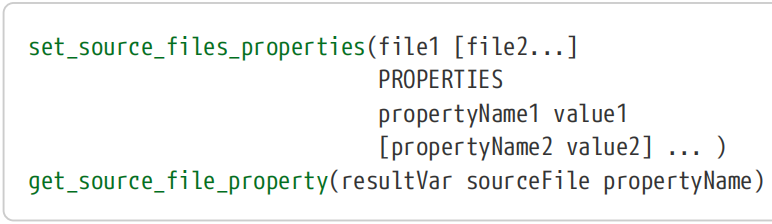

Again, no APPEND functionality is provided for the setter, while the getter is really just syntax shorthand for the generic get_property() command and offers no new functionality.

【译】同样，没有为setter提供APPEND功能，而getter实际上只是通用get_property（）命令的语法简写，没有提供任何新功能。

Projects should keep in mind that source properties are only visible to targets defined in the same directory scope. If the setting of a source property occurs in a different directory scope, the target will not see that property change and therefore the compilation, etc. of that source file will not be affected. Also keep in mind that it is possible for one source file to be compiled into multiple targets, so any source properties that are set should make sense for all targets the source is added to.

【译】项目应记住，源属性仅对同一目录范围内定义的目标可见。如果源属性的设置发生在不同的目录范围内，目标将看不到该属性的更改，因此该源文件的编译等不会受到影响。还要记住，一个源文件可能被编译成多个目标，因此设置的任何源属性都应该对源添加到的所有目标都有意义。

Before rushing to start using source properties, developers should be aware of an implementation detail which may present a strong deterent to their use in some situations. When using some CMake generators (notably the Unix Makefiles generator), the dependencies between sources and source properties are stronger than one might expect. In particular, if source properties are used to modify the compiler flags for specific source files rather than for a whole target, changing the source’s compiler flags will still result in all of the target’s sources being rebuilt, not just the affected source file. This is a limitation of how the dependency details are handled in the Makefile setup, where testing whether each individual source’s compiler flags have changed brings with it a prohibitively big performance hit, so the CMake developers chose to implement the dependency at the target level instead. A typical scenario where projects may be tempted to go down this path is to pass version details to just one or two sources as compiler definitions, but as discussed in Section 19.2, “Source Code Access To Version Details”, there are better alternatives to source properties which do not suffer from the same side effects.

【译】在急于开始使用源属性之前，开发人员应该了解一个实现细节，这可能会在某些情况下对其使用产生强烈的阻碍。当使用一些CMake生成器（特别是Unix Makefiles生成器）时，源代码和源代码属性之间的依赖关系比人们预期的要强。特别是，如果使用源属性来修改特定源文件而不是整个目标的编译器标志，更改源的编译器标志仍将导致重建目标的所有源，而不仅仅是受影响的源文件。这是Makefile设置中处理依赖关系细节的一个限制，在Makefile安装中，测试每个源代码的编译器标志是否发生了变化会带来巨大的性能损失，因此CMake开发人员选择在目标级别实现依赖关系。项目可能会沿着这条路走下去的一个典型情况是，将版本详细信息作为编译器定义传递给一两个源，但正如第19.2节“源代码访问版本详细信息”中所讨论的那样，有更好的替代方案来代替源属性，这些属性不会受到同样的副作用。

## 9.6. Cache Variable Properties

Properties on cache variables are a little different in purpose to other property types. For the most part, cache variable properties are aimed more at how the cache variables are handled in the CMake GUI and the console-based ccmake tool rather than affecting the build in any tangible way. There are also no extra commands provided for manipulating them, so the generic set_property() and get_property() commands must be used with the CACHE keyword.

【译】缓存变量上的属性在用途上与其他属性类型略有不同。在大多数情况下，缓存变量属性更多地针对CMake GUI和基于控制台的ccmake工具中如何处理缓存变量，而不是以任何有形的方式影响构建。也没有提供额外的命令来操纵它们，因此通用的set_property()和get_property()命令必须与CACHE关键字一起使用。

In Section 5.3, “Cache Variables”, a number of aspects of cache variables were discussed which are ultimately reflected in the cache variable properties.【译】在第5.3节“缓存变量”中，讨论了缓存变量的多个方面，这些方面最终反映在缓存变量属性中。

\#\>\>\>\>\>\>\>\>\>\>\>\>\>\>\>\>\>\>\>\>\>\>\>\>\>\>\>\>\>\>\>\>\>\>\>\>\>\>\>\>\>\>\>\>\>\>\>

• Each cache variable has a *type*, which must be one of BOOL, FILEPATH, PATH, STRING or INTERNAL. This type can be obtained using get_property() with the property name TYPE. The type affects how the CMake GUI and ccmake present that cache variable in the UI and what kind of widget is used for editing its value. Any variable with type INTERNAL will not be shown in either the CMake GUI or ccmake. 【译】每个缓存变量都有一个类型，该类型必须是BOOL、FILEPATH、PATH、STRING或INTERNAL之一。可以使用属性名为type的get_property()获得此类型。该类型影响CMake GUI和ccmake在UI中显示缓存变量的方式，以及用于编辑其值的小部件类型。任何类型为INTERNAL的变量都不会在CMake GUI或ccmake中显示。

• A cache variable can be marked as advanced with the mark_as_advanced() command, which is really just setting the boolean ADVANCED cache variable property. The CMake GUI and the ccmake tool both provide an option to show or hide advanced cache variables, allowing the user to choose whether to focus on just the main basic variables or to see the full set of non-internal variables. 【译】缓存变量可以用mark_as_advanced()命令标记为高级，这实际上只是设置布尔advanced缓存变量属性。CMake GUI和ccmake工具都提供了显示或隐藏高级缓存变量的选项，允许用户选择是只关注主要的基本变量还是查看完整的非内部变量。

• The help string of a cache variable is typically set as part of a call to the set() command, but it can also be modified or read using the HELPSTRING cache variable property. This help string is used as the tooltip in the CMake GUI and as a one-line help tip in the ccmake tool. 【译】缓存变量的帮助字符串通常在调用set()命令时设置，但也可以使用HELPSTRING缓存变量属性修改或读取。此帮助字符串用作CMake GUI中的工具提示，也用作ccmake工具中的单行帮助提示。

• If a cache variable is of type STRING, then CMake GUI will look for a cache variable property named STRINGS. If not empty, it is expected to be a list of valid values for the variable and CMake GUI will then present that variable as a combo box of those values rather than an arbitrary text entry widget. In the case of ccmake, pressing enter on that cache variable will cycle through the values provided. Note that CMake does not enforce that the cache variable must be one of the values from the STRINGS property, it is only a convenience for the CMake GUI and ccmake tools. When CMake runs its configure step, it still treats the cache variable as an arbitrary string, so it is still possible to give the cache variable any value either at the cmake command line or via set() commands in the project. 【译】如果缓存变量的类型为STRING，那么CMake GUI将查找名为STRINGS的缓存变量属性。如果不是空的，它应该是变量的有效值列表，CMake GUI会将该变量显示为这些值的组合框，而不是任意的文本输入小部件。在ccmake的情况下，按该缓存变量上的enter键将循环显示提供的值。请注意，CMake并不强制缓存变量必须是STRINGS属性中的值之一，这只是为了方便CMake GUI和ccmake工具。当CMake运行其配置步骤时，它仍然将缓存变量视为任意字符串，因此仍然可以在CMake命令行或通过项目中的set()命令为缓存变量赋予任何值。

\#\<\<\<\<\<\<\<\<\<\<\<\<\<\<\<\<\<\<\<\<\<\<\<\<\<\<\<\<\<\<\<\<\<\<\<\<\<\<\<\<\<\<\<\<\<\<\<

## 9.7. Other Property Types

CMake also supports properties on individual tests and it provides the usual test-specific versions of the property setter and getter commands: 【译】CMake还支持单个测试的属性，并提供了属性setter和getter命令的常见测试特定版本：

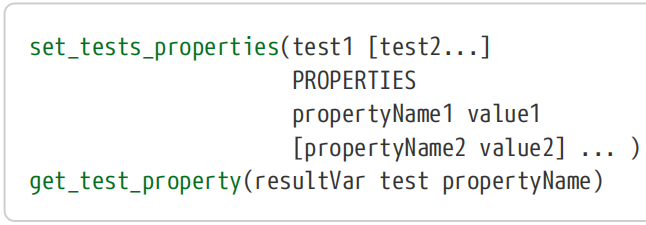

Like their equivalent counterparts, these are just slightly more concise versions of the generic commands which lack APPEND functionality but may be more convenient in some circumstances. Tests are discussed in detail in “Chapter 24, Testing”.

【译】与它们的等效版本一样，这些只是通用命令的稍微简洁的版本，缺乏APPEND功能，但在某些情况下可能更方便。“**第24章，测试**”详细讨论了测试。

The other type of property CMake supports is for installed files. These properties are specific to the type of packaging being used and are typically not needed by most projects.

【译】CMake支持的另一种属性是用于已安装的文件。这些属性特定于所使用的包装类型，大多数项目通常不需要这些属性。

## 9.8. Recommended Practices

Properties are a crucial part of CMake. A range of commands have the ability to set, modify or query the various types of properties, some of which have further implications for dependencies between projects. 【译】属性是CMake的重要组成部分。一系列命令能够设置、修改或查询各种类型的属性，其中一些对项目之间的依赖关系有进一步的影响。

• All but the special global pseudo properties can be fully manipulated using the generic set_property() command, making it predictable for developers and offering flexible APPEND functionality where needed. The property specific setters may be more convenient in some situations, such as allowing multiple properties to be set at once, but their lack of APPEND functionality may steer some projects towards just using set_property(). Neither is right or wrong, although a common mistake is to use the property-specific commands to replace a property value instead of appending to it. 【译】除了特殊的全局伪属性外，所有其他属性都可以使用通用的set_property()命令进行完全操纵，使其对开发人员来说是可预测的，并在需要时提供灵活的APPEND功能。在某些情况下，特定于属性的设置器可能更方便，例如允许一次设置多个属性，但它们缺乏APPEND功能可能会使一些项目只使用set_property()。两者都没有对错之分，尽管一个常见的错误是使用特定于属性的命令替换属性值，而不是附加到属性值上。

• For target properties, use of the various target\_…() commands is strongly recommended over manipulating the associated target properties directly. These commands not only manipulate the properties on specific targets, they also set up dependency relationships between targets so that CMake can propagate some properties automatically. “Chapter 14, Compiler And Linker Essentials” discusses a range of topics which highlight the strong preference for the target\_…() commands. 【译】对于目标属性，强烈建议使用各种target\_…()命令，而不是直接操纵相关的目标属性。这些命令不仅可以操纵特定目标上的属性，还可以在目标之间建立依赖关系，以便CMake可以自动传播一些属性。“第14章，编译器和链接器要点”讨论了一系列主题，突出了对target\_…()命令的强烈偏好。

• Source properties offer a fine granularity on the level of control of compiler options, etc. These do, however, have the potential for undesirable negative impacts on the build behavior of a project. In particular, some CMake generators may rebuild more than should be necessary when compile options for only a few source files change. Projects should consider using other alternatives to source properties where available, such as the techniques given in Section 19.2, “Source Code Access To Version Details”. 【译】源属性在编译器选项等的控制级别上提供了精细的粒度。然而，这些确实有可能对项目的构建行为产生不良的负面影响。特别是，当只有少数源文件的编译选项发生变化时，一些CMake生成器可能会重建超出必要范围的内容。项目应考虑在可用的情况下使用源代码属性的其他替代方案，例如第19.2节“源代码访问版本详细信息”中给出的技术。
