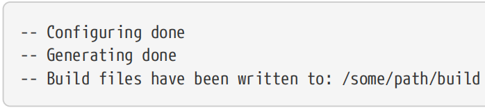
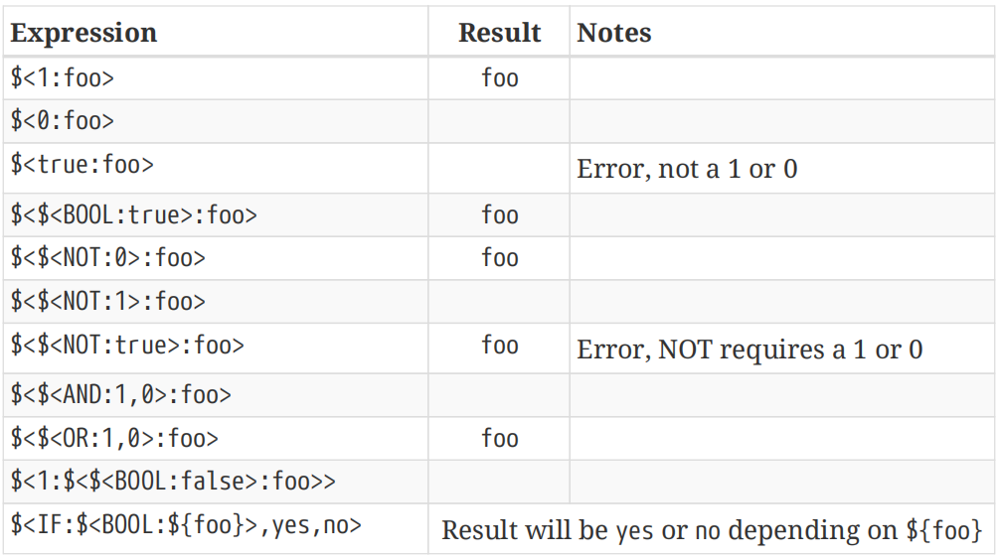

# Ch10. Generator Expressions

When running CMake, developers tend to think of it as a single step which involves reading the project’s CMakeLists.txt file and producing the relevant set of generator-specific project files (e.g. Visual Studio solution and project files, an Xcode project, Unix Makefiles or Ninja input files). There are, however, two quite distinct steps involved. When running CMake, the end of the output log typically looks something like this:

【译】在运行CMake时，开发人员倾向于将其视为一个步骤，即读取项目的CMakeLists.txt文件并生成相关的特定于生成器的项目文件集（例如Visual Studio解决方案和项目文件、Xcode项目、Unix Makefiles或Ninja输入文件）。然而，这涉及两个截然不同的步骤。运行CMake时，输出日志的末尾通常看起来像这样：

When CMake is invoked, it first reads in and processes the CMakeLists.txt file at the top of the source tree, including any other files it pulls in. An internal representation of the project is created as the commands, functions, etc. are executed. This is called the configure step. Most of the output to the console log is produced during this stage, including any content from message() commands. At the end of the configure step, the -- Configuring done message is printed to the log.

【译】当调用CMake时，它首先读取并处理源代码树顶部的CMakeLists.txt文件，包括它拉入的任何其他文件。在执行命令、函数等时，会创建项目的内部表示。这被称为配置步骤。控制台日志的大部分输出都是在这个阶段产生的，包括来自message()命令的任何内容。在配置步骤结束时，--Configuring done消息将打印到日志中。

Once CMake has finished reading and processing the CMakeLists.txt file, it then performs the generation step. This is where the build tool’s project files are created using the internal representation built up in the configure step. For the most part, developers tend to ignore the generation step and just think of it as the end result of configuration. The console log almost always shows the -- Generating done message immediately after the configure step completes, so this is understandable. But there are situations where understanding the separation into two distinct phases is particularly important.

【译】一旦CMake完成了对CMakeLists.txt文件的读取和处理，它就会执行生成步骤。这是使用配置步骤中构建的内部表示创建构建工具的项目文件的地方。在大多数情况下，开发人员倾向于忽略生成步骤，只将其视为配置的最终结果。控制台日志几乎总是在配置步骤完成后立即显示--Generate done消息，因此这是可以理解的。但在某些情况下，理解分为两个不同阶段尤为重要。

Consider a project processed for a multi configuration CMake generator like Xcode or Visual Studio. When the CMakeLists.txt files are being read, CMake doesn’t know which configuration a target will be built for. It is a multi configuration setup, so there’s more than one choice (e.g. Debug, Release, etc.). The developer selects the configuration at build time, well after CMake has finished. This would seem to present a problem if the CMakeLists.txt file wants to do something like copy a file to the same directory as the final executable for a given target, since the location of that directory depends on which configuration is being built. Some kind of placeholder is needed to tell CMake "For whichever configuration is being built, use the directory of the final executable".

【译】考虑一个为Xcode或Visual Studio等多配置CMake生成器处理的项目。当读取CMakeLists.txt文件时，CMake不知道将为哪种配置构建目标。这是一个多配置设置，因此有多个选择（例如调试、发布等）。开发人员在CMake完成后的构建时选择配置。如果CMakeLists.txt文件想要将文件复制到与给定目标的最终可执行文件相同的目录中，这似乎是一个问题，因为该目录的位置取决于正在构建的配置。需要某种占位符来告诉CMake“对于正在构建的任何配置，使用最终可执行文件的目录”。

This is a prime example of the functionality provided by generator expressions. They provide a way to encode some logic which is not evaluated at configure time, the evaluation is instead delayed until the generation phase when the project files are being written. They can be used to perform conditional logic, output strings providing information about various aspects of the build like directories, names of things, platform details and more. They can even be used to provide different content based on whether a build or an install is being performed.

【译】这是生成器表达式所提供功能的一个典型示例。它们提供了一种对某些逻辑进行编码的方法，这些逻辑在配置时不会被评估，而是被延迟到编写项目文件的生成阶段。它们可用于执行条件逻辑，输出字符串，提供有关构建各个方面的信息，如目录、事物名称、平台详细信息等。它们甚至可以根据正在执行的是构建还是安装来提供不同的内容。

Generator expressions cannot be used everywhere, but they are supported in many places. In the CMake reference documentation, if a particular command or property supports generator expressions, the documentation will mention it. The set of properties supporting generator expressions have expanded over time, with some CMake releases also expanding the set of supported expressions. Projects should confirm that for the minimum CMake version they require, the properties being modified do indeed support the generator expressions used.

【译】生成器表达式不能在任何地方使用，但在许多地方都支持它们。在CMake参考文档中，如果特定命令或属性支持生成器表达式，文档会提到它。支持生成器表达式的属性集随着时间的推移而扩展，一些CMake版本也扩展了支持的表达式集。项目应确认，对于他们所需的最低CMake版本，所修改的属性确实支持所使用的生成器表达式。

## 10.1. Simple Boolean Logic

A generator expression is specified using the syntax \$\<…\> where the content between the angle brackets can take a few different forms. As will become clear shortly, an essential feature is the conditional inclusion of content. The most basic generator expressions which enable this are the following:

【译】生成器表达式使用语法\$\<…\>指定，其中尖括号之间的内容可以采用几种不同的形式。很快就会清楚，一个基本特征是有条件地包含内容。实现此功能的最基本生成器表达式如下：

\`\`\`cmake

\$\<1:...\>

\$\<0:...\>

\$\<BOOL:...\>

\`\`\`

For \$\<1:…\>, the result of the expression will be the … part, whereas for \$\<0:…\>, the … part is ignored and the expression results in an empty string. The \$\<BOOL:…\> expression can be used to convert anything CMake recognizes as a boolean false value into 0 and everything else to 1 (for details on what CMake considers a false value, see the discussion in Section 6.1.1, “Basic Expressions”). Together, these generator expressions provide a simple yet powerful way to optionally include content. Logical operations are also supported:

【译】对于\$\<1:…\>，表达式的结果将是…部分，而对于\$\<0:…\>，忽略…部分，表达式将产生一个空字符串。\$\<BOOL:…\>表达式可用于将CMake识别为布尔假值的任何内容转换为0，并将其他所有内容转换为1（有关CMake认为假值的详细信息，请参阅第6.1.1节“基本表达式”中的讨论）。这些生成器表达式共同提供了一种简单而强大的方式来选择性地包含内容。还支持逻辑操作：

\`\`\`cmake

\$\<AND:expr\[,expr...\]\>

\$\<OR:expr\[,expr...\]\>

\$\<NOT:expr\>

\`\`\`

Each expr is expected to evaluate to either 1 or 0. The AND and OR expressions can take any number of comma-separated arguments and provide the corresponding logic result, while NOT accepts only a single expression and will yield the negation of its argument. Because AND, OR and NOT require that their expressions evaluate to only 0 or 1, consider wrapping those expressions in a \$\<BOOL:…\> to force more tolerant logic of what is considered a true or false expression.

【译】每个expr的计算结果应为1或0。AND和OR表达式可以接受任意数量的逗号分隔的参数并提供相应的逻辑结果，而NOT只接受一个表达式，并将产生其参数的否定。因为AND、OR和NOT要求它们的表达式只计算0或1，所以考虑将这些表达式包装在\$\<BOOL:…\>中，以强制对被认为是真或假的表达式进行更宽容的逻辑处理。

With CMake 3.8 and later, if-then-else logic can also be expressed very conveniently using a dedicated \$\<IF:…\> expression:【译】使用CMake 3.8及更高版本，if-then-else逻辑也可以使用专用的\$\<if:…\>表达式非常方便地表示：

\`\`\`cmake

\$\<IF:expr,val1,val0\>

\`\`\`

As usual, the expr must evaluate to 1 or 0. The result is val1 if expr evalutes to 1 and val0 if expr evaluates to 0. Before CMake 3.8, equivalent logic would have to be expressed in the following more verbose way that requires the expression to be given twice:

【译】像往常一样，expr必须计算为1或0。如果expr的计算结果为1，则结果为val1；如果expr计算结果为0，结果为val0。在CMake 3.8之前，等效逻辑必须以以下更详细的方式表示，这需要给出两次表达式：

\`\`\`cmake

\$\<expr:val1\>\$\<\$\<NOT:expr\>:val0\>

\`\`\`

Generator expressions can be nested, allowing expressions of arbitrary complexity to be constructed. The above example shows a nested condition, but any part of a generator expression can be nested. The following examples demonstrate the features discussed so far:

【译】生成器表达式可以嵌套，允许构造任意复杂度的表达式。上面的示例显示了嵌套条件，但生成器表达式的任何部分都可以嵌套。以下示例演示了到目前为止讨论的功能：

Just like for the if() command, CMake also provides support for testing strings, numbers and versions in generator expressions, although the syntax is slightly different. The following all evaluate to 1 if the respective condition is satisfied, or 0 otherwise.

【译】与if()命令一样，CMake还支持在生成器表达式中测试字符串、数字和版本，尽管语法略有不同。如果满足相应条件，则以下所有值均为1，否则为0。

\#--------------------------------------------\>\>\>\>\>\>

\$\<STREQUAL:string1,string2\>

\$\<EQUAL:number1,number2\>

\$\<VERSION_EQUAL:version1,version2\>

\$\<VERSION_GREATER:version1,version2\>

\$\<VERSION_LESS:version1,version2\>

\#--------------------------------------------\<\<\<\<\<\<

Another very useful conditional expression is testing the build type:

【译】另一个非常有用的条件表达式是测试构建类型：

\`\`\`cmake

\$\<CONFIG:arg\>

\`\`\`

This will evaluate to 1 if arg corresponds to the build type actually being built and 0 for all other build types. Common uses of this would be to provide compiler flags only for debug builds or to select different implementations for different build types. For example:

【译】如果arg对应于实际构建的构建类型，则其计算结果为1，对于所有其他构建类型，其计算结果将为0。其常见用途是仅为调试构建提供编译器标志，或为不同的构建类型选择不同的实现。例如：

\#---------------------------------------------\>\>\>\>\>\>

add_executable(myApp src1.cpp src2.cpp)

\# Before CMake 3.8

target_link_libraries(myApp PRIVATE

\$\<\$\<CONFIG:Debug\>:checkedAlgo\>

\$\<\$\<NOT:\$\<CONFIG:Debug\>\>:fastAlgo\>

)

\# CMake 3.8 or later allows a more concise form

target_link_libraries(myApp PRIVATE

\$\<IF:\$\<CONFIG:Debug\>,checkedAlgo,fastAlgo\>

)

\#---------------------------------------------\<\<\<\<\<\<

The above would link the executable to the checkedAlgo library for Debug builds and to the fastAlgo library for all other build types. The \$\<CONFIG:…\> generator expression is the only way to robustly provide such functionality which works for all CMake project generators, including multi configuration generators like Xcode or Visual Studio. This particular topic is covered in more detail in Section 13.2, “Common Errors”.

【译】上面的代码将可执行文件链接到用于调试构建的checkedAlgo库，以及用于所有其他构建类型的fastAlgo库。\$\<CONFIG:…\>生成器表达式是可靠地提供此类功能的唯一方法，适用于所有CMake项目生成器，包括Xcode或Visual Studio等多配置生成器。第13.2节“常见错误”更详细地介绍了这一特定主题。

CMake offers even more conditional tests based on things like platform and compiler details, CMake policy settings, etc. Developers should consult the CMake reference documentation for the full set of supported conditional expressions.

【译】CMake提供了更多基于平台和编译器细节、CMake策略设置等的条件测试。开发人员应参考CMake参考文档，了解支持的全套条件表达式。

## 10.2. Target Details

Another common use of generator expressions is to provide information about targets. Any property of a target can be obtained with one of the following two forms:

【译】生成器表达式的另一个常见用途是提供有关目标的信息。目标的任何属性都可以通过以下两种形式之一获得：

\`\`\`cmake

\$\<TARGET_PROPERTY:target,property\>

\$\<TARGET_PROPERTY:property\>

\`\`\`

The first form provides the value of the named property from the specified target, while the second form will retrieve the property from the target on which the generator expression is being used.

【译】第一种形式提供指定目标中命名属性的值，而第二种形式将从使用生成器表达式的目标中检索该属性。

While TARGET_PROPERTY is a very flexible expression type, it is not always the best way to obtain information about a target. For example, CMake also provides other expressions which give details about the directory and file name of a target’s built binary. These more direct expressions take care of extracting out parts of some properties or computing values based on raw properties. The most general of these is the TARGET_FILE set of generator expressions:

【译】虽然TARGET_PROPERTY是一种非常灵活的表达式类型，但它并不总是获取目标信息的最佳方式。例如，CMake还提供了其他表达式，这些表达式详细说明了目标构建的二进制文件的目录和文件名。这些更直接的表达式负责提取某些属性的部分或基于原始属性计算值。其中最通用的是TARGET_FILE生成器表达式集：

\#\>\>\>\>\>\>\>\>\>\>\>\>\>\>\>\>\>\>\>\>\>\>\>\>\>\>\>\>\>\>\>\>\>\>\>\>\>\>\>\>\>\>

**\#(1)TARGET_FILE**

This will yield the absolute path and file name of the target’s binary, including any file prefix and suffix if relevant for the platform (e.g .exe, .dylib). For Unix-based platforms where shared libraries typically have version details in their file name, these will also be included.

【译】这将产生目标二进制文件的绝对路径和文件名，包括与平台相关的任何文件前缀和后缀（例如.exe、.dylib）。对于基于Unix的平台，共享库的文件名中通常包含版本详细信息，这些信息也将被包括在内。

**\#(2)TARGET_FILE_NAME**

Same as TARGET_FILE but without the path (i.e. it provides just the file name part).

【译】与TARGET_FILE相同，但没有路径（即它只提供**文件名部分**）。

**\#(3)TARGET_FILE_DIR**

Same as TARGET_FILE but without the file name. This is the most robust way to obtain the directory in which the final executable or library is built. It’s value is different for different build configurations when using a multi configuration generator like Xcode or Visual Studio.

【译】与TARGET_FILE相同，但没有文件名。这是获取**构建最终可执行文件或库的目录**的最可靠方法。当使用Xcode或Visual Studio等多配置生成器时，它的值对于不同的构建配置是不同的。

\#\<\<\<\<\<\<\<\<\<\<\<\<\<\<\<\<\<\<\<\<\<\<\<\<\<\<\<\<\<\<\<\<\<\<\<\<\<\<\<\<\<\<

The above three TARGET_FILE expressions are especially useful when defining custom build rules for copying files around in post build steps (see Section 17.2, “Adding Build Steps To An Existing Target”). In addition to the TARGET_FILE expressions, CMake also provides some library-specific expressions which have similar roles except they handle file name prefix and/or suffix details slightly differently. These expressions have names starting with TARGET_LINKER_FILE and TARGET_SONAME_FILE and tend not to be used as frequently as the TARGET_FILE expressions.

【译】在定义用于在构建后步骤中复制文件的自定义构建规则时，上述三个TARGET_FILE表达式特别有用（见第17.2节“向现有目标添加构建步骤”）。除了TARGET_FILE表达式外，CMake还提供了一些特定于库的表达式，这些表达式具有相似的角色，除了它们处理文件名前缀和/或后缀细节略有不同。这些表达式的名称以**TARGET_LINKER_FILE**和**TARGET_SONAME_FILE**开头，使用频率往往不如TARGET_FILE表达式。

Projects supporting the Windows platform can also obtain details about PDB files for a given target. Again, these would mostly find use in custom build tasks. Expressions starting with TARGET_PDB_FILE follow an analogous pattern as for TARGET_PROPERTY, providing path and file name details for the PDB file used for the target on which the generator expression is being used.

【译】支持Windows平台的项目还可以**获取给定目标的PDB文件**的详细信息。同样，这些主要用于自定义构建任务。以**TARGET_PDB_FILE**开头的表达式遵循与TARGET_PROPERTY类似的模式，为正在使用生成器表达式的目标所使用的PDB文件提供路径和文件名详细信息。

One other generator expression relating to targets deserves special mention. CMake allows a library target to be defined as an object library, meaning it isn’t a library in the usual sense, it is just a collection of object files that CMake associates with a target but doesn’t actually result in a final library file being created. Because they are object files, they cannot be linked to as a single unit (although CMake 3.12 relaxes this restriction). They instead have to be added to targets in the same way that sources are added. CMake then includes those object files at the link stage just like the object files created by compiling that target’s sources. This is done using the \$\<TARGET_OBJECTS:…\> generator expression which lists the object files in a form suitable for add_executable() or add_library() to consume.

【译】另一个与目标相关的生成器表达式值得特别提及。CMake允许将库目标定义为对象库，这意味着它不是通常意义上的库，它只是CMake与目标关联的对象文件的集合，但实际上并不会创建最终的库文件。因为它们是对象文件，所以不能作为单个单元链接（尽管CMake 3.12放宽了这一限制）。相反，它们必须以添加源的方式添加到目标中。CMake然后在链接阶段包含这些对象文件，就像编译目标源代码创建的对象文件一样。这是使用\$\<TARGET_OBJECTS:…\>生成器表达式完成的，该表达式以适合add_executable()或add_library()使用的形式列出对象文件。

\#-------------------------------------\>\>\>\>\>\>

\# Define an object library

add_library(objLib **OBJECT** src1.cpp src2.cpp)

\# Define two executables which each have their own source

\# file as well as the object files from objLib

add_executable(app1 app1.cpp \$\<TARGET_OBJECTS:objLib\>)

add_executable(app2 app2.cpp \$\<TARGET_OBJECTS:objLib\>)

\#-------------------------------------\<\<\<\<\<\<

In the above example, no separate library is created for objLib, but the src1.cpp and src2.cpp source files are still only compiled once. This can be more convenient for some builds because it can avoid the build time cost of creating a static library or the run time cost of symbol resolution for a dynamic library, yet still avoid having to compile the same sources multiple times.

【译】在上面的示例中，没有为objLib创建单独的库，但src1.cpp和src2.cpp源文件仍然只编译一次。这对于某些构建来说可能更方便，因为它可以避免创建静态库的构建时成本或动态库的符号解析的运行时成本，但仍然**避免了多次编译相同的源代码**。

## 10.3. General Information

Generator expressions can provide information about more than just targets. Information can be obtained about the compiler being used, the platform for which the target is being built, the name of the build configuration and more. These sort of expressions tend to find use in more advanced situations such as handling a custom compiler or to work around a problem specific to a particular compiler or toolchain. These expressions also invite misuse, since they may appear to provide a way to do things like construct paths to things which could otherwise have been obtained using more robust methods like using TARGET_FILE expressions or other CMake features. Developers should think carefully before relying on the more general information generator expressions as a way to solve a problem. That said, some of these expressions do have valid uses. Some of the more common ones and a couple of utility expressions are listed here as a starting point for further reading:

【译】生成器表达式可以提供的信息不仅仅是目标。可以获得有关正在使用的编译器、构建目标的平台、构建配置的名称等信息。这类表达式往往在更高级的情况下使用，例如处理自定义编译器或解决特定编译器或工具链特有的问题。这些表达式也会引起误用，因为它们似乎提供了一种方法来做一些事情，比如构造事物的路径，否则这些路径本可以使用更稳健的方法获得，比如使用TARGET_FILE表达式或其他CMake功能。在依赖更通用的信息生成器表达式来解决问题之前，开发人员应该仔细考虑。也就是说，其中一些表达确实有有效的用途。这里列出了一些更常见的表达式和几个实用表达式，作为进一步阅读的起点：

\#\>\>\>\>\>\>\>\>\>\>\>\>\>\>\>\>\>\>\>\>\>\>\>\>\>\>\>\>\>\>\>\>\>\>\>\>\>

### 10.3.1 \$\<CONFIG\> 

Evaluates to the build type. Use this in preference to the CMAKE_BUILD_TYPE variable since that variable is not used on multi configuration project generators like Xcode or Visual Studio. Earlier versions of CMake used the now deprecated \$\<CONFIGURATION\> expression for this, but projects should now only use \$\<CONFIG\>.

【译】根据构建类型进行评估。优先使用此变量，而不是CMAKE_BUILD_TYPE变量，因为该变量在Xcode或Visual Studio等多配置项目生成器上不使用。早期版本的CMake为此使用了现已弃用的\$\<CONFIGURATION\>表达式，但项目现在应该只使用\$\<CONFIG\>。

### 10.3.2 **\$\<PLATFORM_ID\>** 

Identifies the platform for which the target is being built. This can be useful in cross-compiling situations, especially where a build may support multiple platforms (e.g. device and simulator builds). This generator expression is closely related to the CMAKE_SYSTEM_NAME variable and projects should consider whether using that variable would be simpler in their specific situation.

【译】标识构建目标的平台。这在交叉编译的情况下非常有用，特别是在构建可能支持多个平台的情况下（例如设备和模拟器构建）。此生成器表达式与CMAKE_SYSTEM_NAME变量密切相关，项目应考虑在特定情况下使用该变量是否更简单。

### 10.3.3\$\<C_COMPILER_VERSION\>, \<CXX_COMPILER_VERSION\> 

In some situations, it may be useful to only add content if the compiler version is older or newer than some particular version. This is achievable with the help of the \$\<VERSION\_???:…\> generator expressions. For example, to produce the string OLD_COMPILER if the C++ compiler version is less than 4.2.0, the following expression could be used:

【译】在某些情况下，只有当编译器版本比某个特定版本旧或新时，才添加内容可能有用。这可以在\$\<VERSION\_???:…\>的帮助下实现生成器表达式。例如，如果C++编译器版本低于4.2.0，要生成字符串OLD_COMPILER，可以使用以下表达式：

\`\`\`cmake

\$\<\$\<VERSION_LESS:\$\<CXX_COMPILER_VERSION\>,4.2.0\>:OLD_COMPILER\>

\`\`\`

Such expressions tend to be used only in situations where the type of compiler is known and a specific behavior of the compiler needs to be handled in some special way by the project. It can be a useful technique in specific situations, but it can reduce the portability of the project if it relies too heavily on such expressions.

【译】此类表达式往往仅在编译器类型已知且项目需要以某种特殊方式处理编译器特定行为的情况下使用。在特定情况下，这可能是一种有用的技术，但如果过于依赖此类表达式，则会降低项目的可移植性。

### 10.3.4\$\<LOWER_CASE:…\>, \$\<UPPER_CASE:…\> 

Any content can be converted to lower or upper case via these expressions. This can be especially useful as a step before performing a string comparison. For example:

【译】任何内容都可以通过这些表达式转换为小写或大写。作为执行字符串比较之前的一个步骤，这可能特别有用。例如：

\`\`\`cmake

\$\<STREQUAL:\$\<UPPER_CASE:\${someVar}\>,FOOBAR\>

\`\`\`

\#\<\<\<\<\<\<\<\<\<\<\<\<\<\<\<\<\<\<\<\<\<\<\<\<\<\<\<\<\<\<\<\<\<\<\<\<\<

## 10.4. Recommended Practices

Compared to other functionality, generator expressions are a more recently added CMake feature. Because of this, much of the material online and elsewhere about CMake tends not to use them, which is unfortunate, since generator expressions are typically more robust and provide more generality than older methods. There are some common examples where well-intentioned guidance leads to logic which only works for a subset of supported project generators or platforms, but where the use of suitable generator expressions instead would result in no such limitations. This is particularly true in relation to project logic which tries to do different things for different build types. Therefore, developers should become familiar with the capabilities that generator expressions provide. Those expressions mentioned above are only a subset of what CMake supports, but they form a good foundation for covering the majority of situations most developers are likely to face.

【译】与其他功能相比，生成器表达式是CMake最近添加的一项功能。因此，在线和其他地方关于CMake的大部分材料往往不使用它们，这很不幸，因为生成器表达式通常比旧方法更健壮，更具通用性。有一些常见的例子，善意的指导导致逻辑只适用于受支持的项目生成器或平台的子集，但使用合适的生成器表达式不会导致此类限制。对于试图为不同的构建类型做不同事情的项目逻辑来说尤其如此。因此，开发人员应该熟悉生成器表达式提供的功能。上面提到的这些表达式只是CMake支持的一个子集，但它们为覆盖大多数开发人员可能面临的大多数情况奠定了良好的基础。

Used judiciously, generator expressions can result in more succinct CMakeLists.txt files. For example, conditionally including a source file depending on the build type can be done relatively concisely, as the example given earlier for \$\<CONFIG:…\> showed. Such uses reduce the amount of ifthen-else logic, resulting in better readability as long as the generator expressions are not too complex. Generator expressions are also a perfect fit for handling content which changes depending on the target or the build type. No other mechanism in CMake offers the same degree of flexibility and generality for handling the multitude of factors which may contribute to the final content needed for a particular target property.

【译】如果使用得当，生成器表达式可以生成更简洁的CMakeLists.txt文件。例如，根据构建类型有条件地包含源文件可以相对简洁地完成，如前面给出的\$\<CONFIG:…\>示例所示。这样的使用减少了if-then-else逻辑的数量，只要生成器表达式不太复杂，就可以提高可读性。生成器表达式也非常适合处理根据目标或构建类型而变化的内容。CMake中没有其他机制能提供相同程度的灵活性和通用性来处理可能影响特定目标属性所需最终内容的众多因素。

Conversely, it is easy to go overboard and to try to make everything a generator expression. This can lead to overly complex expressions which ultimately obscure the logic and which can be difficult to debug. As always, developers should favor clarity over cleverness and this is especially true with generator expressions. Consider first whether CMake already provides a dedicated facility to achieve the same result. Various CMake modules provide more targeted functionality aimed at a particular third party package or for carrying out certain specific tasks. There are also a variety of variables and properties which could simplify or replace the need for generator expressions altogether. A few minutes consulting the CMake reference documentation can save many hours of unnecessary work constructing complex generator expressions which were not really needed.

【译】相反，很容易走极端，试图将所有内容都变成生成器表达式。这可能会导致表达式过于复杂，最终模糊逻辑，难以调试。与往常一样，开发人员应该更喜欢清晰而不是聪明，生成器表达式尤其如此。首先考虑CMake是否已经提供了一个专用工具来实现相同的结果。各种CMake模块提供了针对特定第三方软件包或执行特定任务的更有针对性的功能。还有各种变量和属性可以简化或完全取代对生成器表达式的需求。查阅CMake参考文档几分钟可以节省数小时不必要的工作，构建并不真正需要的复杂生成器表达式。
