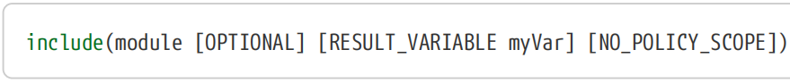
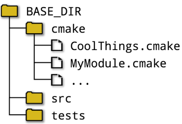
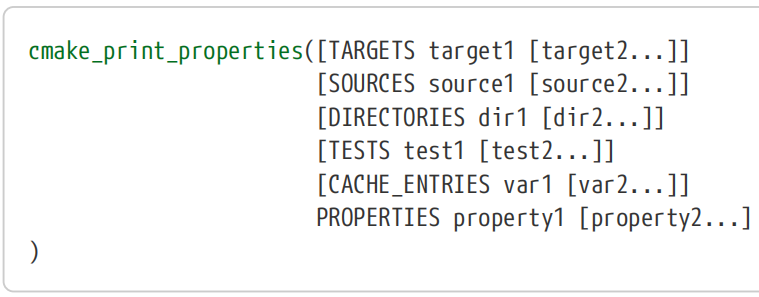
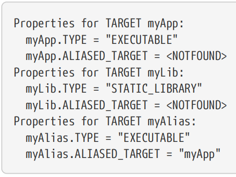
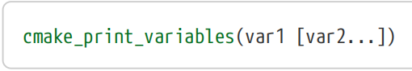
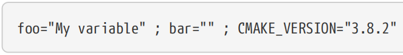

# Ch11. Modules

The preceding chapters have focused mostly on the core aspects of CMake. Variables, properties, flow control, generator expressions, functions, etc. are all part of what could be considered the CMake language. In contrast, modules are pre-built chunks of CMake code built on top of the core language features. They provide a rich set of functionality which projects can use to accomplish a wide variety of goals. Being written and packaged as ordinary CMake code and therefore being human readable, modules can also be a useful resource for learning more about how to get things done in CMake.

【译】前面的章节主要关注CMake的核心方面。变量、属性、流控制、生成器表达式、函数等都是CMake语言的一部分。相比之下，模块是构建在核心语言功能之上的预先构建的CMake代码块。它们提供了一套丰富的功能，项目可以使用这些功能来实现各种各样的目标。模块被编写和打包为普通的CMake代码，因此是人类可读的，它也可以成为学习如何在CMake中完成工作的有用资源。

Modules are collected together and provided in a single directory as part of a CMake release. Projects employ modules in one of two ways, either directly or as part of finding an external package. The more direct method of employing modules uses the include() command to essentially inject the module code into the current scope. This works just like the behavior already discussed back in Section 7.2, “include()” except that only the base name of the module needs to be given to the include() command, not the full path or file extension. All of the options to include() work exactly as before.

【译】模块被收集在一起，并作为CMake版本的一部分提供在一个目录中。项目以两种方式之一使用模块，直接使用或作为查找外部包的一部分。使用模块的更直接的方法是使用include()命令将模块代码注入当前作用域。这与第7.2节“include()”中已经讨论过的行为一样，除了只需要为include()命令提供模块的基本名称，而不需要提供完整的路径或文件扩展名。所有include()的选项都与以前完全一样。

When given a module name, the include() command will look in a well-defined set of locations for a file whose name is the name of the module (case-sensitive) with .cmake appended. For example, include(FooBar) would result in CMake looking for a file called FooBar.cmake and on case-sensitive systems like Linux, file names like foobar.cmake would not match.

【译】当给定一个模块名称时，include()命令将在一组定义良好的位置查找一个文件，该文件的名称是附加了.cmake的模块名称（区分大小写）。例如，include(FooBar)会导致CMake查找一个名为FooBar.cmake 的文件，而在Linux等区分大小写的系统上， foobar.cmake 等文件名将不匹配。

When looking for a module’s file, CMake first consults the variable CMAKE_MODULE_PATH. This is assumed to be a list of directories and CMake will search each of these in order. The first matching file will be used, or if no matching file is found or if CMAKE_MODULE_PATH is empty or undefined, CMake will then search in its own internal module directory. This search order allows projects to add their own modules seamlessly by adding directories to CMAKE_MODULE_PATH. A useful pattern is to collect together a project’s module files in a single directory and add it to the CMAKE_MODULE_PATH somwhere near the beginning of the top level CMakeLists.txt file. The following directory structure shows such an arrangement:

【译】在查找模块的文件时，CMake首先查询变量CMAKE_MODULE_PATH。假设这是一个目录列表，CMake将按顺序搜索每个目录。将使用第一个匹配文件，如果找不到匹配文件，或者CMAKE_MODULE_PATH为空或未定义，CMAKE将在其自己的内部模块目录中搜索。此搜索顺序允许项目通过向CMAKE_MODULE_PATH添加目录来无缝添加自己的模块。一个有用的模式是将项目的模块文件收集在一个目录中，并将其添加到顶层CMakeLists.txt文件开头附近的CMAKE_MODULE_PATH中。以下目录结构显示了这样的排列：

The corresponding CMakeLists.txt file then only needs to add the cmake directory to the CMAKE_MODULE_PATH and it can then call include() using just the base file name when loading each of the modules.

【译】相应的CMakeLists.txt文件只需要将cmake目录添加到CMAKE_MODULE_PATH中，然后在加载每个模块时，它可以仅使用基本文件名调用include()。

\#*CMakeLists.txt:*

\#-----------------------------------------------\>\>\>\>\>\>

cmake_minimum_required(VERSION 3.0)

project(Example)

list(APPEND CMAKE_MODULE_PATH "\${CMAKE_SOURCE_DIR}/cmake")

\# Inject code from project-provided modules

include(CoolThings)

include(MyModule)

\#-----------------------------------------------\<\<\<\<\<\<

There is one exception to the search order used by CMake to find a module. If the file calling include() is itself inside CMake’s own internal module directory, then the internal module directory will be searched first before consulting CMAKE_MODULE_PATH. This prevents project code from accidentally (or deliberately) replacing an official module with one of their own and changing the documented behavior.

【译】CMake用于查找模块的搜索顺序有一个例外。如果调用include()的文件本身位于CMake自己的内部模块目录中，那么在查询CMAKE_MODULE_PATH之前，将首先搜索内部模块目录。这可以防止项目代码意外（或故意）用自己的模块替换官方模块并更改记录的行为。

The other way to employ modules is with the find_package() command. This is discussed in detail in Section 23.5, “Finding Packages”, but for the moment, a simplified form of that command without any of the optional keywords demonstrates its basic usage:

【译】使用模块的另一种方法是使用find_package()命令。这在第23.5节“查找包”中有详细讨论，但目前，该命令的简化形式（没有任何可选关键字）演示了其基本用法：

\`\`\`cmake

find_package(PackageName)

\`\`\`

When used in this way, the behavior is very similar to include() except CMake will search for a file called FindPackageName.cmake rather than PackageName.cmake. This is the method by which details about an external package are often brought into the build, including things like imported targets, variables defining locations of relevant files, libraries or programs, information about optional components, version details and so on. The set of options and features associated with find_package() is considerably richer than what is provided for include() and “Chapter 23, Finding Things” is dedicated to covering the topic in detail.

【译】当以这种方式使用时，其行为与include()非常相似，除了CMake将搜索名为FindPackageName.cmake 而不是PackageName.cmake的文件。这是一种将外部包的详细信息引入构建的方法，包括导入的目标、定义相关文件、库或程序位置的变量、可选组件的信息、版本详细信息等。与find_package()相关的选项和功能集比include()提供的要丰富得多，“第23章，查找内容”专门介绍了该主题的详细内容。

The remainder of this chapter introduces a number of interesting modules that are included as part of a CMake release. This is by no means a comprehensive set, but they do give a flavor of the sort of functionality that is available. Other modules are introduced in subsequent chapters where their functionality is closely related to the topic of discussion. The CMake documentation provides a complete list of all available modules, each with its own help section explaining what the module provides and how it can be used. Be forewarned though that the quality of the documentation does vary from module to module.

【译】本章的其余部分将介绍一些有趣的模块，这些模块是CMake版本的一部分。这绝不是一个全面的集合，但它们确实提供了一种可用的功能。其他模块将在后续章节中介绍，其功能与讨论主题密切相关。CMake文档提供了所有可用模块的完整列表，每个模块都有自己的帮助部分，解释了模块提供的内容以及如何使用。请注意，文档的质量确实因模块而异。

## 11.1. Useful Development Aids

The CMakePrintHelpers module provides two macros which make printing the values of properties and variables more convenient during development. They are not intended for permanent use, but are more aimed at helping developers quickly and easily log information temporarily to help investigate problems in the project.

【译】CMakePrintHelpers模块提供了两个宏，使在开发过程中打印属性和变量的值更加方便。它们不是永久使用的，而是旨在帮助开发人员快速轻松地临时记录信息，以帮助调查项目中的问题。

This macro essentially combines get_property() with message() into a single call. Exactly one of the property types must be specified and each of the named properties will be printed for each entity listed. It is particularly convenient when logging information for multiple entities and/or properties. For example: 【译】这个宏基本上将get_property()和message()组合成一个调用。必须指定一种属性类型，并为列出的每个实体打印每个命名的属性。记录多个实体和/或属性的信息时特别方便。例如：

\#--------------------------------------------------\>\>\>\>\>\>

add_executable(myApp main.c)

add_executable(myAlias ALIAS myApp)

add_library(myLib STATIC src.cpp)

include(CMakePrintHelpers)

cmake_print_properties(TARGETS myApp myib myAlias

PROPERTIES TYPE ALIASED_TARGET)

\#--------------------------------------------------\<\<\<\<\<\<

The output of the above would be:【译】上述结果将是：

The module also provides a similar function for logging the value of one or more variables:

【译】该模块还提供了一个类似的功能，用于记录一个或多个变量的值：

This works for all variables regardless of whether they have been explicitly set by the project, are automatically set by CMake or have not been set at all.

【译】这适用于所有变量，无论它们是由项目显式设置的、由CMake自动设置的还是根本没有设置的。

\#----------------------------------------------------\>\>\>\>\>\>

set(foo "My variable")

unset(bar)

include(CMakePrintHelpers)

cmake_print_variables(foo bar CMAKE_VERSION)

\#----------------------------------------------------\<\<\<\<\<\<

The output for the above would be something similar to the following:

【译】上述输出类似于以下内容：

## 11.2. Endianness

When working with embedded platforms or projects intended for a wide variety of architectures, it can be desirable for the project to be aware of the endianness of the target system. The TestBigEndian module provides the test_big_endian() macro which compiles a small test program to determine the endianness of the target. This result is then cached so subsequent CMake runs do not have to redo the test. The macro takes only one argument, that being the name of a variable in which to store the boolean result (true means the system is big endian):

【译】当处理用于各种架构的嵌入式平台或项目时，项目可能需要了解目标系统的端序。TestBigEndian模块提供test_big_endian()宏，该宏编译一个小型测试程序来确定目标的字节序。然后缓存此结果，这样后续的CMake运行就不必重做测试。宏只接受一个参数，即存储布尔结果的变量名称（true表示系统采用大端序）：

\#-------------------------------------------------------------------------\>\>\>\>\>\>

include(TestBigEndian)

test_big_endian(isBigEndian)

message("Is target system big endian: \${isBigEndian}")

\#-------------------------------------------------------------------------\<\<\<\<\<\<

## 11.3. Checking Existence And Support

One of the more comprehensive areas covered by CMake’s modules is checking for the existence of or support for various things. This family of modules all work in fundamentally the same way, writing a short amount of test code and then attempting to compile and possibly link and run the resultant executable to confirm whether what is being tested in the code is supported. All of these modules have a name beginning with Check.

【译】CMake模块涵盖的一个更全面的领域是检查各种事物的存在或支持。这一系列模块的工作方式基本相同，编写少量测试代码，然后尝试编译并可能链接和运行生成的可执行文件，以确认代码中测试的内容是否受支持。所有这些模块的名称都以Check开头。

Some of the more fundamental Check… modules are those that compile and link a short test file into an executable and return a success/fail result. The names of these modules have the form Check\<LANG\>SourceCompiles and each provides an associated macro to perform the test:

【译】一些更基本的Check…模块是那些将短测试文件编译并链接到可执行文件中并返回成功/失败结果的模块。这些模块的名称采用**Check\<LANG\>SourceCompiles**的形式，每个模块都提供了一个相关的宏来执行测试：

\##---------------------------------\>\>\>\>\>\>

include(CheckCSourceCompiles)

check_c_source_compiles(code resultVar \[FAIL_REGEX regex\])

include(CheckCXXSourceCompiles)

check_cxx_source_compiles(code resultVar \[FAIL_REGEX regex\])

include(CheckFortranSourceCompiles)

check_fortran_source_compiles(code resultVar \[FAIL_REGEX regex\] \[SRC_EXT extension\])

\##---------------------------------\<\<\<\<\<\<

For each of the macros, the code argument is expected to be a string containing source code that should produce an executable for the selected language. The result of an attempt to compile and link the code is stored in resultVar as a cache variable, with true indicating success. False values could be an empty string, an error message, etc. depending on the situation. After the test has been performed once, subsequent CMake runs will use the cached result rather than performing the test again. This is the case even if the code being tested is changed, so to force re-evaluation, the variable has to be manually removed from the cache. If the FAIL_REGEX option is specified, then an additional criteria applies. If the output of the test compilation and linking matches the regex regular expression, the check will be deemed to have failed, even if the code compiles and links successfully.

【译】对于每个宏，代码参数应该是一个字符串，其中包含应为所选语言生成可执行文件的源代码。尝试编译和链接代码的结果作为缓存变量存储在resultVar中，true表示成功。根据具体情况，假值可能是空字符串、错误消息等。执行一次测试后，后续的CMake运行将使用缓存的结果，而不是再次执行测试。即使被测试的代码发生了变化，情况也是如此，因此为了强制重新评估，必须手动从缓存中删除变量。如果指定了FAIL_REGEX选项，则适用其他条件。如果测试编译和链接的输出与正则表达式匹配，即使代码编译和链接成功，检查也将被视为失败。

\##----------------------------------------------------------\>\>\>\>\>\>

include(CheckCSourceCompiles)

check_c_source_compiles("

int main(int argc, char\* argv\[\])

{

int myVar;

return 0;

}" noWarnUnused FAIL_REGEX "\[Ww\]arn")

if(noWarnUnused)

message("Unused variables do not generate warnings by default")

endif()

\##----------------------------------------------------------\<\<\<\<\<\<

In the case of Fortran, the file extension can affect how compilers treat source files, so the file extension can be explicitly specified with the SRC_EXT option to obtain the expected behavior. There is no equivalent option for the C or C++ cases. 【译】在Fortran的情况下，文件扩展名会影响编译器处理源文件的方式，因此可以使用SRC_EXT选项显式指定文件扩展名以获得预期的行为。对于C或C++的情况，没有等效的选项。

A number of variables of the form CMAKE_REQUIRED\_… can be set before calling any of the compilation test macros to influence how they compile the code: 【译】在调用任何编译测试宏之前，可以设置CMAKE_REQUIRED\_…形式的多个变量，以影响它们编译代码的方式：

\#\>\>\>\>\>\>\>\>\>\>\>\>\>\>\>\>\>\>\>\>\>\>\>\>\>\>\>\>\>\>\>\>\>\>\>\>\>\>\>\>\>\>\>\>

\#(1)CMAKE_REQUIRED_FLAGS

Additional flags to pass to the compiler command line after the contents of the relevant CMAKE\_\<LANG\>\_FLAGS and CMAKE\_\<LANG\>\_FLAGS\_\<CONFIG\> variables (see Section 14.3, “Compiler And Linker Variables”). This must be a single string with multiple flags being separated by spaces, unlike all the other variables below which are CMake lists.

【译】在相关 CMAKE\_\<LANG\>\_FLAGS 和 CMAKE\_\<LANG\>\_FLAGS\_\<CONFIG\> 变量（请参见第 14.3 节“编译器和链接器变量”）的内容之后，传递给编译器命令行的其他标志。这必须是一个包含多个标志的单个字符串，标志之间用空格分隔，这与下面所有其他变量（均为 CMake 列表）不同。

**\#(2)CMAKE_REQUIRED_DEFINITIONS**

A CMake list of compiler definitions, each one specified in the form -DFOO or -DFOO=bar.

【译】CMake编译器定义列表，每个定义都以-DFOO或-DFOO=bar的形式指定。

**\#(3)CMAKE_REQUIRED_INCLUDES**

Specifies directories to search for headers. Multiple paths must be specified as a CMake list, with spaces being treated as part of a path.

【译】指定要搜索头文件的目录。必须将多个路径指定为CMake列表，其中空格被视为路径的一部分。

**\#(4)CMAKE_REQUIRED_LIBRARIES**

A CMake list of libraries to add to the linking stage. Do not prefix the library names with any -l option or similar, provide just the library name or the name of a CMake imported target (discussed in “Chapter 16, Target Types”).

【译】要添加到链接阶段的CMake库列表。不要在库名称前添加任何-l选项或类似选项，只提供库名称或CMake导入目标的名称（在“第16章，目标类型”中讨论）。

**\#(5)CMAKE_REQUIRED_QUIET**

If this option is present, no status messages will be printed by the macro.

【译】如果存在此选项，宏将不会打印任何状态消息。

\#\<\<\<\<\<\<\<\<\<\<\<\<\<\<\<\<\<\<\<\<\<\<\<\<\<\<\<\<\<\<\<\<\<\<\<\<\<\<\<\<\<\<\<\<

These variables are used to construct arguments to the try_compile() call made internally to perform the check. The CMake documentation for try_compile() discusses additional variables which may have an effect on the checks, while other aspects of try_compile() behavior relating to toolchain selection are covered in Section 21.5, “Compiler Checks”.

【译】这些变量用于构造内部执行检查的try_compile()调用的参数。try_compile()的CMake文档讨论了可能影响检查的其他变量，而与工具链选择相关的try_compile()行为的其他方面在第21.5节“编译器检查”中有所介绍。

In addition to checking whether code can be built, CMake also provides modules that test whether C or C++ code can be executed successfully. Success is measured by the exit code of the executable created from the source provided, with 0 being treated as success and all other values indicating failure. The modules follow a similar structure to the compilation case, each providing a single macro implementing the check: 【译】除了检查代码是否可以构建，CMake还提供了测试C或C++代码是否可以成功执行的模块。成功是通过从提供的源创建的可执行文件的退出代码来衡量的，0被视为成功，所有其他值都表示失败。这些模块遵循与编译案例类似的结构，每个模块都提供一个实现检查的宏：

\#----------------------------------\>\>\>\>\>\>

include(CheckCSourceRuns)

check_c_source_runs(code resultVar)

include(CheckCXXSourceRuns)

check_cxx_source_runs(code resultVar)

\#----------------------------------\<\<\<\<\<\<

There is no FAIL_REGEX option for these macros, as success or failure is determined purely by the test process’ exit code. If the code cannot be built, this is also treated as a failure. All the same variables that affect how the code is built for check_c_source_compiles() and check_cxx_source_compiles() also have the same effect for these two modules’ macros as well.

【译】这些宏没有FAIL_REGEX选项，因为成功或失败完全由测试过程的退出代码决定。如果无法构建代码，这也被视为失败。所有影响如何为check_c_source_compiles()和check_cxx_source_commiles()构建代码的变量对这两个模块的宏也有相同的影响。

For builds that are cross-compiling to a different target platform, the check_c_source_runs() and check_cxx_source_runs() macros behave quite differently. They may run the code under a simulator if the necessary details have been provided, which would likely slow down the CMake stage considerably. If simulator details have not been provided, the macros will instead expect a predetermined result to be provided through a set of variables and will not try to run anything. This fairly advanced topic is covered in CMake’s documentation for the try_run() command, which is what the macros use internally to perform the checks.

【译】对于交叉编译到不同目标平台的构建，check_c_source_run()和check_cxx_source_runs()宏的行为截然不同。如果提供了必要的细节，他们可以在模拟器下运行代码，这可能会大大减缓CMake阶段的速度。如果没有提供模拟器详细信息，宏将期望通过一组变量提供预定结果，并且不会尝试运行任何东西。CMake的try_run()命令文档中涵盖了这个相当高级的主题，宏内部使用该命令执行检查。

Certain categories of checks are so common that CMake provides dedicated modules for them. These remove much of the boilerplate of defining the test code and allow projects to specify a minimal set of information for the check. These are typically just wrappers around the macros provided by one of the Check\<LANG\>SourceCompiles modules, so the same set of variables used for customizing how the test code is built still apply. These more specialized modules check compiler flags, pre-processor symbols, functions, variables, header files and more.

【译】某些类别的检查非常常见，CMake为它们提供了专用模块。这些删除了定义测试代码的大部分样板，并允许项目为检查指定一组最少的信息。这些通常只是Check\<LANG\>SourceCompiles模块之一提供的宏的包装，因此用于自定义测试代码构建方式的同一组变量仍然适用。这些更专业的模块检查编译器标志、预处理器符号、函数、变量、头文件等。

Support for specific compiler flags can be checked using the Check\<LANG\>CompilerFlag modules, each of which provide a single macro with a name following a predictable pattern:

【译】可以使用Check\<LANG\>CompilerFlag模块检查对特定编译器标志的支持，每个模块都提供一个名称遵循可预测模式的宏：

\#-------------------------------------------\>\>\>\>\>\>

include(CheckCCompilerFlag)

check_c_compiler_flag(flag resultVar)

include(CheckCXXCompilerFlag)

check_cxx_compiler_flag(flag resultVar)

include(CheckFortranCompilerFlag)

check_fortran_compiler_flag(flag resultVar)

\#-------------------------------------------\<\<\<\<\<\<

The flag-checking macros update the CMAKE_REQUIRED_DEFINITIONS variable internally to include flag in a call to the appropriate check\_\<LANG\>\_source_compiles() macro with a trivial test file. An internal set of failure regular expressions is also passed as the FAIL_REGEX option, testing whether the flag results in a diagnostic message being issued or not. The result of the call will be a true value if no matching diagnostic message is issued. Note that this means any flag that results in a compiler warning but successful compilation will still be deemed to have failed the check. Also be aware that these macros assume that any flags already present in the relevant CMAKE\_\<LANG\>\_FLAGS variables (see Section 14.3, “Compiler And Linker Variables”) do not themselves generate any compiler warnings. If they do, then the logic for each of these flag-testing macros will be defeated and the result of all such checks will be failure.

【译】标志检查宏在内部更新CMAKE_REQUIRED_DEFINITIONS变量，以便在调用相应的check\_\<LANG\>\_source_compiles()宏时包含标志，并使用一个简单的测试文件。一组内部故障正则表达式也作为FAIL_REGEX选项传递，测试该标志是否导致发出诊断消息。如果没有发出匹配的诊断消息，则调用的结果将为真值。请注意，这意味着任何导致编译器警告但编译成功的标志仍将被视为未通过检查。还要注意，这些宏假设相关CMAKE\_\<LANG\>\_FLAGS 变量中已经存在的任何标志（见第14.3节“编译器和链接器变量”）本身不会生成任何编译器警告。如果他们这样做，那么每个标志测试宏的逻辑都将失败，所有此类检查的结果都将是失败。

Two other notable modules are CheckSymbolExists and CheckCXXSymbolExists. The former provides a macro which builds a test C executable and the latter does the same as a C++ executable. Both check whether a particular symbol exists as either a pre-processor symbol (i.e. something that can be tested via an \#ifdef statement), a function or a variable.

【译】另外两个值得注意的模块是CheckSymbolExists和CheckCXXSymbolExists。前者提供了一个构建测试C可执行文件的宏，后者则与C++可执行文件一样。两者都检查特定符号是否作为预处理器符号（即可以通过#ifdef语句测试的东西）、函数或变量存在。

\#---------------------------------------\>\>\>\>\>\>

include(CheckSymbolExists)

check_symbol_exists(symbol headers resultVar)

include(CheckCXXSymbolExists)

check_cxx_symbol_exists(symbol headers resultVar)

\#---------------------------------------\<\<\<\<\<\<

For each of the items specified in headers (a CMake list if more than one header needs to be given), a corresponding \#include will be added to the test source code. In most cases, the symbol being checked will be defined by one of these headers. The result of the test is stored in the resultVar cache variable in the usual way.

【译】对于标题中指定的每个项目（如果需要给出多个header，则为CMake列表），将在测试源代码中添加相应的#include。在大多数情况下，被检查的符号将由其中一个标头定义。测试结果以通常的方式存储在resultVar缓存变量中。

In the case of functions and variables, the symbol needs to resolve to something that is part of the test executable. If the function or variable is provided by a library, that library must be linked as part of the test, which can be done using the CMAKE_REQUIRED_LIBRARIES variable.

【译】对于函数和变量，符号需要解析为测试可执行文件的一部分。如果函数或变量由库提供，则该库必须作为测试的一部分链接，这可以使用CMAKE_REGUIED_LIBRARIES变量完成。

\#---------------------------------------------------------\>\>\>\>\>\>

include(CheckSymbolExists)

check_symbol_exists(sprintf stdio.h HAVE_SPRINTF)

include(CheckCXXSymbolExists)

set(CMAKE_REQUIRED_LIBRARIES SomeCxxSDK)

check_cxx_symbol_exists(SomeCxxInitFunc somecxxsdk.h HAVE_SOMECXXSDK)

\#---------------------------------------------------------\<\<\<\<\<\<

There are limitations on the sort of functions and variables that can be checked by these macros. Only those symbols that satisfy the naming requirements for a preprocessor symbol can be used. The implications are stronger for check_cxx_symbol_exists(), since it means only non-template functions or variables in the global namespace can be checked because any scoping (::) or template markers (\<\>) would not be valid for a preprocessor symbol. It is also impossible to distinguish between different overloads of the same function, so these cannot be checked either.

【译】这些宏可以检查的函数和变量的类型存在限制。只能使用满足预处理器符号命名要求的符号。check_cxx_symbol_exists()的含义更强，因为它意味着只能检查全局命名空间中的非模板函数或变量，因为任何作用域(::)或模板标记(\<\>)对预处理器符号都无效。也无法区分同一函数的不同重载，因此也无法检查这些重载。

There are other modules which aim to provide functionality that is similar to or a subset of that covered by CheckSymbolExists. These other modules are either from earlier versions of CMake or are for a language other than C or C++. The CheckFunctionExists module is already documented as being deprecated and the CheckVariableExists module offers nothing that CheckSymbolExists doesn’t already provide. The CheckFortranFunctionExists module may be useful for those projects working with Fortran, but note that there is no CheckFortranVariableExists module. Fortran projects may want to use CheckFortranSourceCompiles for consistency instead.

【译】还有其他模块旨在提供与CheckSymbolExists相似的功能或其子集。这些其他模块要么来自早期版本的CMake，要么适用于C或C++以外的语言。CheckFunctionExists模块已被记录为弃用，CheckVariableExists模块提供了CheckSymbolExists尚未提供的任何功能。CheckFortranFunctionExists模块可能对使用Fortran的项目有用，但请注意，没有CheckFortranVariableExists模块。Fortran项目可能希望使用CheckFortranSourceCompiles来保持一致性。

More detailed checks are provided by other modules. Struct members can be tested with CheckStructHasMember, specific C or C++ function prototypes can be tested with CheckPrototypeDefinition and the size of non-user types can be tested with CheckTypeSize. Other higher level checks are also possible, as provided by CheckLanguage, CheckLibraryExists and the various CheckIncludeFile… modules. Further check modules continue to be added to CMake as it evolves, so consult the CMake module documentation to see the full set of available functionality.

【译】其他模块提供了更详细的检查。结构成员可以用CheckStructHasMember进行测试，特定的C或C++函数原型可以用CheckPrototypeDefinition进行测试，非用户类型的大小可以用CheckTypeSize进行测试。其他更高级别的检查也是可能的，如CheckLanguage、CheckLibraryExists和各种CheckIncludeFile…模块所提供的。随着CMake的发展，进一步的检查模块将继续添加到CMake中，因此请参阅CMake模块文档以查看完整的可用功能。

In situations where multiple checks are being made or where the effects of performing the checks need to be isolated from each other or from the rest of the current scope, it can be cumbersome to manually save and restore the state before and after the checks. In particular, the various CMAKE_REQUIRED\_… variables often need to be saved and restored. To help with this, CMake provides the CMakePushCheckState module which defines following three macros:

【译】在进行多个检查的情况下，或者在执行检查的效果需要彼此隔离或与当前范围的其他部分隔离的情况中，手动保存和恢复检查前后的状态可能会很麻烦。特别是，各种CMAKE_REQUIRED\_…变量通常需要保存和恢复。为了帮助实现这一点，CMake提供了CMakePushCheckState模块，该模块定义了以下三个宏：

\#--------------------------------------------\>\>\>\>\>\>

cmake_push_check_state(\[RESET\])

cmake_pop_check_state()

cmake_reset_check_state()

\#--------------------------------------------\<\<\<\<\<\<

These macros allow the various CMAKE_REQUIRED\_… variables to be treated as a set and to have their state pushed and popped onto/from a virtual stack. Each time cmake_push_check_state() is called, it effectively begins a new virtual variable scope for just the CMAKE_REQUIRED\_… variables (and also the CMAKE_EXTRA_INCLUDE_FILES variable which is only used by the CheckTypeSize module). cmake_pop_check_state() is the opposite, it discards the current values of the CMAKE_REQUIRED\_… variables and restores them to the previous stack level’s values. The cmake_reset_check_state() macro is a convenience for clearing all the CMAKE_REQUIRED\_… variables and the RESET option to cmake_push_check_state() is also just a convenience for clearing the variables as part of the push. Note, however, that a bug existed prior to CMake 3.10 which resulted in the RESET option being ignored, so for projects that need to work with versions before 3.10, it is better to use a separate call to cmake_reset_check_state() instead.

【译】这些宏允许将各种CMAKE_REGUIED\_…变量视为一个集合，并将它们的状态推送到虚拟堆栈中或从虚拟堆栈中弹出。每次调用cmake_push_check_state()时，它都会为cmake_REGUIED\_…变量（以及仅由CheckTypeSize模块使用的cmake_EXTRA_INCLUDE_FILES变量）有效地开始一个新的虚拟变量作用域。cmake_pop_check_state()则相反，它丢弃cmake_REQUIRED\_…变量的当前值，并将其恢复到上一个堆栈级别的值。cmake_reset_check_state()宏是清除所有cmake_REQUIRED\_…变量的便利，cmake_push_check_stade()的reset选项也只是作为推送的一部分清除变量的便利。但是请注意，CMake 3.10之前存在一个错误，导致RESET选项被忽略，因此对于需要使用3.10之前版本的项目，最好使用单独的cmake_reset_check_state()调用。

\#---------------------------------------------------------\>\>\>\>\>\>

include(CheckSymbolExists)

include(CMakePushCheckState)

\# Start with a known state we can modify and undo later

cmake_push_check_state() \# Could use RESET option, but needs CMake \>= 3.10

cmake_reset_check_state() \# Separate call, safe for all CMake versions

set(CMAKE_REQUIRED_FLAGS -Wall)

check_symbol_exists(FOO_VERSION foo/version.h HAVE_FOO)

if(HAVE_FOO)

\# Preserve -Wall and add more things for extra checks

cmake_push_check_state()

set(CMAKE_REQUIRED_INCLUDES foo/inc.h foo/more.h)

set(CMAKE_REQUIRED_DEFINES -DFOOBXX=1)

check_symbol_exists(FOOBAR "" HAVE_FOOBAR)

check_symbol_exists(FOOBAZ "" HAVE_FOOBAZ)

check_symbol_exists(FOOBOO "" HAVE_FOOBOO)

cmake_pop_check_state()

\# Now back to just -Wall

endif()

\# Clear all the CMAKE_REQUIRED\_... variables for this last check

cmake_reset_check_state()

check_symbol_exists(\_\_TIME\_\_ "" HAVE_PPTIME)

\# Restore all CMAKE_REQUIRED\_... variables to their original values

\# from the top of this example

cmake_pop_check_state()

\#---------------------------------------------------------\<\<\<\<\<\<

## 11.4. Other Modules

CMake has excellent built-in support for some languages, especially C and C++. It also includes a number of modules which provide support for languages in a more extensible and configurable way. These modules allow aspects of some languages or language-related packages to be made available to projects by defining relevant functions, macros, variables and properties. Many of these modules are provided as part of the support for find_package() calls (see Section 23.5, “Finding Packages”), while others are intended to be used more directly via include() to bring things into the current scope. The following module list should give a flavor of the sort of language support available:

【译】CMake对某些语言有很好的内置支持，尤其是C和C++。它还包括许多模块，这些模块以更可扩展和可配置的方式为语言提供支持。这些模块允许通过定义相关函数、宏、变量和属性，将某些语言或语言相关包的方面提供给项目。其中许多模块是作为find_package()调用支持的一部分提供的（见第23.5节“查找包”），而其他模块则旨在通过include()更直接地使用，以将内容带入当前范围。以下模块列表应提供可用语言支持的类型：

• CSharpUtilities

• FindCUDA (but note this has been superceded by support for CUDA as a first class language in its own right in recent CMake versions)

• FindJava, FindJNI, UseJava

• FindLua

• FindMatlab

• FindPerl, FindPerlLibs

• FindPython, FindPythonInterp

• FindPHP4

• FindRuby

• FindSWIG, UseSWIG

• FindTCL

• FortranCInterface

In addition, modules are also provided for interacting with external data and projects, a topic covered in depth in “Chapter 27, External Content”. A number of modules are also provided to facilitate various aspects of testing and packaging. These have a close relationship with the CTest and CPack tools distributed as part of the CMake suite and are covered in depth in “Chapter 24, Testing” and “Chapter 26, Packaging”.

【译】此外，还提供了与外部数据和项目交互的模块，这是“第27章，外部内容”中深入探讨的主题。还提供了许多模块来促进测试和包装的各个方面。这些与作为CMake套件的一部分分发的CTest和CPack工具有着密切的关系，并在“第24章，测试”和“第26章，打包”中进行了深入的介绍。

## 11.5. Recommended Practices

CMake’s collection of modules provides a wealth of functionality built on top of the core CMake language. A project can easily extend the set of available functionality by adding their own custom modules under a particular directory and then appending that path to the CMAKE_MODULE_PATH variable. The use of CMAKE_MODULE_PATH should be preferred over hard-coding absolute or relative paths across complex directory structures in include() calls, since this will encourage generic CMake logic to be decoupled from the places where that logic may be applied. This in turn makes it easier to relocate CMake modules to different directories as a project evolves, or to re-use the logic across different projects. Indeed, it is not unusual for an organization to build up its own collection of modules, perhaps even storing them in their own separate repository. By setting CMAKE_MODULE_PATH appropriate in each project, those reusable CMake building blocks are then made available for use as widely as needed.

【译】CMake的模块集合提供了基于核心CMake语言构建的丰富功能。项目可以通过在特定目录下添加自己的自定义模块，然后将该路径附加到CMAKE_MODULE_PATH 变量中，轻松扩展可用功能集。在include()调用中，应优先使用CMAKE_MODULE_PATH，而不是硬编码复杂目录结构中的绝对或相对路径，因为这将鼓励通用CMAKE逻辑与可能应用该逻辑的地方解耦。这反过来又使得随着项目的发展，将CMake模块重新定位到不同的目录变得更加容易，或者在不同的项目之间重用逻辑变得更加容易。事实上，一个组织建立自己的模块集合并不罕见，甚至可能将它们存储在自己的单独存储库中。通过在每个项目中设置适当的CMAKE_MODULE_PATH，这些可重用的CMAKE构建块就可以根据需要广泛使用。

Over time, a developer will typically be exposed to an increasing number of interesting scenarios for which a CMake module may provide useful shortcuts or ready-made solutions. Sometimes a quick scan of the available modules can yield an unexpected hidden gem, or a new module may offer a better maintained implementation of something a project has been implementing in an inferior way up to that point. CMake’s modules have the benefit of a potentially large pool of developers and projects using them across a diverse set of platforms and situations, so they may offer a more compelling alternative to projects doing their own manual logic in many cases. The quality does, however, vary from one module to another. Some modules began their life quite early on in CMake’s existence and these can sometimes become less useful if not kept up to date with changes to CMake or to the areas those modules relate to. This can be particularly true of Find… modules which may not track newer versions of the packages they are finding as closely as one might like. On the other hand, modules are just ordinary CMake code, so anyone can inspect them, learn from them, improve or update them without having to learn much beyond what is needed for basic CMake use in a project. In fact, they are an excellent starting point for developers wishing to get involved with working on CMake itself.

【译】随着时间的推移，开发人员通常会接触到越来越多的有趣场景，CMake模块可以为这些场景提供有用的快捷方式或现成的解决方案。有时，快速扫描可用模块可能会产生意想不到的隐藏宝石，或者一个新模块可能会提供一个更好的维护实现，以实现一个项目到目前为止一直以较差的方式实现的东西。CMake的模块具有潜在的大量开发人员和项目在各种平台和情况下使用它们的优势，因此在许多情况下，它们可能会提供一种更具吸引力的替代方案，而不是项目自己手动逻辑。然而，质量确实因模块而异。有些模块在CMake存在的早期就开始了它们的生命，如果不及时了解CMake或这些模块相关领域的变化，这些模块有时会变得不那么有用。对于Find…模块来说尤其如此，它们可能无法像人们希望的那样密切跟踪所找到的软件包的更新版本。另一方面，模块只是普通的CMake代码，因此任何人都可以检查、学习、改进或更新它们，而不必学习项目中基本CMake使用所需的知识。事实上，对于希望参与CMake本身工作的开发人员来说，它们是一个很好的起点。

The abundance of different Check… modules provided by CMake can be a mixed blessing. Developers can be tempted to get too over-zealous with checking all manner of things, which can result in slowing down the configure stage for sometimes questionable gains. Consider whether the benefits outweigh the costs in terms of time to implement and maintain the checks and the complexity of the project. Sometimes a few judicious checks are sufficient for covering the most useful cases, or to catch a subtle problem that might otherwise cause hard to trace problems later. Furthermore, if using any of the Check… modules, aim to isolate the checking logic from the scope in which it may be invoked. Use of the CMakePushCheckState module is highly recommended, but avoid using the RESET option to cmake_push_check_state() if support for CMake versions before 3.10 is important.

【译】CMake提供的丰富的不同Check…模块可能是喜忧参半的。开发人员可能会过于热衷于检查各种事情，这可能会导致配置阶段变慢，有时会带来可疑的收益。考虑在实施和维护检查的时间以及项目的复杂性方面，收益是否超过成本。有时，一些明智的检查就足以涵盖最有用的情况，或者发现一个微妙的问题，否则可能会导致以后难以追踪的问题。此外，如果使用任何Check…模块，则应将检查逻辑与可能调用它的范围隔离开来。强烈建议使用CMakePushCheckState模块，但如果支持3.10之前的cmake版本很重要，请避免对cmake_push_check_state()使用RESET选项。
