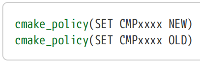

# Ch12. Policies

CMake has evolved over a long period, introducing new functionality, fixing bugs and changing the behavior of certain features to address shortcomings or introduce improvements. While the introduction of new capabilities is unlikely to cause problems for existing projects built with CMake, any change in behavior has the potential to break projects if they are relying on the old behavior. For this reason, the CMake developers are careful to ensure that changes are implemented in such a way as to preserve backward compatibility and to provide a straightforward, controlled migration path for projects to be updated to the new behavior.

【译】CMake已经发展了很长一段时间，引入了新功能，修复了错误，并改变了某些功能的行为，以解决缺点或引入改进。虽然引入新功能不太可能对使用CMake构建的现有项目造成问题，但如果项目依赖旧行为，任何行为的改变都有可能破坏项目。因此，CMake开发人员会谨慎地确保更改的实现方式能够保持向后兼容性，并为要更新到新行为的项目提供一条简单、可控的迁移路径。

This control over whether old or new behavior should be used is done through CMake’s policy mechanisms. In general, policies are not something that developers are exposed to all that often, mostly just when CMake issues a warning about the project relying on an older version’s behavior. When developers move to a more recent CMake release, the newer CMake version will sometimes issue such warnings to highlight how the project should be updated to use a new behavior.

【译】对 应该 使用旧行为还是新行为的控制是通过CMake的策略机制完成的。一般来说，策略并不是开发人员经常接触的东西，主要是当CMake根据旧版本的行为发出关于项目的警告时。当开发人员迁移到较新的CMake版本时，较新版本的CMake有时会发出此类警告，以强调如何更新项目以使用新行为。

## 12.1. Policy Control

CMake’s policy functionality is closely tied to the cmake_minimum_required() command, which was introduced back in “Chapter 3, A Minimal Project”. Not only does this command specify the minimum CMake version a project requires, it also sets CMake’s behavior to match that of the version given. Thus, when a project starts with cmake_minimum_required(VERSION 3.2), it says that at least CMake 3.2 is needed and also that the project expects CMake to behave like the 3.2 release. This gives projects confidence that developers should be able to update to any newer version of CMake at their convenience and the project will still build as it did before.

【译】CMake的策略功能与CMake_minimum_required()命令密切相关，该命令在“第3章，最小项目”中介绍过。此命令不仅指定项目所需的最低CMake版本，还设置CMake的行为以匹配给定的版本。因此，当一个项目以cmake_minimum_required（版本3.2）开始时，它表示至少需要cmake 3.2，并且该项目希望cmake的行为与3.2版本相似。这让项目相信，开发人员应该能够在方便的时候更新到任何较新版本的CMake，项目仍将像以前一样构建。

Sometimes, however, a project may want more fine-grained control than what cmake_minimum_required() provides. Consider the following scenarios:【译】然而，有时项目可能需要比cmake_minimum_required()提供的更细粒度的控制。考虑以下情况：

• A project wants to set a low minimum CMake version, but it also wants to take advantage of newer behavior if it is available. 【译】一个项目希望设置一个较低的最低CMake版本，但它也希望利用较新的行为（如果可用）。

• A part of the project is not able to be modified (e.g. it might come from an external read-only code repository) and it relies on old behavior which has been changed in newer CMake versions. The rest of the project, however, wants to move to the new behavior. 【译】项目的一部分无法修改（例如，它可能来自外部只读代码库），并且依赖于在较新的CMake版本中更改的旧行为。然而，项目的其余部分希望转向新的行为。

• A project relies heavily on some old behavior which would require a non-trivial amount of work to update. Some parts of the project want to make use of recent CMake features, but the old behavior for that particular change needs to be preserved until time can be set aside to update the project. 【译】一个项目严重依赖于一些旧行为，这需要大量的工作来更新。项目的某些部分希望使用最新的CMake功能，但需要保留该特定更改的旧行为，直到留出时间更新项目。

These are some common examples where the high level control provided by the cmake_minimum_required() command alone is not enough. More specific control over policies is enabled through the cmake_policy() command, which has a number of forms acting at different degrees of granularity. The form acting at the coarsest level is a close relative to cmake_minimum_required(): 【译】这些是一些常见的例子，其中cmake_minimum_required()命令提供的高级控制是不够的。通过cmake_policy()命令启用了对策略的更具体控制，该命令有许多以不同粒度运行的表单。作用在最粗级别的形式与cmake_minimum_required()关系密切：

\`\`\`cmake

cmake_policy(VERSION major\[.minor\[.patch\[.tweak\]\]\])

\`\`\`

In this form, the command changes CMake’s behavior to match that of the specified version. The cmake_minimum_required() command implicitly calls this form to set CMake’s behavior. The two are largely interchangeable except for the top of the project where a call to cmake_minimum_required() is mandatory to enforce a minimum CMake version. Apart from the start of the top level CMakeLists.txt file, using cmake_policy() generally communicates the intent more clearly when a project needs to enforce a particular version’s behavior for a section of the project, as demonstrated by the following example:

【译】在此形式中，该命令更改CMake的行为以匹配指定版本的行为。cmake_minimum_required()命令隐式调用此表单以设置cmake的行为。这两者在很大程度上是可互换的，除了项目的顶部，必须调用cmake_minimum_required()来强制最低cmake版本。除了顶级CMakeLists.txt文件的开头，当项目需要为项目的一部分强制执行特定版本的行为时，使用cmake_policy()通常会更清楚地传达意图，如下例所示：

\#------------------------------------------------------\>\>\>\>\>\>

cmake_minimum_required(VERSION 3.7)

project(WithLegacy)

\# Uses recent CMake features

add_subdirectory(modernDir)

\# Imported from another project, relies on old behavior

cmake_policy(VERSION 2.8.11)

add_subdirectory(legacyDir)

\#------------------------------------------------------\<\<\<\<\<\<

CMake 3.12 extends this capability in a backward-compatible way by optionally allowing the project to specify a version *range* rather than a single version to either cmake_minimum_required() or cmake_policy(VERSION). The range is specified using three dots … between the minimum and maximum version with no spaces. The range indicates that the CMake version in use must be at least the minimum and the behavior to use should be the lesser of the specified maximum and the running CMake version. This allows the project to effectively say "I need at least CMake X, but I am safe to use with policies from up to CMake Y". The following example shows two ways for a project to require only CMake 3.7, but still support the newer behavior for all policies up to CMake 3.12 if the running CMake version supports them:

【译】CMake 3.12以向后兼容的方式扩展了此功能，允许项目为CMake_minimum_required()或CMake_policy(version)指定版本范围，而不是单个版本。使用三个点指定范围…在最小版本和最大版本之间，没有空格。该范围表示正在使用的CMake版本必须至少是最小版本，使用的行为应该是指定的最大版本和正在运行的CMake版中的较小版本。这使得项目能够有效地说“我至少需要CMake X，但我可以安全地使用CMake Y之前的策略”。以下示例显示了项目只需要CMake 3.7的两种方法，但如果运行的CMake版本支持，则仍然支持CMake 3.12之前的所有策略的较新行为：

\`\`\`cmake

cmake_minimum_required(VERSION 3.7...3.12)

cmake_policy(VERSION 3.7...3.12)

\`\`\`

CMake versions before 3.12 would effectively see just a single version number and would ignore the …3.12 part, whereas 3.12 and later would understand it to mean a range.

【译】3.12之前的CMake版本实际上只会看到一个版本号，并且会忽略…3.12部分，而3.12和更高版本会将其理解为一个范围。

CMake also provides the ability to control each behavior change individually with the SET form:【译】CMake还提供了使用SET表单单独控制每个行为更改的能力：

Each individual behavior change is given its own policy number of the form CMPxxxx, where xxxx is always four digits. By specifying NEW or OLD, a project tells CMake to use the new or old behavior for that particular policy. The CMake documentation provides the full list of policies, along with an explanation of the OLD and NEW behavior of each one.

【译】每个单独的行为更改都有自己的策略编号，格式为CMPxxxx，其中xxxx始终是四位数字。通过指定NEW或OLD，项目告诉CMake为该特定策略使用新的或旧的行为。CMake文档提供了完整的策略列表，以及对每个策略的旧行为和新行为的解释。

As an example, before version 3.0, CMake allowed a project to call get_target_property() with the name of a target that didn’t exist. In such a case, the value of the property was returned as -NOTFOUND rather than issuing an error, but in all likelihood, the project probably contained incorrect logic. Therefore, from version 3.0 onwards, CMake halts with an error if such a situation is encountered. In the event that a project was relying on the old behavior, it could continue to do so using policy CMP0045 like so:

【译】例如，在3.0版本之前，CMake允许项目使用不存在的目标名称调用get_target_property()。在这种情况下，属性的值返回为-NOTFOUND，而不是发出错误，但很可能项目包含不正确的逻辑。因此，从3.0版本开始，如果遇到这种情况，CMake将停止并显示错误。如果一个项目依赖于旧行为，它可以使用策略CMP0045继续这样做，如下所示：

\#-----------------------------------------------------\>\>\>\>\>\>

\# Allow non-existent target with get_target_property()

cmake_policy(SET CMP0045 OLD)

\# Would halt with an error without the above policy change

get_target_property(outVar doesNotExist COMPILE_DEFINITIONS)

\#-----------------------------------------------------\<\<\<\<\<\<

The need for setting a policy to NEW is less common. One situation is where a project wants to set a low minimum CMake version, but still take advantage of later features if a later version is used. For example, in CMake 3.2, policy CMP0055 was introduced to provide strict checking on usage of the break() command. If the project still wanted to support being built with earlier CMake versions, then the additional checks would have to be explicitly enabled when run with later CMake versions.

【译】制定新政策的需求不太常见。一种情况是，一个项目希望设置一个较低的最低CMake版本，但如果使用更高的版本，仍然可以利用更高的功能。例如，在CMake 3.2中，引入了策略CMP0055来严格检查break()命令的使用情况。如果项目仍然希望支持使用早期的CMake版本构建，那么在使用更高版本的CMake运行时，必须明确启用额外的检查。

\#---------------------------------------------------\>\>\>\>\>\>

cmake_minimum_required(VERSION 3.0)

project(PolicyExample)

if(CMAKE_VERSION VERSION_GREATER 3.1)

\# Enable stronger checking of break() command usage

cmake_policy(SET CMP0055 NEW)

endif()

\#---------------------------------------------------\<\<\<\<\<\<

Testing the CMAKE_VERSION variable is one way of determining whether a policy is available, but the if() command provides a more direct way using the if(POLICY…) form. The above could alternatively be implemented like so:

【译】测试CMAKE_VERSION变量是确定策略是否可用的一种方法，但if()命令使用if(POLICY…)形式提供了一种更直接的方法。上述方法也可以这样实现：

\#----------------------------------------------------\>\>\>\>\>\>

cmake_minimum_required(VERSION 3.0)

project(PolicyExample)

\# Only set the policy if the version of CMake being used

\# knows about that policy number

if(POLICY CMP0055)

cmake_policy(SET CMP0055 NEW)

endif()

\#----------------------------------------------------\<\<\<\<\<\<

It is also possible to get the current state of a particular policy. The main situation where the current policy setting may need to be read is in a module file, which may be one provided by CMake itself or by the project. It would be unusual, however, for a project module to change its behavior based on a policy setting.

【译】还可以获得特定策略的当前状态。可能需要读取当前策略设置的主要情况是在模块文件中，该文件可能是CMake本身或项目提供的。然而，项目模块根据策略设置更改其行为是不寻常的。

\`\`\`cmake

cmake_policy(GET CMPxxxx outVar)

\`\`\`

The value stored in outVar will be OLD, NEW or empty. The cmake_minimum_required(VERSION…) and cmake_policy(VERSION…) commands reset the state of all policies. Those policies introduced at the specified CMake version or earlier are reset to NEW. Those policies that were added after the specified version will effectively be reset to empty.

【译】outVar中存储的值将是旧的、新的或空的。cmake_minimum_required(VERSION…)和cmake_policy(VERSION..)命令重置所有策略的状态。在指定的CMake版本或更早版本中引入的策略将重置为NEW。在指定版本之后添加的策略将有效地重置为空。

If CMake detects that the project is doing something that either relies on the old behavior, conflicts with the new behavior or whose behavior is ambiguous, it may warn if the relevant policy is unset. These warnings are the most common way developers are exposed to CMake’s policy functionality. They are designed to be noisy but informative, encouraging developers to update the project to the new behavior. In some cases, a deprecation warning may be issued even if the policy has been explicitly set, but this is typically only for a policy that has already been documented as deprecated for a long time (many releases).

【译】如果CMake检测到项目正在执行依赖于旧行为、与新行为冲突或行为不明确的操作，如果相关策略未设置，它可能会发出警告。这些警告是开发人员接触CMake策略功能的最常见方式。它们被设计成嘈杂但信息丰富，鼓励开发人员将项目更新到新的行为。在某些情况下，即使策略已明确设置，也可能会发出弃用警告，但这通常仅适用于已被长期记录为弃用的策略（许多版本）。

CMAKE_POLICY_WARNING_CMP\<NNNN\>) Sometimes the policy warnings cannot be addressed immediately, but the warnings could be undesirable. The preferred way to handle this is to explicitly set the policy to the desired behavior (OLD or NEW), which stops the warning. This isn’t always possible though, such as when a deeper part of the project issues its own call to cmake_minimum_required(VERSION…) or cmake_policy(VERSION…), thereby resetting the policy states. As a temporary way to work around such situations, CMake provides the CMAKE_POLICY_DEFAULT_CMPxxxx and CMAKE_POLICY_WARNING_CMPxxxx variables where xxxx is the usual four-digit policy number. These are not intended to be set by the project, but rather by the developer as a cache variable temporarily to enable/disable a warning or to check whether the project issues warnings with a particular policy enabled. Ultimately, the long term solution is to address the underlying problem highlighted by the warning. Nevertheless, it may occasionally be appropriate for a project to set one of these variables to silence a warning known to not be harmful.

【译】CMAKE_POLICY_WARNING_CMP\<NNNN\>）有时策略警告不能立即解决，但警告可能是不可取的。处理此问题的首选方法是将策略明确设置为所需的行为（旧或新），从而停止警告。然而，这并不总是可能的，例如当项目的更深层次的部分发出自己对cmake_minimum_required(VERSION…)或cmake_policy(VERSION..)的调用，从而重置策略状态时。作为解决此类情况的临时方法，CMake提供了CMake_POLICY_DEFAULT_CMPxxxx和CMake_POLITY_WARNING_CMPxxxx变量，其中xxxx是通常的四位数策略编号。这些不是由项目设置的，而是由开发人员临时设置为缓存变量，以启用/禁用警告或检查项目是否在启用特定策略的情况下发出警告。最终，长期解决方案是解决警告中强调的根本问题。然而，项目偶尔可能会设置其中一个变量来消除已知无害的警告。

## 12.2. Policy Scope

Sometimes a policy setting only needs to be applied to a specific section of a file. Rather than requiring a project to manually save the existing value of any policies it wants to change temporarily, CMake provides a policy stack which can be used to simplify this process:

【译】有时，策略设置只需要应用于文件的特定部分。CMake提供了一个策略栈，可用于简化此过程，而不是要求项目手动保存它想要临时更改的任何策略的现有值：

\`\`\`cmake

cmake_policy(PUSH)

cmake_policy(POP)

\`\`\`

The existing state of all policies can be saved with a PUSH operation and the current state discarded with a corresponding POP. Every PUSH is required to eventually have a matching POP. In between, the project can modify the settings of any policies it needs to without having to explicitly save each one first. Again, module files are one of the more common places where the policy stack might be manipulated like this. A simple example might be a module file which sets a few policies temporarily like so:

【译】可以使用PUSH操作保存所有策略的现有状态，并使用相应的POP丢弃当前状态。每次推送都需要最终有一个匹配的POP。在此期间，项目可以修改所需的任何策略的设置，而无需先显式保存每个策略。同样，模块文件是策略栈可能被这样操纵的更常见的地方之一。一个简单的例子可能是一个模块文件，它临时设置了一些策略，如下所示：

\#---------------------------------------------------\>\>\>\>\>\>

\# Save existing policy state

cmake_policy(PUSH)

\# Set some policies to OLD to preserve a few old behaviors

cmake_policy(SET CMP0060 OLD) \# Library path linking behavior

cmake_policy(SET CMP0021 OLD) \# Tolerate relative INCLUDE_DIRECTORIES

\# Do various processing here...

\# Restore earlier policy settings

cmake_policy(POP)

\#---------------------------------------------------\<\<\<\<\<\<

Some commands implicitly push a new policy state onto the stack and pop it again at a well defined point later. One example is the add_subdirectory() command which pushes a new policy scope onto the stack upon entering the specified subdirectory and pops it again when the command returns. The include() command does a similar thing, pushing a new policy scope before starting to process the specified file and popping it again when processing of that file is completed. The find_package() command also does a similar thing to include(), pushing and popping upon starting and finishing processing of its associated FindXXX.cmake module file respectively.

【译】一些命令隐式地将新的策略状态推送到堆栈上，并在稍后的一个定义良好的点再次弹出。一个例子是add_subdirectory()命令，它在进入指定的子目录时将新的策略范围推送到堆栈上，并在命令返回时再次弹出。include()命令执行类似的操作，在开始处理指定文件之前推送一个新的策略范围，并在处理完该文件后再次弹出。find_package()命令也执行类似include()的操作，分别在启动和完成其关联的FindXXX.cmake 模块文件的处理时推送和弹出。

The include() and find_package() commands also support a NO_POLICY_SCOPE option which prevents the automatic push-pop of the policy stack (add_subdirectory() has no such option). In very early versions of CMake, include() and find_package() did not automatically push and pop an entry on the policy stack. The NO_POLICY_SCOPE option was added as a way for projects using later CMake versions to revert back to the old behavior for specific parts of the project, but its use is generally discouraged and should be unnecessary for new projects.

【译】include()和find_package()命令还支持NO_POLICY_SCOPE选项，该选项可防止策略堆栈的自动弹出推送（add_subdirectory()没有这样的选项）。在CMake的早期版本中，include()和find_package()不会自动在策略堆栈上推送和弹出条目。添加NO_POLICY_SCOPE选项是为了让使用较新CMake版本的项目在项目的特定部分恢复到旧行为，但通常不鼓励使用它，对于新项目来说应该是不必要的。

## 12.3. Recommended Practices

Where possible, projects should prefer to work with policies at the CMake version level rather than manipulating specific policies. Setting policies to match a particular CMake release’s behavior makes the project easier to understand and update, whereas changes to individual policies can be harder to trace through multiple directory levels, especially because of their interaction with version-level policy changes where they are always reset.

【译】在可能的情况下，项目应该更喜欢在CMake版本级别使用策略，而不是操纵特定的策略。设置策略以匹配特定CMake版本的行为使项目更容易理解和更新，而对单个策略的更改可能更难通过多个目录级别进行跟踪，特别是因为它们与版本级策略更改的交互，在这些更改中它们总是被重置。

When choosing how to specify the CMake version to conform to, the choice between cmake_minimum_required(VERSION) and cmake_policy(VERSION) would usually fall to the latter. The two main exceptions to this are at the start of the project’s top level CMakeLists.txt file and at the top of a module file that could be re-used across multiple projects. For the latter case, it is preferable to use cmake_minimum_required(VERSION) because the projects using the module may enforce their own minimum CMake version, but the module may have specific minimum version requirements of its own. Aside from these cases, cmake_policy(VERSION) usually expresses the intent more clearly, but both commands will effectively achieve the same thing from a policy perspective.

【译】在选择如何指定要符合的CMake版本时，CMake_minimum_required(version)和CMake_policy(VERSIONE)之间的选择通常会落在后者身上。两个主要的例外是在项目顶层CMakeLists.txt文件的开头和可以在多个项目中重复使用的模块文件的顶部。对于后一种情况，最好使用cmake_minimum_required(VERSION)，因为使用该模块的项目可能会强制执行自己的最低cmake版本，但该模块可能有自己的特定最低版本要求。除了这些情况，cmake_policy(VERSION)通常更清楚地表达意图，但从策略的角度来看，这两个命令将有效地实现相同的目的。

In cases where a project does need to manipulate a specific policy, it should check whether the policy is available using if(POLICY…) rather than testing the CMAKE_VERSION variable. This leads to greater consistency of the code. Compare the following two ways of setting policy behavior and note how the check and the enforcement use a consistent approach:

【译】如果项目确实需要操纵特定策略，则应使用if(policy…)检查该策略是否可用，而不是测试CMAKE_VERSION变量。这使得代码更加一致。比较以下两种设置策略行为的方法，并注意检查和执行如何使用一致的方法：

\#------------------------------------------------\>\>\>\>\>\>

\# Version-level policy enforcement

if(NOT CMAKE_VERSION VERSION_LESS 3.4)

cmake_policy(VERSION 3.4)

endif()

\# Individual policy-level enforcement

if(POLICY CMP0055)

cmake_policy(SET CMP0055 NEW)

endif()

\#------------------------------------------------\<\<\<\<\<\<

If a project needs to manipulate multiple individual policies locally, surround that section with calls to cmake_policy(PUSH) and cmake_policy(POP) to ensure that the rest of the scope is isolated from the changes. Pay special attention to any possible return() statements that exit that section of code and ensure no push is left without a corresponding pop. Note also that add_subdirectory(), include() and find_package() all push and pop an entry on the policy stack automatically, so no explicit push and pop is needed unless policy settings need to be changed locally for a small section of the file being pulled in. Projects should avoid the NO_POLICY_SCOPE keyword of these commands, as it is intended only for addressing a change in behavior of very early CMake versions and its use is rarely appropriate for new projects.

【译】如果一个项目需要在本地操纵多个单独的策略，请在该部分周围调用cmake_policy(PUSH)和cmake_policy(POP)，以确保范围的其余部分与更改隔离开来。特别注意退出该代码段的任何可能的return()语句，并确保在没有相应pop的情况下不会留下任何推送。另请注意，add_subdirectory()、include()和find_package()都会自动在策略堆栈上推送和弹出一个条目，因此除非需要在本地更改策略设置以获取文件的一小部分，否则不需要显式的推送和弹出。项目应避免使用这些命令的no_policy_SCOPE关键字，因为它仅用于解决早期CMake版本的行为变化，并且很少适用于新项目。

As a last resort, the CMAKE_POLICY_DEFAULT_CMPxxxx and CMAKE_POLICY_WARNING_CMPxxxx variables may allow a developer or project to work around some specific policy-related situations. Developers may use these to temporarily change a specific policy setting’s default or to prevent warnings about a particular policy. Projects should generally avoid setting these variables so that developers have control locally, but in certain situations, they can be used to ensure the behavior or warning about a particular policy persists even through calls to cmake_minimum_required() or cmake_policy(VERSION). Where possible, projects should instead try to update to the newer behavior rather than relying on these variables.

【译】作为最后的手段，CMAKE_POLICY_DEFAULT_CMPxxxx和CMAKE_POLITY_WARNING_CMPxxxx变量可能允许开发人员或项目解决一些特定的策略相关情况。开发人员可以使用这些来临时更改特定策略设置的默认值，或阻止有关特定策略的警告。项目通常应避免设置这些变量，以便开发人员在本地进行控制，但在某些情况下，它们可用于确保即使通过调用cmake_minimum_required()或cmake_policy(VERSION)，特定策略的行为或警告也会持续存在。在可能的情况下，项目应该尝试更新到较新的行为，而不是依赖于这些变量。
