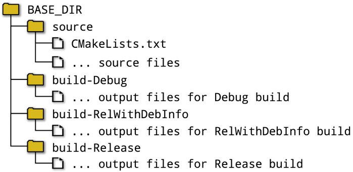

# ----Part II: Builds In Depth----

In the preceding chapters, the most fundamental aspects of CMake were progressively introduced. Core language features, key concepts and important building blocks were presented, providing a solid foundation for a deeper exploration of CMake’s functionality.

【译】在前面的章节中，逐步介绍了CMake的最基本方面。介绍了核心语言特性、关键概念和重要构建块，为更深入地探索CMake的功能奠定了坚实的基础。

In this part of the book, the build products become the focus. Chapters cover the toolchain and build configuration, different types of targets, carrying out custom tasks and handling platformspecific features. Understanding these areas well can be the difference between a fragile, complex project and a robust, easy to maintain one.

【译】在本书的这一部分，构建产品成为重点。各章涵盖了工具链和构建配置、不同类型的目标、执行自定义任务和处理平台特定功能。很好地理解这些领域可能是脆弱、复杂的项目和健壮、易于维护的项目之间的区别。

# Ch13. Build Type

This chapter and the next cover two closely related topics. The build type (also known as the build configuration or build scheme in some IDE tools) is a high level control which selects different sets of compiler and linker behavior. Manipulation of the build type is the subject of this chapter, while the next chapter presents more specific details of controlling compiler and linker options. Together, these chapters cover material every CMake developer will typically use for all but the most trivial projects.

【译】本章和下一章涵盖了两个密切相关的主题。构建类型（在某些IDE工具中也称为构建配置或构建方案）是一个高级控件，用于选择不同的编译器和链接器行为集。构建类型的操作是本章的主题，而下一章将介绍控制编译器和链接器选项的更具体细节。这些章节共同涵盖了每个CMake开发人员通常用于除最琐碎项目之外的所有项目的材料。

## 13.1. Build Type Basics

The build type has the potential to affect almost everything about the build in one way or another. While it primarily has a direct effect on the compiler and linker behavior, it also has an effect on the directory structure used for a project. This can in turn influence how a developer sets up their own local development environment, so the effects of the build type can be quite far reaching.

【译】构建类型有可能以某种方式影响构建的几乎所有内容。虽然它主要对编译器和链接器行为有直接影响，但它也对项目使用的目录结构有影响。这反过来会影响开发人员如何设置自己的本地开发环境，因此构建类型的影响可能会非常深远。

Developers commonly think of builds as being one of two arrangements: debug or release. //// For a debug build, compiler flags are used to enable the recording of information that debuggers can use to associate machine instructions with the source code. Optimizations are frequently disabled in such builds so that the mapping from machine instruction to source code location is direct and easy to follow when stepping through program execution. //// A release build, on the other hand, generally has full optimizations enabled and no debug information generated.

【译】开发人员通常认为构建是两种安排之一：调试或发布。//// 对于调试版本( debug build)，编译器标志用于记录信息，调试器可以使用这些信息将机器指令与源代码相关联。在这种构建中，优化经常被禁用，这样在逐步执行程序时，从机器指令到源代码位置的映射是直接且易于遵循的。//// 另一方面，发布版本( release build)通常启用了完全优化，并且没有生成调试信息。

These are examples of what CMake refers to as the *build type*. While projects are able to define whatever build types they want, the default build types provided by CMake are usually sufficient for most projects:

【译】这些是CMake所称的构建类型的示例。虽然项目可以定义他们想要的任何构建类型，但CMake提供的默认构建类型通常足以满足大多数项目的需求：

\##\>\>\>\>\>\>\>\>\>\>\>\>\>\>\>\>\>\>\>\>\>\>\>\>\>\>\>\>\>\>\>\>\>\>\>\>

**\#(1)Debug**

With no optimizations and full debug information, this is commonly used during development and debugging, as it typically gives the fastest build times and the best interactive debugging experience.

【译】在没有优化和有完整调试信息的情况下，这通常在开发和调试过程中使用，因为它通常会提供最快的构建时间和最佳的交互式调试体验。

\#(2)Release

This build type typically provides full optimizations for speed and no debug information, although some platforms may still generate debug symbols in certain circumstances. It is generally the build type used when building software for final production releases.

【译】这种构建类型通常为速度提供了全面的优化，并且没有调试信息，尽管在某些情况下，一些平台仍可能生成调试符号。它通常是为最终生产版本构建软件时使用的构建类型。

**\#(3)RelWithDebInfo**

This is somewhat of a compromise of the previous two. It aims to give performance close to a Release build, but still allow some level of debugging. Most optimizations for speed are typically applied, but most debug functionality is also enabled. This build type is therefore most useful when the performance of a Debug build is not acceptable even for a debugging session. Note that the default settings for RelWithDebInfo will disable assertions.

【译】这在一定程度上是前两者的妥协。它旨在提供接近Release版本的性能，但仍允许一定程度的调试。通常会应用大多数速度优化，但也会启用大多数调试功能。因此，当调试构建的性能即使对于调试会话也不可接受时，这种构建类型最有用。请注意，RelWithDebInfo的默认设置将禁用断言。

**\#(4)MinRizeRel**

This build type is typically only used for constrained resource environments such as embedded devices. The code is optimized for size rather than speed and no debug information is created.

这种构建类型通常仅用于资源受限的环境，如嵌入式设备。代码针对大小而不是速度进行了优化，并且没有创建调试信息。

\##\<\<\<\<\<\<\<\<\<\<\<\<\<\<\<\<\<\<\<\<\<\<\<\<\<\<\<\<\<\<\<\<\<\<\<\<

Each build type results in a different set of compiler and linker flags. It may also change other behaviors, such as altering which source files get compiled or what libraries to link to. These details are covered in the next few sections, but before launching into those discussions, it is essential to understand how to select the build type and how to avoid some common problems.

【译】每种构建类型都会产生一组不同的编译器和链接器标志。它也可能改变其他行为，例如更改编译的源文件或链接的库。这些细节将在接下来的几节中介绍，但在开始讨论之前，了解如何选择构建类型以及如何避免一些常见问题至关重要。

### 13.1.1. Single Configuration Generators

Back in Section 2.3, “Generating Project Files”, the different types of project generators were introduced. Some, like Makefiles and Ninja, support only a single build type per build directory. For these generators, the build type has to be chosen by setting the CMAKE_BUILD_TYPE cache variable. For example, to configure and then build a project with Ninja, one might use commands like this:

【译】回到第2.3节“生成项目文件”，介绍了不同类型的项目生成器。有些，如Makefiles和Ninja，每个构建目录只支持一种构建类型。对于这些生成器，必须通过设置CMAKE_BUILD_TYPE缓存变量来选择构建类型。例如，要使用Ninja配置并构建项目，可以使用以下命令：

\`\`\`sh

cmake -G Ninja -DCMAKE_BUILD_TYPE:STRING=Debug ../source

cmake --build .

\`\`\`

The CMAKE_BUILD_TYPE cache variable can also be changed in the CMake GUI application instead of from the command line, but the end effect is the same. Rather than switching between different build types, however, an alternative strategy is to set up separate build directories for each build type, all still using the same sources. Such a directory structure might look something like this:

【译】CMAKE_BUILD_TYPE缓存变量也可以在CMAKE GUI应用程序中更改，而不是从命令行更改，但最终效果是相同的。然而，与其在不同的构建类型之间切换，另一种策略是为每种构建类型设置单独的构建目录，所有这些目录仍然使用相同的源代码。这样的目录结构可能看起来像这样：

If frequently switching between build types, this arrangement avoids having to constantly recompile the same sources just because compiler flags change. It also allows a single configuration generator to effectively act like a multi configuration generator, with IDE environments like Qt Creator supporting switching between build directories just as easily as Xcode or Visual Studio allow switching between build schemes or configurations.

【译】如果在构建类型之间频繁切换，这种安排可以避免仅仅因为编译器标志发生变化而不断重新编译相同的源代码。它还允许单个配置生成器有效地充当多配置生成器，Qt Creator等IDE环境支持在构建目录(buildDirectories)之间切换，就像Xcode或Visual Studio允许在构建方案（buildSchemes）或配置（configurations）之间切换一样简单。

### 13.1.2. Multiple Configuration Generators

Some generators, notably Xcode and Visual Studio, support multiple configurations in a single build directory. These generators ignore the CMAKE_BUILD_TYPE cache variable and instead require the developer to choose the build type within the IDE or with a command line option at build time. Configuring and building such projects would look something like this:

【译】一些生成器，特别是Xcode和Visual Studio，在单个构建目录中支持多种配置。这些生成器忽略CMAKE_BUILD_TYPE缓存变量，而是要求开发人员在IDE中或在构建时使用命令行选项选择构建类型。配置和构建这样的项目看起来像这样：

\`\`\`sh

cmake -G Xcode ../source

cmake --build . --config Debug

\`\`\`

When building within the Xcode IDE, the build type is controlled by the build scheme, while within the Visual Studio IDE, the current solution configuration controls the build type. Both environments keep separate directories for the different build types, so switching between builds doesn’t cause constant rebuilds. In effect, the same thing is being done as the multiple build directory arrangement described above for single configuration generators, it’s just that the IDE is handling the directory structure on the developer’s behalf.

【译】在Xcode IDE中构建时，构建类型由构建方案控制，而在Visual Studio IDE中，当前解决方案配置控制构建类型。这两种环境都为不同的构建类型保留了单独的目录，因此在构建之间切换不会导致不断的重建。实际上，与上述单个配置生成器的多构建目录排列相同，只是IDE代表开发人员处理目录结构。

## 13.2. Common Errors

Note how for single configuration generators, the build type is specified at configure time, whereas for multi configuration generators, the build type is specified at build time. This distinction is critical, as it means the build type is not always known when CMake is processing a project’s CMakeLists.txt file. Consider the following piece of CMake code, which unfortunately is rather common, but demonstrates an incorrect pattern:

【译】请注意，对于单配置生成器，构建类型是在配置时指定的，而对于多配置生成器，构建类型是在构建时指定的。这种区别至关重要，因为这意味着当CMake处理项目的CMakeLists.txt文件时，并不总是知道构建类型。考虑以下CMake代码，不幸的是，它很常见，但展示了一个不正确的模式：

\`\`\`cmake

\# WARNING: Do not do this!

if(CMAKE_BUILD_TYPE STREQUAL "Debug")

\# Do something only for debug builds

endif()

\`\`\`

The above would work fine for Makefile-based generators and Ninja, but not for Xcode or Visual Studio. In practice, just about any logic based on CMAKE_BUILD_TYPE within a project is questionable unless it is protected by a check to confirm a single configuration generator is being used. For multi configuration generators, this variable is likely to be empty, but even if it isn’t, its value should be considered unreliable because the build will ignore it. Rather than referring to CMAKE_BUILD_TYPE in the CMakeLists.txt file, projects should instead use other more robust alternative techniques, such as generator expressions based on \$\<CONFIG:…\>.

【译】上述方法适用于基于Makefile的生成器和Ninja，但不适用于Xcode或Visual Studio。在实践中，项目中基于CMAKE_BUILD_TYPE的任何逻辑都是有问题的，除非它受到检查的保护，以确认正在使用单个配置生成器。对于多配置生成器，此变量可能为空，但即使不是，其值也应被视为不可靠，因为构建会忽略它。项目不应在CMakeLists.txt文件中引用CMAKE_BUILD_TYPE，而应使用其他更稳健的替代技术，例如基于\$\<CONFIG:…\>的生成器表达式。

When scripting builds, a common deficiency is to assume a particular generator is used or to not properly account for differences between single and multi configuration generators. Developers should ideally be able to change the generator in one place and the rest of the script should still function correctly. Conveniently, single configuration generators will ignore any build-time specification and multi configuration generators will ignore the CMAKE_BUILD_TYPE variable, so by specifying both, a script can account for both cases. For example:

【译】在脚本构建时，一个常见的缺陷是假设使用了特定的生成器，或者没有正确考虑单配置生成器和多配置生成器之间的差异。理想情况下，开发人员应该能够在一个地方更改生成器，而脚本的其余部分仍应正常运行。方便的是，单个配置生成器将忽略任何构建时规范，多个配置生成器将忽视CMAKE_BUILD_TYPE变量，因此通过同时指定这两个变量，脚本可以同时考虑这两种情况。例如：

\`\`\`sh

mkdir build

cd build

cmake -G Ninja -DCMAKE_BUILD_TYPE=Release ../source

cmake --build . --config Release

\`\`\`

With the above example, a developer could simply change the generator name given to the -G parameter and the rest of the script would work unchanged.

【译】通过上面的示例，开发人员可以简单地更改-G参数的生成器名称，脚本的其余部分将保持不变。

Not explicitly setting the CMAKE_BUILD_TYPE for single configuration generators is also common, but usually not what the developer intended. A behavior unique to single configuration generators is that if CMAKE_BUILD_TYPE is not set, the build type is empty. This occasionally leads to a misunderstanding by some developers that an empty build type is equivalent to Debug, but this is not the case. An empty build type is its own unique, nameless build type. In such cases, no configuration-specific compiler or linker flags are used, which often simply results in invoking the compiler and linker with minimal flags and hence the behavior is determined by the compiler’s and linker’s own default behavior. While this may often be similar to the Debug build type’s behavior, it is by no means guaranteed.

【译】不为单个配置生成器显式设置CMAKE_BUILD_TYPE也很常见，但通常不是开发人员想要的。////单个配置生成器特有的行为是，如果未设置CMAKE_BUILD_TYPE，则构建类型为空。这偶尔会导致一些开发人员误解为空构建类型等同于调试，但事实并非如此。空构建类型是它自己独特的、无名的构建类型。在这种情况下，不使用特定于配置的编译器或链接器标志，这通常只会导致用最少的标志调用编译器和链接器，因此行为由编译器和链接者自己的默认行为决定。虽然这通常与Debug构建类型的行为相似，但绝不能保证。

## 13.3. Custom Build Types

Sometimes a project may want to limit the set of build types to a subset of the defaults, or it may want to add other custom build types with a special set of compiler and linker flags. A good example of the latter is adding a build type for profiling or code coverage, both of which require specific compiler and linker settings.

【译】有时，项目可能希望将构建类型集限制为默认值的子集，或者可能希望添加其他具有特殊编译器和链接器标志集的自定义构建类型。后者的一个很好的例子是添加用于分析或代码覆盖率的构建类型，这两者都需要特定的编译器和链接器设置。

There are two main places where a developer may see the set of build types. When using multi configuration generators like Xcode and Visual Studio, the IDE environment provides a drop-down list or similar from which the developer selects the configuration they wish to build. For single configuration generators like Makefiles or Ninja, the build type is entered directly for the CMAKE_BUILD_TYPE cache variable, but the CMake GUI application can be made to present a combo box of valid choices instead of a simple text edit field. The mechanisms behind these two cases are different, so they must be handled separately.

【译】开发人员可以在两个主要地方看到构建类型集。当使用Xcode和Visual Studio等多配置生成器时，IDE环境提供了一个下拉列表或类似列表，开发人员可以从中选择他们想要构建的配置。对于Makefiles或Ninja等单一配置生成器，可以直接为CMAKE_BUILD_TYPE缓存变量输入构建类型，但CMAKE GUI应用程序可以显示有效选项的组合框，而不是简单的文本编辑字段。这两起案件背后的机制不同，因此必须分开处理。

The set of build types known to multi configuration generators is controlled by the CMAKE_CONFIGURATION_TYPES cache variable, or more accurately, by the value of this variable at the end of processing the top level CMakeLists.txt file. The first encountered project() command populates the cache variable with a default list if it has not already been defined, but projects may modify the non-cache variable of the same name after that point (modifying the cache variable is unsafe since it may discard changes made by the developer). Custom build types can be defined by adding them to CMAKE_CONFIGURATION_TYPES and unwanted build types can be removed from that list.

【译】多配置生成器已知的构建类型集由CMAKE_CONFIGURATION_TYPES缓存变量控制，或者更准确地说，由处理顶级CMakeLists.txt文件结束时该变量的值控制。如果缓存变量尚未定义，则第一个遇到的project()命令会用默认列表填充缓存变量，但在此之后，项目可能会修改同名的非缓存变量（修改缓存变量是不安全的，因为它可能会丢弃开发人员所做的更改）。自定义构建类型可以通过将其添加到CMAKE_CONFIGURATION_TYPES中来定义，并且可以从该列表中删除不需要的构建类型。

Care needs to be taken, however, to avoid setting CMAKE_CONFIGURATION_TYPES if it is not already defined. Prior to CMake 3.9, a very common approach for determining whether a multi configuration generator was being used was to check if CMAKE_CONFIGURATION_TYPES was non-empty. Even parts of CMake itself did this prior to 3.11. While this method is usually accurate, it is not unusual to see projects unilaterally set CMAKE_CONFIGURATION_TYPES even if using a single configuration generator. This can lead to wrong decisions being made regarding the type of generator in use. To address this, CMake 3.9 added a new GENERATOR_IS_MULTI_CONFIG global property which is set to true when a multi configuration generator is being used, providing a definitive way to obtain that information instead of relying on inferring it from CMAKE_CONFIGURATION_TYPES. Even so, checking CMAKE_CONFIGURATION_TYPES is still such a prevalent pattern that projects should continue to only modify it if it exists and never create it themselves. It should also be noted that prior to CMake 3.11, adding custom build types to CMAKE_CONFIGURATION_TYPES was not technically safe. Certain parts of CMake only accounted for the default build types, but even so, projects may still be able to usefully define custom build types with earlier CMake versions, depending on how they are going to be used. That said, for better robustness, it is still recommended to use at least CMake 3.11 if custom build types are going to be defined.

【译】但是，需要注意避免设置CMAKE_CONFIGURATION_TYPES（如果尚未定义）。在CMake 3.9之前，确定是否使用了多配置生成器的一种非常常见的方法是检查CMAKE_CONFIGURATION_TYPES是否为非空。甚至CMake本身的部分在3.11之前也这样做了。虽然这种方法通常是准确的，但即使使用单个配置生成器，也经常看到项目单方面设置CMAKE_CONFIGURATION_TYPES。这可能会导致对使用的生成器类型做出错误的决定。为了解决这个问题，CMake 3.9添加了一个新的GENERATOR_IS_MULTI_CONFIG全局属性，当使用多配置生成器时，该属性设置为true，提供了一种获取该信息的明确方法，而不是依赖于从CMake_CONFIGURATION_TYPES推断它。即便如此，检查CMAKE_CONFIGURATION_TYPES仍然是一种流行的模式，项目应该只在它存在的情况下继续修改它，而永远不要自己创建它。还应该注意的是，在CMake 3.11之前，向CMake_CONFIGURATION_TYPES添加自定义构建类型在技术上并不安全。CMake的某些部分只考虑了默认的构建类型，但即便如此，项目仍然可以使用早期的CMake版本有效地定义自定义构建类型，具体取决于它们的使用方式。也就是说，为了更好的健壮性，如果要定义自定义构建类型，仍然建议至少使用CMake 3.11。

Another aspect of this issue is that developers may add their own types to the CMAKE_CONFIGURATION_TYPES cache variable and/or remove some of the ones they are not interested in. Projects should therefore not make any assumptions about what configuration types are or are not defined.

【译】这个问题的另一个方面是，开发人员可能会将自己的类型添加到CMAKE_CONFIGURATION_TYPES缓存变量中，和/或删除一些他们不感兴趣的类型。因此，项目不应该对定义或未定义的配置类型做出任何假设。

Taking the above points into account, the following pattern shows the preferred way for projects to add their own custom build types for multi configuration generators:

【译】考虑到上述几点，以下模式显示了项目为多配置生成器添加自己的自定义构建类型的首选方式：

\##---------------------------------------------------------\>\>\>\>\>\>

cmake_minimum_required(3.11)

project(Foo)

if(CMAKE_CONFIGURATION_TYPES)

if(NOT "Profile" IN_LIST CMAKE_CONFIGURATION_TYPES)

list(APPEND CMAKE_CONFIGURATION_TYPES Profile)

endif()

endif()

\# Set relevant Profile-specific flag variables if not already set...

\##---------------------------------------------------------\<\<\<\<\<\<

For single configuration generators, there is only one build type and it is specified by the CMAKE_BUILD_TYPE cache variable, which is a string. In the CMake GUI, this is normally presented as a text edit field, so the developer can edit it to contain whatever arbitrary content they wish. As discussed back in Section 9.6, “Cache Variable Properties”, however, cache variables can have their STRINGS property defined to hold a set of valid values. The CMake GUI appliation will then present that variable as a combo box containing the valid values instead of as a text edit field.

【译】对于单个配置生成器，只有一种构建类型，它由CMAKE_BUILD_TYPE缓存变量指定，该变量是一个字符串。在CMAKE GUI中，它通常显示为文本编辑字段，因此开发人员可以编辑它以包含他们想要的任何任意内容。然而，如第9.6节“缓存变量属性”所述，缓存变量可以定义其STRINGS属性来保存一组有效值。CMake GUI应用程序将该变量显示为包含有效值的组合框，而不是文本编辑字段。

\`\`\`cmake

set_property(CACHE CMAKE_BUILD_TYPE PROPERTY

STRINGS Debug Release Profile)

\`\`\`

Properties can only be changed from witinh the project’s CMakeLists.txt files, so they can safely set the STRINGS property without having to worry about preserving any developer changes. Note, however, that setting the STRINGS property of a cache variable does not guarantee that the cache variable will hold one of the defined values, it only controls how the variable is presented in the CMake GUI application. Developers can still set CMAKE_BUILD_TYPE to any value at the cmake command line or edit the CMakeCache.txt file manually. In order to rigorously require the variable to have one of the defined values, a project must explicitly perform that test itself.

【译】属性只能从项目的CMakeLists.txt文件中更改，因此他们可以安全地设置STRINGS属性，而不必担心保留任何开发人员的更改。但是，请注意，设置缓存变量的STRINGS属性并不能保证缓存变量将保存定义的值之一，它只控制变量在CMake GUI应用程序中的显示方式。开发人员仍然可以在CMAKE命令行将CMAKE_BUILD_TYPE设置为任何值，或手动编辑CMakeCache.txt文件。为了严格要求变量具有定义的值之一，项目必须明确地自行执行该测试。

\#----------------------------------------------\>\>\>\>\>\>

set(allowableBuildTypes Debug Release Profile)

\# WARNING: This logic is not sufficient

if(NOT CMAKE_BUILD_TYPE IN_LIST allowableBuildTypes)

message(FATAL_ERROR "\${CMAKE_BUILD_TYPE} is not a defined build type")

endif()

\#----------------------------------------------\<\<\<\<\<\<

The default value for CMAKE_BUILD_TYPE is an empty string, so the above would cause a fatal error for both single and multi configuration generators unless the developer explicitly set it. This is undesirable, especially for multi configuration generators which don’t even use the CMAKE_BUILD_TYPE variable’s value. This can be handled by having the project provide a default value if CMAKE_BUILD_TYPE hasn’t been set. Furthermore, the techniques for multi and single configuration generators can and should be combined to give robust behavior across all generator types. The end result would look something like this:

【译】CMAKE_BUILD_TYPE的默认值是一个空字符串，因此除非开发人员明确设置，否则上述操作将导致单配置生成器和多配置生成器出现致命错误。这是不可取的，特别是对于甚至不使用CMAKE_BUILD_TYPE变量值的多配置生成器。如果尚未设置CMAKE_BUILD_TYPE，可以通过让项目提供默认值来处理。此外，多配置和单配置生成器的技术可以而且应该结合起来，以在所有生成器类型中提供稳健的行为。最终结果看起来像这样：

\#------------------------------------------------\>\>\>\>\>\>

cmake_minimum_required(3.11)

project(Foo)

if(CMAKE_CONFIGURATION_TYPES)

if(NOT "Profile" IN_LIST CMAKE_CONFIGURATION_TYPES)

> list(APPEND CMAKE_CONFIGURATION_TYPES Profile)

endif()

else()

set(allowableBuildTypes Debug Release Profile)

set_property(CACHE CMAKE_BUILD_TYPE PROPERTY

STRINGS "\${allowableBuildTypes}")

if(NOT CMAKE_BUILD_TYPE)

> set(CMAKE_BUILD_TYPE Debug CACHE STRING "" FORCE)

elseif(NOT CMAKE_BUILD_TYPE IN_LIST allowableBuildTypes)

> message(FATAL_ERROR "Invalid build type: \${CMAKE_BUILD_TYPE}")

endif()

endif()

\# Set relevant Profile-specific flag variables if not already set...

\#------------------------------------------------\<\<\<\<\<\<

All of the techniques discussed above merely allow a custom build type to be selected, they don’t define anything about that build type. Fundamentally, when a build type is selected, it specifies which configuration-specific variables CMake should use and it also affects any generator expressions whose logic depends on the current configuration (i.e. \$\<CONFIG\> and \$\<CONFIG:…\>). These variables and generator expressions are discussed in detail in the next chapter, but for now, the following two families of variables are of primary interest:

【译】上面讨论的所有技术都只允许选择自定义构建类型，它们没有定义任何关于该构建类型的内容。从根本上说，当选择构建类型时，它指定了CMake应该使用哪些特定于配置的变量，它还影响任何逻辑取决于当前配置的生成器表达式（即\$\<CONFIG\>和\$\<CONFIG：…\>）。下一章将详细讨论这些变量和生成器表达式，但目前主要关注以下两个变量族：

• CMAKE\_\<LANG\>\_FLAGS\_\<CONFIG\>

• CMAKE\_\<TARGETTYPE\>\_LINKER_FLAGS\_\<CONFIG\>

These can be used to add additional compiler and linker flags over and above the default set provided by the same-named variables without the \_\<CONFIG\> suffix. For example, flags for a custom Profile build type could be defined as follows:

【译】这些可用于在没有\_\<CONFIG\>后缀的同名变量提供的默认集之上添加额外的编译器和链接器标志。例如，自定义配置文件构建类型的标志可以定义如下：

\`\`\`cmake

set(CMAKE_C_FLAGS_PROFILE "-p -g -O2" CACHE STRING "")

set(CMAKE_CXX_FLAGS_PROFILE "-p -g -O2" CACHE STRING "")

set(CMAKE_EXE_LINKER_FLAGS_PROFILE "-p -g -O2" CACHE STRING "")

set(CMAKE_SHARED_LINKER_FLAGS_PROFILE "-p -g -O2" CACHE STRING "")

set(CMAKE_STATIC_LINKER_FLAGS_PROFILE "-p -g -O2" CACHE STRING "")

set(CMAKE_MODULE_LINKER_FLAGS_PROFILE "-p -g -O2" CACHE STRING "")

\`\`\`

The above assumes a GCC-compatible compiler to keep the example simple and turns on profiling as well as enabling debugging symbols and most optimizations. An alternative is to base the compiler and linker flags on one of the other build types and add the extra flags needed. This can be done as long as it comes after the project() command, since that command populates the default compiler and linker flag variables. For profiling, the RelWithDebInfo default build type is a good one to choose as the base configuration since it enables both debugging and most optimizations:

【译】上面假设有一个GCC兼容的编译器来保持示例的简单性，并打开性能分析以及启用调试符号和大多数优化。另一种方法是将编译器和链接器标志基于其他构建类型之一，并添加所需的额外标志。只要它在project()命令之后，就可以这样做，因为该命令会填充默认的编译器和链接器标志变量。对于性能分析，RelWithDebInfo默认构建类型是一个不错的选择，因为它既可以进行调试，也可以进行大多数优化：

\#----------------------------------------\>\>\>\>\>\>

set(CMAKE_C_FLAGS_PROFILE

"\${CMAKE_C_FLAGS_RELWITHDEBINFO} -p" CACHE STRING "")

set(CMAKE_CXX_FLAGS_PROFILE

"\${CMAKE_CXX_FLAGS_RELWITHDEBINFO} -p" CACHE STRING "")

set(CMAKE_EXE_LINKER_FLAGS_PROFILE

"\${CMAKE_EXE_LINKER_FLAGS_RELWITHDEBINFO} -p" CACHE STRING "")

set(CMAKE_SHARED_LINKER_FLAGS_PROFILE

"\${CMAKE_SHARED_LINKER_FLAGS_RELWITHDEBINFO} -p" CACHE STRING "")

set(CMAKE_STATIC_LINKER_FLAGS_PROFILE

"\${CMAKE_STATIC_LINKER_FLAGS_RELWITHDEBINFO} -p" CACHE STRING "")

set(CMAKE_MODULE_LINKER_FLAGS_PROFILE

"\${CMAKE_MODULE_LINKER_FLAGS_RELWITHDEBINFO} -p" CACHE STRING "")

\#----------------------------------------\<\<\<\<\<\<

Each custom configuration should have the associated compiler and linker flag variables defined. For some multi configuration generator types, CMake will check that the required variables exist and will fail with an error if they are not set.

【译】每个自定义配置都应该定义相关的编译器和链接器标志变量。对于某些多配置生成器类型，CMake将检查所需变量是否存在，如果未设置，则会失败并出现错误。

Another variable which may sometimes be defined for a custom build type is CMAKE\_\<CONFIG\>\_POSTFIX. It is used to initialize the \<CONFIG\>\_POSTFIX property of each library target, with its value being appended to the file name of such targets when built for the specified configuration. This allows libraries from multiple build types to be put in the same directory without overwriting each other. CMAKE_DEBUG_POSTFIX is often set to values like d or \_debug, especially for Visual Studio builds where different runtime DLL’s must be used for Debug and non-Debug builds, so packages may need to include libraries for both build types. In the case of the custom Profile build type defined above, an example might be:

【译】有时可能为自定义构建类型定义的另一个变量是CMAKE\_\<CONFIG\>\_POSTFIX。它用于初始化每个库目标的\<CONFIG\>\_POSTFIX属性，当为指定配置构建时，其值将附加到这些目标的文件名上。这允许将多个构建类型的库放在同一目录中，而不会相互覆盖。CMAKE_DEBUG_POSTFIX通常设置为d或_DEBUG等值，特别是对于Visual Studio构建，其中调试和非调试构建必须使用不同的运行时DLL，因此包可能需要包含这两种构建类型的库。对于上面定义的自定义配置文件构建类型，示例可能是：

\`\`\`cmake

set(CMAKE_PROFILE_POSTFIX \_profile)

\`\`\`

If creating packages that contain multiple build types, setting CMAKE\_\<CONFIG\>\_POSTFIX for each build type is highly recommended. By convention, the postfix for Release builds is typically empty. Note though that the \<CONFIG\>\_POSTFIX target property is ignored on Apple platforms.

【译】如果创建包含多种构建类型的包，强烈建议为每种构建类型设置CMAKE\_\<CONFIG\>\_POSTFIX。按照惯例，Release版本的后缀通常为空。请注意，在Apple平台上忽略了\<CONFIG\>\_POSTFIX目标属性。

For historical reasons, the items passed to the target_link_libraries() command can be prefixed with the debug or optimized keywords to indicate that the named item should only be linked in for debug or non-debug builds respectively. A build type is considered to be a debug build if it is listed in the DEBUG_CONFIGURATIONS global property, otherwise it is considered to be optimized. For custom build types, they should have their name added to this global property if they should be treated as a debug build in this scenario. As an example, if a project defines its own custom build type called StrictChecker and that build type should be considered an unoptimized debug build type, it can (and should) make this clear like so:

【译】由于历史原因，传递给target_link_libraies()命令的项可以以debug或optimized关键字作为前缀，以指示命名项应仅分别链接到调试或非调试版本。如果某个构建类型列在DEBUG_CONFIGURATIONS全局属性中，则被视为调试构建，否则被视为已优化。对于自定义构建类型，如果在这种情况下应将其视为调试构建，则应将其名称添加到此全局属性中。例如，如果一个项目定义了自己的自定义构建类型StrictChecker，并且该构建类型应被视为未优化的调试构建类型，则可以（也应该）明确如下：

\`\`\`cmake

set_property(GLOBAL PROPERTY APPEND DEBUG_CONFIGURATIONS StrictChecker)

\`\`\`

New projects should normally prefer to use generator expressions instead of the debug and optimized keywords with the target_link_libraries() command. The next chapter discusses this area in more detail.

【译】新项目通常应该更喜欢使用生成器表达式，而不是使用target_link_libraries()命令的调试和优化关键字。下一章将更详细地讨论这一领域。

## 13.4. Recommended Practices

Developers should not assume a particular CMake generator is being used to build their project. Another developer on the same project may prefer to use a different generator because it integrates better with their IDE tool, or a future version of CMake may add support for a new generator type which might bring other benefits. Certain build tools may contain bugs which a project may later be affected by, so it can be useful to have alternative generators to fall back on until such bugs are fixed. Expanding a project’s set of supported platforms can also be hindered if a particular CMake generator has been assumed.

【译】开发人员不应该假设正在使用特定的CMake生成器来构建他们的项目。同一项目中的另一位开发人员可能更喜欢使用不同的生成器，因为它与他们的IDE工具集成得更好，或者CMake的未来版本可能会添加对新生成器类型的支持，这可能会带来其他好处。某些构建工具可能包含项目以后可能会受到影响的错误，因此在修复这些错误之前，使用替代生成器是有用的。如果假设使用了特定的CMake生成器，扩展项目支持的平台集也会受到阻碍。

When using single configuration generators like Makefiles or Ninja, consider using multiple build directories, one for each build type of interest. This allows switching between build types without forcing a complete recompile each time. This provides similar behavior to that inherently offered by multi configuration generators and can be a useful way to enable IDE tools like Qt Creator to simulate multi configuration functionality.

【译】当使用Makefiles或Ninja等单个配置生成器时，考虑使用多个构建目录，每种感兴趣的构建类型一个。这允许在构建类型之间切换，而无需每次强制完全重新编译。这提供了与多配置生成器固有的行为类似的行为，并且可以成为使Qt Creator等IDE工具能够模拟多配置功能的有用方法。

For single configuration generators, consider setting CMAKE_BUILD_TYPE to a better default value if it is empty. While an empty build type is technically valid, it is also often misunderstood by developers to mean a Debug build rather than its own distinct build type. Furthermore, avoid creating logic based on CMAKE_BUILD_TYPE unless it is first confirmed that a single configuration generator is being used. Even then, such logic is likely to be fragile and could probably be expressed with more generality and robustness using generator expressions instead.

【译】对于单配置生成器，如果CMAKE_BUILD_TYPE为空，请考虑将其设置为更好的默认值。虽然空构建类型在技术上是有效的，但它也经常被开发人员误解为调试构建，而不是它自己的独特构建类型。此外，除非首先确认使用了单个配置生成器，否则避免基于CMAKE_BUILD_TYPE创建逻辑。即便如此，这种逻辑也可能很脆弱，可能会使用生成器表达式来表达更具普遍性和鲁棒性。

Only consider modifying the CMAKE_CONFIGURATION_TYPES variable if it is known that a multi configuration generator is being used or if the variable already exists. If adding a custom build type or removing one of the default build types, do not modify the cache variable but instead change the regular variable of the same name (it will take precedence over the cache variable). Also prefer to add and remove individual items rather than completely replacing the list. Both of these measures will help avoid interfering with changes made to the cache variable by the developer.

【译】只有在已知正在使用多配置生成器或变量已存在的情况下，才考虑修改CMAKE_CONFIG_TYPES变量。如果添加自定义生成类型或删除默认生成类型之一，请不要修改缓存变量，而是更改同名的常规变量（它将优先于缓存变量）。也更喜欢添加和删除单个项目，而不是完全替换列表。这两种措施都有助于避免干扰开发人员对缓存变量所做的更改。

If requiring CMake 3.9 or later, use the GENERATOR_IS_MULTI_CONFIG global property to definitively query the generator type instead of relying on the existence of CMAKE_CONFIGURATION_TYPES to perform a less robust check.

【译】如果需要CMake 3.9或更高版本，请使用GENERATOR_IS_MULTI_CONFIG全局属性来明确查询生成器类型，而不是依赖CMake_CONFIGURATION_TYPES的存在来执行不太稳健的检查。

A common but incorrect practice is to query the LOCATION target property to work out a target’s output file name. A related error is to assume a particular build output directory structure in custom commands (see “Chapter 17, Custom Tasks”). These methods do not work for all build types, since LOCATION is not known at configure time for multi configuration generators and the build output directory structure is typically different across the various CMake generator types. Generator expressions like \$\<TARGET_FILE:…\> should be used instead, as they robustly provide the required path for all generators, whether they be single or multi configuration.

【译】一种常见但不正确的做法是查询LOCATION目标属性以计算目标的输出文件名。一个相关的错误是在自定义命令中假设特定的构建输出目录结构（请参阅“第17章，自定义任务”）。这些方法并不适用于所有构建类型，因为对于多配置生成器，在配置时不知道LOCATION，并且构建输出目录结构在各种CMake生成器类型中通常是不同的。应该使用像\$\<TARGET_FILE:…\>这样的生成器表达式，因为它们为所有生成器提供了所需的路径，无论是单配置还是多配置。
