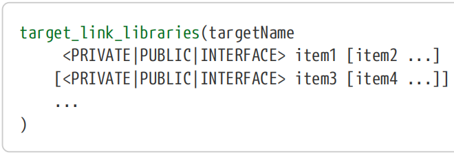
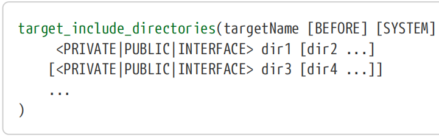
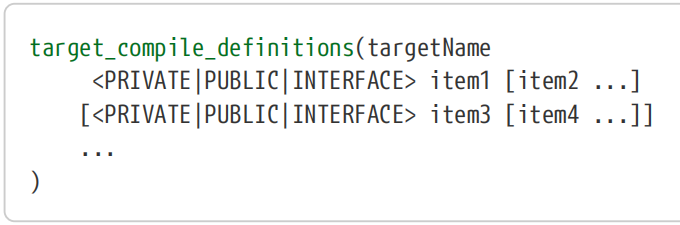
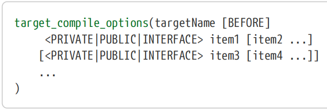
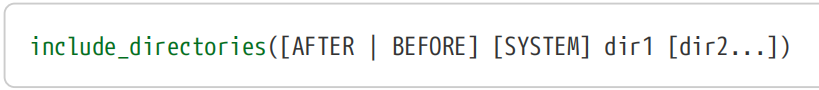
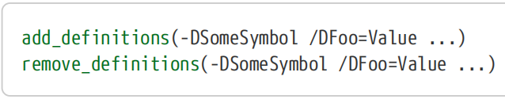
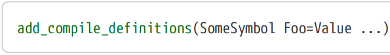
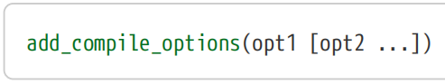
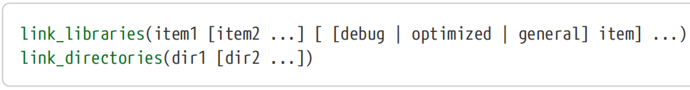
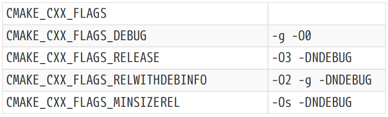

# Ch14. Compiler And Linker Essentials
  Ch14.编译器和链接器基础
The previous chapter discussed the build type and how it relates to selecting a particular set of compiler and linker behavior. This chapter discusses the fundamentals of how that compiler and linker behavior is controlled. The material presented here covers some of the most important topics and techniques with which every CMake developer should become familiar.

【译】上一章讨论了构建类型以及它与选择一组特定的编译器和链接器行为的关系。本章讨论了如何控制编译器和链接器行为的基本原理。这里介绍的材料涵盖了每个CMake开发人员都应该熟悉的一些最重要的主题和技术。

Before delving into the details, it is important to note that as CMake has evolved, the available methods for controlling the compiler and linker behavior have also improved. The focus has shifted from a more build-global view to one where the requirements of each individual target can be controlled, along with how those requirements should or should not be carried across to any other targets that depend on it. This is an important shift in thinking, as it affects how a project can most effectively define the way targets should be built. CMake’s more mature features can be used to control behavior at a coarse level at the expense of losing the ability to define relationships between targets. The more recent target-focused features should generally be preferred instead, since they greatly improve the robustness of the build and offer much greater precision of control over compiler and linker behavior. The newer features also tend to be more consistent in their behavior and in the way they are meant to be used.

【译】在深入探讨细节之前，重要的是要注意，随着CMake的发展，控制编译器和链接器行为的可用方法也得到了改进。重点已经从更注重构建的全局视图转移到可以控制每个单独目标的需求，以及这些需求应该或不应该如何传递到依赖它的任何其他目标的视图。这是一个重要的思维转变，因为它影响了项目如何最有效地定义构建目标的方式。CMake更成熟的功能可用于粗略地控制行为，但代价是失去定义目标之间关系的能力。通常应该首选更新的以目标为中心的功能，因为它们大大提高了构建的鲁棒性，并对编译器和链接器行为提供了更高的控制精度。新功能的行为和使用方式也往往更加一致。

## 14.1. Target Properties

Within CMake’s property system, the target properties form the primary mechanism by which compiler and linker flags are controlled. Some properties provide the ability to specify any arbitrary flag, whereas others focus on a specific capability so they can abstract away platform or compiler differences. This chapter focuses on the more commonly used and general purpose properties, with later chapters covering a number of the more specific ones.

【译】在CMake的属性系统中，目标属性构成了控制编译器和链接器标志的主要机制。一些属性提供了指定任意标志的能力，而另一些属性则专注于特定的能力，因此可以抽象出平台或编译器的差异。本章重点介绍更常用和通用的属性，后面的章节将介绍一些更具体的属性。

### 14.1.1. Compiler Flags

The most fundamental target properties for controlling compiler flags are the following, each of which hold a list of items:  【译】控制编译器标志的最基本目标属性如下，每个属性都包含一个项目列表：

##>>>>>>>>>>>>>>>>>>>>>>>>>>>>>>>>>>>>>>>>>>>
**#(1)INCLUDE_DIRECTORIES**

This is a list of directories to be used as header search paths, all of which must be absolute paths.CMake will add a compiler flag for each path with an appropriate prefix prepended (typically -I or /I). When a target is created, the initial value of this target property is taken from the directory property of the same name.
【译】这是一个用作头文件搜索路径的目录列表，所有目录都必须是绝对路径。CMake将为每个路径添加一个编译器标志，并在前面添加适当的前缀（通常是-I或/I）。创建目标时，此目标属性的初始值取自同名目录属性。

**#(2)COMPILE_DEFINITIONS**

This holds a list of definitions to be set on the compile command line. A definition has the form VAR or VAR=VALUE, which CMake will convert to the appropriate form for the compiler being used (typically -DVAR… or /DVAR…).   When a target is created, the initial value of this target property will be empty. There is a directory property of the same name, but it is not used to provide an initial value for this target property. Rather, the directory and target properties are combined in the final compiler command line.
【译】这包含要在编译命令行上设置的定义列表。定义的形式为VAR或VAR=VALUE，CMake会将其转换为所用编译器的适当形式（通常为-DVAR…或/DVAR…）。////目标被创建时，此目标属性的初始值将为空。有一个同名的目录属性，但它不用于为此目标属性提供初始值。相反，目录和目标属性在最终的编译器命令行中组合在一起。

**#(3)COMPILE_OPTIONS**

Any compiler flags that are neither header search paths nor symbol definitions are provided in this property. When a target is created, the initial value of this target property is taken from the directory property of the same name.
【译】此属性中提供了既不是头文件搜索路径也不是符号定义的任何编译器标志。目标被创建时，此目标属性的初始值取自同名目录属性。
##<<<<<<<<<<<<<<<<<<<<<<<<<<<<<<<<<<<<<<<<<<< 

Remark: An older and now deprecated target property with the name COMPILE_FLAGS used to serve a similar purpose as COMPILE_OPTIONS. The COMPILE_FLAGS property is treated as a single string that is included directly on the compiler command line. As a result, it may require manual escaping, whereas COMPILE_OPTIONS is a list and CMake performs any required escaping or quoting automatically.
【译】Remark: 名为COMPILE_FLAGS的较旧且现已弃用的目标属性用于与COMPILE_OPTIONS类似的目的。COMPILE_FLAGS属性被视为直接包含在编译器命令行上的单个字符串。因此，它可能需要手动转义，而COMPILE_OPTIONS是一个列表，CMake会自动执行任何所需的转义或引用。

The INCLUDE_DIRECTORIES and COMPILE_DEFINITIONS properties are really just conveniences, taking care of the compiler specific flags for the most common things projects often want to set. All remaining compiler specific flags are then provided in the COMPILE_OPTIONS property.
【译】INCLUDE_DIRECTORIES 和 COMPILE_DEFINITIONS属性实际上只是为了方便起见，为项目经常想要设置的最常见的东西提供编译器特定的标志。然后在COMPILE_OPTIONS属性中提供所有剩余的编译器特定标志。

Each of the three target properties above has a related target property with the same name, only with INTERFACE_ prepended. These interface properties do exactly the same thing, except instead of applying to the target itself, they apply to any other target which links directly to it. In other words, they are used to specify compiler flags which consuming targets should inherit. For this reason, they are often referred to as usage requirements, in contrast to the non-INTERFACE properties which are sometimes called build requirements. Two special library types IMPORTED and INTERFACE are discussed later in “Chapter 16, Target Types”. These special library types support only the INTERFACE_… target properties and not the non-INTERFACE_… properties.
【译】上述三个目标属性中的每一个都有一个同名的相关目标属性，只是前面加了INTERFACE_。这些接口属性的作用完全相同，除了它们不应用于目标本身，而是应用于直接链接到它的任何其他目标。换句话说，它们用于指定消耗目标应继承的编译器标志。因此，它们通常被称为使用要求，而非接口属性有时被称为构建要求。稍后在“第16章，目标类型”中讨论了两种特殊的库类型IMPORTED和INTERFACE。这些特殊的库类型仅支持INTERFACE_…目标属性，不支持非INTERFACE_..属性。

Unlike their non-interface counterparts, none of the above INTERFACE_… properties are intialized from directory properties. They instead all start out empty, since only the project has knowledge of what header search paths, defines and compiler flags should propagate to consuming targets.
【译】与非接口对应项不同，上述INTERFACE_…属性都不是从目录属性初始化的。相反，它们一开始都是空的，因为只有项目知道哪些头搜索路径、定义和编译器标志应该传播到消费目标。

All of the above target properties also support generator expressions. This is particularly useful for the COMPILE_OPTIONS property, since it enables only adding a particular flag if some condition is met, such as only for a particular compiler. Another common use is to obtain a path related to some other target and use it as part of an include directory.
【译】上述所有目标属性也支持生成器表达式。这对于COMPILE_OPTIONS属性特别有用，因为它仅在满足某些条件时才允许添加特定标志，例如仅适用于特定编译器。另一个常见用途是获取与其他目标相关的路径，并将其用作包含目录的一部分。

If compiler flags need to be manipulated at the individual source file level, target properties are not granular enough. For such cases, CMake provides the COMPILE_DEFINITIONS, COMPILE_FLAGS and COMPILE_OPTIONS source file properties (the COMPILE_OPTIONS source file property was only added in CMake 3.11). These are each analogous to their same-named target properties except that they apply only to the individual source file on which they are set. Note that their support for generator expressions has lagged behind that of the target properties, with the COMPILE_DEFINITIONS source file property gaining generator expression support in CMake 3.8 and the others in 3.11. Furthermore, the Xcode project file format does not support configuration specific source file properties at all, so if targeting Apple platforms, $<CONFIG> or $<CONFIG:…> should not be used in source file properties. Also keep in mind the warnings discussed back in Section 9.5, “Source Properties” regarding implementation details leading to performance issues when source file properties are used.
【译】如果需要在单个源文件级别操纵编译器标志，则目标属性不够精细。对于这种情况，CMake提供了COMPILE_DEFINITIONS、COMPILE_FLAGS和COMPILE_OPTIONS源文件属性（COMPILE_OPTIONS源文件属性仅在CMake 3.11中添加）。这些属性都类似于它们相同的命名目标属性，除了它们仅适用于设置它们的单个源文件。请注意，它们对生成器表达式的支持落后于目标属性，COMPILE_DEFINITIONS源文件属性在CMake 3.8中获得了生成器表达式支持，在3.11中获得了其他属性的支持。此外，Xcode项目文件格式根本不支持特定于配置的源文件属性，因此，如果针对Apple平台，则不应在源文件属性中使用$<CONFIG>或$<CONFIG：…>。还要记住第9.5节“源属性”中讨论的关于使用源文件属性时导致性能问题的实现细节的警告。

### 14.1.2. Linker Flags

The target properties associated with linker flags have similarities to those for the compiler flags, but there are fewer properties involved: 【译】与链接器标志关联的目标属性与编译器标志的目标属性相似，但涉及的属性较少：

**#(1)LINK_LIBRARIES**

This property holds a list of all libraries the target should link to directly. It is initially empty when the target is created and it supports generator expressions. Each library listed can be one of the following:
【译】此属性包含目标应直接链接到的所有库的列表。创建目标时，它最初为空，并且支持生成器表达式。列出的每个库可以是以下库之一：

• A path to a library, usually specified as an absolute path. 指向库的路径，通常指定为绝对路径。
• Just the library name without a path, usually also without any platform-specific file name prefix (e.g. lib) or suffix (e.g. .a, .so, .dll). 【译】只有库名，没有路径，通常也没有任何特定于平台的文件名前缀（例如lib）或后缀（例如.a、.so、.dll）。
• The name of a CMake library target. CMake will convert this to a path to the built library when generating the linker command, including supplying any prefix or suffix to the file name as appropriate for the platform. Because CMake handles all the various platform differences and paths on the project’s behalf, using a CMake target name is generally the preferred method.

【译】CMake库目标的名称。CMake在生成链接器命令时会将其转换为构建库的路径，包括根据平台的需要为文件名提供任何前缀或后缀。因为CMake代表项目处理所有各种平台差异和路径，所以使用CMake目标名称通常是首选方法。

CMake will use the appropriate linker flags to link each item listed in the LINK_LIBRARIES property. 【译】CMake将使用适当的链接器标志来链接link_LIBRARIES属性中列出的每个项目。

**#(2)LINK_FLAGS**

This holds a list of flags to be passed to the linker for targets that are executables, shared libraries or module libraries. It is ignored for targets being built as a static library. This property is intended for general linker flags, not those flags which specify other libraries to link to. Generator expressions are not documented as being supported. This property will be empty when a target is created.

【译】这包含要传递给可执行文件、共享库或模块库目标链接器的标志列表。对于作为静态库构建的目标，它会被忽略。此属性用于通用链接器标志，而不是指定要链接到的其他库的标志。生成器表达式没有被记录为受支持的。目标被创建时，此属性将为空。

**#(3)STATIC_LIBRARY_FLAGS**

This is the counterpart to LINK_FLAGS, applying only to targets being built as a static library. It will be used for the librarian or archiver tool. 【译】这与LINK_FLAGS相对应，仅适用于作为静态库构建的目标。它将被用作图书管理员或档案管理员的工具。

Unlike the compiler properties, only LINK_LIBRARIES has an equivalent interface property, INTERFACE_LINK_LIBRARIES. There is no interface equivalent of LINK_FLAGS or STATIC_LIBRARY_FLAGS.  【译】与编译器属性不同，只有LINK_LIBRARIES具有等效的接口属性interface_LINK_LIBRARIES。没有与LINK_FLAGS或STATIC_LIBRARY_FLAGS等效的接口。

In older projects, one may occasionally encounter a target property named LINK_INTERFACE_LIBRARIES, which is an older version of INTERFACE_LINK_LIBRARIES. This older property has been deprecated since CMake 2.8.12, but policy CMP0022 can be used to give the old property precedence if needed. New projects should prefer to use INTERFACE_LINK_LIBRARIES instead.  【译】在较旧的项目中，偶尔会遇到一个名为LINK_INTERFACE_LIBRARIES的目标属性，它是INTERFACE_LINK_LIBRARIES的较旧版本。自CMake 2.8.12以来，此旧属性已被弃用，但如果需要，可以使用策略CMP0022为旧属性提供优先级。新项目应该更喜欢使用INTERFACE_LINK_LIBRARIES。

The LINK_FLAGS and STATIC_LIBRARY_FLAGS properties do not support generator expressions. They do, however, have related configuration-specific properties: 【译】LINK_FLAGS和STATIC_LIBRARY_FLAGS属性不支持生成器表达式。然而，它们确实具有相关的配置特定属性：
• LINK_FLAGS_<CONFIG> 
• STATIC_LIBRARY_FLAGS_<CONFIG>

These flags will be used in addition to the non-configuration-specific flags when the <CONFIG> matches the configuration being built.【译】当<CONFIG>与正在构建的配置匹配时，除了非配置特定的标志外，还将使用这些标志。

### 14.1.3. Target Property Commands
The above target properties are not normally manipulated directly. CMake provides dedicated functions for modifying them in a more convenient and robust manner which also encourages clear specification of dependencies and transitive behavior between targets. Back in     Section 4.3, “Linking Targets”, the target_link_libraries() command was presented, along with an explanation of how inter-target dependencies are expressed using PRIVATE, PUBLIC and INTERFACE specifications. That earlier discussion focused on the dependency relationships between targets, but following the above discussion of target properties, the exact effects of those keywords can now be made more precise.
【译】通常不会直接操纵上述目标属性。CMake提供了专门的功能，可以更方便、更健壮地修改它们，这也有助于明确规定目标之间的依赖关系和传递行为。在第4.3节“链接目标”中，介绍了target_link_libraries()命令，并解释了如何使用PRIVATE、PUBLIC和INTERFACE规范表示目标间的依赖关系。之前的讨论侧重于目标之间的依赖关系，但在上述目标属性讨论之后，现在可以更精确地了解这些关键字的确切效果。



##>>>>>>>>>>>>>>>>>>>>>>>>>>>>>>>>>>>>>>>>>>

**#(1)PRIVATE**

Items listed after PRIVATE only affect the behavior of targetName itself. Only the non-INTERFACE_…  target properties are modified (i.e. LINK_LIBRARIES, LINK_FLAGS and STATIC_LIBRARY_FLAGS). 【译】PRIVATE后列出的项目仅影响targetName本身的行为。仅修改非INTERFACE_…目标属性（即LINK_LIBRARIES、LINK_FLAGS和STATIC_LIBRARY_FLAGS）。

**#(2)INTERFACE**

This is the complement to PRIVATE, with items following the INTERFACE keyword only having an effect on targets that link to targetName. Only INTERFACE_… target properties of targetName are modified (i.e. INTERFACE_LINK_LIBRARIES).  【译】这是对PRIVATE的补充，INTERFACE关键字后面的项目只对链接到targetName的目标有影响。仅修改targetName的INTERFACE_…目标属性（即INTERFACE_LINK_LIBRARIES）。

**#(3)PUBLIC**

This is equivalent to combining the effects of PRIVATE and INTERFACE. 【译】这相当于结合了PRIVATE和INTERFACE的效果。
##<<<<<<<<<<<<<<<<<<<<<<<<<<<<<<<<<<<<<<<<<< 

Most of the time, developers will probably find the explanation in Section 4.3, “Linking Targets” more intuitive, but the above more precise description can help explain the behavior in more complex projects where properties may be manipulated in unusual ways. The above description also happens to map very closely to the behavior of the other target_…() commands which manipulate compiler flags. In fact, they all follow the same pattern and apply the PRIVATE, PUBLIC and INTERFACE keywords in the same way.
【译】大多数时候，开发人员可能会发现第4.3节“链接目标”中的解释更直观，但上述更精确的描述可以帮助解释更复杂项目中的行为，在这些项目中，属性可能会以不寻常的方式被操纵。上述描述也恰好与操纵编译器标志的其他target_…()命令的行为非常接近。事实上，它们都遵循相同的模式，并以相同的方式应用PRIVATE、PUBLIC和INTERFACE关键字。



The target_include_directories() command adds header search paths to the INCLUDE_DIRECTORIES and INTERFACE_INCLUDE_DIRECTORIES target properties. Directories following a PRIVATE keyword are added to the INCLUDE_DIRECTORIES target property, while directories following an INTERFACE keyword are added to the INTERFACE_INCLUDE_DIRECTORIES target property. Directories following a PUBLIC keyword are added to both.
【译】target_include_directories()命令将标头搜索路径添加到include_directories和INTERFACE_include_directories目标属性中。PRIVATE关键字后面的目录将添加到INCLUDE_Directories目标属性中，而INTERFACE_INCLUDE_Directories关键字后面的文件夹将添加到INTERFACE_INCLUDE_Directories目标属性中。PUBLIC关键字后面的目录将添加到这两个目录中。

Normally, each time target_include_directories() is called, the specified directories are appended to the relevant target properties. This makes it easy to add multiple paths in a natural, progressive manner. If required, the BEFORE keyword can be used to prepend the listed directories to existing contents of the target properties instead.
【译】通常，每次调用target_include_directories()时，指定的目录都会附加到相关的目标属性中。这使得以自然、渐进的方式添加多条路径变得容易。如果需要，可以使用BEFORE关键字将列出的目录添加到目标属性的现有内容之前。

If the SYSTEM keyword is specified, the compiler will treat the listed directories as system include paths on some platforms. The effects of this can include skipping certain compiler warnings or changing how the file dependencies are handled. It can also affect the order in which header paths are searched for some compilers. Developers are sometimes tempted to use SYSTEM to silence warnings coming from headers rather than addressing those warnings directly. If such headers are part of the project, SYSTEM is not typically an appropriate option to use. In general, SYSTEM is intended for paths outside of the project, but even then it should rarely be needed.
【译】如果指定了SYSTEM关键字，编译器将把列出的目录视为某些平台上的系统包含路径。其影响可能包括跳过某些编译器警告或更改文件依赖关系的处理方式。它还可以影响搜索某些编译器的标头路径的顺序。开发人员有时会倾向于使用SYSTEM来消除来自标头的警告，而不是直接解决这些警告。如果此类标头是项目的一部分，则SYSTEM通常不是一个合适的选项。一般来说，SYSTEM用于项目之外的路径，但即便如此，也很少需要它。

It is also worth noting that paths specified by an imported target’s INTERFACE_INCLUDE_DIRECTORIES property will be treated by consuming targets as though they were SYSTEM paths by default. This is because imported targets are assumed to be coming from outside the project and therefore their associated headers should be treated in a similar way to other system-provided headers. The project can override this behavior by setting the consuming target’s NO_SYSTEM_FROM_IMPORTED property to true, which will prevent all of the imported targets it consumes from being treated as SYSTEM. Imported targets are covered in detail in “Chapter 16, Target Types”.
【译】同样值得注意的是，由导入目标的INTERFACE_INCLUDE_DIRECTORIES属性指定的路径将被消费目标视为默认的SYSTEM路径。这是因为导入的目标被假定为来自项目外部，因此其关联的标头应与其他系统提供的标头以类似的方式处理。该项目可以通过将消费目标的NO_SYSTEM_FROM_IMPORTED属性设置为true来覆盖此行为，这将防止它消费的所有导入目标被视为SYSTEM。“第16章，目标类型”详细介绍了导入的目标。

The target_include_directories() command offers another advantage over manipulating the target properties directly. Projects can specify relative directories too, not just absolute directories. Relative paths will be automatically converted to absolute paths where needed, with paths being treated as relative to the current source directory.
【译】target_include_directories()命令比直接操纵目标属性提供了另一个优势。项目也可以指定相对目录，而不仅仅是绝对目录。在需要时，相对路径将自动转换为绝对路径，路径将被视为相对于当前源目录的路径。

Since the target_include_directories() command is basically just populating the relevant target properties, all the usual features of those properties apply. In particular, generator expressions can be used, a feature which becomes much more important when installing targets and creating packages. The $<BUILD_INTERFACE:…> and $<INSTALL_INTERFACE:…> generator expressions allow different paths to be specified for building and installing. For installed targets, relative paths are normally used and they would be interpreted as relative to the base install location rather than the source directory. Section 25.2.1, “Interface Properties” covers this aspect of specifying header search paths in more detail.
【译】由于target_include_directories()命令基本上只是填充相关的目标属性，因此这些属性的所有常见功能都适用。特别是，可以使用生成器表达式，这一功能在安装目标和创建包时变得更加重要。$<BUILD_INTERFACE:…>和$<INSTALL_INFACE:…>生成器表达式允许为构建和安装指定不同的路径。对于已安装的目标，通常使用相对路径，它们将被解释为相对于基本安装位置，而不是源目录。第25.2.1节“接口属性”更详细地介绍了指定标头搜索路径的这一方面。



The target_compile_definitions() command is quite straightforward, with each item having the form VAR or VAR=VALUE. PRIVATE items populate the COMPILE_DEFINTIONS target property, while INTERFACE items populate the INTERFACE_COMPILE_DEFINTIONS target property. PUBLIC items populate both target properties. Generator expressions can be used, but there would usually be no need to handle build and install situations differently.
【译】target_copile_definitions()命令非常简单，每个项目的形式都是VAR或VAR=VALUE。私有项填充COMPILE_DEFINGTIONS目标属性，而INTERFACE项填充INTERFACE_COMPILE_DEFINGIONS目标属性。PUBLIC项填充两个目标属性。可以使用生成器表达式，但通常不需要以不同的方式处理构建和安装情况。



The target_compile_options() command is also quite straightforward. Each item is treated as a compiler option, with PRIVATE items populating the COMPILE_OPTIONS target property and INTERFACE items populating the INTERFACE_COMPILE_OPTIONS target property. As usual, PUBLIC items populate both target properties. For all cases, each item is appended to existing target property values, but the BEFORE keyword can be used to prepend instead. Generator expressions are supported in all cases and there would usually be no need to handle build and install situations differently.
【译】target_compile_options()命令也很简单。每个项目都被视为一个编译器选项，PRIVATE项目填充COMPILE_OPTIONS目标属性，INTERFACE_COMPILE_OPTIONS项目填充INTERFACE_COMPILE_OPTIONS目标属性。与往常一样，PUBLIC项填充两个目标属性。对于所有情况，每个项目都附加到现有的目标属性值上，但可以使用BEFORE关键字作为前缀。在所有情况下都支持生成器表达式，通常不需要以不同的方式处理构建和安装情况。

## 14.2. Directory Properties And Commands

With CMake 3.0 and later, target properties are strongly preferred for specifying compiler and linker flags due to their ability to define how they interact with targets that link to one another. In earlier versions of CMake, target properties were much less prominent and properties were often specified at the directory level instead. These directory properties and the commands typically used to manipulate them lack the consistency shown by their target-based equivalents, which is another reason they should generally be avoided by projects where possible. That said, since many online tutorials and examples still use them, developers should at least be aware of the directory level properties and commands.
在CMake 3.0及更高版本中，目标属性是指定编译器和链接器标志的首选，因为它们能够定义它们如何与相互链接的目标交互。在CMake的早期版本中，目标属性并不那么突出，通常在目录级别指定属性。这些目录属性和通常用于操纵它们的命令缺乏基于目标的等效项所显示的一致性，这也是项目通常应尽可能避免使用它们的另一个原因。也就是说，由于许多在线教程和示例仍在使用它们，开发人员至少应该了解目录级属性和命令。



Simplistically, the include_directories() command adds header search paths to targets created in the current directory scope and below. By default, paths are appended to the existing list of directories, but that default can be changed by setting the CMAKE_INCLUDE_DIRECTORIES_BEFORE variable to ON. It can also be controlled on a per call basis with the BEFORE and AFTER options to explicitly direct how the paths for that call should be handled. Projects should be wary about setting CMAKE_INCLUDE_DIRECTORIES_BEFORE, as most developers will likely assume that the default behavior of directories being appended will apply. The SYSTEM keyword has the same effect as for the target_include_directories() command.
简单地说，include_directories()命令为在当前目录范围及以下创建的目标添加标头搜索路径。默认情况下，路径会附加到现有的目录列表中，但可以通过将CMAKE_INCLUDE_DIRECTORIES_BEFORE变量设置为ON来更改默认值。也可以使用BEFORE和AFTER选项在每次调用的基础上对其进行控制，以显式指示应如何处理该调用的路径。项目应谨慎设置CMAKE_INCLUDE_DIRECTORIES_BEEFORE，因为大多数开发人员可能会认为附加目录的默认行为将适用。SYSTEM关键字与target_include_directories()命令具有相同的效果。

The paths provided to include_directories() can be relative or absolute. Relative paths are converted to absolute paths automatically and are treated as relative to the current source directory. Paths may also contain generator expressions.
为include_directories()提供的路径可以是相对路径或绝对路径。相对路径会自动转换为绝对路径，并被视为相对于当前源目录。路径也可能包含生成器表达式。

The details of what include_directories() actually does is more complex than the simplistic explanation above. Primarily, there are two main effects of calling include_directories():
【翻译】include_directories()的实际操作细节比上面简单的解释更复杂。首先，调用include_directories()有两个主要效果：
• The listed paths are added to the INCLUDE_DIRECTORIES directory property of the current CMakeLists.txt file. This means all targets created in the current directory and below will have the directories added to their INCLUDE_DIRECTORIES target property.     列出的路径将添加到当前CMakeLists.txt文件的INCLUDE_DIRECTORIES目录属性中。这意味着在当前目录及以下创建的所有目标都将把目录添加到其INCLUDE_directories目标属性中。
• Any target created in the current CMakeLists.txt file (or more accurately, the current directory scope) will also have the paths added to their INCLUDE_DIRECTORIES target property, even if those targets were created before the call to include_directories(). This applies strictly only to the targets created in the current CMakeLists.txt file or other files pulled in via include(), but not to any targets created in parent or child directory scopes.     在当前CMakeLists.txt文件（或更准确地说，当前目录范围）中创建的任何目标也将在其INCLUDE_DIRECTORIES目标属性中添加路径，即使这些目标是在调用INCLUDE_DIRECTORIES()之前创建的。这仅严格适用于在当前CMakeLists.txt文件或通过include()拉入的其他文件中创建的目标，而不适用于在父目录或子目录范围中创建的任何目标。

It is the second of the above points which tends to surprise many developers. To avoid creating situations which may lead to such confusion, if the include_directories() command must be used,prefer to call it early in a CMakeLists.txt file before any targets have been created or any subdirectories have been pulled in with include() or add_subdirectory().
这是上述第二点，往往会让许多开发人员感到惊讶。为了避免造成可能导致这种混淆的情况，如果必须使用include_directories()命令，最好在创建任何目标或使用include()或add_subdirectory()拉入任何子目录之前，在CMakeLists.txt文件中尽早调用它。



The add_definitions() and remove_definitions() commands add and remove entries in the COMPILE_DEFINITIONS directory property. Each entry should begin with either -D or /D, the two most prevalent flag formats used by the vast majority of compilers. This flag prefix is stripped off by CMake before the define is stored in the COMPILE_DEFINITIONS directory property, so it doesn’t matter which prefix is used, regardless of the compiler or platform on which the project is built.  【翻译】add_definition()和remove_definitions()命令用于添加和删除COMPILE_definitions目录属性中的条目。每个条目都应该以-D或/D开头，这是绝大多数编译器使用的两种最流行的标志格式。在将定义存储在COMPILE_DEFINITIONS目录属性中之前，CMake会删除此标志前缀，因此无论使用哪个前缀，也不管构建项目的编译器或平台如何。

Just as for include_directories(), these two commands affect all targets created in the current CMakeLists.txt file, even those created before the add_definitions() or remove_definitions() call. Targets created in child directory scopes will only be affected if created after the call. This is a direct consequence of how the COMPILE_DEFINITIONS directory property is used by CMake.
【翻译】与include_directories()一样，这两个命令会影响在当前CMakeLists.txt文件中创建的所有目标，甚至是在add_definitions()或remove_definition()调用之前创建的目标。在子目录作用域中创建的目标只有在调用后创建时才会受到影响。这是CMake如何使用COMPILE_DEFINITIONS目录属性的直接结果。

Although not recommended, it is also possible to specify compiler flags other than definitions with these commands. If CMake does not recognize a particular item as looking like a compiler define, that item will instead be added unmodified to the COMPILE_OPTIONS directory property. This behavior is present for historical reasons, but new projects should avoid this behavior (see the add_compile_options() command a little further below for an alternative).
虽然不建议使用，但也可以使用这些命令指定编译器标志，而不是定义。如果CMake无法识别某个特定项看起来像编译器定义，则该项将被原封不动地添加到COMPILE_OPTIONS目录属性中。这种行为是由于历史原因而存在的，但新项目应避免这种行为（请参阅下面稍远的add_compile_options()命令以获取替代方案）。

Since the underlying directory properties support generator expressions, so do these two commands, with some caveats. Generator expressions should only be used for the value part of a definition, not for the name part (i.e. only after the "=" in a -DVAR=VALUE item or not at all for a -DVAR item). This relates to how CMake parses each item to check if it is a compiler definition or not. Note also that these commands only modify directory properties, they do not affect the COMPILE_DEFINITIONS target property.
由于底层目录属性支持生成器表达式，因此这两个命令也支持生成器表达式。生成器表达式应仅用于定义的值部分，而不用于名称部分（即仅在-DVAR=value项中的“=”之后，或者根本不用于-DVAR项）。这与CMake如何解析每个项目以检查它是否是编译器定义有关。另请注意，这些命令仅修改目录属性，不影响COMPILE_DEFINITIONS目标属性。

The add_definitions() command has a number of shortcomings. The requirement to prefix each item with -D or /D to have it treated as a definition is not consistent with other CMake behavior. The fact that omitting the prefix makes the command treat the item as a generic option instead is also counter-intuitive given the command’s name. Furthermore, the restriction on generator expressions only being supported for the VALUE part of a KEY=VALUE definition is also a direct consequence of the prefix requirement. In recognition of this, CMake 3.12 introduced the add_compile_definitions() command as a replacement for add_definitions():
【翻译】add_definitions()命令有许多缺点。将每个项目前缀为-D或/D以将其视为定义的要求与其他CMake行为不一致。考虑到命令的名称，省略前缀会使命令将项目视为通用选项，这一事实也违反直觉。此外，仅对KEY=VALUE定义的VALUE部分支持生成器表达式的限制也是前缀要求的直接结果。为了认识到这一点，CMake 3.12引入了add_compile_definition()命令作为add_definitions()的替代：



The new command handles only compile definitions, it does not require any prefix on each item and generator expressions can be used without the VALUE-only restriction. The new command’s name and treatment of the definition items is consistent with the analogous target_compile_defintions() command. add_compile_definitions() still affects all targets created in the same directory scope regardless of whether those targets are created before or after add_compile_definitions() is called, as this is a characteristic of the underlying COMPILE_DEFINITIONS directory property the command manipulates, not of the command itself.
新命令只处理编译定义，它不需要在每个项目上添加任何前缀，并且生成器表达式可以在没有仅限VALUE限制的情况下使用。新命令的名称和对定义项的处理与类似的target_copile_definitions()命令一致。add_compile_definitions()仍然会影响在同一目录范围内创建的所有目标，无论这些目标是在调用add_copile_definition()之前还是之后创建的，因为这是命令操纵的底层compile_definitions目录属性的特征，而不是命令本身的特征。



The add_compile_options() command is used to provide arbitrary compiler options. Unlike the include_directories(), add_definitions(), remove_definitions() and add_compile_definitions() commands, its behavior is very straightforward and predictable. Each option given to add_compile_options() is added to the COMPILE_OPTIONS directory property. Every target subsequently created in the current directory scope and below will then inherit those options in their own COMPILE_OPTIONS target property. Any targets created before the call are not affected. This behavior is much closer to what developers would intuitively expect compared to the other directory property commands. Furthermore, generator expressions are supported by the underlying directory and target properties, so the add_compile_options() command also supports them.
【翻译】add_compile_options()命令用于提供任意编译器选项。与include_directories()、add_definitions()、remove_definition()和add_compile_definitiones()命令不同，它的行为非常简单和可预测。为add_compile_options()提供的每个选项都会添加到compile_options目录属性中。随后在当前目录范围及以下创建的每个目标都将在其自己的COMPILE_options目标属性中继承这些选项。呼叫前创建的任何目标都不受影响。与其他目录属性命令相比，此行为更接近开发人员直观期望的行为。此外，生成器表达式由底层目录和目标属性支持，因此add_compile_options()命令也支持它们。



In early CMake verisons, these two commands were the primary way to tell CMake to link libraries into other targets. They affect all targets created in the current directory scope and below after the commands are called, but any existing targets remain unaffected (i.e. similar to the behavior of add_compile_options()). The items specified in the link_libraries() command can be CMake targets, library names, full paths to libraries or even linker flags.
在早期的CMake版本中，这两个命令是告诉CMake将库链接到其他目标的主要方式。它们会影响调用命令后在当前目录范围内及以下创建的所有目标，但任何现有目标都不受影响（即类似于add_compile_options()的行为）。link_libraies()命令中指定的项可以是CMake目标、库名称、库的完整路径，甚至是链接器标志。

Loosely speaking, an item can be made to apply to just the Debug build type by preceding it with the keyword debug, or to all build types except Debug by preceding it with the keyword optimized. An item can be preceded by the keyword general to indicate that it applies to all build types, but since general is the default anyway, there is little benefit to doing so. All three keywords only affect the single item following it, not all items up to the next keyword. The use of these keywords is strongly discouraged, since generator expressions provide much better control over when an item should be added. To account for custom build types, a build type is considered to be a debug configuration if it is listed in the DEBUG_CONFIGURATIONS global property.
从广义上讲，一个项目可以通过在它前面加上关键字Debug来仅应用于Debug构建类型，或者通过在它之前加上关键字optimized来应用于除Debug之外的所有构建类型。一个项目前面可以加上关键字general，以表示它适用于所有构建类型，但由于general无论如何都是默认值，这样做没有什么好处。所有三个关键字只影响它后面的单个项目，而不是下一个关键字之前的所有项目。强烈建议不要使用这些关键字，因为生成器表达式可以更好地控制何时添加项目。为了考虑自定义生成类型，如果生成类型列在debug_CONFIGURATIONS全局属性中，则将其视为调试配置。

The directories added by link_directories() only have an effect when CMake is given a bare library name to link to. CMake adds the supplied paths to the linker command line and leaves the linker to find such libraries on its own. If a relative path is given, it will be treated as relative to the current source directory (very early versions of CMake had different behavior, see the documentation for policy CMP0015 for details). Normally, a full path or the name of a CMake target should be preferred since it is more robust. Furthermore, once a linker search directory has been added by link_directories(), projects have no convenient way to remove that search path if they need to. For these reasons, adding linker search directories should be avoided where possible.
【翻译】link_directories()添加的目录只有在为CMake提供了一个裸库名称进行链接时才有效。CMake将提供的路径添加到链接器命令行，并让链接器自行查找此类库。如果给出了相对路径，则将其视为相对于当前源目录（CMake的早期版本具有不同的行为，有关详细信息，请参阅策略CMP0015的文档）。通常，应该首选CMake目标的完整路径或名称，因为它更健壮。此外，一旦link_directories()添加了链接器搜索目录，项目就没有方便的方法在需要时删除该搜索路径。因此，应尽可能避免添加链接器搜索文件夹。

## 14.3. Compiler And Linker Variables

Properties are the main way that projects should seek to influence compiler and linker flags. End users cannot manipulate properties directly, so the project is in full control of how the properties are set. There are situations, however, where the user will want to add their own compiler or linker flags. They may wish to add more warning options, turn on special compiler features such as sanitizers or debugging switches, and so on. For these situations, variables are more appropriate.
属性是项目应该寻求影响编译器和链接器标志的主要方式。最终用户不能直接操纵属性，因此项目完全控制属性的设置方式。然而，在某些情况下，用户会希望添加自己的编译器或链接器标志。他们可能希望添加更多的警告选项，打开特殊的编译器功能，如消毒剂或调试开关等。对于这些情况，变量更合适。

CMake provides a set of variables that specify compiler and linker flags to be merged with those provided by the various directory, target and source file properties. They are normally cache variables to allow the user to easily view and modify them, but they can also be set as regular CMake variables within the project’s CMakeLists.txt files (something projects should aim to avoid). CMake gives the cache variables suitable default values the first time it runs in a build directory.
【翻译】CMake提供了一组变量，用于指定要与各种目录、目标和源文件属性提供的编译器和链接器标志合并的编译器和连接器标志。它们通常是缓存变量，使用户可以轻松查看和修改它们，但它们也可以在项目的CMakeLists.txt文件中设置为常规CMake变量（这是项目应该避免的）。CMake在构建目录中首次运行时为缓存变量提供了合适的默认值。

The primary variables directly affecting the compiler flags have the following form: 【翻译】直接影响编译器标志的主要变量具有以下形式：
• CMAKE_<LANG>_FLAGS 
• CMAKE_<LANG>_FLAGS_<CONFIG>

In this family of variables, <LANG> corresponds to the language being compiled, with typical values being C, CXX, Fortran, Swift and so on. The <CONFIG> part is an uppercase string corresponding to one of the build types, such as DEBUG, RELEASE, RELWITHDEBINFO or MINSIZEREL. The first variable will be applied to all build types, including single configuration generators with an empty CMAKE_BUILD_TYPE, while the second variable is only applied to the build type specified by <CONFIG>. Thus, a C++ file being built with a Debug configuration would have compiler flags from both CMAKE_CXX_FLAGS and CMAKE_CXX_FLAGS_DEBUG.
在这个变量家族中，<LANG>对应于正在编译的语言，典型的值是C、CXX、Fortran、Swift等。<CONFIG>部分是一个大写字符串，对应于一种构建类型，如DEBUG、RELEASE、RELWITHDEBINFO或MINSIZEREL。第一个变量将应用于所有构建类型，包括具有空CMAKE_build_TYPE的单个配置生成器，而第二个变量仅应用于<CONFIG>指定的构建类型。因此，使用调试配置构建的C++文件将具有来自CMAKE_CXX_flags和CMAKE_CXX _flags_Debug的编译器标志。

The first project() command encountered will create cache variables for these if they don’t already exist (this is a bit of a simplification, a more complete explanation is given in “Chapter 21, Toolchains And Cross Compiling”). Therefore, after the first time CMake has been run, their values are easy to check in the CMake GUI application. As an example, for one particular compiler, the following variables for the C++ language are defined by default:
遇到的第一个project()命令将为这些不存在的缓存变量创建缓存变量（这有点简化，在“第21章，工具链和交叉编译”中给出了更完整的解释）。因此，在首次运行CMake后，可以在CMake GUI应用程序中轻松检查它们的值。例如，对于一个特定的编译器，默认情况下定义了C++语言的以下变量：



The handling of linker flags is similar. They are controlled by the following family of variables: 链接器标志的处理方式类似。它们由以下变量家族控制：
• CMAKE_<TARGETTYPE>_LINKER_FLAGS 
• CMAKE_<TARGETTYPE>_LINKER_FLAGS_<CONFIG>

These are specific to a particular type of target, each of which was introduced back in “Chapter 4, Building Simple Targets”. The <TARGETTYPE> part of the variable name must be one of the following:
这些特定于特定类型的目标，每种目标都在“第4章，构建简单目标”中介绍过。变量名的<TARGETTYPE>部分必须是以下之一：
##>>>>>>>>>>>>>>>>>>>>>>>>>>>>>>>>>>>>>>>>>>>>

* (1)EXE 
Targets created with add_executable().
使用add_executable()创建的目标。
* (2)SHARED 
Targets created with add_library(name SHARED …) or equivalent, such as omitting the SHARED keyword but with the BUILD_SHARED_LIBS variable set to true.
使用add_library（名称SHARED…）或等效项创建的目标，例如省略SHARED关键字但将BUILD_SHARED_LIBS变量设置为true。
* (3)STATIC 
Targets created with add_library(name STATIC …) or equivalent, such as omitting the STATIC keyword but with the BUILD_SHARED_LIBS variable set to false or not defined.
使用add_library（名称STATIC…）或等效项创建的目标，例如省略STATIC关键字，但BUILD_SHARED_LIBS变量设置为false或未定义。

* (4)MODULE 
Targets created with add_library(name MODULE …).
使用add_library（名称MODULE…）创建的目标。
##<<<<<<<<<<<<<<<<<<<<<<<<<<<<<<<<<<<<<<<<<<<<

Just like for the compiler flags, the CMAKE_<TARGETTYPE>_LINKER_FLAGS are used when linking any build configuration, whereas the CMAKE_<TARGETTYPE>_LINKER_FLAGS_<CONFIG> flags are only added for the corresponding CONFIG. It is not unusual for some or all of the linker flags to be empty strings on some platforms.
与编译器标志一样，链接任何构建配置时都会使用CMAKE_<TARGETTYPE>_LINKER_flags，而CMAKE_<TARGETTYPE>_LINKER_flags_<CONFIG>标志仅为相应的CONFIG添加。在某些平台上，部分或全部链接器标志为空字符串的情况并不罕见。

CMake tutorials and example code frequently use the above variables to control the compiler and linker flags. This was fairly common practice in the pre CMake 3.0 era, but with the focus shifting to a target-centric model with CMake 3.0 and later, such examples are no longer a good model to follow. They often lead to a number of very common mistakes, with some of the more prevalent ones presented below.  
【翻译】CMake教程和示例代码经常使用上述变量来控制编译器和链接器标志。在CMake 3.0之前的时代，这是相当常见的做法，但随着CMake 3.0及更高版本的重点转向以目标为中心的模型，这样的例子不再是一个好的模型。它们通常会导致一些非常常见的错误，下面介绍了一些更常见的错误。

**#1)Compiler/linker variables are single strings, not lists**

If multiple compiler flags need to be set, they need to be specified as a single string, not as a list. CMake will not properly handle flag variables if their contents contain semicolons, which is what a list would be turned into if specified by the project.
如果需要设置多个编译器标志，则需要将其指定为单个字符串，而不是列表。如果标志变量的内容包含分号，CMake将无法正确处理标志变量，如果项目指定了分号，列表将变成分号。

```cmake
# Wrong, list used instead of a string 
set(CMAKE_CXX_FLAGS -Wall -Werror) 

# Correct, but see later sections for why appending would be preferred 
set(CMAKE_CXX_FLAGS "-Wall -Werror") 

# Appending to existing flags the correct way (two methods) 
set(CMAKE_CXX_FLAGS "${CMAKE_CXX_FLAGS} -Wall -Werror") 
string(APPEND CMAKE_CXX_FLAGS " -Wall -Werror")
```

**#2)Distinguish between cache and non-cache variables**

All of the variables mentioned above are cache variables. Non-cache variables of the same name can be defined and they will override the cache variables for the current directory scope and its children (i.e. those created by add_subdirectory()). Problems can arise, however, when a project tries to force updating the cache variable instead of a local variable. Code like the following tends to make projects harder to work with and can lead to developers feeling like they are fighting the project when they want to change flags for their own build through the CMake GUI application or similar:
上面提到的所有变量都是缓存变量。可以定义同名的非缓存变量，它们将覆盖当前目录作用域及其子作用域的缓存变量（即由add_subdirectory()创建的缓存变量）。然而，当项目试图强制更新缓存变量而不是局部变量时，可能会出现问题。以下代码往往会使项目更难处理，并可能导致开发人员在想通过CMake GUI应用程序或类似程序更改自己构建的标志时，觉得自己在与项目作斗争：

```cmake
# Case 1: Only has an effect if the variable isn't already in the cache 
set(CMAKE_CXX_FLAGS "-Wall -Werror" CACHE STRING "C++ flags") 

# Case 2: Using FORCE to always update the cache variable, but this overwrites 
# any changes a developer might make to the cache 
set(CMAKE_CXX_FLAGS "-Wall -Werror" CACHE STRING "C++ flags" FORCE) 

# Case 3: FORCE + append = recipe for disaster (see discussion below) 
set(CMAKE_CXX_FLAGS "${CMAKE_CXX_FLAGS} -Wall -Werror" CACHE STRING "C++ flags" FORCE)
```

The first case above highlights a common oversight made by developers new to CMake. Without the FORCE keyword, the set() command only updates a cache variable if it is not already defined. The first run of CMake may therefore appear to do what the developer intended (if placed before any project() command), but if the line is ever changed to specify something else for the flags, that change won’t be applied to an existing build because the variable will already be in the cache at that point. The usual reaction to discovering this is to then use FORCE to ensure the cache variable is always updated, as shown in the second case, but this then creates another problem. The cache is a primary means for developers to change variables locally without having to edit project files. If a project uses FORCE to unilaterally set cache variables in this manner, any change made by the developer to that cache variable will be lost. The third case is even more problematic because every time CMake is run, the flags will be appended again, leading to an ever growing and repeating set of flags. Using FORCE to update the cache like this for compiler and linker flags is rarely a good idea.
上面的第一个案例突出了CMake新手开发人员的一个常见疏忽。如果没有FORCE关键字，set()命令只会更新尚未定义的缓存变量。因此，CMake的第一次运行似乎符合开发人员的意图（如果放在任何project()命令之前），但如果该行被更改为为为标志指定其他内容，则该更改将不会应用于现有的构建，因为此时变量已经在缓存中。发现这一点的通常反应是使用FORCE来确保缓存变量始终更新，如第二种情况所示，但这会产生另一个问题。缓存是开发人员在本地更改变量而无需编辑项目文件的主要手段。如果一个项目使用FORCE以这种方式单方面设置缓存变量，开发人员对该缓存变量所做的任何更改都将丢失。第三种情况更成问题，因为每次运行CMake时，标志都会再次附加，导致标志集不断增长和重复。使用FORCE来更新编译器和链接器标志的缓存很少是一个好主意。

Rather than simply removing the FORCE keyword, the correct behavior is to set a non-cache variable rather than the cache variable. It is then safe to append flags to the current value because the cache variable is left untouched, so every CMake run starts with the same set of flags from the cache variable, regardless of how often CMake is invoked. Any changes the developer chooses to make to the cache variable will also be preserved.
正确的行为不是简单地删除FORCE关键字，而是设置非缓存变量而不是缓存变量。然后，将标志附加到当前值是安全的，因为缓存变量保持不变，因此每次运行CMake都从缓存变量中的同一组标志开始，无论CMake被调用的频率如何。开发人员选择对缓存变量所做的任何更改也将被保留。

```cmake
# Preserves the cache variable contents, appends new flags safely 
set(CMAKE_CXX_FLAGS "${CMAKE_CXX_FLAGS} -Wall -Werror")
```

**#3)Prefer appending over replacing flags**

As touched on above, developers are sometimes tempted to unilaterally set compiler flags in their CMakeLists.txt files like so:
如上所述，开发人员有时会试图在CMakeLists.txt文件中单方面设置编译器标志，如下所示：

```cmake
# Not ideal, discards any developer settings from cache 
set(CMAKE_CXX_FLAGS "-Wall -Werror")
```

Because this discards any value set by the cache variable, developers lose their ability to easily inject their own flags. Replacing existing flags like this forces developers to go digging into the project files to find where and how to modify any lines which modify the relevant flags. For a complex project with many subdirectories, this can be quite tedious. Where possible, projects should instead prefer to append flags to the existing value.
因为这会丢弃缓存变量设置的任何值，所以开发人员失去了轻松注入自己标志的能力。像这样替换现有的标志迫使开发人员深入项目文件，找出在哪里以及如何修改修改相关标志的任何行。对于具有许多子目录的复杂项目，这可能会非常乏味。在可能的情况下，项目应该更喜欢将标志附加到现有值上。

One reasonable exception to this guideline may be if a project is required to enforce a mandated set of compiler or linker flags. In such cases, a workable compromise may be to set the variable values in the top level CMakeLists.txt file as early as possible, ideally at the very top just after the cmake_minimum_required() command (or even better, in the toolchain file if one is being used - see “Chapter 21, Toolchains And Cross Compiling”   for further details). Keep in mind though that over time, the project may itself become a child of another project, at which point it would no longer be the top level of the build and the suitability of this compromise may be reduced.
此指南的一个合理例外可能是，如果一个项目需要强制执行一组强制的编译器或链接器标志。在这种情况下，一个可行的折衷方案可能是尽早在顶级CMakeLists.txt文件中设置变量值，最好是在cmake_minimum_required()命令之后的最顶部（或者更好的是，如果使用了工具链文件，则在工具链文件中设置——有关更多详细信息，请参阅“第21章，工具链和交叉编译”）。请记住，随着时间的推移，该项目本身可能会成为另一个项目的子项目，此时它将不再是构建的顶层，这种折衷的适用性可能会降低。

**#4)Understand when variable values are used**

One of the more obscure aspects of the compiler and linker flag variables is the point in the build process at which their value actually gets used. One might reasonably expect the following code to behave as noted in the inline comments:
编译器和链接器标志变量的一个比较模糊的方面是构建过程中实际使用其值的点。人们可能会合理地期望以下代码的行为与内联注释中所述的一致：

```cmake
# Save the original set of flags so we can restore them later 
set(oldCxxFlags "${CMAKE_CXX_FLAGS}") 

# This library has stringent build requirements, so enforce them just for it alone 
# WARNING: This doesn't do what it may appear to do! 
set(CMAKE_CXX_FLAGS "${CMAKE_CXX_FLAGS} -Wall -Werror") 
add_library(strictReq STATIC ...) 


# Less strict requirements from here, so restore the original set of compiler flags 
set(CMAKE_CXX_FLAGS "${oldCxxFlags}") 
add_library(relaxedReq STATIC ...)
```

It may be surprising to learn that with the arrangement above, the strictReq library will not be built with -Wall -Werror flags. Intuitively, one may expect that the variable’s value at the time of the call to add_library() is what CMake uses, but in fact it is the variable’s value at the end of processing for that directory scope that gets used. In other words, what matters is the value the variable holds at the end of the CMakeLists.txt file for that directory. This can lead to unexpected results in a variety of situations for the unaware.
令人惊讶的是，根据上述安排，strictReq库将不会使用-Wall-Werror标志构建。直观地说，人们可能会期望在调用add_library()时变量的值是CMake使用的值，但事实上，使用的是该目录作用域处理结束时的变量值。换句话说，重要的是该目录的CMakeLists.txt文件末尾的变量值。对于不知情的人来说，这可能会在各种情况下导致意想不到的结果。

One of the main ways developers get caught out by this behavior is to treat the compiler and linker variables as though they apply immediately to any targets that are created. Another related trap is when an include() is used after targets have been created and the included file(s) modify the compiler or linker variables. This would also alter the compiler and linker flags for the already defined targets in the current directory scope. Because of this delayed nature of the compiler and linker variables, they can be fragile to work with. Ideally, a project would only modify them early in the top level CMakeLists.txt file, if at all, so as to minimize the opportunity for misuse and developer surprise.
开发人员被这种行为抓住的主要方式之一是将编译器和链接器变量视为立即应用于创建的任何目标。另一个相关的陷阱是在创建目标后使用include()，并且包含的文件修改了编译器或链接器变量。这也会改变当前目录范围内已定义目标的编译器和链接器标志。由于编译器和链接器变量的这种延迟特性，它们在使用时可能很脆弱。理想情况下，项目只会在顶级CMakeLists.txt文件的早期修改它们（如果有的话），以尽量减少误用和开发人员意外的机会。

## 14.4. Recommended Practices

This chapter has covered areas of CMake which have undergone some of the most significant improvements since earlier versions. The reader should expect to encounter plenty of examples and tutorials online and elsewhere which still recommend patterns and approaches employing the older methods using variables and directory property commands, but it should be understood that the target_…() commands should be the preferred approach in the CMake 3.0+ era.
本章介绍了CMake自早期版本以来经历了一些最重大改进的领域。读者应该会在网上和其他地方遇到大量的示例和教程，这些示例和教程仍然推荐使用使用变量和目录属性命令的旧方法的模式和方法，但应该理解的是，target_…()命令应该是CMake 3.0+时代的首选方法。

Projects should seek to define all dependencies between targets with the target_link_libraries() command. This clearly expresses the nature of the relationships between targets and communicates unambiguously to all of a project’s developers how targets are related. The target_link_libraries() command should be preferred over link_libraries() or manipulating target or directory properties directly. Similarly, the other target_…() commands offer a cleaner, more consistent and more robust way to manipulate compiler and linker flags than variables, directory property commands or direct manipulation of properties. The following general guide may be useful:
项目应尝试使用target_link_libraies()命令定义目标之间的所有依赖关系。这清楚地表达了目标之间关系的性质，并明确地向项目的所有开发人员传达了目标之间的关系。target_link_libraies()命令应优先于link_libraries()或直接操纵目标或目录属性。同样，其他target_…()命令提供了一种比变量、目录属性命令或直接操作属性更干净、更一致、更健壮的方式来操纵编译器和链接器标志。以下一般指南可能有用：
• Where possible, prefer to use the target_…() commands to describe relationships between targets and to modify compiler and linker behavior.【译】在可能的情况下，最好使用target_…()命令来描述目标之间的关系，并修改编译器和链接器的行为。    
• In general, prefer to avoid the directory property commands. While they can be convenient in a few specific circumstances, consistent use of the target_…() commands instead will establish clear patterns that all developers in a project can follow. If directory property commands must be used, do so as early in the CMakeLists.txt file as possible to avoid some of the less intuitive behavior described in the preceding sections. 【译】一般来说，最好避免使用目录属性命令。虽然它们在某些特定情况下可能很方便，但始终如一地使用target_…()命令将建立项目中所有开发人员都可以遵循的清晰模式。如果必须使用目录属性命令，请尽早在CMakeLists.txt文件中使用，以避免前面部分中描述的一些不太直观的行为。
• Avoid direct manipulation of the target and directory properties that affect compiler and linker behavior. Understand what the properties do and how the different commands manipulate them, but prefer to use the more specialized target and directory specific commands where possible. Querying the target properties can, however, be useful from time to time when investigating unexpected compiler or linker command line flags. 【译】避免直接操纵影响编译器和链接器行为的目标和目录属性。了解属性的作用以及不同命令如何操纵它们，但在可能的情况下，更倾向于使用更专门的目标和目录特定命令。然而，在调查意外的编译器或链接器命令行标志时，查询目标属性可能会不时有用。
• Prefer to avoid modifying the various CMAKE_…_FLAGS variables and their configuration specific counterparts. Consider these to be reserved for the developer who may wish to change them locally at will. If changes need to be applied on a whole-of-project basis, consider using a few strategic directory property commands at the top level of the project instead, but consider whether such settings really should be unilaterally applied. A partial exception to this is in toolchain files where initial defaults may be defined (see “Chapter 21, Toolchains And Cross Compiling” for a detailed discussion of this area).【翻译】最好避免修改各种CMAKE_…_FLAGS变量及其特定于配置的对应变量。考虑将这些保留给希望在本地随意更改它们的开发人员。如果需要在整个项目的基础上应用更改，请考虑在项目的顶层使用一些战略目录属性命令，但要考虑是否真的应该单方面应用这些设置。一个部分例外是在工具链文件中，可以定义初始默认值（有关此领域的详细讨论，请参阅“第21章，工具链和交叉编译”）。

Developers should become familiar with the concepts of PRIVATE, PUBLIC and INTERFACE relationships. They are a critical part of the target_…() command set and they become even more important for the install and packaging stages of a project. Think of PRIVATE as meaning for the target itself, INTERFACE for things that link against the target and PUBLIC as meaning both behaviors combined. While it may be tempting to just mark everything as PUBLIC, this may unnecessarily expose dependencies out beyond targets they need to. Build times can be impacted and private dependencies can be forced onto other targets which should not have to know about them. This in turn has a strong impact on other areas such as symbol visibility (discussed in detail in Section 20.5, “Symbol Visibility”). Therefore, prefer to start with a dependency as PRIVATE and only make it PUBLIC when it is clear that the dependency is needed by those linking to the target.
开发人员应该熟悉私有、公共和接口关系的概念。它们是target_…()命令集的关键部分，在项目的安装和打包阶段变得更加重要。将PRIVATE视为目标本身的含义，将INTERFACE视为与目标链接的事物，将PUBLIC视为两种行为的结合。虽然将所有内容标记为PUBLIC可能很有诱惑力，但这可能会不必要地暴露出他们需要的目标之外的依赖关系。构建时间可能会受到影响，私有依赖关系可能会被迫转移到其他不应该知道的目标上。这反过来又对其他领域产生了强烈的影响，如符号可见性（详见第20.5节“符号可见性”）。因此，最好从PRIVATE依赖项开始，只有当链接到目标的人明显需要该依赖项时，才将其设置为PUBLIC。

The INTERFACE keyword tends to be used mostly for imported or interface library targets, or occasionally for adding missing dependencies to a target defined in a part of the project which the developer may not be allowed to change. Examples of this include sub-parts of the project that were written for older CMake versions and therefore don’t use the target_…() commands, or external libraries with imported targets that omit some important flags needed by targets linking to them. For all of the target_…() commands except target_link_libraries(), the specified target can be defined anywhere in the project, with the only requirement being that the target has been created at some point before the target_…() command is called. Thus, attaching additional compiler interface dependencies to a target can be done from any part of the project, but linker interface dependencies can only be done from the same directory scope in which a target is created. This restriction is being actively discussed by the CMake developers and may be removed in a future release.
INTERFACE关键字往往主要用于导入或接口库目标，或偶尔用于向项目中定义的目标添加缺失的依赖关系，开发人员可能不允许更改该目标。这方面的例子包括为旧CMake版本编写的项目子部分，因此不使用target_…()命令，或者具有导入目标的外部库，这些库省略了链接到目标所需的一些重要标志。对于除target_link_libraies()之外的所有target_…()命令，可以在项目中的任何位置定义指定的目标，唯一的要求是在调用target_。因此，可以从项目的任何部分向目标附加额外的编译器接口依赖关系，但链接器接口依赖关系只能从创建目标的同一目录范围内完成。CMake开发人员正在积极讨论这一限制，并可能在未来的版本中删除。