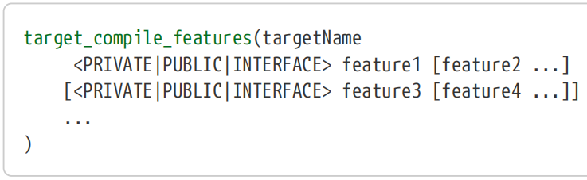
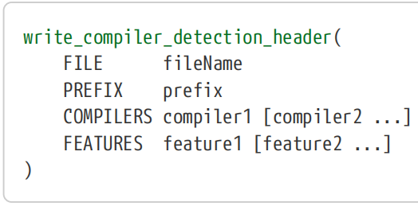

# Ch15. Language Requirements

With the ongoing evolution of the C and C++ languages, developers are increasingly required to understand the compiler and linker flags that enable support for the C and/or C++ version their code uses. Different compilers use different flags, but even when using the same compiler and linker, flags can be used to select different implementations of the standard library.

随着C和C++语言的不断发展，开发人员越来越需要了解编译器和链接器标志，以支持其代码使用的C和/或C++版本。不同的编译器使用不同的标志，但即使使用相同的编译器和链接器，标志也可以用于选择标准库的不同实现。

In the days where C++11 support was relatively new, CMake had no direct support for choosing which standard to use, so projects were left to work out the required flags on their own. In CMake 3.1, features were introduced to allow the C and C++ standard to be selected in a consistent and convenient way, abstracting away the various compiler and linker differences. This support has been extended in subsequent versions and from CMake 3.6 covers most common compilers (CMake 3.2 added most of the compiler support, 3.6 added the Intel compiler).

在C++11支持相对较新的时代，CMake没有直接支持选择使用哪种标准，因此项目只能自己制定所需的标志。在CMake 3.1中，引入了允许以一致和方便的方式选择C和C++标准的功能，抽象出了各种编译器和链接器的差异。此支持在后续版本中得到了扩展，从CMake 3.6开始，它涵盖了最常见的编译器（CMake 3.2添加了大部分编译器支持，3.6添加了英特尔编译器）。

Two main methods are provided by CMake for specifying language requirements. The first is to set the language standard directly and the second is to allow projects to specify the language features they need and let CMake select the appropriate language standard. While the functionality has largely been driven by the C and C++ languages, other languages and pseudo-languages such as CUDA are also supported.

CMake提供了两种主要方法来指定语言要求。第一种是直接设置语言标准，第二种是允许项目指定所需的语言功能，并让CMake选择合适的语言标准。虽然该功能主要由C和C++语言驱动，但也支持其他语言和伪语言，如CUDA。

## 15.1. Setting The Language Standard Directly

The simplest way for a project to control the language standards used by a build is to set them directly. Using this approach, developers do not need to know or specify the individual language features used by the code, they just need to set a single number indicating the standard the code assumes is supported. Not only is this easy to understand and use, it also has the advantage that it is relatively straightforward to ensure that the same standard is used throughout a project. This becomes important at the link stage where a consistent standard library should be used across all the linked libraries and object files.

项目控制构建所使用的语言标准的最简单方法是直接设置它们。使用这种方法，开发人员不需要知道或指定代码使用的单个语言功能，他们只需要设置一个数字来指示代码所支持的标准。这不仅易于理解和使用，而且还有一个优点，即确保在整个项目中使用相同的标准相对简单。这在链接阶段变得很重要，在链接阶段，应在所有链接的库和目标文件中使用一致的标准库。

As is the usual pattern with CMake, target properties control which standard will be used when building that target’s sources and when linking the final executable or shared library. For a given language, there are three target properties related to specifying the standard (\<LANG\> must be one of C or CXX, with CUDA also an option for more recent CMake versions):

与CMake的常见模式一样，目标属性控制着在构建目标源代码以及链接最终可执行文件或共享库时将使用哪种标准。对于给定的语言，有三个与指定标准相关的目标属性（\<LANG\>必须是C或CXX之一，CUDA也是最新CMake版本的一个选项）：

\##\>\>\>\>\>\>\>\>\>\>\>\>\>\>\>\>\>\>\>\>\>\>\>\>\>\>\>\>\>\>\>\>\>\>\>\>\>\>\>\>\>\>\>\>\>\>\>\>\>\>\>

\#(1)\<LANG\>\_STANDARD

Specifies the language standard the project wants to use for the specified target. From the first CMake version supporting this feature, valid values for C_STANDARD are 90, 99 or 11, while for CXX_STANDARD the valid values are 98, 11 or 14. From CMake 3.8, the value 17 is also supported and from CMake 3.12, the value 20 can be used. One would reasonably presume that later CMake versions would add support for other language standards as they evolve over time. CMake 3.8 also supports CUDA_STANDARD with values of 98 or 11, which is a CUDA-specific version of what CXX_STANDARD would normally control. When a target is created, the initial value of this property is taken from the CMAKE\_\<LANG\>\_STANDARD variable.

指定项目要用于指定目标的语言标准。从支持此功能的第一个CMake版本开始，C_STANDARD的有效值为90、99或11，而CXX_STANDARD则为98、11或14。从CMake 3.8开始，也支持值17，从CMake 3.12开始，可以使用值20。人们可以合理地推测，随着时间的推移，后来的CMake版本会增加对其他语言标准的支持。CMake 3.8还支持CUDA_STANDARD，其值为98或11，这是CXX_STANDARD通常控制的CUDA特定版本。创建目标时，此属性的初始值取自CMAKE\_\<LANG\>\_STANDARD变量。

**\#(2)\<LANG\>\_STANDARD_REQUIRED**

While the \<LANG\>\_STANDARD property specifies the language standard the project wants,\<LANG\>\_STANDARD_REQUIRED determines whether that language standard is treated as a minimum requirement or as just a "use if available" guideline. One might intuitively expect that \<LANG\>\_STANDARD would be a requirement by default, but for better or worse, the \<LANG\>\_STANDARD_REQUIRED properties are OFF by default. When OFF, if the requested standard is not supported by the compiler, CMake will decay the request to an earlier standard rather than halting with an error. This decaying behavior is often unexpected for new developers and in practice can be a cause of confusion. Thus, for most projects, when specifying a \<LANG\>\_STANDARD property, its corresponding \<LANG\>\_STANDARD_REQUIRED property will almost always need to be set to true as well to ensure the particular requested standard is treated as a firm requirement. When a target is created, the initial value of this property is taken from the CMAKE\_\<LANG\>\_STANDARD_REQUIRED variable.

【翻译】\<LANG\>\_STANDARD属性指定了项目所需的语言标准，而\<LANG\>\_STANDARD_REQUIRED则决定了该语言标准是作为最低要求还是仅作为“可用时使用”的指导方针。人们可能会直观地期望默认情况下\<LANG\>\_STANDARD是一个要求，但无论好坏，默认情况下，\<LANG\>\_STANDARD_REQUIRED属性都是关闭的。当关闭时，如果编译器不支持所请求的标准，CMake将把请求衰减到较早的标准，而不是因错误而停止。这种衰退行为对于新开发人员来说往往是出乎意料的，在实践中可能会造成混乱。因此，对于大多数项目，在指定\<LANG\>\_STANDARD属性时，其相应的\<LANG\>\_STANDARD_REQUIRED属性几乎总是需要设置为true，以确保特定的请求标准被视为严格要求。创建目标时，此属性的初始值取自CMAKE\_\<LANG\>\_STANDARD_REQUIRED变量。

**\#(3)\<LANG\>\_EXTENSIONS**

Many compilers support their own extensions to the language standard and a compiler and/or linker flag is usually provided to enable or disable those extensions. The \<LANG\>\_EXTENSIONS target property controls whether those extensions are enabled for that particular target. For some compilers/linkers, this setting can change the standard library the target is linked with (see examples below). Be aware that for many compilers/linkers, the same flag is used to control both the language standard and whether or not extensions are enabled. One consequence of this is that if a project sets the \<LANG\>\_EXTENSIONS property, it should also set the \<LANG\>\_STANDARD property or else \<LANG\>\_EXTENSIONS may effectively be ignored. When a target is created, the initial value of the \<LANG\>\_EXTENSIONS property is taken from the CMAKE\_\<LANG\>\_EXTENSIONS variable.

许多编译器支持自己对语言标准的扩展，通常会提供编译器和/或链接器标志来启用或禁用这些扩展。\<LANG\>\_EXTENSIONS目标属性控制是否为该特定目标启用这些扩展。对于某些编译器/链接器，此设置可以更改与目标链接的标准库（见下面的示例）。请注意，对于许多编译器/链接器，相同的标志用于控制语言标准以及是否启用扩展。这样做的一个后果是，如果一个项目设置了\<LANG\>\_EXTENSIONS属性，它也应该设置\<LANG\>\_STANDARD属性，否则\<LANG\]\_EXTENSIONS可能会被有效地忽略。创建目标时，\<LANG\>\_EXTENSIONS属性的初始值取自CMAKE\_\<LANG\>\_EXTENSIONS变量。

\##\<\<\<\<\<\<\<\<\<\<\<\<\<\<\<\<\<\<\<\<\<\<\<\<\<\<\<\<\<\<\<\<\<\<\<\<\<\<\<\<\<\<\<\<\<\<\<\<\<\<\<

In practice, projects would more typically set the variables that provide the defaults for the above target properties rather than setting the target properties directly. This ensures that all targets in a project are built in a consistent manner with compatible settings. Furthermore, it is strongly recommended that projects set all three properties/variables rather than just some of them. The defaults for \<LANG\>\_STANDARD_REQUIRED and \<LANG\>\_EXTENSIONS have proven to be relatively unintuitive for many developers, so by explicitly setting them, a project makes clear what standard behavior it expects. A few examples help demonstrate typical usage.

在实践中，项目通常会设置为上述目标属性提供默认值的变量，而不是直接设置目标属性。这可确保项目中的所有目标都以兼容设置的一致方式构建。此外，强烈建议项目设置所有三个属性/变量，而不仅仅是其中的一些。\<LANG\>\_STANDARD_REQUIRED和\<LANG\>\_EXTENSIONS的默认值已被证明对许多开发人员来说相对不直观，因此通过明确设置它们，项目可以明确其期望的标准行为。几个例子有助于演示典型用法。

\##------------------------------------------\>\>\>\>\>\>

\# Require C++11 and disable extensions for all targets

set(CMAKE_CXX_STANDARD 11)

set(CMAKE_CXX_STANDARD_REQUIRED ON)

set(CMAKE_CXX_EXTENSIONS OFF)

\##------------------------------------------\<\<\<\<\<\<

When using GCC or Clang, the above would typically add the -std=c++11 flag. It may also add a linker flag like -stdlib=libc++ depending on the platform. For Visual Studio compilers before VS2015 Update 3, no flags would be added since the compiler either supports C++11 by default or it has no support for C++11 at all. Note also that from Visual Studio 15 Update 3, the compiler supports specifying a C++ standard, but only for C++14 and later and C++14 is the default setting.

当使用GCC或Clang时，上面通常会添加-std=c++11标志。根据平台的不同，它还可以添加一个链接器标志，如-stdlib=libc++。对于VS2015 Update 3之前的Visual Studio编译器，不会添加任何标志，因为编译器默认支持C++11，或者根本不支持C++11。另请注意，从Visual Studio 15 Update 3开始，编译器支持指定C++标准，但仅适用于C++14及更高版本，C++14是默认设置。

In comparison, the following example requests a later C++ version and enables compiler extensions, resulting in a GCC/Clang compiler flag like -std=gnu++14 instead. Visual Studio compilers again may support the requested standard by default or not, depending on compiler version. If the compiler in use does not support the requested C++ standard, CMake will configure the compiler to use the most recent C++ standard it supports.

相比之下，以下示例请求更高版本的C++并启用编译器扩展，从而产生类似-std=gnu++14的GCC/Clang编译器标志。Visual Studio编译器可能默认支持或不支持请求的标准，具体取决于编译器版本。如果使用的编译器不支持请求的C++标准，CMake将配置编译器使用它支持的最新C++标准。

\##-------------------------------------------------\>\>\>\>\>\>

\# Use C++14 if available and allow compiler extensions for all targets

set(CMAKE_CXX_STANDARD 14)

set(CMAKE_CXX_STANDARD_REQUIRED OFF)

set(CMAKE_CXX_EXTENSIONS ON)

\##-------------------------------------------------\<\<\<\<\<\<

The situation for C is very similar. The following example shows how to set the C standard details, this time only for a specific target:

【翻译】C的情况非常相似。以下示例显示了如何设置C标准详细信息，这次仅针对特定目标：

\##-------------------------------------------------\>\>\>\>\>\>

\# Build target foo with C99, no compiler extensions

set_target_properties(foo PROPERTIES

C_STANDARD 99

C_STANDARD_REQUIRED ON

C_EXTENSIONS OFF

)

\##-------------------------------------------------\<\<\<\<\<\<

It should be noted that \<LANG\>\_STANDARD technically specifies a minimum standard, not necessarily an exact requirement. In some situations, CMake may select a more recent standard due to compile feature requirements (discussed next).

应该指出的是，\<LANG\>\_STANDARD在技术上规定了一个最低标准，而不一定是一个确切的要求。在某些情况下，CMake可能会因编译功能要求而选择较新的标准（下面讨论）。

## 15.2. Setting The Language Standard By Feature Requirements

Directly setting the language standard for a target or for a whole project is the simplest way to manage standard requirements. It is the most suitable approach when the project’s developers know which language version provides the features used by the project’s code. It is particularly convenient when a large number of language features are being used, since each feature does not have to be explicitly specified. In some cases, however, developers may prefer to state which language features their code uses and leave CMake to select the appropriate language standard. This has the added advantage that, unlike specifying the standard directly, compile feature requirements can be part of a target’s interface and therefore can be enforced on other targets linking to it.

直接为目标或整个项目设置语言标准是管理标准需求的最简单方法。当项目的开发人员知道哪个语言版本提供了项目代码使用的功能时，这是最合适的方法。当使用大量语言功能时，这特别方便，因为每个功能都不必明确指定。然而，在某些情况下，开发人员可能更愿意说明他们的代码使用了哪些语言功能，并让CMake选择合适的语言标准。这具有额外的优势，与直接指定标准不同，编译功能要求可以是目标接口的一部分，因此可以在链接到它的其他目标上强制执行。

Compile feature requirements are controlled by the COMPILE_FEATURES and INTERFACE_COMPILE_FEATURES target properties, but these properties are typically populated using the target_compile_features() command rather than being manipulated directly. This command follows a very similar form to the various other target\_…() commands provided by CMake:

编译功能要求由Compile_FEATURES和INTERFACE_Compile_FEATURES目标属性控制，但这些属性通常使用target_copile_FEATURES（）命令填充，而不是直接操作。此命令的形式与CMake提供的其他各种target\_…（）命令非常相似：

The PRIVATE, PUBLIC and INTERFACE keywords have their usual meanings, controlling how the listed features should be applied. PRIVATE features populate the COMPILE_FEATURES property, which is applied to the target itself. Those features specified with the INTERFACE keyword populate the INTERFACE_COMPILE_FEATURES property, which is applied to any target that links to targetName. Features specified as PUBLIC will be added to both properties and will therefore be applied to both the target itself and to any other target which links to it.

【翻译】PRIVATE、PUBLIC和INTERFACE关键字有其通常的含义，控制着所列功能的应用方式。私有功能填充COMPILE_features属性，该属性应用于目标本身。用INTERFACE关键字指定的这些功能填充INTERFACE_COMPILE_features属性，该属性应用于链接到targetName的任何目标。指定为PUBLIC的功能将添加到这两个属性中，因此将应用于目标本身和链接到它的任何其他目标。

Each feature must be one of the features supported by the underlying compiler. CMake provides two lists of known features: CMAKE\_\<LANG\>\_KNOWN_FEATURES which contains all known features for the language and CMAKE\_\<LANG\>\_COMPILE_FEATURES which contains only those features supported by the compiler. If a requested feature is not supported by the compiler, CMake will report an error. Developers may find the CMake documentation for the CMAKE\_\<LANG\>\_KNOWN_FEATURES variables to be a particularly useful resource, since it not only lists the features understood by that particular version of CMake, it also contains references to standard documents relating to each feature. Note that not all functionality provided by a particular language version can be explicitly specified using compile features. For example, new C++ STL types, functions, etc. have no associated feature.

【翻译】每个功能都必须是底层编译器支持的功能之一。CMake提供了两个已知功能列表：CMake\_\<LANG\>\_known_FATURES，其中包含该语言的所有已知功能；CMake\_\<LANG\>\_COMPILE_features，其中仅包含编译器支持的功能。如果编译器不支持请求的功能，CMake将报告错误。开发人员可能会发现CMake\_\<LANG\>\_KNOWN_FATURES变量的CMake文档是一个特别有用的资源，因为它不仅列出了特定版本的CMake所理解的功能，还包含了与每个功能相关的标准文档的引用。请注意，并非特定语言版本提供的所有功能都可以使用编译功能明确指定。例如，新的C++STL类型、函数等没有相关特性。

From CMake 3.8, a per language meta-feature is available to indicate a particular language standard rather than a specific compile feature. These meta-features take the form \<lang\>\_std\_\<value\> and when listed as a required compile feature, CMake will ensure compiler flags are used which enable that language standard. For example, to add a compile feature which ensures that a target and anything that links against it has C++14 support enabled, the following could be used:

【翻译】从CMake 3.8开始，每种语言的元功能可用于指示特定的语言标准，而不是特定的编译功能。这些元功能采用\<lang\>\_std\_\<value\>的形式，当被列为必需的编译功能时，CMake将确保使用启用该语言标准的编译器标志。例如，要添加一个编译功能，确保目标和任何链接到它的东西都启用了C++14支持，可以使用以下方法：

\`\`\`cmake

target_compile_features(targetName PUBLIC cxx_std_14)

\`\`\`

If a project needs to support CMake versions earlier than 3.8, then the above meta-feature will not be available. In such cases, each compile feature would have to be listed out individually, which can be impractical and would likely be incomplete. This tends to limit the usefulness of compile features in general, with projects frequently choosing to set the language standard through the target properties described in the previous section instead.

【翻译】如果一个项目需要支持早于3.8的CMake版本，那么上述元功能将不可用。在这种情况下，每个编译功能都必须单独列出，这可能不切实际，而且可能不完整。这通常会限制编译功能的有用性，项目经常选择通过上一节中描述的目标属性来设置语言标准。

In situations where a target has both its \<LANG\>\_STANDARD property set and compile features specified (directly or transitively as a result of INTERFACE features from something it links to), CMake will enforce the stronger standard requirement. In the following example, foo would be built with C++14, bar with C++17 and guff with C++14:

【翻译】在目标既设置了\<LANG\>\_STANDARD属性又指定了编译功能（直接或通过其链接到的对象的INTERFACE功能）的情况下，CMake将强制执行更严格的标准要求。在下面的例子中，foo将用C++14构建，bar用C++17构建，guff用C++14生成：

\#------------------------------------------------\>\>\>\>\>\>

set_target_properties(foo PROPERTIES CXX_STANDARD 11)

target_compile_features(foo PUBLIC cxx_std_14)

set_target_properties(bar PROPERTIES CXX_STANDARD 17)

target_compile_features(bar PRIVATE cxx_std_11)

set_target_properties(guff PROPERTIES CXX_STANDARD 11)

target_link_libraries(guff PRIVATE foo)

\#------------------------------------------------\<\<\<\<\<\<

Note that this may mean a more recent language standard could be used than what the project expected, which in some cases can result in compilation errors. For example, C++17 removed std::auto_ptr, so if code expects to be compiled with an older language standard and still uses std::auto_ptr, it could fail to compile if the toolchain strictly enforces this removal.

【翻译】请注意，这可能意味着可以使用比项目预期更新的语言标准，在某些情况下可能会导致编译错误。例如，C++17删除了std:：auto_ptr，因此，如果代码期望使用较旧的语言标准编译，但仍然使用std:：auto-ptr，如果工具链严格执行此删除，则可能无法编译。

### 15.2.1. Detection And Use Of Optional Language Features

Some projects have the ability to handle a particular language feature being supported or not. They may provide a fall back implementation, for example, or only define certain function overloads if they are supported by the compiler. A project may support some compiler features being optional, such as keywords intended to guide the developer or provide an increased ability for the compiler to catch common mistakes. C++ keywords such as final and override are common examples of this.

【翻译】有些项目有能力处理是否支持的特定语言功能。例如，它们可以提供回退实现，或者仅在编译器支持的情况下定义某些函数重载。一个项目可能支持一些可选的编译器功能，例如旨在指导开发人员或为编译器捕获常见错误提供更强能力的关键字。C++关键字如final和override就是常见的例子。

CMake provides a number of ways to handle the above scenarios. One approach is to use generator expressions to conditionally set compiler defines or include directories based on the availability of a particular compiler feature. These can be a little verbose, but they offer a great deal of flexibility and support very precise handling of feature-based functionality. Consider the following example:

【翻译】CMake提供了许多处理上述场景的方法。一种方法是使用生成器表达式根据特定编译器功能的可用性有条件地设置编译器定义或包含目录。这些可能有点冗长，但它们提供了很大的灵活性，并支持对基于特征的功能进行非常精确的处理。考虑以下示例：

\#-----------------------------------------------------\>\>\>\>\>\>

add_library(foo ...)

\# Make override a feature requirement only if available

target_compile_features(foo PUBLIC

\$\<\$\<COMPILE_FEATURES:cxx_override\>:cxx_override\>

)

\# Define the foo_OVERRIDE symbol so it provides the

\# override keyword if available or empty otherwise

target_compile_definitions(foo PUBLIC

\$\<\$\<COMPILE_FEATURES:cxx_override\>:-Dfoo_OVERRIDE=override\>

\$\<\$\<NOT:\$\<COMPILE_FEATURES:cxx_override\>\>:-Dfoo_OVERRIDE\>

)

\#-----------------------------------------------------\<\<\<\<\<\<

The above would allow code such as the following to compile for any C++ compiler, regardless of whether or not it supported the override keyword:

【翻译】上述代码将允许为任何C++编译器编译以下代码，无论它是否支持override关键字：

\`\`\`cpp

**class MyClass** : **public** Base

{

**public**:

**void** func() foo_OVERRIDE;

...

};

\`\`\`

In addition to the override keyword, a number of other features can also have a similar conditionally defined symbol used in much the same way. C++ keywords like final, constexpr, noexcept and more can all potentially be used if available or omitted if not supported by the compiler and still produce valid and correct code. Other keywords such as nullptr and static_assert have alternative implementations which can be used if the keyword is not supported by the compiler. Specifying generator expressions for each feature to cover the supported and unsupported cases would be tedious and potentially more fragile, but a more convenient mechanism is provided by CMake through its module system. The WriteCompilerDetectionHeader module defines a function called write_compiler_detection_header() which automates such handling. It produces a header file that the project’s sources can \#include to pick up appropriately specified compiler defines. A simplified version of that function showing only the compulsory options can be described as follows.

除了override关键字外，许多其他功能也可以以几乎相同的方式使用类似的条件定义符号。C++关键字，如final、constexpr、noexcept等，如果可用，都可以使用，如果编译器不支持，则可以省略，并且仍然可以生成有效和正确的代码。其他关键字（如nullptr和static_assert）有替代实现，如果编译器不支持该关键字，则可以使用这些实现。为每个功能指定生成器表达式以涵盖支持和不支持的情况将是乏味的，并且可能更脆弱，但CMake通过其模块系统提供了一种更方便的机制。WriteCompilerDetectionHeader模块定义了一个名为write_compiler_detection_header（）的函数，该函数自动执行此类处理。它生成一个头文件，项目的源代码可以#包含该头文件，以获取适当指定的编译器定义。该功能的简化版本仅显示强制选项，可以描述如下。

The function will write out a C/C++ header to the specified fileName, the contents of which will have appropriate macros defined for each listed feature. Every feature will have a macro of the form prefix_COMPILER_UPPERCASEFEATURE whose value will be 1 or 0 depending on whether the feature is supported or not for the compiler being used. Some features may also have a macro of the form prefix_UPPERCASEFEATURE which provides the most appropriate implementation for that feature for each of the named compilers, including different versions of a compiler, where relevant.

该函数将向指定的fileName写入C/C++标头，其内容将为每个列出的功能定义适当的宏。每个功能都有一个形式为prefix_COMPILER_UPERCASEFATURE的宏，其值为1或0，具体取决于所使用的编译器是否支持该功能。某些功能还可能有一个形式为prefix_UPPERCASEFATURE的宏，它为每个命名的编译器（包括相关的不同版本的编译器）提供了该功能的最合适实现。

This is best demonstrated by an example. Consider a C++ project which can make use of the override, final and nullptr keywords if available and which aims to support the GNU, Clang, Visual Studio and Intel compilers on any of the platforms those compilers support. The project will also define move constructors if the compiler supports rvalue references. The following would write out a single header called foo_compiler_detection.h in the build directory and start each macro name with the string foo\_:

这最好通过一个例子来证明。考虑一个C++项目，它可以使用override、final和nullptr关键字（如果可用），旨在支持这些编译器支持的任何平台上的GNU、Clang、Visual Studio和Intel编译器。如果编译器支持右值引用，该项目还将定义移动构造函数。下面将在构建目录中写出一个名为foo_compiler_detection.h的标头，并用字符串foo_开始每个宏名称：

\`\`\`cmake

include(WriteCompilerDetectionHeader)

write_compiler_detection_header(

FILE foo_compiler_detection.h

PREFIX foo

COMPILERS GNU Clang MSVC Intel

FEATURES cxx_override

> cxx_final
>
> cxx_nullptr
>
> cxx_rvalue_references

)

\`\`\`

Example C++ code making use of the macros defined by the above might look like this:

使用上述定义的宏的示例C++代码可能如下：

\`\`\`cpp

\#include "foo_compiler_detection.h"

**class MyClass foo_FINAL** : **public** Base

{

**public**:

\#if foo_COMPILER_CXX_RVALUE_REFERENCES

MyClass(MyClass&& c);

\#endif

**void** **func1**() foo_OVERRIDE;

**void** **func2**(**int**\* p = foo_NULLPTR);

};

\`\`\`

The target consuming the above source file would still need to have the appropriate language standard selected, but in this case, since fall back implementations are available, the desired standard can be specified but not required:

使用上述源文件的目标仍然需要选择适当的语言标准，但在这种情况下，由于回退实现可用，可以指定所需的标准，但不是必需的：

\#--------------------------------------\>\>\>\>\>\>

set(CMAKE_CXX_STANDARD 11)

set(CMAKE_CXX_STANDARD_REQUIRED OFF)

set(CMAKE_CXX_EXTENSIONS OFF)

add_library(foo MyClass.cpp)

\# The header is written to the build directory

\# so ensure we add that to the header search path

target_include_directories(foo

PUBLIC "\${CMAKE_CURRENT_BINARY_DIR}"

)

\#--------------------------------------\<\<\<\<\<\<

CMake provides fall back implementations for quite a few features, all of which are described in the WriteCompilerDetectionHeader module documentation. The write_compiler_detection_header() command also accepts a number of optional arguments not mentioned here which enable control over the structure and location of the generated header files and adding arbitrary content at the start and end of the generated header. The interested reader should consult the CMake module documentation for full details.

【翻译】CMake为许多功能提供了回退实现，所有这些功能都在WriteCompilerDetectionHeader模块文档中进行了描述。write_compiler_detection_header（）命令还接受许多此处未提及的可选参数，这些参数可以控制生成的头文件的结构和位置，并在生成的头的开头和结尾添加任意内容。感兴趣的读者应该参考CMake模块文档以了解完整的详细信息。

Projects should carefully consider whether the use of a compiler detection header is worth the complexity before diving in and making use of the WriteCompilerDetectionHeader module. It can be an excellent tool for expanding the range of compilers a project can support. In particular, longlived projects may find it a useful stepping stone in updating their code base to more recent language features while they still need to support older compilers on some platforms. One of the main drawbacks to the use of the module is a potential reduction in source code readability. It may also be hard to enforce that all source files use the alternative (generated) symbol names instead of the standard language keywords, since it may not feel as natural for some developers.

在深入研究和使用WriteCompilerDetectionHeader模块之前，项目应该仔细考虑使用编译器检测头的复杂性是否值得。它可以成为扩展项目可以支持的编译器范围的优秀工具。特别是，长期使用的项目可能会发现这是一个有用的垫脚石，可以将他们的代码库更新到最新的语言功能，同时他们仍然需要在某些平台上支持旧的编译器。使用该模块的主要缺点之一是源代码可读性的潜在降低。也可能很难强制所有源文件使用替代（生成）符号名称而不是标准语言关键字，因为这对一些开发人员来说可能不太自然。

## 15.3. Recommended Practices

Projects should avoid setting compiler and linker flags directly to control the language standard used. The required flags vary from compiler to compiler, so it is more robust, more maintainable and more convenient to use the features CMake provides and allow it to populate the flags appropriately. The CMakeLists.txt file will also more clearly express the intent, since human readable variables and properties are used instead of often cryptic raw compiler and linker flags.

项目应避免直接设置编译器和链接器标志来控制所使用的语言标准。所需的标志因编译器而异，因此使用CMake提供的功能并允许其适当地填充标志更稳健、更可维护、更方便。CMakeLists.txt文件也将更清楚地表达意图，因为使用了人类可读的变量和属性，而不是通常神秘的原始编译器和链接器标志。

The simplest method for controlling language standard requirements is to use the CMAKE\_\<LANG\>\_STANDARD, CMAKE\_\<LANG\>\_STANDARD_REQUIRED and CMAKE\_\<LANG\>\_EXTENSIONS variables. These can be used to set the language standard behavior for the entire project, ensuring consistent usage across all targets. This can help avoid problems with linking inconsistent standard libraries and other linkage issues. These variables should ideally be set just after the first project() command in the top level CMakeLists.txt file. Projects should always set all three variables together to make clear how the language standard requirements should be enforced and whether compiler extensions are permitted. Omitting CMAKE\_\<LANG\>\_STANDARD_REQUIRED or CMAKE\_\<LANG\>\_EXTENSIONS can often lead to unexpected behavior, as the defaults may not be what some developers intuitively expect.

【翻译】控制语言标准要求的最简单方法是使用CMAKE\_\<LANG\>\_standard、CMAKE\_\<1ANG\>\_standard_REQUIRED和CMAKE\_\<LANG\>\_EXTENSIONS变量。这些可用于为整个项目设置语言标准行为，确保所有目标的一致使用。这可以帮助避免链接不一致的标准库和其他链接问题。这些变量最好在顶级CMakeLists.txt文件中的第一个project（）命令之后设置。项目应始终将所有三个变量设置在一起，以明确如何执行语言标准要求以及是否允许编译器扩展。省略CMAKE\_\<LANG\>\_STANDARD_REQUIRED或CMAKE\_\<LANG\>\_EXTENSIONS通常会导致意外行为，因为默认值可能不是一些开发人员直观期望的。

If the language standard only needs to be enforced for some targets and not others, the \<LANG\>\_STANDARD, \<LANG\>\_STANDARD_REQUIRED and \<LANG\>\_EXTENSIONS target properties can be set on individual targets rather than for the whole project. These properties behave as though they were PRIVATE, meaning they only specify requirements on that target and not on anything linking to it. This therefore places more of a burden on the project to ensure that all targets have correctly specified language standard details. In practice, it is usually easier and more robust to use the variables to set language requirements project-wide rather than use per target properties. Prefer using the variables unless the project has a need for different language standard behavior for different targets.

如果只需要对某些目标而不是其他目标强制执行语言标准，则可以在单个目标上设置\<LANG\>\_standard、\<LANG\>\_standard_REQUIRED和\<LANG\]\_EXTENSIONS目标属性，而不是为整个项目设置。这些属性的行为就像它们是私有的，这意味着它们只指定了对该目标的要求，而不是对链接到它的任何内容的要求。因此，这给项目带来了更大的负担，以确保所有目标都正确指定了语言标准细节。在实践中，使用变量在项目范围内设置语言需求通常比使用每个目标属性更容易、更稳健。除非项目需要针对不同目标的不同语言标准行为，否则最好使用变量。

If using CMake 3.8 or later, compile features can be used to specify the desired language standard on a per target basis. The target_compile_features() command makes this easy and clearly specifies whether such requirements are PRIVATE, PUBLIC or INTERFACE. The main advantage of specifying a language requirement this way is that it can be enforced transitively on other targets via PUBLIC and INTERFACE relationships. Note, however, that only the equivalent of the \<LANG\>\_STANDARD and \<LANG\>\_STANDARD_REQUIRED target property behaviors are provided, so the \<LANG\>\_EXTENSIONS target property or CMAKE\_\<LANG\>\_EXTENSIONS variable should still be used to control whether or not compiler extensions are allowed. These …EXTENSIONS properties/variables often only take effect if the corresponding \<LANG\>\_STANDARD is also set due to how compilers and linkers frequently combine the two into a single flag, so ultimately it is difficult to escape having to specify \<LANG\>\_STANDARD even when compile features are used. As a result, projects may still find it easier and more robust to prefer using the project-wide variables instead.

如果使用CMake 3.8或更高版本，编译功能可用于在每个目标的基础上指定所需的语言标准。target_compile_features（）命令使这一过程变得简单，并明确指定了这些要求是PRIVATE、PUBLIC还是INTERFACE。以这种方式指定语言要求的主要优点是，它可以通过PUBLIC和INTERFACE关系在其他目标上传递地执行。但是，请注意，只提供了与\<LANG\>\_STANDARD和\<LANG\>\_STANDARD_REQUIRED目标属性行为等效的行为，因此仍应使用\<LANG\]\_EXTENSIONS目标属性或CMAKE\_\<LANG'\_EXTENSIONS变量来控制是否允许编译器扩展。这些扩展属性/变量通常只有在相应的\<LANG\>\_STANDARD也被设置时才生效，因为编译器和链接器经常将两者组合成一个标志，因此即使使用编译功能，最终也很难避免指定\<LANG\>\_STANDARD。因此，项目可能仍然会发现更倾向于使用项目范围的变量更容易、更稳健。

Specifying individual compile features provides fine grained control over the language requirements at a per target level. In practice, it is difficult for developers to ensure that all features used by a target are explicitly specified, so there will always be the question of whether the language requirements are properly defined. They can also easily become out of date as code development continues over time. Most projects will probably find specifying language requirements this way to be tedious and fragile, so they should only be used if the situation clearly warrants it. Working with very recent feature additions to a language, such as when using proposed features for an upcoming language release, is one scenario where compile features may be a useful approach where CMake supports such features. In general though, projects should prefer to use the variables or properties to set the language requirements at a higher level for better maintainability and robustness. Alternatively, setting the standard via a compile meta feature like cxx_std_11 also avoids many of the problems of setting individual features. For the more recent language standards, CMake is moving away from defining individual features and is instead just providing the meta feature anyway.

指定单个编译特性可以在每个目标级别对语言需求进行细粒度控制。在实践中，开发人员很难确保明确指定目标使用的所有功能，因此始终存在语言要求是否正确定义的问题。随着代码开发的持续，它们也很容易过时。大多数项目可能会发现，以这种方式指定语言要求既繁琐又脆弱，因此只有在情况明确需要的情况下才应该使用。使用语言的最新功能添加，例如在即将发布的语言版本中使用建议的功能时，编译功能可能是一种有用的方法，因为CMake支持这些功能。不过，一般来说，项目应该更喜欢使用变量或属性将语言要求设置在更高的级别，以获得更好的可维护性和健壮性。或者，通过cxx_std_11等编译元功能设置标准也可以避免设置单个功能的许多问题。对于较新的语言标准，CMake正在从定义单个功能转向提供元功能。

Projects can detect available compile features and provide implementations for whether a feature is available or not. CMake even provides some convenience macros through the WriteCompilerDetectionHeader module which make this task easier. Projects should generally only consider using these features as a transition path when updating an older code base to use newer language features, as they tend to feel less natural for developers and they can reduce code readability. One notable exception to this is projects intended for a wide range of compilers where language standard support can vary. For this scenario, optional support for specific language features may help reduce compiler warnings and catch coding errors when using more modern compilers. The benefits should be weighed against the increased complexity and potential reduction in readability and less natural style for most developers.

项目可以检测可用的编译功能，并提供功能是否可用的实现。CMake甚至通过WriteCompilerDetectionHeader模块提供了一些方便的宏，使这项任务变得更加容易。项目通常只应考虑在更新旧代码库以使用新语言功能时使用这些功能作为过渡路径，因为它们往往对开发人员来说不太自然，并且会降低代码的可读性。一个值得注意的例外是，针对各种编译器的项目，其中语言标准支持可能会有所不同。对于这种情况，在使用更现代的编译器时，对特定语言功能的可选支持可能有助于减少编译器警告并捕获编码错误。对于大多数开发人员来说，这些好处应该与增加的复杂性、可读性的潜在降低和不那么自然的风格进行权衡。
