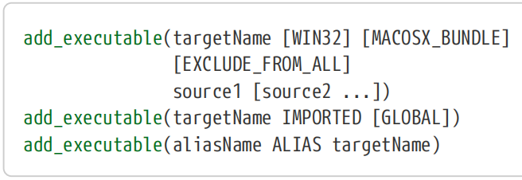
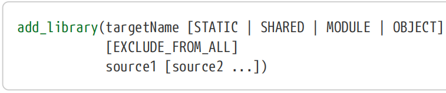
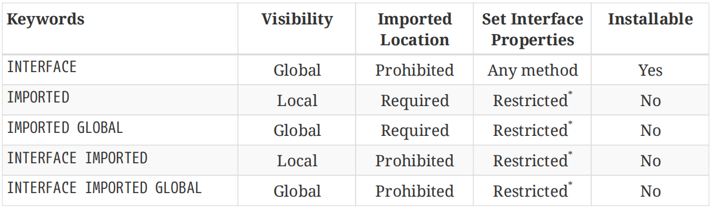

# Ch16. Target Types

CMake supports a wide variety of target types, not just the simple executables and libraries introduced back in “Chapter 4, Building Simple Targets”. Different target types can be defined that act as a refererence to other entities rather than being built themselves. They can be used to collect together transitive properties and dependencies without actually producing their own binaries, or they can even be a kind of library that is simply a collection of object files rather than a traditional static or shared library. Many things can be abstracted away as a target to hide the complexities of platform differences, locations in the filesystem, file names and so on. This chapter covers all of these various target types and discusses their uses.

【译】CMake支持各种各样的目标类型，而不仅仅是“第4章，构建简单目标”中介绍的简单可执行文件和库。可以定义不同的目标类型，作为其他实体的参考，而不是自己构建的。它们可以用来收集可传递的属性和依赖关系，而无需实际生成自己的二进制文件，或者它们甚至可以是一种库，它只是对象文件的集合，而不是传统的静态或共享库。许多东西都可以抽象为目标，以隐藏平台差异、文件系统中的位置、文件名等的复杂性。本章涵盖了所有这些不同的目标类型，并讨论了它们的用途。

Another category of target is the utility or custom target. These can be used to execute arbitrary commands and define custom build rules, allowing projects to implement just about any sort of behavior needed. They have their own dedicated commands and unique behaviors and are covered in depth in the next chapter.

【译】另一类目标是实用程序或自定义目标。这些可用于执行任意命令和定义自定义构建规则，允许项目实现所需的任何类型的行为。它们有自己的专用命令和独特的行为，下一章将深入探讨。

## 16.1. Executables

The add_executable() command has more than just the form introduced back in “Chapter 4, Building Simple Targets”. Two other forms also exist which can be used to define executable targets that reference other things. The full set of supported forms are:

【译】add_executable()命令不仅仅是“第4章，构建简单目标”中介绍的形式。还存在另外两种形式，可用于定义引用其他事物的可执行目标。支持的全套形式包括：

The IMPORTED form can be used to create a CMake target for an existing executable rather than one built by the project. By creating a target to represent the executable, other parts of the project can treat it just like it would any other executable target that the project built itself (with some restrictions). The most significant benefit is that it can be used in contexts where CMake automatically replaces a target name with its location on disk, such as when executing commands for tests or custom tasks (both covered in later chapters). One of the few differences compared to a regular target is that imported targets cannot be installed, a topic covered in “Chapter 25, Installing”. 【译】IMPORTED形式可用于为现有可执行文件创建CMake目标，而不是由项目构建的可执行文件。通过创建一个目标来表示可执行文件，项目的其他部分可以像对待项目自己构建的任何其他可执行目标一样对待它（有一些限制）。最显著的好处是，它可以在CMake自动将目标名称替换为其在磁盘上的位置的情况下使用，例如在执行测试或自定义任务的命令时（都将在后面的章节中介绍）。与常规目标相比，为数不多的差异之一是无法安装导入的目标，这是“第25章，安装”中涵盖的主题。

When defining an imported executable target, certain target properties need to be set before it can be useful. Most of the relevant properties for any imported target have names beginning with IMPORTED, but for executables, IMPORTED_LOCATION and IMPORTED_LOCATION\_\<CONFIG\> are the most important. When the location of the imported executable is needed, CMake will first look at the configuration-specific property and only if that is not set will it look at the more generic IMPORTED_LOCATION property. Typically, the location doesn’t need to be configuration-specific, so it is very common for only IMPORTED_LOCATION to be set.【译】在定义导入的可执行目标时，需要设置某些目标属性才能使其有用。任何导入目标的大多数相关属性的名称都以imported开头，但对于可执行文件，imported_LOCATION和IMPORTED_LOCATION\_\<CONFIG\>是最重要的。当需要导入可执行文件的位置时，CMake将首先查看特定于配置的属性，只有在未设置该属性的情况下，它才会查看更通用的 IMPORTED_LOCATION属性。通常，位置不需要特定于配置，因此通常只设置 IMPORTED_LOCATION。

When defined without the GLOBAL keyword, an imported target will only be visible in the current directory scope and below, but adding GLOBAL makes the target visible everywhere. In contrast, regular executable targets built by the project are always global. The reasons for this and some of the associated implications of reduced target visibility are covered in Section 16.3, “Promoting Imported Targets” further below.

如果定义时没有GLOBAL关键字，则导入的目标将仅在当前目录范围及以下可见，但添加GLOBAL会使目标在任何地方都可见。相比之下，项目构建的常规可执行目标总是全局的。下文第16.3节“促进进口目标”进一步介绍了原因以及目标能见度降低的一些相关影响。

An ALIAS target is just a read-only way to refer to another target within CMake. It does not create a new build target with the alias name. Aliases can only point to real targets (i.e. an alias of an alias is not supported) and they cannot be installed or exported (both covered in “Chapter 25, Installing”). Prior to CMake 3.11, imported targets could not be aliased either, but CMake 3.11 relaxed some of the restrictions to allow aliasing imported targets, but only those imported targets that have global visibility.【译】ALIAS目标只是CMake中引用另一个目标的只读方式。它不会使用别名创建新的生成目标。别名只能指向真实目标（即不支持**别名的别名**），并且不能安装或导出（均在“第25章，安装”中介绍）。在CMake 3.11之前，导入的目标也不能混叠（remark：即别名化），但CMake 3.11放宽了一些限制，允许混叠导入的目标，但只允许混叠具有全局可见性的导入目标。

## 16.2. Libraries

The add_library() command also has a number of different forms. The basic form introduced back in “Chapter 4, Building Simple Targets” can be used to define the usual types of libraries most developers are familiar with, or it can also be used to define object libraries which are just a collection of object files that are not combined into a single archive or shared library. The expanded basic form of the command is therefore:

【译】add_library()命令也有许多不同的形式。在“第4章，构建简单目标”中介绍的基本形式可用于定义大多数开发人员熟悉的常用库类型，也可用于定义对象库，这些对象库只是一组对象文件的集合，没有组合到一个存档或共享库中。因此，命令的扩展基本形式是：

Prior to CMake 3.12, object libraries cannot be linked like other library types (i.e. they cannot be used with target_link_libraries()), they require using a generator expression of the form \$\<TARGET_OBJECTS:objLib\> as part of the list of sources of another executable or library target. Because they can’t be linked, they therefore don’t provide transitive dependencies to the targets they are added to as objects/sources. This can make them less convenient than the other library types, since header search paths, compiler defines, etc. have to be manually carried across to the targets they are added to.【译】在CMake 3.12之前，对象库不能像其他库类型那样链接（即它们不能与target_link_libraries()一起使用），它们需要使用\$\<TARGET_OBJECTS:objLib\>形式的生成器表达式**作为**另一个可执行文件或库目标的源列表的一部分。因为它们不能链接，所以它们不会为作为对象/源添加到的目标提供可传递的依赖关系。这可能会使它们比其他库类型更不方便，因为标头搜索路径、编译器定义等必须手动携带到它们所添加的目标。

CMake 3.12 introduces features that make object libraries behave more like other types of libraries, but with some caveats. From CMake 3.12, object libraries can be used with target_link_libraries(), either as the target being added to (i.e. the first argument to the command) or as one of the libraries being added. But because they add object files rather than actual libraries, their transitive nature is more restricted to prevent object files from being added multiple times to consuming targets. A simplistic explanation is that object files are only added to a target that links directly to the object library, not transitively beyond that. The object library’s usage requirements do, however, propagate transitively exactly like an ordinary library would.

【译】CMake 3.12引入了一些特性，使对象库的行为更像其他类型的库，但有一些注意事项。从CMake 3.12开始，对象库可以与target_link_libraries()一起使用，既可以作为添加到的目标（即命令的第一个参数），也可以作为添加的库之一。但是，由于它们添加的是对象文件而不是实际的库，因此它们的传递性受到更多限制，以防止对象文件被多次添加到消费目标中。一个简单的解释是，对象文件只添加到直接链接到对象库的目标中，而不是传递到该目标之外。然而，对象库的使用要求确实像普通库一样以传递的方式传播。

Some developers may find object libraries more natural if coming from a background where nonCMake projects defined their targets based on sources or object files rather than a related set of static libraries. In general, however, where there is a choice, static libraries will typically be the more convenient choice in CMake projects. Before relying on the expanded features available for object libraries in 3.12, consider whether an ordinary static library is more appropriate and ultimately easier to use.【译】一些开发人员可能会发现，如果来自非CMake项目基于源代码或对象文件而不是一组相关的静态库定义目标的背景，对象库会更自然。然而，一般来说，在有选择的情况下，静态库通常是CMake项目中更方便的选择。在依赖3.12中对象库可用的扩展功能之前，请考虑普通静态库是否更合适，最终是否更易于使用。

Just like executables, libraries may also be defined as imported targets. These are heavily used by config files created during packaging or by Find module implementations (covered in “Chapter 23,*Finding Things”* and “Chapter 25, *Installing”*), but have limited use outside of those contexts. They don’t define a library to be built by the project, rather they act as a reference to a library that is provided externally (e.g. it already exists on the system, is built by some process outside of the current CMake project or is provided by the package that a config file is part of).

【译】与可执行文件一样，库也可以被定义为导入目标。这些被打包过程中创建的配置文件或Find模块实现（在“第23章，查找东西”和“第25章，安装”中介绍）大量使用，但在这些上下文之外的使用有限。它们不定义项目要构建的库，而是作为对外部提供的库的引用（例如，它已经存在于系统上，由当前CMake项目之外的某个进程构建，或者由配置文件所属的包提供）。

The library type must be given immediately after the targetName. If the type of library that the new target will refer to is known, it should be specified as such. This will allow CMake to treat the imported target just like a regular library target of the named type in various situations. The type can only be set to OBJECT with CMake 3.9 or later (imported object libraries were not supported before that version). If the library type is not known, the UNKNOWN type should be given, in which case CMake will simply use the full path to the library without further interpretation in places like linker command lines. This will mean fewer checks and in the case of Windows builds, no handling of DLL import libraries.【译】库类型必须紧跟在targetName之后。如果新目标将引用的库类型已知，则应指定为已知类型。这将允许CMake在各种情况下将导入的目标视为命名类型的常规库目标。该类型只能在CMake 3.9或更高版本中设置为OBJECT（在该版本之前不支持导入的对象库）。如果库类型未知，则应给出UNKNOWN类型，在这种情况下，CMake将简单地使用库的完整路径，而无需在链接器命令行等位置进行进一步解释。这意味着检查更少，在Windows构建的情况下，不需要处理DLL导入库。

Except for OBJECT libraries, the location on the filesystem that the imported target represents needs to be specified by the IMPORTED_LOCATION and/or IMPORTED_LOCATION\_\<CONFIG\> properties (i.e. the same as for imported executables). In the case of Windows platforms, two properties should be set: IMPORTED_LOCATION should hold the location of the DLL and IMPORTED_IMPLIB should hold the location of the associated import library, which usually has a .lib file extension (the …\_\<CONFIG\> variants of these properties can also be set and will take precedence). For object libraries, instead of the above location properties, the IMPORTED_OBJECTS property must be set to a list of object files that the imported target represents.

【译】除OBJECT库外，导入的目标表示的 文件系统上的位置需要由IMPORTED_LOCATION和/或IMPORTED_LOCALION\_\<CONFIG\>属性指定（即与导入的可执行文件相同）。对于Windows平台，应设置两个属性：IMPORTED_LOCATION应保存DLL的位置，IMPORTED_IMPLIB应保存相关导入库的位置，该库通常具有.lib文件扩展名（这些属性的…\_\<CONFIG\>变体也可以设置，并将优先）。对于对象库，必须将IMPORTED_OBJECTS属性设置为导入目标所代表的对象文件列表，而不是上述位置属性。

Imported libraries also support a number of other target properties, most of which can typically be left alone or are automatically set by CMake. Developers who need to manually write config packages should refer to the CMake reference documentation to understand the other IMPORTED\_… target properties which may be relevant to their situation. Most projects will rely on CMake generating such files for them though, so the need to do this should be fairly uncommon.

【译】导入的库还支持许多其他目标属性，其中大多数通常可以单独使用或由CMake自动设置。需要手动编写配置包的开发人员应参考CMake参考文档，以了解可能与他们的情况相关的其他IMPORTED\_…目标属性。不过，大多数项目将依赖CMake为其生成此类文件，因此这样做的需求应该相当罕见。

By default, imported libraries are defined as local targets, meaning they are only visible in the current directory scope and below. The GLOBAL keyword can be given to make them have global visibility instead, just like other regular targets. A library may initially be created without the GLOBAL keyword but later promoted to global visibility, a topic covered in detail in Section 16.3, “Promoting Imported Targets” further below.

【译】默认情况下，导入的库被定义为本地目标，这意味着它们仅在当前目录范围及以下可见。可以使用GLOBAL关键字使它们具有全局可见性，就像其他常规目标一样。最初可以创建一个没有GLOBAL关键字的库，但后来可以提升到全局可见性，这一主题在下文第16.3节“推广导入目标”中有详细介绍。

\#-------------------1-----------------\>\>\>\>\>\>

\# Windows-specific example of imported library

add_library(myWindowsLib SHARED IMPORTED)

set_target_properties(myWindowsLib PROPERTIES

IMPORTED_LOCATION /some/path/bin/foo.dll

IMPORTED_IMPLIB /some/path/lib/foo.lib

)

\#-------------------1-----------------\<\<\<\<\<\<

\#-2-----------------------------------\>\>\>\>\>\>

\# Assume FOO_LIB holds the location of the library but its type is unknown

add_library(mysteryLib UNKNOWN IMPORTED)

set_target_properties(mysteryLib PROPERTIES

IMPORTED_LOCATION \${FOO_LIB}

)

\#-2-----------------------------------\<\<\<\<\<\<

\#--3----------------------------------\>\>\>\>\>\>

\# Imported object library, Windows example shown

add_library(myObjLib OBJECT IMPORTED)

set_target_properties(myObjLib PROPERTIES

IMPORTED_OBJECTS /some/path/obj1.obj \# These .obj files would be .o

/some/path/obj2.obj \# on most other platforms

)

\# Regular executable target using imported object library.

\# Platform differences are already handled by myObjLib.

add_executable(myExe \$\<TARGET_SOURCES:myObjLib\>)

\#--3----------------------------------\<\<\<\<\<\<

Another form of the add_library() command allows interface libraries to be defined. These do not usually represent a physical library, instead they primarily serve to collect usage requirements and dependencies to be applied to anything that links to them. A popular example of their use is for header-only libraries where there is no physical library that needs to be linked, but header search paths, compiler definitions, etc. need to be carried forward to anything using the headers.

【译】add_library()命令的另一种形式允许定义接口库。这些通常不代表物理库，相反，它们主要用于收集使用要求和依赖关系，以应用于链接到它们的任何内容。它们使用的一个流行例子是仅用于头库，其中没有需要链接的物理库，但头搜索路径、编译器定义等需要转发到使用头的任何内容。

\`\`\`cmake

add_library(targetName INTERFACE \[IMPORTED \[GLOBAL\]\])

\`\`\`

All the various target\_…() commands can be used with their INTERFACE keywords to define the usage requirements the interface library will carry. One can also set the relevant INTERFACE\_… properties directly with set_property() or set_target_properties(), but the target\_…() commands are safer and easier to use.

【译】所有不同的target\_…()命令都可以与其INTERFACE关键字一起使用，以定义接口库将携带的使用要求。也可以直接使用set_property()或set_target_properties()设置相关的INTERFACE\_…属性，但target\_…()命令更安全、更易于使用。

\#------------------------------------\>\>\>\>\>\>

add_library(myHeaderOnlyToolkit INTERFACE)

target_include_directories(myHeaderOnlyToolkit

INTERFACE /some/path/include

)

target_compile_definitions(myHeaderOnlyToolkit

INTERFACE COOL_FEATURE=1

\$\<\$\<COMPILE_FEATURES:cxx_std_11\>:HAVE_CXX11\>

)

add_executable(myApp ...)

target_link_libraries(myApp PRIVATE myHeaderOnlyToolkit)

\#------------------------------------\<\<\<\<\<\<

In the above example, the myApp target links against the myHeaderOnlyToolkit interface library. When the myApp sources are compiled, they will have /some/path/include as a header search path and will also have a compiler defininition COOL_FEATURE=1 provided on the compiler command line. If the myApp target is being built with C++11 support enabled, it will also have the symbol HAVE_CXX11 defined. The headers in myHeaderOnlyToolkit can then use this symbol to determine what things they declare and define rather than relying on the \_\_cplusplus symbol provided by the C++ standard, the value of which is often unreliable for a range of compilers.

【译】在上面的示例中，myApp目标链接到myHeaderOnlyToolkit 接口库。编译myApp源代码时，它们将具有/some/path/include作为头文件搜索路径，并且在编译器命令行上还将提供编译器定义COOL_FATURE=1。如果myApp目标是在启用C++11支持的情况下构建的，它也将定义符号have_CXX11。myHeaderOnlyToolkit中的头文件可以使用此符号来确定它们声明和定义的内容，而不是依赖于C++标准提供的\_\_cplusplus符号，该符号的值对于一系列编译器来说通常是不可靠的。

Another use of interface libraries is to provide a convenience for linking in a larger set of libraries, possibly encapsulating logic that selects which libraries should be in the set. For example:

接口库的另一个用途是为链接更大的库集提供便利，可能封装了选择哪些库应在该集中的逻辑。例如：

\#------------------------------------\>\>\>\>\>\>

\# Regular library targets

add_library(algo_fast ...)

add_library(algo_accurate ...)

add_library(algo_beta ...)

\# Convenience interface library

add_library(algo_all INTERFACE)

target_link_libraries(algo_all INTERFACE

algo_fast

algo_accurate

\$\<\$\<BOOL:\${ENABLE_ALGO_BETA}\>:algo_beta\>

)

\# Other targets link to the interface library

\# instead of each of the real libraries

add_executable(myApp ...)

target_link_libraries(myApp PRIVATE algo_all)

\#------------------------------------\<\<\<\<\<\<

The above will only include algo_beta in the list of libraries to link if the CMake option variable ENABLE_ALGO_BETA is true. Other targets then simply link to algo_all and the conditional linking of algo_beta is handled by the interface library. This is an example of using an interface library to abstract away details of what is actually going to be linked, defined, etc. so that the targets linking against them don’t have to implement those details for themselves. This can be exploited to do things like abstract away completely different library structures on different platforms, switch library implementations based on some condition (variables, generator expressions, etc.), provide an old library target name where the library structure has been refactored (e.g. split up into separate libraries) and so on.

【译】如果CMake选项变量ENABLE_algo_beta为真，则上述内容仅将algo_beta包含在要链接的库列表中。然后，其他目标只需链接到algo_all，algo_beta的条件链接由接口库处理。这是一个使用接口库抽象出实际要链接、定义等细节的示例，这样链接到它们的目标就不必自己实现这些细节。这可以被用来做一些事情，比如抽象出不同平台上完全不同的库结构，根据某些条件（变量、生成器表达式等）切换库实现，提供一个重构了库结构的旧库目标名称（例如拆分为单独的库）等等。

While the use cases for INTERFACE libraries are generally well understood, the addition of the IMPORTED keyword to yield an INTERFACE IMPORTED library can sometimes be a cause of confusion. This combination usually arises when an INTERFACE library is exported or installed for use outside of the project. It still serves the purpose of an INTERFACE library when consumed by another project, but the IMPORTED part is added to indicate the library came from somewhere else. The effect of this is to restrict the default visibility of the library to the current directory scope instead of global. With one exception discussed below, adding the GLOBAL keyword to yield the keyword combination INTERFACE IMPORTED GLOBAL results in a library with little practical difference compared to INTERFACE alone. An INTERFACE IMPORTED library is not required to (and indeed is prohibited from) setting an IMPORTED_LOCATION.

【译】虽然INTERFACE库的用例通常很容易理解，但添加IMPORTED关键字以生成INTERFACE IMPORTED库有时可能会引起混淆。当导出或安装INTERFACE库以供项目外部使用时，通常会出现这种组合。当被另一个项目使用时，它仍然起着INTERFACE库的作用，但添加了IMPORTED部分来表示该库来自其他地方。这样做的效果是将库的默认可见性限制在当前目录范围内，而不是全局范围内。除了下面讨论的一个例外情况外，添加GLOBAL关键字以产生关键字组合INTERFACE IMPORTED GLOBAL的结果是，与单独使用INTERFACE相比，库中的实际差异很小。INTERFACE IMPORTED库不需要（实际上也被禁止）设置IMPORTED_LOCATION。

Before CMake 3.11, none of the target\_…() commands could be used to set INTERFACE\_… properties on any kind of IMPORTED library. These properties could, however, be set using set_property() or set_target_properties(). CMake 3.11 removed the restriction on using target\_…() commands to set these properties, so whereas INTERFACE IMPORTED used to be very similar to plain IMPORTED libraries, with CMake 3.11 they are now much closer to plain INTERFACE libraries in terms of their set of restrictions.

【译】在CMake 3.11之前，target\_…()命令都不能用于设置任何类型的IMPORTED库的INTERFACE\_…属性。但是，可以使用set_property()或set_target_properties()设置这些属性。CMake 3.11取消了使用target\_…()命令设置这些属性的限制，因此INTERFACE IMPORTED过去与普通IMPORTED库非常相似，而CMake 3.11在限制集方面现在更接近普通INTERFACE库。

The following table summarizes what the various keyword combinations support:

【译】下表总结了各种关键字组合支持的内容：

\* The various target\_…() commands can be used to set INTERFACE\_… properties only if using CMake 3.11 or later. INTERFACE\_… properties can be set with set_property() or set_target_properties() with any CMake version. 【译】只有在使用CMake 3.11或更高版本时，才能使用各种target\_…()命令来设置INTERFACE\_…属性。INTERFACE\_…属性可以用set_property()或set_target_properties()在任何CMake版本中设置。

One could be forgiven for thinking that the number of different interface and imported library combinations is overly complicated and confusing. For most developers, however, imported targets are generally created for them behind the scenes and they appear to act more or less like regular targets. Of all the combinations in the above table, only plain INTERFACE targets would typically be defined by a project directly. “Chapter 25, Installing” covers much of the motivation and mechanics of the other combinations.

【译】人们可能会认为不同接口和导入库组合的数量过于复杂和令人困惑。然而，对于大多数开发人员来说，导入的目标通常是在幕后为他们创建的，它们的行为或多或少与常规目标相似。在上表中的所有组合中，只有普通的INTERFACE目标通常由项目直接定义。“第25章，安装”涵盖了其他组合的大部分动机和机制。

The last form of the add_library() command is for defining an alias library:

【译】add_library()命令的最后一种形式用于定义别名库：

\`\`\`cmake

add_library(aliasName ALIAS otherTarget)

\`\`\`

A library alias is mostly analogous to an executable alias. It acts as a read-only way to refer to another library but does not create a new build target. Library aliases cannot be installed and they cannot be defined as an alias of another alias. Before CMake 3.11, alias libraries could not be created for imported targets, but as with other changes made for imported targets in CMake 3.11, this restriction was relaxed and it has become possible to create aliases for globally visible imported targets.

【译】库别名主要类似于可执行文件别名。它以只读方式引用另一个库，但不会创建新的构建目标。无法安装库别名，也不能将其定义为其他别名的别名。在CMake 3.11之前，无法为导入的目标创建别名库，但与CMake 3.11中对导入目标所做的其他更改一样，这一限制被放宽，可以为全局可见的导入目标创建别名。

There is a particularly common use of library aliases that relates to an important feature introduced in CMake 3.0. For each library that will be installed or packaged, a common pattern is to also create a matching alias library with a name of the form projNamespace::originalTargetName. All such aliases within a project would typically share the same projNamespace. For example:

【译】库别名的使用特别普遍，这与CMake 3.0中引入的一个重要功能有关。对于将要安装或打包的每个库，一种常见的模式是还创建一个匹配的别名库，其名称格式为projNamespace:：originalTargetName。项目中的所有此类别名通常共享相同的projNamespace。例如：

\#------------------------------------\>\>\>\>\>\>

\# Any sort of real library (SHARED, STATIC, MODULE

\# or possibly OBJECT)

add_library(myRealThings SHARED src1.cpp ...)

add_library(otherThings STATIC srcA.cpp ...)

\# Aliases to the above with special names

add_library(BagOfBeans::myRealThings ALIAS myRealThings)

add_library(BagOfBeans::otherThings ALIAS otherThings)

\#------------------------------------\<\<\<\<\<\<

Within the project itself, other targets would link to either the real targets or the namespaced targets (both have the same effect). The motivation for the aliases comes from when the project is installed and something else links to the imported targets created by the installed/packaged config files. Those config files would define imported libraries with the namespaced names rather than the bare original names. The consuming project would then link against the namespaced names. For example:

【译】在项目本身中，其他目标将链接到真实目标或命名空间目标（两者具有相同的效果）。别名的动机来自于项目安装时，其他东西链接到由安装/打包的配置文件创建的导入目标。这些配置文件将使用命名空间名称而不是原始名称来定义导入的库。然后，消费项目将与命名空间名称链接。例如：

\#------------------------------------\>\>\>\>\>\>

\# Pull in imported targets from an installed package.

\# See details in Chapter 23: Finding Things

find_package(BagOfBeans REQUIRED)

\# Define an executable that links to the imported

\# library from the installed package

add_executable(eatLunch main.cpp ...)

target_link_libraries(eatLunch PRIVATE

BagOfBeans::myRealThings

)

\#------------------------------------\<\<\<\<\<\<

If at some point the above project wanted to incorporate the BagOfBeans project directly into its own build instead of finding an installed package, it could do so without changing its linking relationship because the BagOfBeans project provided an alias for the namespaced name:

【译】如果在某个时候，上述项目想将BagOfBeans项目直接合并到自己的构建中，而不是找到一个已安装的包，那么它可以在不改变链接关系的情况下这样做，因为BagOfBean项目为命名空间名称提供了一个别名：

\#------------------------------------\>\>\>\>\>\>

\# Add BagOfBeans directly to this project, making

\# all of its targets directly available

add_subdirectory(BagOfBeans)

\# Same definition of linking relationship still works

add_executable(eatLunch main.cpp ...)

target_link_libraries(eatLunch PRIVATE

BagOfBeans::myRealThings

)

\#------------------------------------\<\<\<\<\<\<

Another important aspect of names having a double-colon (::) is that CMake will always treat them as the name of an alias or imported target. Any attempt to use such a name for a different target type will result in an error. Perhaps more usefully though, when the target name is used as part of a target_link_library() call, if CMake doesn’t know of a target by that name, it will issue an error at generation time. Compare this to an ordinary name which CMake will treat as a library assumed to be provided by the system if it doesn’t know of a target by that name. This can lead to the error only becoming apparent much later at build time.

【译】具有双冒号（::）的名称的另一个重要方面是CMake始终将它们视为别名或导入目标的名称。任何试图将此类名称用于其他目标类型的尝试都将导致错误。也许更有用的是，当目标名称用作target_link_library()调用的一部分时，如果CMake不知道该名称的目标，它将在生成时发出错误。将其与一个普通名称进行比较，如果CMake不知道该名称的目标，它将把该名称视为由系统提供的库。这可能会导致错误在构建时才变得明显。

\#------------------------------------\>\>\>\>\>\>

add_executable(main main.cpp)

add_library(bar STATIC ...)

add_library(foo::bar ALIAS bar)

\# Typo in name being linked to, CMake will assume a

\# library called "bart" will be provided by the

\# system at link time and won't issue an error.

target_link_libraries(main PRIVATE bart)

\# Typo in name being linked to, CMake flags an error

\# at generation time because a namespaced name must

\# be a CMake target.

target_link_libraries(main PRIVATE foo::bart)

\#------------------------------------\<\<\<\<\<\<

It is therefore more robust to link to namespaced names where they are available. Projects are strongly encouraged to define namespaced aliases at least for all targets that are intended to be installed/packaged. Such namespaced aliases can even be used within the project itself, not just other projects consuming it as a pre-built package or child project.

【译】因此，在有命名空间的地方链接到命名空间名称会更稳健。强烈建议项目至少为所有要安装/打包的目标定义命名空间别名。这样的命名空间别名甚至可以在项目本身中使用，而不仅仅是将其作为预构建包或子项目使用的其他项目。

When defined without the GLOBAL keyword, imported targets are only visible in the directory scope in which they are created or below. This behavior stems from their main intended use, which is as part of a Find module or package config file. Anything defined by a Find module or package config file is generally expected to have local visibility, so they shouldn’t generally add globally visible targets. This allows different parts of a project hierarchy to pull in the same packages and modules with different settings, yet not interfere with each other.

【译】如果定义时没有GLOBAL关键字，则导入的目标仅在创建它们的目录范围内或以下可见。这种行为源于它们的主要预期用途，即作为Find模块或包配置文件的一部分。由Find模块或包配置文件定义的任何内容通常都应该具有本地可见性，因此它们通常不应该添加全局可见的目标。这允许项目层次结构的不同部分引入具有不同设置的相同包和模块，但不会相互干扰。

Nevertheless, there are situations where imported targets need to be created with global visibility, such as to ensure that the same version or instance of a particular package is used consistently throughout the whole project. Adding the GLOBAL keyword when creating the imported library achieves this, but the project may not be in control of the command that does the creation. To provide projects with a way to address this situation, CMake 3.11 introduced the ability to promote an imported target to global visibility by setting the target’s IMPORTED_GLOBAL property to true. Note that this is a one-way transition, it is not possible to demote a global target back to local visibility.

【译】然而，在某些情况下，需要创建具有全局可见性的导入目标，例如确保在整个项目中一致使用特定包的相同版本或实例。在创建导入库时添加GLOBAL关键字可以实现这一点，但项目可能无法控制执行创建的命令。为了给项目提供一种解决这种情况的方法，CMake 3.11引入了通过将目标的imported_global属性设置为true来将导入的目标提升到全局可见性的能力。请注意，这是一个单向转换，不可能将全局目标降级回本地可见性。

\#------------------------------------\>\>\>\>\>\>

\# Imported library created with local visibility.

\# This could be in an external file brought in

\# by an include() call rather than in the same

\# file as the lines further below.

add_library(builtElsewhere STATIC IMPORTED)

set_target_properties(builtElsewhere PROPERTIES

IMPORTED_LOCATION /path/to/libSomething.a

)

\# Promote the imported target to global visibility

set_target_properties(builtElsewhere PROPERTIES

IMPORTED_GLOBAL TRUE

)

\#------------------------------------\<\<\<\<\<\<

It is important to note that an imported target can only be promoted if it is defined in exactly the same scope as the promotion. An imported target defined in a parent or child scope cannot be promoted. The include() command does not introduce a new directory scope and neither does a find_package() call, so imported targets defined by files brought into the build that way can be promoted. In fact, this is the main use case for which the ability to promote imported targets was created. It should also be noted that once an imported target has been promoted to have global visibility, it is able to support the creation of an alias referring to it.

【译】值得注意的是，只有在与升级完全相同的范围内定义导入的目标时，才能对其进行升级。无法升级在父范围或子范围中定义的导入目标。include()命令不会引入新的目录作用域，find_package()调用也不会引入，因此可以提升以这种方式引入构建的文件定义的导入目标。事实上，这是创建促进导入目标能力的主要用例。还应注意的是，一旦导入的目标被提升为具有全局可见性，它就能够支持创建引用它的别名。

## 16.4. Recommended Practices

Version 3.0 of CMake brought with it a signficant change to the recommended way projects should manage dependencies and requirements between targets. Instead of specifying most things through variables which then had to be managed manually by the project, or by directory level commands that would apply to all targets in a directory and below without much discrimination, each target gained the ability to carry all the necessary information in its own properties. This shift in focus to a target-centric model has also led to a family of pseudo target types that facilitate expressing intertarget relationships more flexibly and accurately. Developers should become familiar with interface libraries in particular, as they open up a range of techniques for capturing and expressing relationships without needing to create or refer to a physical file. They can be useful for representing the details of header-only libraries, collections of resources and many other scenarios and should be strongly preferred over trying to achieve the same result with variables or directorylevel commands alone.【译】CMake 3.0版本对项目管理目标之间的依赖关系和需求的推荐方式进行了重大更改。每个目标都获得了在自己的属性中携带所有必要信息的能力，而不是通过变量指定大多数内容，然后这些变量必须由项目手动管理，或者通过目录级命令应用于目录及以下的所有目标，而不会有太多区别。这种向以目标为中心的模型的转变也导致了一系列伪目标类型，这些类型有助于更灵活、更准确地表达目标间的关系。开发人员应该特别熟悉接口库，因为它们提供了一系列捕获和表达关系的技术，而不需要创建或引用物理文件。它们可用于表示仅标头库、资源集合和许多其他场景的详细信息，并且应该比仅使用变量或目录级命令来实现相同的结果更受欢迎。

Imported targets are encountered frequently once projects start using packages built externally or they refer to tools from the file system that are found through Find modules. Developers should be comfortable with using imported targets, but understanding all the ins and outs of how they are defined is not usually necessary unless actually writing Find modules or manually creating config files for a package. Some specific cases are discussed in Chapter 25, Installing where developers may come up against certain limitations of imported targets, but such scenarios are not all that common.【译】一旦项目开始使用外部构建的包，或者它们引用通过查找模块找到的文件系统中的工具，就会经常遇到导入的目标。开发人员应该熟悉使用导入的目标，但通常不需要了解它们是如何定义的，除非实际编写Find模块或手动为包创建配置文件。第25章“安装”讨论了一些具体情况，开发人员可能会遇到导入目标的某些限制，但这种情况并不常见。

A number of older CMake modules used to provide only variables to refer to imported entities. Starting with CMake 3.0, these modules are progressively being updated to also provide imported targets where appropriate. For those situations where a project needs to refer to an external tool or library, prefer to do so through an imported target if one is available. These typically do a better job of abstracting away things like platform differences, option-dependent tool selection and so on, but more importantly the usage requirements are then robustly handled by CMake. If there is a choice between using an imported library or a variable to refer to the same thing, prefer to use the imported library wherever possible.【译】许多旧的CMake模块过去只提供引用导入实体的变量。从CMake 3.0开始，这些模块正在逐步更新，以便在适当的情况下提供导入的目标。对于项目需要引用外部工具或库的情况，如果导入的目标可用，最好通过导入的目标来引用。这些通常在抽象平台差异、依赖选项的工具选择等方面做得更好，但更重要的是，CMake可以稳健地处理使用需求。如果要在使用导入库或变量引用同一事物之间做出选择，请尽可能使用导入库。

Prefer defining static libraries over object libraries. Static libraries are simpler, have more complete and robust support from earlier CMake versions and they are well understood by most developers. Object libraries have their uses, but they are also less flexible than static libraries. In particular, object object libraries cannot be linked (prior to CMake 3.12) and therefore don’t support transitive dependencies. This forces projects to manually apply such dependencies themselves, which increases the opportunity for errors and omissions. It also reduces the encapsulation that a library target would normally provide. Even the name itself can cause some confusion among developers, since an object library is not a true library, but rather just a set of uncombined object files, but developers sometimes expect it to behave like a real library. The changes with 3.12 blur that distinction, but the remaining differences still leave room for unexpected results.【译】更喜欢定义静态库而不是对象库。静态库更简单，从早期的CMake版本中获得了更完整、更强大的支持，大多数开发人员都很容易理解。对象库有其用途，但它们也不如静态库灵活。特别是，对象对象库不能链接（在CMake 3.12之前），因此不支持传递依赖关系。这迫使项目自己手动应用此类依赖关系，从而增加了出错和遗漏的机会。它还减少了库目标通常提供的封装。甚至名称本身也会在开发人员中造成一些混淆，因为对象库不是真正的库，而只是一组未组合的对象文件，但开发人员有时希望它的行为像一个真正的库。3.12的变化模糊了这种区别，但其余的差异仍然为意外的结果留下了空间。

When it comes to naming targets, don’t use target names that are too generic. Globally visible target names must be unique and names may clash with targets from other projects when used in a larger hierarchical arrangement. In addition, consider adding an alias namespace::… target for each target that is not private to the project (i.e. every target that may end up being installed or packaged). This allows consuming projects to link to the namespaced target name instead of the real target name, a technique which enables consuming projects to switch between building the child project themselves or using a pre-built installed project relatively easily. While this may initially seem like extra work for not much gain, it is emerging as an expected standard practice among the CMake community, especially for those projects that take a non-trivial amount of time to build. This pattern is discussed further in Section 25.3, “Installing Exports”.【译】在命名目标时，不要使用过于通用的目标名称。全局可见的目标名称必须是唯一的，在更大的层次结构中使用时，名称可能会与其他项目的目标冲突。此外，考虑为每个非项目私有的目标（即最终可能被安装或打包的每个目标）添加一个别名命名空间：：…target。这允许消费项目链接到命名空间的目标名称，而不是真实的目标名称。这种技术使消费项目能够相对容易地在构建子项目本身或使用预构建的已安装项目之间进行切换。虽然这最初看起来像是额外的工作，但收效甚微，但它正在成为CMake社区的一种预期标准做法，特别是对于那些需要大量时间构建的项目。第25.3节“安装导出”将进一步讨论此模式。

Inevitably, at some point it may become desirable to rename or refactor a library, but there may be external projects which expect the existing library targets to be available to link to. In these situations, use an alias target to provide an old name for a renamed target so that those external projects can continue to build and be updated at their convenience. When splitting up a library, define an interface library with the old target name and have it define link dependencies to the new split out libraries. For example:【译】不可避免地，在某些时候，重命名或重构库可能是可取的，但可能有外部项目希望现有的库目标可以链接到。在这些情况下，使用别名目标为重命名的目标提供旧名称，以便这些外部项目可以继续构建并在方便的时候进行更新。拆分库时，使用旧目标名称定义一个接口库，并让它定义到新拆分库的链接依赖关系。例如：

\#---1---------------------------------\>\>\>\>\>\>

\# Old library previously defined like this:

add_library(deepCompute SHARED ...)

\#---1---------------------------------\<\<\<\<\<\<

\#---2---------------------------------\>\>\>\>\>\>

\# Now the library has been split in two, so define

\# an interface library with the old name to effectively

\# forward on the link dependency to the new libraries

add_library(computeAlgoA SHARED ...)

add_library(computeAlgoB SHARED ...)

add_library(deepCompute INTERFACE)

target_link_libraries(deepCompute INTERFACE

computeAlgoA

computeAlgoB

)

\#---2---------------------------------\<\<\<\<\<\<
