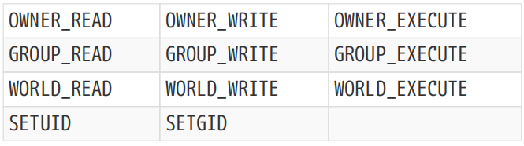
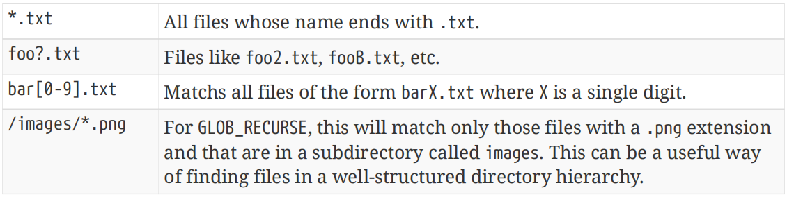

# Ch18. Working With Files

Many projects need to manipulate files and directories as part of the build. While such manipulations range from trivial through to quite complex, the more common tasks include: 【译】许多项目需要在构建过程中操作文件和目录。虽然这些操作从微不足道到非常复杂，但更常见的任务包括：

• Constructing paths or extracting components of a path. 【译】构建路径或提取路径的组成部分。

• Obtaining a list of files from a directory. 【译】从目录中获取文件列表。

• Copying files. 【译】复制文件。

• Generating a file from string contents. 【译】从字符串内容生成文件。

• Generating a file from another file’s contents. 【译】从另一个文件的内容生成文件。

• Reading in the contents of a file. 【译】读取文件内容。

• Computing a checksum or hash of a file.【译】计算文件的校验和或哈希值。

CMake provides a variety of features related to working with files and directories. In some cases, there can be multiple ways of achieving the same thing, so it is useful to be aware of the different choices and understand how to use them effectively. A number of these features are frequently misused, some due to such misuse being prevalent in online tutorials and examples, leading to the belief that it is the right way to do things. Some of the more problematic anti-patterns are discussed in this chapter.【译】CMake提供了与处理文件和目录相关的各种功能。在某些情况下，实现同一目标的方法可能有多种，因此了解不同的选择并了解如何有效地使用它们是有用的。其中一些功能经常被误用，一些是由于这种误用在在线教程和示例中普遍存在，导致人们认为这是正确的做事方式。本章讨论了一些更有问题的反模式。

Much of CMake’s file-related functionality is provided by the file() command, with a few other commands offering alternatives better suited to certain situations or providing related helper capabilities. CMake’s command mode, which was introduced in the previous chapter, also provides a variety of file-related features which overlap with much of what file() provides, but it covers a complimentary set of scenarios to file() rather than being an alternative in most cases.

【译】CMake的大部分文件相关功能由**file()命令**提供，其他一些命令提供了更适合某些情况的替代方案或提供相关的辅助功能。CMake的命令模式在上一章中介绍过，它还提供了各种与文件相关的功能，这些功能与file()提供的功能重叠，但它涵盖了file()的一组互补场景，而不是在大多数情况下的替代方案。

## 18.1. Manipulating Paths

One of the most basic parts of file handling is manipulating file names and paths. Projects often need to extract file names, file suffixes, etc. from full paths, or convert between absolute and relative paths. The primary method for performing such operations is the get_filename_component() command, which has three different forms. The first form allows for the extraction of the different parts of a path or file name:【翻译】文件处理最基本的部分之一是操纵文件名和路径。项目通常需要从完整路径中提取文件名、文件后缀等，或在绝对路径和相对路径之间进行转换。执行此类操作的主要方法是get_filename_component（）命令，它有三种不同的形式。第一种形式允许提取路径或文件名的不同部分：

\`\`\`cmake

get_filename_component(outVar input component \[CACHE\])

\`\`\`

The result of the call is stored in the variable named by outVar. The component to extract from input is specified by component, which must be one of the following:【译】调用的结果存储在名为outVar的变量中。从输入中提取的组件由组件指定，组件必须是以下之一：

\#\>\>\>\>\>\>\>\>\>\>\>\>\>\>\>\>\>\>\>\>\>\>\>\>\>\>\>\>\>\>\>\>\>\>\>\>\>\>\>\>\>\>

**\#(1)DIRECTORY**

Extract the path part of input without the file name. Prior to CMake 2.8.12, this option used to be PATH, which is still accepted as a synonym for DIRECTORY to preserve compatibility with older versions.【译】 提取不带文件名的输入路径部分。在CMake 2.8.12之前，此选项曾经是PATH，它仍然被接受为DIRECTORY的同义词，以保持与旧版本的兼容性。

**\#(2)NAME**

Extract the full file name, including any extension. This essentially just discards the directory part of input.【译】 提取完整文件名，包括任何扩展名。这基本上只是丢弃了输入的目录部分。

**\#(3)NAME_WE**

Extract the base file name only. This is like NAME except only the part of the file name up to but not including the first "." is extracted.【译】 仅提取基本文件名。这类似于NAME，只是提取了文件名中直到但不包括第一个“.”的部分。

**\#(4)EXT**

This is the complement to NAME_WE. It extracts just the extension part of the file name from the first "." onwards.【译】 这是对NAME_WE的补充。它仅从第一个“.”开始提取文件名的扩展名部分。

\#\<\<\<\<\<\<\<\<\<\<\<\<\<\<\<\<\<\<\<\<\<\<\<\<\<\<\<\<\<\<\<\<\<\<\<\<\<\<\<\<\<\<

The CACHE keyword is optional. If present, the result is stored as a cache variable rather than a regular variable. Typically, it is not desirable to store the result in the cache, so the CACHE keyword is not often required.【译】CACHE关键字是可选的。如果存在，结果将存储为缓存变量，而不是常规变量。通常，不希望将结果存储在缓存中，因此cache关键字通常不是必需的。

\#------------------------------------\>\>\>\>\>\>

set(input /some/path/foo.bar.txt)

get_filename_component(path1 \${input} DIRECTORY) \# /some/path

get_filename_component(path2 \${input} PATH) \# /some/path

get_filename_component(fullName \${input} NAME) \# foo.bar.txt

get_filename_component(baseName \${input} NAME_WE) \# foo

get_filename_component(extension \${input} EXT) \# .bar.txt

\#------------------------------------\<\<\<\<\<\<

The second form of get_filename_component() is used to obtain an absolute path:【翻译】第二种形式的get_filename_component（）用于获取绝对路径：

\`\`\`cmake

get_filename_component(outVar input component \[BASE_DIR dir\] \[CACHE\])

\`\`\`

In this form, input can be a relative path or it can be an absolute path. If BASE_DIR is given, relative paths are interpreted as being relative to dir instead of the current source directory (i.e. CMAKE_CURRENT_SOURCE_DIR). BASE_DIR will be ignored if input is already an absolute path.

在这种形式中，输入可以是相对路径，也可以是绝对路径。如果给定BASE_DIR，则相对路径被解释为相对于DIR而不是当前源目录（即CMAKE_current_source_DIR）。如果输入已经是绝对路径，则BASE_DIR将被忽略。

component determines how symbolic links should be handled when computing the path to be stored in outVar:【翻译】组件决定在计算要存储在outVar中的路径时应如何处理符号链接：

\#\>\>\>\>\>\>\>\>\>\>\>\>\>\>\>\>\>\>\>\>\>\>\>\>\>\>\>\>\>\>\>\>\>\>\>\>\>\>\>\>\>\>

\#(1)ABSOLUTE

Compute the absolute path of input without resolving symbolic links. 【翻译】在不解析符号链接的情况下计算输入的绝对路径。

\#(2)REALPATH

Compute the absolute path of input with symbolic links resolved.【翻译】使用解析的符号链接计算输入的绝对路径。

\#\<\<\<\<\<\<\<\<\<\<\<\<\<\<\<\<\<\<\<\<\<\<\<\<\<\<\<\<\<\<\<\<\<\<\<\<\<\<\<\<\<\<

The file() command provides the inverse operation, converting an absolute path to relative:【翻译】file()命令提供反向操作，将绝对路径转换为相对路径：

\`\`\`cmake

file(RELATIVE_PATH outVar relativeToDir input)

\`\`\`

The following example demonstrates its usage:【翻译】以下示例演示了它的用法：

\#------------------------------------\>\>\>\>\>\>

set(basePath /base)

set(fooBarPath /base/foo/bar)

set(otherPath /other/place)

file(RELATIVE_PATH fooBar \${basePath} \${fooBarPath})

file(RELATIVE_PATH other \${basePath} \${otherPath})

\# The variables now have the following values:

\# fooBar = foo/bar

\# other = ../other/place

\#------------------------------------\<\<\<\<\<\<

The third form of the get_filename_component() command is a convenience for extracting parts of a full command line:

【翻译】get_filename_component（）命令的**第三种形式**便于提取完整命令行的部分内容：

\`\`\`cmake

get_filename_component(progVar input PROGRAM

\[PROGRAM_ARGS argVar\] \[CACHE\])

\`\`\`

With this form, input is assumed to be a command line which may contain arguments. CMake will extract the full path to the executable which would be invoked by the specified command line, resolving the executable’s location using the PATH environment variable if necessary and store the result in progVar. If PROGRAM_ARGS is given, the set of command line arguments are also stored as a list in the variable named by argVar. The CACHE keyword has the same meaning as the other forms of get_filename_component().

使用此**形式**，输入被假定为可能包含参数的命令行。CMake将提取指定命令行调用的可执行文件的完整路径，必要时使用path环境变量解析可执行文件位置，并将结果存储在progVar中。如果给定PROGRAM_ARGS，则命令行参数集也将以列表形式存储在argVar命名的变量中。CACHE关键字与其他形式的get_filename_component（）具有相同的含义。

Across all of CMake’s file handling, most of the time a project can use forward slashes for directory separators on all platforms and CMake will do the right thing, converting to native paths as necessary on the project’s behalf. Occasionally, however, a project may need to explicitly convert between CMake and native paths, such as when working with custom commands and needing to pass a path to a script which requires native paths. For these situations, the file() command offers two more forms which help transform paths between platform native and CMake formats:

在CMake的所有文件处理中，大多数时候，项目可以在所有平台上使用正斜杠作为目录分隔符，CMake会做正确的事情，代表项目在必要时转换为本机路径。然而，有时项目可能需要在CMake和本机路径之间进行显式转换，例如在使用自定义命令时，需要将路径传递给需要本机路径的脚本。对于这些情况，file（）命令提供了另外两种形式，有助于在平台原生格式和CMake格式之间转换路径：

\#------------------------------------\>\>\>\>\>\>

file(TO_NATIVE_PATH input outVar)

file(TO_CMAKE_PATH input outVar)

\#------------------------------------\<\<\<\<\<\<

The TO_NATIVE_PATH form converts input into a native path for the host platform. This amounts to ensuring the correct directory separator is used (backslash on Windows, forward slash everywhere else). The TO_CMAKE_PATH form converts all directory separators in input to forward slashes. This is the representation used by CMake for paths on all platforms. The input can also be a list of paths specified in a form compatible with the platform’s PATH environment variable. All colon separators are replaced with semi-colons, thereby converting a PATH-like input into a CMake list of paths.【翻译】TO_NATIVE_PATH表单将输入转换为主机平台的本机路径。这相当于确保使用正确的目录分隔符（Windows上的反斜杠，其他地方的正斜杠）。TO_CMAKE_PATH表单将输入中的所有目录分隔符转换为正斜杠。这是CMake在所有平台上用于路径的表示。输入也可以是以与平台的PATH环境变量兼容的形式指定的路径列表。所有冒号分隔符都被分号替换，从而将类似PATH的输入转换为CMake路径列表。

\#------------------------------------\>\>\>\>\>\>

\# Unix example

set(customPath /usr/local/bin:/usr/bin:/bin)

file(TO_CMAKE_PATH \${customPath} outVar)

\# outVar = /usr/local/bin;/usr/bin;/bin

\#------------------------------------\<\<\<\<\<\<

## 18.2. Copying Files

The need to copy a file during the configure stage or during the build itself is a relatively common one. Because copying a file is generally a familiar task to most users, it is natural for new CMake developers to implement file copying in terms of the same methods they already know. Unfortunately, this often results in the use of platform-specific shell commands with add_custom_target() and add_custom_command(), sometimes also with dependency problems that require developers to run CMake multiple times and/or manually build targets in a particular sequence. In almost all cases, CMake offers better alternatives to such approaches.

在配置阶段或构建过程中复制文件的需求相对常见。因为复制文件对大多数用户来说通常是一项熟悉的任务，所以新的CMake开发人员很自然地会使用他们已经知道的相同方法来实现文件复制。不幸的是，这通常会导致在add_custom_target（）和add_custom_command（）中使用特定于平台的shell命令，有时还会出现依赖性问题，需要开发人员多次运行CMake和/或以特定顺序手动构建目标。在几乎所有情况下，CMake都为这些方法提供了更好的替代方案。

In this section, a number of techniques for copying files are presented. Some are aimed at meeting a particular need, while others are intended to be more generic and can be used in a variety of situations. All methods presented work exactly the same way on all platforms.

在本节中，将介绍许多复制文件的技术。有些旨在满足特定需求，而另一些则旨在更通用，可以在各种情况下使用。所有方法在所有平台上的工作方式完全相同。

One of the most useful commands for copying files at configure time is, unfortunately, one of the less intuitively named. The configure_file() command allows a single file to be copied from one location to another, optionally performing CMake variable substitution along the way. The copy is performed immediately, so it is a configure-time operation. A slightly reduced form of the command is as follows:

不幸的是，在配置时复制文件最有用的命令之一是命名不太直观的命令之一。configure_file()命令允许将单个文件从一个位置复制到另一个位置，在此过程中可以选择执行CMake变量替换。复制会立即执行，因此这是一个配置时间操作。命令的稍微简化形式如下：

\`\`\`cmake

configure_file(source destination \[COPYONLY \| @ONLY\] \[ESCAPE_QUOTES\])

\`\`\`

The source must be an existing file and can be an absolute or relative path, with the latter being relative to the current source directory (i.e. CMAKE_CURRENT_SOURCE_DIR). The destination cannot simply be a directory to copy the file into, it must be a file name, optionally with a path which can be absolute or relative. If the destination is not an absolute path, it is interpreted as being relative to the current binary directory (i.e. CMAKE_CURRENT_BINARY_DIR). If any part of the destination path does not exist, CMake will attempt to create the missing directories as part of the call. Note that it is not unusual to see projects include CMAKE_CURRENT_SOURCE_DIR or CMAKE_CURRENT_BINARY_DIR as part of the path with the source and destination respectively, but this just adds unnecessary clutter and should be avoided.

源必须是现有文件，可以是绝对路径或相对路径，后者相对于当前源目录（即CMAKE_current_source_DIR）。目标不能简单地是一个要复制文件的目录，它必须是一个文件名，可以选择一个绝对或相对的路径。如果目标不是绝对路径，则将其解释为相对于当前二进制目录（即CMAKE_current_binary_DIR）。如果目标路径的任何部分不存在，CMake将尝试创建缺失的目录作为调用的一部分。请注意，项目将CMAKE_CURRENT_SOURCE_DIR或CMAKE_CCURRENT_BINARY_DIR分别作为源和目标路径的一部分并不罕见，但这只会增加不必要的混乱，应该避免。

If the source file is modified, the build will consider the destination to be out of date and will re-run cmake automatically. If the configure and generation time is non-trivial and the source file is being modified frequently, this can be a source of frustration for developers. For this reason, configure_file() is best used only for files that don’t need to be changed all that often.

如果源文件被修改，构建将认为目标已过期，并将自动重新运行cmake。如果配置和生成时间很长，并且源文件经常被修改，这可能会让开发人员感到沮丧。因此，configure_file（）最好只用于不需要经常更改的文件。

When performing the copy, configure_file() has the ability to substitute CMake variables. Without the COPYONLY or @ONLY options, anything in the source file that looks like a use of a CMake variable (i.e. has the form \${someVar}) will be replaced by the value of that variable. If no variable exists with that name, an empty string is substituted. Strings of the form @someVar@ are also substituted in the same way. The following shows a number of substitution examples:

执行复制时，configure_file（）能够替换CMake变量。如果没有COPYONLY或@ONLY选项，源文件中任何看起来像使用CMake变量（即具有\${someVar}形式）的内容都将被该变量的值替换。如果不存在具有该名称的变量，则替换为空字符串。形式为@someVar@的字符串也以相同的方式替换。以下显示了一些替换示例：

\#*CMakeLists.txt*

\#------------------------------------\>\>\>\>\>\>

set(FOO "String with spaces")

configure_file(various.txt.in various.txt)

\#------------------------------------\<\<\<\<\<\<

\#*various.txt.in*

\#------------------------------------\>\>\>\>\>\>

CMake version: \${CMAKE_VERSION}

Substitution works inside quotes too: "\${FOO}"

No substitution without the \$ and {}: FOO

Empty \${} specifier gets removed

Escaping has no effect: \\{FOO}

@-syntax also supported: @FOO@

\#------------------------------------\<\<\<\<\<\<

\#--------------------------*various.txt*

\#------------------------------------\>\>\>\>\>\>

CMake version: 3.7.0

Substitution works inside quotes too: "String with spaces"

No substitution without the \$ and {}: FOO

Empty specifier gets removed

Escaping has no effect: \String with spaces

@-syntax also supported: String with spaces

\#------------------------------------\<\<\<\<\<\<

The ESCAPE_QUOTES keyword can be used to cause any substituted quotes to be preceded with a backslash.【翻译】ESCAPE_QUOTES关键字可用于使任何替换的引号前面加上反斜杠。

\#--------------------*CMakeLists.txt*

\#------------------------------------\>\>\>\>\>\>

set(BAR "Some \\quoted\\ value")

configure_file(quoting.txt.in quoting.txt)

configure_file(quoting.txt.in quoting_escaped.txt ESCAPE_QUOTES)

\#------------------------------------\<\<\<\<\<\<

\#--------------------*quoting.txt.in*

\#------------------------------------\>\>\>\>\>\>

A: @BAR@

B: "@BAR@"

\#------------------------------------\<\<\<\<\<\<

\#--------------------*quoting.txt*

\#------------------------------------\>\>\>\>\>\>

A: Some "quoted" value

B: "Some "quoted" value"

\#------------------------------------\<\<\<\<\<\<

\#---*quoting_escaped.txt*

\#------------------------------------\>\>\>\>\>\>

A: Some \\quoted\\ value

B: "Some \\quoted\\ value"

\#------------------------------------\<\<\<\<\<\<

As the above example shows, the ESCAPE_QUOTES option causes escaping of all quotes regardless of their context. Therefore, a degree of care must be taken when the file being copied is sensitive to spaces and quoting in any substitutions which may be performed.

如上例所示，ESCAPE_QUOTES选项会导致所有引号转义，而不管其上下文如何。因此，当被复制的文件对空格和可能进行的任何替换中的引用敏感时，必须格外小心。

Some file types need to have the \${someVar} form preserved without substitution. A classic example of this is where the file being copied is a Unix shell script where \${someVar} is a valid and common way to refer to a shell variable. In such cases, substitution can be limited to only the @someVar@ form with the @ONLY keyword:

某些文件类型需要保留\${someVar}形式而不进行替换。一个经典的例子是，被复制的文件是一个Unix shell脚本，其中\${someVar}是引用shell变量的有效和常见方式。在这种情况下，替换只能限于使用@only关键字的@someVar@形式：

\#---*CMakeLists.txt*

\#------------------------------------\>\>\>\>\>\>

set(USER_FILE whoami.txt)

configure_file(whoami.sh.in whoami.sh @ONLY)

\#------------------------------------\<\<\<\<\<\<

\#---*whoami.sh.in*

\#------------------------------------\>\>\>\>\>\>

\#!/bin/sh

echo \${USER} \> "@USER_FILE@"

\#------------------------------------\<\<\<\<\<\<

\#---*whoami.sh*

\#!/bin/sh

echo \${USER} \> "whoami.txt"

\#------------------------------------\<\<\<\<\<\<

Substitution can also be disabled entirely with the COPYONLY keyword. If it is known that substitution is not needed, specifying COPYONLY is good practice, since it prevents unnecessary processing and any unexpected substitutions.【翻译】也可以使用COPYONLY关键字完全禁用替换。如果知道不需要替换，指定COPYONLY是一种很好的做法，因为它可以防止不必要的处理和任何意外的替换。

When using configure_file() and substituting file names or paths, a common mistake is to mishandle spaces and quoting. The source file may need to surround a substituted variable with quotes if it needs to be treated as a single path or file name. This is why the source file in the above example used "@USER_FILE@" rather than @USER_FILE@ as the filename to write the output to.【翻译】当使用configure_file（）并替换文件名或路径时，一个常见的错误是错误地处理空格和引号。如果需要将源文件视为单个路径或文件名，则可能需要用引号括住替换的变量。这就是为什么上述示例中的源文件使用“@USER_file@”而不是@USER_file@作为写入输出的文件名。

Substitution of CMake variables with either the \${someVar} or @someVar@ form can also be performed on strings, not just files. The string() command has a CONFIGURE form which provides the same functionality:【翻译】用\${someVar}或@someVar@形式替换CMake变量也可以在字符串上执行，而不仅仅是文件。String()命令有一个CONFIGURE形式，提供相同的功能：

\`\`\`cmake

string(CONFIGURE input outVar \[@ONLY\] \[ESCAPE_QUOTES\])

\`\`\`

The options have the same meaning as they do for configure_file(). This form can be useful if the content to be copied requires more complex steps than just a simple substitution, an example of which is given in the next section.【翻译】这些选项与configure_file（）的含义相同。如果要复制的内容需要比简单替换更复杂的步骤，则此表单可能很有用，下一节将给出一个示例。

Where no substitution is needed, another alternative is to use the file() command with either the COPY or INSTALL form, both of which support the same set of options:【翻译】如果不需要替换，另一种选择是使用带有COPY或INSTALL形式的file（）命令，这两种形式都支持相同的选项集：

\`\`\`cmake

file(\<COPY\|INSTALL\> fileOrDir1 \[fileOrDir2...\]

DESTINATION dir

\[NO_SOURCE_PERMISSIONS \| USE_SOURCE_PERMISSIONS \|

\[FILE_PERMISSIONS permissions...\]

\[DIRECTORY_PERMISSIONS permissions...\]\]

\[FILES_MATCHING\]

\[PATTERN pattern \| REGEX regex\] \[EXCLUDE\]

\[PERMISSIONS permissions...\]

\[...\]

)

\`\`\`

Multiple files or even entire directory hierarchies can be copied to a chosen directory, even preserving symlinks if present. Any source files or directories specified without an absolute path are treated as being relative to the current source directory. Similarly, if the destination directory is not absolute, it will be interpreted as being relative to the current binary directory. The destination directory structure is created as necessary.【翻译】可以将多个文件甚至整个目录层次结构复制到所选目录，甚至保留符号链接（如果存在）。任何未指定绝对路径的源文件或目录都被视为相对于当前源目录。同样，如果目标目录不是绝对的，它将被解释为相对于当前二进制目录。根据需要创建目标目录结构。

If a source is a directory name, it will be copied into the destination. To copy the directory’s contents into the destination instead, append a forward slash (/) to the source directory like so:

如果源是目录名，它将被复制到目标中。要将目录的内容复制到目标目录中，请在源目录后附加一个正斜杠（/），如下所示：

\#------------------------------------\>\>\>\>\>\>

file(COPY base/srcDir DESTINATION destDir) \# --\> destDir/srcDir

file(COPY base/srcDir/ DESTINATION destDir) \# --\> destDir

\#------------------------------------\<\<\<\<\<\<

By default, the COPY form will result in all files and directories keeping the same permissions as the source from which they are copied, whereas the INSTALL form will not preserve the original permissions. The NO_SOURCE_PERMISSIONS and USE_SOURCE_PERMISSIONS options can be used to override these defaults, or the permissions can be explicitly specified with the FILE_PERMISSIONS and DIRECTORY_PERMISSIONS options. The permission values are based on those supported by Unix systems:

默认情况下，COPY表单将导致所有文件和目录保持与复制源相同的权限，而INSTALL表单将不会保留原始权限。NO_SOURCE_PERMISSIONS和USE_SOURCE_PERMISSONS选项可用于覆盖这些默认值，或者可以使用FILE_PPERMISSIONS和DIRECTORY_PPERMISTIONS选项显式指定权限。权限值基于Unix系统支持的权限值：

If a particular permission is not understood on a given platform, it is simply ignored. Multiple permissions can be (and usually are) listed together. For example, a Unix shell script might be copied to the current binary directory as follows:

如果某个特定的权限在给定的平台上不被理解，它就会被忽略。多个权限可以（通常）一起列出。例如，Unix shell脚本可能会被复制到当前的二进制目录，如下所示：

\#------------------------------------\>\>\>\>\>\>

file(COPY whoami.sh

DESTINATION .

FILE_PERMISSIONS OWNER_READ OWNER_WRITE OWNER_EXECUTE

> GROUP_READ GROUP_EXECUTE
>
> WORLD_READ WORLD_WRITE

)

\#------------------------------------\<\<\<\<\<\<

The COPY and INSTALL signatures both also preserve the timestamps of the files and directories being copied. Furthermore, if the source is already present at the destination with the same timestamp, the copy for that file is deemed as already having been done and will be skipped. The only other difference between COPY and INSTALL apart from the default permissions is that the INSTALL form prints status messages for each copied item, whereas COPY does not. This difference is because the INSTALL form is typically used as part of CMake scripts run in script mode for installing files, where common behavior is to print the name of each file installed.

COPY和INSTALL签名都保留了被复制文件和目录的时间戳。此外，如果源已经以相同的时间戳存在于目标中，则该文件的副本被视为已经完成，并将被跳过。除了默认权限之外，COPY和INSTALL之间唯一的另一个区别是，INSTALL表单会打印每个复制项目的状态消息，而COPY则不会。这种差异是因为INSTALL表单通常用作在脚本模式下运行的CMake脚本的一部分，用于安装文件，其中常见的行为是打印安装的每个文件的名称。

Both COPY and INSTALL also support applying certain logic to files that match or do not match a particular wildcard pattern or regular expression. This can be used to limit which files are copied and to override the permissions just for the matched files. Multiple patterns and regular expressions can be given in the one file() command. The use is best demonstrated by example.【翻译】COPY和INSTALL都支持将某些逻辑应用于与特定通配符模式或正则表达式匹配或不匹配的文件。这可用于限制要复制的文件，并仅覆盖匹配文件的权限。在one file（）命令中可以给出多个模式和正则表达式。使用最好通过例子来证明。

The following copies all header (.h) and script (.sh) files from someDir, except headers whose file name ends with \_private.h. The directory structure of the source is preserved. Headers are given the same permissions as their source, whereas scripts are given owner read, write and execute permissions.【翻译】以下内容复制了someDir中的所有头文件（.h）和脚本文件（.sh），但文件名以_private.h结尾的头文件除外。源代码的目录结构得以保留。标头被赋予与其源代码相同的权限，而脚本则被赋予所有者读取、写入和执行权限。

\#------------------------------------\>\>\>\>\>\>

file(COPY someDir

DESTINATION .

FILES_MATCHING

> REGEX .\*\_private\\.h EXCLUDE
>
> PATTERN \*.h
>
> PATTERN \*.sh
>
> PERMISSIONS OWNER_READ OWNER_WRITE OWNER_EXECUTE

)

\#------------------------------------\<\<\<\<\<\<

If the whole source should be copied but permissions need to be overridden for just a subset of matched files, the FILES_MATCHING keyword can be omitted and the patterns and regular expressions are used purely to apply permission overrides.

如果应该复制整个源代码，但只需要覆盖匹配文件的一个子集的权限，则可以省略files_MATCHING关键字，并且模式和正则表达式纯粹用于应用权限覆盖。

\#------------------------------------\>\>\>\>\>\>

file(COPY someDir

DESTINATION .

\# Make Unix shell scripts executable by everyone

PATTERN \*.sh PERMISSIONS

> OWNER_READ OWNER_WRITE OWNER_EXECUTE
>
> GROUP_READ GROUP_EXECUTE
>
> WORLD_READ WORLD_EXECUTE

\# Ensure only owner can read/write private key files

REGEX \_dsa\\\|\_rsa\\ PERMISSIONS

> OWNER_READ OWNER_WRITE

)

\#------------------------------------\<\<\<\<\<\<

CMake offers a third option for copying files and directories. Whereas both configure_file() and file() are intended for use at configure time or possibly as part of a CMake script at install time, CMake’s command mode can be used for copying files and directories at build time. Command mode is the preferred way to copy content as part of add_custom_target() and add_custom_command() rules, since it provides platform independence (see Section 17.5, “Platform Independent Commands”). There are three commands related to copying, the first of which is used to copy individual files:【翻译】CMake提供了复制文件和目录的第三种选择。虽然configure_file（）和file（）都是在配置时使用的，也可能是在安装时作为CMake脚本的一部分，但CMake的命令模式可用于在构建时复制文件和目录。命令模式是复制内容作为add_custom_target（）和add_custom_Command（）规则的一部分的首选方式，因为它提供了平台独立性（见第17.5节，“平台独立命令”）。有三个与复制相关的命令，第一个用于复制单个文件：

\`\`\`sh

cmake -E copy file1 \[file2...\] destination

\`\`\`

If only one source file is provided, then destination is interpreted as the name of the file to copy to, unless it names an existing directory. When the destination is an existing directory, the source file will be copied into it. This behavior is consistent with that of most operating systems’ native copy commands, but it also means that the behavior is dependent on the state of the file system before the copy operation. For this reason, it is more robust to always explicitly specify the target file name when copying a single file unless it is guaranteed that the destination is a directory that will already exist.【翻译】若只提供了一个源文件，则目标将被解释为要复制到的文件的名称，除非它指定了一个现有目录。当目标是现有目录时，源文件将被复制到其中。此行为与大多数操作系统的本机复制命令一致，但也意味着该行为取决于复制操作前文件系统的状态。因此，在复制单个文件时，始终明确指定目标文件名会更稳健，除非可以保证目标是一个已经存在的目录。

As a convenience, if destination includes a path (relative or absolute), CMake will try to create the destination path as needed when copying only a single source file. This means that when copying individual files, the copy command does not require an earlier step to ensure the destination directory exists. If, however, more than one source file is listed, destination must refer to an existing directory. Once again, CMake’s command mode can be used to ensure this using make_directory which creates the named directory if it does not already exist, including any parent directories as needed. The following shows how to safely put these command mode commands together:【翻译】为了方便起见，如果目标包含路径（相对或绝对），CMake将在仅复制单个源文件时根据需要创建目标路径。这意味着在复制单个文件时，复制命令不需要前面的步骤来确保目标目录存在。但是，如果列出了多个源文件，则目标必须引用现有目录。同样，CMake的命令模式可以使用make_directory来确保这一点，如果命名目录不存在，它会创建命名目录，包括所需的任何父目录。下面显示了如何安全地将这些命令模式命令放在一起：

\#------------------------------------\>\>\>\>\>\>

add_custom_target(copyOne

COMMAND \${CMAKE_COMMAND} -E copy a.txt output/textfiles/a.txt

)

add_custom_target(copyTwo

COMMAND \${CMAKE_COMMAND} -E make_directory output/textfiles

COMMAND \${CMAKE_COMMAND} -E copy a.txt b.txt output/textfiles

)

\#------------------------------------\<\<\<\<\<\<

The copy command will always copy the source to the destination, even if the destination is already identical to the source. This results in the target timestamps always being updated, which can sometimes be undesirable. If the timestamps should not be updated if the files already match, then the copy_if_different command may be more appropriate:【翻译】复制命令将始终将源复制到目标，即使目标已经与源相同。这导致目标时间戳总是被更新，这有时是不理想的。如果文件已经匹配，则不应更新时间戳，那么copy_If_different命令可能更合适：

\`\`\`cmake

cmake -E copy_if_different file1 \[file2...\] destination

\`\`\`

This functions exactly like the copy command except if a source file already exists at the destination and is the same as the source, no copy is performed and the timestamp of the target is left alone. 【翻译】这与复制命令的功能完全相同，除非目标上已经存在源文件并且与源文件相同，不执行复制，并且保留目标的时间戳。

Instead of copying individual files, command mode can also copy entire directories:【翻译】命令模式也可以复制整个目录，而不是复制单个文件：

\`\`\`cmake

cmake -E copy_directory dir1 \[dir2...\] destination

\`\`\`

Unlike the file-related copy commands, the destination directory is created if required, including any intermediate path. Note also that copy_directory copies the contents of the source directories into the destination, not the source directories themselves. For example, suppose a directory myDir contains a file someFile.txt and the following command was issued:【翻译】与文件相关的复制命令不同，如果需要，将创建目标目录，包括任何中间路径。还要注意，copy_directory将源目录的内容复制到目标目录中，而不是源目录本身。例如，假设目录myDir包含一个文件someFile.txt，并发出了以下命令：

\`\`\`cmake

cmake -E copy_directory myDir targetDir

\`\`\`

The result of this command would be that targetDir would contain the file someFile.txt, not myDir/someFile.txt.【翻译】此命令的结果是targetDir将包含文件someFile.txt，而不是myDir/someFile.txt。

Generally speaking, configure_file() and file() are best suited to copying files at configure time, whereas CMake’s command mode is the preferred way to copy at build time. While it is possible to use command mode in conjunction with execute_process() to copy files at configure time, there is little reason to do so, since configure_file() and file() are both more direct and have the added benefit that they stop on any error automatically.【翻译】一般来说，configure_file（）和file（）最适合在配置时复制文件，而CMake的命令模式是在构建时复制的首选方式。虽然可以在配置时将命令模式与execute_process（）结合使用来复制文件，但几乎没有理由这样做，因为configure_file（）和file（）都更直接，并且具有在任何错误时自动停止的额外好处。

## 18.3. Reading And Writing Files Directly

CMake offers more than just the ability to copy files, it also provides a number of commands for reading and writing file contents. The file() command provides the bulk of the functionality, with the simplest being the forms that write directly to a file:【翻译】CMake不仅提供了复制文件的能力，还提供了许多用于读取和写入文件内容的命令。File()命令提供了大部分功能，最简单的是直接写入文件的表单：

\#------------------------------------\>\>\>\>\>\>

file(WRITE fileName content)

file(APPEND fileName content)

\#------------------------------------\<\<\<\<\<\<

Both of these commands will write the specified content to the named file, the only difference between the two being that if fileName already exists, APPEND will append to the existing contents whereas WRITE will discard the existing contents before writing. The content is just like any other function argument and can be the contents of a variable or a string.【翻译】这两个命令都会将指定内容写入命名文件，两者之间的唯一区别是，如果fileName已经存在，APPEND将附加到现有内容，而write将在写入之前丢弃现有内容。内容就像任何其他函数参数一样，可以是变量或字符串的内容。

\#------------------------------------\>\>\>\>\>\>

set(msg "Hello world")

file(WRITE hello.txt \${msg})

file(APPEND hello.txt " from CMake")

\#------------------------------------\<\<\<\<\<\<

The above example would result in the file hello.txt containing a single line of text Hello world from CMake. Note that newlines are not automatically added, so the text from the APPEND line in the above example continues directly after the WRITE line’s text without a break. To have a newline written, it must be included in the content passed to the file() command. One way is to use a quoted value spread across multiple lines:【翻译】上面的示例将导致文件hello.txt包含CMake中的一行文本hello world。请注意，新行不是自动添加的，因此上述示例中APPEND行的文本直接在WRITE行的文本之后继续，没有中断。要写入换行符，必须将其包含在传递给file（）命令的内容中。一种方法是使用跨多行的引用值：

\#------------------------------------\>\>\>\>\>\>

file(WRITE multi.txt "First line

Second line

")

\#------------------------------------\<\<\<\<\<\<

If using CMake 3.0 or later, the lua-inspired bracket syntax introduced back in Section 5.1, “Variable Basics” can sometimes be more convenient, since it prevents any variable substitution of the content.【翻译】如果使用CMake 3.0或更高版本，第5.1节“变量基础”中引入的lua风格的括号语法有时会更方便，因为它可以防止内容的任何变量替换。

\#------------------------------------\>\>\>\>\>\>

file(WRITE multi.txt \[\[

First line

Second line

\]\])

file(WRITE userCheck.sh \[=\[

\#!/bin/bash

\[\[ -n "\${USER}" \]\] && echo "Have USER"

\]=\])

\#------------------------------------\<\<\<\<\<\<

In the above, the contents to be written to multi.txt consist only of simple text with no special characters, so the simplest bracket syntax where = characters can be omitted is sufficient, leaving just a pair of square brackets to mark the start and end of the content. Note how the behavior to ignore the first newline immediatley after the opening bracket makes the command more readable.【翻译】在上面，要写入multi.txt的内容仅由没有特殊字符的简单文本组成，因此可以省略=字符的最简单括号语法就足够了，只留下一对方括号来标记内容的开始和结束。请注意，在开始括号后立即忽略第一个换行符的行为如何使命令更具可读性。

The contents for userCheck.sh are much more interesting and highlight the features of bracket syntax. Without bracket syntax, CMake would see the \${USER} part and treat it as a CMake variable substitution, but because bracket syntax performs no such substitution, it is left as is. For the same reason, the various quote characters in the content are also not interpreted as anything other than part of the content. They do not need to be escaped to prevent them being interpreted as the start or end of an argument. Furthermore, note how the embedded contents contain a pair of square brackets. This is the sort of situation the variable number of = signs in the start and end markers is meant to handle, allowing the markers to be chosen so that they do not match anything in the content they surround. When writing out multiple lines to a file and when no substitution should be performed, bracket syntax is often the most convenient way to specify the content to be written.【翻译】userCheck.sh的内容更有趣，突出了括号语法的特点。如果没有括号语法，CMake会看到\${USER}部分并将其视为CMake变量替换，但由于括号语法不执行此类替换，因此保持原样。出于同样的原因，内容中的各种引号字符也不会被解释为内容的一部分以外的任何内容。它们不需要逃脱，以防止被解释为争论的开始或结束。此外，请注意嵌入内容如何包含一对方括号。这就是开始和结束标记中可变数量的=符号所要处理的情况，允许选择标记，使其与周围内容中的任何内容都不匹配。当向文件中写出多行并且不应执行替换时，括号语法通常是指定要写入的内容的最方便的方法。

Sometimes a project may need to write a file whose contents depend on the build type. A naive approach would be to assume the CMAKE_BUILD_TYPE variable could be used as a substitution, but this does not work for multi configuration generators like Xcode or Visual Studio. Instead, the file(GENERATE…) command can be used:【翻译】有时，项目可能需要编写一个文件，其内容取决于构建类型。一种简单的方法是假设CMAKE_BUILD_TYPE变量可以用作替换，但这不适用于Xcode或Visual Studio等多配置生成器。相反，可以使用file（GENERATE…）命令：

\#------------------------------------\>\>\>\>\>\>

file(GENERATE

OUTPUT outFile

INPUT inFile \| CONTENT content

\[CONDITION expression\]

)

\#------------------------------------\<\<\<\<\<\<

This works somewhat like file(WRITE…) except that it writes out one file for each build type supported for the current CMake generator. Either of the INPUT or CONTENT options must be present, but not both. They define the content to be written to the specified output file. All of the arguments support generator expressions, which is how the file names and contents are customized for each build type. A build type can be skipped by using the CONDITION option and having an expression which evaluates to 0 for those build types to be skipped and 1 for those to be generated.【翻译】这有点像文件（WRITE…），除了它为当前CMake生成器支持的每种构建类型写一个文件。输入或内容选项中的任何一个都必须存在，但不能同时存在。它们定义了要写入指定输出文件的内容。所有参数都支持生成器表达式，这就是为每种构建类型定制文件名和内容的方式。通过使用条件选项并具有一个表达式，可以跳过构建类型，该表达式对于要跳过的构建类型计算结果为0，对于要生成的构建类型的计算结果为1。

The following examples show how to make use of generator expressions to customize the contents and file names depending on the build type.【翻译】以下示例显示了如何使用生成器表达式根据构建类型自定义内容和文件名。

\#------------------------------------\>\>\>\>\>\>

\# Generate unique files for all but Release

file(GENERATE

OUTPUT \${CMAKE_CURRENT_BINARY_DIR}/outfile-\$\<CONFIG\>.txt

INPUT \${CMAKE_CURRENT_SOURCE_DIR}/input.txt.in

CONDITION \$\<NOT:\$\<CONFIG:Release\>\>

)

\# Embedded content, bracket syntax does not

\# prevent the use of generator expressions

file(GENERATE

OUTPUT \${CMAKE_CURRENT_BINARY_DIR}/details-\$\<CONFIG\>.txt

CONTENT \[\[

Built as "\$\<CONFIG\>" for platform "\$\<PLATFORM_ID\>".

\]\])

\#------------------------------------\<\<\<\<\<\<

In the first case above, any generator expressions in the content of the input.txt.in file will be evaluated when writing the output file. This is somewhat analogous to the way configure_file()substitutes CMake variables except this time the substitution is for generator expressions. The second case demonstrates how combining bracket syntax with embedded content can be a particularly convenient way of defining file contents inline, even when generator expressions and quoting are involved.

在上述第一种情况下，写入输出文件时，input.txt.In文件内容中的任何生成器表达式都将被计算。这有点类似于configure_file()替换CMake变量的方式，只是这次替换的是生成器表达式。第二个案例演示了如何将括号语法与嵌入式内容相结合，即使涉及生成器表达式和引用，也是内联定义文件内容的一种特别方便的方法。

Usually, the output file would be different for each build type. In some situations, however, it may be desirable for the output file to always be the same, such as where the file contents do not depend on the build type but rather on some other generator expressions. To support such use cases, CMake allows the output file to be the same for different build types, but only if the generated file contents are also identical for those build types. CMake disallows multiple file(GENERATE…) commands trying to generate the same output file.

通常，每种构建类型的输出文件都是不同的。然而，在某些情况下，可能希望输出文件始终相同，例如文件内容不依赖于构建类型，而是依赖于其他生成器表达式。为了支持这些用例，CMake允许输出文件对于不同的构建类型是相同的，但前提是生成的文件内容对于这些构建类型也是相同的。CMake不允许多个文件（GENERATE…）命令试图生成相同的输出文件。

Like for file(COPY…), the file(GENERATE…) command will only modify the output file if the contents actually change. Therefore, the output file’s timestamp will also only be updated if the contents differ. This is useful when the generated file is used as an input in a build target, such as a generated header file, since it can prevent unnecessary rebuilds.

与文件（COPY…）一样，文件（GENERATE…）命令仅在内容实际更改时才会修改输出文件。因此，只有当内容不同时，输出文件的时间戳才会更新。当生成的文件用作构建目标中的输入时，这很有用，例如生成的头文件，因为它可以防止不必要的重建。

There are some important differences in the way file(GENERATE…) behaves compared to most other CMake commands. Because it evaluates generator expressions, it cannot write out the files immediately. Instead, the files are written as part of the generation phase, which occurs after all of the CMakeLists.txt files have been processed. This means that the generated files won’t exist when the file(GENERATE…) command returns, so the files cannot be used as inputs to something else during the configure phase. In particular, since the generated files won’t exist until the end of the configure phase, they cannot be copied or read with configure_file(), file(COPY…), etc. They can, however, still be used as inputs for the build phase, such as generated sources or headers.

与大多数其他CMake命令相比，file（GENERATE…）的行为方式有一些重要差异。因为它计算生成器表达式，所以无法立即写出文件。相反，这些文件是作为生成阶段的一部分编写的，该阶段发生在所有CMakeLists.txt文件处理完毕之后。这意味着当file（GENERATE…）命令返回时，生成的文件将不存在，因此在配置阶段，这些文件不能用作其他内容的输入。特别是，由于生成的文件在配置阶段结束之前不会存在，因此无法使用configure_file（）、file（COPY…）等复制或读取它们。然而，它们仍然可以用作构建阶段的输入，例如生成的源代码或标头。

The other main point to note is that before CMake 3.10, file(GENERATE…) handled relative paths differently compared to usual CMake conventions. The behavior of relative paths was left unspecified and usually ended up being relative to the working directory of when cmake was invoked. This was unreliable and inconsistent, so in CMake 3.10 the behavior was changed to make INPUT act as relative to the current source directory and OUTPUT relative to the current binary directory, just like most other CMake commands that handle paths. Projects should consider relative paths unsafe to use with file(GENERATE…) unless the minimum CMake version is set to 3.10 or later.

另一个需要注意的要点是，在CMake 3.10之前，file(GENERATE...)处理相对路径的方式与通常的CMake约定不同。相对路径的行为未指定，通常最终与调用cmake时的工作目录相关。这是不可靠和不一致的，因此在CMake 3.10中，行为发生了变化，使INPUT相对于当前源目录，OUTPUT相对于当前二进制目录，就像处理路径的大多数其他CMake命令一样。项目应考虑与file(GENERATE…)一起使用的相对路径是不安全的，除非最低CMake版本设置为3.10或更高版本。

The file() command can not only copy or create files, it can also be used to read in a file’s contents:【翻译】file()命令不仅可以复制或创建文件，还可以用于读取文件内容：

\`\`\`cmake

file(READ fileName outVar

\[OFFSET offset\] \[LIMIT byteCount\] \[HEX\]

)

\`\`\`

Without any of the optional keywords, this command reads all of the contents of fileName and stores them as a single string in outVar. The OFFSET option can be used to read only from the offset specified, counted in bytes from the beginning of the file. The maximum number of bytes to read can also be limited with the LIMIT option. If the HEX option is given, the contents will be converted to a hexidecimal representation, which can be useful for files containing binary data rather than text.

在没有任何可选关键字的情况下，此命令读取fileName的所有内容，并将其作为单个字符串存储在outVar中。OFFSET选项可用于仅从指定的偏移量读取，从文件开头开始以字节为单位计数。还可以使用LIMIT选项限制要读取的最大字节数。如果给出HEX选项，内容将转换为十六进制表示，这对于包含二进制数据而不是文本的文件很有用。

If it is more desirable to break up the file contents line-by-line, the STRINGS form may be more convenient. Instead of storing the entire file’s contents as a single string, this form stores it as a list with each line being one list item. The following reduced form shows the more commonly useful options:【翻译】如果更希望逐行分解文件内容，STRINGS形式可能更方便。此形式不是将整个文件的内容存储为单个字符串，而是将其存储为列表，每行都是一个列表项。以下简化形式显示了更常用的选项：

\`\`\`cmake

file(STRINGS fileName outVar

\[LENGTH_MAXIMUM maxBytesPerLine\]

\[LENGTH_MINIMUM minBytesPerLine\]

\[LIMIT_INPUT maxReadBytes\]

\[LIMIT_OUTPUT maxStoredBytes\]

\[LIMIT_COUNT maxStoredLines\]

\[REGEX regex\]

)

\`\`\`

Options not shown above relate to encoding, conversion of special file types or treatment of newline characters and would not be needed in most situations. Consult the CMake documentation for details on those areas.

上面未显示的选项涉及编码、特殊文件类型的转换或换行符的处理，在大多数情况下都不需要。有关这些方面的详细信息，请参阅CMake文档。

The LENGTH_MAXIMUM and LENGTH_MINIMUM options can be used to exclude strings longer or shorter than a certain number of bytes respectively. The total number of bytes read can be limited using LIMIT_INPUT, while the total number of bytes stored can be limited using LIMIT_OUTPUT. Perhaps more likely to be useful, however, is the LIMIT_COUNT option which limits the total number of lines stored rather than the number of bytes.

【翻译】LENGTH_MAXIMUM和LENGTH_MINIMUM选项可用于分别排除长于或短于特定字节数的字符串。使用LIMIT_INPUT可以限制读取的字节总数，而使用LIMIT_OUTPUT可以限制存储的字节总数。然而，也许更有用的是LIMIT_COUNT选项，它限制了存储的总行数，而不是字节数。

The REGEX option is a particularly useful way to extract only specific lines of interest from a file. For example, the following obtains a list with all lines in myStory.txt that contain either PKG_VERSION or MODULE_VERSION.【翻译】REGEX选项是从文件中仅提取特定感兴趣行的一种特别有用的方法。例如，下面将获得一个列表，其中包含myStory.txt中包含PKG_VERSION或MODULE_VERSION的所有行。

\`\`\`cmake

file(STRINGS myStory.txt versionLines

REGEX "(PKG\|MODULE)\_VERSION"

)

\`\`\`

It can also be combined with LIMIT_COUNT to obtain just the first match. The following example shows how to combine file() and string() to extract a portion of the first line matching a regular expression.【翻译】它也可以与LIMIT_COUNT结合使用，只获得第一个匹配。以下示例显示了如何组合file（）和string（）来提取与正则表达式匹配的第一行的一部分。

\#------------------------------------\>\>\>\>\>\>

set(regex "^ \*FOO_VERSION \*= \*(\[^ \]+) \*\$")

file(STRINGS config.txt fooVersion

REGEX "\${regex}"

)

string(REGEX REPLACE "\${regex}" "\\1" fooVersion "\${fooVersion}")

\#------------------------------------\<\<\<\<\<\<

If config.txt contained a line like this: 如果config.txt包含这样一行：

\`\`\`txt

FOO_VERSION = 2.3.5

\`\`\`

Then the value stored in fooVersion would be 2.3.5.

那么存储在fooVersion中的值将是2.3.5。

## 18.4. File System Manipulation

In addition to reading and writing files, CMake also supports other common file system operations.【翻译】除了读写文件，CMake还支持其他常见的文件系统操作。

\#------------------------------------\>\>\>\>\>\>

file(RENAME source destination)

file(REMOVE files...)

file(REMOVE_RECURSE filesOrDirs...)

file(MAKE_DIRECTORY dirs...)

\#------------------------------------\<\<\<\<\<\<

The RENAME form renames a file or directory, silently replacing the destination if it already exists. The source and destination must be the same type, i.e. both files or both directories. It is not permitted to specify a file as the source and an existing directory for the destination. To move a file into a directory, the file name must be specified as part of the destination. Furthermore, any path part of the destination must already exist, the RENAME form will not create intermediate directories.【翻译】RENAME表单重命名文件或目录，如果目标已存在，则自动替换。源和目标必须是同一类型，即两个文件或两个目录。不允许将文件指定为源，并将现有目录指定为目标。要将文件移动到目录中，必须将文件名指定为目标的一部分。此外，目标的任何路径部分必须已经存在，RENAME表单将不会创建中间目录。

The REMOVE form can be used to delete files. If any of the listed files do not exist, the file() command does not report an error. Attempting to delete a directory with the REMOVE form will have no effect. To delete directories and all of their contents, use the REMOVE_RECURSE form instead.【翻译】REMOVE表单可用于删除文件。如果列出的任何文件不存在，则file（）命令不会报告错误。尝试使用REMOVE表单删除目录将无效。要删除目录及其所有内容，请改用REMOVE_RECURSE表单。

The MAKE_DIRECTORY form will ensure the listed directories exist, creating intermediate paths as necessary and reporting no error if a directory already exists.CMake’s command mode also supports a very similar set of capabilities which can be used at build time rather than configure time:【翻译】MAKE_DIRECTORY表单将确保列出的目录存在，必要时创建中间路径，如果目录已存在，则不会报告错误。CMake的命令模式还支持一组非常相似的功能，这些功能可以在构建时使用，而不是在配置时使用：

\`\`\`sh

cmake -E rename source destination

cmake -E remove \[-f\] files...

cmake -E remove_directory dir

cmake -E make_directory dirs...

\`\`\`

These commands largely behave in a comparable way to their file()-based counterparts, with only slight variations. The remove_directory command can strictly only be used with a single directory, whereas file(REMOVE_RECURSE…) can remove multiple items and both files and directories can be listed. The remove command accepts an optional -f flag which changes the behavior when an attempt is made to remove a file that does not exist. Without -f, a non-zero exit code is returned, whereas with -f, a zero exit code will be returned. This is intended to mimic aspects of the behavior of the Unix rm -f command.

这些命令的行为方式与基于file（）的对应命令基本相当，只有细微的变化。remove_directory命令严格来说只能用于单个目录，而file（remove_RECURSE…）可以删除多个项目，并且可以列出文件和目录。remove命令接受一个可选的-f标志，当试图删除不存在的文件时，该标志会改变行为。如果没有-f，则返回非零退出代码，而使用-f，将返回零退出代码。这是为了模仿Unix rm-f命令的行为。

CMake also supports listing the contents of one or more directories with either a recursive or nonrecursive form of globbing:【翻译】CMake还支持使用递归或非递归形式的globbing列出一个或多个目录的内容：

\#\>\>\>\>\>\>\>\>\>\>\>\>\>\>\>\>\>\>\>\>\>\>\>\>\>\>\>\>\>\>\>\>\>\>\>\>\>\>\>\>\>\>

file(GLOB outVar

\[LIST_DIRECTORIES true\|false\]

\[RELATIVE path\]

\[CONFIGURE_DEPENDS\] \# Requires CMake 3.12 or later

expressions...

)

file(GLOB_RECURSE outVar

\[LIST_DIRECTORIES true\|false\]

\[RELATIVE path\]

\[FOLLOW_SYMLINKS\]

\[CONFIGURE_DEPENDS\] \# Requires CMake 3.12 or later

expressions...

)

\#\<\<\<\<\<\<\<\<\<\<\<\<\<\<\<\<\<\<\<\<\<\<\<\<\<\<\<\<\<\<\<\<\<\<\<\<\<\<\<\<\<\<

These commands find all files whose names match any of the provided expressions, which can be thought of as simplified regular expressions. It may be easier to think of them as ordinary wildcards with the addition of character subset selection. For GLOB_RECURSE, they can also include path components. Some examples should clarify basic use:【翻译】这些命令查找名称与提供的任何表达式匹配的所有文件，这些表达式可以被视为简化的正则表达式。通过添加字符子集选择，可以更容易地将它们视为普通通配符。对于GLOB_RECURSE，它们还可以包含路径组件。一些例子应该阐明基本用法：

For GLOB, both files and directories matching the expression are stored in outVar. For GLOB_RECURSE, on the other hand, directory names are not included by default but this can be controlled with the LIST_DIRECTORIES option. Furthermore, for GLOB_RECURSE, symlinks to directories are normally reported as entries in outVar rather than descending into them, but the FOLLOW_SYMLINKS option directs CMake to descend into the directory instead of listing it.

对于GLOB，与表达式匹配的文件和目录都存储在outVar中。另一方面，对于GLOB_RECURSE，默认情况下不包括目录名，但可以通过LIST_DIRECTORIES选项进行控制。此外，对于GLOB_RECURSE，指向目录的符号链接通常作为outVar中的条目报告，而不是下降到其中，但FOLLOW_symlinks选项指示CMake下降到目录中，而不是列出它。

The set of file names returned will be full absolute paths by default, regardless of the expressions used. The RELATIVE option can be used to change this behavior such that the reported paths are relative to a specific directory.

默认情况下，返回的文件名将是完整的绝对路径，而不管使用了什么表达式。RELATIVE选项可用于更改此行为，使报告的路径相对于特定目录。

\#------------------------------------\>\>\>\>\>\>

set(base /usr/share)

file(GLOB_RECURSE images

RELATIVE \${base}

\${base}/\*/\*.png

)

\#------------------------------------\<\<\<\<\<\<

The above will find all images below /usr/share and include the path to those images, except with the /usr/share part stripped off. Note the /\*/ in the expression to allow any directory below the base point to be matched.

上面将找到/usr/share下的所有图像，并包括这些图像的路径，但删除了/usr/sehare部分的图像除外。请注意表达式中的/\*/，以允许匹配基点下的任何目录。

Developers should be aware that the file(GLOB…) commands are not as fast as, say, the Unix find shell command. Therefore, run time can be non-trivial if using it to search parts of the file system that contain many files.

开发人员应该意识到，file(GLOB…)命令不如Unix find shell命令快。因此，若使用运行时搜索文件系统中包含许多文件的部分，运行时可能会变得非常重要。

!!Warning!!：The file(GLOB) and file(GLOB_RECURSE) commands are some of the most misused parts of CMake. They should not be used to collect a set of files to be used as sources, headers or any other set of files that act as inputs to the build. One of the reasons this should be avoided is that if files are added or removed, CMake is not automatically re-run, so the build is unaware of the change. This becomes particularly problematic if developers are using a version control system and are switching between branches, etc. where the set of files might change, but not in a way which causes CMake to re-run. A continuous integration system performing incremental builds is a prime candidate for being caught out by such use. The CONFIGURE_DEPENDS option added in CMake 3.12 tries to address this deficiency, but it comes with performance penalties and only works for some project generators. The use of this option should be avoided.

【翻译】file(GLOB) 和file(GLOB_RECURSE)命令是CMake中使用最频繁的部分。它们不应用于收集一组用作源、头或任何其他用作构建输入的文件。应该避免这种情况的原因之一是，如果添加或删除文件，CMake不会自动重新运行，因此构建不会意识到更改。如果开发人员使用版本控制系统并在分支之间切换，这会变得特别成问题，因为文件集可能会发生变化，但不会导致CMake重新运行。执行增量构建的持续集成系统是这种使用的主要候选者。CMake 3.12中添加的CONFIGURE_DEPENDS选项试图解决这一缺陷，但它会带来性能损失，并且仅适用于某些项目生成器。应避免使用此选项。

!!Warning!!：Unfortunately, it is very common to see tutorials and examples use file(GLOB) and file(GLOB_RECURSE) to collect the set of sources to pass to commands like add_executable() and add_library(). This is explicitly discouraged by the CMake documentation for precisely the above reasons. For projects with many files spread across multiple directories, there are better ways to collect the set of source files which do not suffer from such problems. Section 28.5.1, “Target Sources” presents some alternative strategies which not only avoid these problems, they also encourage a more modular and self-contained directory structure.【翻译】不幸的是，我们经常看到教程和示例使用 file(GLOB) 和file(GLOB_RECURSE)来收集要传递给add_executable（）和add_library（）等命令的源代码集。正是由于上述原因，CMake文档明确不鼓励这样做。对于具有分布在多个目录中的许多文件的项目，有更好的方法来收集不会出现此类问题的源文件集。第28.5.1节“目标源”介绍了一些替代策略，这些策略不仅避免了这些问题，还鼓励采用更模块化和自包含的目录结构。

## 18.5. Downloading And Uploading

The file() command has a number of other forms which carry out different tasks. A surprisingly powerful pair of subcommands provide the ability to download files from and upload files to a URL.【翻译】file()命令有许多其他形式，可以执行不同的任务。一对功能强大的子命令提供了从URL下载文件和向URL上传文件的能力。

\#------------------------------------\>\>\>\>\>\>

file(DOWNLOAD url fileName \[options...\])

file(UPLOAD fileName url \[options...\])

\#------------------------------------\<\<\<\<\<\<

The DOWNLOAD form downloads a file from the specified url and saves it to fileName. If a relative fileName is given, it is interpreted as being relative to the current binary directory. The UPLOAD form performs the complementary operation, uploading the named file to the specified url. For uploads, a relative path is interpreted as being relative to the current source directory. Both DOWNLOAD and UPLOAD share a number of common options:【翻译】DOWNLOAD形式从指定的url下载文件并将其保存到fileName。如果给出了相对文件名，则将其解释为相对于当前二进制目录。UPLOAD表单执行补充操作，将指定的文件上传到指定的url。对于上传，相对路径被解释为相对于当前源目录。下载和上传都有一些常见的选项：

\#\>\>\>\>\>\>\>\>\>\>\>\>\>\>\>\>\>\>\>\>\>\>\>\>\>\>\>\>\>\>\>\>\>\>\>\>\>\>\>\>\>\>

**\#(1)LOG outVar**

Save logged output from the operation to the named variable. This can be useful to help diagnose problems when a download or upload fails.【翻译】将操作的日志输出保存到指定变量。这有助于在下载或上传失败时诊断问题。

**\#(2)SHOW_PROGRESS**

When present, this option causes progress information to be logged as status messages. This can produce a fairly noisy CMake configure stage, so it is probably best to use this option only to temporarily help test a failing connection.【翻译】如果存在此选项，则会将进度信息记录为状态消息。这可能会产生相当嘈杂的CMake配置阶段，因此最好只使用此选项来临时帮助测试失败的连接。

**\#(3)TIMEOUT seconds**

Abort the operation if more than seconds have elapsed.【翻译】如果超过秒，则中止操作。

**\#(4)INACTIVITY_TIMEOUT seconds**

This is a more specific kind of timeout. Some network connections may be of poor quality or may simply be very slow. It might be desirable to allow an operation to continue as long as it is making some sort of progress, but if it stalls for more than some acceptable limit, the operation should fail. The INACTIVITY_TIMEOUT option provides this capability, whereas TIMEOUT only allows the total time to be limited.【翻译】这是一种更具体的超时。一些网络连接的质量可能很差，或者可能只是速度很慢。只要操作正在取得某种进展，就允许其继续进行可能是可取的，但如果它停滞超过某个可接受的限度，则操作应该失败。INACTIVITY_TIMEOUT选项提供此功能，而TIMEOUT仅允许限制总时间。

\#\<\<\<\<\<\<\<\<\<\<\<\<\<\<\<\<\<\<\<\<\<\<\<\<\<\<\<\<\<\<\<\<\<\<\<\<\<\<\<\<\<\<

**The DOWNLOAD form** also supports a few more options:【翻译】DOWNLOAD 形式还支持更多选项：

\#\>\>\>\>\>\>\>\>\>\>\>\>\>\>\>\>\>\>\>\>\>\>\>\>\>\>\>\>\>\>\>\>\>\>\>\>\>\>\>\>\>\>

**\#(1)EXPECTED_HASH ALGO=value**

Specifies the checksum of the file being downloaded so that CMake can verify the contents. ALGO can be any one of the hashing algorithms CMake supports, the most commonly used being MD5 and SHA1. Some older projects may use EXPECTED_MD5 as an alternative to EXPECTED_HASH MD5=…, but new projects should prefer the EXPECTED_HASH form.【翻译】指定正在下载的文件的校验和，以便CMake可以验证内容。ALGO可以是CMake支持的任何一种哈希算法，最常用的是MD5和SHA1。一些旧项目可能会使用EXPECTED_MD5作为EXPECTED_HASH MD5=…的替代方案，但新项目应该更喜欢EXPECTED_SHASH形式。

**\#(2)**TLS_VERIFY value

This option accepts a boolean value indicating whether to perform server certificate verification when downloading from a https:// url. If this option is not provided, CMake looks for a variable named CMAKE_TLS_VERIFY instead. If neither the option nor the variable are defined, the default behavior is to not verify the server certificate.【翻译】此选项接受一个布尔值，指示从https://url下载时是否执行服务器证书验证。如果不提供此选项，CMake将查找名为CMake_TLS_VERIFY的变量。如果既没有定义选项也没有定义变量，则默认行为是不验证服务器证书。

**\#(3)TLS_CAINFO fileName**

A custom Certificate Authority file can be specified with this option. It only affects https:// urls.

【翻译】可以使用此选项指定自定义证书颁发机构文件。它只影响https://urls。

\#\<\<\<\<\<\<\<\<\<\<\<\<\<\<\<\<\<\<\<\<\<\<\<\<\<\<\<\<\<\<\<\<\<\<\<\<\<\<\<\<\<\<

With CMake 3.7 or later, the following options are also available for both DOWNLOAD and UPLOAD:【翻译】在CMake 3.7或更高版本中，以下选项也可用于下载和上传：

\#\>\>\>\>\>\>\>\>\>\>\>\>\>\>\>\>\>\>\>\>\>\>\>\>\>\>\>\>\>\>\>\>\>\>\>\>\>\>\>\>\>\>

**\#(1)USERPWD username:password**

Provides authentication details for the operation. Be aware that hard-coding passwords is a security issue and in general should be avoided. If providing passwords with this option, the content should come from outside the project, such as from an appropriately protected file read from the user’s local machine at configure time.【翻译】提供操作的身份验证详细信息。请注意，硬编码密码是一个安全问题，通常应该避免。如果使用此选项提供密码，则内容应来自项目外部，例如在配置时从用户的本地计算机读取的受适当保护的文件。

**\#(2)HTTPHEADER header**

Includes a HTTP header for the operation and can be repeated multiple times as needed to provide more than one header value. The following partial example demonstrates one of the motivating cases for this option:【翻译】包含操作的HTTP标头，可以根据需要重复多次以提供多个标头值。以下部分示例演示了此选项的激励案例之一：

\`\`\`cmake

file(DOWNLOAD "https://somebucket.s3.amazonaws.com/myfile.tar.gz"

myfile.tar.gz

EXPECTED_HASH SHA1=\${myfileHash}

HTTPHEADER "Host: somebucket.s3.amazonaws.com"

HTTPHEADER "Date: \${timestamp}"

HTTPHEADER "Content-Type: application/x-compressed-tar"

HTTPHEADER "Authorization: AWS \${s3key}:\${signature}"

)

\`\`\`

The file()-based download and upload commands tend to find use more as part of install steps, packaging or test reporting, but they can also occasionally find use for other purposes. Examples include things like downloading bootstrap files at configure time or bringing a file into the build which cannot or should not be stored as part of the project sources (e.g. sensitive files that should only be accessible for certain developers, very large files, etc.). Later chapters provide specific scenarios where these commands are used with great effect.【翻译】基于file()的下载和上传命令往往更多地用作安装步骤、打包或测试报告的一部分，但它们偶尔也会用于其他目的。示例包括在配置时下载引导文件或将不能或不应作为项目源代码的一部分存储的文件带入构建中（例如，只有某些开发人员才能访问的敏感文件、非常大的文件等）。后面的章节提供了使用这些命令产生巨大效果的具体场景。

\#\<\<\<\<\<\<\<\<\<\<\<\<\<\<\<\<\<\<\<\<\<\<\<\<\<\<\<\<\<\<\<\<\<\<\<\<\<\<\<\<\<\<

## 18.6. Recommended Practices

A range of CMake functionality related to file handling has been presented in this chapter. The various methods can be used very effectively to carry out a range of tasks in a platform independent way, but they can also be misused. Establishing good habits and patterns and applying them consistently throughout a project will help ensure new developers are exposed to better practices.【译】本章介绍了一系列与文件处理相关的CMake功能。各种方法可以非常有效地用于以独立于平台的方式执行一系列任务，但它们也可能被误用。建立良好的习惯和模式，并在整个项目中始终如一地应用它们，将有助于确保新开发人员接触到更好的实践。

The configure_file() command is one that new developers often overlook, yet it is a key method of providing a file whose contents can be tailored according to variables determined at configure time, or even just to do a simple file copy. A common naming convention is for the file name part of the source and destination to be the same, except the source has an extra .in appended to it. Some IDE environments understand this convention and will still provide appropriate syntax highlighting on the source file based on the file’s extension without the .in suffix. The presence of the .in suffix not only serves as a clear reminder that the file needs to be transformed/copied before use, it also prevents it from being accidentally picked up instead of the destination if CMake or the compiler look for files in multiple directories. This is especially relevant when the destination file is a C/C++ header and the current source and binary directories are both on the header search path.【译】configure_file（）命令是新开发人员经常忽略的命令，但它是提供文件的关键方法，文件内容可以根据配置时确定的变量进行定制，甚至只是进行简单的文件复制。一个常见的命名约定是，源和目标的文件名部分是相同的，除了源附加了额外的.in。一些IDE环境理解这一约定，并且仍然会根据文件的扩展名在源文件上提供适当的语法高亮显示，而不使用.in后缀。.in后缀的存在不仅清楚地提醒我们文件在使用前需要转换/复制，而且如果CMake或编译器在多个目录中查找文件，它还可以防止文件被意外拾取而不是目标。当目标文件是C/C++头文件并且当前源目录和二进制目录都在头文件搜索路径上时，这一点尤其重要。

Choosing the most appropriate command for copying files is not always clear. The following may serve as a useful guide when choosing between configure_file(), file(COPY) and file(INSTALL): 【翻译】选择最合适的命令来复制文件并不总是很清楚。在configure_file()、file(COPY)和file(INSTALL)之间进行选择时，以下内容可作为有用的指南：

• If file contents need to be modified to include CMake variable substitutions, configure_file() is the most concise way to achieve it. 【翻译】如果需要修改文件内容以包含CMake变量替换，configure_file()是实现这一点的最简洁的方法。

• If a file just needs to be copied but its name will change, the syntax of configure_file() is slightly shorter than file(COPY…), but either would be suitable. 【翻译】如果只需要复制一个文件，但它的名称会改变，configure_file()的语法比file(COPY…)稍短，但两者都适用。

• If copying more than one file or a whole directory structre, the file(COPY) or file(INSTALL) command must be used. 【翻译】如果复制多个文件或整个目录结构，则必须使用file(COPY)或file(INSTALL) 命令。

• If control over file or directory permissions is required as part of the copy, file(COPY) or file(INSTALL) must be used. 【翻译】如果副本需要控制文件或目录权限，则必须使用file(COPY)或file(INSTALL) 。

• file(INSTALL) should only typically be used as part of install scripts. Prefer file(COPY) instead for other situations.【翻译】file(INSTALL) 通常只应作为安装脚本的一部分使用。在其他情况下，更喜欢文件（COPY）。

Prior to CMake 3.10, the file(GENERATE…) command had different handling of relative paths compared to most other commands provided by CMake. Rather than relying on developers being aware of this different behavior, projects should instead prefer to always specify the INPUT and OUTPUT files with an absolute path to avoid errors or files being generated in unexpected locations.【翻译】在CMake 3.10之前，file（GENERATE…）命令对相对路径的处理与CMake提供的大多数其他命令不同。项目不应依赖于开发人员意识到这种不同的行为，而应始终使用绝对路径指定INPUT和OUTPUT文件，以避免在意外位置生成错误或文件。

When downloading or uploading files with the file(DOWNLOAD…) or file(UPLOAD…) commands, security and efficiency aspects should be carefully considered. Strive to avoid embedding any sort of authentication details (usernames, passwords, private keys, etc.) in any file stored in a version control system for the project’s sources. Such details should come from outside the project, such as through environment variables (still somewhat insecure), files found on the user’s file system with appropriate permissions limiting access or a keychain of some kind. Make use of the EXPECTED_HASH option when downloading to re-use previously downloaded content from an earlier run and avoid a potentially time-consuming remote operation. If the downloaded file’s hash cannot be known in advance, then the TLS_VERIFY option is highly recommended to ensure the integrity of the content. Also consider specifying a TIMEOUT, INACTIVITY_TIMEOUT or both to prevent a configure run from blocking indefinitely if network connectivity is poor or unreliable.

【翻译】当使用file(DOWNLOAD…)或file(UPLOAD…) 命令下载或上传文件时，应仔细考虑安全性和效率方面。尽量避免在项目源代码的版本控制系统中存储的任何文件中嵌入任何类型的身份验证详细信息（用户名、密码、私钥等）。这些细节应该来自项目外部，例如通过环境变量（仍然有些不安全）、用户文件系统上具有适当权限限制访问的文件或某种密钥链。下载时使用EXPECTED_HASH选项，以重复使用以前从早期运行中下载的内容，并避免可能耗时的远程操作。如果无法提前知道下载文件的哈希值，则强烈建议使用TLS_VERIFY选项以确保内容的完整性。还可以考虑指定TIMEOUT、INACTIVITY_TIMEOUT或两者都指定，以防止在网络连接较差或不可靠的情况下配置运行无限期阻塞。
