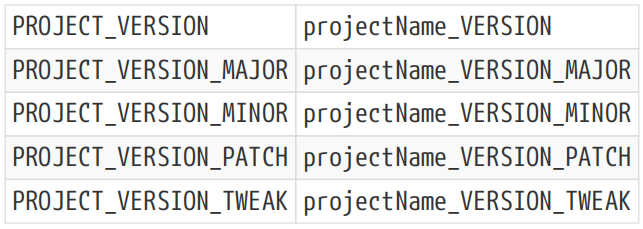
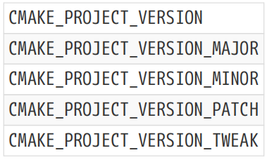

# Ch19. Specifying Version Details

Versioning is one of those things that frequently doesn’t get the attention it deserves. The importance of what a version number communicates to users is often underestimated, resulting in users with unmet expectations or confusion about changes between releases. There are also the inevitable tensions between marketing and how a versioning strategy affects the technical implementation of builds, packaging and so on. Thinking about and establishing these things early places the project in a better position when it comes time to deliver the first public release. This chapter explores ways to implement an effective versioning strategy, taking advantage of CMake features to provide a robust, efficient process.

版本控制是经常得不到应有关注的事情之一。版本号向用户传达的信息的重要性往往被低估，导致用户对版本之间的变化抱有未满足的期望或感到困惑。营销与版本控制策略如何影响构建、打包等的技术实施之间也存在不可避免的紧张关系。在交付第一个公开版本时，尽早考虑和建立这些因素会使项目处于更好的位置。本章探讨了如何实现有效的版本控制策略，利用CMake功能提供健壮、高效的流程。

## 19.1. Project Version

A project version often needs to be defined near the beginning of the top level CMakeLists.txt file so that various parts of the build can refer to it. Source code may want to embed the project version so that it can be displayed to the user or recorded in a log file, packaging steps may need it to define release version details and so on. One could simply set a variable near the start of the CMakeLists.txt file to record a version number in whatever form is needed like so:【译】项目版本通常需要在顶级CMakeLists.txt文件的开头附近定义，以便构建的各个部分都可以引用它。源代码可能希望嵌入项目版本，以便可以向用户显示或记录在日志文件中，打包步骤可能需要它来定义发布版本的详细信息，等等。人们可以简单地在CMakeLists..txt文件开头附近设置一个变量，以任何需要的形式记录版本号，如下所示：

\#------------------------------------\>\>\>\>\>\>

cmake_minimum_required(VERSION 3.0)

project(FooBar)

set(FooBar_VERSION 2.4.7)

\#------------------------------------\<\<\<\<\<\<

If individual components need to be extracted, a slightly more involved set of variables may need to be defined, one example of which may look something like this:【翻译】如果需要提取单个组件，可能需要定义一组稍微复杂的变量，其中一个示例可能如下：

\#------------------------------------\>\>\>\>\>\>

cmake_minimum_required(VERSION 3.0)

project(FooBar)

set(FooBar_VERSION_MAJOR 2)

set(FooBar_VERSION_MINOR 4)

set(FooBar_VERSION_PATCH 7)

set(FooBar_VERSION

\${FooBar_VERSION_MAJOR}.\${FooBar_VERSION_MINOR}.\${FooBar_VERSION_PATCH}

)

\#------------------------------------\<\<\<\<\<\<

Different projects may use different conventions for the naming of variables. The structure of version numbers can also vary from project to project, with the resultant lack of consistency making it that much more difficult to bring together many projects as part of a larger collection or superbuild (discussed in Section 28.1, “Superbuild Structure”). CMake 3.0 introduced new functionality which makes specifying version details easier and brings some consistency to project version numbering. The VERSION keyword was added to the project() command, mandating a version number of the form major.minor.patch.tweak as the expected format. From that information, a set of variables are automatically populated to make the full version string as well as each version component individually available to the rest of the project. Where a version string is provided with some parts omitted (the tweak part is often left out, for example), the corresponding variables are left empty. The following table shows the automatically populated version variables when the VERSION keyword is used with the project() command:

不同的项目可能对变量的命名使用不同的约定。版本号的结构也可能因项目而异，因此缺乏一致性，使得将许多项目作为更大集合或超级建筑的一部分汇集在一起变得更加困难（在第28.1节“超级建筑结构”中讨论）。CMake 3.0引入了新功能，使指定版本详细信息变得更加容易，并为项目版本编号带来了一些一致性。version关键字被添加到project（）命令中，强制使用major.minor.patch.tweak格式的版本号作为预期格式。根据这些信息，会自动填充一组变量，使完整版本字符串以及每个版本组件可供项目的其余部分单独使用。如果提供的版本字符串省略了某些部分（例如，经常省略调整部分），则相应的变量为空。下表显示了当version关键字与project（）命令一起使用时自动填充的版本变量：

The two sets of variables serve slightly different purposes. The project-specific projectName\_… variables can be used to obtain the version details anywhere from the current directory scope or below. A call like project(FooBar VERSION 2.7.3) results in variables named FooBar_VERSION, FooBar_VERSION_MAJOR and so on. Since no two calls to project() can use the same projectName, these project-specific variables won’t be overwritten by other calls to the project() command. The PROJECT\_… variables, on the other hand, are updated every time project() is called, so they can be used to provide the version details of the most recent call to project() in the current scope or above. From CMake 3.12, an analogous set of variables also provides the version details set by the project() call in the top level CMakeLists.txt file. These variables are:

这两组变量的用途略有不同。项目特定的projectName\_…变量可用于获取当前目录范围或以下任何位置的版本详细信息。一个类似调用的项目（FooBar VERSION 2.7.3）会产生名为FooBar_VERSION、FooBar_VERSION_MAJOR等的变量。由于对project（）的两次调用不能使用相同的projectName，因此这些特定于项目的变量不会被对project（（）命令的其他调用覆盖。另一方面，每次调用PROJECT（）时，PROJECT\_…变量都会更新，因此它们可用于提供当前作用域或更高作用域中最近调用PROJECT（）的版本详细信息。从CMake 3.12开始，一组类似的变量也提供了顶级CMakeLists.txt文件中project（）调用所设置的版本详细信息。这些变量是：

This same pattern is also followed to provide variables for the project name, description and homepage url, the latter two being added in CMake versions 3.9 and 3.12 respectively. As a general guide, the PROJECT\_… variables can be useful for generic code (especially modules) as a way to define sensible defaults for things like packaging or documentation details. The CMAKE_PROJECT\_… variables are sometimes used for defaults too, but they can be a bit less reliable since their use typically assumes a particular top level project. The projectName\_… variables are the most robust, since they are always unambiguous in which project’s details they will provide.

同样的模式也被用来为项目名称、描述和主页url提供变量，后两者分别在CMake 3.9和3.12版本中添加。作为一般指南，PROJECT\_…变量可用于通用代码（尤其是模块），作为定义包装或文档详细信息等合理默认值的一种方式。CMAKE_PROJECT\_…变量有时也用于默认值，但它们可能不太可靠，因为它们的使用通常假设一个特定的顶级项目。projectName\_…变量是最稳健的，因为它们总是明确地提供项目的详细信息。

When working with projects that support CMake versions earlier than 3.0, it is sometimes the case that they will define their own version-related variables which clash with those automatically defined by CMake 3.0 and later. This can lead to CMP0048 policy warnings which highlight the conflict. The following shows an example of code which leads to such a warning:

当使用支持早于3.0的CMake版本的项目时，有时他们会定义自己的版本相关变量，这些变量与CMake 3.0及更高版本自动定义的变量冲突。这可能会导致CMP0048策略警告，突出显示冲突。下面显示了导致此类警告的代码示例：

\#------------------------------------\>\>\>\>\>\>

cmake_minimum_required(VERSION 2.8.12)

set(FooBar_VERSION 2.4.7)

project(FooBar)

\#------------------------------------\<\<\<\<\<\<

In the above, the FooBar_VERSION variable is explicitly set, but this variable name conflicts with the variable that the project() command would automatically define. The resultant policy warning is intended as an encouragement for the project to either use a different variable name or to update to a minimum CMake version of 3.0 and set the version details in the project() command instead.

在上面，FooBar_VERSION变量是显式设置的，但此变量名与project（）命令将自动定义的变量冲突。由此产生的策略警告旨在鼓励项目使用不同的变量名，或者更新到最低的CMake 3.0版本，并在project（）命令中设置版本详细信息。

## 19.2. Source Code Access To Version Details

Once the version details are defined in the CMakeLists.txt file, a very common need is to make them available to source code compiled by the project. A number of different approaches can be used, each with their own strengths and weaknesses. One of the most common techniques used by those new to CMake is to add a compiler define at the top level of the project:

一旦在CMakeLists.txt文件中定义了版本详细信息，一个非常常见的需求是将其提供给项目编译的源代码。可以使用许多不同的方法，每种方法都有自己的优缺点。CMake新手最常用的技术之一是在项目的顶层添加编译器定义：

\#------------------------------------\>\>\>\>\>\>

cmake_minimum_required(VERSION 3.0)

project(FooBar VERSION 2.4.7)

add_definitions(-DFOOBAR_VERSION=\\\${FooBar_VERSION}\\)

\#------------------------------------\<\<\<\<\<\<

This makes the version available as a raw string able to be used like so:【翻译】这使得版本可以作为原始字符串使用，可以这样使用：

\`\`\`cpp

**void printVersion**()

{

std::cout \<\< FOOBAR_VERSION \<\< std::endl;

}

\`\`\`

While this approach is fairly simple, adding the definition to the compilation of every single file in the project comes with some drawbacks. Apart from cluttering up the command line of every file to be compiled, it means that any time the version number changes, the whole project gets rebuilt. This may seem like a minor point, but developers who regularly switch between different branches in a source control system will almost certainly get very annoyed by all the unnecessary recompilations. A slightly better approach uses source properties to define the FOOBAR_VERSION symbol only for those files where it is needed. For example:

虽然这种方法相当简单，但将定义添加到项目中每个文件的编译中会带来一些缺点。除了弄乱每个要编译的文件的命令行外，这意味着任何时候版本号发生变化，整个项目都会被重建。这似乎是一个小问题，但经常在源代码控制系统的不同分支之间切换的开发人员几乎肯定会对所有不必要的重新编译感到非常恼火。一种稍好的方法是使用源属性仅为需要的文件定义FOOBAR_VERSION符号。例如：

\#------------------------------------\>\>\>\>\>\>

cmake_minimum_required(VERSION 3.0)

project(FooBar VERSION 2.4.7)

add_executable(foobar main.cpp src1.cpp src2.cpp ...)

get_source_file_property(defs src1.cpp COMPILE_DEFINITIONS)

list(APPEND defs "FOOBAR_VERSION=\\\${FooBar_VERSION}\\")

set_source_files_properties(src1.cpp PROPERTIES

COMPILE_DEFINITIONS \${defs}

)

\#------------------------------------\<\<\<\<\<\<

This avoids adding the compiler definition to every file, instead only adding it to those files that need it. As mentioned in Section 9.5, “Source Properties”, however, there can be negative impacts on the build dependencies when setting individual source properties and these once again result in more files being rebuilt than should be necessary. Therefore, this approach may seem like an improvement, but often it won’t be.【翻译】这避免了将编译器定义添加到每个文件中，而只是将其添加到需要它的文件中。然而，如第9.5节“源属性”所述，在设置单个源属性时，可能会对构建依赖关系产生负面影响，这再次导致重建的文件比所需的更多。因此，这种方法可能看起来像是一种改进，但通常不会。

Rather than passing the version details on the command line, another common approach is to use configure_file() to write a header file that supplies the version details. For example:

另一种常见的方法是使用configure_file（）编写一个提供版本详细信息的头文件，而不是在命令行上传递版本详细信息。例如：

\#----------//foobar_version.h.in

\#------------------------------------\>\>\>\>\>\>

\#include \<string\>

**inline** std::string getFooBarVersion()

{

**return** "@FooBar_VERSION@";

}

**inline unsigned** getFooBarVersionMajor()

{

**return** @FooBar_VERSION_MAJOR@;

}

**inline unsigned** getFooBarVersionMinor()

{

**return** @FooBar_VERSION_MINOR@ +**0**;

}

**inline unsigned** getFooBarVersionPatch()

{

**return** @FooBar_VERSION_PATCH@ +**0**;

}

**inline unsigned** getFooBarVersionTweak()

{

**return** @FooBar_VERSION_TWEAK@ +**0**;

}

\#------------------------------------\<\<\<\<\<\<

\#-----//*main.cpp*

\#------------------------------------\>\>\>\>\>\>

\#include "foobar_version.h"

\#include \<iostream\>

**int main**(**int** argc, **char**\* argv\[\])

{

std::cout \<\< "VERSION = " \<\< getFooBarVersion() \<\< "\n"

> \<\< "MAJOR = " \<\< getFooBarVersionMajor() \<\< "\n"
>
> \<\< "MINOR = " \<\< getFooBarVersionMinor() \<\< "\n"
>
> \<\< "PATCH = " \<\< getFooBarVersionPatch() \<\< "\n"
>
> \<\< "TWEAK = " \<\< getFooBarVersionTweak()
>
> \<\< std::endl;
>
> **return 0**;

}

\#------------------------------------\<\<\<\<\<\<

\#-----------//*CMakeLists.txt*

\#------------------------------------\>\>\>\>\>\>

cmake_minimum_required(VERSION 3.0)

project(FooBar VERSION 2.4.7)

configure_file(foobar_version.h.in foobar_version.h @ONLY)

add_executable(foobar main.cpp)

target_include_directories(foobar PRIVATE "\${CMAKE_CURRENT_BINARY_DIR}")

\#------------------------------------\<\<\<\<\<\<

The +0 in foobar_version.h.in is necessary for the minor, patch and tweak parts to allow their corresponding variables to be empty in the case of those version components being omitted.

【翻译】foobar_version.h.in中的+0是次要、补丁和调整部分所必需的，以便在省略这些版本组件的情况下，允许其相应的变量为空。

Providing version details through a header like this is an improvement over the previous techniques. The version details are not included on the command line of any source file’s compilation and only those files that \#include the foobar_version.h header will be recompiled when the version details change. Providing all of the different version components rather than just the version string also has no impact on command lines. Nevertheless, if the version number is needed in many different source files, this can still result in more recompilation than is really necessary. This approach can be further refined by moving the implementations out of the header into their own .cpp file and compiling that as its own library.

通过这样的标题提供版本详细信息是对以前技术的改进。版本详细信息不包含在任何源文件编译的命令行中，只有#包含foobar_version.h标头的文件才会在版本详细信息更改时重新编译。提供所有不同的版本组件，而不仅仅是版本字符串，对命令行也没有影响。然而，如果许多不同的源文件都需要版本号，这仍然可能导致比实际需要更多的重新编译。通过将实现从标头中移出到它们自己的.cpp文件中，并将其编译为自己的库，可以进一步改进这种方法。

\#-----------//*foobar_version.h*

\#------------------------------------\>\>\>\>\>\>

\#include \<string\>

std::string getFooBarVersion();

**unsigned** **getFooBarVersionMajor**();

**unsigned** **getFooBarVersionMinor**();

**unsigned** **getFooBarVersionPatch**();

**unsigned** **getFooBarVersionTweak**();

\#------------------------------------\<\<\<\<\<\<

\#--------------//*foobar_version.cpp.in*

\#------------------------------------\>\>\>\>\>\>

\#include "foobar_version.h"

std::string getFooBarVersion()

{

**return** "@FooBar_VERSION@";

}

**unsigned** getFooBarVersionMajor()

{

**return** @FooBar_VERSION_MAJOR@;

}

**unsigned** getFooBarVersionMinor()

{

**return** @FooBar_VERSION_MINOR@ +**0**;

}

**unsigned** getFooBarVersionPatch()

{

**return** @FooBar_VERSION_PATCH@ +**0**;

}

**unsigned** getFooBarVersionTweak()

{

**return** @FooBar_VERSION_TWEAK@ +**0**;

}

\#------------------------------------\<\<\<\<\<\<

\#--------------------//*CMakeLists.txt*

\#------------------------------------\>\>\>\>\>\>

cmake_minimum_required(VERSION 3.0)

project(FooBar VERSION 2.4.7)

configure_file(foobar_version.cpp.in foobar_version.cpp @ONLY)

add_library(foobar_version STATIC \${CMAKE_CURRENT_BINARY_DIR}/foobar_version.cpp)

add_executable(foobar main.cpp)

target_link_libraries(foobar PRIVATE foobar_version)

add_library(fooToolkit mylib.cpp)

target_link_libraries(fooToolkit PRIVATE foobar_version)

\#------------------------------------\<\<\<\<\<\<

This arrangement has none of the drawbacks of the previous approaches. When the version details change, only one source file needs to be recompiled (the generated foobar_version.cpp file) and the foobar and fooToolkit targets only need to be relinked. The foobar_version.h header never changes, so any file that depends on it does not become out of date when the version details change. No options are added to the compilation command line of any source file either, so no other recompilations are triggered as a result of changing version details.【翻译】这种安排没有以前方法的缺点。当版本详细信息更改时，只需要重新编译一个源文件（生成的foobar_version.cpp文件），并且只需要重新链接foobar和fooToolkit目标。foobar_version.h标头永远不会更改，因此当版本详细信息更改时，依赖于它的任何文件都不会过期。任何源文件的编译命令行也没有添加任何选项，因此不会因更改版本详细信息而触发其他重新编译。

In situations where the project provides a library and header as part of a release package, the above arrangement is also robust. The header does not contain the version details, the library does. Therefore, code using the library can call the version functions and be confident that the details they receive are those the library was built with. This can be helpful in complicated end user environments where multiple versions of a project might be installed and not necessarily structured how the project intended.【翻译】在项目提供库和标头作为发布包的一部分的情况下，上述安排也是稳健的。标头不包含版本详细信息，库包含。因此，使用该库的代码可以调用版本函数，并确信它们收到的详细信息是该库构建时使用的。这在复杂的最终用户环境中很有帮助，在这些环境中，可能会安装多个版本的项目，而不一定按照项目的预期进行结构化。

One variant of this approach is to make foobar_version an object library rather than a static library. The end result is more or less the same, but there isn’t much to be gained and it may feel less natural to some developers. Making it a shared library loses some of the robustness advantages and again introduces a little more complexity for little benefit, so it would generally be recommended to make these sort of version libraries static.【翻译】这种方法的一个变体是将foobar_version设置为对象库，而不是静态库。最终结果或多或少是一样的，但没有太多收获，对一些开发人员来说可能感觉不太自然。将其设置为共享库会失去一些健壮性优势，并再次引入更多复杂性，但收效甚微，因此通常建议将这些版本库设置为静态。

## 19.3. Source Control Commits

It is not unusual for projects to want to record details related to their source control system. This might include the revision or commit hash of the sources at the time of the build, the name of the current branch or most recent tag and so on. The approach outlined above with version details provided through a dedicated .cpp file lends itself well to adding more functions to return such details. For example, the current git hash can be provided relatively easily:

项目想要记录与源代码控制系统相关的详细信息并不罕见。这可能包括构建时源代码的修订或提交哈希、当前分支的名称或最新标签等。上面概述的方法以及通过专用.cpp文件提供的版本详细信息非常适合添加更多函数来返回这些详细信息。例如，当前的git哈希可以相对容易地提供：

\#-------------//*foobar_version.cpp.in*

\#------------------------------------\>\>\>\>\>\>

std::string getFooBarGitHash()

{

**return** "@FooBar_GIT_HASH@";

}

// Other functions as before...

\#------------------------------------\<\<\<\<\<\<

\#-------------//*CMakeLists.txt*

\#------------------------------------\>\>\>\>\>\>

cmake_minimum_required(VERSION 3.0)

project(FooBar VERSION 2.4.7)

\# The find_package() command is covered later in the Finding Things chapter.

\# Here, it provides the GIT_EXECUTABLE variable after searching for the

\# git binary in some standard/well-known locations for the current platform.

find_package(Git REQUIRED)

execute_process(

COMMAND \${GIT_EXECUTABLE} rev-parse HEAD

RESULT_VARIABLE result

OUTPUT_VARIABLE FooBar_GIT_HASH

OUTPUT_STRIP_TRAILING_WHITESPACE

)

if(result)

message(FATAL_ERROR "Failed to get git hash: \${result}")

endif()

configure_file(foobar_version.cpp.in foobar_version.cpp @ONLY)

\# Targets, etc....

\#------------------------------------\<\<\<\<\<\<

A slightly more interesting example is measuring how many commits have occurred since a particular file changed. Consider embedding the project’s version in a separate file rather than in the CMakeLists.txt file, where the only thing in this separate file is the project version number. A reasonable assumption can then be made that the file only changes when the version number changes. As a result, measuring the number of commits since that file changed on the current branch is generally a good measure of the number of commits since the last version update.

一个稍微有趣的例子是测量自特定文件更改以来发生了多少次提交。考虑将项目的版本嵌入到一个单独的文件中，而不是嵌入到CMakeLists.txt文件中，因为这个单独文件中唯一的东西就是项目版本号。然后，可以合理地假设文件仅在版本号更改时更改。因此，衡量自当前分支上文件更改以来的提交数量通常是衡量自上次版本更新以来提交数量的好方法。

The following example moves the project version out to a separate file named projectVersionDetails.cmake and provides the number of commits through a new function in the generated foobar_version.cpp file. It demonstrates a pattern suitable for any project where the version is set by the top level project() call, but in a way that won’t interfere with a parent project if it is incorporated into a larger project hierarchy (a topic discussed in Section 27.2, “FetchContent”).

以下示例将项目版本移出到名为projectVersionDetails.cmake的单独文件中，并通过生成的foobar_version.cpp文件中的新函数提供提交次数。它演示了一种适用于任何项目的模式，其中版本由顶级project（）调用设置，但如果将其合并到更大的项目层次结构中，则不会干扰父项目（第27.2节“FetchContent”中讨论的主题）。

\#-------------------//*foobar_version.cpp.in*

\#------------------------------------\>\>\>\>\>\>

**unsigned getFooBarCommitsSinceVersionChange**()

{

**return** @FooBar_COMMITS_SINCE_VERSION_CHANGE@;

}

// Other functions as before...

\#------------------------------------\<\<\<\<\<\<

\#---------------------//*projectVersionDetails.cmake*

\#------------------------------------\>\>\>\>\>\>

\# This file should contain nothing but the following line

\# setting the project version. The variable name must not

\# clash with the FooBar_VERSION\* variables automatically

\# defined by the project() command.

set(FooBar_VER 2.4.7)

cmake_minimum_required(VERSION 3.0)

include(projectVersionDetails.cmake)

project(FooBar VERSION \${FooBar_VER})

find_package(Git REQUIRED)

execute_process(

COMMAND \${GIT_EXECUTABLE} rev-list -1 HEAD projectVersionDetails.cmake

RESULT_VARIABLE result

OUTPUT_VARIABLE lastChangeHash

OUTPUT_STRIP_TRAILING_WHITESPACE

)

if(result)

message(FATAL_ERROR "Failed to get hash of last change: \${result}")

endif()

execute_process(

COMMAND \${GIT_EXECUTABLE} rev-list \${lastChangeHash}..HEAD

RESULT_VARIABLE result

OUTPUT_VARIABLE hashList

OUTPUT_STRIP_TRAILING_WHITESPACE

)

if(result)

message(FATAL_ERROR "Failed to get list of git hashes: \${result}")

endif()

string(REGEX REPLACE "\[\n\r\]+" ";" hashList "\${hashList}")

list(LENGTH hashList FooBar_COMMITS_SINCE_VERSION_CHANGE)

configure_file(foobar_version.cpp.in foobar_version.cpp @ONLY)

\# Targets, etc....

\#------------------------------------\<\<\<\<\<\<

The above approach works out the git hash of the last change to the version details file, then uses git rev-list to obtain the list of commit hashes for the whole repository since that commit. The commits are initially found as a string with one hash per line, which is then converted into a CMake list by replacing newline characters with the list separator (;). The list() command then simply counts how many items are in the list to give the number of commits. A simpler approach would use git rev-list --count to obtain the number directly, but older versions of git do not support the --count option, so the above method is preferable if older git versions need to be supported.

上述方法计算出版本详细信息文件最后一次更改的git哈希，然后使用git rev-list获取自提交以来整个存储库的提交哈希列表。提交最初是一个每行有一个哈希的字符串，然后通过用列表分隔符（；）替换换行符将其转换为CMake列表。list（）命令然后简单地计算列表中有多少项，以给出提交次数。一种更简单的方法是使用git rev-list--count直接获取数字，但旧版本的git不支持--count选项，因此如果需要支持旧版本的git，上述方法更可取。

Other variations are also possible. Some projects use git describe to provide various details including branch names, most recent tag, etc., but note that tag and branch details can change without changing commits. If a branch or tag is moved or renamed, the build might not be repeatable. If version details only rely on file commit hashes, no such weakness is created. This also gives the project freedom in creating, renaming or deleting tags as needed after builds have confirmed the commits have no errors (think of release tags being applied to commits after continuous integration builds, testing, etc. confirm there are no problems).

Source control systems like Subversion present other challenges. On the one hand, Subversion maintains a global revision number for the whole repository, so there is no need to first obtain commit hashes and then count them. But Subversion also has the complication that it allows mixing different revisions of different files. As a result, approaches like the one outlined above for git can be defeated by a developer checking out different revisions of files but leaving the project version file alone. This is not a scenario one would expect for an automated continuous integration system, but it may be more likely for a developer working locally on their own machine, depending on the way they like to work.

Another consideration of techniques like those above is what forces the generated version .cpp file to be updated. CMake ensures the configure step is re-run if the project version file changes, since it is brought into the main CMakeLists.txt file via an include() command. If, however, commits are made to other files, CMake will not be aware of them. It may be possible to implement hooks into the version control system (e.g. git’s post-commit hook) to force CMake to re-run, but this is more likely to annoy developers than to help them. Ultimately, a compromise between convenience and robustness will typically be made. That said, the accuracy of the source control details will likely only be critical for releases and it should be easy enough to ensure that the release process explicitly invokes CMake.

## 19.4. Recommended Practices

Projects are not required to follow any particular versioning system, but by following the major.minor.patch.tweak format, certain functionality comes for free with CMake and new developers have an easier time understanding the versioning used by the project. As will be seen in later chapters (notably “Chapter 26, Packaging”), the version format is more important when making packaged releases, but since many projects report their own version number at run time, the version format affects the build as well.【翻译】项目不需要遵循任何特定的版本控制系统，但通过遵循major.minor.patch.tweak格式，CMake可以免费提供某些功能，新开发人员可以更容易地理解项目使用的版本控制。正如后面的章节（特别是“第26章，打包”）所示，在制作打包版本时，版本格式更为重要，但由于许多项目在运行时报告了自己的版本号，版本格式也会影响构建。

The meaning of each of the numbers making up the version format is up to the project, but there are conventions that end users often expect. For example, a change in the major value usually means a significant release, often involving changes that are not backward compatible or that represent a change in direction for the project. If a minor value changes, users tend to see this as an incremental release, most likely adding new features without breaking existing behavior. When only the patch value changes, users may not see it as a particularly important change and expect it to be relatively minor, such as fixing some bugs but not introducing new functionality. The tweak value is often omitted and doesn’t tend to have a common interpretation beyond being even less significant than patch. Note that these are just general observations, projects can and do give the version numbers completely different meanings. For ultimate simplicity, a project might use just a single number and nothing else, effectively specifying every release as a new major version. While this would be easy to implement, it would also provide less guidance to end users and require good quality release notes to manage user expectations between each version.

组成版本格式的每个数字的含义取决于项目，但最终用户通常会期望一些约定。例如，主要值的更改通常意味着重大的发布，通常涉及不向后兼容的更改或代表项目方向的更改。如果值发生微小变化，用户倾向于将其视为增量发布，很可能在不破坏现有行为的情况下添加新功能。当只有补丁值发生变化时，用户可能不会将其视为特别重要的变化，并期望它相对较小，例如修复一些错误但不引入新功能。调整值经常被省略，除了比补丁更不重要之外，往往没有共同的解释。请注意，这些只是一般性的观察，项目可以而且确实会给版本号带来完全不同的含义。为了简单起见，一个项目可能只使用一个数字，而不使用其他任何数字，从而有效地将每个版本指定为新的主要版本。虽然这很容易实现，但它也会为最终用户提供较少的指导，并需要高质量的发行说明来管理每个版本之间的用户期望。

The VERSION keyword of the project() command is one example of how CMake provides extra convenience when the major.minor.patch.tweak format is used. The project provides a single version string and the project() command automatically defines a set of variables making the various parts of the version number available. Some CMake modules may also use these variables as defaults for certain meta data, so it is generally advisable to set the project version with the project() command using the VERSION keyword. This keyword was added in CMake 3.0, but if supporting older CMake versions, this functionality still needs to be considered. Projects should not define variables whose names clash with the automatically defined ones or else later CMake versions will issue a warning. Avoid explicitly setting variables with names of the form xxx_VERSION or xxx_VERSION_yyy to prevent such warnings.【翻译】project（）命令的VERSION关键字是CMake在使用major.minor.patch.tweak格式时如何提供额外便利的一个例子。该项目提供一个版本字符串，project（）命令自动定义一组变量，使版本号的各个部分可用。一些CMake模块也可能将这些变量用作某些元数据的默认值，因此通常建议使用version关键字通过project（）命令设置项目版本。此关键字是在CMake 3.0中添加的，但如果支持较旧的CMake版本，则仍需要考虑此功能。项目不应定义名称与自动定义的名称冲突的变量，否则以后的CMake版本将发出警告。避免显式设置名称格式为xxx_VERSION或xxx_VERSION_yyy的变量，以防止出现此类警告。

When defining the version number, consider doing so in its own dedicated file which CMake then pulls in via an include() command. This allows the project to take advantage of changes in version number aligning with changes in that file as seen by the project’s source control system. To minimize unnecessary recompilation on version changes, generate a .c or .cpp file which contains functions that return version details rather than embedding those details in a generated header or as compiler definitions to be passed on the command line. Also ensure that names given to such functions incorporate something specific to the project or place them in a project-specific namespace. This allows the same pattern to be replicated across many projects which may later be combined into a single build without causing name clashes.

在定义版本号时，考虑在自己的专用文件中这样做，然后CMake通过include（）命令将其拉入。这允许项目利用版本号的更改，与项目源代码管理系统看到的文件中的更改保持一致。为了尽量减少版本更改时不必要的重新编译，请生成一个.c或.cpp文件，其中包含返回版本详细信息的函数，而不是将这些详细信息嵌入生成的标头中或作为编译器定义在命令行上传递。还要确保为这些函数指定的名称包含特定于项目的内容，或者将它们放置在特定于项目名称空间中。这允许在许多项目中复制相同的模式，这些项目以后可以合并到一个构建中，而不会造成名称冲突。

Establish versioning strategies and implementation patterns early in a project’s life. This helps developers gain a clear understanding about how and when version details get updated and it encourages thinking about the release process well before the pressures of the first delivery. It also allows less efficient approaches to be weeded out early so that build efficiency is maximized in advance of releases where version numbers change and where build turnaround times may become more important.在项目生命周期的早期建立版本控制策略和实施模式。这有助于开发人员清楚地了解版本细节如何以及何时更新，并鼓励他们在第一次交付的压力之前就考虑发布过程。它还允许尽早淘汰效率较低的方法，以便在版本号发生变化以及构建周转时间可能变得更加重要的版本发布之前，最大限度地提高构建效率。
