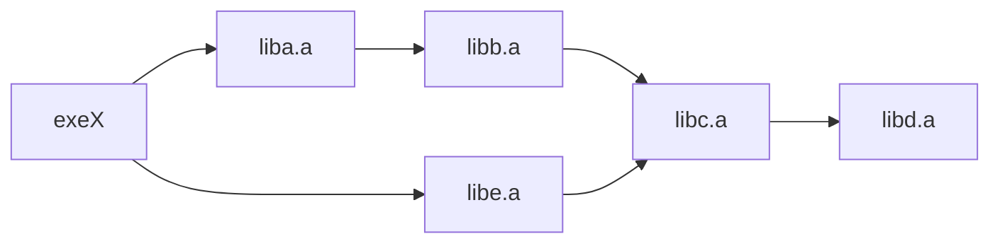

# 1.静态库链接 不传递依赖​

## Q
TARGET_LINK_LIBRARIES( Tlib   "${Deps }")
Tlib是 静态库，   "如过 Deps包括 a.a  b.a  c.a

TARGET_LINK_LIBRARIES(NewExe TRGTNAME) 相当于NewExe链接了 Tlib.a    a.a  b.a  c.a   ?

## A-yuanbao
### **问题分析与解决方案**

---

#### **1. 问题核心**
当使用 `TARGET_LINK_LIBRARIES(Tlib "${Deps}")` 将多个静态库（如 `a.a`、`b.a`、`c.a`）链接到一个静态库 `Tlib.a` 时，再通过 `TARGET_LINK_LIBRARIES(NewExe Tlib)` 链接 `Tlib.a`，**`NewExe` 不会自动继承 `a.a`、`b.a`、`c.a` 的依赖**。这是因为静态库的链接行为与动态库不同。

---

#### **2. 静态库链接的特性**
| **行为**                | **说明**                                                                 |
|-------------------------|-------------------------------------------------------------------------|
| **不传递依赖**          | 静态库 `Tlib.a` 仅包含其自身编译的 `.o` 文件，不会包含 `a.a`、`b.a`、`c.a` 的内容 |
| **符号未解决**          | 若 `Tlib.a` 使用了 `a.a` 中的函数，这些符号在 `NewExe` 中会显示为未定义          |
| **需要显式链接**        | 必须手动将 `a.a`、`b.a`、`c.a` 也链接到 `NewExe`                          |

---

#### **3. 解决方案**
##### **(1) 显式传递依赖（推荐）**
```cmake
# 方法1：使用 INTERFACE_LINK_LIBRARIES
target_link_libraries(Tlib INTERFACE ${Deps})
target_link_libraries(NewExe PRIVATE Tlib)
```
**效果**：  
CMake 会自动将 `Deps` 中的库也链接到 `NewExe`。

##### **(2) 手动链接所有库**
```cmake
# 方法2：显式列出所有依赖
target_link_libraries(NewExe PRIVATE Tlib ${Deps})
```

##### **(3) 使用对象库（CMake 3.12+）**
```cmake
# 方法3：合并为对象库（真正合并代码）
add_library(Tlib OBJECT ${SRC_FILES})
target_link_libraries(Tlib PRIVATE ${Deps})  # 仅记录依赖关系
add_executable(NewExe $<TARGET_OBJECTS:Tlib>)
target_link_libraries(NewExe PRIVATE ${Deps})  # 仍需显式链接
```

---

#### **4. 验证方法**
##### **(1) 查看链接命令**
```bash
# 检查NewExe的链接命令是否包含a.a、b.a、c.a
grep "link.txt" build/CMakeFiles/NewExe.dir/build.make
```

##### **(2) 检查符号表**
```bash
# 查看Tlib.a是否包含来自a.a的符号（通常不会）
nm libTlib.a | grep "function_from_a"

# 查看NewExe的未解决符号（应无来自a.a的未定义符号）
nm -u NewExe | grep "U "
```

---

#### **5. 完整示例**
##### **CMakeLists.txt**
```cmake
# 静态库Tlib
add_library(Tlib STATIC tlib.cpp)
target_link_libraries(Tlib PRIVATE ${Deps})  # 编译时依赖
target_link_libraries(Tlib INTERFACE ${Deps})  # 传递依赖

# 可执行文件NewExe
add_executable(NewExe main.cpp)
target_link_libraries(NewExe PRIVATE Tlib)  # 自动继承Deps
```

##### **编译验证**
```bash
# 查看NewExe的链接库
ldd NewExe  # 静态库不显示，但可用nm检查
nm NewExe | grep "function_from_a"  # 应无"U"未定义符号
```

---

#### **6. 特殊情况处理**
##### **(1) 循环依赖**
```cmake
# 使用链接组包裹
target_link_libraries(NewExe PRIVATE
    "-Wl,--start-group"
    Tlib
    ${Deps}
    "-Wl,--end-group"
)
```

##### **(2) 部分库需动态链接**
```cmake
# 混合链接示例
target_link_libraries(NewExe PRIVATE
    Tlib
    ${Deps}
    -Wl,-Bdynamic -lX11  # 强制X11动态链接
    -Wl,-Bstatic         # 恢复静态链接
)
```

---

#### **7. 不同方法的对比**
| **方法**               | **优点**                     | **缺点**                     |
|------------------------|-----------------------------|-----------------------------|
| **INTERFACE_LINK_LIBRARIES** | 自动传递依赖，维护简单       | CMake版本需≥3.0             |
| **手动链接**           | 兼容所有CMake版本           | 需手动维护依赖链            |
| **对象库**             | 真正合并代码，减少链接器负担 | 需CMake 3.12+，配置更复杂   |

---

### **总结**
1. **核心结论**：  
   静态库 `Tlib.a` **不会** 自动将其依赖的 `a.a`、`b.a`、`c.a` 传递给 `NewExe`，必须显式处理。

2. **最佳实践**：  
   ```cmake
   # 方案1：使用INTERFACE属性（推荐）
   target_link_libraries(Tlib PRIVATE ${Deps})  # 编译依赖
   target_link_libraries(Tlib INTERFACE ${Deps})  # 传递依赖
   target_link_libraries(NewExe PRIVATE Tlib)    # 自动继承Deps
   ```

3. **验证命令**：  
   ```bash
   # 确认NewExe链接了所有必要库
   grep "a.a" build/CMakeFiles/NewExe.dir/link.txt
   ```

===========================================
# 2.动态链接时​​：确保链接顺序正确（依赖库在前） ？

在动态链接（以及静态链接）中，**链接顺序确实非常重要**，通常遵循“**依赖库在前，被依赖库在后**”的原则（更准确地说：**被依赖的库放在后面**）。这一规则源于链接器的工作机制，若顺序错误可能导致“未定义符号”（undefined reference）错误。


### 一、为什么链接顺序重要？
链接器（如 `ld`）的工作方式是**按顺序扫描库文件**，当遇到一个未定义的符号（函数、变量等）时，会从后续的库中查找定义。如果库的顺序颠倒（被依赖的库放在前面），链接器扫描到该库时，尚未遇到需要它的符号，就会跳过该库，最终导致符号无法解析。

举例说明：  
假设你的程序 `app` 依赖库 `libA.so`，而 `libA.so` 又依赖库 `libB.so`（即 `app → libA → libB`）。  
- **正确顺序**：`app` 先链接 `libA.so`，再链接 `libB.so`（`-lA -lB`）。  
  链接器流程：  
  1. 扫描 `app` 目标文件，发现依赖 `libA.so` 的符号，记录未定义符号；  
  2. 扫描 `libA.so`，解析部分符号，但发现 `libA.so` 依赖 `libB.so` 的符号，继续记录；  
  3. 扫描 `libB.so`，解析剩余未定义符号，链接成功。  

- **错误顺序**：先链接 `libB.so`，再链接 `libA.so`（`-lB -lA`）。  
  链接器流程：  
  1. 扫描 `app` 目标文件，发现依赖 `libA.so` 的符号，记录未定义符号；  
  2. 扫描 `libB.so`，此时尚未遇到需要它的符号（`app` 不直接依赖 `libB`），跳过；  
  3. 扫描 `libA.so`，发现依赖 `libB.so` 的符号，但 `libB.so` 已被扫描过，无法回头查找，最终报错“undefined reference to XXX（来自 libB.so）”。  


### 二、正确的链接顺序原则
核心原则：**从“最上层依赖”到“最底层依赖”排序**，即“**使用库的一方在前，被使用的库在后**”。  
可以简化为：  
- 你的程序（可执行文件）排在最前；  
- 直接依赖的库（程序直接调用的库）排在中间；  
- 间接依赖的库（被直接依赖库调用的库）排在最后。  

用依赖链表示：  
`程序 → 直接依赖库 → 间接依赖库 → 系统基础库`  

例如：  
- 程序 `main` 依赖 `libfoo`，`libfoo` 依赖 `libbar`，`libbar` 依赖系统的 `libm`（数学库），则链接顺序为：  
  ```bash
  gcc main.c -o main -lfoo -lbar -lm
  ```  


### 三、特殊情况：循环依赖
若存在**循环依赖**（如 `libA` 依赖 `libB`，同时 `libB` 依赖 `libA`），无法严格按“依赖在前”排序，此时需**重复链接其中一个库**。  

例如：  
`libA` 和 `libB` 相互依赖，链接顺序需写成：  
```bash
gcc main.c -o main -lA -lB -lA  # 重复 -lA，确保双方依赖都能被解析
```  

原理：第二次扫描 `libA` 时，链接器会补全 `libB` 依赖 `libA` 的符号。  


### 四、在 CMake 中的实践
CMake 会**自动处理大部分链接顺序问题**，但手动指定链接库时仍需注意。通过 `target_link_libraries` 命令，按依赖关系从近到远排列：  

```cmake
# 正确：先写直接依赖，再写间接依赖
target_link_libraries(myapp
  PRIVATE
    libA  # 直接依赖
    libB  # libA 依赖 libB，放后面
    m     # 系统库，放最后
)
```  

CMake 会根据目标的依赖关系自动调整最终的链接顺序，但显式按规则排列可避免潜在问题（尤其在复杂项目中）。


### 总结
动态链接中，**链接顺序遵循“被依赖的库放在后面”**，本质是由链接器“按顺序扫描、单向查找”的机制决定的。错误的顺序会导致“未定义符号”错误，正确的做法是按“程序 → 直接依赖 → 间接依赖”的顺序排列，循环依赖时可通过重复链接解决。在 CMake 中，按依赖关系显式排列库即可确保链接正确。

==========================================
# 3.静态库的依赖顺序问题

## 3.1 问题1
如果依赖关系 exeX -> liba.a, liba.a -> libb.a -> libc.a -> libd.a;
        且 exeX -> libe.a                   -> libc.a。
这样写是否可以
target_link_libraries(exeX   liba.a    libb.a   libc.a    libd.a   libe.a  libc.a    libd.a)
???

### **答案与分析**

#### **1. 您的写法存在的问题**
```cmake
target_link_libraries(exeX liba.a libb.a libc.a libd.a libe.a libc.a libd.a)
```
- **重复链接**：`libc.a` 和 `libd.a` 被链接了两次（冗余）  
- **依赖关系混乱**：未体现 `libe.a` 对 `libc.a` 的隐式依赖  
- **维护性差**：手动管理依赖链容易出错  

---

### **2. 推荐的正确写法**
#### **方法一：显式声明依赖关系（CMake 3.0+）**
```cmake
target_link_libraries(exeX PRIVATE
    liba.a
    libe.a
)
```
**原理**：  
- CMake 会自动解析 `liba.a` 和 `libe.a` 的依赖链（通过 `INTERFACE_LINK_LIBRARIES` 属性）  
- 无需手动列出所有间接依赖  

---

#### **方法二：手动拓扑排序（兼容旧版 CMake）**
```cmake
target_link_libraries(exeX
    liba.a    # 直接依赖
    libe.a    # 直接依赖
    libb.a    # liba.a 的依赖
    libc.a    # libb.a 和 libe.a 的共同依赖
    libd.a    # libc.a 的依赖
)
```
**关键规则**：  
1. **直接依赖在前**：`liba.a` 和 `libe.a`  
2. **间接依赖在后**：按依赖层级从浅到深排列  
3. **重复依赖只保留一次**：`libc.a` 和 `libd.a` 只出现一次  

---

### **3. 验证依赖传递性**
#### **检查库的依赖链**
```bash
# 查看 liba.a 的依赖
nm liba.a | grep "U "  # 显示未定义符号
```
输出示例：
```
U GEOSGeomTypeId_r  # 需要 libb.a 中的符号
```

#### **调试 CMake 依赖**
```cmake
# 打印目标的完整链接命令
set(CMAKE_EXPORT_COMPILE_COMMANDS ON)
```
生成 `compile_commands.json` 查看最终链接顺序。

---

### **4. 技术原理**
#### **静态库链接顺序规则**
1. **从左到右解析符号**：  
   链接器按顺序处理库文件，遇到未定义符号时，从**后续库**中查找定义。  
2. **循环依赖需特殊处理**：  
   如果存在循环依赖（如 A→B→A），需要用 `--start-group` 和 `--end-group` 包裹：
   ```cmake
   target_link_options(exeX PRIVATE "-Wl,--start-group" liba.a libb.a "-Wl,--end-group")
   ```

#### **您的依赖关系图**

**正确顺序**：`liba.a libe.a libb.a libc.a libd.a`  
（`libc.a` 需在 `libb.a` 和 `libe.a` 之后）

---

### **5. 完整修复方案**
#### **步骤一：确保库文件导出依赖**
在每个库的 CMake 配置中声明依赖：
```cmake
# liba.a 的 CMakeLists.txt
target_link_libraries(liba.a INTERFACE libb.a)

# libb.a 的 CMakeLists.txt
target_link_libraries(libb.a INTERFACE libc.a)

# libc.a 的 CMakeLists.txt
target_link_libraries(libc.a INTERFACE libd.a)

# libe.a 的 CMakeLists.txt
target_link_libraries(libe.a INTERFACE libc.a)
```

#### **步骤二：主项目简洁链接**
```cmake
# exeX 只需声明直接依赖
target_link_libraries(exeX PRIVATE liba.a libe.a)
```
CMake 会自动展开完整依赖链。

---

### **6. 常见错误案例**
#### **错误：遗漏间接依赖**
```cmake
target_link_libraries(exeX liba.a libe.a)
# 运行时崩溃：缺少 libd.a 的符号
```
**原因**：未传递 `INTERFACE_LINK_LIBRARIES`  

#### **错误：顺序颠倒**
```cmake
target_link_libraries(exeX libd.a libc.a libb.a liba.a)
# 链接失败：undefined reference to `...`
```
**原因**：被依赖的库（如 `libd.a`）不能先于依赖方（如 `libc.a`）出现  

---

### **总结**
| 方案                | 优点                  | 缺点                  |
|---------------------|-----------------------|-----------------------|
| **自动依赖传递**    | 简洁、可维护          | 需库支持 CMake 3.0+   |
| **手动拓扑排序**    | 兼容旧版              | 易出错、难维护        |
| **循环依赖处理**    | 解决复杂依赖          | 需手动标记            |

**最终建议**：  
```cmake
# 现代 CMake 最佳实践
target_link_libraries(exeX PRIVATE liba.a libe.a)
```
======================
## 3.2 你的"5. 完整修复方案" 适合 库代码和exeX的代码都在一个大项目里，如果库代码是第3方库，是不是不合适了

您说得非常对！**如果库是第三方预编译的静态库（`.a` 文件），"完整修复方案"中的 `INTERFACE` 方法确实不适用**，因为您无法修改第三方库的 CMake 配置。

---

### **针对第三方静态库的正确处理方法**

#### **方法一：手动拓扑排序（最常用）**

根据您的依赖关系，推导出正确的链接顺序：

```cmake
# 正确顺序：直接依赖在前，间接依赖在后，被依赖的库在更后面
target_link_libraries(exeX
    liba.a      # 直接依赖1
    libe.a      # 直接依赖2  
    libb.a      # liba.a 的依赖
    libc.a      # libb.a 和 libe.a 的共同依赖
    libd.a      # libc.a 的依赖
)
```

**验证方法**：如果链接失败，调整顺序直到成功。

---

#### **方法二：使用链接器分组（处理复杂依赖）**

对于复杂的依赖关系，可以使用链接器的分组功能：

```cmake
# 将可能有循环依赖的库放在分组中
target_link_options(exeX PRIVATE
    "-Wl,--start-group"
    liba.a
    libe.a  
    libb.a
    libc.a
    libd.a
    "-Wl,--end-group"
)
```

**注意**：这会增加链接时间，但能解决复杂的循环依赖问题。

---

#### **方法三：封装第三方库（推荐）**

为第三方库创建封装目标，模拟依赖传递：

```cmake
# 为每个第三方库创建导入目标
add_library(ThirdPartyLibA INTERFACE IMPORTED)
set_target_properties(ThirdPartyLibA PROPERTIES
    IMPORTED_LOCATION ${CMAKE_CURRENT_SOURCE_DIR}/path/to/liba.a
    INTERFACE_LINK_LIBRARIES "ThirdPartyLibB"  # 手动声明依赖
)

add_library(ThirdPartyLibB INTERFACE IMPORTED)
set_target_properties(ThirdPartyLibB PROPERTIES
    IMPORTED_LOCATION ${CMAKE_CURRENT_SOURCE_DIR}/path/to/libb.a
    INTERFACE_LINK_LIBRARIES "ThirdPartyLibC"
)

# ... 为 libc, libd, libe 创建类似目标

# 然后只需链接直接依赖
target_link_libraries(exeX PRIVATE
    ThirdPartyLibA
    ThirdPartyLibE
)
```

**优点**：
- 保持主项目的简洁性
- 集中管理第三方库依赖
- 可复用性好

---

#### **方法四：使用 find_package（如果第三方库提供Config文件）**

如果第三方库提供了 CMake 配置：

```cmake
find_package(ThirdPartyLibA REQUIRED)
find_package(ThirdPartyLibE REQUIRED)

target_link_libraries(exeX PRIVATE
    ThirdParty::LibA
    ThirdParty::LibE
)
```

---

### **实际工程中的建议**

1. **先尝试最简单的方法**：
```cmake
target_link_libraries(exeX liba.a libe.a libb.a libc.a libd.a)
```

2. **如果链接失败，查看错误信息调整顺序**

3. **对于大型项目，推荐方法三（封装目标）**：
```cmake
# 在项目的 cmake/ThirdParty.cmake 文件中
function(import_third_party_libs)
    add_library(ThirdParty::LibA INTERFACE IMPORTED)
    set_target_properties(ThirdParty::LibA PROPERTIES
        IMPORTED_LOCATION ${LIB_DIR}/liba.a
        INTERFACE_LINK_LIBRARIES "ThirdParty::LibB"
    )
    
    add_library(ThirdParty::LibB INTERFACE IMPORTED)
    set_target_properties(ThirdParty::LibB PROPERTIES
        IMPORTED_LOCATION ${LIB_DIR}/libb.a
        INTERFACE_LINK_LIBRARIES "ThirdParty::LibC"
    )
    
    # ... 其他库
endfunction()

# 在主 CMakeLists.txt 中
include(cmake/ThirdParty.cmake)
import_third_party_libs()

target_link_libraries(exeX PRIVATE
    ThirdParty::LibA
    ThirdParty::LibE
)
```

这样既保持了现代 CMake 的简洁性，又解决了第三方库无法修改的问题。

 
### **总结一下处理第三方静态库的关键点：**

1. **核心原则**：静态库链接需要**正确的顺序**（被依赖的库放在后面）
2. **推荐方法**：使用 **`INTERFACE IMPORTED` 目标封装**第三方库，模拟依赖传递
3. **调试技巧**：通过链接错误信息调整顺序，或使用 `--start-group` 处理复杂依赖
 

====================================
