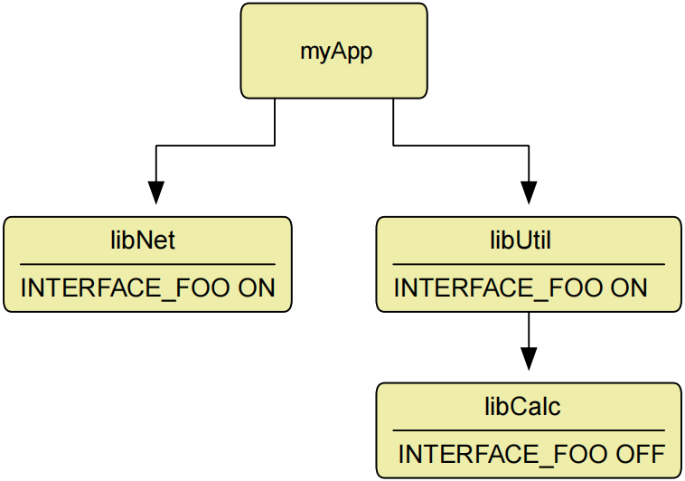
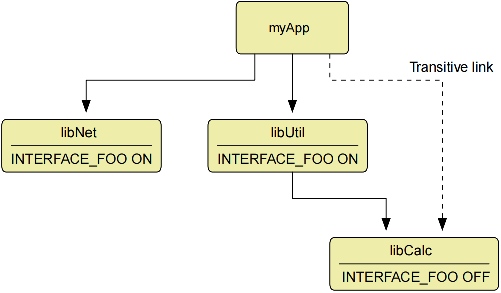
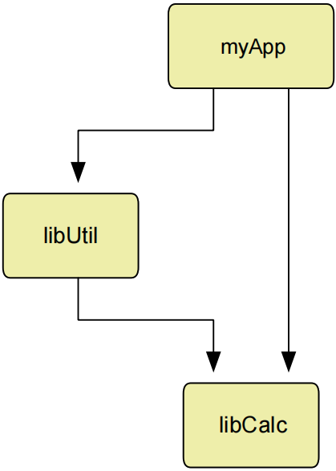
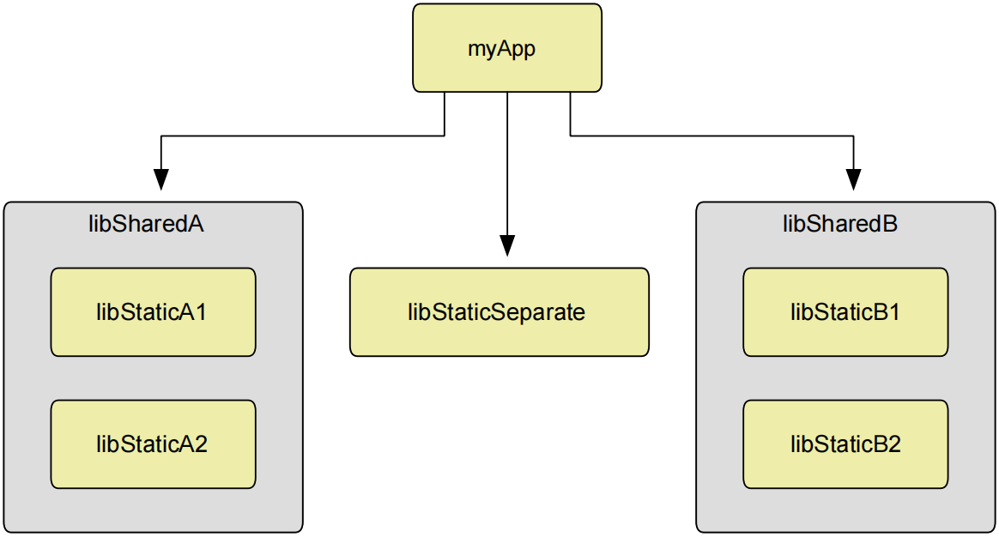

# Ch20. Libraries

Compared to writing ordinary applications, creating and maintaining libraries is typically more involved, especially shared libraries. All the usual concerns about code correctness and maintainability still apply, but shared libraries in particular also bring with them additional considerations relating to API consistency, preserving binary compatibility between releases, symbol visibility and more. Furthermore, each platform typically has its own set of unique features and requirements, making cross-platform library development a challenging task.

与编写普通应用程序相比，创建和维护库通常更复杂，尤其是共享库。关于代码正确性和可维护性的所有常见问题仍然适用，但特别是共享库也带来了与API一致性、保留版本之间的二进制兼容性、符号可见性等相关的额外考虑。此外，每个平台通常都有自己独特的功能和要求，这使得跨平台库开发成为一项具有挑战性的任务。

For the most part, however, a core set of capabilities are supported by all major platforms, it’s just that the way to define or use them varies. CMake provides a number of features which abstract away these differences so that developers can focus on the capabilities and leave the implementation details up to the build system.

然而，在大多数情况下，所有主要平台都支持一组核心功能，只是定义或使用它们的方式各不相同。CMake提供了许多功能，这些功能抽象出了这些差异，这样开发人员就可以专注于功能，而将实现细节留给构建系统。

## 20.1. Build Basics

The fundamental command for defining a library was covered in previous chapters and has the following form:【翻译】定义库的基本命令在前面的章节中已经介绍过，其形式如下：

```cmake

add_library(targetName [STATIC | SHARED | MODULE | OBJECT]

> [EXCLUDE_FROM_ALL]
>
> source1 [source2 ...])

```

A shared library will be produced if either the SHARED or MODULE keyword is provided. Alternatively, if no STATIC, SHARED, MODULE or OBJECT keyword is given, a shared library will be produced if the BUILD_SHARED_LIBS variable has a value of true at the time add_library() is called.

如果提供了**shared或MODULE**关键字，将生成**共享库**。或者，如果没有给出STATIC、SHARED、MODULE或OBJECT关键字，则如果在调用add_library（）时**BUILD_SHARED_LIBS**变量的值为true，则将生成共享库。

The main difference between SHARED and MODULE is that SHARED libraries are intended for other targets to link against, whereas MODULE libraries are not. MODULE libraries are typically used for things like plugins or other optional libraries that can be loaded at runtime. The loading of such libraries is often dependent on an application configuration setting or detection of some system feature. Other executables and libraries do not normally link against a MODULE library.

【翻译】SHARED和MODULE之间的主要区别在于，SHARED库旨在供其他目标链接，而MODULE库则不是。MODULE库通常用于插件或其他可在运行时加载的可选库。此类库的加载通常取决于应用程序配置设置或对某些系统功能的检测。其他可执行文件和库通常不会链接到MODULE库。

On most Unix-based platforms, the file name of a STATIC or SHARED library will have lib prepended by default, whereas MODULE might not. Apple platforms also support frameworks and loadable bundles, which allow additional files to be bundled with the library in a well-defined directory structure. This is covered in detail in Section 22.3, “Frameworks”.

在大多数基于Unix的平台上，默认情况下，STATIC或SHARED库的文件名将带有lib前缀，而MODULE可能没有。苹果平台还支持框架和可加载的捆绑包，这允许在定义良好的目录结构中将其他文件与库捆绑在一起。第22.3节“框架”对此进行了详细介绍。

On Windows platforms, library names do not have any lib prefix prepended, regardless of the type of library. Static library targets produce a single .lib archive, whereas shared library targets result in two separate files, one for the runtime (the .dll or dynamic link library) and the other for linking against at build time (i.e. the .lib import library). Developers sometimes confuse import and static libraries due to the same file suffix being used for both, but CMake generally handles them correctly without any special intervention.【翻译】在Windows平台上，无论库的类型如何，库名称都没有任何库前缀。静态库目标生成一个.lib存档，而共享库目标生成两个单独的文件，一个用于运行时（.dll或动态链接库），另一个用于在构建时链接（即.lib导入库）。开发人员有时会混淆导入库和静态库，因为两者使用相同的文件后缀，但CMake通常会在没有任何特殊干预的情况下正确处理它们。

When using GNU tools on Windows (e.g. with the MinGW or MSYS project generators), CMake has the ability to convert GNU import libraries (.dll.a) to the same format that Visual Studio produces (.lib). This can be useful if distributing a shared library built with GNU tools to enable it to be linked to binaries built with Visual Studio. Note that Visual Studio must be installed for this conversion to be possible. The conversion is enabled by setting the GNUtoMS target property to true for a shared library. This target property is initialized by the value of the CMAKE_GNUtoMS variable at the time add_library() is called.【翻译】在Windows上使用GNU工具（例如使用MinGW或MSYS项目生成器）时，CMake能够将GNU导入库（.dll.a）转换为Visual Studio生成的相同格式（.lib）。如果分发用GNU工具构建的共享库，使其能够链接到用Visual Studio构建的二进制文件，这可能会很有用。请注意，必须安装Visual Studio才能进行此转换。通过将共享库的GNUtoMS目标属性设置为true来启用转换。此目标属性由调用add_library()时CMAKE_GNUtoMS变量的值初始化。

## 20.2. Linking Static Libraries

CMake handles some special cases specific to linking static libraries. If a library A is listed as a PRIVATE dependency for a static library target B, then A will effectively be treated as a PUBLIC dependency as far as linking is concerned (and only for linking). This is because the private A library will still need to be added to the linker command line of anything linking to B in order for symbols from A to be found at link time. If B was a shared library, the private library A that it depends on would not need to be listed on the linker command line. This is all handled transparently by CMake, so the developer typically doesn’t need to concern themselves with the details beyond specifying the PUBLIC, PRIVATE and INTERFACE dependencies with target_link_libraries().【译】CMake处理一些特定于链接静态库的特殊情况。如果库a被列为静态库目标B的PRIVATE依赖项，那么就链接而言（并且仅用于链接），a将被有效地视为PUBLIC依赖项。这是因为仍然需要将私有A库添加到链接到B的任何链接器命令行中，以便在链接时找到来自A的符号。如果B是共享库，则它所依赖的私有库a不需要在链接器命令行上列出。所有这些都由CMake透明地处理，因此开发人员通常不需要关心细节，只需要使用target_link_libraries()指定PUBLIC、PRIVATE和INTERFACE依赖关系。

In typical projects, static libraries will not contain cyclic dependencies where two or more libraries depend on each other. Nevertheless, some scenarios give rise to such situations and CMake will recognize and handle the cyclic dependency as long as the relevant linking relationships have been specified (i.e. by target_link_libraries()). A slightly modified version of the example from the CMake documentation highlights the behavior:

在典型的项目中，静态库不会包含两个或多个库相互依赖的循环依赖关系。然而，某些场景会导致这种情况，只要指定了相关的链接关系（即通过target_link_libraries()），CMake就会识别和处理循环依赖关系。CMake文档中示例的稍作修改版本突出了该行为：

#------------------------------------>>>>>>

add_library(A STATIC a.cpp)

add_library(B STATIC b.cpp)

target_link_libraries(A PUBLIC B)

target_link_libraries(B PUBLIC A)

add_executable(main main.cpp)

target_link_libraries(main A)

#------------------------------------<<<<<<

In the above, the link command for main will contain A B A B. This repetition is provided automatically by CMake without developer intervention, but in certain pathological cases, more than one repetition may be required. While CMake provides the LINK_INTERFACE_MULTIPLICITY target property for this purpose, such situations usually point to a need for the project to be restructured. OBJECT libraries may also be a useful tool for addressing such deep interdependencies, since they effectively act like a collection of sources rather than actual libraries. The ordering of object files on the linker command line is usually not important, whereas library ordering certainly is.

在上面，main的link命令将包含A B A B。这种重复由CMake自动提供，无需开发人员干预，但在某些病理情况下，可能需要多次重复。虽然CMake为此提供了LINK_INTERFACE_MULTIPLICITY目标属性，但这种情况通常表明需要对项目进行重构。OBJECT库也可能是解决这种深层次相互依赖关系的有用工具，因为它们有效地充当了源代码的集合，而不是实际的库。链接器命令行上对象文件的顺序通常不重要，而库顺序当然重要。

## 20.3. Shared Library Versioning

A CMake project which does not expect its libraries to be used outside of the project itself doesn’t typically need version information for any shared libraries it creates. The whole project tends to be updated together when deployed, so there are few issues about ensuring binary compatibility between releases, etc. But if the project provides libraries and other software could link against them, library versioning becomes very important. Library version details add greater robustness, allowing other software to specify the interface they expect to link against and have available to them at run time.

一个不希望其库在项目本身之外使用的CMake项目通常不需要它创建的任何共享库的版本信息。部署时，整个项目往往会一起更新，因此确保版本之间的二进制兼容性等问题很少。但是，如果项目提供了库，并且其他软件可以与它们链接，那么库版本控制就变得非常重要。库版本详细信息增加了更大的健壮性，允许其他软件指定他们希望链接的接口，并在运行时提供给他们。

Most platforms offer functionality for specifying the version number of a shared library, but the way it is done varies considerably. Platforms generally have the ability to encode version details into the shared library binary and this information is sometimes used to determine whether a binary can be used by another executable or shared library that links to it. Some platforms also have conventions for setting up files and symbolic links with different levels of the version number in their names. On Linux, for example, a common set of file and symbolic links for a shared library might look like this:

大多数平台都提供指定共享库版本号的功能，但实现方式差异很大。平台通常能够将版本详细信息编码到共享库二进制文件中，这些信息有时用于确定链接到该二进制文件的另一个可执行文件或共享库 是否可以使用该二进制文件。一些平台还具有设置文件和符号链接的约定，其名称中包含不同级别的版本号。例如，在Linux上，共享库的一组常见文件和符号链接可能如下：

```sh

libmystuff.so.2.4.3

libmystuff.so.2 --> libmystuff.so.2.4.3

libmystuff.so --> libmystuff.so.2

```

CMake takes care of most of the platform differences with regard to version handling for shared libraries. When linking a target to a shared library, it will follow platform conventions when deciding which of the file or symlink names to link against. When building a shared library, CMake automates the creation of the full set of files and symlinks if version details are provided.

【翻译】CMake解决了共享库版本处理方面的大部分平台差异。当将目标链接到共享库时，在决定链接哪个文件或符号链接名称时，它将遵循平台惯例。在构建共享库时，如果提供了版本详细信息，CMake会自动创建全套文件和符号链接。

A shared library’s version details are defined by the VERSION and SOVERSION target properties. The interpretation of these properties is different across the platforms CMake supports, but by following semantic versioning principles, these differences can be handled in a fairly seamless manner. Semantic versioning assumes a version number is specified in the form major.minor.patch, where each version component is an integer. The VERSION property would be set to the full major.minor.patch, whereas SOVERSION would be set to just the major part. As a project evolves and makes releases, semantic versioning implies that the version details should be modified as follows:【翻译】共享库的版本详细信息由version和SOVERSION目标属性定义。CMake支持的平台对这些属性的解释不同，但通过遵循语义版本控制原则，可以以相当无缝的方式处理这些差异。语义版本控制假定版本号以major.minor.patch的形式指定，其中每个版本组件都是一个整数。VERSION属性将设置为完整的major.minor.patch，而SOVERSION将仅设置为主要部分。随着项目的发展和发布，语义版本控制意味着版本详细信息应按如下方式修改：

• When an incompatible API change is made, increment the major part of the version and reset the minor and patch parts to 0. This means the SOVERSION property will change every time there is an API breakage and only if there is an API breakage. 【翻译】当进行不兼容的API更改时，增加版本的主要部分，并将次要部分和修补程序部分重置为0。这意味着SOVERSION属性将在每次发生API破损时更改，并且仅在发生API破损时更改。

• When functionality is added in a backwards compatible manner, increment the minor part and reset the patch to 0. The major part remains unchanged. 【翻译】当以向后兼容的方式添加功能时，增加次要部分并将补丁重置为0。主要部分保持不变。

• When a backwards compatible bug fix is made, increment the patch value and leave the major and minor parts unchanged. 【翻译】当进行向后兼容的错误修复时，增加补丁值，并保持主要和次要部分不变。

If the version details of a shared library are modified according to these principles, API incompatibility issues at run time will be minimized on all platforms. Consider the following example, which produces the set of symbolic links shown earlier for Linux:

如果根据这些原则修改共享库的版本详细信息，则所有平台上运行时的API不兼容问题都将最小化。考虑以下示例，它为Linux生成了前面显示的符号链接集：

#------------------------------------>>>>>>

add_library(mystuff SHARED source1.cpp ...)

set_target_properties(mystuff PROPERTIES

VERSION 2.4.3

SOVERSION 2

)

#------------------------------------<<<<<<

On Apple platforms, the otool -L command can be used to print the version details encoded into the resultant shared library. The output for the shared library produced by the above example would report the version details as having a compatibility version of 2.0.0 and current version 2.4.3. Anything that linked against the mystuff library would have the name libmystuff.2.dylib encoded into it as the name of the library to look for at run time. Linux platforms show a similar structure in their symbolic links for shared libraries and normal practice is to use just the major part for the library’s soname.

在Apple平台上，otool -L命令可用于打印编码到结果共享库中的版本详细信息。上述示例生成的共享库的输出将报告版本详细信息，兼容版本为2.0.0，当前版本为2.4.3。任何与mystuff库链接的内容都会将 libmystuff.2.dylib 作为运行时要查找的库的名称编码到其中。Linux平台在共享库的符号链接中显示了类似的结构，通常的做法是只使用库soname的主要部分。

On Windows, CMake behavior is to extract a major.minor version from the VERSION property and encode that into the DLL as the DLL image version. Windows does not have the concept of a soname, so the SOVERSION property is not used. Nevertheless, following semantic versioning principles will at least ensure that the DLL version can be used to determine the compatibility of the library with binaries that link against it.

在Windows上，CMake的行为是从version属性中提取 版本号major.minor，并将其作为DLL映像版本编码到DLL中。Windows没有soname的概念，因此不使用SOVERSION属性。然而，遵循语义版本控制原则至少可以确保DLL版本可用于确定库与链接到它的二进制文件的兼容性。

It should be noted that semantic versioning is not strictly required by any platform. Rather, it provides a well defined specification which brings some certainty around dependency management between shared libraries and the things that use them. It happens to closely reflect how library versions are usually interpreted on most Unix-based platforms and CMake aims to make the most of the VERSION and SOVERSION target properties to provide shared libraries which follow native platform conventions.

应该指出的是，任何平台都不严格要求语义版本控制。相反，它提供了一个定义良好的规范，为共享库和使用它们的东西之间的依赖关系管理带来了一些确定性。它恰好反映了库版本在大多数基于Unix的平台上通常是如何解释的，CMake的目标是充分利用VERSION和SOVERSION目标属性，提供遵循本机平台约定的共享库。

Projects should be aware that if only one of the VERSION and SOVERSION target properties are set, the missing one is treated as though it had the same value as the one that was provided. This is unlikely to result in good version handling unless just a single number is used for the version number (i.e. no minor or patch parts). Such version numbering may be appropriate in certain cases, but projects should generally endeavour to follow the principles discussed above for more flexible and more robust runtime behavior.

项目应该意识到，如果只设置了VERSION和SOVERSION目标属性中的一个，则缺少的属性将被视为与提供的属性具有相同的值。这不太可能导致良好的版本处理，除非只使用一个数字作为版本号（即没有次要或补丁部分）。在某些情况下，这样的版本编号可能是合适的，但项目通常应努力遵循上述原则，以实现更灵活、更健壮的运行时行为。

## 20.4. Interface Compatibility

The VERSION and SOVERSION target properties allow API versioning to be specified in a more or less platform independent manner at the operating system level. CMake also provides other properties which can be used to define requirements for compatibility between CMake targets when they are linked to one another. These can be used to describe and enforce details that version numbering alone cannot capture.【翻译】VERSION和SOVERSION目标属性允许在操作系统级别以或多或少独立于平台的方式指定API版本。CMake还提供了其他属性，可用于定义CMake目标相互链接时的兼容性要求。这些可用于描述和强制执行仅通过版本编号无法捕捉到的细节。

Consider a realistic example where a networking library only provides support for the https:// protocol and other similar secure capabilities if an appropriate SSL toolkit is available. Other parts of the program may need to adjust their own functionality based on whether or not SSL is supported, while the program as a whole should be consistent about whether or not SSL features can be used. This can be enforced with an interface compatibility property.【翻译】考虑一个现实的例子，如果有合适的SSL工具包可用，网络库只提供对https://协议和其他类似安全功能的支持。程序的其他部分可能需要根据是否支持SSL来调整自己的功能，而整个程序在是否可以使用SSL功能方面应该保持一致。这可以通过接口兼容性属性来强制执行。

A few different types of interface compatibility properties can be defined, but the simplest is a boolean property. The basic idea is that libraries specify the name of a property they will use to advertise a particular boolean state and then they define that property with the relevant value. When multiple libraries that are being linked together define the same property name for an interface compatibility, CMake will check that they specify the same value and issue an error if they are different. A basic example looks something like this:【翻译】可以定义几种不同类型的接口兼容性属性，但最简单的是布尔属性。基本思想是，库指定它们将用于通告特定布尔状态的属性的名称，然后用相关值定义该属性。当链接在一起的多个库为接口兼容性定义了相同的属性名称时，CMake将检查它们是否指定了相同的值，如果它们不同，则会发出错误。一个基本的例子看起来像这样：

#------------------------------------>>>>>>

add_library(networking net.cpp)

set_target_properties(networking PROPERTIES

COMPATIBLE_INTERFACE_BOOL SSL_SUPPORT

INTERFACE_SSL_SUPPORT YES

)

add_library(util util.cpp)

set_target_properties(util PROPERTIES

COMPATIBLE_INTERFACE_BOOL SSL_SUPPORT

INTERFACE_SSL_SUPPORT YES

)

add_executable(myApp myapp.cpp)

target_link_libraries(myApp PRIVATE networking util)

target_compile_definitions(myApp PRIVATE

$<$<BOOL:$<TARGET_PROPERTY:SSL_SUPPORT>>:HAVE_SSL>

)

#------------------------------------<<<<<<

Both library targets advertise that they define an interface compatibility for the property name SSL_SUPPORT. The COMPATIBLE_INTERFACE_BOOL property is expected to hold a list of names, each of which requires an associated property of the same name with INTERFACE_ prepended to be defined on that target. When the libraries are used together as a link dependency for myApp, CMake checks that both libraries define INTERFACE_SSL_SUPPORT with the same value. In addition, CMake will also automatically populate the SSL_SUPPORT property of the myApp target with the same value too, which can then be used as part of a generator expression and made available to the source code of myApp as a compile definition as shown. This allows the myApp code to tailor itself to whether or not SSL support has been compiled into the libraries it uses. Continuing with the example, rather than myApp simply detecting whether or not SSL support is available, it can specify a requirement by explicitly defining its SSL_SUPPORT property to hold the value that the libraries must be compatible with. In that case, rather than automatically populating the SSL_SUPPORT property of myApp, CMake will compare the values and ensure the libraries are consistent with the specified requirement.

两个库目标都声明它们为属性名SSL_SUPPORT定义了接口兼容性。COMPATIBLE_INTERFACE_BOOL属性应包含一个名称列表，每个名称都需要一个同名的关联属性，并在该目标上预先定义INTERFACE_。当这些库一起用作myApp的链接依赖时，CMake会检查这两个库是否定义了具有相同值的INTERFACE_SSL_SUPPORT。此外，CMake还将自动用相同的值填充myApp目标的SSL_SUPPORT属性，然后可以将其用作生成器表达式的一部分，并作为编译定义提供给myApp的源代码，如图所示。这允许myApp代码根据SSL支持是否已编译到它使用的库中进行自我调整。继续这个例子，myApp不是简单地检测SSL支持是否可用，而是可以通过显式定义其SSL_support属性来指定要求，以保存库必须兼容的值。在这种情况下，CMake将比较值并确保库与指定要求一致，而不是自动填充myApp的SSL_SUPPORT属性。

#------------------------------------>>>>>>

# Require libraries to have SSL support

set_target_properties(myApp PROPERTIES SSL_SUPPORT YES)

#------------------------------------<<<<<<

The above examples are somewhat contrived, since the same constraints could effectively have been enforced in other ways. The real advantages of interface compatibility specifications start to emerge as a project becomes more complicated and its targets are spread across many directories or come from externally built projects. Interface compatibilities are assigned as properties of the targets, so they only need to be defined in one place and are then made available anywhere the target can be used without further effort. Consuming targets don’t have to know the details of how the interface compatibility is determined, only the final decision stored in the target’s INTERFACE_… properties.

上述示例有些做作，因为同样的约束本可以通过其他方式有效地执行。随着项目变得更加复杂，其目标分布在许多目录中或来自外部构建的项目，接口兼容性规范的真正优势开始显现。接口兼容性被指定为目标的属性，因此它们只需要在一个地方定义，然后可以在任何可以使用目标的地方使用，而无需进一步努力。消费目标不必知道如何确定接口兼容性的细节，只需要知道存储在目标interface_…属性中的最终决定。

CMake also supports interface compatibilities expressed as a string. These work essentially the same way as the boolean case except that the named properties are required to have exactly the same values and can hold any arbitrary contents. The earlier example can be modified to require that libraries use the same SSL implementation, not just agree on whether they support SSL or not:【翻译】CMake还支持以字符串表示的接口兼容性。除了命名属性需要具有完全相同的值并且可以包含任何任意内容之外，这些工作方式与布尔值基本相同。可以修改前面的示例，要求库使用相同的SSL实现，而不仅仅是同意它们是否支持SSL：

#------------------------------------>>>>>>

add_library(networking net.cpp)

set_target_properties(networking PROPERTIES

COMPATIBLE_INTERFACE_STRING SSL_IMPL

INTERFACE_SSL_IMPL OpenSSL

)

add_library(util util.cpp)

set_target_properties(util PROPERTIES

COMPATIBLE_INTERFACE_STRING SSL_IMPL

INTERFACE_SSL_IMPL OpenSSL

)

add_executable(myApp myapp.cpp)

target_link_libraries(myApp PRIVATE networking util)

target_compile_definitions(myApp PRIVATE

SSL_IMPL=$<TARGET_PROPERTY:SSL_IMPL>

)

#------------------------------------<<<<<<

In the above, the SSL_IMPL property is used as a string interface compatibility with the libraries specifying that they use OpenSSL as their SSL implementation. Just as for the boolean case, the myApp target could have defined its SSL_IMPL property to specify a requirement rather than letting CMake populate it with the value from the libraries.【翻译】在上面，SSL_MIMPL属性用作与指定使用OpenSSL作为SSL实现的库的字符串接口兼容性。与布尔值的情况一样，myApp目标可以定义其SSL_MIMPL属性来指定需求，而不是让CMake用库中的值填充它。

The other kind of interface compatibility CMake supports is a numeric value. Numeric interface compatibilities are used to determine the minimum or maximum value defined for a property among a set of libraries rather than to require the properties to have the same value. This key difference can be exploited to allow targets to detect things like a minimum protocol version it could support or to work out the largest temporary buffer size needed among the different libraries it links to.【翻译】CMake支持的另一种接口兼容性是数值。数字接口兼容性用于确定一组库中为属性定义的最小值或最大值，而不是要求属性具有相同的值。可以利用这一关键差异，使目标能够检测到它可以支持的最低协议版本，或者在它链接到的不同库中计算出所需的最大临时缓冲区大小。

#------------------------------------>>>>>>

add_library(bigAndFast strategy1.cpp)

set_target_properties(bigAndFast PROPERTIES

COMPATIBLE_INTERFACE_NUMBER_MIN PROTOCOL_VER

COMPATIBLE_INTERFACE_NUMBER_MAX TMP_BUFFERS

INTERFACE_PROTOCOL_VER 3

INTERFACE_TMP_BUFFERS 200

)

add_library(smallAndSlow strategy2.cpp)

set_target_properties(smallAndSlow PROPERTIES

COMPATIBLE_INTERFACE_NUMBER_MIN PROTOCOL_VER

COMPATIBLE_INTERFACE_NUMBER_MAX TMP_BUFFERS

INTERFACE_PROTOCOL_VER 2

INTERFACE_TMP_BUFFERS 15

)

add_executable(myApp myapp.cpp)

target_link_libraries(myApp PRIVATE bigAndFast smallAndSlow)

target_compile_definitions(myApp PRIVATE

MIN_API=$<TARGET_PROPERTY:PROTOCOL_VER>

TMP_BUFFERS=$<TARGET_PROPERTY:TMP_BUFFERS>

)

#------------------------------------<<<<<<

In the above, PROTOCOL_VER is defined as a minimum numeric interface compatibility, so the PROTOCOL_VER property of myApp will be set to the smallest value specified for the INTERFACE_PROTOCOL_VER property of the libraries it links to, which in this case is 2. Similarly, TMP_BUFFERS is defined as a maximum numeric interface compatibility and the myApp TMP_BUFFERS property receives the largest value among the INTERFACE_TMP_BUFFERS property of its linked libraries, which is 200.

在上面，PROTOCOL_VER被定义为最小的数字接口兼容性，因此myApp的PROTOCOL_VAR属性将被设置为它链接到的库的interface_PROTOCOL_VR属性指定的最小值，在这种情况下为2。同样，TMP_缓冲被定义为最大的数字接口兼容性，myApp TMP_缓冲器属性在其链接库的interface_TMP_BUFFERS属性中接收最大的值，即200。

At this point, it would be natural to think about using the same property for both a minimum and maximum numeric interface compatibility to allow both the smallest and largest value to be detected in the parent. This is not possible because CMake does not (and cannot) allow the same property to be used with more than one kind of interface compatibility. If a property was used for multiple types of interface compatibilities, it would be impossible for CMake to know which type should be used to compute the value to be stored in the parent’s result property. For example, if PROTOCOL_VER were both a minimum and maximum interface compatibility in the above example, CMake could not determine the value to store in the PROTOCOL_VER property of myApp - should it store the minimum or maximum value? Instead, separate properties must be used to achieve this:

此时，自然会考虑使用相同的属性来实现最小和最大的数字接口兼容性，以允许在父级中检测最小和最大值。这是不可能的，因为CMake不（也不能）允许同一属性与多种接口兼容。如果一个属性用于多种类型的接口兼容性，CMake将无法知道应该使用哪种类型来计算要存储在父级结果属性中的值。例如，如果在上述示例中PROTOCOL_VER既是最小接口兼容性，也是最大接口兼容性，CMake无法确定要存储在myApp的PROTOCOL.VER属性中的值——它应该存储最小值还是最大值？相反，必须使用单独的属性来实现这一点：

#------------------------------------>>>>>>

add_library(bigAndFast strategy1.cpp)

set_target_properties(bigAndFast PROPERTIES

COMPATIBLE_INTERFACE_NUMBER_MIN PROTOCOL_VER_MIN

COMPATIBLE_INTERFACE_NUMBER_MAX PROTOCOL_VER_MAX

INTERFACE_PROTOCOL_VER_MIN 3

INTERFACE_PROTOCOL_VER_MAX 3

)

add_library(smallAndSlow strategy2.cpp)

set_target_properties(smallAndSlow PROPERTIES

COMPATIBLE_INTERFACE_NUMBER_MIN PROTOCOL_VER_MIN

COMPATIBLE_INTERFACE_NUMBER_MAX PROTOCOL_VER_MAX

INTERFACE_PROTOCOL_VER_MIN 2

INTERFACE_PROTOCOL_VER_MAX 2

)

add_executable(myApp myapp.cpp)

target_link_libraries(myApp PRIVATE bigAndFast smallAndSlow)

target_compile_definitions(myApp PRIVATE

PROTOCOL_VER_MIN=$<TARGET_PROPERTY:PROTOCOL_VER_MIN>

PROTOCOL_VER_MAX=$<TARGET_PROPERTY:PROTOCOL_VER_MAX>

)

#------------------------------------<<<<<<

The result of the above example is that myApp knows the range of protocol versions it needs to support based on the protocols used by the libraries it links to.

上述示例的结果是，myApp根据其链接到的库所使用的协议，知道它需要支持的协议版本范围。

If one target defines an interface compatibility of any particular type, other targets are not required to define it too. Any target which does not define a matching interface compatibility is simply ignored for that particular property. This ensures libraries only need to define interface compatibilities that are relevant to them.

如果一个目标定义了任何特定类型的接口兼容性，则其他目标也不需要定义它。对于该特定属性，任何未定义匹配接口兼容性的目标都会被忽略。这确保了库只需要定义与它们相关的接口兼容性。

When there are multiple levels of library link dependencies, there are some subtle complexities to how interface compatibilities are handled. Consider the structure shown in the following diagram, which contains a number of library and executable targets and their direct link dependencies.

当存在多级库链接依赖关系时，如何处理接口兼容性会有一些微妙的复杂性。考虑下图所示的结构，其中包含许多库和可执行目标及其直接链接依赖关系。



If all link dependencies are considered PRIVATE, then only libNet and libUtil are direct link dependencies of myApp, so only those two libraries are required to have consistent values for their INTERFACE_FOO property. The value of that property in the libCalc library is not considered, since it is not a direct dependency of myApp. Furthermore, the only direct link dependency of libUtil is libCalc, so the INTERFACE_FOO property of libCalc has no other library it is required to be consistent with. Even though both libUtil and libCalc define an interface compatibility for the same property name, because they are not both direct link dependencies of a common target, they are not required to have compatible values.

如果所有链接依赖都被视为PRIVATE，那么只有libNet和libUtil是myApp的直接链接依赖，因此只有这两个库的INTERFACE_FOO属性需要具有一致的值。不考虑libCalc库中该属性的值，因为它不是myApp的直接依赖项。此外，libUtil的唯一直接链接依赖项是libCalc，因此libCalc的INTERFACE_FOO属性没有其他需要与之一致的库。尽管libUtil和libCalc都为同一属性名定义了接口兼容性，但由于它们不是共同目标的直接链接依赖项，因此不需要具有兼容的值。

Now consider the situation where libCalc is a PUBLIC link dependency of libUtil. In that case, the final linking relationships will actually look like this:

现在考虑libCalc是libUtil的PUBLIC链接依赖项的情况。在这种情况下，最终的链接关系实际上看起来像这样：



When libCalc is a PUBLIC link dependency of libUtil, anything that links to libUtil will also link to libCalc. Thus, libCalc becomes a direct link dependency of myApp and therefore it does participate in interface compatibility checking with libNet and libUtil. This means great care must taken when defining interface compatibilities to ensure that they accurately express the correct things, since their reach can extend out to targets beyond what may initially seem obvious when PUBLIC link relationships are involved.

当libCalc是libUtil的PUBLIC链接依赖项时，任何链接到libUtel的东西也会链接到libCalc。因此，libCalc成为myApp的直接链接依赖项，因此它确实参与了与libNet和libUtil的接口兼容性检查。这意味着在定义接口兼容性时必须非常小心，以确保它们准确地表达了正确的内容，因为它们的范围可以扩展到超出PUBLIC链接关系最初看起来明显的目标。

## 20.5. Symbol Visibility

Simplistically, a library can be thought of as a container of compiled source code, providing various functions and global data which other code can call or use. For static libraries, the container is really just a collection of object files and the tool putting it together is sometimes referred to as an archiver or librarian. Shared libraries, on the other hand, are produced by the linker, which processes the object code, archives, etc. and decides what to include in the final shared library binary. Some functions and global data may be hidden, meaning they have been marked as okay for the linker to use to resolve internal code dependencies, but code outside of the shared library cannot call or use them. Other symbols are exported, so code both inside and outside of the shared library can access them. This is referred to as a symbol’s visibility.

简单地说，库可以被视为编译源代码的容器，提供其他代码可以调用或使用的各种函数和全局数据。对于静态库，容器实际上只是对象文件的集合，将其组合在一起的工具有时被称为归档器或库管理员。另一方面，共享库由链接器生成，链接器处理目标代码、存档等，并决定在最终的共享库二进制文件中包含什么。某些函数和全局数据可能被隐藏，这意味着它们已被标记为可供链接器用于解析内部代码依赖关系，但共享库之外的代码无法调用或使用它们。其他符号被导出，因此共享库内外的代码都可以访问它们。这被称为符号的可见性。

Compilers have different ways of specifying symbol visibility and they also have different default behaviors. Some make all symbols visible by default, whereas others hide symbols by default. Compilers also differ in the syntax used to mark individual functions, classes and data as visible or not, which adds to the complexity of writing portable shared libraries. In order to avoid some of that complexity, some developers opt to simply make all symbols visible and avoid having to explicitly mark any symbols for export. While this may initially seem like a win, it comes with a range of down sides:【翻译】编译器有不同的方式来指定符号可见性，它们也有不同的默认行为。有些默认情况下使所有符号可见，而另一些默认情况下隐藏符号。编译器在用于将单个函数、类和数据标记为可见或不可见的语法方面也有所不同，这增加了编写可移植共享库的复杂性。为了避免这种复杂性，一些开发人员选择简单地使所有符号可见，并避免显式标记任何符号以供导出。虽然这最初看起来像是一场胜利，但它也有一系列不利因素：

• It is equivalent to saying every function, class, type, global variable, etc. is freely available for anything to use. This is rarely desirable, but may be acceptable if the project is content to rely on its documentation to define the symbols which should be considered public.【译】 这相当于说每个函数、类、类型、全局变量等都可以免费使用。这很少是可取的，但如果项目满足于依赖其文档来定义应被视为公共的符号，这可能是可以接受的。

• By making all symbols visible, consuming code cannot be prevented from using things they shouldn’t. Other code linking to the library may come to rely on some internal symbol, making it harder for the shared library to change its implementation or internal structure without breaking consuming projects. 【译】通过使所有符号可见，不能阻止消费代码使用它们不应该使用的东西。链接到库的其他代码可能会依赖于一些内部符号，这使得共享库更难在不破坏消耗项目的情况下更改其实现或内部结构。

• When all symbols are to be treated as visible, the linker cannot know whether each symbol will be used by anything, so it has to include them all in the final shared library. When only a subset of the symbols are exported, the linker has the opportunity to identify code which can never be used by the visible symbols and therefore discard it, often resulting in a much smaller binary, which then has the potential to load faster at run time. 【译】当所有符号都被视为可见时，链接器无法知道每个符号是否会被任何东西使用，因此它必须将它们全部包含在最终的共享库中。当只导出符号的一个子集时，链接器有机会识别出可见符号永远无法使用的代码，并因此丢弃它，这通常会导致二进制文件更小，从而有可能在运行时加载得更快。

• Languages like C++ which support templates have the potential to define a huge number of symbols. If all symbols are visible by default, this can result in the symbol table of a shared library growing quite large. In extreme cases, this can have a measurable impact on run time startup performance. 【译】像C++这样支持模板的语言有可能定义大量的符号。如果默认情况下所有符号都是可见的，这可能会导致共享库的符号表变得相当大。在极端情况下，这可能对运行时启动性能产生可衡量的影响。

• Functions used in the internal implementation of the library may use names which expose details about what the library does or how it does it. This might be a security concern in some contexts, or it may reveal commercial IP that shouldn’t be visible to those receiving the library.【译】库内部实现中使用的函数可能会使用名称，这些名称会暴露库的功能或工作方式的详细信息。在某些情况下，这可能是一个安全问题，也可能会暴露接收库的人不应该看到的商业IP。

The above points highlight that symbol visibility is as much about enforcing the public-private nature of a library’s API as it is about the low level mechanics of shared library performance and package size. Clearly, there are advantages to only exporting those symbols which should be considered public, but the compiler and platform specific nature of how to achieve that often presents a substantial hurdle for multi-platform projects. CMake considerably simplifies this process by abstracting away those differences behind a few properties, variables and a helper module.【译】以上几点强调了符号可见性不仅是关于共享库性能和包大小的低级别机制，而且是关于强制执行库API的公私性质。显然，只导出那些应该被视为公共的符号是有好处的，但编译器和平台特定的特性往往给多平台项目带来了巨大的障碍。CMake通过抽象出一些属性、变量和辅助模块背后的差异，大大简化了这一过程。

### 20.5.1. Specifying Default Visibility

By default, Visual Studio compilers assume all symbols are hidden unless explicitly exported. Other compilers, such as GCC and Clang are the opposite, making all symbols visible by default and only hiding symbols if explicitly told to. If a project wishes to have the same default symbol visibility across all its compilers and platforms, one of these two approaches must be selected, but hopefully the disadvantages highlighted in the preceding section provide a compelling argument for choosing that symbols be hidden by default.

默认情况下，除非明确导出，否则Visual Studio编译器假定所有符号都是隐藏的。其他编译器，如GCC和Clang，则相反，默认情况下所有符号都是可见的，只有在明确告知的情况下才隐藏符号。如果一个项目希望在其所有编译器和平台上具有相同的默认符号可见性，则必须选择这两种方法之一，但希望前一节中强调的缺点为选择默认隐藏符号提供了有力的论据。

The first step to enforcing hidden default visibility is to define the <LANG>_VISIBILITY_PRESET set of properties on a shared library target. For the two most common languages where this functionality is used, the property names are C_VISIBILITY_PRESET and CXX_VISIBILITY_PRESET for C and C++ respectively. The value given to this property should be hidden, which changes the default visibility to hide all symbols. Other supported values include default, protected and internal, but these are less likely to be useful for cross-platform projects. They either specify what is already the default behavior or are variants of hidden with more specialized meanings in some contexts.

强制执行隐藏默认可见性的第一步是在共享库目标上定义<LANG>_visibility_PRESET属性集。对于使用此功能的两种最常见的语言，C和C++的属性名分别为C_VISIBILITY_PRESET和CXX_VISIBILITY_PRESET。应隐藏此属性的值，这将更改默认可见性以隐藏所有符号。其他支持的值包括默认值、受保护值和内部值，但这些值对于跨平台项目不太可能有用。它们要么指定了默认行为，要么是隐藏的变体，在某些情况下具有更特殊的含义。

The second step is to specify that inlined functions should also be hidden by default. For C++ code making heavy use of templates, this can substantially reduce the size of the final shared library binary. This behavior is controlled by the target property VISIBILITY_INLINES_HIDDEN and applies to all languages. It should hold the boolean value TRUE to hide inline symbols by default.

第二步是指定默认情况下内联函数也应隐藏。对于大量使用模板的C++代码，这可以大大减小最终共享库二进制文件的大小。此行为由目标属性VISIBILITY_INLINES_HIDDEN控制，适用于所有语言。默认情况下，它应该保持布尔值TRUE以隐藏内联符号。

Both <LANG>_VISIBILITY_PRESET and VISIBILITY_INLINES_HIDDEN can be specified on each shared library target, or a default can be set by the appropriate CMake variables. When a target is created, its <LANG>_VISIBILITY_PRESET property is initialized by the value of the CMake variable CMAKE_<LANG>_VISIBILITY_PRESET and its VISIBILITY_INLINES_HIDDEN property by the CMAKE_VISIBILITY_INLINES_HIDDEN variable. This is typically more convenient than setting the properties for each target individually.

可以在每个共享库目标上指定<LANG>_VISIBILITY_PRESESET和VISIBLITY_INLINES_HIDDEN，也可以通过相应的CMake变量设置默认值。创建目标时，其<LANG>_VISIBILITY_PRESET属性由CMake变量CMake_<LANG>_VISIBILITY_PRESET的值初始化，其VISIBLITY_INLINES_HIDDEN属性由CMake_VISIBILTY_INLINES_HIDDEN变量初始化。这通常比单独设置每个目标的属性更方便。

For those projects wishing to make all symbols visible by default across all platforms, this only requires changing the default behavior of Visual Studio compilers. From version 3.4, CMake provides the WINDOWS_EXPORT_ALL_SYMBOLS target property which provides this behavior, but with caveats. Defining this property to a true value will cause CMake to write a .def file containing all symbols from all object files used to create the shared library and pass that .def file to the linker. This is a fairly brute force method which prevents the source code from selectively hiding any symbols, so it should only be used where all symbols should be made visible. This target property is initialized by the CMAKE_WINDOWS_EXPORT_ALL_SYMBOLS CMake variable when a shared library target is created.

对于那些希望在所有平台上默认显示所有符号的项目，这只需要更改Visual Studio编译器的默认行为。从版本3.4开始，CMake提供了WINDOWS_EXPORT_ALL_SYMBOLS目标属性，该属性提供了这种行为，但有一些注意事项。将此属性定义为真值将导致CMake编写一个.def文件，其中包含用于创建共享库的所有对象文件中的所有符号，并将该.def文件传递给链接器。这是一种相当暴力的方法，可以防止源代码选择性地隐藏任何符号，因此只应在所有符号都应可见的情况下使用。创建共享库目标时，此目标属性由CMAKE_WINDOWS_EXPORT_ALL_SYMBOLS CMAKE变量初始化。

### 20.5.2. Specifying Individual Symbol Visibilities

Most common compilers support specifying the visibility of individual symbols, but the way they do so varies. In general Visual Studio uses one method and most other compilers follow the method used by GCC. The two share a similar structure, but they use different keywords. This means source code for languages like C, C++ and their derivatives can use a common preprocessor define for visibility control and projects can instruct CMake to provide the appropriate definition.

大多数常见的编译器支持指定单个符号的可见性，但它们的方式各不相同。一般来说，Visual Studio使用一种方法，大多数其他编译器遵循GCC使用的方法。两者具有相似的结构，但使用不同的关键字。这意味着C、C++及其衍生语言的源代码可以使用通用的预处理器定义进行可见性控制，项目可以指示CMake提供适当的定义。

There are three primary cases where symbol visibility can be specified: classes, functions and variables. In the following example which contains declarations for each of these three cases, note the position of MYTOOLS_EXPORT:

可以指定符号可见性的主要情况有三种：类、函数和变量。在以下包含这三种情况的声明的示例中，请注意MYTOOLS_EXPORT的位置：

```cpp

**class MYTOOLS_EXPORT** SomeClass {...}; // Export non-private members of a class

MYTOOLS_EXPORT **void someFunction**(); // Make a free function visible

MYTOOLS_EXPORT **extern int** myGlobalVar; // Make a global variable visible

```

When building the shared library containing the implementations of the above, MYTOOLS_EXPORT needs to be substituted with the relevant keywords specifying that the symbol should be exported for other libraries and executables to use. On the other hand, if the same declarations are read by code belonging to some other target outside of the shared library, then MYTOOLS_EXPORT must be substituted with the relevant keywords specifying that the symbol should be imported. On Windows, these keywords take the form __declspec(...), whereas GCC and compatible compilers use __attribute__(...).

在构建包含上述实现的共享库时，MYTOOLS_EXPORT需要用相关关键字替换，指定应导出符号以供其他库和可执行文件使用。另一方面，如果属于共享库之外的其他目标的代码读取了相同的声明，则必须用指定应导入符号的相关关键字替换MYTOOLS_EXPORT。在Windows上，这些关键字采用__declspec（…）的形式，而GCC和兼容的编译器使用__attribute__（…）。

Coming up with the right contents for MYTOOLS_EXPORT for all compilers and for both the exporting and importing cases can be somewhat messy. Add into the mix that developers might choose to build a library as either shared or static and the complexity grows. Thankfully, CMake provides the GenerateExportHeader module which handles all of these details in a very convenient fashion. This module provides the following function:

为所有编译器以及导出和导入情况制定正确的MYTOOLS_EXPORT内容可能会有些混乱。再加上开发人员可能选择将库构建为共享或静态，复杂性就会增加。值得庆幸的是，CMake提供了GenerateExportHeader模块，该模块以非常方便的方式处理所有这些细节。该模块提供以下功能：

```cmake

generate_export_header(target

[BASE_NAME baseName]

[EXPORT_FILE_NAME exportFileName]

[EXPORT_MACRO_NAME exportMacroName]

[DEPRECATED_MACRO_NAME deprecatedMacroName]

[NO_EXPORT_MACRO_NAME noExportMacroName]

[STATIC_DEFINE staticDefine]

[NO_DEPRECATED_MACRO_NAME noDeprecatedMacroName]

[DEFINE_NO_DEPRECATED]

[PREFIX_NAME prefix]

[CUSTOM_CONTENT_FROM_VARIABLE var]

)

```

Typically, none of the optional arguments are needed and only the shared library target name is provided. CMake writes out a header file in the current binary directory, using the target name in lowercase with _export.h appended as the header file name. The header provides a define for symbol export with a similarly structured name, this time using the uppercase target name with _EXPORT appended. The following demonstrates this typical usage:

通常，不需要任何可选参数，只提供共享库目标名称。CMake在当前二进制目录中写出一个头文件，使用小写的目标名称，并附加export.h作为头文件名。标头提供了一个具有类似结构名称的符号导出定义，这次使用大写目标名称并附加_export。以下演示了这种典型用法：

#------#*CMakeLists.txt*

#------------------------------------>>>>>>

# Hide things by default

set(CMAKE_CXX_VISIBILITY_PRESET hidden)

set(CMAKE_VISIBILITY_INLINES_HIDDEN YES)

# NOTE: myTools.cpp must #include myTools.h

add_library(myTools myTools.cpp)

target_include_directories(myTools PUBLIC

"${CMAKE_CURRENT_BINARY_DIR}"

)

# Write out mytools_export.h to the current binary directory

include(GenerateExportHeader)

generate_export_header(myTools)

#------------------------------------<<<<<<

//------//*myTools.h*

//----------------------------------->>>>>>

#include "mytools_export.h"

**class MYTOOLS_EXPORT** SomeClass

{

// ...

};

MYTOOLS_EXPORT **void someFunction**();

MYTOOLS_EXPORT **extern int** myGlobalVar;

//-----------------------------------<<<<<<

The current binary directory is not part of the default header search path, so it needs to be added as a PUBLIC search path for the library to ensure the mytools_export.h header can be found by both the library’s own source code and any other code from targets linking to the shared library.

当前二进制目录不是默认标头搜索路径的一部分，因此需要将其添加为库的PUBLIC搜索路径，以确保库自己的源代码和链接到共享库的目标中的任何其他代码都可以找到mytools_export.h标头。

If using the target name as part of the header file name or preprocessor define name is not desirable, the BASE_NAME option can be used to provide an alternative. It is transformed in the same way, being converted to lowercase and having _export.h appended for the file name and uppercase with _EXPORT appended for the preprocessor define.

如果不希望将目标名称用作头文件名或预处理器定义名称的一部分，可以使用BASE_name选项提供替代方案。它以相同的方式转换，转换为小写，并在文件名后附加_export.h，在预处理器定义后附加大写的_export。

#-----------#*CMakeLists.txt*

#------------------------------------>>>>>>

include(GenerateExportHeader)

generate_export_header(myTools BASE_NAME fooBar)

#------------------------------------<<<<<<

//------------//*myTools.h*

//------------------------------------->>>>>>

#include "foobar_export.h"

**class FOOBAR_EXPORT** SomeClass

{

// ...

};

FOOBAR_EXPORT **void someFunction**();

FOOBAR_EXPORT **extern int** myGlobalVar;

//-------------------------------------<<<<<<

If a different name should be used for the file and preprocessor define, then rather than using BASE_NAME, the EXPORT_FILE_NAME and EXPORT_MACRO_NAME options can be given. Unlike BASE_NAME, the names provided by these two options are used without any modification.

如果文件和预处理器定义应使用不同的名称，则可以给出EXPORT_file_name和EXPORT_MACRO_name选项，而不是使用BASE_name。与BASE_NAME不同，这两个选项提供的名称在不进行任何修改的情况下使用。

#---------------#*CMakeLists.txt*

#------------------------------------>>>>>>

include(GenerateExportHeader)

generate_export_header(myTools

EXPORT_FILE_NAME export_myTools.h

EXPORT_MACRO_NAME API_MYTOOLS

)

#------------------------------------<<<<<<

//-----------//*myTools.h*

//------------------------------------->>>>>>

#include "export_myTools.h"

**class API_MYTOOLS** SomeClass

{

// ...

};

API_MYTOOLS **void someFunction**();

API_MYTOOLS **extern int** myGlobalVar;

//-------------------------------------<<<<<<

The generate_export_header() function provides more than just this one preprocessor define, it also provides other preprocessor definitions which can be used to mark symbols as deprecated or to explicitly specify that a symbol should never be exported. The latter can be useful to prevent exporting parts of a class that is otherwise exported, such as a public member function intended for internal use within the shared library but not by code outside it. By default, the name of this preprocessor definition consists of the target name (or BASE_NAME if it is specificed) with _NO_EXPORT appended, but an alternative name can be provided with the NO_EXPORT_MACRO_NAME option if desired.【翻译】generate.export_header（）函数不仅提供了这一个预处理器定义，还提供了其他预处理器定义。这些预处理器定义可用于将符号标记为已弃用或明确指定不应导出符号。后者可用于防止导出以其他方式导出的类的部分，例如用于共享库内部使用但不由共享库外部代码使用的公共成员函数。默认情况下，此预处理器定义的名称由附加了_NO_EXPORT的目标名称（或BASE_name，如果指定的话）组成，但如果需要，可以通过NO_EXPORT_MACRO_name选项提供替代名称。

#---------------#*CMakeLists.txt*

#------------------------------------>>>>>>

include(GenerateExportHeader)

generate_export_header(myTools

NO_EXPORT_MACRO_NAME REALLY_PRIVATE

)

#------------------------------------<<<<<<

//-----------//*myTools.h*

//------------------------------------->>>>>>

#include "mytools_export.h"

**class MYTOOLS_EXPORT** SomeClass

{

**public**:

REALLY_PRIVATE **void** doInternalThings();

// ...

};

//------------------------------------<<<<<<

The function’s deprecation support works in a similar way, providing a preprocessor definition with the uppercased target (or BASE_NAME) name followed by _DEPRECATED, or allowing a custom name to be specified via the DEPRECATED_MACRO_NAME option. The DEFINE_NO_DEPRECATED option can also be given, which will result in an additional preprocessor define being provided with a name consisting of the usual uppercased target or BASE_NAME followed by _NO_DEPRECATED. Like the other preprocessor defines, this name can also be overridden with the NO_DEPRECATED_MACRO_NAME option. With some compilers, symbols marked as deprecated can result in compile time warnings which draw attention to their use. This can be a helpful mechanism to encourage developers to update their code to no longer use the deprecated symbols. The following shows how the deprecation mechanisms can be used.

该函数的弃用支持以类似的方式工作，提供带有大写目标（或BASE_NAME）名称后跟_DEPRECATED的预处理器定义，或允许通过DEPRECATED_MACRO_NAME选项指定自定义名称。也可以给出DEFINE_NO_DEPRECATED选项，这将导致为额外的预处理器定义提供一个由通常大写的目标或BASE_name后跟_NO_DEPRECATED组成的名称。与其他预处理器定义一样，此名称也可以用NO_DEPRECATED_MACRO_name选项覆盖。对于某些编译器，标记为弃用的符号可能会导致编译时警告，提请注意它们的使用。这可能是一种有用的机制，可以鼓励开发人员更新他们的代码，不再使用已弃用的符号。下面显示了如何使用弃用机制。

#-----------#*CMakeLists.txt*

#------------------------------------>>>>>>

option(OMIT_DEPRECATED "Leave out deprecated parts of myTools")

if(OMIT_DEPRECATED)

set(deprecatedOption "DEFINE_NO_DEPRECATED")

else()

unset(deprecatedOption)

endif()

include(GenerateExportHeader)

generate_export_header(myTools

NO_DEPRECATED_MACRO_NAME OMIT_DEPRECATED

${deprecatedOption}

)

#------------------------------------<<<<<<

//---------//*myTools.h*

//------------------------------------->>>>>>

#include "mytools_export.h"

**class MYTOOLS_EXPORT** SomeClass

{

**public**:

#ifndef OMIT_DEPRECATED

MYTOOLS_DEPRECATED **void** oldImpl();

#endif

// ...

};

//-------------------------------------<<<<<<

//---------//*myTools.cpp*

//------------------------------------->>>>>>

#include "myTools.h"

#ifndef OMIT_DEPRECATED

**void** SomeClass::oldImpl() { ... }

#endif

//-------------------------------------<<<<<<

The above example provides a CMake cache variable to determine whether or not to compile the deprecated items. The developer has the ability to make this choice without editing any files, so verifying behavior with or without the deprecated part of an API is easy to do. This can be particularly useful if continuous integration builds have been set up to test both with and without deprecated parts of a library. It can also be useful in situations where the project is being used as a dependency of another project, allowing that other project’s developers to test whether their code uses the deprecated symbols or not just by changing the CMake cache variable.

上面的示例提供了一个CMake缓存变量，用于确定是否编译已弃用的项目。开发人员可以在不编辑任何文件的情况下做出此选择，因此无论是否使用API的不推荐部分来验证行为都很容易。如果连续集成构建已设置为使用库的不推荐的部分进行测试，则这一点尤其有用。在项目被用作另一个项目的依赖项的情况下，它也很有用，允许其他项目的开发人员通过更改CMake缓存变量来测试他们的代码是否使用了弃用的符号。

A less common but nevertheless important case also deserves special mention. Some projects may wish to build both shared and static versions of the same library. In this case, the same set of source code needs to allow symbol exports to be enabled for the shared library build, but disabled for the static library build (also see the next section for why this won’t always be the case). When both forms of library are required in the one build, they need to be different build targets, but the generate_export_header() function writes a header that is closely tied to a single target. In order to support this scenario, the generated header includes logic to check for the existence of one further preprocessor define before populating the export definition. The name of this special define follows the usual pattern once again, this time being the uppercased target or BASE_NAME followed by _STATIC_DEFINE, or having a custom name provided by the STATIC_DEFINE option. When this special preprocessor definition is defined, the export definition is forced to expand to nothing, which is typically what is needed when the target is being built as a static library. Without the special preprocessor definition, the export define has the usual contents and works as expected when building a shared library target.【译】一个不太常见但仍然重要的案例也值得特别提及。某些项目可能希望同时构建同一库的共享版本和静态版本。在这种情况下，同一组源代码需要允许为共享库构建启用符号导出，但为静态库构建禁用符号导出（另请参阅下一节，了解为什么情况并非总是如此）。当一个构建中需要两种形式的库时，它们需要是不同的构建目标，但generate.export_header（）函数会写入一个与单个目标紧密相关的头。为了支持这种情况，生成的标头包括在填充导出定义之前检查是否存在另一个预处理器定义的逻辑。此特殊定义的名称再次遵循通常的模式，这次是大写的目标或BASE_name，后跟_STATIC_define，或者具有由STATIC_define选项提供的自定义名称。当定义了这个特殊的预处理器定义时，导出定义被迫扩展为零，这通常是将目标构建为静态库时所需要的。如果没有特殊的预处理器定义，导出定义将具有通常的内容，并在构建共享库目标时按预期工作。

When both shared and static libraries are being built for the same set of source files, the generate_export_header() function should be given the target that corresponds to the shared library. The special preprocessor define is then set only on the static library’s target. The BASE_NAME option will also typically be used to make the various symbols intuitive to either form of the library rather than being specific to the shared library only. The following demonstrates the structure needed to achieve the desired result:

当为同一组源文件构建共享库和静态库时，应向generate.export_header（）函数提供与共享库对应的目标。然后，只在静态库的目标上设置特殊的预处理器定义。BASE_NAME选项通常也用于使各种符号对库的任何一种形式都直观，而不仅仅是特定于共享库。以下展示了实现预期结果所需的结构：

#------------------------------------>>>>>>

# Same source list, different library types

add_library(myShared SHARED ${mySources})

add_library(myStatic STATIC ${mySources})

# Shared target used for generating export header

# with the name myTools_export.h, which will be suitable

# for both the shared and static targets

include(GenerateExportHeader)

generate_export_header(myShared BASE_NAME myTools)

# Static target needs special preprocessor define

# to prevent symbol import/export keywords being added

target_compile_definitions(myStatic PRIVATE

MYTOOLS_STATIC_DEFINE

)

#------------------------------------<<<<<<

As is evident by the preceding discussion, the generate_export_header() function defines a number of different preprocessor definitions and there are opportunities for different targets to accidentally try to use the same names for at least some of them. To help reduce name collisions, the PREFIX_NAME option allows an additional string to be specified which will be prepended to the names of each preprocessor definition. When used, this option would typically be something related to the project as a whole, effectively putting all of a project’s generated preprocessor names into something like a project-specific namespace.

从前面的讨论中可以明显看出，generate.export_header（）函数定义了许多不同的预处理器定义，不同的目标有可能意外地尝试为其中的至少一些使用相同的名称。为了帮助减少名称冲突，PREFIX_name选项允许指定一个额外的字符串，该字符串将附加到每个预处理器定义的名称之前。使用时，此选项通常与整个项目相关，有效地将项目生成的所有预处理器名称放入类似于项目特定的名称空间中。

The last option not yet discussed is CUSTOM_CONTENT_FROM_VARIABLE, which was only added in CMake 3.7. This option allows arbitrary content to be injected into the generated header near the end, after all of the various preprocessor logic has been added. When used, this option must be given the name of a variable whose contents should be injected, not the content itself.

最后一个尚未讨论的选项是CUSTOM_CONTENT_ROM_VARIABLE，它仅在CMake 3.7中添加。此选项允许在添加所有各种预处理器逻辑后，将任意内容注入到末尾附近生成的标头中。使用时，必须为该选项指定一个变量的名称，该变量的内容应该被注入，而不是内容本身。

#------------------------------------>>>>>>

string(TIMESTAMP now)

set(customContents "/* Generated: ${now} */")

generate_export_header(myTools

CUSTOM_CONTENT_FROM_VARIABLE customContents

)

#------------------------------------<<<<<<

## 20.6. Mixing Static And Shared Libraries

When a project builds all its libraries as static, the build may appear to be a bit more forgiving about library link dependencies. The project may neglect to specify that one target requires another, but when various static libraries are linked into a final executable, the missing library dependencies are satisfied because they are explicitly listed for the executable in the required order. The build then succeeds, but probably only after a period of trial and error doing builds, having the linker complain about missing symbols, adding in more missing libraries or reordering the existing ones, etc.

当一个项目将其所有库构建为静态时，构建可能会对库链接依赖性显得更宽容一些。项目可能会忽略指定一个目标需要另一个目标，但当各种静态库链接到最终的可执行文件中时，缺失的库依赖关系就会得到满足，因为它们是按照所需的顺序为可执行文件显式列出的。然后构建成功，但可能只有在经过一段时间的反复构建、让链接器抱怨缺少符号、添加更多缺少的库或重新排序现有库等之后。

This scenario results in success more by good fortune than by good design, but it is surprisingly common, especially with projects that define many small libraries. If link dependencies are specified for at least some of the static libraries, CMake automatically handles transitively linking those dependencies, so even if the PRIVATE/PUBLIC nature of the dependency is specified incorrectly, with a static library it is always treated as PUBLIC anyway and this sometimes makes builds work even though the link dependency isn’t accurately described.

这种情况之所以成功，更多的是因为运气好，而不是设计好，但令人惊讶的是，这种情况很常见，尤其是在定义了许多小型库的项目中。如果至少为某些静态库指定了链接依赖关系，CMake会自动处理这些依赖关系的传递链接，因此即使依赖关系的PRIVATE/PUBLIC性质指定不正确，静态库也始终被视为PUBLIC，这有时会使构建工作正常进行，即使链接依赖关系没有得到准确描述。

When library targets are defined as a mix of shared and static, the correctness of link dependencies becomes much more important. Consider the following set of targets:【译】当库目标被定义为共享和静态的混合体时，链接依赖关系的正确性变得更加重要。考虑以下一组目标：



If libUtil and libCalc are static libraries, the above link dependency relationships are safe. If libUtil is a shared library, then the above link dependency arrangement opens up the possibility of duplicating data expected to have only one instance across a whole application. If libCalc defines global data, such as might be common for a singleton or static data of a class, it may be possible for both myApp and libUtil to have their own separate instances of that data. This becomes possible because both myApp and libUtil require the linker to resolve symbols, so both invocations may decide the global data is required and set up an internal instance of it within that executable or shared library. If the global data is not an exported symbol, the linker won’t see the instance already created in libUtil when it goes to link myApp. The end result is that a second instance is created in myApp, which is almost certain to cause hard-to-trace runtime issues. A typical manifestation of this is a variable magically appearing to change values across a function call from one executable or shared library into another shared library.

如果libUtil和libCalc是静态库，则上述链接依赖关系是安全的。如果libUtil是一个共享库，那么上述链接依赖关系安排就有可能在整个应用程序中复制预期只有一个实例的数据。如果libCalc定义了全局数据，例如对于类的单例或静态数据可能很常见，那么myApp和libUtil可能都有自己单独的数据实例。这之所以成为可能，是因为myApp和libUtil都需要链接器来解析符号，因此这两个调用都可能决定需要全局数据，并在该可执行文件或共享库中设置其内部实例。如果全局数据不是导出的符号，则链接器在链接myApp时将看不到已在libUtil中创建的实例。最终的结果是在myApp中创建了第二个实例，这几乎肯定会导致难以跟踪的运行时问题。一个典型的表现是，一个变量神奇地出现在函数调用中，将值从一个可执行文件或共享库更改为另一个共享库。

Situations similar to the above scenario can appear in a number of different forms, but the same underlying principle applies in each case. If a static library is linked into a shared library, that shared library should not be combined with any other library or executable that also links to that same static library. Ideally, if shared and static libraries are being mixed, then the static libraries should only ever exclusively be linked into one shared library and anything that needs something from one of those static libraries should link to the shared library instead. The shared library essentially has its own API and the static libraries may contribute to it.

与上述情况类似的情况可能以多种不同的形式出现，但每种情况都适用相同的基本原则。如果静态库链接到共享库中，则该共享库不应与也链接到同一静态库的任何其他库或可执行文件组合。理想情况下，如果共享库和静态库混合使用，那么静态库应该只链接到一个共享库中，任何需要这些静态库中的某个库的东西都应该链接到共享库。共享库本质上有自己的API，静态库可能会对其做出贡献。



Using static libraries to build up shared library content like this presents its own set of issues when it comes to symbol visibility. Ordinarily, the code from the static libraries would not be exported, so it would not appear as part of the shared library’s exported symbols. One way to address this is to use the generate_export_header() function on the shared library as normal, then make the static library re-use the same export definitions. The key to making this work is to ensure the static library has a compile definition for the name of the shared library target with _EXPORTS appended, which is how the generated header detects whether the code is being built as part of the shared library or not.

使用静态库来构建这样的共享库内容，在符号可见性方面会出现一系列问题。通常，静态库中的代码不会被导出，因此它不会作为共享库导出符号的一部分出现。解决这个问题的一种方法是在共享库上正常使用generate_export_header（）函数，然后使静态库重用相同的导出定义。实现此功能的关键是确保静态库具有附加了_EXPORTS的共享库目标名称的编译定义，这就是生成的标头如何检测代码是否作为共享库的一部分构建的。

#-----------#*CMakeLists.txt*
```sh
add_library(myShared SHARED shared.cpp)
add_library(myStatic STATIC static.cpp)

include(GenerateExportHeader)
generate_export_header(myShared BASE_NAME mine)

target_link_libraries(myShared PRIVATE myStatic)

target_include_directories(myShared PUBLIC ${CMAKE_CURRENT_BINARY_DIR})
target_include_directories(myStatic PUBLIC ${CMAKE_CURRENT_BINARY_DIR})

# This makes the static library code appear to be part of the shared library
# library as far as the generated export header is concerned
target_compile_definitions(myStatic PRIVATE myShared_EXPORTS)
```

//-------------------//*shared.h*
```sh
#include "mine_export.h"
MINE_EXPORT **void sharedFunc**();
```

//-------------------//*static.h*
```sh
#include "mine_export.h"
MINE_EXPORT **void staticFunc**();
```

The other factor to consider is whether the linker will discard code or data defined in the static library when it comes to linking the shared library. If it determines that nothing is using a particular symbol, the linker may discard it as an optimization. Special steps may need to be taken to prevent it from doing this. One choice is to make the shared library explicitly use every symbol to be retained from the shared libraries. This has the advantage that it would work for all compilers and linkers, but it may not be feasible for non-trivial projects. The alternative essentially requires linker-specific flags to be added, such as --whole-archive and --no-whole-archive for the ld linker on Unix systems, or /WHOLEARCHIVE with Visual Studio, but such functionality may not be available with all linkers. If ensuring the shared library uses each symbol exported by its static libraries isn’t practical, it may be worth considering turning those static libraries into shared instead.

另一个需要考虑的因素是，在链接共享库时，链接器是否会丢弃静态库中定义的代码或数据。如果它确定没有任何东西在使用特定的符号，链接器可能会将其作为优化而丢弃。可能需要采取特殊措施来防止它这样做。一种选择是使共享库明确使用共享库中要保留的每个符号。这样做的优点是，它适用于所有编译器和链接器，但可能不适用于非平凡的项目。另一种方法本质上需要添加特定于链接器的标志，例如Unix系统上ld链接器的完整存档和无完整存档，或者Visual Studio的/WHOLEARCHIVE，但这些功能可能不适用于所有链接器。如果确保共享库使用其静态库导出的每个符号不切实际，那么可能值得考虑将这些静态库转换为共享库。

If a shared library only links to static libraries in a private fashion (meaning none of the static libraries’ symbols need to be exported), then the situation is considerably easier. On some platforms, no further action is needed other than simply linking the shared library to the static libraries. On others, one or two minor wrinkles may arise which need to be addressed. On many 64-bit Unix systems, for example, code has to be compiled as position independent if it is to go into a shared library, whereas there is no such requirement for static libraries. If, however, a shared library links to a static library, then the static library does have to be built as position independent.

如果共享库只以私有方式链接到静态库（这意味着不需要导出静态库的任何符号），那么情况就容易得多。在某些平台上，除了简单地将共享库链接到静态库外，不需要采取进一步的行动。在其他情况下，可能会出现一两条需要解决的小皱纹。例如，在许多64位Unix系统上，如果代码要进入共享库，则必须将其编译为与位置无关的代码，而静态库则没有这样的要求。但是，如果共享库链接到静态库，则静态库必须构建为与位置无关。

CMake provides the POSITION_INDEPENDENT_CODE target property as a way of transparently handling position independent behavior on those platforms that require it. When set to true, this causes that target’s code to be built as position independent. By default, the property is ON for SHARED and MODULE libraries and OFF for all other types of targets. The default can be overridden by setting the CMAKE_POSITION_INDEPENDENT_CODE variable, in which case it will be used to initialize the POSITION_INDEPENDENT_CODE target property when the target is created.【翻译】CMake提供POSITION_INDEPENT_CODE目标属性，作为在需要它的平台上透明地处理位置无关行为的一种方式。当设置为true时，这会导致该目标的代码被构建为位置无关的。默认情况下，该属性对于SHARED和MODULE库为ON，对于所有其他类型的目标为OFF。可以通过设置CMAKE_POSITION_INDEPENDENT_CODE变量来覆盖默认值，在这种情况下，它将在创建目标时用于初始化POSITION_INDEPENT_CODE目标属性。

```sh
add_library(myShared SHARED shared.cpp)
add_library(myStatic STATIC static.cpp)

target_link_libraries(myShared PRIVATE myStatic)

set_target_properties(myStatic PROPERTIES
    POSITION_INDEPENDENT_CODE ON
)
set(CMAKE_POSITION_INDEPENDENT_CODE ON)

add_library(myOtherStatic STATIC other.cpp)

target_link_libraries(myShared PRIVATE myOtherStatic)

``` 

## 20.7. Recommended Practices

Use MODULE libraries for optional plugins to be loaded on demand and SHARED libraries for linking against. Use shared libraries where the symbols to be exposed to consumers of the library must be tightly controlled, either for API purposes or to hide sensitive implementation details. If aiming to deliver a library as part of a release package, shared libraries tend to be preferred over static libraries in most cases.

使用MODULE库可按需加载可选插件，使用SHARED库可链接。在必须严格控制要向库的使用者公开的符号的情况下，使用共享库，无论是出于API目的还是为了隐藏敏感的实现详细信息。如果要将库作为发布包的一部分交付，在大多数情况下，共享库往往比静态库更受欢迎。

If a target uses something from a library, it should always link directly to that library. Even if the library is already a link dependency of something else the target links to, do not rely on an indirect link dependency for something a target uses directly. If that other target changes its implementation and it no longer links against the library, the main target will no longer build. Furthermore, express the right type of link dependency; PRIVATE, PUBLIC or INTERFACE. This ensures CMake correctly handles transitive link dependencies for both shared and static libraries. Specifying all the direct dependencies with the correct level of visibility is essential for ensuring CMake constructs a reliable linker command line with correct library ordering.

如果目标使用库中的内容，则应始终直接链接到该库。即使库已经是目标链接到的其他对象的链接依赖关系，也不要依赖目标直接使用的对象的间接链接依赖关系。如果另一个目标更改了其实现，并且不再与库链接，则主目标将不再构建。此外，表达正确的链接依赖类型；私人、公共或接口。这确保了CMake正确处理共享库和静态库的可传递链接依赖关系。指定具有正确可见性级别的所有直接依赖关系对于确保CMake构建具有正确库顺序的可靠链接器命令行至关重要。

Using the correct link visibility has the added benefit that consuming targets don’t have to know about all the different library dependencies used internally, they only need to link to a library and let that library define its own dependencies. CMake then takes care of ensuring all required libraries are specified in the correct order on the final linker command line. Resist the temptation to simply make all link dependencies PUBLIC, since this extends the visibility of otherwise private libraries into places where it may be undesirable. This becomes particularly important when packaging up a project for release or distribution.

使用正确的链接可见性还有一个额外的好处，即消费目标不必知道内部使用的所有不同的库依赖关系，他们只需要链接到库并让该库定义自己的依赖关系。CMake然后负责确保在最终的链接器命令行上以正确的顺序指定所有必需的库。抵制简单地将所有链接依赖项都设置为公共的诱惑，因为这会将原本私有的库的可见性扩展到可能不受欢迎的地方。在打包项目以供发布或分发时，这一点变得尤为重要。

Consider using a library versioning strategy as early as possible. Once a library has been released into the wild, the version number has some very specific meanings with regard to binary compatibility. Make use of the VERSION and SOVERSION target properties to specify the library version, even if initially these are set to some basic placeholders early in the life of the project. In the absence of any other strategy, one reasonable option is to start version numbering at 0.1.0, since people tend to interpret 0.0.0 as a default value or the version mistakenly not having been set, while 1.0.0 is sometimes taken to imply the first public release. Give strong consideration to adopting semantic versioning for handling version changes thereafter. Also keep in mind that changes in library versions can have a surprisingly strong influence on things like release processes, packaging, etc. and developers need time to learn the implications of version numbers for shared libraries well in advance of those libraries being released publicly. Consider also whether the project version and library version should have any relationship to each other or not. It can be very difficult to change such a relationship once the first release is made, so be wary of linking them unless they have a strong association (a project delivering a coherent set of libraries as a SDK would be once such example of strong association).

考虑尽早使用库版本控制策略。一旦一个库被发布到野外，版本号在二进制兼容性方面就有一些非常具体的含义。使用VERSION和SOVERSION目标属性指定库版本，即使最初在项目生命周期的早期将其设置为一些基本占位符。在没有任何其他策略的情况下，一个合理的选择是从0.1.0开始版本编号，因为人们倾向于将0.0.0解释为默认值或错误地没有设置版本，而1.0.0有时被认为意味着第一个公开版本。强烈考虑采用语义版本控制来处理此后的版本更改。还要记住，库版本的更改会对发布过程、打包等产生令人惊讶的强烈影响，开发人员需要时间在这些库公开发布之前，提前了解版本号对共享库的影响。还要考虑项目版本和库版本是否应该相互关联。一旦发布了第一个版本，就很难改变这种关系，所以要小心链接它们，除非它们有很强的关联（一个将一组连贯的库作为SDK交付的项目就是这种强关联的例子）。

Some projects can optionally provide certain functionality if a particular supporting toolkit, library, etc. is available. To allow other parts of the build or indeed other consuming projects to detect or check consistency with that optional functionality or feature, interface compatibility details can be provided. Consider whether the feature in question needs to have visibility beyond the library, such as allowing consuming targets to detect whether or not the feature is supported or confirming whether the selected implementation provides all the capabilities required. Also consider whether the added complexity of specifying and using interface compatibilities brings with it sufficient benefits to make it worthwhile, as the deeper the library dependency hierarchy becomes, the harder it can be to use interface compatibilities effectively.

如果特定的支持工具包、库等可用，一些项目可以选择提供某些功能。为了允许构建的其他部分或其他消费项目检测或检查与该可选功能或特性的一致性，可以提供接口兼容性详细信息。考虑所讨论的功能是否需要在库之外具有可见性，例如允许消费目标检测该功能是否受支持，或确认所选实现是否提供了所需的所有功能。还要考虑指定和使用接口兼容性的额外复杂性是否带来了足够的好处，使其变得值得，因为库依赖层次越深，有效使用接口兼容性就越困难。

Give consideration to symbol visibility as early in the life of a project as possible, as it can be very difficult to go back and retrofit a project with symbol visibility details later. When creating libraries, develop the mindset of always thinking about whether a particular class, function or variable should be accessible to anything outside of the library. Think of anything that has external visibility as being very hard to change, whereas internal things can be more freely modified between releases as needed. Use hidden visibility as the default and explicitly mark each individual entity to be exported, ideally with macros provided by the generate_export_header() function so that CMake handles the various platform differences on the project’s behalf. Also consider using the deprecation macros provided by that function to clearly identify those parts of a library’s API that have been deprecated and which may be removed in a future version.【译】尽可能早地在项目生命周期中考虑符号可见性，因为以后很难回去用符号可见性细节对项目进行改造。在创建库时，培养一种思维方式，即始终考虑特定的类、函数或变量是否应该被库外的任何东西访问。可以认为任何具有外部可见性的东西都很难更改，而内部的东西可以根据需要在版本之间更自由地修改。使用隐藏可见性作为默认值，并明确标记要导出的每个单独实体，最好使用generate.export_header（）函数提供的宏，以便CMake代表项目处理各种平台差异。还可以考虑使用该函数提供的弃用宏来清楚地标识库的API中已弃用的部分，这些部分可能会在将来的版本中删除。

Take extra care when mixing shared and static libraries. Where possible, prefer to use one or the other rather than both, as this avoids some of the difficulties associated with build setting consistency and symbol visibility control. Where it makes sense to mix both library types, try to ensure that static libraries only get linked into one shared library and no other targets link to those static libraries. Treat the static libraries as being sub-groups within the shared library, with outside targets only ever linking to the shared library. Even better though, consider pulling the code up from the static libraries into the shared library directly instead, getting rid of the static libraries altogether. The techniques presented in Section 28.5.1, “Target Sources” demonstrate how to add sources to an existing target progressively, allowing the target sources to be conveniently accumulated across subdirectories.

混合共享库和静态库时要格外小心。在可能的情况下，更倾向于使用其中一种而不是两种，因为这避免了与构建设置一致性和符号可见性控制相关的一些困难。如果将两种库类型混合使用是有意义的，请尽量确保静态库只链接到一个共享库中，而没有其他目标链接到这些静态库。将静态库视为共享库中的子组，外部目标只链接到共享库。更好的是，考虑将代码从静态库直接拉到共享库中，完全摆脱静态库。第28.5.1节“目标源”中介绍的技术演示了如何逐步向现有目标添加源，允许目标源在子目录中方便地累积。
