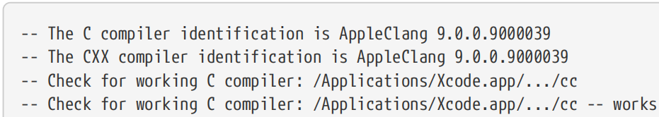
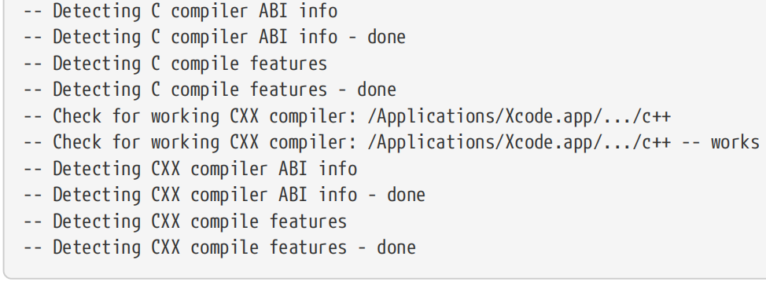

# Ch21. Toolchains And Cross Compiling

When considering the process of building software and the tools involved, developers typically think about the compiler and linker. While these are the primary tools that developers are exposed to, there are a number of other tools, libraries and supporting files that also contribute to the process. Loosely speaking, this broader set of tools and other files is collectively referred to as the toolchain.

在考虑构建软件的过程和所涉及的工具时，开发人员通常会考虑编译器和链接器。虽然这些是开发人员接触的主要工具，但还有许多其他工具、库和支持文件也有助于这一过程。粗略地说，这组更广泛的工具和其他文件统称为工具链。

For desktop or traditional server applications, there usually isn’t a great need to think too deeply about the toolchain. In most cases, deciding which release of the prevailing platform toolchain to use is about as complicated as it gets. CMake usually finds the toolchain without needing much help and the developer can get on with the task of writing software. For mobile or embedded development, however, the situation is quite different. The toolchain will normally need to be specified in some way by the developer. This can be as simple as specifying a different target system name, or it can be as complex as specifying the paths to individual tools and a target root file system. Special flags may also need to be set to make the tools produce binaries that will support the right chipset, have the required performance characteristics and so on.

对于桌面或传统的服务器应用程序，通常不太需要深入思考工具链。在大多数情况下，决定使用主流平台工具链的哪个版本是非常复杂的。CMake通常不需要太多帮助就能找到工具链，开发人员可以继续编写软件。然而，对于移动或嵌入式开发，情况则截然不同。开发人员通常需要以某种方式指定工具链。这可以像指定不同的目标系统名称一样简单，也可以像指定单个工具和目标根文件系统的路径一样复杂。可能还需要设置特殊标志，使工具生成支持正确芯片组、具有所需性能特征等的二进制文件。

Once a toolchain has been selected, CMake performs quite a bit of processing internally to test the toolchain to determine the features it supports, set various properties and variables, etc. This is the case even for a traditional build where the default toolchain is used, not just for builds that are cross-compiling. The results of these tests can be seen in CMake’s output the first time it is run for a given build directory, with an example for macOS looking something like the following (the C and CXX compiler paths shown have been collapsed for brevity):

一旦选择了工具链，CMake就会在内部执行相当多的处理，以测试工具链，确定它支持的功能，设置各种属性和变量等。即使对于使用默认工具链的传统构建也是如此，而不仅仅是交叉编译的构建。这些测试的结果可以在CMake首次为给定的构建目录运行时在CMake的输出中看到，macOS的示例如下（为简洁起见，显示的C和CXX编译器路径已折叠）：

The bulk of this processing usually occurs at the point where the first project() command is called and the results of the toolchain tests are then cached. The enable_language() command also triggers such processing when it enables a previously non-enabled language, as would another project() call that adds a previously non-enabled language. Once a language has been enabled, its cached details will always be used rather than re-testing the toolchain, even for subsequent CMake runs. This has at least two important consequences:【译】此处理的大部分通常发生在调用第一个project()命令时，然后缓存工具链测试的结果。enable_language()命令在启用以前未启用的语言时也会触发此类处理，添加以前未启用语言的另一个project()调用也是如此。一旦启用了一种语言，它的缓存细节将始终被使用，而不是重新测试工具链，即使是后续的CMake运行也是如此。这至少有两个重要后果：

• Once a build directory has been configured with a particular toolchain, it cannot (safely) be changed. In certain situations, CMake may detect that the toolchain has been modified and discard its previous results, but this only discards cached details directly related to the toolchain. Any other cached quantities based on the cached toolchain details outside of the ones CMake knows about will not be reset. Therefore, the build directory should be completely cleared before changing the toolchain (it may not be enough to just remove the CMakeCache.txt file, other details may be cached in different locations). 【译】一旦使用特定的工具链配置了构建目录，就不能（安全地）更改它。在某些情况下，CMake可能会检测到工具链已被修改并丢弃其先前的结果，但这只会丢弃与工具链直接相关的缓存细节。基于CMake所知之外的缓存工具链详细信息的任何其他缓存数量都不会被重置。因此，在更改工具链之前，应完全清除构建目录（仅删除CMakeCache.txt文件可能还不够，其他详细信息可能会缓存在不同的位置）。

• Different toolchains cannot be mixed directly within the one project. CMake fundamentally sees a project as using a single toolchain throughout. In order to use multiple toolchains, one has to structure the project to perform parts of the build as external sub-builds (a technique discussed in Section 27.1, “ExternalProject” and Section 28.1, “Superbuild Structure”). 【译】不同的工具链不能直接在一个项目中混合。CMake基本上将项目视为始终使用单个工具链。为了使用多个工具链，必须将项目结构化，以执行部分构建作为外部子构建（第27.1节“外部项目”和第28.1节“超级构建结构”中讨论的一种技术）。

## 21.1. Toolchain Files

If the default toolchain is not suitable, then the recommended way of specifying the desired toolchain details is with a toolchain file. This is just an ordinary CMake script which typically contains mostly set(…) commands. These would define the variables that CMake uses to describe the target platform, the location of the various toolchain components and so on. The name of the toolchain file is passed to CMake through the special cache variable CMAKE_TOOLCHAIN_FILE like so:【翻译】如果默认工具链不合适，那么指定所需工具链详细信息的推荐方法是使用工具链文件。这只是一个普通的CMake脚本，通常包含set（…）命令。这些将定义CMake用于描述目标平台的变量、各种工具链组件的位置等。工具链文件的名称通过特殊的缓存变量CMake_toolchain_file传递给CMake，如下所示：

\`\`\`sh

cmake -DCMAKE_TOOLCHAIN_FILE=myToolchain.cmake path/to/source

\`\`\`

A full absolute path can be used, or for a relative path like in the above example, CMake first looks relative to the top of the build directory, then if not found there, relative to the top of the source directory. This toolchain file must be specified the first time CMake is run for the build directory, it cannot be added later or changed to point to a different toolchain. Since the variable itself is cached, there is no need to respecify it again for any subsequent CMake runs.

可以使用完整的绝对路径，或者对于上面的示例中的相对路径，CMake首先查找相对于构建目录顶部的路径，然后如果在那里找不到，则查找相对于源目录顶部的位置。此工具链文件必须在首次为构建目录运行CMake时指定，以后不能添加或更改以指向其他工具链。由于变量本身是缓存的，因此不需要在任何后续的CMake运行中再次指定它。

The toolchain file is read by every call to the project() command, not just the first one. This is normally a transparent implementation detail that the developer doesn’t have to think much about, but it can lead to some subtle unexpected behavior. If the toolchain file sets or modifies variables that the project itself manipulates, or if the toolchain file incorrectly assumes it is only processed once for the whole project, then it may appear to the developer that project() commands are corrupting the toolchain settings or that variables are mysteriously changing without any obvious code making such changes. Developers should therefore ensure that toolchains are minimal, setting only the things they need to and making as few assumptions about what the project does as possible. Toolchain files should ideally be completely decoupled from the project and should even be reusable across different projects, since they should only be describing the toolchain, not how they interact with a particular project.

每次调用project（）命令都会读取工具链文件，而不仅仅是第一次调用。这通常是一个透明的实现细节，开发人员不必过多考虑，但它可能会导致一些微妙的意外行为。如果工具链文件设置或修改了项目本身操纵的变量，或者工具链文件错误地认为它在整个项目中只处理一次，那么开发人员可能会认为project（）命令正在破坏工具链设置，或者变量正在神秘地变化，而没有任何明显的代码进行此类更改。因此，开发人员应该确保工具链最小化，只设置他们需要的东西，并尽可能少地假设项目的功能。理想情况下，工具链文件应该与项目完全解耦，甚至可以在不同的项目之间重用，因为它们应该只描述工具链，而不是它们如何与特定项目交互。

The contents of a toolchain file can vary, but on the whole there are only a few main things they potentially need to do: 【翻译】工具链文件的内容可能会有所不同，但总的来说，他们可能只需要做几件主要的事情：

• Describe basic details of the target system.【翻译】描述目标系统的基本细节。

• Provide paths to tools (typically just to the compilers).【翻译】 提供工具的路径（通常仅指向编译器）。

• Set the default flags for tools (usually just for compilers and perhaps linkers). 【翻译】为工具设置默认标志（通常仅适用于编译器，也可能适用于链接器）。

• Set the location of a target platform’s root file system in the case of cross-compilation.【翻译】Set the location of a target platform’s root file system in the case of cross-compilation.

It is quite common to see other logic included in toolchain files as well, especially for influencing the behavior of the various find\_…() commands (see “Chapter 23, Finding Things”). While there are situations where such logic may be appropriate, one can mount an argument that such logic can and should be part of the project instead in most cases. Only the project knows what it is trying to find, so the toolchain should not make assumptions about what the project wants to do.

在工具链文件中也经常看到其他逻辑，特别是影响各种find\_…（）命令的行为（见“第23章，查找东西”）。虽然在某些情况下这种逻辑可能是合适的，但人们可以提出这样的论点，即在大多数情况下，这种逻辑可以而且应该成为项目的一部分。只有项目知道它试图找到什么，所以工具链不应该对项目想要做什么做出假设。

## 21.2. Defining The Target System

The fundamental variables that describe the target system are: 【翻译】描述目标系统的基本变量是：

• CMAKE_SYSTEM_NAME

• CMAKE_SYSTEM_PROCESSOR

• CMAKE_SYSTEM_VERSION

Of these, CMAKE_SYSTEM_NAME is the most important. It defines the type of platform being targeted, as opposed to CMAKE_HOST_SYSTEM_NAME which defines the platform on which the build is being performed. CMake itself always sets CMAKE_HOST_SYSTEM_NAME, whereas CMAKE_SYSTEM_NAME can be (and often is) set by toolchain files. One can think of CMAKE_SYSTEM_NAME as being what CMAKE_HOST_SYSTEM_NAME would be set to if CMake were able to be run directly on the target platform. Thus, typical values include Linux, Windows, QNX, Android or Darwin, but for certain situations (e.g. bare metal embedded devices), a system name of Generic may be used instead. There are also variations on the typical platform names which can be appropriate in some situations, such as WindowsStore and WindowsPhone. If CMAKE_SYSTEM_NAME is set in a toolchain file, then CMake will also set the CMAKE_CROSSCOMPILING variable to true, even if it has the same value as CMAKE_HOST_SYSTEM_NAME. If CMAKE_SYSTEM_NAME is not set, it will be given the same value as the auto-detected CMAKE_HOST_SYSTEM_NAME.

【翻译】其中，CMAKE_SYSTEM_NAME是最重要的。它定义了目标平台的类型，而CMAKE_HOST_SYSTEM_NAME定义了执行构建的平台。CMake本身总是设置CMake_HOST_SYSTEM_NAME，而CMake_SYSTEM_NAME可以（并且经常）由工具链文件设置。可以将CMAKE_SYSTEM_NAME视为如果CMAKE能够直接在目标平台上运行，CMAKE_HOST_SYSTEM_NAME将被设置为的值。因此，典型的值包括Linux、Windows、QNX、Android或Darwin，但对于某些情况（例如裸机嵌入式设备），可以使用Generic的系统名称。在某些情况下，典型的平台名称也有变化，例如WindowsStore和WindowsPhone。如果在工具链文件中设置了CMAKE_SYSTEM_NAME，那么CMAKE也会将CMAKE_CROSSCOMPILING变量设置为true，即使它与CMAKE_HOST_SYSTEM_NAME具有相同的值。如果未设置CMAKE_SYSTEM_NAME，则将为其提供与自动检测到的CMAKE_HOST_SYSTEM_NAME相同的值。

CMAKE_SYSTEM_PROCESSOR is intended to describe the hardware architecture of the target platform. If not specified, it will be given the same value as CMAKE_HOST_SYSTEM_PROCESSOR, which is automatically populated by CMake. In cross-compiling scenarios or when building for a 32-bit platform on a 64-bit host of the same system type, this will result in CMAKE_SYSTEM_PROCESSOR being incorrect. Therefore, it is advisable to set CMAKE_SYSTEM_PROCESSOR if the architecture doesn’t match the build host, even if the project seems to build okay without it. Wrong decisions based on an incorrect CMAKE_SYSTEM_PROCESSOR value can lead to subtle problems that may not be easy to detect or diagnose.

【翻译】CMAKE_SYSTEM_PROCESSOR旨在描述目标平台的硬件架构。如果未指定，它将被赋予与CMAKE_HOST_SYSTEM_PROCESSOR相同的值，该值由CMAKE自动填充。在交叉编译场景中，或者在相同系统类型的64位主机上为32位平台构建时，这将导致CMAKE_system_PROCESSOR不正确。因此，如果体系结构与构建主机不匹配，建议设置CMAKE_SYSTEM_PROCESSOR，即使项目在没有构建主机的情况下似乎构建得很好。基于不正确的CMAKE_SYSTEM_PROCESTOR值的错误决策可能会导致难以检测或诊断的微妙问题。

The CMAKE_SYSTEM_VERSION variable has different meanings depending on what CMAKE_SYSTEM_NAME is set to. For example, with a system name of WindowsStore, WindowsPhone or WindowsCE, the system version will be used to define which Windows SDK to use. Values might be more general like 8.1 or 10.0, or they might define a very specific release, such as 10.0.10240.0. As another example, if CMAKE_SYSTEM_NAME is set to Android, then CMAKE_SYSTEM_VERSION will typically be interpreted as the default Android API version and must be a positive integer. For other system names, it is not unusual to see CMAKE_SYSTEM_VERSION set to something arbitrary like 1, or to not be set at all. The toolchains section of the CMake documentation provides examples of different uses of CMAKE_SYSTEM_VERSION, but the meaning and the set of allowable values for the variable are not always clearly defined. For this reason, projects are advised to exercise caution if implementing logic that depends on the value of CMAKE_SYSTEM_VERSION.

【翻译】CMAKE_SYSTEM_VERSION变量的含义因CMAKE_SYSTEM_NAME的设置而异。例如，如果系统名称为WindowsStore、WindowsPhone或WindowsCE，则系统版本将用于定义要使用的Windows SDK。值可能更通用，如8.1或10.0，也可能定义一个非常具体的版本，如10.0.10240.0。作为另一个示例，如果CMAKE_SYSTEM_NAME设置为Android，则CMAKE_SSYSTEM_VERSION通常将被解释为默认的Android API版本，并且必须是正整数。对于其他系统名称，CMAKE_system_VERSION设置为任意值（如1）或根本不设置的情况并不罕见。CMake文档的工具链部分提供了CMake_SYSTEM_VERSION的不同使用示例，但变量的含义和允许值集并不总是明确定义的。因此，建议项目在实现依赖于CMAKE_SYSTEM_VERSION值的逻辑时要谨慎。

Normally, these three CMAKE_SYSTEM\_… variables fully describe the target system, but there are exceptions:【翻译】通常，这三个CMAKE_SYSTEM\_…变量完全描述了目标系统，但也有例外：

• All Apple platforms use Darwin for the CMAKE_SYSTEM_NAME, even for iOS, tvOS or watchOS. CMAKE_SYSTEM_PROCESSOR and CMAKE_SYSTEM_VERSION are not particularly meaningful for Apple platforms either and usually remain unset. Specifying the target system is done using a different variable, CMAKE_OSX_SYSROOT, which selects the base SDK to be used for the build. The target device is then determined based on the SDK chosen, but the developer can still choose between device or simulator at build time. This is a complex topic and is covered in detail in Section 22.5, “Build Settings”. There are also active discussions among the CMake developers around improving this area. 【翻译】所有苹果平台都将Darwin用于CMAKE_SYSTEM_NAME，甚至用于iOS、tvOS或watchOS。CMAKE_SYSTEM_PROCESSOR和CMAKE_SYSTEM_VERSION对苹果平台也没有特别的意义，通常保持不变。指定目标系统是使用另一个变量CMAKE_OSX_SYSROOT完成的，该变量选择用于构建的基础SDK。然后根据所选的SDK确定目标设备，但开发人员仍然可以在构建时在设备或模拟器之间进行选择。这是一个复杂的主题，在第22.5节“构建设置”中有详细介绍。CMake开发人员也在积极讨论如何改进这一领域。

• The CMAKE_SYSTEM_PROCESSOR variable is typically not set when targeting Android platforms. This is discussed further in Section 21.6.3, “Android” below.【翻译】在针对Android平台时，通常不会设置CMAKE_SYSTEM_PROCESSOR变量。下文第21.6.3节“Android”对此进行了进一步讨论。

## 21.3. Tool Selection

Of all the tools used in the build, the compiler is probably the most important from the developer’s perspective. The path to the compiler is controlled by the CMAKE\_\<LANG\>\_COMPILER variable, which can be set in a toolchain file or on the command line to manually control the compiler used, or it can be omitted to allow CMake to choose one automatically. If the name of an executable is provided manually without a path, CMake will search for it using find_program() (covered in Section 23.3, “Finding Programs”). If a full path to a compiler is provided, it will be used directly. If no compiler is manually specified, CMake will select a compiler based on an internal set of defaults for the target platform and generator.

从开发人员的角度来看，在构建中使用的所有工具中，编译器可能是最重要的。编译器的路径由CMAKE\_\<LANG\>\_COMPILER 变量控制，该变量可以在**工具链文件中**或**命令行**上设置，以手动控制所使用的编译器，也可以省略它以允许CMAKE自动选择一个。如果手动提供可执行文件的名称而没有路径，CMake将使用find_program()搜索它（详见第23.3节“查找程序”）。如果提供了编译器的完整路径，则将直接使用它。如果没有手动指定编译器，CMake将根据目标平台和生成器的内部默认设置选择编译器。

Most languages also have support for setting the compiler by specifying an environment variable instead of having to set CMAKE\_\<LANG\>\_COMPILER. These usually follow common conventions, such as CC for a C compiler, CXX for a C++ compiler, FC for a Fortran compiler and so on. These environment variables will only have an effect the first time CMake is run in a build directory and only if the corresponding CMAKE\_\<LANG\>\_COMPILER variable is not set by a toolchain file or on the CMake command line.

大多数语言还支持通过指定环境变量来设置编译器，而不必设置CMAKE\_\<LANG\>\_COMPILER。这些通常遵循常见的约定，例如C编译器的CC、C++编译器的CXX、Fortran编译器的FC等。这些环境变量只有在CMake首次在构建目录中运行时，并且只有在相应的CMake\_\<LANG\>\_COMPILER变量未由工具链文件或CMake命令行设置时才会生效。

Once the compiler is known, CMake then identifies it and tries to determine its version. This information is made available through the CMAKE\_\<LANG\>\_COMPILER_ID and CMAKE\_\<LANG\>\_COMPILER_VERSION variables respectively. The compiler ID is a short string used to differentiate one compiler from another, with common values being GNU, Clang, AppleClang, MSVC, Intel and so on. The CMake documentation for CMAKE\_\<LANG\>\_COMPILER_ID gives the full list of supported IDs. If the compiler version was able to be determined, it will have the usual major.minor.patch.tweak form, where not all version components need to be present (e.g. 4.9 would be a valid version).

一旦知道编译器，CMake就会识别它并尝试确定其版本。此信息分别通过CMAKE\_\<LANG\>\_COMPILER_ID和CMAKE\_\<1ANG\>\_COMPILER \_VERSION变量提供。编译器ID是一个短字符串，用于区分不同的编译器，常见值有**GNU、Clang、AppleClang、MSVC、Intel**等。CMake\_\<LANG\>\_COMPILER_ID的CMake文档给出了支持的ID的完整列表。如果能够确定编译器版本，它将具有通常的major.minor.patch.tweak形式，其中并非所有版本组件都需要存在（例如4.9将是有效版本）。

In addition to the CMAKE\_\<LANG\>\_COMPILER_ID and CMAKE\_\<LANG\>\_COMPILER_VERSION variables, analogous generator expressions without the leading CMAKE\_ part are also supported. Either the variables or the generator expressions can be used to conditionally add content only for certain compilers or compiler versions. For example, GCC 7 introduced a new -fcode-hoisting option and the following shows both ways of adding it for C++ compilation only if it is available:

除了CMAKE\_\<LANG\>\_COMPILER_ID和CMAKE\_\<1ANG\>\_COMPILER \_VERSION变量外，还支持不带前导CMAKE_部分的类似生成器表达式。变量或生成器表达式只能用于有条件地添加某些编译器或编译器版本的内容。例如，GCC 7引入了一个新的-fcode提升选项，下面显示了仅在可用的情况下为C++编译添加它的两种方法：

\#------------------------------------\>\>\>\>\>\>

add_library(foo ...)

\# Conditionally add -fcode-hoisting option using variables

if(CXX_COMPILER_ID STREQUAL GNU AND

NOT CXX_COMPILER_VERSION VERSION_LESS 7)

target_compile_options(foo PRIVATE -fcode-hoisting)

endif()

\# Same thing using generator expressions instead

target_compile_options(foo PRIVATE

\$\<\$\<AND:\$\<CXX_COMPILER_ID:GNU\>,

\$\<VERSION_GREATER_EQUAL:\$\<CXX_COMPILER_VERSION\>,7\>\>:-fcode-hoisting\>

)

\#------------------------------------\<\<\<\<\<\<

The compiler ID is the most robust way to identify the compiler used. The one case projects may need to be aware of is that prior to CMake 3.0, the Apple Clang compiler was treated the same as the upstream Clang and both had the compiler ID Clang. From CMake 3.0 onwards, Apple’s compiler has the compiler ID AppleClang instead so that it can be differentiated from upstream Clang. Policy CMP0025 was added to allow the old behavior to be used for those projects that require it.

编译器ID是识别所用编译器的最可靠方法。项目可能需要注意的一个案例是，在CMake 3.0之前，Apple Clang编译器与上游Clang被同等对待，两者都有编译器ID Clang。从**CMake 3.0**开始，苹果的编译器将编译器ID改为AppleClang，以便与上游Clang区分开来。添加了策略CMP0025，以允许将旧行为用于需要它的项目。

Once the path to the compiler has been determined, CMake is able to work out the appropriate set of default flags for the compiler and linker. These are visible to the project as the CMAKE\_\<LANG\>\_FLAGS, CMAKE\_\<LANG\>\_FLAGS\_\<CONFIG\>, CMAKE\_\<TARGETTYPE\>\_LINKER_FLAGS and CMAKE\_\<TARGETTYPE\>\_LINKER_FLAGS\_\<CONFIG\> variables, which were covered back in Section 14.3, “Compiler And Linker Variables”. Developers can add their own flags into the set of default values for these using variables of the same name but with \_INIT appended. These …\_INIT variables are only ever used to set the initial defaults, they have no effect once CMake has been run once and the actual values have been saved in the cache.【翻译】一旦确定了编译器的路径，CMake就能够为编译器和链接器计算出适当的默认标志集。这些对项目来说是可见的，如CMAKE\_\<LANG\>\_FLAGS、CMAKE\_\<1ANG\>\_FLAGS\_\<CONFIG\>、CMAKE\_\<TARGETTYPE\>\_LINKER_FLAGS和CMAKE\_\<TARGETTYPE\>\_LINKER_FLAGS\_\<ONFIG\>变量，这些变量在第14.3节“编译器和链接器变量”中有所介绍。开发人员可以使用同名但附加了_INIT的变量将自己的标志添加到这些标志的默认值集中。这些…\_INIT变量仅用于设置初始默认值，一旦运行一次CMake并将实际值保存在缓存中，它们就没有任何作用。

A common mistake is to set the non-…INIT variables in a toolchain file (i.e. setting CMAKE\_\<LANG\>\_FLAGS rather than CMAKE\_\<LANG\>\_FLAGS_INIT). This has the undesirable effect of discarding or hiding any changes the developer might make to these variables in the cache. Because the toolchain file is also re-read on every project() call, it can also discard any changes to these variables made by the project itself. Setting the …INIT variables instead ensures that only the initial default values are affected and any subsequent changes to the non-…\_INIT variables via any method are retained.

一个常见的错误是在工具链文件中设置非…INIT变量（即设置CMAKE\_\<LANG\>\_FLAGS而不是CMAKE\_\<1ANG\>\_FLAGS_INIT）。这具有丢弃或隐藏开发人员可能在缓存中对这些变量所做的任何更改的不良影响。因为每次调用project（）时都会重新读取工具链文件，所以它也可以丢弃项目本身对这些变量所做的任何更改。相反，设置…INIT变量可确保仅影响初始默认值，并保留通过任何方法对非…\_INIT变量所做的任何后续更改。

As an example, consider a toolchain file a developer might use to set up their build with special compiler flags for debugging (this can be a useful way of re-using some complex developer-only logic across multiple projects without having to add it to each project). The following chooses GNU compilers and adds flags that enable most warnings:

例如，考虑一个工具链文件，开发人员可能会使用它来设置他们的构建，并使用特殊的编译器标志进行调试（这可能是一种在多个项目中重用一些复杂的开发人员专用逻辑的有用方法，而无需将其添加到每个项目中）。下面选择GNU编译器并添加启用大多数警告的标志：

\#------------------------------------\>\>\>\>\>\>

set(CMAKE_C_COMPILER gcc)

set(CMAKE_CXX_COMPILER g++)

set(extraOpts "-Wall -Wextra")

set(CMAKE_C_FLAGS_DEBUG_INIT \${extraOpts})

set(CMAKE_CXX_FLAGS_DEBUG_INIT \${extraOpts})

\#------------------------------------\<\<\<\<\<\<

Unfortunately, there are some inconsistencies in how CMake combines developer-specified …\_INIT options with the defaults it normally provides. In most cases, CMake will append further options to those specified by …INIT variables, but with some platform/compiler combinations (particularly older or less frequently used ones), developer-specified …\_INIT values can be discarded. This stems from the history of these variables, which used to be for internal use only and always unilaterally set the …\_INIT values. From CMake 3.7, the …\_INIT variables were documented for general use and the behavior was switched to appending rather than replacing for the commonly used compilers. The behavior for very old or no longer actively maintained compilers was left unmodified.

不幸的是，CMake如何将开发人员指定的…\_INIT选项与它通常提供的默认值相结合存在一些不一致之处。在大多数情况下，CMake会向…INIT变量指定的选项附加更多选项，但对于某些平台/编译器组合（特别是较旧或使用频率较低的组合），开发人员指定的…\_INIT值可以被丢弃。这源于这些变量的历史，这些变量过去仅供内部使用，并且总是单方面设置…\_INIT值。从CMake 3.7开始，…\_INIT变量被记录为通用变量，对于常用的编译器，其行为被切换为追加而不是替换。非常旧或不再积极维护的编译器的行为保持不变。

Some compilers act more as compiler drivers, meaning they expect a command line argument to specify the target platform/architecture to compile for. Clang and QNX qcc are examples of compilers that use this arrangement. For those compilers that CMake recognizes as requiring such arguments, the CMAKE\_\<LANG\>\_COMPILER_TARGET variable can be set in a toolchain file to specify the target. Where supported, this should be used instead of trying to manually add the flags with CMAKE\_\<LANG\>\_FLAGS_INIT.

一些编译器更多地充当编译器驱动程序，这意味着它们希望有一个命令行参数来指定要编译的目标平台/架构。Clang和QNX-qcc是使用这种排列的编译器的示例。对于CMake识别为需要此类参数的编译器，可以在工具链文件中设置CMake\_\<LANG\>\_COMPILER_TARGET变量来指定目标。在支持的情况下，应使用此选项，而不是尝试使用CMAKE\_\<LANG\>\_flags_INIT手动添加标志。

Another less common situation is where the compiler toolchain does not include other supporting utilities like archivers or linkers. These compiler drivers typically support a command line argument that can be used to specify where these tools can be found. CMake provides the CMAKE\_\<LANG\>\_COMPILER_EXTERNAL_TOOLCHAIN variable which can be used to specify the directory in which these utilities are located.

另一种不太常见的情况是编译器工具链不包括其他支持工具，如归档器或链接器。这些编译器驱动程序通常支持一个命令行参数，该参数可用于指定这些工具的位置。CMake提供了CMake\_\<LANG\>\_COMPILER_EXTERNAL_TOOLCHAIN变量，可用于指定这些实用程序所在的目录。

## 21.4. System Roots

In many cases, the toolchain is all that is needed, but sometimes projects may require access to a broader set of libraries, header files, etc. as they would be found on the target platform. A common way of handling this is to provide the build with a cut down version (or even a full version) of the root filesystem for the target platform. This is referred to as a system root or just sysroot for short. A sysroot is basically just the target platform’s root file system mounted or copied to a path that can be accessed through the host’s file system. Toolchain packages often provide a minimal sysroot containing various libraries, etc. needed for compiling and linking.

在许多情况下，只需要工具链，但有时项目可能需要访问目标平台上更广泛的库、头文件等。处理此问题的一种常见方法是为构建提供目标平台的根文件系统的缩减版本（甚至完整版本）。这被称为系统根或简称为sysroot。sysroot基本上只是目标平台的根文件系统挂载或复制到可以通过主机文件系统访问的路径。工具链包通常提供一个包含编译和链接所需的各种库等的最小系统根。

CMake has fairly extensive and easy to use support for sysroots. Toolchain files can set the CMAKE_SYSROOT variable to the sysroot location and with that information alone, CMake can find libraries, headers, etc. preferentially in the sysroot area over same-named files on the host (this is covered in detail in Section 23.1.2, “Cross-compilation Controls”). In many cases, CMake will also automatically add the necessary compiler/linker flags to the underlying tools to make them aware of the sysroot area. For more complex scenarios where different sysroots need to be provided for compiling and linking (e.g. as used by the Android NDK with unified headers), toolchain files can set CMAKE_SYSROOT_COMPILE and CMAKE_SYSROOT_LINK instead when using CMake 3.9 or later. 【翻译】CMake对sysroots提供了相当广泛且易于使用的支持。工具链文件可以将CMAKE_SYSROOT变量设置为SYSROOT位置，仅凭这些信息，CMAKE就可以优先在SYSROOT区域查找库、头文件等，而不是在主机上查找同名文件（这在第23.1.2节“交叉编译控制”中有详细介绍）。在许多情况下，CMake还会自动将必要的编译器/链接器标志添加到底层工具中，使其了解sysroot区域。对于需要提供不同系统根进行编译和链接的更复杂的场景（例如，Android NDK使用统一头文件时），工具链文件可以在使用CMAKE 3.9或更高版本时设置CMAKE_SYSROOT_COMPILE和CMAKE_SYSROOT_LINK。

In some arrangements, developers may choose to mount the full target file system under a host mount point and use that as their sysroot. This could be mounted as read-only, or if not it may still be desirable to leave it unmodified by the build. Therefore, when the project has been built, it may need to be installed to somewhere else rather than writing to the sysroot area. CMake provides the CMAKE_STAGING_PREFIX variable which can be used to set a staging point below which any install commands will install to (see Section 25.1.2, “Base Install Location” for a discussion of this area). This staging area could be a mount point for a running target system and the installed binaries could then be tested immediately after installation. Such an arrangement is particularly useful when cross compiling on a fast host for a target system that would otherwise be slow to build on (e.g. building on a desktop machine for a Raspberry Pi target). Section 23.1.2, “Cross-compilation Controls” also discusses how CMAKE_STAGING_PREFIX affects the way CMake searches for libraries, headers and so on.

在某些安排中，开发人员可能会选择在主机挂载点下挂载完整的目标文件系统，并将其用作系统根。这可以作为只读挂载，如果不是，可能仍然希望在构建时保持不变。因此，当项目构建完成后，可能需要将其安装到其他地方，而不是写入sysroot区域。CMake提供了CMake_STAGING_PREFIX变量，该变量可用于设置一个过渡点，在该过渡点以下，任何安装命令都将安装到该过渡点（有关此区域的讨论，请参阅第25.1.2节“基本安装位置”）。此暂存区可以是正在运行的目标系统的装载点，然后可以在安装后立即测试已安装的二进制文件。当在快速主机上对构建速度较慢的目标系统进行交叉编译时（例如在Raspberry Pi目标的台式机上构建），这种安排特别有用。第23.1.2节“交叉编译控件”还讨论了CMAKE_STAGING_PREFIX如何影响CMAKE搜索库、头文件等的方式。

## 21.5. Compiler Checks

When a project() or enable_language() call triggers testing of compiler and language features, the try_compile() command is called internally to perform various checks. If a toolchain file has been provided, it is read by each try_compile() invocation, so the test project will be configured in a similar way to the main build. CMake will pass through some relevant variables automatically, such as CMAKE\_\<LANG\>\_FLAGS, but toolchain files may want other variables to be passed through to the test build as well. Since the main build will read the toolchain file first, the toolchain file itself can define which variables should be passed through to test builds. This is done by adding the names of the variables to the CMAKE_TRY_COMPILE_PLATFORM_VARIABLES variable (do not set this in the project, only in a toolchain file). Use list(APPEND) rather than set() so that any variables added by CMake are not lost. It won’t matter if CMAKE_TRY_COMPILE_PLATFORM_VARIABLES ends up containing duplicates, it only matters that the desired variable names are present.

当project（）或enable_language（）调用触发编译器和语言特性的测试时，会在内部调用try_compile（）命令以执行各种检查。如果提供了工具链文件，则每次try_compile（）调用都会读取该文件，因此测试项目将以与主构建类似的方式进行配置。CMake会自动传递一些相关变量，如CMake\_\<LANG\>\_FLAGS，但工具链文件可能希望其他变量也传递到测试构建中。由于主构建将首先读取工具链文件，因此工具链文件本身可以定义哪些变量应该传递给测试构建。这是通过将变量的名称添加到CMAKE_TR_COMPILE_PLATFORM_variables变量中来实现的（不要在项目中设置，只能在工具链文件中设置）。使用list（APPEND）而不是set（），这样CMake添加的任何变量都不会丢失。CMAKE_TR_COMPILE_PLATFORM_VARIABLES最终是否包含重复项并不重要，重要的是所需的变量名是否存在。

The try_compile() command normally compiles and links test code to produce an executable. In some cross compiling scenarios, this can present a problem if running the linker requires custom flags or linker scripts, or is otherwise not desirable to invoke (cross compiling for a bare metal target platform may have such a restriction). If using CMake 3.6 or later, the command can be told to create a static library instead by setting CMAKE_TRY_COMPILE_TARGET_TYPE to STATIC_LIBRARY. This avoids the need for the linker, but it still requires an archiving tool. CMAKE_TRY_COMPILE_TARGET_TYPE can also have the value EXECUTABLE, which is the default behavior anyway if no value is set. Prior to CMake 3.6, the now deprecated CMakeForceCompiler module had to be used to prevent try_compile() from being invoked at all, but CMake now relies heavily on these tests to work out what features the compilers support, so the use of CMakeForceCompiler is now actively discouraged.

【翻译】try_compile（）命令通常编译和链接测试代码以生成可执行文件。在某些交叉编译场景中，如果运行链接器需要自定义标志或链接器脚本，或者不希望调用（裸机目标平台的交叉编译可能有这样的限制），这可能会出现问题。如果使用CMake 3.6或更高版本，可以通过将CMake_TR_COMPILE_TARGET_TYPE设置为static_library来告知命令创建静态库。这避免了对链接器的需要，但它仍然需要一个归档工具。CMAKE_TR_COMPILE_TARGET_TYPE也可以具有值EXECUTABLE，如果没有设置值，这仍然是默认行为。在CMake 3.6之前，必须使用现已弃用的CMakeForce编译器模块来防止try_compile（）被调用，但CMake现在严重依赖这些测试来确定编译器支持哪些功能，因此现在强烈建议不要使用CMakeForce编译器。

While it is not invoked during compiler checks, the try_run() command is closely related to try_compile() and its behavior is affected by cross-compilation. try_run() is effectively a try_compile() followed by an attempt to run the executable just built. When CMAKE_CROSSCOMPILING is set to true, CMake modifies its logic for running the test executable. If the CMAKE_CROSSCOMPILING_EMULATOR variable is set, CMake will prepend it to the command that would otherwise have been used to run the executable on the target platform and uses that to run the executable on the host platform. If CMAKE_CROSSCOMPILING_EMULATOR is not set when CMAKE_CROSSCOMPILING is true, CMake requires the toolchain or project to manually set some cache variables. These variables provide the exit code and the output from stdout and stderr that would be obtained had the executable been able to be run on the target platform. Having to provide these manually is clearly inconvenient and error-prone, so projects should generally try hard to avoid calling try_run() in cross-compiling situations where CMAKE_CROSSCOMPILING_EMULATOR cannot be set. For cases where these manually defined variables cannot be avoided, the CMake documentation for the try_run() command provides the necessary details regarding the variables to be set. Further uses of CMAKE_CROSSCOMPILING_EMULATOR are also discussed in Section 24.6, “Cross-compiling And Emulators”.

虽然在编译器检查期间没有调用try_run（）命令，但它与try_compile（）密切相关，其行为受到交叉编译的影响。try_run（）实际上是一个try_compile（），后面是尝试运行刚刚构建的可执行文件。当CMAKE_CROSSCOMPILING设置为true时，CMAKE会修改其运行测试可执行文件的逻辑。如果设置了CMAKE_CROSSCOMPILING_EMULATOR变量，CMAKE会将其添加到原本用于在目标平台上运行可执行文件的命令之前，并使用该命令在主机平台上运行该可执行文件。如果在CMAKE_CROSSCOMPILING为true时未设置CMAKE_CROSSCOMPILING_EMULATOR，CMAKE将要求工具链或项目手动设置一些缓存变量。这些变量提供了退出代码以及stdout和stderr的输出，如果可执行文件能够在目标平台上运行，则将获得这些输出。必须手动提供这些显然不方便且容易出错，因此项目通常应尽量避免在无法设置CMAKE_CROSSCOMPILING_EMULATOR的交叉编译情况下调用try_run（）。对于无法避免这些手动定义的变量的情况，try_run（）命令的CMake文档提供了有关要设置的变量的必要详细信息。CMAKE_CROSSCOMPILING_EMULATOR的进一步使用也在第24.6节“交叉编译和仿真器”中进行了讨论。

## 21.6. Examples

The examples that follow have been selected to highlight the concepts discussed in this chapter. The toolchains section of the CMake reference documentation contains further examples for a variety of different target platforms.

选择以下示例来突出本章讨论的概念。CMake参考文档的工具链部分包含各种不同目标平台的更多示例。

### 21.6.1. Raspberry Pi

Cross compiling for the Raspberry Pi is a good introduction to the way CMake handles cross compilation in general. The first step is to obtain the compiler toolchain, the most common way being to use a utility like crosstool-NG. The rest of this example will use /path/to/toolchain to refer to the top of the toolchain directory structure. 【翻译】Raspberry Pi的交叉编译很好地介绍了CMake处理交叉编译的一般方式。第一步是获取编译器工具链，最常见的方法是使用像crosstool NG这样的实用程序。本示例的其余部分将使用/path/to/toolchain来引用工具链目录结构的顶部。

A typical toolchain file for the Raspberry Pi might look something like this:【翻译】Raspberry Pi的典型工具链文件可能看起来像这样：

\#------------------------------------\>\>\>\>\>\>

set(CMAKE_SYSTEM_NAME Linux)

set(CMAKE_SYSTEM_PROCESSOR ARM)

set(CMAKE_C_COMPILER /path/to/toolchain/bin/armv8-rpi3-linux-gnueabihf-gcc)

set(CMAKE_CXX_COMPILER /path/to/toolchain/bin/armv8-rpi3-linux-gnueabihf-g++)

set(CMAKE_SYSROOT /path/to/toolchain/armv8-rpi3-linux-gnueabihf/sysroot)

\#------------------------------------\<\<\<\<\<\<

If the host has a mount point for a running target device, it could be used to make testing the binaries built by the project relatively straightforward. For example, assume /mnt/rpiStage is a mount point that attaches to a running Raspberry Pi (this would preferably point to some local directory rather than the system root so that it could be wiped or otherwise modified in arbitrary ways without destabilising the running system). A toolchain file would specify this mount point as a staging area like so: 【翻译】如果主机有一个用于运行目标设备的装载点，则可以使用它来使测试项目构建的二进制文件相对简单。例如，假设/mnt/rpiStage是一个连接到正在运行的Raspberry Pi的挂载点（这最好指向某个本地目录，而不是系统根目录，这样就可以以任意方式擦除或修改它，而不会破坏正在运行的系统的稳定）。工具链文件会将此装载点指定为暂存区，如下所示：

\`\`\`cmake

set(CMAKE_STAGING_PREFIX /mnt/rpiStage)

\`\`\`

The project’s binaries could then be installed to this staging area and run directly on the device (see Section 25.1.2, “Base Install Location”).

然后，可以将项目的二进制文件安装到此临时区域，并直接在设备上运行（请参阅第25.1.2节“基本安装位置”）。

### 21.6.2. GCC With 32-bit Target On 64-bit Host

GCC allows 32-bit binaries to be built on 64-bit hosts by adding the -m32 flag to both the compiler and linker commands. The following toolchain example still allows the GCC compilers to be found on the PATH, adding just the extra flag to the initial set used by the compilers and linker. Depending on one’s point of view, this arrangement could be seen as cross-compiling or not. Therefore, setting CMAKE_SYSTEM_NAME could also be seen as optional, since setting it forces CMAKE_CROSSCOMPILING to have the value true. Either way, the CMAKE_SYSTEM_PROCESSOR should still be set since the goal of this toolchain file is specifically to target a processor different to that of the host. 【翻译】GCC通过在编译器和链接器命令中添加-m32标志，允许在64位主机上构建32位二进制文件。以下工具链示例仍然允许在PATH上找到GCC编译器，只需在编译器和链接器使用的初始集合中添加额外的标志。根据个人的观点，这种安排可以被视为交叉编译或非交叉编译。因此，设置CMAKE_SYSTEM_NAME也可以被视为可选，因为设置它会强制CMAKE_CROSSCOMPILING的值为true。无论哪种方式，都应该设置CMAKE_SYSTEM_PROCESSOR，因为此工具链文件的目标是专门针对与主机不同的处理器。

\#------------------------------------\>\>\>\>\>\>

set(CMAKE_SYSTEM_NAME Linux)

set(CMAKE_SYSTEM_PROCESSOR i686)

set(CMAKE_C_COMPILER gcc)

set(CMAKE_CXX_COMPILER g++)

set(CMAKE_C_FLAGS_INIT -m32)

set(CMAKE_CXX_FLAGS_INIT -m32)

set(CMAKE_EXE_LINKER_FLAGS_INIT -m32)

set(CMAKE_SHARED_LINKER_FLAGS_INIT -m32)

set(CMAKE_MODULE_LINKER_FLAGS_INIT -m32)

\#------------------------------------\<\<\<\<\<\<

One way to confirm that the build is indeed 32-bit is with the CMAKE_SIZEOF_VOID_P variable, which is computed by CMake automatically as part of its toolchain setup. For 64-bit builds, this will have a value of 8, whereas for 32-bit builds, it will be 4. 【翻译】确认构建确实是32位的一种方法是使用CMAKE_SIZEOF_VWette P变量，该变量由CMAKE自动计算，作为其工具链设置的一部分。对于64位版本，该值为8，而对于32位版本，其值为4。

\#------------------------------------\>\>\>\>\>\>

math(EXPR bitness "\${CMAKE_SIZEOF_VOID_P} \* 8")

message("\${bitness}-bit build")

\#------------------------------------\<\<\<\<\<\<

### 21.6.3. Android

Cross-compiling for Android can be a bit more involved than the basic cases presented thus far and there are some differences in how the target system is described. CMAKE_SYSTEM_NAME must be set to Android, but CMAKE_SYSTEM_PROCESSOR is not typically set and the value of CMAKE_SYSTEM_VERSION is often left up to CMake to determine. Rather than setting paths to individual compilers and tools, a number of Android-specific variables control the toolchain configuration. The type of CMake generator used also affects the available options, with different generators supporting different development environments. For instance, when using a Visual Studio generator, CMake requires the NVidia Nsight Tegra Visual Studio Edition to be installed. On the other hand, using Ninja or one of the Makefile generators allows the developer to choose between using the Android NDK or a standalone toolchain. 【翻译】Android的交叉编译可能比迄今为止介绍的基本案例更复杂，在描述目标系统的方式上也存在一些差异。CMAKE_SYSTEM_NAME必须设置为Android，但通常不会设置CMAKE_SYSTEM_PROCESSOR，CMAKE_SYSTEM_VERSION的值通常由CMAKE决定。许多特定于Android的变量控制着工具链配置，而不是设置单个编译器和工具的路径。使用的CMake生成器的类型也会影响可用的选项，不同的生成器支持不同的开发环境。例如，当使用Visual Studio生成器时，CMake需要安装英伟达Nsight Tegra Visual Studio Edition。另一方面，使用Ninja或Makefile生成器之一允许开发人员在使用Android NDK或独立工具链之间进行选择。

#### 21.6.3.1 NDK And Standalone Toolchains 

When Ninja or a Makefile generator is used, CMake uses a sequence of steps to determine whether it should use an NDK or a standalone toolchain. These steps are clearly detailed in the CMake toolchain documentation, but it can be helpful to break the steps down a little further (the first match is used): 【翻译】当使用Ninja或Makefile生成器时，CMake使用一系列步骤来确定它应该使用NDK还是独立的工具链。这些步骤在CMake工具链文档中有明确的详细说明，但进一步分解这些步骤可能会有所帮助（使用第一个匹配项）：

\#\>\>\>\>\>\>\>\>\>\>\>\>\>\>\>\>\>\>\>\>\>\>\>\>\>\>\>\>\>\>\>\>\>\>\>\>\>\>\>\>\>\>

**\#(1)Directly specify the development environment**

**【翻译】**直接指定开发环境

• If the CMAKE_ANDROID_NDK variable is set, the NDK at that location will be used. 【翻译】如果设置了CMAKE_ANDRND NDK变量，则将使用该位置的NDK。

• If the CMAKE_ANDROID_STANDALONE_TOOLCHAIN variable is set, the standalone toolchain at that location will be used. This location must have a sysroot subdirectory. 【翻译】如果设置了CMAKE_ANDROID_STANDALONE_TOOLCHAIN变量，则将使用该位置的独立工具链。此位置必须有一个sysroot子目录。

\#(2)**Set** CMAKE_SYSROOT

• If CMAKE_SYSROOT is set to a directory of the form \<ndk\>/platforms/android-\<api\>/arch-\<arch\>, then it will be as though CMAKE_ANDROID_NDK had been set to the \<ndk\> part of the path. The default Android API level will be set to the \<api\> part of the path if not explicitly provided by the toolchain file (see below). 【翻译】如果CMAKE_SYSROOT被设置为\<ndk\>/platforms/android-\<api\>/arch-\<arch\>格式的目录，那么就好像CMAKE_ANDRY_ndk被设置为路径的\<ndk\>部分。如果工具链文件未明确提供，则默认的Android API级别将设置为路径的＜API＞部分（见下文）。

• If CMAKE_SYSROOT is set to a directory of the form \<someDir\>/sysroot, then it will be as though CMAKE_ANDROID_STANDALONE_TOOLCHAIN had been set to \<someDir\>. 【翻译】如果将CMAKE_SYSROOT设置为\<someDir\>/SYSROOT格式的目录，则就好像CMAKE_ANDRSTANDALONE_TOOLCHAIN已设置为\<someDir\>。

\#(3)**Alternative CMake variables 可替代的CMake变量**

• If ANDROID_NDK is set, it will be treated as though CMAKE_ANDROID_NDK had been set. New projects should prefer not to rely on this and should instead use the more canonical CMAKE_ANDROID_NDK variable directly.【翻译】 如果设置了ANDROID_NDK，则会将其视为已设置CMAKE_ANDRNT_NDK。新项目不应依赖于此，而应直接使用更规范的CMAKE_ANDR NDK变量。

• If ANDROID_STANDALONE_TOOLCHAIN is set, it will be treated as though

CMAKE_ANDROID_STANDALONE_TOOLCHAIN had been set. New projects should prefer not to rely on this and should instead use the more canonical CMAKE_ANDROID_STANDALONE_TOOLCHAIN variable directly. 【翻译】如果设置了ANDROID_STANDALONE_TOOLCHAIN，则将被视为

CMAKE_ANDROID_STANDALONE_TOOLCHAIN已设置。新项目不应依赖于此，而应直接使用更规范的CMAKE_ANDROID_STANDALONE_TOOLCHAIN 变量。

\#(4)**Environment variables 环境变量**

• If either ANDROID_NDK_ROOT or ANDROID_NDK environment variables are set, they will be used as the value for the CMAKE_ANDROID_NDK CMake variable. 【翻译】如果设置了ANDROID_NDK_ROOT或ANDROID_INDK环境变量，则它们将用作CMAKE_ANDR_NDK CMAKE变量的值。

• If an ANDROID_STANDALONE_TOOLCHAIN environment variable is set, it will be used as the value for the CMAKE_ANDROID_STANDALONE_TOOLCHAIN CMake variable. 【翻译】如果设置了ANDROID_STANDALONE_TOOLCHAIN环境变量，则它将用作CMAKE_ANDRSTANDALONE_TOLCHAIN CMAKE变量的值。

\#\<\<\<\<\<\<\<\<\<\<\<\<\<\<\<\<\<\<\<\<\<\<\<\<\<\<\<\<\<\<\<\<\<\<\<\<\<\<\<\<\<\<

The NDK allows the developer a little more flexibility than a standalone toolchain. Whereas a standalone toolchain targets a single architecture and API level, the NDK may contain support for multiple toolchains and hence a range of architectures, API levels, etc. Note that the NDK roadmap shows standalone toolchains being obsoleted somewhere around the r19 release, pending removal of all but the Clang toolchain and a single STL implementation. The following is a selection of the more relevant variables for NDK and standalone toolchain arrangements: 【翻译】NDK为开发人员提供了比独立工具链更大的灵活性。尽管独立的工具链以单个体系结构和API级别为目标，但NDK可能包含对多个工具链的支持，从而支持一系列体系结构、API级别等。请注意，NDK路线图显示，独立工具链在r19版本前后的某个地方被淘汰，等待删除除Clang工具链和单个STL实现之外的所有工具链。以下是NDK和独立工具链安排的相关变量选择：

\#\>\>\>\>\>\>\>\>\>\>\>\>\>\>\>\>\>\>\>\>\>\>\>\>\>\>\>\>\>\>\>\>\>\>\>\>\>\>\>\>\>\>\>\>\>\>\>\>\>\>\>\>\>\>\>\>\>\>\>\>\>\>\>\>\>

**\#(1)CMAKE_SYSTEM_VERSION**

When using the NDK, this can be set to the Android API level, or it can be left up to CMake to populate. When not set, CMake first checks if a CMAKE_ANDROID_API variable has been set and uses that if available. Otherwise, if CMAKE_SYSROOT has been set, CMake will try to detect the API level from the NDK directory structure. If that also fails, the latest API level supported by the NDK will be used. For a standalone toolchain, the value of CMAKE_SYSTEM_VERSION is always determined automatically from the toolchain. 【翻译】使用NDK时，可以将其设置为Android API级别，也可以由CMake进行填充。如果未设置，CMake将首先检查是否已设置CMake_ANDROID_API变量，并使用该变量（如果可用）。否则，如果设置了CMAKE_SYSROOT，CMAKE将尝试从NDK目录结构中检测API级别。如果也失败，则将使用NDK支持的最新API级别。对于独立的工具链，CMAKE_SYSTEM_VERSION的值始终由工具链自动确定。

\#(2)CMAKE_ANDROID_ARCH_ABI

This variable specifies the Android ABI. For NDK builds, if it is not set, it will default to armeabi for NDK releases up to r16, or the oldest arm ABI available for later releases. CMAKE_ANDROID_ARCH_ABI can be given other values where the NDK has the necessary architecture support (e.g. \`arm64-v8a, armeabi-v7a, armeabi-v6, mips, mips64, x86 or x86_64). This variable is set automatically when using a standalone toolchain. The value of CMAKE_ANDROID_ARCH will be derived from CMAKE_ANDROID_ARCH_ABI to provide the corresponding more general architecture value, which will be one of arm, arm64, mips, mips64, x86 or x86_64. 【翻译】此变量指定Android ABI。对于NDK构建，如果未设置，则对于高达r16的NDK版本，它将默认为armeabi，或者对于后续版本可用的最旧的arm ABI。在NDK具有必要架构支持的情况下，CMAKE_ANDRTIONARCH_ABI可以被赋予其他值（例如\`arm64-v8a、armeabi-v7a、armeabi-v6、mips、mips64、x86或x86_64）。使用独立工具链时，此变量会自动设置。CMAKE_ANDRightARCH的值将从CMAKE_AndrightARCH_ABI中导出，以提供相应的更通用的架构值，该值将是arm、arm64、mips、mips64、x86或x86_64之一。

**\#(3)CMAKE_ANDROID_ARM_MODE**

When CMAKE_ANDROID_ARCH_ABI is set to one of the armeabi\* architectures, developers can choose between 32-bit ARM or 16-bit Thumb processors. If CMAKE_ANDROID_ARM_MODE is set to a boolean true value, the ARM processor will be selected, otherwise if set to false or not set at all, Thumb will be the target processor. This can be set whether using the NDK or a standalone toolchain. 【翻译】当CMAKE_ANDRATARCH_ABI设置为armeabi\*架构之一时，开发人员可以在32位ARM或16位Thumb处理器之间进行选择。如果CMAKE_ANDRATARM_MODE设置为布尔真值，则将选择ARM处理器，否则如果设置为假或根本不设置，则Thumb将是目标处理器。无论是使用NDK还是独立的工具链，都可以设置这一点。

**\#(4)CMAKE_ANDROID_ARM_NEON**

When CMAKE_ANDROID_ARCH_ABI is set to armeabi-v7a, CMAKE_ANDROID_ARM_NEON can be set to a boolean true value to enable NEON support. This can be set whether using the NDK or a standalone toolchain. 【翻译】当CMAKE_ANDRATARCH_ABI设置为armeabi-v7a时，可以将CMAKE_Andred ARM_NEON设置为布尔真值以启用NEON支持。无论是使用NDK还是独立的工具链，都可以设置这一点。

**\#(5)CMAKE_ANDROID_NDK_TOOLCHAIN_VERSION**

This NDK-specific variable can be used to specify the toolchain to select from the NDK. If given, values must take one of the following forms: 【翻译】这个NDK特定的变量可用于指定从NDK中选择的工具链。如果给定，则值必须采用以下形式之一：

• X.Y - GCC version X.Y

• clangX.Y - Clang version X.Y

• clang - Latest available Clang version

If this variable is not set, the latest GCC version available in the NDK will be used. Note that the NDK documentation (r16) states that GCC is no longer supported in the NDK and the NDK roadmap has scheduled GCC for complete removal in r18, so requesting a Clang toolchain is highly recommended. 【翻译】如果未设置此变量，则将使用NDK中可用的最新GCC版本。请注意，NDK文档（r16）指出NDK不再支持GCC，NDK路线图已计划在r18中完全删除GCC，因此强烈建议请求Clang工具链。

**\#(6)CMAKE_ANDROID_STL_TYPE**

Except when using a standalone toolchain, a variety of STL implementations can be selected by giving one of the supported values: 【翻译】除非使用独立的工具链，否则可以通过提供支持的值之一来选择各种STL实现：

• none

• system

• gabi++\_static

• gabi++\_shared

• gnustl_static

• gnustl_shared

• c++\_static

• c++\_shared

• stlport_static

• stlport_shared

If not given, the default is gnustl_static. Note, however, that the GCC toolchain to which the gnustl\_\* STL implementations are closely tied will not be available as of NDK r18 and it only supports up to C++11 in older NDKs anyway. The stlport\_\* implementations are even older and more primitive and do not even support C++11. The none option has no support for C++ at all and the system option has only new and delete but no STL. 【翻译】如果没有给出，默认值为gnustl_static。但是请注意，与gnustl\_\*STL实现紧密相关的GCC工具链将从NDK r18开始不可用，而且无论如何，它只支持旧NDK中的C++11。stlport\_\*实现甚至更旧、更原始，甚至不支持C++11。none选项根本不支持C++，系统选项只有new和delete，没有STL。

The NDK r16 documentation states that the c++\_static and c++\_shared STL types will be the only available types in a future NDK release, with the NDK roadmap showing this will occur in r18. It is therefore recommended that projects request one of the c++\_\* STL implementations (these are the LLVM C++ standard library implementations) and also use a Clang toolchain.【翻译】NDK r16文档指出，c++\_static和c++\_shared STL类型将是未来NDK版本中唯一可用的类型，NDK路线图显示这将在r18中发生。因此，建议项目请求一个c++\_\*STL实现（这些是LLVM c++标准库实现），并使用Clang工具链。

Each CMake target has its own ANDROID_STL_TYPE property and the CMAKE_ANDROID_STL_TYPE variable is used to provide the initial value of that property. In most cases, it will be desirable to use the same STL type throughout the build, so using the variable rather than setting individual target properties is likely to be simpler and more robust.【翻译】每个CMake目标都有自己的ANDROID_STL_TYPE属性，CMake_ANDRISTL_TYPE变量用于提供该属性的初始值。在大多数情况下，希望在整个构建过程中使用相同的STL类型，因此使用变量而不是设置单个目标属性可能更简单、更稳健。

\#\<\<\<\<\<\<\<\<\<\<\<\<\<\<\<\<\<\<\<\<\<\<\<\<\<\<\<\<\<\<\<\<\<\<\<\<\<\<\<\<\<\<\<\<\<\<\<\<\<\<\<\<\<\<\<\<\<\<\<\<\<\<\<\<\<\<

A minimal example of a toolchain file for a NDK build would look something like this:【翻译】NDK构建的工具链文件的最小示例如下：

\#------------------------------------\>\>\>\>\>\>

set(CMAKE_SYSTEM_NAME Android)

set(CMAKE_ANDROID_NDK /path/to/android-ndk)

\#------------------------------------\<\<\<\<\<\<

This would use the latest API level in the NDK with the latest GCC toolchain. It would target the armeabi architecture (Thumb processors) without neon support and would use the gnustl_static STL implementation. A more realistic example sets a few more of these quantities:【翻译】这将使用NDK中最新的API级别和最新的GCC工具链。它将针对没有neon支持的armeabi架构（Thumb处理器），并将使用gnustl_static STL实现。一个更现实的例子设置了更多这样的数量：

\#------------------------------------\>\>\>\>\>\>

set(CMAKE_SYSTEM_NAME Android)

set(CMAKE_SYSTEM_VERSION 26) \# API level

set(CMAKE_ANDROID_NDK /path/to/android-ndk)

set(CMAKE_ANDROID_ARCH_ABI arm64-v8a)

set(CMAKE_ANDROID_NDK_TOOLCHAIN_VERSION clang)

set(CMAKE_ANDROID_STL_TYPE c++\_shared)

\#------------------------------------\<\<\<\<\<\<

The above uses the latest Clang toolchain and a shared STL runtime with support for more recent C++ standards. 【翻译】上面使用了最新的Clang工具链和共享的STL运行时，支持最新的C++标准。

In comparison, a standalone toolchain file is typically going to be very simple, since many of the configuration decisions are predetermined by the toolchain itself: 【翻译】相比之下，独立的工具链文件通常非常简单，因为许多配置决策都是由工具链本身预先确定的：

\#------------------------------------\>\>\>\>\>\>

set(CMAKE_SYSTEM_NAME Android)

set(CMAKE_ANDROID_STANDALONE_TOOLCHAIN /path/to/android-toolchain)

\#------------------------------------\<\<\<\<\<\<

Certain tools may enforce the use of their own internal toolchain file, making it potentially harder for developers to specify any of the above settings. Android Studio is one such example, providing its own toolchain file which overrides much of CMake’s own logic. The gradle builds are set up to create an external CMake build that uses the Ninja generator and the NDK provided through the Android SDK manager. While direct access to the toolchain file is not enabled, the gradle build does provide a range of gradle variables which are translated into their CMake equivalents. Developers should consult the tool’s documentation to determine if/how different CMake versions may be used and how to influence the behavior of the CMake build. This appears to be an active area of ongoing development in Android Studio. 【翻译】某些工具可能会强制使用自己的内部工具链文件，这可能会使开发人员更难指定上述任何设置。Android Studio就是这样一个例子，它提供了自己的工具链文件，覆盖了CMake自己的大部分逻辑。gradle构建被设置为创建一个外部CMake构建，该构建使用Ninja生成器和通过Android SDK管理器提供的NDK。虽然没有启用对工具链文件的直接访问，但gradle构建确实提供了一系列gradle变量，这些变量被转换为CMake等效变量。开发人员应查阅该工具的文档，以确定是否/如何使用不同的CMake版本，以及如何影响CMake构建的行为。这似乎是Android Studio持续开发的一个活跃领域。

For developers using ndk-build (which is essentially just a wrapper around GNU make) rather than gradle, CMake 3.7 introduced the ability to export an Android.mk file either as part of the CMake build using export() or as part of the install step with install(). The export during build form is very straightforward: 【翻译】对于使用ndk-build（本质上只是GNU make的包装器）而不是gradle的开发人员来说，CMake 3.7引入了导出Android.mk文件的能力，可以使用export()作为CMake构建的一部分，也可以使用install()作为安装步骤的一部分。构建表单期间的导出非常简单：

\`\`\`cmake

export(TARGETS target1 \[target2...\] ANDROID_MK fileName)

\`\`\`

The fileName will typically be Android.mk with some path prepended to put it at the location required by ndk-build. Each of the named targets will be included in the generated file along with the relevant usage requirements such as include flags, compiler defines, etc. This is typically what a project will want to do if it needs to support being part of a parent ndk-build. For the case where the CMake project will be packaged up and wants to make itself easy to incorporate into any ndk-build, the install() command offers the required functionality (see Section 25.3, “Installing Exports”). 【翻译】文件名通常是Android.mk，并预先添加了一些路径，将其放置在ndk构建所需的位置。每个命名的目标都将与相关的使用要求（如包含标志、编译器定义等）一起包含在生成的文件中。如果项目需要支持成为父ndk构建的一部分，这通常是项目想要做的。对于CMake项目将被打包并希望易于整合到任何ndk构建中的情况，install（）命令提供了所需的功能（请参阅第25.3节“安装导出”）。

#### 21.6.3.2 Visual Studio Generators

When using one of the Visual Studio generators, CMake requires the NVidia Nsight Tegra Visual Studio Edition to be installed. The resultant project will drive the whole build rather than forming part of a larger gradle or ndk-build structure. Support was first added in CMake 3.1, but many of the options were not added until CMake 3.4. The generator would typically be set on the CMake command line something like the following:

使用Visual Studio生成器时，CMake需要安装英伟达Nsight Tegra Visual Studio Edition。由此产生的项目将推动整个建筑，而不是形成更大的gradle或ndk建筑结构的一部分。CMake 3.1中首次添加了支持，但直到CMake 3.4才添加了许多选项。生成器通常在CMake命令行上设置，如下所示：

\`\`\`sh

cmake -G "Visual Studio 12 2013 Tegra-Android" \\

-DCMAKE_TOOLCHAIN_FILE=/some/path/toolchain.cmake \\

/path/to/source

\`\`\`

A minimal toolchain file would only need to set the CMAKE_SYSTEM_NAME to Android, but just like the NDK and standalone toolchain cases, further variables can be set to influence the target architecture, etc. In a number of cases, the variables to be set for Visual Studio builds are different to the NDK case, but are often related. 【翻译】一个最小的工具链文件只需要将CMAKE_SYSTEM_NAME设置为Android，但就像NDK和独立工具链案例一样，可以设置其他变量来影响目标架构等。在许多情况下，为Visual Studio构建设置的变量与NDK的情况不同，但通常是相关的。

Whereas NDK and standalone toolchain builds set CMAKE_ANDROID_ARCH_ABI and allow CMAKE_ANDROID_ARCH to be derived from it, toolchain files for Visual Studio builds set CMAKE_ANDROID_ARCH directly. Allowable values are also different for the Visual Studio case: armv7-a, armv7-a-hard, arm64-v8a, x86 and x86_64. 【翻译】NDK和独立工具链构建设置了CMAKE_ANDRIARC_ABI，并允许从中派生出CMAKE_AndrARCH，而Visual Studio构建的工具链文件则直接设置了CMAKE_ANDRARCH。Visual Studio的允许值也不同：armv7-a、armv7-a-hard、arm64-v8a、x86和x86_64。

Similarly, toolchain files for Visual Studio builds would set CMAKE_ANDROID_API rather than CMAKE_SYSTEM_VERSION to specify the Android API level of the target device, with CMAKE_ANDROID_API acting as a default value for the ANDROID_API target property. Furthermore, CMAKE_ANDROID_API_MIN can be set to specify the API version to be used to build the native code (it follows the same pattern and acts as the default value for the ANDROID_API_MIN target property). This is somewhat analogous to the situation for Apple platforms where the SDK used for the build can be specified separately to the minimum OS level of the target device (see Section 22.5, “Build Settings”). 【翻译】类似地，用于Visual Studio生成的工具链文件将设置CMAKE_ANDROID_API而不是CMAKE_SYSTEM_VERSION来指定目标设备的ANDROID API级别，其中CMAKE \_ANDROID \_API用作ANDROID_API-目标属性的默认值。此外，可以将CMAKE_ANDROID_API_MIN设置为指定用于构建本机代码的API版本（它遵循相同的模式，并用作ANDROID_API_MIN目标属性的默认值）。这有点类似于苹果平台的情况，其中用于构建的SDK可以单独指定到目标设备的最低操作系统级别（见第22.5节，“构建设置”）。

The CMAKE_ANDROID_STL_TYPE variable can be set and accepts similar values to the NDK case, but the c++\_static and c++\_shared values are not supported. It is used as a default value for the ANDROID_STL_TYPE target property. 【翻译】CMAKE_ANDRATASTL_TYPE变量可以设置并接受与NDK情况类似的值，但不支持c++\_static和c++\_shared值。它用作ANDROID_STL_TYPE目标属性的默认值。

Since this arrangement drives the whole build, it has to set up more than just the native code built by CMake. There are a number of other target properties that relate to the parts of the build not associated with building the native code, such as settings for JAR dependencies, java sources, etc. Some of these target properties also have associated CMake variables that define defaults. These target properties all have names of the form ANDROID\_… and the CMake default variables have the form CMAKE_ANDROID\_…. These details are beyond the scope of the material covered here, so interested readers should consult the CMake documentation for details on the supported properties and variables, then set them as appropriate for the non-native parts of their project. 【翻译】由于这种安排驱动了整个构建，因此它必须设置的不仅仅是CMake构建的本机代码。还有许多其他目标属性与构建本机代码无关的构建部分相关，例如JAR依赖关系、java源代码等的设置。其中一些目标属性还具有定义默认值的相关CMake变量。这些目标属性的名称格式都是ANDROID\_…，CMake默认变量的格式都是CMake_ANDR…。这些细节超出了本文所涵盖的材料范围，因此感兴趣的读者应该参考CMake文档，了解支持的属性和变量的详细信息，然后根据项目的非原生部分进行适当的设置。

## 21.7. Recommended Practices

Toolchain files can seem a little intimidating at first, but much of this comes from many examples and projects putting too much logic in them. Toolchain files should be as minimal as possible to support the required tools and they should generally be reusable across different projects. Logic specific to a project should be in the project’s own CMakeLists.txt files. 【翻译】起初，工具链文件可能看起来有点吓人，但其中很大一部分来自许多在其中放入过多逻辑的示例和项目。工具链文件应尽可能少，以支持所需的工具，并且通常应可在不同的项目中重用。特定于项目的逻辑应该在项目自己的CMakeLists.txt文件中。

When writing toolchain files, developers should ensure that the contents do not assume they will only be executed once. CMake may process the toolchain file multiple times depending on what the project does (e.g. multiple calls to project() or enable_language()). The toolchain file may also be used for temporary builds "off to the side" as part of try_compile() calls, so they should make no assumptions about the context in which they are being used. 【翻译】在编写工具链文件时，开发人员应确保内容不会假设它们只会执行一次。CMake可能会多次处理工具链文件，具体取决于项目的功能（例如多次调用project（）或enable_language（））。工具链文件也可用于临时构建，作为try_compile（）调用的一部分，因此它们不应该对使用它们的上下文做出任何假设。

Avoid using the deprecated CMakeForceCompiler module to set the compiler to be used in the build. This module was popular when using older CMake versions, but newer versions rely heavily on testing the toolchain and working out the features it supports. The CMakeForceCompiler module was mainly intended for cases where the compiler was not known to CMake, but use of such compilers with recent CMake versions will likely result in non-trivial limitations. It is recommended to work with the CMake developers to add the required support for such compilers. 【翻译】避免使用已弃用的CMakeForceCompiler模块来设置要在构建中使用的编译器。该模块在使用较旧的CMake版本时很受欢迎，但较新的版本严重依赖于测试工具链并确定其支持的功能。CMakeForceCompiler模块主要用于CMake不知道编译器的情况，但在最新CMake版本中使用此类编译器可能会导致不小的限制。建议与CMake开发人员合作，为此类编译器添加所需的支持。

Be careful not to discard or mishandle the contents of variables that may already be set by the time the toolchain file is processed. A common error is to modify variables like CMAKE\_\<LANG\>\_FLAGS rather than CMAKE\_\<LANG\>\_FLAGS_INIT, which can discard values manually set by developers or interact poorly with values already populated when the toolchain file is processed multiple times. 【翻译】注意不要丢弃或错误处理在处理工具链文件时可能已经设置的变量内容。一个常见的错误是修改CMAKE\_\<LANG\>\_FLAGS等变量，而不是CMAKE\_\<1ANG\>\_FLAGS_INIT，这可能会丢弃开发人员手动设置的值，或者在多次处理工具链文件时与已填充的值交互不佳。

When targeting Android platforms, prefer to use a simple toolchain file with the NDK and a Ninja or Makefile generator. This combination has the best CMake support and is the easiest to use. Toolchain files can be very simple and recent versions of IDE tools like Android Studio are moving to using this approach. Where developers are using their own toolchain files, avoid the popular taka-no-me toolchain file frequently referred to by online examples, since it is overly complicated and has known issues. The newer CMake versions support vastly simpler toolchain files which work smoothly with minimal effort. 【翻译】在针对Android平台时，更喜欢使用带有NDK和Ninja或Makefile生成器的简单工具链文件。这种组合具有最好的CMake支持，并且最易于使用。工具链文件可以非常简单，最近版本的IDE工具（如Android Studio）正在转向使用这种方法。当开发人员使用自己的工具链文件时，请避免使用在线示例中经常提到的流行的taka no me工具链文件，因为它过于复杂并且存在已知问题。较新的CMake版本支持更简单的工具链文件，这些文件可以轻松运行。

Projects should generally avoid using the CMAKE_CROSSCOMPILING variable for any of its logic. This variable can be misleading, since it can be set to true even when the target and host platform are the same, or false when they are different. The inconsistency of its value makes it unreliable. Project authors should also be aware that some multi configuration generators (e.g. Xcode) allow the target platform to be selected at built time, so CMake logic based around whether crosscompiling or not needs to be written very carefully to handle the different situations in which the project may be generated. 【翻译】项目通常应避免将CMAKE_CROSSCOMPILING变量用于其任何逻辑。此变量可能会产生误导，因为即使目标和主机平台相同，它也可以设置为true，而当它们不同时，它可以设置为false。其值的不一致性使其不可靠。项目作者还应该意识到，一些多配置生成器（如Xcode）允许在构建时选择目标平台，因此需要非常仔细地编写基于交叉编译与否的CMake逻辑，以处理可能生成项目的不同情况。

Toolchain files often contain commands to modify where CMake searches for programs, libraries and other files. See “Chapter 23, Finding Things” for recommended practices related to this area.

【翻译】工具链文件通常包含修改CMake搜索程序、库和其他文件的位置的命令。有关此领域的推荐做法，请参阅“第23章，查找东西”。
