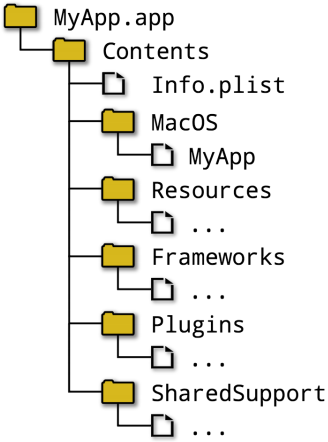
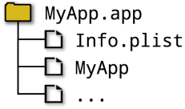
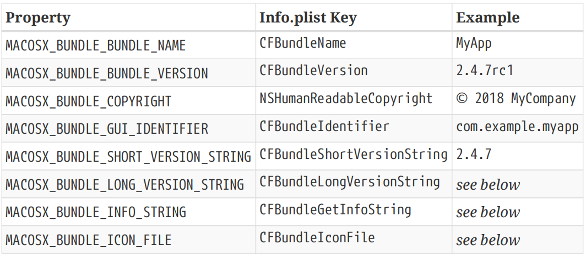
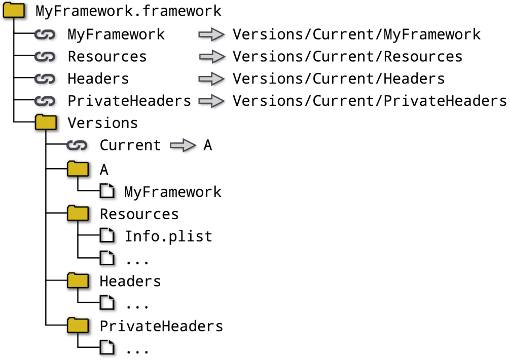
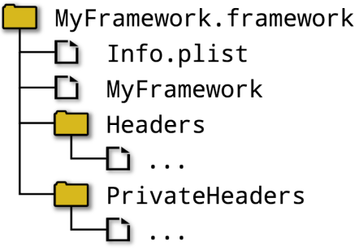
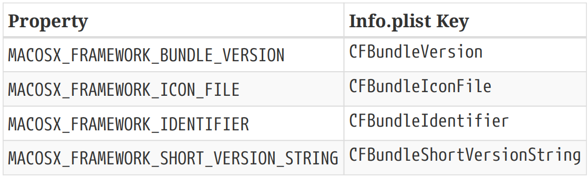
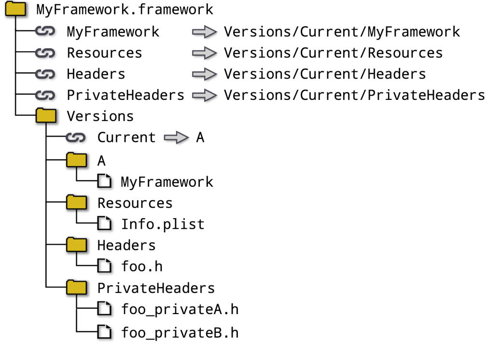
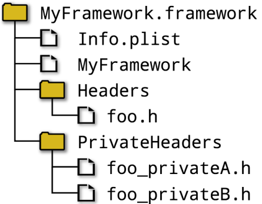

# Ch22. Apple Features

Apple platforms have a number of unique characteristics which directly affect the way software is built. While simple command-line applications for macOS can be built in similar ways to other Unix-based platforms, those applications with a graphical user interface are usually provided in an Apple-specific format known as an application bundle (or just app bundle). These bundles are more than a single executable file, they are a standardized directory structure containing a variety of files associated with the application. These app bundles are intended to be self-contained, able to be moved around as a unit and placed anywhere on a user’s file system.

苹果平台具有许多独特的特性，这些特性直接影响到软件的构建方式。虽然macOS的简单命令行应用程序可以以与其他基于Unix的平台类似的方式构建，但那些具有图形用户界面的应用程序通常以苹果特定的格式提供，称为应用程序包（或仅应用程序包）。这些捆绑包不仅仅是一个可执行文件，它们是一个标准化的目录结构，包含与应用程序相关的各种文件。这些应用程序包旨在实现自给自足，能够作为一个单元移动，并放置在用户文件系统的任何位置。

There is an analogous situation for libraries too. Standalone static and shared libraries can be created much like those on other Unix-based platforms, but they can also be built as part of a framework, which is essentially the library equivalent of an app bundle. Frameworks have their own standardized directory structure and may contain files other than just the library binaries. They may even support multiple versions within that directory structure. Libraries intended to be loaded at runtime can instead be built as a loadable bundle, which corresponds to Apple’s CFBundle functionality. 【翻译】图书馆也有类似的情况。独立的静态和共享库可以像其他基于Unix的平台上的库一样创建，但它们也可以作为框架的一部分构建，框架本质上相当于应用程序包的库。框架有自己的标准化目录结构，可能包含库二进制文件以外的文件。它们甚至可能支持该目录结构中的多个版本。打算在运行时加载的库可以构建为可加载的捆绑包，这与苹果的CFBundle功能相对应。

Bundles and frameworks are essential parts of the machinery used to produce content for Apple’s app store. Another key aspect is code signing, a process which verifies the integrity and origin of software and is a mandatory part of app store distribution. Code entitlements are also an integral part of the build process and govern which Apple features the code may use. These entitlements are part of the information sealed by the code signing process and must be defined at build time if the default entitlement set (which is empty) is not appropriate.【翻译】捆绑包和框架是用于为苹果应用商店制作内容的机器的重要组成部分。另一个关键方面是代码签名，这是一个验证软件完整性和来源的过程，是应用商店分发的强制性部分。代码权限也是构建过程中不可或缺的一部分，并决定了代码可以使用哪些Apple功能。这些权限是由代码签名过程密封的信息的一部分，如果默认权限集（为空）不合适，则必须在构建时定义。

Together, these features present unique challenges for CMake projects. The sections that follow provide the tools for understanding and handling these areas, or in some cases, highlight the current limitations of CMake’s support. It should also be noted that while CMake does formally support macOS and iOS, support for tvOS and watchOS should be considered incomplete.

【翻译】这些特性共同为CMake项目带来了独特的挑战。以下部分提供了理解和处理这些领域的工具，或者在某些情况下，突出了CMake支持的当前局限性。还应该注意的是，虽然CMake确实正式支持macOS和iOS，但对tvOS和watchOS的支持应该被认为是不完整的。

## 22.1. CMake Generator Selection

The technologies and tools used to produce frameworks and bundles is constantly evolving, with major Apple OS releases often introducing new features and changing the requirements around signing, distribution, etc. The processes and technologies are tightly integrated into Xcode as the primary tool Apple expects developers to use, with developers also typically expected to upgrade to the current Xcode release rather than staying with past major releases. Areas like resource compilation, code signing, etc. are automatically handled as part of building applications and frameworks, many aspects of which are unique to the Apple ecosystem. 【翻译】用于生成框架和捆绑包的技术和工具不断发展，主要的苹果操作系统版本经常引入新功能，并改变签名、分发等方面的要求。这些流程和技术被紧密地集成到Xcode中，作为苹果公司希望开发人员使用的主要工具，开发人员通常也希望升级到当前的Xcode版本，而不是继续使用过去的主要版本。资源编译、代码签名等领域是作为构建应用程序和框架的一部分自动处理的，其中许多方面是苹果生态系统独有的。

For CMake projects, this means that the Xcode generator is the most reliable and most convenient for building with the Xcode toolchain. Other generators such as Makefiles or Ninja tend to lack some of the automation of the Xcode generator, or they may lag behind implementing support for some of the more recent Xcode features. With the exception of basic unsigned desktop applications not intended for distribution through the app store, developers will be more or less required to use the Xcode generator to get a build that supports the necessary features. Also note that the fastmoving nature of Apple platforms means that developers will also generally want to be using a fairly recent CMake release to keep up with the changes.

对于CMake项目，这意味着Xcode生成器是使用Xcode工具链构建最可靠、最方便的。其他生成器，如Makefiles或Ninja，往往缺乏Xcode生成器的一些自动化，或者它们可能落后于实现对一些较新Xcode功能的支持。除了不打算通过应用商店分发的基本未签名桌面应用程序外，开发人员或多或少都需要使用Xcode生成器来获得支持必要功能的构建。还要注意的是，苹果平台的快速发展意味着开发人员通常也希望使用相当新的CMake版本来跟上变化。

One of the unique benefits of the Xcode generator is that it supports setting arbitrary Xcode project attributes. Most project settings can be modified in a key-value fashion on a per-target basis using target properties of the form XCODE_ATTRIBUTE_XXX, where XXX is the name of an Xcode property. These names are defined in the Apple documentation, but a potentially more convenient way to find them is to open an existing Xcode project, go to the build settings of a target and click on a build setting of interest. The Quick Help assistant editor shows the setting name along with a description. Defaults for all targets can be set by corresponding CMAKE_XCODE_ATTRIBUTE_XXX variables, which will be used to initialize the corresponding target property when the target is defined. An example which demonstrates setting some of the more commonly used attributes might look like this: 【翻译】Xcode生成器的独特优势之一是它支持设置任意的Xcode项目属性。大多数项目设置都可以使用XCODE_ATTRIBUTE_XXX格式的目标属性以键值方式在每个目标的基础上进行修改，其中XXX是XCODE属性的名称。这些名称在Apple文档中定义，但找到它们的一种可能更方便的方法是打开现有的Xcode项目，转到目标的构建设置，然后单击感兴趣的构建设置。快速帮助助手编辑器显示设置名称和描述。所有目标的默认值都可以通过相应的CMAKE_XCODE_ATTRIBUTE_XXX变量设置，这些变量将在定义目标时用于初始化相应的目标属性。一个演示设置一些更常用属性的示例可能如下：

\#------------------------------------------------------\>\>\>\>\>\>

\# Set the default signing identity and team ID to use for all targets

set(CMAKE_XCODE_ATTRIBUTE_CODE_SIGN_IDENTITY "iPhone Developer"

set(CMAKE_XCODE_ATTRIBUTE_DEVELOPMENT_TEAM XYZ123ABCD)

\# Some target-specific settings

set_target_properties(myiOSApp PROPERTIES

XCODE_ATTRIBUTE_TARGETED_DEVICE_FAMILY 1,2

XCODE_ATTRIBUTE_IPHONEOS_DEPLOYMENT_TARGET 10.0

)

\#------------------------------------------------------\<\<\<\<\<\<

This feature can also be used to set an Xcode attribute for only one particular build type by appending \[variant=ConfigName\] to the property name. Other suffix types can be appended to the property name too for even more specific attribute settings, but their use would be unusual. Even \[variant=…\] suffixes would not often be needed. The following example gives an idea of the sort of use cases where this feature might be useful: 【翻译】此功能还可以通过在属性名后附加\[variant=ConfigName\]来仅为一种特定的构建类型设置Xcode属性。对于更具体的属性设置，其他后缀类型也可以附加到属性名称上，但它们的使用并不常见。即使是\[变体=…\]后缀也不经常需要。以下示例给出了此功能可能有用的用例类型：

\`\`\`cmake

set_target_properties(myiOSApp PROPERTIES

XCODE_ATTRIBUTE_GCC_UNROLL_LOOPS\[variant=Release\] YES

XCODE_ATTRIBUTE_ENABLE_TESTABILITY\[variant=Debug\] YES

)

\`\`\`

Some projects may require setting quite a few attributes in order to get the desired Xcode behavior and features, whereas other projects may be quite simple and require only a minimal number of additional settings. Some attributes are only needed in very specific circumstances, whereas others are so common they are (or should be) present in almost every Apple-focused project. A number of these are discussed in the rest of this chapter, including some of those used in the above examples.

有些项目可能需要设置相当多的属性才能获得所需的Xcode行为和功能，而其他项目可能非常简单，只需要很少的额外设置。有些属性只有在非常特殊的情况下才需要，而另一些属性则非常常见，它们几乎存在于（或应该存在于）每个以苹果为重点的项目中。本章其余部分将讨论其中的一些，包括上述示例中使用的一些。

## 22.2. Application Bundles

The structure of an application bundle for macOS is different to that for iOS, tvOS and watchOS. The macOS structure separates out various categories of files into different subdirectories and looks something like the following (applications might have only some of the subdirectories shown): 【翻译】macOS的应用程序包结构与iOS、tvOS和watchOS不同。macOS结构将各种类别的文件分为不同的子目录，看起来如下（应用程序可能只显示了一些子目录）：

In contrast, the bundle structure for iOS, tvOS and watchOS is flattened, having very little in the way of a defined structure: 【翻译】相比之下，iOS、tvOS和watchOS的捆绑结构是扁平的，几乎没有定义的结构：

When building an app bundle, CMake somewhat abstracts away these structural differences, allowing at least some things to be handled the same way whether the bundle is being built for macOS or for iOS, tvOS or watchOS. Developers should be aware, however, that some areas of that abstraction have not been implemented correctly until very recent CMake releases (the handling of resources being a specific example), so using the latest CMake release is strongly advised. 【翻译】在构建应用程序包时，CMake在一定程度上抽象了这些结构差异，允许至少以相同的方式处理某些事情，无论该包是为macOS还是iOS、tvOS或watchOS构建的。然而，开发人员应该意识到，直到最近的CMake版本（资源处理是一个具体的例子），该抽象的某些领域才得到正确实现，因此强烈建议使用最新的CMake发行版。

An application is identified as being a bundle by adding the MACOSX_BUNDLE keyword to add_executable(): 【翻译】通过将MACOSX_bundle关键字添加到add_executable（）中，将应用程序标识为捆绑包：

\`\`\`cmake

add_executable(myApp MACOSX_BUNDLE ...)

\`\`\`

This sets the MACOSX_BUNDLE target property to TRUE, which non-Apple platforms simply ignore. A project can alternatively set the CMAKE_MACOSX_BUNDLE variable to TRUE and all subsequently defined executable targets have their MACOSX_BUNDLE target property set as well, but it would be more common and arguably clearer to use the MACOSX_BUNDLE keyword with each add_executable() command instead (projects typically define only a small number of application bundles, often only one). 【翻译】这会将MACOSX_BUNDLE目标属性设置为TRUE，而非Apple平台则会忽略该属性。项目也可以将CMAKE_MACOSX_BUNDLE变量设置为TRUE，随后定义的所有可执行目标也都设置了它们的MACOSX_BUNDRE目标属性，但更常见的做法是在每个addexecutable（）命令中使用MACOSX\_ BUNDLE关键字（项目通常只定义少量应用程序包，通常只有一个），这可能更清楚。

Somewhat confusingly, MACOSX_BUNDLE applies not just to macOS, but also to iOS, tvOS and watchOS. The keyword predates the non-desktop Apple platforms, hence the desktop-specific name. Rather than creating new keywords for each of the other platforms, the use of the existing keyword was expanded to cover all of the Apple platforms. This same pattern of expanding OSX-specific keywords and variables to cover all the Apple platforms can be seen in a number of other cases as well, but note that this is not universal across all OSX-related variables and properties. Those for which this holds true are highlighted in this chapter.

有点令人困惑的是，MACOSX_BUNDLE不仅适用于macOS，也适用于iOS、tvOS和watchOS。该关键字早于非桌面苹果平台，因此是桌面特定的名称。与其为其他每个平台创建新的关键字，不如将现有关键字的使用范围扩展到所有苹果平台。在许多其他情况下也可以看到这种扩展OSX特定关键字和变量以覆盖所有Apple平台的相同模式，但请注意，这并不适用于所有与OSX相关的变量和属性。本章重点介绍了这一点。

Every application bundle must have at least an Info.plist file and a main executable (MyApp in the directory structure examples above). By default, CMake will provide a basic Info.plist file from a template file shipped with CMake itself. In most cases, however, projects will want to provide their own Info.plist so that they have full control over the app configuration. When the app uses storyboard or interface builder files, providing a custom Info.plist is pretty much required so that the relevant key entries like NSMainStoryboardFile are present. The MACOSX_BUNDLE_INFO_PLIST target property can be set to the name of a file to use as the Info.plist template (for all Apple platforms, not just macOS). The default template file is called MacOSXBundleInfo.plist.in and can be found in CMake’s modules directory. It may serve as a useful starting point for custom templates. 【翻译】每个应用程序包必须至少有一个Info.plist文件和一个主可执行文件（上面目录结构示例中的MyApp）。默认情况下，CMake将从CMake本身附带的模板文件中提供一个基本的Info.plist文件。然而，在大多数情况下，项目会希望提供自己的Info.plist，以便完全控制应用程序配置。当应用程序使用故事板或界面构建器文件时，几乎需要提供自定义的Info.plist，以便出现相关的关键条目，如NSMainStoryboardFile。MACOSX_BUNDLE_INFO_PLIST目标属性可以设置为用作INFO.PLIST模板的文件名（适用于所有Apple平台，而不仅仅是macOS）。默认模板文件名为MacOSXBundleInfo.plist.in，可以在CMake的模块目录中找到。它可以作为自定义模板的有用起点。

Regardless of whether a target uses the default Info.plist template or one provided by the project, CMake will copy the template file into the app bundle, performing some specific substitutions along the way. In the template file, any content of the form \${XXX} will be substituted by the value of the XXX target property if XXX is one of the properties in the table below. Each of these properties is mapped to a particular key in the default Info.plist file, so if the project provides its own template file and uses these variables, it should generally follow the same mapping.

无论目标是使用默认的Info.plist模板还是项目提供的模板，CMake都会将模板文件复制到应用程序包中，并在此过程中执行一些特定的替换。在模板文件中，如果XXX是下表中的属性之一，则表单\${XXX}的任何内容都将被XXX目标属性的值替换。这些属性中的每一个都映射到默认Info.plist文件中的特定键，因此，如果项目提供自己的模板文件并使用这些变量，则通常应遵循相同的映射。

Apple no longer documents CFBundleLongVersionString as one of the Info.plist keys, so projects may choose to not provide it. Their documentation also states that NSHumanReadableCopyright has replaced CFBundleGetInfoString and that CFBundleIconFile is deprecated and recommends using CFBundleIconFiles or CFBundleIcons instead. CFBundleIconFile is still honored if neither of the other alternatives is set. 【翻译】Apple不再将CFBundleLongVersionString记录为Info.plist键之一，因此项目可能会选择不提供它。他们的文档还指出，NSHumanReadableCopyright已取代CFBundleGetInfoString，CFBundleIconFile已被弃用，并建议使用CFBundleIconFiles或CFBundleIcons。如果其他选项均未设置，CFBundleIconFile仍将受到尊重。

If multiple app targets are being defined, a project may set variables with exactly the same names as the properties in the above table and the variables will be used to initialize the target properties. Note that this differs from the usual CMake convention of variables having a CMAKE\_… prefix before the target property they act as defaults for. 【翻译】如果定义了多个应用程序目标，项目可能会设置与上表中的属性名称完全相同的变量，这些变量将用于初始化目标属性。请注意，这与CMake通常的约定不同，即变量在作为默认值的目标属性之前具有CMake\_…前缀。

When a project provides its own Info.plist template file, it is not required to make any use of the above target properties. It is perfectly valid to hard-code values instead. Note, however, that CFBundleVersion and CFBundleShortVersionString may need to be derived from version details specified within the CMakeLists.txt files, so setting these via MACOSX_BUNDLE_BUNDLE_VERSION and MACOSX_BUNDLE_SHORT_VERSION_STRING substitutions may still be the most convenient approach. The Apple requirements around the version numbers have evolved over time, with the major.minor.patch format now essentially mandated (with some exceptions). The following shows one potential mapping to provide version numbers that meet Apple’s requirements: 【翻译】当项目提供自己的Info.plist模板文件时，不需要使用上述目标属性。将值硬编码是完全有效的。但是请注意，CFBundleVersion和CFBundleShortVersionString可能需要从CMakeLists.txt文件中指定的版本详细信息中派生出来，因此通过MACOSX_BUNDLE_BUNDLE_version和MACOSX_BONDLE_SHORT_version_STRING替换来设置它们可能仍然是最方便的方法。苹果对版本号的要求随着时间的推移而演变，现在基本上强制使用major.minor.patch格式（有一些例外）。以下显示了一个潜在的映射，以提供符合苹果要求的版本号：

\#-------------------------------------------------\>\>\>\>\>\>

add_executable(myApp MACOSX_BUNDLE ...)

set_target_properties(myApp PROPERTIES

MACOSX_BUNDLE_BUNDLE_VERSION "\${PROJECT_VERSION}\${BUILD_SUFFIX}"

MACOSX_BUNDLE_SHORT_VERSION_STRING "\${PROJECT_VERSION}"

)

\#-------------------------------------------------\<\<\<\<\<\<

In the above, BUILD_SUFFIX would be an empty string for final releases, or it could be one or more letters followed by a number in the range 1-255. Example suffixes might be a17 for an alpha release or rc2 for the second release candidate and so on. An example of an Info.plist file that uses these properties is included further below.

在上面，BUILD_SFFIX对于最终版本来说是一个空字符串，或者它可以是一个或多个字母，后面跟着一个1-255范围内的数字。示例后缀可能是a17（表示alpha版本）或rc2（表示第二个候选版本），以此类推。下面进一步包括使用这些属性的Info.plist文件的示例。

With an appropriate Info.plist file defined, attention can be turned to the source files to be compiled and linked into the bundle. In addition to the usual C/C++ sources, Apple platforms also support Objective C/C++ source files. These typically have a .m or .mm file suffix and can be listed as sources in add_executable() and target_sources() commands just like ordinary C/C++ files (see Section 28.5, “Defining Targets” for more on defining target sources). Most of CMake’s generators will recognize these file suffixes and compile the files appropriately, not just the Xcode generator.

定义了适当的Info.plist文件后，可以将注意力转向要编译并链接到捆绑包中的源文件。除了常见的C/C++源代码外，Apple平台还支持Objective C/C++源文件。这些文件通常有.m或.mm文件后缀，可以在add_executable（）和target_sources（）命令中作为源列出，就像普通的C/C++文件一样（有关定义目标源的更多信息，请参阅第28.5节“定义目标”）。大多数CMake生成器都能识别这些文件后缀并正确编译文件，而不仅仅是Xcode生成器。

Another group of source files unique to Apple platforms are those used to define the user interface. Storyboard or interface builder files are like sources, but they require some additional handling to compile them as resources and put the compiled result in the appropriate place in the app bundle. Only the Xcode generator implements this automatic compilation and copying to the appropriate location, so the use of Makefile or Ninja generators is generally not recommended when an app bundle has these files. Storyboard and interface builder sources need to be listed as sources in add_executable() or target_sources(). To get them to be automatically compiled and copied to the appropriate location in the bundle, they also need to be listed in the RESOURCE target property. For example:

苹果平台独有的另一组源文件是用于定义用户界面的文件。故事板或界面构建器文件类似于源代码，但它们需要一些额外的处理才能将其编译为资源，并将编译后的结果放在应用程序包中的适当位置。只有Xcode生成器实现了这种自动编译并将其复制到适当的位置，因此当应用程序包中有这些文件时，通常不建议使用Makefile或Ninja生成器。故事板和界面构建器源需要在add_executable（）或target_source（）中作为源列出。为了使它们自动编译并复制到包中的适当位置，还需要在RESOURCE target属性中列出它们。例如：

\#------------------------------------\>\>\>\>\>\>

set(uiFiles

Base.lproj/Main.storyboard

Base.lproj/LaunchScreen.storyboard

)

add_executable(MyApp MACOSX_BUNDLE

AppDelegate.m

AppDelegate.h

ViewController.m

ViewController.h

main.m

\${uiFiles}

)

set_target_properties(MyApp PROPERTIES

RESOURCE "\${uiFiles}"

MACOSX_BUNDLE_INFO_PLIST "\${CMAKE_CURRENT_SOURCE_DIR}/Info.plist"

)

\#------------------------------------\<\<\<\<\<\<

Note the way the interface builder files are handled using the uiFiles variable. The value of this variable is used unquoted in the list of sources given to add_executable(). This makes the interface builder files appear as just another few items in the source file list. The RESOURCE target property, on the other hand, holds a single value and that value is expected to be a semicolon-separated list. Therefore, the RESOURCE property requires the value of the uiFiles variable to be quoted, whereas the add_executable() call requires that it not be quoted.

请注意使用uiFiles变量处理界面构建器文件的方式。此变量的值在给定给add_executable（）的源列表中未加引号地使用。这使得界面构建器文件在源文件列表中显示为另外几个项目。另一方面，RESOURCE目标属性包含一个值，该值应为分号分隔的列表。因此，RESOURCE属性要求引用uiFiles变量的值，而add_executable（）调用要求不引用它。

In the above example, the Info.plist file would contain one of the keys NSMainStoryboardFile, NSMainNibFile or UIMainStoryboardFile (see the Apple documentation for details on the meaning and appropriate use of these keys). Such an entry tells the operating system which UI element to use when launching the app. A simple Info.plist for the above might look something like this:

在上述示例中，Info.plist文件将包含其中一个键NSMainStoryboardFile、NSMainNibFile或UIMainStoryboaldFile（有关这些键的含义和适当使用的详细信息，请参阅Apple文档）。这样的条目告诉操作系统在启动应用程序时要使用哪个UI元素。上面的一个简单的Info.plist可能看起来像这样：

\<?xml version="1.0" encoding="UTF-8"?\>

\<!DOCTYPE plist PUBLIC "-//Apple//DTD PLIST 1.0//EN"

"http://www.apple.com/DTDs/PropertyList-1.0.dtd"\>

\<plist version="1.0"\>

\<dict\>

\<key\>CFBundleDevelopmentRegion\</key\>

\<string\>en\</string\>

\<key\>CFBundleExecutable\</key\>

\<string\>\$(EXECUTABLE_NAME)\</string\>

\<key\>CFBundleIconFile\</key\>

\<string\>\${MACOSX_BUNDLE_ICON_FILE}\</string\>

\<key\>CFBundleIdentifier\</key\>

\<string\>\${MACOSX_BUNDLE_GUI_IDENTIFIER}\</string\>

\<key\>CFBundleInfoDictionaryVersion\</key\>

\<string\>6.0\</string\>

\<key\>CFBundleName\</key\>

\<string\>\${MACOSX_BUNDLE_BUNDLE_NAME}\</string\>

\<key\>CFBundlePackageType\</key\>

\<string\>APPL\</string\>

\<key\>CFBundleShortVersionString\</key\>

\<string\>\${MACOSX_BUNDLE_SHORT_VERSION_STRING}\</string\>

\<key\>CFBundleVersion\</key\>

\<string\>\${MACOSX_BUNDLE_BUNDLE_VERSION}\</string\>

\<key\>LSMinimumSystemVersion\</key\>

\<string\>\$(MACOSX_DEPLOYMENT_TARGET)\</string\>

\<key\>NSHumanReadableCopyright\</key\>

\<string\>\${MACOSX_BUNDLE_COPYRIGHT}\</string\>

\<key\>NSMainStoryboardFile\</key\>

\<string\>Main\</string\>

\<key\>NSPrincipalClass\</key\>

\<string\>NSApplication\</string\>

\</dict\>

\</plist\>

The NSMainStoryboardFile field has the value Main, which specifies that the Base.lproj/Main.storyboard UI will be used when the app starts. Note also how some field values are provided as CMake variables using the \${} syntax, but the CFBundleExecutable and LSMinimumSystemVersion are provided using Xcode variable substitution syntax \$() instead. These two fields will be populated by Xcode itself based on other information provided in the project file and the scheme being built. The value for LSMinimumSystemVersion will be derived from the CMAKE_OSX_DEPLOYMENT_TARGET variable in the case of a macOS app, or from the XCODE_ATTRIBUTE_IPHONEOS_DEPLOYMENT_TARGET target property for iOS (but note that CMake 3.11 and later can use CMAKE_OSX_DEPLOYMENT_TARGET for all platforms, see discussion in Section 22.5, “Build Settings” further below). Projects can instead hard-code a value directly in the Info.plist file, if that is more convenient. 【翻译】NSMainStoryboardFile字段的值为Main，指定应用程序启动时将使用Base.lproj/Main.storybard UI。还要注意，一些字段值是如何使用\${}语法作为CMake变量提供的，但CFBundleExecutable和LSMinimumSystemVersion是使用Xcode变量替换语法\$（）提供的。这两个字段将由Xcode本身根据项目文件和正在构建的方案中提供的其他信息填充。LSMinimumSystemVersion的值将在macOS应用程序的情况下从CMAKE_OSX_DEPLOYMENT_TARGET变量中导出，或在iOS上从XCODE_ATTRIBUTE_IPHONEOS_DEPLOYMENT_TARGET目标属性中导出（但请注意，CMAKE 3.11及更高版本可以在所有平台上使用CMAKE_OSX \_DEPLOYMET_TARGET，请参阅下文第22.5节“构建设置”中的讨论）。如果更方便的话，项目可以直接在Info.plist文件中硬编码一个值。

For files that need to be included in the application bundle but which are not resources in the usual sense, a different mechanism is available. Such files must still be listed as sources for the target, but instead of including them in the RESOURCE target property, each of the sources has its MACOSX_PACKAGE_LOCATION source property set to the location it should be copied to in the bundle. These paths are expected to be relative to the top of the bundle contents. This can be used to copy files to non-resource locations or to have full control over the target directory of resource files that do not need to be compiled. It is also possible to list a directory as a source and to set its MACOSX_PACKAGE_LOCATION to copy the directory and its contents into the bundle, but it is not documented whether this is formally supported by CMake (directories cannot normally be listed as sources). Some examples help demonstrate these behaviors.

对于需要包含在应用程序包中但不是通常意义上的资源的文件，可以使用不同的机制。此类文件仍必须列为目标的源，但每个源都将其MACOSX_PACKAGE_LOCATION源属性设置为应在捆绑包中复制到的位置，而不是将其包含在RESOURCE目标属性中。这些路径预计与捆绑包内容的顶部有关。这可用于将文件复制到非资源位置，或完全控制不需要编译的资源文件的目标目录。也可以将目录列为源，并设置其MACOSX_PACKAGE_LOCATION以将目录及其内容复制到捆绑包中，但没有记录CMake是否正式支持这一点（目录通常不能列为源）。一些例子有助于证明这些行为。

\#------------------------------------\>\>\>\>\>\>

add_executable(MyApp MACOSX_BUNDLE

AppDelegate.m

AppDelegate.h

ViewController.m

ViewController.h

main.m

sharedConfig.xml

nestedResource.dat

someDir \# Directory, CMake may not formally support this

)

set_source_files_properties(sharedConfig.xml PROPERTIES

MACOSX_PACKAGE_LOCATION SharedSupport/config

)

set_source_files_properties(nestedResource.dat PROPERTIES

MACOSX_PACKAGE_LOCATION Resources/private/other

)

\# Works, but might not be formally supported

set_source_files_properties(someDir PROPERTIES

MACOSX_PACKAGE_LOCATION Resources/lotsOfThings

)

\#------------------------------------\<\<\<\<\<\<

A special case applies when setting the MACOSX_PACKAGE_LOCATION to a path starting with Resources and the target is being built for iOS. Because iOS app bundles use a flattened structure, CMake will strip off the Resources part of the path. Prior to CMake 3.9, this behavior was implemented incorrectly and it was not always possible to get a file into the desired location.

当将MACOSX_PACKAGE_LOCATION设置为以Resources开头的路径并且正在为iOS构建目标时，会出现一种特殊情况。由于iOS应用程序包使用扁平结构，CMake将剥离路径中的资源部分。在CMake 3.9之前，此行为实现不正确，并不总是能够将文件放入所需的位置。

## 22.3. Frameworks

Frameworks share some similarities with application bundles, but they also have a number of unique features. A framework contains a main library, but unlike an application bundle, on macOS there may be multiple versions of the library. In addition to the usual resources, frameworks also support headers and in the case of macOS, both the resources and headers are version-specific. A typical example of the macOS framework structure looks something like this.

框架与应用程序包有一些相似之处，但它们也有许多独特的功能。框架包含一个主库，但与应用程序包不同，在macOS上可能有多个版本的库。除了常见的资源外，框架还支持头文件，在macOS的情况下，资源和头文件都是特定于版本的。macOS框架结构的一个典型示例如下。

The top level of the framework always has a name that ends with .framework and typically the only non-symlinked contents in that top level directory is the Versions subdirectory (umbrella frameworks being the exception, but those are outside the scope of framework support being considered here). Everything else at that level is usually a symlink to something in the current version’s subdirectory.

框架的顶层总是有一个以.framework结尾的名称，通常该顶层目录中唯一的非符号链接内容是Versions子目录（伞形框架是例外，但这些框架不在这里考虑的框架支持范围内）。该级别的其他所有内容通常都是指向当前版本子目录中某些内容的符号链接。

Within the Versions directory, each version of the library gets its own subdirectory whose name is the version. In most cases, these directory names are just A, B, etc. Use of numeric versions is another common convention, which aligns more closely with how shared libraries are versioned on other platforms. Regardless of the style of versioning, a symlink called Current points to the most recent version and it acts like a default version for the framework. Each version is expected to have a Resources directory that contains at least an Info.plist file, which provides configuration details about that particular version (discussed further below). There will also be a library (which is usually a shared library, but it can be static) and often Headers and potentially PrivateHeaders subdirectories as well.

在Versions目录中，库的每个版本都有自己的子目录，其名称就是版本。在大多数情况下，这些目录名只是A、B等。使用数字版本是另一种常见的约定，它与其他平台上共享库的版本控制方式更为一致。无论版本控制的风格如何，一个名为Current的符号链接都指向最新版本，它就像框架的默认版本一样。每个版本都应该有一个Resources目录，其中至少包含一个Info.plist文件，该文件提供了有关该特定版本的配置详细信息（下面将进一步讨论）。还有一个库（通常是共享库，但也可以是静态的），通常还有Header和潜在的PrivateHeaders子目录。

In comparison, the structure on iOS, tvOS and watchOS is flattened and does not typically support versions:【翻译】相比之下，iOS、tvOS和watchOS的结构是扁平的，通常不支持版本：

CMake supports the creation of frameworks (single-version only in the case of macOS) and it provides features for handling the version details. There is also support for Info.plist files which follows a similar approach to that used for application bundles. The first step is to define a library in the usual way and then mark it as a framework by setting the FRAMEWORK target property. Most frameworks are defined as shared libraries, but as of CMake 3.8, static libraries can also be built as frameworks. The FRAMEWORK target property is ignored on non-Apple platforms. For macOS only, the framework version can be specified using the FRAMEWORK_VERSION target property, or if omitted a default version of A will be set. Non-macOS Apple platforms will ignore the FRAMEWORK_VERSION property if it is set, producing the same flattened, unversioned framework structure produced by Xcode when it creates frameworks for these platforms.

【译】CMake支持创建框架（仅适用于macOS的单一版本），并提供处理版本详细信息的功能。还支持Info.plist文件，它遵循与应用程序包类似的方法。第一步是以通常的方式定义一个库，然后通过设置framework目标属性将其标记为框架。大多数框架都被定义为共享库，但从CMake 3.8开始，静态库也可以构建为框架。FRAMEWORK目标属性在非Apple平台上被忽略。仅适用于macOS，可以使用FRAMEWORK_VERSION目标属性指定框架版本，如果省略，则将设置默认版本的a。如果设置了FRAMEWORK_VERSION属性，非macOS Apple平台将忽略该属性，从而在为这些平台创建框架时产生与Xcode相同的扁平、未版本化的框架结构。

\#------------------------------------\>\>\>\>\>\>

add_library(MyFramework SHARED foo.cpp)

set_target_properties(MyFramework PROPERTIES

> FRAMEWORK TRUE
>
> FRAMEWORK_VERSION 5

)

\#------------------------------------\<\<\<\<\<\<

The Info.plist file template is specified in the same way as for application bundles, except the target property is called MACOSX_FRAMEWORK_INFO_PLIST (this is supported for all Apple platforms, not just macOS):【翻译】Info.plist文件模板的指定方式与应用程序包相同，除了目标属性称为MACOSX_FRAMEWORK_INFO_PLIST（这适用于所有Apple平台，而不仅仅是macOS）：

\`\`\`cmake

set_target_properties(MyFramework PROPERTIES

MACOSX_FRAMEWORK_INFO_PLIST "\${CMAKE_CURRENT_SOURCE_DIR}/Info.plist"

)

\`\`\`

As for application bundles, if a framework Info.plist file is not explicitly provided, a default one is automatically generated. Whether the project provides its own Info.plist or it relies on the default, CMake will perform a similar substitution as for application bundles when copying it into the framework. The following target properties will be substituted where the Info.plist file refers to them (the expected associated key name in the Info.plist file is also listed):

对于应用程序包，如果没有明确提供框架Info.plist文件，则会自动生成默认文件。无论项目是提供自己的Info.plist还是依赖于默认值，当将其复制到框架中时，CMake都会执行与应用程序包类似的替换。以下目标属性将在Info.plist文件引用它们的地方被替换（Info.plist文件中预期的关联键名也会列出）：

Unlike for application bundles, the default framework Info.plist file is likely to be sufficient in many cases, so the project can usually just set the above four target properties and let CMake provide an appropriate Info.plist file.

与应用程序包不同，在许多情况下，默认的框架Info.plist文件可能就足够了，因此项目通常只需设置上述四个目标属性，并让CMake提供一个适当的Info.plist文件。

Frameworks often contain the headers associated with the framework’s library. This allows the framework to be treated as a self-contained bundle which other software can build against. Framework headers are separated into public and private groups, with only public headers intended to be directly included or imported by consuming projects. The private headers are usually needed as internal implementation details by the public headers and frameworks often do not include any private headers at all. CMake supports specifying the set of public and private headers with the PUBLIC_HEADER and PRIVATE_HEADER target properties respectively. Both properties contain a list of header files and all files mentioned must also be explicitly listed as sources for the target. Files listed in PUBLIC_HEADER will be copied into the framework’s Headers directory with paths stripped, while files listed in PRIVATE_HEADER will be copied into the PrivateHeaders directory, again with any paths stripped. If paths need to be preserved, these target properties cannot be used and the headers have to be added using techniques such as via MACOSX_PACKAGE_LOCATION as described in the previous section for arbitrary resources.

框架通常包含与框架库关联的头文件。这允许将框架视为一个自包含的捆绑包，其他软件可以据此构建。框架标头分为公共组和私有组，只有公共标头可以由消费项目直接包含或导入。通常需要私有头作为公共头的内部实现细节，而框架通常根本不包含任何私有头。CMake支持分别使用public_HEADER和private_HEADER目标属性指定公共和私有标头集。这两个属性都包含一个头文件列表，所有提到的文件也必须明确列为目标的源。PUBLIC_HEADER中列出的文件将被复制到框架的Headers目录中，并删除路径，而PRIVATE_HEADER中列出的档案将被复制至PrivateHeaders目录，并删除所有路径。如果需要保留路径，则不能使用这些目标属性，并且必须使用诸如通过MACOSX_PACKAGE_LOCATION之类的技术添加标头，如前一节中针对任意资源所述。

\#------------------------------------\>\>\>\>\>\>

add_library(MyFramework SHARED

foo.cpp

foo.h

foo_privateA.h

nested/foo_privateB.h

)

set_target_properties(MyFramework PROPERTIES

FRAMEWORK TRUE

PUBLIC_HEADER foo.h

PRIVATE_HEADER "foo_privateA.h;nested/foo_privateB.h"

)

\#------------------------------------\<\<\<\<\<\<

The above example would result in the following structure on macOS:

上面的示例将在macOS上产生以下结构：

The same example on iOS would result in a more flattened structure:

【翻译】iOS上的相同示例将导致更扁平的结构：

Note that the PUBLIC_HEADER and PRIVATE_HEADER target properties are also used when installing targets on non-Apple platforms. This is covered in more detail in Section 25.2.3, “Apple-specific Targets”.

请注意，在非Apple平台上安装目标时，也会使用PUBLIC_HEADER和PRIVATE_HEADER目标属性。第25.2.3节“苹果特定目标”对此进行了更详细的介绍。

## 22.4. Loadable Bundles

In addition to application bundles and frameworks, Apple also supports loadable bundles for macOS. These are often used as plugins or to provide optional features which might or might not be supported at run time. The structure of a loadable bundle is the same as that of an application bundle, but the top level directory usually has the extension .bundle or .plugin (any extension is technically permitted). CMake supports the creation of loadable bundles through the MODULE library type and the BUNDLE target property. By default, loadable bundles will be given the extension bundle, but this can be overridden with the BUNDLE_EXTENSION target property.

除了应用程序包和框架之外，Apple还支持macOS的可加载包。这些通常用作插件或提供在运行时可能支持也可能不支持的可选功能。可加载包的结构与应用程序包的结构相同，但顶层目录通常具有.bundle或.plugin扩展名（技术上允许任何扩展名）。CMake支持通过MODULE库类型和BUNDLE目标属性创建可加载包。默认情况下，可加载包将被赋予扩展包，但这可以用bundle_extension目标属性覆盖。

\#------------------------------------\>\>\>\>\>\>

add_library(MyBundle MODULE ...)

set_target_properties(MyBundle PROPERTIES

BUNDLE TRUE

BUNDLE_EXTENSION plugin

)

\#------------------------------------\<\<\<\<\<\<

All of the target properties relating to application bundles can also be used for loadable bundles.【翻译】与应用程序包相关的所有目标属性也可用于可加载包。

## 22.5. Build Settings

When building a project for Apple platforms, a number of properties work together to define what platform to build for and to specify minimum platform version requirements. Unlike other CMake generator types, the Xcode generator allows a number of these to be specified at build time by the developer rather than being known at configure time, a characteristic which can be one of the more difficult aspects to handle correctly for both new and experienced CMake users alike. 【翻译】在为苹果平台构建项目时，多个属性协同工作，以定义要构建的平台并指定最低平台版本要求。与其他CMake生成器类型不同，Xcode生成器允许开发人员在构建时指定其中的许多类型，而不是在配置时知道，对于新手和有经验的CMake用户来说，这一特性可能是更难正确处理的方面之一。

For single configuration generators, the target device is known exactly at configure time, but for Xcode, some platforms support both the device and device simulators. Furthermore, some of these devices have multiple architectures. In the case of iOS, this can mean up to five different target platform combinations. Different versions of Xcode also come with different versions of the iOS SDK and some developers may even carry forward older SDKs to newer Xcode versions and switch between them. In order to allow developers to switch between different device targets and SDKs at build time, CMake projects must be careful to not over-specify or incorrectly specify these details. 【翻译】对于单配置生成器，目标设备在配置时是完全已知的，但对于Xcode，一些平台同时支持设备和设备模拟器。此外，其中一些设备具有多种架构。就iOS而言，这可能意味着多达五种不同的目标平台组合。不同版本的Xcode还附带了不同版本的iOS SDK，一些开发人员甚至可能将旧的SDK转发到较新的Xcode版本并在它们之间切换。为了允许开发人员在构建时在不同的设备目标和SDK之间切换，CMake项目必须小心，不要过度指定或错误指定这些细节。

The selection of the SDK for iOS, tvOS and watchOS is one area where many online examples exhibit considerable complexity and often result in locking the developer out of the ability to switch between device and simulator builds without re-running CMake. With recent versions of CMake and Xcode, however, specifying the SDK should be a very trivial step, as simple as setting the CMAKE_OSX_SYSROOT variable to one of iphoneos, appletvos or watchos. Xcode will then choose the latest SDK for that platform and it will allow switching between device and simulator builds without having to re-run CMake. Furthermore, Xcode will automatically populate the set of supported architectures based on the chosen SDK, so the project shouldn’t need to add any extra logic for specifying architectures. This gives the developer the most control over what they want to build without having to re-run CMake. The available SDKs can be obtained by running the following command:【翻译】为iOS、tvOS和watchOS选择SDK是许多在线示例表现出相当复杂性的一个领域，这通常会导致开发人员无法在不重新运行CMake的情况下在设备和模拟器构建之间切换。然而，对于最新版本的CMake和Xcode，指定SDK应该是一个非常简单的步骤，就像将CMake_OSX_SYSROOT变量设置为iphoneos、appletvos或watchos之一一样简单。Xcode将为该平台选择最新的SDK，它将允许在设备和模拟器构建之间切换，而无需重新运行CMake。此外，Xcode将根据所选的SDK自动填充支持的架构集，因此项目不需要添加任何额外的逻辑来指定架构。这使开发人员能够最大限度地控制他们想要构建的内容，而无需重新运行CMake。可以通过运行以下命令获得可用的SDK：

\`\`\`sh

xcodebuild -showsdks

\`\`\`

Due to how CMake performs its compiler tests, a couple more cache variables need to be set when targeting Apple platforms other than macOS. At least up to CMake 3.12, code signing can interfere with the compiler tests and these tests don’t always use the correct target type (e.g. they don’t try to create a bundle when they otherwise should). To address these problems, the CMAKE_MACOSX_BUNDLE and CMAKE_XCODE_ATTRIBUTE_CODE_SIGNING_REQUIRED variables also need to be set. In order for the compiler tests to pick up the correct details, CMAKE_OSX_SYSROOT, CMAKE_MACOSX_BUNDLE and CMAKE_XCODE_ATTRIBUTE_CODE_SIGNING_REQUIRED need to be set very early in the configure phase. This is best done using a toolchain file, a minimal version of which would look like this: 【翻译】由于CMake执行编译器测试的方式，在针对macOS以外的Apple平台时需要设置更多的缓存变量。至少在CMake 3.12之前，代码签名可能会干扰编译器测试，而且这些测试并不总是使用正确的目标类型（例如，它们在应该创建包的时候不会尝试创建包）。为了解决这些问题，还需要设置CMAKE_MACOSX_BUNDLE和CMAKE_XCODE_ATTRIBUTE_CODE_SIGNING_REQUIRED变量。为了让编译器测试获得正确的细节，需要在配置阶段尽早设置CMAKE_OSX_SYSROOT、CMAKE_MACOSX_BUNDLE和CMAKE_XCODE_ATTRIBUTE_CODE_SIGNING_REQUIRED。这最好使用工具链文件来完成，其最小版本如下：

\#------------------------------------\>\>\>\>\>\>

set(CMAKE_MACOSX_BUNDLE YES)

set(CMAKE_XCODE_ATTRIBUTE_CODE_SIGNING_REQUIRED NO)

set(CMAKE_OSX_SYSROOT iphoneos)

\#------------------------------------\<\<\<\<\<\<

By default, the project will have its deployment target set to the most recent one the SDK or host system supports. This will often be undesirable, since projects typically want to remain compatible with a specific minimum OS version. For macOS, the OSX_DEPLOYMENT_TARGET target property controls the minimum macOS version the target will support. A default value can be specified for this target property using the CMAKE_OSX_DEPLOYMENT_TARGET variable, but this must be set before the first project() command is called. Furthermore, MAKE_OSX_DEPLOYMENT_TARGET needs to be a cache variable if it is being set directly in the top level CMakeLists.txt file, otherwise it will be overwritten by the compiler checks performed by the project() command. An alternative strategy is to use a toolchain file and set CMAKE_OSX_DEPLOYMENT_TARGET within it, but the use of toolchain files for macOS builds would be rather uncommon and this variable is something that the project should define, not the developer. One more approach would be to set the CMAKE_OSX_DEPLOYMENT_TARGET cache variable on the cmake command line, but this also puts the responsibility on the developer to remember to set it and to provide the correct value, making it less attractive.【翻译】默认情况下，项目的部署目标将设置为SDK或主机系统支持的最新目标。这通常是不可取的，因为项目通常希望与特定的最低操作系统版本保持兼容。对于macOS，OSX_DEPLOYMENT_TARGET目标属性控制目标将支持的最低macOS版本。可以使用CMAKE_OSX_DEPLOYMENT_target变量为此目标属性指定默认值，但必须在调用第一个project（）命令之前设置该值。此外，如果直接在顶级CMakeLists.txt文件中设置MAKE_OSX_DEPLOYMENT_TARGET，则它需要是一个缓存变量，否则它将被project（）命令执行的编译器检查覆盖。另一种策略是使用工具链文件并在其中设置CMAKE_OSX_DEPLOYMENT_TARGET，但将工具链文件用于macOS构建是相当罕见的，这个变量是项目应该定义的，而不是开发人员。另一种方法是在CMAKE命令行上设置CMAKE_OSX_DEPLOYMENT_TARGET缓存变量，但这也让开发人员有责任记住设置它并提供正确的值，从而降低了它的吸引力。

Prior to CMake 3.11, when targeting platforms other than macOS, the CMAKE_OSX_DEPLOYMENT_TARGET variable has no effect. To control the minimum deployment target version for iOS before CMake 3.11, use the XCODE_ATTRIBUTE_IPHONEOS_DEPLOYMENT_TARGET target property instead. A default value for this target property can be set using the CMAKE_XCODE_ATTRIBUTE_IPHONEOS_DEPLOYMENT_TARGET variable and unlike for macOS, this variable can be set after the first project() call. From CMake 3.11 onward, the CMAKE_OSX_DEPLOYMENT_TARGET can be used to define the minimum deployment target version for any of the Apple platforms, not just macOS. If a target ends up with both OSX_DEPLOYMENT_TARGET and XCODE_ATTRIBUTE_IPHONEOS_DEPLOYMENT_TARGET target properties defined, the latter takes precedence when using the Xcode generator.【翻译】在CMake 3.11之前，当针对macOS以外的平台时，CMake_OSX_DEPLOYMENT_TARGET变量无效。要控制CMake 3.11之前iOS的最低部署目标版本，请改用XCODE_ATTRIBUTE_IPHONEOS_deployment_target目标属性。此目标属性的默认值可以使用CMAKE_XCODE_ATTRIBUTE_IPHONEOS_DEPLOYMENT_target变量设置，与macOS不同，此变量可以在第一次project（）调用后设置。从CMake 3.11开始，CMake_OSX_DEPLOYMENT_TARGET可用于定义任何苹果平台的最低部署目标版本，而不仅仅是macOS。如果目标最终同时定义了OSX_DEPLOYMENT_target和XCODE_ATTRIBUTE_IPHONEOS_DEPLOYMENT-target目标属性，则在使用XCODE生成器时，后者优先。

\#--1----------------------------------\>\>\>\>\>\>

\# Set the deployment target for macOS with any CMake version, or all Apple

\# platforms when using CMake 3.11 or later

cmake_minimum_required(VERSION 3.9)

\# Must be before first call to project()

set(CMAKE_OSX_DEPLOYMENT_TARGET 10.11)

project(AppleProject)

\#--1----------------------------------\<\<\<\<\<\<

\#--2----------------------------------\>\>\>\>\>\>

\# Set the deployment target for iOS with any CMake version.

\# Set defaults for all targets added hereafter within this directory scope or below

set(CMAKE_XCODE_ATTRIBUTE_IPHONEOS_DEPLOYMENT_TARGET 9.0)

\# Build an app with the deployment target explicitly set

add_executable(MyApp MACOSX_BUNDLE ...)

> set_target_properties(MyApp PROPERTIES XCODE_ATTRIBUTE_IPHONEOS_DEPLOYMENT_TARGET 10.0)

\#--2----------------------------------\<\<\<\<\<\<

In the case of iOS, projects will also likely want to specify the device families being targeted. Apple denotes devices with integer values specified in the TARGETED_DEVICE_FAMILY attribute. For iOS, valid values are 1 for iPhone (and technically iPod touch too) or 2 for iPad. If the app should support both iPhone and iPad, then specify both values separated by a comma. If this attribute is not set, it will default to 1. Xcode will use this value to add a UIDeviceFamily entry in the app’s Info.plist file automatically, so avoid setting this entry in any custom Info.plist supplied by the project.

就iOS而言，项目也可能希望指定目标设备系列。Apple表示在TARGETED_FAMILY属性中指定整数值的设备。对于iOS，有效值对于iPhone（技术上也包括iPod touch）为1，对于iPad为2。如果应用程序应同时支持iPhone和iPad，则指定两个值，用逗号分隔。如果未设置此属性，则默认为1。Xcode将使用此值自动在应用程序的Info.plist文件中添加UIDeviceFamily条目，因此避免在项目提供的任何自定义Info.plist中设置此条目。

\#------------------------------------\>\>\>\>\>\>

\# An app that supports only iPad

add_executable(MyiPadApp MACOSX_BUNDLE ...)

set_target_properties(MyiPadApp PROPERTIES

XCODE_ATTRIBUTE_TARGETED_DEVICE_FAMILY 2

)

\# An app that supports both iPhone and iPad

add_executable(RunEverywhereApp MACOSX_BUNDLE ...)

set_target_properties(RunEverywhereApp PROPERTIES

XCODE_ATTRIBUTE_TARGETED_DEVICE_FAMILY 1,2

)

\#------------------------------------\<\<\<\<\<\<

The above covers the main build-related settings that need to be defined for most Apple projects. For simple unsigned macOS apps, they may be enough on their own, but most projects will need further configuration to sign the build products before they can be useful.

以上内容涵盖了大多数苹果项目需要定义的主要构建相关设置。对于简单的未签名的macOS应用程序，它们本身可能就足够了，但大多数项目需要进一步配置才能对构建产品进行签名，然后才能使用。

## 22.6. Code Signing

Xcode functionality related to code signing has evolved considerably over the last few major Xcode releases. In recent times, the move toward automatic management of code signing and provisioning has made it easier to get signed applications built with CMake, but it still requires an understanding of the signing process to set the appropriate properties and variables. It should be noted that in Xcode 8, the way the automatic signing and provisioning works changed significantly, leaving many examples which demonstrate methods for Xcode 7 and earlier no longer reflecting best practice. This chapter focuses on the current automatic signing and provisioning process.【翻译】与代码签名相关的Xcode功能在最近几个主要的Xcode版本中有了很大的发展。最近，代码签名和配置的自动管理使使用CMake构建签名应用程序变得更加容易，但仍然需要了解签名过程才能设置适当的属性和变量。应该注意的是，在Xcode 8中，自动签名和配置的工作方式发生了显著变化，留下了许多演示Xcode 7和更早版本方法的示例，这些示例不再反映最佳实践。本章重点介绍当前的自动签名和配置过程。

For automatic signing and provisioning to work, the app must have a valid bundle ID and two other key pieces of information need to be supplied: the development team ID and the code signing identity. These need to be specified as Xcode attributes, which follow the usual pattern of being set on individual targets through target properties or through CMake variables to specify defaults for the corresponding target properties. Since both quantities would typically need to be the same throughout the build, it is generally advisable to set them as variables at the top of the project rather than per target.【翻译】为了使自动签名和配置工作，应用程序必须具有有效的捆绑包ID，并且需要提供另外两条关键信息：开发团队ID和代码签名标识。这些需要指定为Xcode属性，它们遵循通常的模式，通过目标属性或CMake变量在单个目标上设置，以指定相应目标属性的默认值。由于这两个数量在整个构建过程中通常需要相同，因此通常建议将它们设置为项目顶部的变量，而不是每个目标。

The XCODE_ATTRIBUTE_DEVELOPMENT_TEAM target property or the corresponding CMAKE_XCODE_ATTRIBUTE_DEVELOPMENT_TEAM variable should be set to the development team ID, which is a short string typically of around 10 characters. The most convenient approach is usually to set the CMAKE_XCODE_ATTRIBUTE_DEVELOPMENT_TEAM variable very early in the very top CMakeLists.txt file, usually just after the first project() command. Depending on the project, the developer might or might not need the ability to change this value. For example, if the project is company software that will always be built by an employee, then the team ID will likely never change, whereas an open source project available to the general public will almost certainly be built by developers with their own development team ID. Where the team ID should never change, defining CMAKE_XCODE_ATTRIBUTE_DEVELOPMENT_TEAM as an ordinary variable is sufficient, but where it is expected that the developer may need to change it, it should be defined as a cache variable so that a default value can be given but developers can override it without editing the CMakeLists.txt file.【翻译】XCODE_ATTRIBUTE_DEVELOPMENT_TEAM目标属性或相应的CMAKE_XCODE_AATTRIBUTE_EXPELOPMENT\_ TEAM变量应设置为开发团队ID，该ID通常是一个约10个字符的短字符串。最方便的方法通常是在顶级CMakeLists.txt文件的早期设置CMAKE_XCODE_ATTRIBUTE_DEVELOPMENT_TEAM变量，通常就在第一个project（）命令之后。根据项目的不同，开发人员可能需要也可能不需要更改此值的能力。例如，如果项目是始终由员工构建的公司软件，那么团队ID可能永远不会改变，而面向公众的开源项目几乎肯定会由具有自己的开发团队ID的开发人员构建。在团队ID永远不会改变的情况下，将CMAKE_XCODE_ATTRIBUTE_development_team定义为普通变量就足够了，但在预计开发人员可能需要更改它的情况下应将其定义为缓存变量，以便可以给出默认值，但开发人员可以在不编辑CMakeLists.txt文件的情况下覆盖它。

The XCODE_ATTRIBUTE_CODE_SIGN_IDENTITY target property or the corresponding CMAKE_XCODE_ATTRIBUTE_CODE_SIGN_IDENTITY variable specifies the signing identity. As of Xcode 8, this should always be the string Mac Developer for macOS applications or iPhone Developer for iOS, tvOS or watchOS applications. These values will direct Xcode to select the most appropriate signing identity for the specified development team. In unusual circumstances, the signing identity can be set to a string which specifically identifies a particular code signing identity in the developer’s keychain, but the onus is then on the developer to ensure that this identity belongs to the specified development team.

【翻译】XCODE_ATTRIBUTE_CODE_SIGN_IDENTITY目标属性或相应的CMAKE_XCODE_ATTRIBUTE_CODE_SIGN_IDENITY变量指定签名标识。从Xcode 8开始，对于macOS应用程序，这应该始终是字符串Mac Developer，对于iOS、tvOS或watchOS应用程序，它应该是字符串iPhone Developer。这些值将指导Xcode为指定的开发团队选择最合适的签名标识。在特殊情况下，签名身份可以设置为一个字符串，该字符串专门标识开发人员钥匙链中的特定代码签名身份，但开发人员有责任确保该身份属于指定的开发团队。

The following example shows how a CMakeLists.txt might be structured for a macOS application which allows the developer to change the team ID and the signing identity:【翻译】以下示例显示了如何为macOS应用程序构建CMakeLists.txt，该应用程序允许开发人员更改团队ID和签名身份：

\#------------------------------------\>\>\>\>\>\>

cmake_minimum_required(VERSION 3.9)

project(macOSexample)

set(CMAKE_XCODE_ATTRIBUTE_DEVELOPMENT_TEAM "ABC12345DE" CACHE STRING "")

set(CMAKE_XCODE_ATTRIBUTE_CODE_SIGN_IDENTITY "Mac Developer" CACHE STRING "")

\#------------------------------------\<\<\<\<\<\<

For an iOS application where the team ID is not expected to be changed, but where the developer might still want control over the signing identity (e.g. to test a different identity in their keychain), only the identity would need to be a cache variable:【翻译】对于一个iOS应用程序，其中团队ID预计不会更改，但开发人员可能仍希望控制签名身份（例如，在他们的密钥链中测试不同的身份），只需要将身份设置为缓存变量：

\#------------------------------------\>\>\>\>\>\>

cmake_minimum_required(VERSION 3.9)

project(iOSexample)

set(CMAKE_XCODE_ATTRIBUTE_DEVELOPMENT_TEAM "ABC12345DE")

set(CMAKE_XCODE_ATTRIBUTE_CODE_SIGN_IDENTITY "iPhone Developer" CACHE STRING "")

\#------------------------------------\<\<\<\<\<\<

When configured as described above, Xcode will automatically select an appropriate provisioning profile. If an appropriate profile doesn’t exist, the Xcode IDE can automatically create one (this functionality is a feature of the IDE and is not available for command line builds). Such automatic provisioning is a significant improvement over earlier Xcode versions where provisioning profiles had to be created manually through the online developer portal.【翻译】如上所述配置后，Xcode将自动选择适当的配置文件。如果不存在合适的配置文件，Xcode IDE可以自动创建一个（此功能是IDE的一项功能，不适用于命令行构建）。这种自动配置是对早期Xcode版本的重大改进，在早期Xcode版本中，必须通过在线开发人员门户手动创建配置文件。

In the previous section, CMAKE_XCODE_ATTRIBUTE_CODE_SIGNING_REQUIRED was set to NO in the toolchain file for iOS, but that variable is ignored when CMAKE_XCODE_ATTRIBUTE_CODE_SIGN_IDENTITY is set. One might be tempted to move the code signing details into the toolchain file to avoid having to set CMAKE_XCODE_ATTRIBUTE_CODE_SIGN_IDENTITY altogether, but note that this would mean the try-compile test that CMake performs as part of the first project() command would then require a valid provisioning profile, which in turn would require a valid bundle ID. It is not generally going to be desirable to have such bundle IDs and provisioning profiles being created in the team account. The try-compile tests do not need to perform code signing, so a toolchain file should not be used to enable signing globally.【翻译】在上一节中，iOS的工具链文件中将CMAKE_XCODE_ATTRIBUTE_CODE_SIGNING_REQUIRED设置为NO，但当设置CMAKE_XCODE_ATTIBUTE_CODE\_ SIGN_IDENTITY时，该变量将被忽略。人们可能会试图将代码签名细节移动到工具链文件中，以避免完全设置CMAKE_XCODE_ATTRIBUTE_code_SIGN_IDENTITY，但请注意，这意味着CMAKE作为第一个project（）命令的一部分执行的试编译测试将需要一个有效的配置文件，这反过来又需要一个合法的捆绑包ID。通常不希望在团队帐户中创建这样的捆绑包标识和配置文件。试编译测试不需要执行代码签名，因此不应使用工具链文件来启用全局签名。

Apple applications also have an associated set of entitlements. These control which features the operating system will allow the app to use, such as Siri, push notifications and so on. In the project settings within the Xcode IDE, users are able to go to the Capabilities tab of an app target and turn on the capabilities required. The associated entitlements are then enabled in the plist file that Xcode automatically generates, the target is linked to any required frameworks and the capability is added to the app ID in the team account. With a CMake-generated project, this Capabilities tab is effectively bypassed. Instead, the CMake project is expected to provide its own entitlements plist file directly if the default entitlements are not sufficient. The project must handle linking of any required frameworks itself and no changes are made to the app ID. In practice, for many applications these are fairly mild restrictions, with only the linking of frameworks presenting some wrinkles.【翻译】苹果应用程序也有一套相关的权利。这些控制操作系统将允许应用程序使用哪些功能，如Siri、推送通知等。在Xcode IDE中的项目设置中，用户可以转到应用程序目标的“功能”选项卡并打开所需的功能。然后在Xcode自动生成的plist文件中启用相关权限，将目标链接到任何所需的框架，并将该功能添加到团队帐户中的应用程序ID中。使用CMake生成的项目，可以有效地绕过此Capabilities选项卡。相反，如果默认权限不足，CMake项目应该直接提供自己的权限plist文件。该项目必须自行处理任何所需框架的链接，并且不对应用程序ID进行任何更改。在实践中，对于许多应用程序来说，这些限制相当温和，只有框架的链接会出现一些问题。

Specifying entitlements is done by setting the XCODE_ATTRIBUTE_CODE_SIGN_ENTITLEMENTS target property to the name of an appropriate entitlements file like so:【翻译】指定权限是通过将XCODE_ATTRIBUTE_CODE_SIGN_ENTITLMENTS目标属性设置为相应权限文件的名称来完成的，如下所示：

\`\`\`cmake

set_target_properties(myApp PROPERTIES

XCODE_ATTRIBUTE_CODE_SIGN_ENTITLEMENTS

\${CMAKE_CURRENT_LIST_DIR}/myApp.entitlements

)

\`\`\`

As an example, an entitlements file which adds Siri to the default entitlements can be quite simple:

\<?xml version="1.0" encoding="UTF-8"?\>

\<!DOCTYPE plist PUBLIC "-//Apple//DTD PLIST 1.0//EN"

"http://www.apple.com/DTDs/PropertyList-1.0.dtd"\>

\<plist version="1.0"\>

\<dict\>

\<key\>com.apple.developer.siri\</key\>

\<true/\>

\</dict\>

\</plist\>

If the app links to shared frameworks that are also built by the project, do not enable code signing for those frameworks. The recommended way to add such frameworks to an app bundle is through Xcode’s Embed Frameworks build phase with the Code sign on copy option enabled, but unfortunately CMake does not directly support this (see Section 22.8, “Limitations” for a discussion of the restrictions on CMake’s support for frameworks).

如果应用程序链接到也由项目构建的共享框架，请不要为这些框架启用代码签名。建议将此类框架添加到应用程序包中的方法是通过Xcode的嵌入式框架构建阶段，并启用代码登录复制选项，但不幸的是，CMake并不直接支持这一点（有关CMake对框架支持的限制的讨论，请参阅第22.8节“限制”）。

## 22.7. Creating And Exporting Archives

In order to distribute an app via the App Store, an Enterprise distribution portal or ad hoc distribution, an archive first needs to be created. While CMake doesn’t create a build target for creating such an archive, the xcodebuild tool can be used with a project generated by CMake to accomplish the task. The archive build action requires only a few options to be able to build the necessary targets for release and create an archive. There are a few ways to specify what to archive, but a fairly simple approach is to name the project, scheme and the name of the output:

为了通过app Store、企业分发门户或临时分发分发分发应用程序，首先需要创建一个存档。虽然CMake不创建用于创建此类存档的构建目标，但xcodebuild工具可以与CMake生成的项目一起使用以完成任务。归档构建操作只需要几个选项，就可以构建发布和创建归档所需的目标。有几种方法可以指定要存档的内容，但一种相当简单的方法是命名项目、方案和输出名称：

\`\`\`sh

xcodebuild archive \\

> -project MyProject.xcodeproj \\
>
> -scheme MyApp \\
>
> -archivePath MyApp.xcarchive

\`\`\`

CMake creates the .xcodeproj file when using the Xcode generator. Prior to CMake 3.9, the user then had to load the project in the Xcode IDE to create the build schemes. This presented a problem for headless continuous integration builds where the IDE cannot be accessed, so to address this situation, CMake 3.9 introduced the CMAKE_XCODE_GENERATE_SCHEME variable as an experimental feature. When this variable is set to true, CMake will also generate schema files for the build, which then allows the name of the app target to be specified for the -scheme option and the archive task has all the information it needs. The above command will build the MyApp target for the Release configuration for all supported architectures, sign it (still with the developer signing identity), and then create an archive named MyApp.archive in the current directory. 【翻译】CMake在使用Xcode生成器时创建.xcodeproj文件。在CMake 3.9之前，用户必须在Xcode IDE中加载项目以创建构建方案。这给无法访问IDE的无头持续集成构建带来了问题，因此为了解决这种情况，CMake 3.9引入了CMake_XCODE_GROGENATE_SCHEME变量作为实验功能。当此变量设置为true时，CMake还将为构建生成模式文件，然后允许为-scheme选项指定应用程序目标的名称，并且存档任务具有所需的所有信息。上述命令将为所有支持的体系结构的Release配置构建MyApp目标，对其进行签名（仍使用开发人员签名身份），然后在当前目录中创建一个名为MyApp.archive的存档。

Archiving may fail if certain install attributes are not set appropriately. The Apple developer documentation contains a few troubleshooting guidelines which may help overcome the more common situations, some of the more relevant ones being to ensure the target’s INSTALL_PATH and SKIP_INSTALL attributes are set correctly for the target type. In a CMake project aimed at producing a signed application for distribution, a target’s XCODE_ATTRIBUTE_SKIP_INSTALL property must be set to YES for libraries and embedded frameworks and to NO for applications. Where it is set to NO, the XCODE_ATTRIBUTE_INSTALL_PATH must also be provided and it should generally be given the value \$(LOCAL_APPS_DIR). Failure to follow this advice will typically result in the archiving step producing a generic archive rather than an application archive.【翻译】如果某些安装属性设置不当，存档可能会失败。Apple开发人员文档包含一些故障排除指南，可能有助于克服更常见的情况，其中一些更相关的指南是确保目标类型的INSTALL_PATH和SKIP_INSTALL属性设置正确。在旨在生成签名应用程序以供分发的CMake项目中，对于库和嵌入式框架，目标的XCODE_ATTRIBUTE_SKIP_INSTALL属性必须设置为YES，对于应用程序，必须设置为NO。如果设置为“否”，则还必须提供XCODE_ATTRIBUTE_INSTALL_PATH，并且通常应将其设置为值\$（LOCAL_APS_DIR）。不遵循此建议通常会导致归档步骤生成通用归档，而不是应用程序归档。

\#------------------------------------\>\>\>\>\>\>

\# Apps must have install step enabled

set_target_properties(macOSApp PROPERTIES

XCODE_ATTRIBUTE_SKIP_INSTALL NO

XCODE_ATTRIBUTE_INSTALL_PATH "\$(LOCAL_APPS_DIR)"

)

\#------------------------------------\<\<\<\<\<\<

After the application archive has been created, it needs to be exported to be ready for distribution. This is achieved with another invocation of the xcodebuild tool, this time providing the archive just created, an options plist file and the location to write the output to. The basic form of the command is as follows:【翻译】创建应用程序存档后，需要将其导出以准备分发。这是通过再次调用xcodebuild工具来实现的，这次提供了刚刚创建的存档、选项plist文件和输出的写入位置。命令的基本形式如下：

\`\`\`sh

xcodebuild -exportArchive \\

> -archivePath myApp.xcarchive \\
>
> -exportOptionsPlist exportOptions.plist \\
>
> -exportPath Products

\`\`\`

The -archivePath option points to the archive file created by the earlier invocation of xcodebuild and the -exportPath option specifies the directory in which to create the final output file. Everything else about the export step is defined by the plist file given to the -exportOptionsPlist option. The full set of supported keys can be found in the tool’s help documentation (xcodebuild -help), but a minimal plist file might look like this:【翻译】-archivePath选项指向早期调用xcodebuild创建的存档文件，-exportPath选项指定在其中创建最终输出文件的目录。导出步骤的其他所有内容都由提供给-exportOptionsList选项的plist文件定义。完整的支持密钥集可以在该工具的帮助文档（xcodebuild-help）中找到，但最小的plist文件可能看起来像这样：

\<?xml version="1.0" encoding="UTF-8"?\>

\<!DOCTYPE plist PUBLIC "-//Apple//DTD PLIST 1.0//EN"

"http://www.apple.com/DTDs/PropertyList-1.0.dtd"\>

\<plist version="1.0"\>

\<dict\>

\<key\>method\</key\>

\<string\>app-store\</string\>

\</dict\>

\</plist\>

The method specifies the intended distribution channel and is expected to be one of the following: 【翻译】该方法指定了预期的分销渠道，预计为以下之一：

• app-store

• ad-hoc

• enterprise

• development

• developer-id

• package

The default is development, but it is more likely that the main methods of interest will be app-store, enterprise or ad-hoc. When exporting an archive, the tool will re-sign the app and it will select an appropriate distribution signing identity based on the chosen method. The developer is expected to have already created/downloaded the appropriate distribution signing identity and provisioning profile (most easily done within the Xcode IDE, but can be done manually for continuous integration servers, etc.).

默认是开发，但更有可能的是，主要感兴趣的方法将是应用商店、企业或ad-hoc。导出存档时，该工具将对应用程序进行重新签名，并根据所选方法选择适当的分发签名身份。开发人员应该已经创建/下载了适当的分发签名标识和配置文件（最容易在Xcode IDE中完成，但对于持续集成服务器等可以手动完成）。

## 22.8. Limitations

Up to at least version 3.11, CMake’s support for frameworks has a few shortcomings. Much of this results from the way frameworks (and even regular libraries) are incorporated into Xcode projects, where instead of defining an appropriate Link Binary With Libraries build phase, CMake hardcodes the linking directly into the Other Linker Flags target attribute. This matches how CMake links libraries and frameworks when using other generator types, but those generators do not have the additional framework-handling and code signing features that Xcode does. CMake does try to detect if a library it wants to link is a framework, using -framework someLib instead of -lsomeLib or /path/to/someLib.dylib on the linker command line for those it identifies as frameworks, but this does not make Xcode aware of the framework for anything other than linking. 【翻译】至少在3.11版本之前，CMake对框架的支持有一些缺点。这在很大程度上是由于框架（甚至是常规库）被合并到Xcode项目中的方式造成的，在Xcode项目中，CMake没有定义适当的Link Binary With libraries构建阶段，而是将链接直接硬编码到Other Linker Flags target属性中。这与CMake在使用其他生成器类型时链接库和框架的方式相匹配，但这些生成器没有Xcode所具有的额外框架处理和代码签名功能。CMake确实会尝试检测它想要链接的库是否是一个框架，对于那些它标识为框架的库，在链接器命令行上使用-framework someLib而不是-lsomeLib或/path/to/someLib.dylib，但这并不会使Xcode意识到框架除了链接之外的任何其他功能。

For static frameworks, CMake’s implementation still largely works, but for shared frameworks, there are problems. By embedding the details directly into the linker flags, Xcode isn’t made fully aware of the framework and won’t handle it properly when creating an application archive or performing code signing. In particular, the framework won’t be installed along with the target linking to it, since there is no associated Copy Files build phase defined and it is during this copying that code signing of an embedded framework would normally be performed.

对于静态框架，CMake的实现在很大程度上仍然有效，但对于共享框架，存在一些问题。通过将细节直接嵌入到链接器标志中，Xcode无法完全了解框架，在创建应用程序存档或执行代码签名时也无法正确处理它。特别是，该框架不会与链接到它的目标一起安装，因为没有定义相关的复制文件构建阶段，并且通常会在复制过程中执行嵌入式框架的代码签名。

The choices available to projects are limited with the current CMake behavior. One could avoid using any non-system shared frameworks altogether, but this has obvious drawbacks. A project may require the developer to perform some manual project changes after running CMake to add frameworks manually, but this is clearly fragile and precludes building in a headless environment, such as in a continuous integration system. A more viable path would be to define a script to modify the Xcode project file after CMake runs, or to define custom commands or post-build steps within the CMake project to simulate the things the Xcode project would normally do if it were aware of the embedded framework(s). None of these options are particularly satisfying and all of them go against the very nature of what CMake is meant to do on its own. Even the custom script or post-build steps approach is reasonably likely to conflict with improvements to CMake in the future where these shortcomings may eventually be addressed.

项目可用的选择受到当前CMake行为的限制。人们可以完全避免使用任何非系统共享框架，但这有明显的缺点。一个项目可能需要开发人员在运行CMake手动添加框架后执行一些手动项目更改，但这显然是脆弱的，并且排除了在无头环境中构建的可能性，例如在持续集成系统中。更可行的方法是定义一个脚本，在CMake运行后修改Xcode项目文件，或者在CMake项目中定义自定义命令或后构建步骤，以模拟Xcode项目在知道嵌入式框架的情况下通常会做的事情。这些选项都不是特别令人满意的，而且都违背了CMake本身要做的事情的本质。即使是自定义脚本或构建后步骤的方法，也很可能与未来CMake的改进相冲突，因为这些缺点最终可能会得到解决。

CMake’s handling of entitlements is also fairly rudimentary. It falls short of the automation that the Xcode IDE provides in the Capabilities target properties tab, where turning on a particular capability also takes care of adding any required frameworks and automatically updates app ID details as needed. CMake’s support still allows all entitlements to be specified, but the process is entirely manual. The project is responsible for defining the entitlements in raw plist format and it must also manually link in any required frameworks itself, something which, as already discussed, is not handled well by CMake. Nonetheless, the handling of entitlements is at least possible without the workarounds or steps becoming too burdensome. Any frameworks required by the entitlements are system-provided, so they do not need to be embedded with the application, so most of the framework handling deficiencies are avoided. 【翻译】CMake对权限的处理也相当初级。它没有达到Xcode IDE在Capabilities target properties选项卡中提供的自动化，在该选项卡中，打开特定功能还需要添加任何所需的框架，并根据需要自动更新应用程序ID详细信息。CMake的支持仍然允许指定所有权限，但该过程完全是手动的。该项目负责以原始plist格式定义权限，并且还必须手动链接到任何所需的框架本身，如前所述，CMake无法很好地处理这些问题。尽管如此，至少可以在不使变通方法或步骤变得过于繁琐的情况下处理应享权利。权限所需的任何框架都是系统提供的，因此它们不需要嵌入应用程序中，从而避免了大多数框架处理缺陷。

On a more practical, day-to-day level, a word of caution is in order regarding a CMake behavior that isn’t always obvious. With the Xcode generator, when CMake writes the Xcode project, it creates a utility target called ZERO_CHECK. Most other targets in the project depend on ZERO_CHECK and its sole purpose is to work out if CMake needs to be re-run before doing the rest of the build. Unfortunately, if CMake is re-run by ZERO_CHECK, the rest of that build still uses the old project details, which can result in subtle errors due to targets being built with out-of-date settings. Rebuilding a second time should always ensure any such incorrectly built targets are rebuilt properly, but it can be easy to miss. Developers may want to explicitly build the ZERO_CHECK target or re-run CMake first after modifying CMakeLists.txt files or anything else that would cause CMake to be re-run automatically, or simply build twice. 【翻译】在更实际的日常层面上，对于并不总是显而易见的CMake行为，需要谨慎对待。使用Xcode生成器，当CMake编写Xcode项目时，它会创建一个名为ZERO_CHECK的实用程序目标。项目中的大多数其他目标都依赖于ZERO_CHECK，其唯一目的是在执行其余构建之前确定是否需要重新运行CMake。不幸的是，如果通过ZERO_CHECK重新运行CMake，则该构建的其余部分仍将使用旧的项目详细信息，这可能会导致由于使用过时的设置构建目标而导致的微妙错误。第二次重建应始终确保正确重建任何此类构建错误的目标，但很容易错过。开发人员可能希望显式构建ZERO_CHECK目标，或者在修改CMakeLists.txt文件或任何其他可能导致CMake自动重新运行的文件后，先重新运行CMake，或者简单地构建两次。

A more subtle problem related to ZERO_CHECK exists if the project contains multiple calls to the project() command. Targets defined below the second or later project() calls may not have their dependency on ZERO_CHECK set up correctly. The CMAKE_XCODE_GENERATE_TOP_LEVEL_PROJECT_ONLY variable can be set to true to prevent this problem, which will also have the useful side effect of speeding up the CMake stage, but support for this variable was only added in CMake 3.11. 【翻译】如果项目包含对project（）命令的多个调用，则存在与ZERO_CHECK相关的更微妙的问题。在第二次或以后的project（）调用下定义的目标可能没有正确设置对ZERO_CHECK的依赖关系。CMAKE_XCODE_GENERATE_TOP_LEVEL_PROJECT_ONLY变量可以设置为true以防止此问题，这也会产生加速CMAKE阶段的有用副作用，但仅在CMAKE 3.11中添加了对此变量的支持。

## 22.9. Recommended Practices

CMake is able to handle projects targeting Apple platforms, but the limitations need to be considered carefully. If applications must be signed, then the use of any non-system shared frameworks will require manual scripting and custom build steps to get the desired end result. If shared frameworks are not needed, then CMake’s functionality should be sufficient and will generally automate the process without too much effort as long as the Xcode generator is used. Other generators such as Makefiles or Ninja are fine for building an unsigned macOS application, but for other platforms or for signed applications, these generators typically lack some of the features needed to easily produce the final package for distribution. Except for unsigned macOS application development, use of the Xcode generator for Apple development is strongly advised.

【翻译】CMake能够处理针对苹果平台的项目，但需要仔细考虑其局限性。如果应用程序必须签名，那么使用任何非系统共享框架都需要手动脚本和自定义构建步骤来获得所需的最终结果。如果不需要共享框架，那么CMake的功能应该足够了，只要使用Xcode生成器，它通常会自动执行该过程，而不需要太多努力。其他生成器，如Makefiles或Ninja，可以用于构建未签名的macOS应用程序，但对于其他平台或已签名的应用程序，这些生成器通常缺乏轻松生成最终分发包所需的一些功能。除了未签名的macOS应用程序开发外，强烈建议使用Xcode生成器进行Apple开发。

Much of the information available in online tutorials and examples is relatively out of date when it comes to using CMake for Apple platforms. In particular, it is very common to see fairly complex toolchain files for iOS, but much of the logic contained in such toolchain files is either now unnecessary or should be moved to the project itself. With Xcode 8 or later, projects should be aiming to make use of automatic signing and provisioning if at all possible, since this greatly simplifies the signing process. It also means a minimal toolchain file only needs to set CMAKE_MACOSX_BUNDLE, CMAKE_XCODE_ATTRIBUTE_CODE_SIGNING_REQUIRED and CMAKE_OSX_SYSROOT to get a working build that supports code signing and distribution. Other logic related to Xcode project settings, device- or platform-specific configuration, etc. should go in the project itself. 【翻译】当涉及到在Apple平台上使用CMake时，在线教程和示例中提供的大部分信息相对过时。特别是，在iOS上看到相当复杂的工具链文件是很常见的，但这些工具链文件中包含的大部分逻辑现在要么是不必要的，要么应该转移到项目本身。对于Xcode 8或更高版本，项目应该尽可能使用自动签名和配置，因为这大大简化了签名过程。这也意味着一个最小的工具链文件只需要设置CMAKE_MACOSX_BUNDLE、CMAKE_XCODE_ATTRIBUTE_CODE_SIGNING_REQUIRED和CMAKE_OSX_SYSROOT，就可以获得支持代码签名和分发的工作构建。其他与Xcode项目设置、设备或平台特定配置等相关的逻辑应该放在项目本身中。

One of the things that tutorials and examples often do is specify the target architecture by setting the CMAKE_OSX_ARCHITECTURES variable. When using the Xcode generator with projects targeting iOS, watchOS or tvOS, this is undesirable because it prevents the developer from being able to switch freely between device and simulator builds. The target architecture is selectable at build time when working in the Xcode IDE or when building at the command line. Therefore, projects should generally avoid setting CMAKE_OSX_ARCHITECTURES and instead let Xcode supply the standard set of architectures based on the selected SDK. The SDK is determined by CMAKE_OSX_SYSROOT, but importantly Xcode is able to recognize a matching simulator when a device SDK is chosen. By setting CMAKE_OSX_SYSROOT to something like iphoneos, for example, both the device and simulator builds will be available to the developer. Furthermore, while it is possible to specify the SDK version as part of the value given to CMAKE_OSX_SYSROOT, there is usually little reason to do so. It is much more likely that the deployment target should be set via MACOSX_DEPLOYMENT_TARGET or XCODE_ATTRIBUTE_IPHONEOS_DEPLOYMENT_TARGET than the SDK version be set. It is the deployment target that ultimately determines whether the application will be able to run on the target and this is independent of the SDK used to build it (assuming the SDK supports that deployment target, of course). Since the latest available version of the SDK will be used by default, there is little to be gained by requiring the build to use a specific SDK version and it can even be harmful. When a particular SDK version is specified, not all developer machines may have it available, since it will depend on which Xcode version is being used. Some developers carry over older SDKs to newer Xcode versions to try to work around this, but that should not be necessary. 【翻译】教程和示例经常做的一件事是通过设置CMAKE_OSX_ARCHITECTURES变量来指定目标架构。当将Xcode生成器用于针对iOS、watchOS或tvOS的项目时，这是不可取的，因为它会阻止开发人员在设备和模拟器构建之间自由切换。在Xcode IDE中工作或在命令行构建时，可以在构建时选择目标架构。因此，项目通常应避免设置CMAKE_OSX_ARCHITECTURE，而是让Xcode根据所选SDK提供标准架构集。SDK由CMAKE_OSX_SYSROOT决定，但重要的是，当选择设备SDK时，Xcode能够识别匹配的模拟器。例如，通过将CMAKE_OSX_SYSROOT设置为类似iphoneos的值，开发人员可以使用设备和模拟器版本。此外，虽然可以将SDK版本指定为CMAKE_OSX_SYSROOT值的一部分，但通常没有什么理由这样做。与设置SDK版本相比，更有可能通过MACOSX_deployment_target或XCODE_ATTRIBUTE_IPHONEO_deployment_target设置部署目标。部署目标最终决定了应用程序是否能够在目标上运行，这与用于构建它的SDK无关（当然，假设SDK支持该部署目标）。由于默认情况下将使用最新版本的SDK，因此要求构建使用特定的SDK版本几乎没有什么好处，甚至可能是有害的。当指定了特定的SDK版本时，并非所有开发人员机器都有它可用，因为这将取决于使用的Xcode版本。一些开发人员将旧的SDK移植到较新的Xcode版本中，试图解决这个问题，但这应该不是必需的。

Some examples also set CMAKE_XCODE_ATTRIBUTE_ONLY_ACTIVE_ARCH to true so as to only build the currently selected architecture in the Xcode IDE. Again, this is a decision that should typically be left up to the developer at build time rather than forced by CMake. It is also sometimes used for scripted builds where it is known that only one specific platform should be built, but even then the architecture can be specified as a command line option instead, so there isn’t much to be gained. 【翻译】一些示例还将CMAKE_XCODE_ATTRIBUTE_ONLY_ACTIVE_ARCH设置为true，以便仅在XCODE IDE中构建当前选定的架构。同样，这通常应该在构建时由开发人员决定，而不是由CMake强制决定。它有时也用于脚本构建，在这种情况下，已知只应构建一个特定的平台，但即使这样，架构也可以指定为命令行选项，因此没有太大收获。

One situation where it may make sense to restrict the build to just one architecture is where the project contains targets that link to libraries or frameworks that do not provide fat binaries (i.e. they were only built for a single target platform). In this case, since those libraries or frameworks only support a single platform, the project can only be built for that platform. Similarly, when using find_library() or find_package() (covered in the next chapter), these commands inherently assume they are building for a single platform, so they do not attempt to define the things they find in a way that supports switching between multiple target platforms. 【翻译】将构建限制为仅一种架构可能是有意义的一种情况是，项目包含链接到不提供胖二进制文件的库或框架的目标（即它们仅为单个目标平台构建）。在这种情况下，由于这些库或框架只支持单个平台，因此只能为该平台构建项目。同样，当使用find_library（）或find_package（）（将在下一章中介绍）时，这些命令固有地假设它们是为单个平台构建的，因此它们不会试图以支持在多个目标平台之间切换的方式定义它们找到的东西。

Some projects may choose to use CMake’s install functionality rather than assume Xcode does everything needed for a distributable bundle at build time. For such cases, the IOS_INSTALL_COMBINED target property can be set to true to build both device and simulator versions of the target and to combine them into a single fat binary during the install step. This may be an alternative path if using the Xcode generator is undesirable for some reason or if the project is structured to follow CMake’s more platform-agnostic build-and-install model. See Section 25.2.3, “Apple-specific Targets” for a discussion of this topic. 【翻译】一些项目可能会选择使用CMake的安装功能，而不是假设Xcode在构建时完成可分发捆绑包所需的一切。对于这种情况，IOS_INSTALL_COMBINED目标属性可以设置为true，以构建目标的设备和模拟器版本，并在安装步骤中将它们组合成一个胖二进制文件。如果出于某种原因不希望使用Xcode生成器，或者如果项目的结构遵循CMake更平台无关的构建和安装模型，这可能是一种替代路径。有关此主题的讨论，请参阅第25.2.3节“苹果特定目标”。

The build output from Xcode can be quite verbose, so developers may choose to use a tool like xcpretty to hide much of the detail (this is more common for scripted builds to reduce log sizes). Unfortunately, this particular tool will typically hide the output of any of CMake’s custom post-build steps, even if those custom steps cause a build error. When such custom steps fail, it can therefore be very difficult to work out the cause of the failure, so it is advisable to either avoid the use of this tool or at least make it easy to switch it off in scripts to help diagnose build problems. The -quiet option to the xcodebuild command may be an alternative to reduce log output without hiding warnings or errors, but it may also hide too much detail. 【翻译】Xcode的构建输出可能非常冗长，因此开发人员可能会选择使用xcpretty等工具来隐藏大部分细节（这在脚本构建中更常见，以减少日志大小）。不幸的是，这个特定的工具通常会隐藏CMake的任何自定义构建后步骤的输出，即使这些自定义步骤会导致构建错误。当这些自定义步骤失败时，很难找出失败的原因，因此建议避免使用此工具，或者至少在脚本中轻松关闭它以帮助诊断构建问题。xcodebuild命令的-quiet选项可能是减少日志输出而不隐藏警告或错误的替代方法，但它也可能隐藏太多细节。
