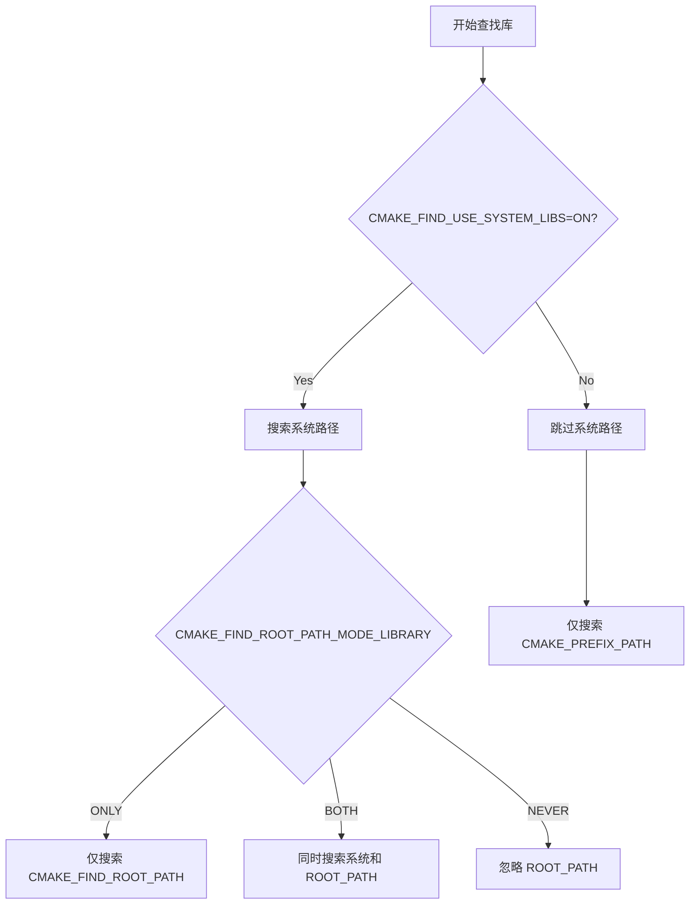

# 0.调用find_package时，搜索路径的优先级

## 一、元宝ai的答案
是的，你总结的 `find_package()` 搜索路径优先级基本正确，但需要注意 `CMAKE_MODULE_PATH` 的作用与其他路径不同。以下是更精确的优先级顺序和详细说明：

---

### **`find_package()` 搜索路径优先级（从高到低）**
1. **`<PackageName>_DIR`**  
   - **最高优先级**，直接指定 `<PackageName>Config.cmake` 或 `<lower-case-pkg>-config.cmake` 所在目录。  
   - 示例：
     ```cmake
     set(OpenCV_DIR "/path/to/opencv/build")  # 必须包含 OpenCVConfig.cmake
     ```

2. **`<PackageName>_ROOT`**（CMake 3.12+）  
   - 包特定的根路径，CMake 会在此路径下的 `lib/cmake/<PackageName>` 或类似子目录中搜索配置文件。  
   - 示例：
     ```cmake
     set(OpenCV_ROOT "/path/to/opencv")
     ```

3. **`CMAKE_PREFIX_PATH`**  
   - 指定多个前缀路径，CMake 会在这些路径下的 `lib/cmake/<PackageName>`、`share/<PackageName>` 等子目录中搜索。  
   - 示例：
     ```cmake
     set(CMAKE_PREFIX_PATH "/opt/opencv;/usr/local")
     ```

4. **`CMAKE_MODULE_PATH`**  
   - **仅影响 `Find<PackageName>.cmake` 模块的搜索**（非 `Config` 模式）。  
   - 用于添加自定义的 `Find*.cmake` 脚本路径，优先级高于 CMake 内置模块路径。  
   - 示例：
     ```cmake
     list(APPEND CMAKE_MODULE_PATH "${CMAKE_SOURCE_DIR}/cmake/modules")
     ```

5. **环境变量 `PATH` 和注册表（Windows）**  
   - CMake 会检查系统 `PATH` 环境变量中的可执行文件路径（如 `bin/`）。  
   - 在 Windows 上，还会检查注册表中记录的软件安装路径（如 `HKEY_LOCAL_MACHINE\SOFTWARE`）。

6. **CMake 内置的搜索路径**  
   - 标准系统路径，如：  
     - Unix: `/usr/local`, `/usr`, `/opt`  
     - Windows: `C:/Program Files`, `C:/Program Files (x86)`  
     - 具体路径可通过 `cmake --system-information` 查看。

7. **`PATHS` 或 `HINTS` 选项**（在 `find_package()` 中显式指定）  
   - `HINTS`：建议性路径（优先级较低，可能被其他路径覆盖）。  
   - `PATHS`：强制性路径（优先级高于内置路径，但低于前述变量）。  
   - 示例：
     ```cmake
     find_package(OpenCV HINTS "/path/hint" PATHS "/path/to/opencv")
     ```

---

### **关键区别与注意事项**
1. **`Config` 模式 vs `Module` 模式**  
   - **`Config` 模式**：优先搜索 `<PackageName>Config.cmake`（由包自身提供），依赖 `*_DIR`、`*_ROOT`、`CMAKE_PREFIX_PATH`。  
   - **`Module` 模式**：搜索 `Find<PackageName>.cmake`（CMake 或用户提供），依赖 `CMAKE_MODULE_PATH`。

2. **`CMAKE_MODULE_PATH` 的特殊性**  
   - 仅用于 `Find*.cmake` 模块文件，不影响 `Config` 文件的搜索。  
   - 若同时存在 `Config` 和 `Module` 文件，`Config` 模式优先（除非指定 `NO_DEFAULT_PATH`）。

3. **调试搜索过程**  
   - 使用 `--debug-find` 查看详细搜索路径：
     ```bash
     cmake --debug-find .
     ```

---

### **完整示例**
```cmake
# 显式设置优先级最高的路径
set(OpenCV_DIR "/path/to/opencv/build")

# 添加其他搜索前缀
set(CMAKE_PREFIX_PATH "/opt/opencv;/usr/local")

# 添加自定义 Find 模块路径
list(APPEND CMAKE_MODULE_PATH "${CMAKE_SOURCE_DIR}/cmake")

# 调用 find_package
find_package(OpenCV REQUIRED
    HINTS "/path/hint"     # 低优先级提示
    PATHS "/another/path"  # 高优先级路径
)
```

---

### **总结**
- **控制优先级**：通过 `*_DIR` > `*_ROOT` > `CMAKE_PREFIX_PATH` 可以精准控制包路径。  
- **模块模式**：如需自定义查找逻辑，将 `Find<PackageName>.cmake` 放入 `CMAKE_MODULE_PATH`。  
- **调试**：使用 `--debug-find` 诊断路径问题。  

如果有特定场景的需求（如交叉编译），可以进一步结合 `CMAKE_FIND_ROOT_PATH` 和 `NO_*` 选项（如 `NO_DEFAULT_PATH`）细化搜索行为。

## 二、豆包ai的答案
在 CMake 中使用 `find_package` 时，搜索路径的优先级从高到低大致如下（不同场景可能略有差异，核心是“用户指定优先于系统默认”）：


### 1. **用户显式指定的路径**  
- 通过 `CMAKE_PREFIX_PATH` 变量指定的路径（最常用，可在命令行或 CMakeLists 中设置）。  
- 通过 `CMAKE_MODULE_PATH` 变量指定的路径（专门用于搜索 `Find<Package>.cmake` 模块文件）。  
- 包自身的 `CONFIG` 文件中可能包含的路径（若包使用配置模式）。  


### 2. **系统环境变量指定的路径**  
- 对应包的环境变量，如 `<Package>_DIR`（例如 `Boost_DIR`），优先级高于系统默认路径。  
- 系统级的 `PATH` 环境变量（部分场景下会搜索其中的路径）。  


### 3. **CMake 内置的默认路径**  
- 系统标准库路径（如 `/usr/lib`、`/usr/local/lib`、`C:\Program Files` 等）。  
- CMake 安装目录中自带的模块路径（如 `share/cmake-<version>/Modules`）。  


### 关键原则  
- **配置模式（CONFIG）** 优先于 **模块模式（MODULE）**：如果包提供了 `<Package>Config.cmake`，会优先使用它，而非 `Find<Package>.cmake` 模块。  
- 用户指定的路径（如 `CMAKE_PREFIX_PATH`）始终覆盖系统默认路径，方便自定义包的位置（例如本地编译的库）。


============================================================

# 1.某库 SomeLib 的源码路径"/opt/somelib_code/",编译结果放在"/opt/somelib_code/build/ubuntu/"，如何在 CMake 中使用 find_package

<!-- 元宝： -->
如果 **SomeLib** 的源码在 `/opt/somelib_code/`，编译结果（库文件和 CMake 配置文件）在 `/opt/somelib_code/build/ubuntu/`，你需要让 CMake 的 `find_package` 能够找到它的安装路径。以下是具体方法：

---

## **1. 确保 SomeLib 正确生成 CMake 配置文件**
在编译 **SomeLib** 时，确保它生成了 `SomeLibConfig.cmake` 或 `somelib-config.cmake` 文件（通常在 `build/ubuntu/` 下）。  
检查是否存在：
```bash
ls /opt/somelib_code/build/ubuntu/SomeLibConfig.cmake
# 或
ls /opt/somelib_code/build/ubuntu/somelib-config.cmake
```

如果没有生成，可能是 **SomeLib** 的 CMake 工程未正确配置导出（需修改其 `CMakeLists.txt`）。

---

## **2. 在 CMake 项目中指定 SomeLib 的路径**
### **方法 1：直接设置 `SomeLib_DIR`**
在 `CMakeLists.txt` 中显式指定 `SomeLib_DIR` 为编译输出目录：
```cmake
set(SomeLib_DIR "/opt/somelib_code/build/ubuntu")
find_package(SomeLib REQUIRED)
```

### **方法 2：通过 `CMAKE_PREFIX_PATH` 指定**
```cmake
list(APPEND CMAKE_PREFIX_PATH "/opt/somelib_code/build/ubuntu")
find_package(SomeLib REQUIRED)
```

### **方法 3：命令行传递路径**
运行 `cmake` 时动态指定路径：
```bash
cmake -DSomeLib_DIR=/opt/somelib_code/build/ubuntu ..
# 或
cmake -DCMAKE_PREFIX_PATH=/opt/somelib_code/build/ubuntu ..
```

---

## **3. 验证 `find_package` 是否成功**
在 `CMakeLists.txt` 中添加检查逻辑：
```cmake
find_package(SomeLib REQUIRED)
if(SomeLib_FOUND)
    message(STATUS "Found SomeLib: ${SomeLib_VERSION}")
    include_directories(${SomeLib_INCLUDE_DIRS})
    target_link_libraries(your_target ${SomeLib_LIBRARIES})
else()
    message(FATAL_ERROR "SomeLib not found!")
endif()
```

---

## **4. 处理可能的路径问题**
### **问题 1：CMake 找不到 `SomeLibConfig.cmake`**
**错误信息**：
```
Could not find a package configuration file provided by "SomeLib".
```

**解决**：
- 确认 `SomeLibConfig.cmake` 或 `somelib-config.cmake` 是否存在。
- 如果文件名非标准，手动指定：
  ```cmake
  set(SomeLib_CONFIG "/opt/somelib_code/build/ubuntu/CustomName.cmake")
  find_package(SomeLib REQUIRED)
  ```

### **问题 2：库文件或头文件路径未正确导出**
**错误信息**：
```
Could not find SomeLib include dir or libraries.
```

**解决**：
- 检查 `SomeLibConfig.cmake` 是否正确定义了 `SomeLib_INCLUDE_DIRS` 和 `SomeLib_LIBRARIES`。
- 手动补充路径（不推荐，应急用）：
  ```cmake
  set(SomeLib_INCLUDE_DIRS "/opt/somelib_code/include")
  set(SomeLib_LIBRARIES "/opt/somelib_code/build/ubuntu/libsomelib.so")
  ```

---

## **5. 完整示例**
假设你的项目结构如下：
```
/opt/somelib_code/
├── include/         # 头文件
├── build/ubuntu/    # 编译输出（含 SomeLibConfig.cmake 和 libsomelib.so）
```

`CMakeLists.txt` 示例：
```cmake
cmake_minimum_required(VERSION 3.10)
project(MyProject)

# 指定 SomeLib 的路径
set(SomeLib_DIR "/opt/somelib_code/build/ubuntu")
find_package(SomeLib REQUIRED)

if(SomeLib_FOUND)
    message(STATUS "Found SomeLib: ${SomeLib_VERSION}")
    include_directories(${SomeLib_INCLUDE_DIRS})
else()
    message(FATAL_ERROR "SomeLib not found!")
endif()

add_executable(my_app main.cpp)
target_link_libraries(my_app ${SomeLib_LIBRARIES})
```

---

## **总结**
1. **确认 CMake 配置文件**：确保 `SomeLibConfig.cmake` 存在于编译输出目录。
2. **指定路径**：通过 `SomeLib_DIR` 或 `CMAKE_PREFIX_PATH` 告诉 CMake 去哪里找。
3. **验证结果**：检查 `SomeLib_FOUND` 和导出的变量（如 `SomeLib_LIBRARIES`）。
4. **应急方案**：若配置文件缺失，可手动设置头文件和库路径（但建议优先修复库的构建系统）。

如果 **SomeLib** 未提供标准的 CMake 导出文件，可能需要修改其构建系统或改用 `find_library` 和 `find_path` 手动定位。

===============================================
# 2.为什么是指定 CMAKE_PREFIX_PATH，而不是CMAKE_MODULE_PATH

在 CMake 中，`CMAKE_PREFIX_PATH` 和 `CMAKE_MODULE_PATH` 有不同的用途，理解它们的区别对于正确配置 `find_package` 至关重要。以下是详细解释：

---

## **1. `CMAKE_PREFIX_PATH`：用于查找库的安装前缀**
### **作用**
- 指定一组**库的安装根目录**（如 `/usr/local`、`/opt/somelib`），CMake 会基于这些路径搜索：
  - `<prefix>/lib/cmake/SomeLib/SomeLibConfig.cmake`  
  - `<prefix>/lib/SomeLibConfig.cmake`  
  - `<prefix>/share/SomeLib/SomeLibConfig.cmake`  
- 是 `find_package` 的**主要搜索路径**，适用于大多数现代 CMake 项目。

### **适用场景**
- 当库通过 `make install` 安装到某个前缀路径（如 `/opt/somelib`），且提供了标准的 `SomeLibConfig.cmake` 文件时。
- **你的案例**：  
  `SomeLib` 编译到 `/opt/somelib_code/build/ubuntu/`，假设它生成了 `SomeLibConfig.cmake`，则应：
  ```cmake
  set(CMAKE_PREFIX_PATH "/opt/somelib_code/build/ubuntu")
  find_package(SomeLib REQUIRED)
  ```
  CMake 会自动在 `/opt/somelib_code/build/ubuntu/lib/cmake/SomeLib/` 下查找配置文件。

---

## **2. `CMAKE_MODULE_PATH`：用于查找自定义的 `FindXXX.cmake` 脚本**
### **作用**
- 指定一组**自定义 CMake 模块路径**，用于存放用户编写的 `FindSomeLib.cmake` 脚本（非库官方提供的 `SomeLibConfig.cmake`）。
- 是 `find_package` 的**备用搜索路径**，仅在库未提供标准 `Config.cmake` 文件时使用。

### **适用场景**
- 当库**未提供** `SomeLibConfig.cmake`，但你自己写了一个 `FindSomeLib.cmake` 脚本时。
- 例如：
  ```cmake
  set(CMAKE_MODULE_PATH "${CMAKE_SOURCE_DIR}/cmake")
  find_package(SomeLib REQUIRED)  # 会搜索 ${CMAKE_SOURCE_DIR}/cmake/FindSomeLib.cmake
  ```

---

## **3. 关键区别**
| **特性**               | `CMAKE_PREFIX_PATH`                          | `CMAKE_MODULE_PATH`                      |
|------------------------|---------------------------------------------|------------------------------------------|
| **用途**               | 查找库官方提供的 `Config.cmake` 文件         | 查找用户自定义的 `FindXXX.cmake` 脚本     |
| **典型路径结构**       | `<prefix>/lib/cmake/SomeLib/SomeLibConfig.cmake` | `<path>/FindSomeLib.cmake`               |
| **优先级**             | 高（现代 CMake 首选）                       | 低（兼容旧项目或非标准库）                |
| **是否影响系统路径**   | 否（仅扩展搜索范围）                         | 否                                       |

---

## **4. 为什么你的案例应该用 `CMAKE_PREFIX_PATH`？**
1. **库提供了标准配置文件**  
   如果 `SomeLib` 在 `/opt/somelib_code/build/ubuntu/` 下生成了 `SomeLibConfig.cmake`，它应该位于类似以下路径：
   ```
   /opt/somelib_code/build/ubuntu/lib/cmake/SomeLib/SomeLibConfig.cmake
   ```
   此时 `CMAKE_PREFIX_PATH` 是唯一正确的选择。

2. **`CMAKE_MODULE_PATH` 不适用**  
   除非你手动编写了 `FindSomeLib.cmake` 并放在某个目录中，否则 `CMAKE_MODULE_PATH` 不会生效。

---

## **5. 验证方法**
### **检查 `SomeLib` 的安装结构**
```bash
# 确认是否存在 Config.cmake
find /opt/somelib_code/build/ubuntu -name "*Config.cmake"
```

### **在 CMake 中调试搜索路径**
```cmake
message(STATUS "CMAKE_PREFIX_PATH: ${CMAKE_PREFIX_PATH}")
message(STATUS "CMAKE_MODULE_PATH: ${CMAKE_MODULE_PATH}")
find_package(SomeLib REQUIRED)
```

---

## **6. 总结**
- **用 `CMAKE_PREFIX_PATH`**：  
  当库提供了标准的 `SomeLibConfig.cmake`（通常在 `lib/cmake/SomeLib/` 下），这是现代 CMake 的推荐方式。
  
- **用 `CMAKE_MODULE_PATH`**：  
  当库未提供标准配置，且你需要自定义 `FindSomeLib.cmake` 脚本时（常见于老旧或非 CMake 项目）。

在你的场景中，因为 `SomeLib` 是自行编译的，且编译输出目录（`/opt/somelib_code/build/ubuntu/`）应包含 `Config.cmake` 文件，所以 **必须使用 `CMAKE_PREFIX_PATH`**。

=======================================================

# 3.CMAKE_PREFIX_PATH是 find_package 用于搜索SomeLibConfig.cmake，而CMAKE_MODULE_PATH是 find_package 用于搜索SomeLib.cmake？

你的理解基本正确，但需要更精确地区分两者的职责和搜索逻辑。以下是详细对比：

---

### **1. `CMAKE_PREFIX_PATH`**
#### **用途**
- **主要目标**：帮助 `find_package` 定位库的 **`<PackageName>Config.cmake`** 或 **`<package-name>-config.cmake`**（现代 CMake 的配置文件）。
- **搜索路径**：
  ```
  <prefix>/lib/cmake/<PackageName>/
  <prefix>/lib/<PackageName>/
  <prefix>/share/<PackageName>/
  ```
- **适用场景**：
  - 库通过 `install(EXPORT)` 导出目标（现代 CMake 项目）。
  - 库安装在非标准路径（如 `/opt/somelib`）。

#### **示例**
```bash
cmake -DCMAKE_PREFIX_PATH="/opt/somelib" ..
```
CMake 会优先在 `/opt/somelib/lib/cmake/SomeLib/` 下查找 `SomeLibConfig.cmake`。

---

### **2. `CMAKE_MODULE_PATH`**
#### **用途**
- **主要目标**：帮助 `find_package` 定位 **`Find<PackageName>.cmake`**（传统的手写查找脚本）。
- **搜索路径**：
  ```
  <path>/FindSomeLib.cmake
  ```
- **适用场景**：
  - 库未提供 `Config.cmake`，需手动编写查找逻辑。
  - 需要覆盖系统的默认 `Find<PackageName>.cmake`（如使用自定义版本）。

#### **示例**
```cmake
list(APPEND CMAKE_MODULE_PATH "${PROJECT_SOURCE_DIR}/cmake")
find_package(SomeLib)  # 会搜索 ${PROJECT_SOURCE_DIR}/cmake/FindSomeLib.cmake
```

---

### **3. 关键区别**
| **特性**               | `CMAKE_PREFIX_PATH`                  | `CMAKE_MODULE_PATH`                |
|-------------------------|--------------------------------------|------------------------------------|
| **文件类型**           | `SomeLibConfig.cmake`                | `FindSomeLib.cmake`               |
| **生成方式**           | 由库的构建系统自动生成（现代 CMake） | 需手动编写（传统方式）             |
| **优先级**             | 高（现代项目首选）                  | 低（兼容旧库或自定义逻辑）         |
| **典型路径结构**       | `<prefix>/lib/cmake/SomeLib/`       | `<path>/FindSomeLib.cmake`        |
| **是否影响系统路径**   | 否（追加搜索路径）                  | 否                                 |

---

### **4. 搜索顺序逻辑**
当调用 `find_package(SomeLib)` 时，CMake 按以下顺序查找：
1. **`<PackageName>_DIR`**（直接指定 `Config.cmake` 路径，优先级最高）。
2. **`CMAKE_PREFIX_PATH`** 下的 `Config.cmake`。
3. **`CMAKE_MODULE_PATH`** 下的 `Find<PackageName>.cmake`。
4. **系统默认路径**（如 `/usr/share/cmake/Modules/Find<PackageName>.cmake`）。

---

### **5. 如何选择？**
#### **优先用 `CMAKE_PREFIX_PATH`（现代 CMake）**
```bash
# 假设 SomeLib 安装在 /opt/somelib，并提供了 Config.cmake
cmake -DCMAKE_PREFIX_PATH="/opt/somelib" ..
```
**优点**：自动处理依赖、编译选项、目标导出。

#### **退回到 `CMAKE_MODULE_PATH`（传统或自定义库）**
```cmake
# 自定义 FindSomeLib.cmake 放在项目的 cmake/ 目录下
list(APPEND CMAKE_MODULE_PATH "${CMAKE_SOURCE_DIR}/cmake")
find_package(SomeLib)
```
**适用场景**：
- 库未提供 `Config.cmake`。
- 需要强制覆盖系统默认的查找逻辑。

---

### **6. 常见问题**
#### **Q：如果同时设置两者，CMake 如何选择？**
A：**`Config.cmake` 优先于 `Find.cmake`**。若在 `CMAKE_PREFIX_PATH` 中找到 `SomeLibConfig.cmake`，则忽略 `CMAKE_MODULE_PATH` 中的 `FindSomeLib.cmake`。

#### **Q：为什么我的 `FindSomeLib.cmake` 不生效？**
A：可能是因为：
1. `SomeLibConfig.cmake` 已存在且被优先找到。
2. `CMAKE_MODULE_PATH` 未正确设置（路径错误或未在 `find_package` 前调用）。

#### **Q：如何强制使用 `FindSomeLib.cmake`？**
A：禁用 `Config.cmake` 搜索：
```cmake
find_package(SomeLib NO_CONFIG)  # 跳过 Config.cmake，只找 FindSomeLib.cmake
```

---

### **总结**
- **`CMAKE_PREFIX_PATH`**：用于现代 CMake 项目（`Config.cmake`）。
- **`CMAKE_MODULE_PATH`**：用于传统或自定义库（`Find.cmake`）。
- **最佳实践**：优先让库提供 `Config.cmake`，否则手动编写 `Find.cmake` 并指定 `CMAKE_MODULE_PATH`。

=================================================
# 4. cmake_prefix_path 会不会导致 CMakeList.txt 里其他的 find_package语句找不到对应的 packagenameConfig.cmake

如果我调用 cmake 命令的时候， 把传入的 cmake_prefix_path 设置成  OpenSceneGraphConfig.cmake 的那个路径的话，会不会导致 CMakeList.txt 里其他的 find_package语句找不到对应的 packagenameConfig.cmake。


不会。**`CMAKE_PREFIX_PATH` 仅影响 `find_package` 的搜索路径，不会导致其他 `find_package` 调用失败**，只要其他库的 `Config.cmake` 仍在默认搜索路径（如 `/usr/lib/cmake/`）或通过其他方式指定路径即可。以下是详细分析：

---

## **1. `CMAKE_PREFIX_PATH` 的作用**
`CMAKE_PREFIX_PATH` 是一个 **优先级高于默认路径的搜索列表**，用于告诉 CMake 优先在指定路径下查找 `PackageNameConfig.cmake` 或 `FindPackageName.cmake`。  
- **仅影响当前 `find_package` 的搜索顺序**，不会破坏其他库的查找逻辑。
- **不会覆盖系统路径**，只是插入新的搜索路径。

### **示例命令**
```bash
cmake -DCMAKE_PREFIX_PATH="/path/to/OpenSceneGraph/build/ubuntu" ..
```
此时：
1. `find_package(OpenSceneGraph)` 会优先在 `/path/to/OpenSceneGraph/build/ubuntu` 下查找 `OpenSceneGraphConfig.cmake`。
2. 其他 `find_package`（如 `find_package(Boost)`）仍会按默认路径（如 `/usr/lib/cmake/Boost`）搜索。

---

## **2. CMake 的搜索顺序**
`find_package` 的搜索路径优先级如下（从高到低）：
1. **`<PackageName>_DIR`**（直接指定 `Config.cmake` 的路径，优先级最高）
2. **`CMAKE_PREFIX_PATH`**（通过 `-DCMAKE_PREFIX_PATH` 设置）
3. **系统默认路径**（如 `/usr/lib/cmake/`、`/usr/local/lib/cmake/`）

### **关键结论**
- **`CMAKE_PREFIX_PATH` 是追加而非覆盖**：其他库的 `Config.cmake` 仍会在默认路径中被找到。
- **隔离性**：每个 `find_package` 的搜索是独立的，设置 `CMAKE_PREFIX_PATH` 不会干扰其他包。

---

## **3. 验证方法**
### **方法 1：查看 CMake 的搜索路径**
在 `CMakeLists.txt` 中添加调试信息：
```cmake
message(STATUS "CMAKE_PREFIX_PATH = ${CMAKE_PREFIX_PATH}")
message(STATUS "OpenSceneGraph_DIR = ${OpenSceneGraph_DIR}")
```
运行 CMake 后观察输出，确认路径是否正确。

### **方法 2：检查其他包是否被找到**
```cmake
find_package(Boost REQUIRED)  # 确保其他包不受影响
if(Boost_FOUND)
    message(STATUS "Boost found at: ${Boost_DIR}")
endif()
```
如果 `Boost` 仍能被正常找到，说明 `CMAKE_PREFIX_PATH` 未干扰其他库。

---

## **4. 特殊情况处理**
### **问题：其他库也需要自定义路径**
如果项目中还有其他库需要指定非默认路径（如自定义编译的 `Boost`），有两种解决方案：
#### **方案 1：追加到 `CMAKE_PREFIX_PATH`**
```bash
cmake -DCMAKE_PREFIX_PATH="/path/to/OSG;/path/to/Boost" ..
```

#### **方案 2：单独设置 `<PackageName>_DIR`**
```bash
cmake -DOpenSceneGraph_DIR="/path/to/OSG/build/ubuntu/lib/cmake/OpenSceneGraph" \
      -DBoost_DIR="/path/to/Boost/lib/cmake/Boost-1.80" ..
```
**优点**：更精确，避免路径冲突。

---

## **5. 最佳实践**
### **（1）优先使用 `<PackageName>_DIR`**
如果只需覆盖单个库的路径，直接设置 `PackageName_DIR` 更安全：
```bash
cmake -DOpenSceneGraph_DIR="/path/to/OSG/build/ubuntu/lib/cmake/OpenSceneGraph" ..
```

### **（2）合理使用 `CMAKE_PREFIX_PATH`**
如果需要覆盖多个库的路径，可以通过 `CMAKE_PREFIX_PATH` 统一管理：
```bash
cmake -DCMAKE_PREFIX_PATH="/path/to/custom/libs;/opt/other/libs" ..
```

### **（3）确保系统库仍可被找到**
如果自定义路径中缺少某些库，CMake 会自动回退到系统路径（如 `/usr/lib/cmake/`），除非显式禁用：
```cmake
find_package(Boost NO_DEFAULT_PATH)  # 禁用系统路径回退（慎用！）
```

---

## **6. 总结**
| **场景**                | **解决方案**                              | **是否影响其他包** |
|-------------------------|------------------------------------------|--------------------|
| 仅需覆盖 OSG 的路径      | `-DOpenSceneGraph_DIR=/path/to/OSG`      | 不影响             |
| 需覆盖多个库的路径       | `-DCMAKE_PREFIX_PATH=/path1:/path2`     | 不影响             |
| 需要严格隔离路径         | 为每个包单独设置 `PackageName_DIR`       | 不影响             |

**结论**：  
设置 `CMAKE_PREFIX_PATH` 不会导致其他 `find_package` 失败，因为 CMake 的搜索路径是**叠加而非覆盖**的。若需更精确控制，建议优先使用 `<PackageName>_DIR`。


==================================================================
# 5.find_package 的COMPONENTS参数是指动态库吗

在 CMake 的 `find_package` 中，**`COMPONENTS` 并不特指动态库（`.so`/`.dll`）或静态库（`.a`/`.lib`）**，而是表示**库的模块化组件**。这些组件可以是动态库、静态库、头文件集合、工具程序，甚至是纯接口定义。以下是详细解释：

---

### **1. `COMPONENTS` 的本质**
当调用 `find_package` 时，`COMPONENTS` 用于指定需要查找的**子模块**或**功能组件**。例如：
```cmake
find_package(OpenSceneGraph REQUIRED COMPONENTS osgDB osgViewer)
```
这里的 `osgDB` 和 `osgViewer` 是 OpenSceneGraph 库的两个组件，它们可能是：
- **动态库**（如 `libosgDB.so` 和 `libosgViewer.so`）
- **静态库**（如 `libosgDB.a` 和 `libosgViewer.a`）
- **头文件集合**（如 `osgDB/` 和 `osgViewer/` 目录）
- **工具或插件**（如 `osgDB` 可能包含文件格式插件）

---

### **2. `COMPONENTS` 与库类型的区别**
| **特性**       | `COMPONENTS`（组件）               | **动态库/静态库**               |
|----------------|-----------------------------------|--------------------------------|
| **定义层面**   | 库的功能模块划分                  | 库的链接形式（动态或静态）      |
| **CMake 语法** | `find_package(XX COMPONENTS A B)` | `target_link_libraries(...)`   |
| **物理文件**   | 可能是动态库、静态库或头文件       | `.so`（动态）或 `.a`（静态）    |
| **示例**       | `osgDB`, `osgViewer`             | `libosgDB.so`, `libosgDB.a`    |

---

### **3. 为什么需要 `COMPONENTS`？**
1. **模块化设计**  
   大型库（如 Boost、OpenSceneGraph）通常拆分为多个组件，用户只需按需选择。例如：
   - Boost 的 `filesystem`、`system` 组件。
   - OpenSceneGraph 的 `osgDB`、`osgGA` 组件。

2. **减少依赖体积**  
   避免链接未使用的组件（如只使用 `osgDB` 而不链接 `osgViewer`）。

3. **条件化加载**  
   某些组件可能依赖外部库（如 `osgDB` 依赖 `libGDAL`），需单独处理。

---

### **4. `COMPONENTS` 的实现原理**
库的开发者需要在 `Config.cmake` 或 `FindXXX.cmake` 中实现组件支持。例如：
#### **OpenSceneGraph 的 `Config.cmake` 逻辑**
```cmake
# 检查请求的组件
foreach(component ${OpenSceneGraph_FIND_COMPONENTS})
    if(NOT TARGET OpenSceneGraph::${component})
        set(OpenSceneGraph_${component}_FOUND FALSE)
        set(OpenSceneGraph_FOUND FALSE)
    endif()
endforeach()
```
- 如果用户请求 `osgDB`，但未找到 `OpenSceneGraph::osgDB` 目标，则标记为未找到。

#### **自定义 `FindXXX.cmake` 的组件支持**
```cmake
# 手动查找每个组件
foreach(component ${SomeLib_FIND_COMPONENTS})
    find_library(SomeLib_${component}_LIBRARY
        NAMES some_lib_${component}
        PATHS /opt/somelib/lib
    )
    if(SomeLib_${component}_LIBRARY)
        list(APPEND SomeLib_LIBRARIES ${SomeLib_${component}_LIBRARY})
    else()
        set(SomeLib_FOUND FALSE)
    endif()
endforeach()
```

---

### **5. 动态库 vs 静态库的控制**
`COMPONENTS` **不直接决定库的链接类型**（动态/静态）。链接类型由以下方式控制：
1. **全局设置**  
   ```cmake
   set(BUILD_SHARED_LIBS ON)  # 优先查找动态库
   ```
2. **手动指定**  
   ```cmake
   find_library(SomeLib_LIBRARY NAMES some_lib_shared some_lib_static)
   ```

---

### **6. 实际案例**
#### **案例 1：查找 Boost 的组件**
```cmake
find_package(Boost REQUIRED COMPONENTS filesystem system)
```
- `filesystem` 和 `system` 是 Boost 的两个组件，可能是动态库（`libboost_filesystem.so`）或静态库（`libboost_filesystem.a`）。

#### **案例 2：查找 OpenSceneGraph 的组件**
```cmake
find_package(OpenSceneGraph REQUIRED COMPONENTS osgDB osgViewer)
```
- `osgDB` 和 `osgViewer` 是动态库（`libosgDB.so`），但用户无需关心其类型。

#### **案例 3：自定义库的组件支持**
```cmake
# 假设 SomeLib 包含 core 和 extra 组件
find_package(SomeLib REQUIRED COMPONENTS core extra)
```

---

### **7. 常见误区**
#### **误区 1：认为 `COMPONENTS` 必须对应动态库**
- **纠正**：组件可以是任何形式（动态库、静态库、头文件等），具体由库的设计决定。

#### **误区 2：混淆 `COMPONENTS` 和 `OPTIONAL_COMPONENTS`**
- **`REQUIRED_COMPONENTS`**：必须找到，否则报错。
- **`OPTIONAL_COMPONENTS`**：找不到时不报错（CMake 3.19+ 支持）。

---

### **总结**
- **`COMPONENTS`** 表示库的**功能模块**，不特指动态库或静态库。
- **用途**：按需加载库的子模块（如 `osgDB`、`Boost.filesystem`）。
- **实现**：由库的 `Config.cmake` 或 `FindXXX.cmake` 脚本支持。
- **与链接类型的区别**：动态/静态库由 `BUILD_SHARED_LIBS` 或 `find_library` 控制。


======================================================
# 6.Could not find a package configuration file provided by "boost_filesystem"

## 问题：
```sh
(base) abner@abner-XPS:~/abner2/zdev/cpp/cmake-examples/09-myboost$ cmake -S. -Bbuild -DBoost_DIR="/home/abner/abner2/zdev/cpp/cmake-examples/09-myboost/boost-1.88.0/build"
-- The CXX compiler identification is GNU 13.3.0
-- Detecting CXX compiler ABI info
-- Detecting CXX compiler ABI info - done
-- Check for working CXX compiler: /usr/bin/c++ - skipped
-- Detecting CXX compile features
-- Detecting CXX compile features - done
CMake Error at /usr/lib/x86_64-linux-gnu/cmake/Boost-1.83.0/BoostConfig.cmake:141 (find_package):
  Could not find a package configuration file provided by "boost_filesystem"
  (requested version 1.83.0) with any of the following names:

    boost_filesystemConfig.cmake
    boost_filesystem-config.cmake

  Add the installation prefix of "boost_filesystem" to CMAKE_PREFIX_PATH or
  set "boost_filesystem_DIR" to a directory containing one of the above
  files.  If "boost_filesystem" provides a separate development package or
  SDK, be sure it has been installed.
Call Stack (most recent call first):
  /usr/lib/x86_64-linux-gnu/cmake/Boost-1.83.0/BoostConfig.cmake:262 (boost_find_component)
  /usr/share/cmake-3.28/Modules/FindBoost.cmake:594 (find_package)
  src/CMakeLists.txt:7 (find_package)
```

## 元宝答案

这个错误表明 CMake 无法找到 Boost 的 `boost_filesystem` 组件对应的配置文件（`boost_filesystemConfig.cmake` 或 `boost_filesystem-config.cmake`）。以下是详细的解决方案：

---

## **1. 问题根源**
- **Boost 1.88.0 的安装路径**：你通过 `-DBoost_DIR` 指定了 `/home/abner/.../boost-1.88.0/build`，但 CMake 仍然尝试从系统路径（`/usr/lib/x86_64-linux-gnu/cmake/Boost-1.83.0/`）查找 Boost 1.83.0 的配置。
- **关键问题**：
  - Boost 1.88.0 的 CMake 配置文件未正确生成或未被找到。
  - 系统预装的 Boost 1.83.0 干扰了查找过程。

---

## **2. 解决方案**
### **方法 1：强制使用自定义 Boost 路径**
在 CMake 命令中明确指定 Boost 的根路径和组件：
```bash
cmake -S . -B build \
    -DBOOST_ROOT="/home/abner/.../boost-1.88.0/build" \
    -DBoost_NO_SYSTEM_PATHS=ON \
    -DBoost_NO_BOOST_CMAKE=ON
```
**参数说明**：
- `BOOST_ROOT`：指定 Boost 的安装前缀（包含 `include/` 和 `lib/`）。
- `Boost_NO_SYSTEM_PATHS=ON`：禁止搜索系统路径。
- `Boost_NO_BOOST_CMAKE=ON`：禁用 Boost 自带的 CMake 支持（避免冲突）。

---

### **方法 2：直接指定库和头文件路径**
如果 Boost 未生成 `Config.cmake` 文件，可以手动指定路径：
```cmake
# 在 CMakeLists.txt 中替换 find_package
set(BOOST_INCLUDEDIR "/home/abner/.../boost-1.88.0/build/include")
set(BOOST_LIBRARYDIR "/home/abner/.../boost-1.88.0/build/lib")
find_package(Boost 1.88.0 REQUIRED COMPONENTS filesystem system)
```

---

### **方法 3：检查 Boost 安装是否完整**
确认 Boost 1.88.0 的安装目录结构是否完整：
```bash
ls /home/abner/.../boost-1.88.0/build
```
应有以下结构：
```
build/
├── include/boost/       # 头文件
├── lib/                 # 库文件（如 libboost_filesystem.so）
└── lib/cmake/Boost-1.88.0/  # CMake 配置文件（如果生成）
```
如果缺少 `lib/cmake/`，可能是编译时未启用 CMake 支持。

---

### **方法 4：重新编译 Boost 并启用 CMake 导出**
在编译 Boost 时添加 `--layout=system` 和 `--cmake` 选项：
```bash
./b2 install \
    --prefix=/home/abner/.../boost-1.88.0/build \
    --layout=system \
    --cmake
```

---

## **3. 验证 Boost 配置**
### **检查库文件是否存在**
```bash
ls /home/abner/.../boost-1.88.0/build/lib/libboost_filesystem*
```
如果文件存在但 CMake 仍报错，可能是文件名格式不匹配（如版本后缀）。

### **手动查找配置文件**
```bash
find /home/abner/.../boost-1.88.0/build -name "*Config.cmake"
```
如果未找到，说明 Boost 未生成 CMake 配置文件，需使用方法 1 或 2。

---

## **4. 修改后的 CMakeLists.txt 示例**
```cmake
cmake_minimum_required(VERSION 3.10)
project(MyProject)

# 方法 1：通过 BOOST_ROOT 查找
set(BOOST_ROOT "/home/abner/.../boost-1.88.0/build")
set(Boost_NO_SYSTEM_PATHS ON)
find_package(Boost 1.88.0 REQUIRED COMPONENTS filesystem system)

# 方法 2：直接指定路径（如果方法 1 失败）
# set(BOOST_INCLUDEDIR "${BOOST_ROOT}/include")
# set(BOOST_LIBRARYDIR "${BOOST_ROOT}/lib")
# find_package(Boost 1.88.0 REQUIRED COMPONENTS filesystem system)

if(Boost_FOUND)
    message(STATUS "Boost found: ${Boost_VERSION}")
    include_directories(${Boost_INCLUDE_DIRS})
    add_executable(my_app main.cpp)
    target_link_libraries(my_app ${Boost_LIBRARIES})
else()
    message(FATAL_ERROR "Boost not found!")
endif()
```

---

## **5. 常见问题**
### **Q1：为什么 CMake 仍然找到系统 Boost？**
- **原因**：未设置 `Boost_NO_SYSTEM_PATHS=ON`。
- **解决**：在 CMake 命令或脚本中强制禁用系统路径。

### **Q2：`boost_filesystemConfig.cmake` 未生成**
- **原因**：Boost 默认不生成 CMake 配置文件。
- **解决**：使用方法 1 或 2，或重新编译 Boost 时启用 CMake 支持。

### **Q3：版本不匹配**
- **错误示例**：`Requested version 1.83.0, found 1.88.0`。
- **解决**：更新 `find_package` 中的版本号：
  ```cmake
  find_package(Boost 1.88.0 EXACT REQUIRED)  # 必须精确匹配
  ```

---

## **总结**
1. **优先使用 `BOOST_ROOT` + `Boost_NO_SYSTEM_PATHS=ON`**。
2. **检查 Boost 安装目录**是否包含头文件和库。
3. **必要时手动指定路径**（`BOOST_INCLUDEDIR` 和 `BOOST_LIBRARYDIR`）。
4. **确保 `find_package` 版本与安装版本一致**。

如果问题仍未解决，请提供以下信息：
- `ls /home/abner/.../boost-1.88.0/build/lib` 的输出。
- `find /home/abner/.../boost-1.88.0/build -name "*Config.cmake"` 的结果。


======================================================
# 7.指定 Boost 的安装前缀为什么不是-DBoost_DIR 而是-DBOOST_ROOT？

在 CMake 中，`-DBoost_DIR` 和 `-DBOOST_ROOT` 的作用不同，它们的用途和优先级也不同。以下是详细解释：

---

## **1. `-DBOOST_ROOT` 的作用**
### **用途**
- `BOOST_ROOT` 是 CMake 查找 Boost 时使用的**环境变量或 CMake 变量**，用于指定 Boost 的**安装根目录**（即包含 `include/` 和 `lib/` 的目录）。
- **搜索逻辑**：
  - CMake 会优先在 `${BOOST_ROOT}` 下查找 Boost 的头文件和库文件。
  - 同时会检查 `${BOOST_ROOT}/lib/cmake/Boost-<version>/` 下的 `BoostConfig.cmake`。

### **何时使用？**
- 当 Boost 是通过源码编译安装到**非标准路径**（如 `/opt/boost` 或 `~/local/boost`）时。
- 当系统中存在多个 Boost 版本（如系统自带 Boost 1.83.0，但你编译了 Boost 1.88.0），需要强制指定版本。

### **示例**
```bash
cmake -S . -B build -DBOOST_ROOT="/path/to/boost-1.88.0/build"
```

---

## **2. `-DBoost_DIR` 的作用**
### **用途**
- `Boost_DIR` 是 CMake 用于直接指定 **`BoostConfig.cmake` 所在目录**的变量。
- **搜索逻辑**：
  - CMake 会直接在该目录下查找 `BoostConfig.cmake`，而**不会**递归搜索其他路径。
  - 如果 `BoostConfig.cmake` 不存在，则查找失败。

### **何时使用？**
- 当 Boost 提供了 `BoostConfig.cmake` 文件（通常是现代 CMake 项目通过 `install(EXPORT)` 生成的）。
- 当你知道 `BoostConfig.cmake` 的确切路径时。

### **示例**
```bash
cmake -S . -B build -DBoost_DIR="/path/to/boost-1.88.0/build/lib/cmake/Boost-1.88.0"
```

---

## **3. 关键区别**
| **变量**       | **用途**                                                                 | **搜索行为**                              | **适用场景**                     |
|----------------|-------------------------------------------------------------------------|------------------------------------------|----------------------------------|
| `BOOST_ROOT`   | 指定 Boost 的安装根目录（包含 `include/` 和 `lib/`）。                   | 递归搜索 `lib/cmake/Boost-<version>/`。  | Boost 安装在非标准路径时。        |
| `Boost_DIR`    | 直接指定 `BoostConfig.cmake` 的目录。                                    | 仅在指定目录查找，不递归。                | 明确知道 `BoostConfig.cmake` 路径时。 |

---

## **4. 为什么你的案例应该用 `BOOST_ROOT`？**
### **问题分析**
你在命令中使用了 `-DBoost_DIR="/home/abner/.../boost-1.88.0/build"`，但 CMake 仍然报错：
```
Could not find a package configuration file provided by "boost_filesystem"
```
这是因为：
1. `Boost_DIR` 需要指向 **`BoostConfig.cmake` 的直接父目录**（如 `.../build/lib/cmake/Boost-1.88.0/`），而不是 Boost 的根目录。
2. 你的 Boost 可能未生成 `BoostConfig.cmake`（传统 Boost 编译默认不生成该文件）。

### **正确做法**
改用 `BOOST_ROOT`，让 CMake 自动搜索头文件和库：
```bash
cmake -S . -B build \
    -DBOOST_ROOT="/home/abner/.../boost-1.88.0/build" \
    -DBoost_NO_SYSTEM_PATHS=ON
```

---

## **5. 特殊情况处理**
### **场景 1：Boost 提供了 `BoostConfig.cmake`**
如果 Boost 编译时启用了 CMake 导出（如 `./b2 install --cmake`），则可以：
```bash
cmake -S . -B build \
    -DBoost_DIR="/home/abner/.../boost-1.88.0/build/lib/cmake/Boost-1.88.0"
```

### **场景 2：Boost 未生成 `Config.cmake`**
如果 Boost 是传统方式编译的（只有头文件和 `.so`/`.a`），需手动指定路径：
```cmake
# 在 CMakeLists.txt 中
set(BOOST_INCLUDEDIR "/home/abner/.../boost-1.88.0/build/include")
set(BOOST_LIBRARYDIR "/home/abner/.../boost-1.88.0/build/lib")
find_package(Boost REQUIRED COMPONENTS filesystem)
```

---

## **6. 验证 Boost 配置**
### **检查 `BoostConfig.cmake` 是否存在**
```bash
find /home/abner/.../boost-1.88.0/build -name "*Config.cmake"
```
- 如果存在，使用 `-DBoost_DIR`。
- 如果不存在，使用 `-DBOOST_ROOT`。

### **检查库和头文件**
```bash
ls /home/abner/.../boost-1.88.0/build/lib/libboost_filesystem*
ls /home/abner/.../boost-1.88.0/build/include/boost/filesystem.hpp
```
- 如果文件存在但 CMake 找不到，可能是路径未正确传递。

---

## **7. 总结**
| **变量**       | **推荐场景**                                                                 |
|----------------|-----------------------------------------------------------------------------|
| `BOOST_ROOT`   | Boost 安装在自定义路径，且未生成 `BoostConfig.cmake`（传统编译方式）。       |
| `Boost_DIR`    | Boost 提供了 `BoostConfig.cmake`（现代 CMake 导出）。                       |
| 手动指定路径   | Boost 未生成 `Config.cmake`，且 `BOOST_ROOT` 不生效时（备用方案）。         |

**最终建议**：
1. **优先尝试 `-DBOOST_ROOT`**：
   ```bash
   cmake -S . -B build -DBOOST_ROOT="/path/to/boost" -DBoost_NO_SYSTEM_PATHS=ON
   ```
2. **如果失败**，检查是否生成 `BoostConfig.cmake`，并改用 `-DBoost_DIR`。
3. **仍失败**，手动在 `CMakeLists.txt` 中设置 `BOOST_INCLUDEDIR` 和 `BOOST_LIBRARYDIR`。

======================================================================
# 8.对于osg的使用是否可以用 -DOPENSCENEGRAPH_ROOT=

是的，对于 **OpenSceneGraph (OSG)**，你可以使用 `-DOPENSCENEGRAPH_ROOT` 来指定 OSG 的安装路径，类似于 Boost 的 `-DBOOST_ROOT`。这是 CMake 查找第三方库的常见模式之一。以下是具体用法和注意事项：

---

## **1. 为什么可以用 `OPENSCENEGRAPH_ROOT`？**
CMake 的 `find_package` 在查找 OpenSceneGraph 时，会识别以下变量：
- **`OPENSCENEGRAPH_ROOT`**：指定 OSG 的安装根目录（优先级最高）。
- **`OpenSceneGraph_DIR`**：直接指定 `OpenSceneGraphConfig.cmake` 的路径（更精确）。
- **`CMAKE_PREFIX_PATH`**：通用前缀路径（适用于所有库）。

### **核心区别**
| **变量**                   | **用途**                                                                 | **示例**                                  |
|----------------------------|-------------------------------------------------------------------------|------------------------------------------|
| `OPENSCENEGRAPH_ROOT`       | 指定 OSG 的安装根目录（包含 `include/`、`lib/`）。                       | `-DOPENSCENEGRAPH_ROOT=/opt/osg`         |
| `OpenSceneGraph_DIR`        | 直接指向 `OpenSceneGraphConfig.cmake` 所在目录（更精确）。               | `-DOpenSceneGraph_DIR=/opt/osg/lib/cmake/OpenSceneGraph` |
| `CMAKE_PREFIX_PATH`         | 通用路径，适用于所有库（可同时指定多个路径）。                          | `-DCMAKE_PREFIX_PATH="/opt/osg;/opt/boost"` |

---

## **2. 如何使用 `-DOPENSCENEGRAPH_ROOT`**
### **步骤 1：确保 OSG 安装结构正确**
假设 OSG 安装在 `/opt/osg`，目录结构如下：
```
/opt/osg/
├── include/OpenSceneGraph/  # 头文件
├── lib/                     # 库文件（如 libosg.so）
└── lib/cmake/OpenSceneGraph/ # CMake 配置文件（如果有）
```

### **步骤 2：在 CMake 命令中指定路径**
```bash
cmake -S . -B build \
    -DOPENSCENEGRAPH_ROOT="/opt/osg" \
    -DCMAKE_BUILD_TYPE=Release
```

### **步骤 3：在 `CMakeLists.txt` 中查找 OSG**
```cmake
find_package(OpenSceneGraph REQUIRED COMPONENTS osgDB osgViewer)
if(OpenSceneGraph_FOUND)
    include_directories(${OPENSCENEGRAPH_INCLUDE_DIRS})
    target_link_libraries(your_app ${OPENSCENEGRAPH_LIBRARIES})
endif()
```

---

## **3. 验证是否生效**
### **方法 1：检查 CMake 输出**
运行 CMake 后，观察日志中是否显示：
```
-- Found OpenSceneGraph: /opt/osg/lib/libosg.so (version 3.6.5)
```

### **方法 2：手动检查变量**
在 `CMakeLists.txt` 中添加调试信息：
```cmake
message(STATUS "OSG include dirs: ${OPENSCENEGRAPH_INCLUDE_DIRS}")
message(STATUS "OSG libraries: ${OPENSCENEGRAPH_LIBRARIES}")
```

---

## **4. 常见问题解决**
### **问题 1：CMake 仍然找到系统安装的 OSG**
**原因**：系统路径（如 `/usr/lib`）优先级高于 `OPENSCENEGRAPH_ROOT`。  
**解决**：禁用系统路径搜索：
```bash
cmake -S . -B build \
    -DOPENSCENEGRAPH_ROOT="/opt/osg" \
    -DNO_SYSTEM_FROM_IMPORTED=ON
```

### **问题 2：未找到 `OpenSceneGraphConfig.cmake`**
**原因**：OSG 未生成 CMake 配置文件。  
**解决**：
1. 确保编译 OSG 时启用了 CMake 导出：
   ```bash
   cmake .. -DCMAKE_INSTALL_PREFIX=/opt/osg
   make install
   ```
2. 如果仍无 `Config.cmake`，改用 `FindOpenSceneGraph.cmake`：
   ```cmake
   list(APPEND CMAKE_MODULE_PATH "${PROJECT_SOURCE_DIR}/cmake")
   find_package(OpenSceneGraph REQUIRED)
   ```

### **问题 3：版本不匹配**
**错误示例**：
```
Requested version 3.6.5, found 3.4.0
```
**解决**：指定精确版本：
```cmake
find_package(OpenSceneGraph 3.6.5 EXACT REQUIRED)
```

---

## **5. 与其他变量的对比**
| **变量**                   | **适用场景**                                                                 |
|----------------------------|-----------------------------------------------------------------------------|
| `OPENSCENEGRAPH_ROOT`       | 快速指定 OSG 根目录，让 CMake 自动搜索头文件和库。                           |
| `OpenSceneGraph_DIR`        | 精确指定 `OpenSceneGraphConfig.cmake` 的路径（需文件存在）。                 |
| `CMAKE_PREFIX_PATH`         | 同时指定多个库的路径（如 OSG + Boost）。                                    |

---

## **6. 完整示例**
### **命令行**
```bash
cmake -S . -B build \
    -DOPENSCENEGRAPH_ROOT="/opt/osg" \
    -DCMAKE_BUILD_TYPE=Release
```

### **CMakeLists.txt**
```cmake
cmake_minimum_required(VERSION 3.10)
project(MyOSGApp)

find_package(OpenSceneGraph 3.6.5 REQUIRED
    COMPONENTS osgDB osgViewer
)

if(OpenSceneGraph_FOUND)
    add_executable(my_app main.cpp)
    target_link_libraries(my_app ${OPENSCENEGRAPH_LIBRARIES})
    target_include_directories(my_app PRIVATE ${OPENSCENEGRAPH_INCLUDE_DIRS})
else()
    message(FATAL_ERROR "OSG not found!")
endif()
```

---

## **总结**
1. **优先使用 `-DOPENSCENEGRAPH_ROOT`**：简单直观，适合大多数场景。
2. **精确控制用 `-DOpenSceneGraph_DIR`**：当需要指定 `Config.cmake` 的精确路径时。
3. **调试技巧**：通过 `message()` 输出变量值，验证路径是否正确。

如果问题仍未解决，请提供以下信息：
- OSG 的安装目录结构（`tree /opt/osg`）。
- CMake 的完整错误日志。

=================================================================
# 9.CMAKE_FIND_ROOT_PATH 和   CMAKE_PREFIX_PATH区别

在 CMake 中，`CMAKE_FIND_ROOT_PATH` 和 `CMAKE_PREFIX_PATH` 都是用于指定库和头文件搜索路径的变量，但它们的**应用场景**和**搜索逻辑**有显著区别，主要体现在是否针对“交叉编译”或“根目录重定向”场景。


### 1. `CMAKE_FIND_ROOT_PATH`：交叉编译时的“根目录重定向”
- **核心作用**：为交叉编译（或需要将搜索范围限制在特定根目录）提供“虚拟根目录”，让 CMake 在搜索库、头文件、程序时，优先从该路径下的子目录（如 `usr/lib`、`include` 等）查找，模拟目标系统的文件结构。
- **典型场景**：
  - 交叉编译（如在 x86 主机编译 ARM 目标程序）。
  - 限制搜索范围到某个独立的安装目录（如嵌入式环境的 SDK 目录）。
- **搜索逻辑**：
  - CMake 会自动在 `CMAKE_FIND_ROOT_PATH` 下拼接标准路径（如 `lib`、`include`、`bin` 等）进行搜索。
  - 例如，若设置 `CMAKE_FIND_ROOT_PATH=/opt/arm-sdk`，CMake 会优先搜索：
    - 库：`/opt/arm-sdk/lib`、`/opt/arm-sdk/usr/lib` 等
    - 头文件：`/opt/arm-sdk/include`、`/opt/arm-sdk/usr/include` 等
  - 可通过 `CMAKE_FIND_ROOT_PATH_MODE_*` 系列变量控制搜索范围（如是否允许搜索宿主系统路径）：
    - `CMAKE_FIND_ROOT_PATH_MODE_LIBRARY=ONLY`：只在 `CMAKE_FIND_ROOT_PATH` 下搜索库
    - `CMAKE_FIND_ROOT_PATH_MODE_INCLUDE=BOTH`：同时搜索 `CMAKE_FIND_ROOT_PATH` 和宿主系统的头文件


### 2. `CMAKE_PREFIX_PATH`：指定“前缀目录”的搜索列表
- **核心作用**：为 CMake 提供额外的“前缀目录”（prefix directories），用于搜索通过 `find_package`、`find_library` 等命令查找的库或工具。这些目录通常是库的安装根目录（包含 `lib`、`include` 等子目录）。
- **典型场景**：
  - 查找非系统默认路径安装的库（如手动编译安装到 `~/local` 的库）。
  - 多版本库共存时，指定优先使用的版本路径。
- **搜索逻辑**：
  - CMake 会直接在 `CMAKE_PREFIX_PATH` 中的每个目录下，搜索标准子目录（`lib`、`include`、`bin`、`share/cmake` 等）。
  - 例如，若设置 `CMAKE_PREFIX_PATH=/opt/my-lib`，CMake 会搜索：
    - 库：`/opt/my-lib/lib`
    - 头文件：`/opt/my-lib/include`
    - CMake 配置文件（如 `XXXConfig.cmake`）：`/opt/my-lib/share/cmake` 等
  - 搜索范围是“附加”的，不会屏蔽系统默认路径（除非配合其他变量限制）。


### 关键区别总结
| 特性                | `CMAKE_FIND_ROOT_PATH`                          | `CMAKE_PREFIX_PATH`                          |
|---------------------|-------------------------------------------------|----------------------------------------------|
| 主要用途            | 交叉编译时重定向根目录，模拟目标系统环境        | 指定额外的库安装前缀目录，扩展搜索范围        |
| 搜索方式            | 自动拼接标准子路径（如 `usr/lib`）              | 直接搜索指定目录下的标准子路径（如 `lib`）    |
| 与系统路径的关系    | 可通过模式变量屏蔽系统路径（如 `ONLY` 模式）    | 附加搜索，不屏蔽系统路径                      |
| 典型使用场景        | 交叉编译、嵌入式 SDK 环境                       | 本地非默认路径安装的库、多版本库切换          |


### 示例说明
- 若在交叉编译时，使用 ARM 架构的 SDK，路径为 `/opt/arm-linux-gnueabihf/sysroot`，则：
  ```cmake
  set(CMAKE_FIND_ROOT_PATH "/opt/arm-linux-gnueabihf/sysroot")
  set(CMAKE_FIND_ROOT_PATH_MODE_LIBRARY ONLY)  # 只搜索 SDK 内的库
  ```

- 若本地安装了一个自定义版本的 Boost 到 `~/local/boost-1.82`，则：
  ```cmake
  set(CMAKE_PREFIX_PATH "~/local/boost-1.82")  # 让 CMake 优先从这里找 Boost
  find_package(Boost REQUIRED)
  ```

实际使用中，两者可同时设置：`CMAKE_FIND_ROOT_PATH` 用于交叉编译的根目录，`CMAKE_PREFIX_PATH` 在该根目录下进一步指定额外的库路径。
====================================================================
# 10.请解释 如何同时设置 CMAKE_FIND_ROOT_PATH和CMAKE_PREFIX_PATH

在 CMake 中同时设置 `CMAKE_FIND_ROOT_PATH` 和 `CMAKE_PREFIX_PATH` 是常见场景（尤其在交叉编译+非默认路径库的场景下），核心逻辑是：**`CMAKE_FIND_ROOT_PATH` 定义“搜索根范围”，`CMAKE_FIND_ROOT_PATH` 下的 `CMAKE_PREFIX_PATH` 定义“该根范围内的额外前缀目录”**，两者配合可精准控制库/头文件的搜索顺序。


### 一、核心逻辑：先“限定根范围”，再“补充前缀目录”
当两者同时设置时，CMake 的搜索优先级遵循以下规则：
1. 优先在 `CMAKE_FIND_ROOT_PATH` 定义的“根目录”下，搜索 `CMAKE_PREFIX_PATH` 指定的“前缀目录”（及其子目录，如 `lib`/`include`）；
2. 若未找到，再搜索 `CMAKE_FIND_ROOT_PATH` 下的系统标准路径（如 `usr/lib`/`usr/include`）；
3. 最终是否搜索“宿主系统路径”（非 `CMAKE_FIND_ROOT_PATH` 范围），由 `CMAKE_FIND_ROOT_PATH_MODE_*` 系列变量控制。

简单说：`CMAKE_FIND_ROOT_PATH` 是“大圈子”，`CMAKE_PREFIX_PATH` 是“大圈子里的小目标”，先圈定范围，再精准定位。


### 二、两种设置方式（语法）
#### 1. 在 `CMakeLists.txt` 中硬编码（适合固定路径）
直接用 `set()` 命令定义两个变量，注意路径需使用**绝对路径**（避免相对路径导致的搜索失败）。

```cmake
# 1. 设置交叉编译的根目录（例如：ARM SDK 的 sysroot 目录）
# 作用：限定所有搜索都优先在这个根目录下进行
set(CMAKE_FIND_ROOT_PATH 
    /opt/arm-linux-gnueabihf/sysroot  # ARM 架构的系统根目录
    CACHE PATH "交叉编译根目录" FORCE
)

# 2. 设置根目录下的额外前缀目录（例如：自定义编译的库安装路径）
# 作用：在 CMAKE_FIND_ROOT_PATH 下，优先搜索这些前缀目录
set(CMAKE_PREFIX_PATH 
    ${CMAKE_FIND_ROOT_PATH}/opt/my-custom-lib  # 根目录下的自定义库路径
    ${CMAKE_FIND_ROOT_PATH}/usr/local/qt5      # 根目录下的 Qt 库路径
    CACHE PATH "额外前缀搜索目录" FORCE
)

# 3. （可选）控制搜索模式：只在根目录下搜索，不搜索宿主系统
# 避免交叉编译时误用到主机的 x86 库
set(CMAKE_FIND_ROOT_PATH_MODE_LIBRARY ONLY)  # 库文件：只搜根目录
set(CMAKE_FIND_ROOT_PATH_MODE_INCLUDE ONLY)  # 头文件：只搜根目录
set(CMAKE_FIND_ROOT_PATH_MODE_PROGRAM ONLY)  # 可执行程序：只搜根目录
```

#### 2. 编译时通过 `-D` 参数传递（适合灵活切换路径）
若路径需要动态调整（如不同环境的 SDK 路径不同），不建议在 `CMakeLists.txt` 硬编码，而是在执行 `cmake` 命令时通过 `-D` 参数传递，优先级高于 `CMakeLists.txt` 中的设置。

命令格式：
```bash
cmake -S <源码目录> -B <构建目录> \
  -DCMAKE_FIND_ROOT_PATH=/opt/arm-linux-gnueabihf/sysroot \  # 根目录
  -DCMAKE_PREFIX_PATH="/opt/arm-linux-gnueabihf/sysroot/opt/my-custom-lib;/opt/arm-linux-gnueabihf/sysroot/usr/local/qt5"  # 多个前缀目录用分号分隔
  -DCMAKE_FIND_ROOT_PATH_MODE_LIBRARY=ONLY  # 可选：限制搜索范围
```

> 注意：Windows 系统中路径分隔符用 `\`，多个 `CMAKE_PREFIX_PATH` 路径用分号 `;` 分隔（无需空格）。


### 三、实际场景示例（交叉编译+自定义库）
以“在 x86 主机上交叉编译 ARM 程序，且需要使用 ARM 架构的 Qt 库和自定义算法库”为例，完整流程如下：

#### 1. 环境说明
- 交叉编译根目录（ARM SDK）：`/opt/arm-sdk/sysroot`（包含 ARM 系统的 `usr/lib`/`usr/include`）；
- 自定义算法库安装路径：`/opt/arm-sdk/sysroot/opt/my-alg-lib`（包含 `lib/libmyalg.so` 和 `include/myalg.h`）；
- ARM 版 Qt 安装路径：`/opt/arm-sdk/sysroot/usr/local/qt5`（包含 `lib/libQt5Core.so` 和 `cmake/Qt5Config.cmake`）。

#### 2. CMake 配置
```cmake
# 1. 设定交叉编译工具链（需与根目录匹配）
set(CMAKE_C_COMPILER /opt/arm-sdk/bin/arm-linux-gnueabihf-gcc)
set(CMAKE_CXX_COMPILER /opt/arm-sdk/bin/arm-linux-gnueabihf-g++)

# 2. 设定根目录：限定搜索范围为 ARM SDK 的 sysroot
set(CMAKE_FIND_ROOT_PATH /opt/arm-sdk/sysroot CACHE PATH "" FORCE)

# 3. 设定前缀目录：在根目录下优先搜索自定义库和 Qt
set(CMAKE_PREFIX_PATH 
    ${CMAKE_FIND_ROOT_PATH}/opt/my-alg-lib  # 自定义算法库
    ${CMAKE_FIND_ROOT_PATH}/usr/local/qt5  # ARM 版 Qt
    CACHE PATH "" FORCE
)

# 4. 限制搜索模式：只在根目录下找，避免用主机的 x86 库
set(CMAKE_FIND_ROOT_PATH_MODE_LIBRARY ONLY)
set(CMAKE_FIND_ROOT_PATH_MODE_INCLUDE ONLY)

# 5. 查找库（此时会优先按上述路径搜索）
find_package(Qt5 REQUIRED Core Widgets)  # 优先找 ${CMAKE_PREFIX_PATH} 下的 Qt
find_library(MY_ALG_LIB myalg HINTS ${CMAKE_PREFIX_PATH}/lib)  # 找自定义库
find_path(MY_ALG_INCLUDE myalg.h HINTS ${CMAKE_PREFIX_PATH}/include)  # 找自定义头文件

# 6. 链接库
add_executable(my_arm_app main.cpp)
target_link_libraries(my_arm_app Qt5::Core ${MY_ALG_LIB})
target_include_directories(my_arm_app PRIVATE ${MY_ALG_INCLUDE})
```


### 四、常见问题与注意事项
1. **路径必须是绝对路径**  
   无论是 `CMAKE_FIND_ROOT_PATH` 还是 `CMAKE_PREFIX_PATH`，都需使用绝对路径（如 `/opt/...`），相对路径会基于“构建目录”解析，容易导致搜索失败。

2. **多个路径的分隔符**  
   当需要设置多个路径时，用**分号 `;`** 分隔（无空格），例如：
   ```cmake
   set(CMAKE_PREFIX_PATH "/path1;/path2;/path3")  # 正确
   set(CMAKE_PREFIX_PATH "/path1 /path2 /path3")  # 错误（空格会被当作路径的一部分）
   ```

3. **`CMAKE_FIND_ROOT_PATH_MODE_*` 的影响**  
   若未设置 `CMAKE_FIND_ROOT_PATH_MODE_LIBRARY=ONLY`，CMake 会先搜 `CMAKE_FIND_ROOT_PATH` 下的路径，再搜主机系统路径（可能导致交叉编译时链接到 x86 库，引发错误），因此交叉编译场景建议设为 `ONLY`。

4. **优先级：命令行 `-D` 参数 > `CMakeLists.txt`**  
   若同时通过 `-D` 和 `CMakeLists.txt` 设置，命令行参数会覆盖 `CMakeLists.txt` 中的值，适合灵活切换不同环境（如开发环境 vs 生产环境）。


### 五、验证搜索路径是否生效
若不确定路径是否被正确识别，可在 `CMakeLists.txt` 中添加调试代码，打印实际搜索路径：
```cmake
message(STATUS "CMAKE_FIND_ROOT_PATH: ${CMAKE_FIND_ROOT_PATH}")
message(STATUS "CMAKE_PREFIX_PATH: ${CMAKE_PREFIX_PATH}")
# 打印 find_library 的搜索路径（需在 find_library 后调用）
message(STATUS "MY_ALG_LIB 搜索结果: ${MY_ALG_LIB}")
message(STATUS "MY_ALG_INCLUDE 搜索结果: ${MY_ALG_INCLUDE}")
```

执行 `cmake` 后，查看终端输出的路径是否与预期一致，即可确认配置是否生效。

============================================================
# 11在ubuntu上编译ubuntu 版本的代码，可以不设置 CMAKE_FIND_ROOT_PATH 而只设置CMAKE_PREFIX_PATH？

是的，在 Ubuntu 上编译针对 Ubuntu 本地运行的代码（即**本地编译**，非交叉编译）时，**完全可以不设置 `CMAKE_FIND_ROOT_PATH`，只设置 `CMAKE_PREFIX_PATH`**，这是更简洁且推荐的做法。

## 豆包
### 原因分析
1. **`CMAKE_FIND_ROOT_PATH` 的设计初衷**  
   该变量主要用于**交叉编译**（如在 x86 主机编译 ARM 程序）或需要“隔离系统环境”的场景，其作用是强制 CMake 在指定的“虚拟根目录”下搜索依赖（而非系统默认路径）。  
   而本地编译（Ubuntu 编译 Ubuntu 程序）时，我们需要 CMake 优先搜索系统默认路径（如 `/usr/lib`、`/usr/local/lib`），因此无需设置 `CMAKE_FIND_ROOT_PATH` 来“限制搜索范围”。

2. **`CMAKE_PREFIX_PATH` 的适用场景**  
   当本地安装了非系统默认路径的依赖库（如手动编译安装到 `~/local`、`/opt/my-lib` 等目录），`CMAKE_PREFIX_PATH` 可用于告诉 CMake“额外去这些目录找找看”，且不会影响系统默认路径的搜索（搜索优先级：`CMAKE_PREFIX_PATH` 路径 → 系统默认路径）。  
   这正是本地编译时需要的：既保留系统库的搜索能力，又能指定自定义库的路径。


### 示例：本地编译时只设置 `CMAKE_PREFIX_PATH`
假设你在 Ubuntu 上编译一个程序，需要用到：
- 系统默认的 `libcurl`（路径 `/usr/lib/x86_64-linux-gnu`）
- 手动安装到 `/opt/my-json` 的 `libjson` 库（非系统路径）

#### 正确配置方式：
```cmake
# CMakeLists.txt
# 无需设置 CMAKE_FIND_ROOT_PATH（本地编译不需要）

# 只设置 CMAKE_PREFIX_PATH，指定自定义库的安装目录
set(CMAKE_PREFIX_PATH 
    /opt/my-json  # 自定义 libjson 的安装根目录（包含 lib/、include/ 子目录）
    ~/local       # 其他可能的自定义库路径（可选）
)

# 查找依赖（会先搜 CMAKE_PREFIX_PATH，再搜系统默认路径）
find_package(CURL REQUIRED)        # 系统库，会在 /usr/lib 找到
find_library(JSON_LIB json HINTS ${CMAKE_PREFIX_PATH}/lib)  # 自定义库，在 /opt/my-json/lib 找到
find_path(JSON_INCLUDE json.h HINTS ${CMAKE_PREFIX_PATH}/include)

# 链接库
add_executable(my_app main.cpp)
target_link_libraries(my_app CURL::CURL ${JSON_LIB})
target_include_directories(my_app PRIVATE ${JSON_INCLUDE})
```

#### 编译命令（可选通过 `-D` 传递，覆盖 CMakeLists.txt 中的设置）：
```bash
cmake -S . -B build \
  -DCMAKE_PREFIX_PATH="/opt/my-json;~/local"  # 多个路径用分号分隔
make -C build
```


### 注意事项
1. **避免画蛇添足设置 `CMAKE_FIND_ROOT_PATH`**  
   本地编译时若错误设置了 `CMAKE_FIND_ROOT_PATH`（如设为 `/`），可能导致 CMake 搜索路径异常（例如找不到系统库），除非有特殊需求（如隔离系统环境），否则完全不需要设置。

2. **`CMAKE_PREFIX_PATH` 的路径格式**  
   每个路径应为库的“安装根目录”（即包含 `lib/`、`include/`、`share/` 等子目录的目录），CMake 会自动在这些路径下搜索标准子目录。

3. **优先级规则**  
   CMake 搜索依赖的优先级为：  
   `CMAKE_PREFIX_PATH` 中的路径 → 系统默认路径（`/usr/lib`、`/usr/local/lib` 等）  
   因此，若自定义库与系统库同名，`CMAKE_PREFIX_PATH` 中的版本会被优先使用（适合多版本共存场景）。


## 腾讯元宝

### **1. 你的场景（Ubuntu 编译 Ubuntu 程序）**
- **无需设置 `CMAKE_FIND_ROOT_PATH`**  
  因为目标平台（Ubuntu）和编译平台（Ubuntu）一致，**不涉及交叉编译**，直接使用系统路径（如 `/usr/lib`、`/usr/local/lib`）即可。
- **只需设置 `CMAKE_PREFIX_PATH`**  
  如果依赖库安装在非标准路径（如 `/opt/openssl`），通过该参数让 CMake 找到它们。

---

### **2. 正确配置方式**
#### **(1) 仅使用 `CMAKE_PREFIX_PATH`**
```bash
cmake -B build -DCMAKE_PREFIX_PATH="/opt/openssl;/opt/zlib"
```
- **作用**：  
  让 CMake 在 `/opt/openssl` 和 `/opt/zlib` 中查找头文件和库，同时仍会搜索系统默认路径（如 `/usr/lib`）。

#### **(2) 对比错误用法（误用 `CMAKE_FIND_ROOT_PATH`）**
```bash
cmake -B build -DCMAKE_FIND_ROOT_PATH="/opt/openssl"
```
- **副作用**：  
  所有库查找会被限制在 `/opt/openssl` 下，导致找不到系统路径中的其他依赖（如 `/usr/lib` 的 `libpng`），引发编译错误。

---

### **3. 验证路径优先级**
运行以下命令检查 CMake 的查找路径：
```bash
cmake -B build -DCMAKE_PREFIX_PATH="/opt/openssl" --debug-find
```
输出示例：
```
Checking for library 'ssl' in /opt/openssl/lib
Checking for library 'ssl' in /usr/local/lib
Checking for library 'ssl' in /usr/lib/x86_64-linux-gnu
```
- **关键点**：`CMAKE_PREFIX_PATH` 的路径会优先于系统路径，但不会屏蔽系统路径。

---

### **4. 特殊情况处理**
#### **(1) 完全隔离依赖（类似交叉编译）**
若需严格限制库查找范围（如避免污染系统库），可组合使用：
```bash
cmake -B build \
  -DCMAKE_PREFIX_PATH="/opt/custom-libs" \
  -DCMAKE_FIND_ROOT_PATH_MODE_PACKAGE=ONLY \
  -DCMAKE_FIND_ROOT_PATH_MODE_LIBRARY=ONLY \
  -DCMAKE_FIND_ROOT_PATH_MODE_INCLUDE=ONLY
```
- **效果**：所有查找仅限 `/opt/custom-libs`，完全忽略系统路径。

#### **(2) 混合使用（谨慎）**
```bash
cmake -B build \
  -DCMAKE_PREFIX_PATH="/opt/openssl" \
  -DCMAKE_FIND_ROOT_PATH="/opt/cross-root"  # 通常不需要
```
- **风险**：容易导致路径冲突，除非明确需要交叉编译环境。

---

### **5. 总结**
| 需求 | 配置方案 |
|------|----------|
| **本机编译，依赖库在标准路径** | 无需设置任何参数 |
| **本机编译，依赖库在自定义路径** | `-DCMAKE_PREFIX_PATH="/path1;/path2"` |
| **交叉编译到其他平台** | 必须设置 `CMAKE_FIND_ROOT_PATH` 和相关 `MODE` 参数 |
| **严格隔离依赖（非交叉编译）** | 组合 `CMAKE_PREFIX_PATH` + `FIND_ROOT_PATH_MODE_*=ONLY` |

**你的选择**：在 Ubuntu 编译 Ubuntu 程序时，**只需 `CMAKE_PREFIX_PATH`**，无需 `CMAKE_FIND_ROOT_PATH`。

=================================================================================
# 12.如何只想用非系统默认路径的依赖库，如何设置CMAKE_FIND_ROOT_PATH 和CMAKE_PREFIX_PATH？
若想强制 CMake 只使用**非系统默认路径**的依赖库（即完全屏蔽系统自带的库和头文件），需要结合 `CMAKE_FIND_ROOT_PATH` 和 `CMAKE_PREFIX_PATH`，并配合 `CMAKE_FIND_ROOT_PATH_MODE_*` 系列变量限制搜索范围。


### 核心思路
1. **用 `CMAKE_FIND_ROOT_PATH` 定义“新的根目录”**：将其设置为你的非系统依赖库所在的根目录（例如 `/opt/my-libs`），让 CMake 认为这是“系统根目录”。
2. **用 `CMAKE_PREFIX_PATH` 细化搜索路径**：在 `CMAKE_FIND_ROOT_PATH` 下指定具体的依赖库前缀目录（如 `/opt/my-libs/qt`、`/opt/my-libs/curl`），提高搜索效率。
3. **用 `CMAKE_FIND_ROOT_PATH_MODE_*` 禁用系统路径搜索**：强制 CMake 只在 `CMAKE_FIND_ROOT_PATH` 范围内搜索，完全不考虑系统默认路径（如 `/usr`、`/lib` 等）。


### 具体配置步骤

#### 1. 假设场景
你的非系统依赖库都安装在 `/opt/my-custom-libs` 目录下，结构如下：
```
/opt/my-custom-libs/
├─ curl/            # 自定义 curl 库
│  ├─ lib/          # 库文件
│  └─ include/      # 头文件
├─ openssl/         # 自定义 openssl 库
│  ├─ lib/
│  └─ include/
└─ ...
```
目标：让 CMake 只使用 `/opt/my-custom-libs` 下的库，完全不使用系统默认的 `/usr/lib`、`/usr/include` 等路径。


#### 2. CMake 配置（`CMakeLists.txt` 或命令行）
```cmake
# 1. 设置“根目录”为非系统依赖库的总目录
# CMake 会将此目录视为“虚拟系统根目录”
set(CMAKE_FIND_ROOT_PATH "/opt/my-custom-libs" CACHE PATH "" FORCE)

# 2. 设置前缀目录：在根目录下指定具体的库路径（可选，用于加速搜索）
# 若所有库都在根目录的子目录中，可直接设置根目录；若有多个子目录，用分号分隔
set(CMAKE_PREFIX_PATH 
    "${CMAKE_FIND_ROOT_PATH}/curl"    # curl 库的前缀目录
    "${CMAKE_FIND_ROOT_PATH}/openssl" # openssl 库的前缀目录
    CACHE PATH "" FORCE
)

# 3. 关键：禁用系统路径搜索，只在 CMAKE_FIND_ROOT_PATH 范围内查找
# 库文件：只搜索根目录下的库
set(CMAKE_FIND_ROOT_PATH_MODE_LIBRARY ONLY)
# 头文件：只搜索根目录下的头文件
set(CMAKE_FIND_ROOT_PATH_MODE_INCLUDE ONLY)
# 可执行程序（如工具链）：只搜索根目录下的程序（若有）
set(CMAKE_FIND_ROOT_PATH_MODE_PROGRAM ONLY)
```


#### 3. 命令行配置（推荐，更灵活）
若不想修改 `CMakeLists.txt`，可在执行 `cmake` 时通过 `-D` 参数传递：
```bash
cmake -S <源码目录> -B <构建目录> \
  -DCMAKE_FIND_ROOT_PATH="/opt/my-custom-libs" \
  -DCMAKE_PREFIX_PATH="/opt/my-custom-libs/curl;/opt/my-custom-libs/openssl" \
  -DCMAKE_FIND_ROOT_PATH_MODE_LIBRARY=ONLY \
  -DCMAKE_FIND_ROOT_PATH_MODE_INCLUDE=ONLY \
  -DCMAKE_FIND_ROOT_PATH_MODE_PROGRAM=ONLY
```
这条命令**虽然技术上可以在 Ubuntu 上编译 Ubuntu 版本的代码**，但**并不推荐用于普通本地编译场景（即 Ubuntu 编译 Ubuntu 程序）**，原因如下： 
> 1. 本地编译的核心矛盾
>    本地编译的默认需求是：优先使用系统库，同时允许使用非系统库（通过 CMAKE_PREFIX_PATH 补充）。
>    而你提供的命令通过 CMAKE_FIND_ROOT_PATH + *_MODE=ONLY 强制将搜索范围限制在 /opt/my-custom-libs，
>    完全屏蔽了系统默认路径（如 /usr/lib、/usr/include）。这会导致：
>     * 即使系统中存在某些依赖（如 libc 标准库、pthread 等），CMake 也无法找到，可能引发编译错误（除非 
>       /opt/my-custom-libs 中包含完整的系统库副本，这在本地编译中几乎不可能）。
>     * 过度隔离系统环境，违背本地编译的常规逻辑（本地编译通常依赖系统基础库）。
> 2. 何时适合这条命令？
>   这条命令更适合 **“类交叉编译” 的隔离场景 **，例如：
>   * 需要在 Ubuntu 上编译一个 “完全独立于系统环境” 的程序（如便携版软件，不依赖系统库）。
>   * 测试不同版本库的兼容性，且不希望受系统预装库干扰。
>   但此时你需要确保 /opt/my-custom-libs 中包含所有依赖的库（包括系统级基础库，如 glibc、libstdc++ 等），否则会因缺少依赖而失败。


### 原理说明
- **`CMAKE_FIND_ROOT_PATH`**：告诉 CMake“只在 `/opt/my-custom-libs` 下搜索依赖”，模拟一个独立的“系统环境”。
- **`CMAKE_PREFIX_PATH`**：在上述“虚拟根目录”下进一步缩小范围，明确告诉 CMake“去 `curl`、`openssl` 子目录找”，避免全目录扫描，提高效率。
- **`CMAKE_FIND_ROOT_PATH_MODE_*=ONLY`**：强制 CMake 不搜索任何系统默认路径（如 `/usr`、`/lib`），确保所有依赖都来自 `CMAKE_FIND_ROOT_PATH` 定义的非系统目录。


### 验证是否生效
可在 `CMakeLists.txt` 中添加调试代码，检查依赖的实际路径：
```cmake
# 查找一个依赖（以 curl 为例）
find_package(CURL REQUIRED)
message(STATUS "CURL 库路径: ${CURL_LIBRARIES}")
message(STATUS "CURL 头文件路径: ${CURL_INCLUDE_DIRS}")
```
若输出的路径均在 `/opt/my-custom-libs` 下，说明配置生效；若出现 `/usr` 等系统路径，则需检查上述变量是否正确设置。


### 注意事项
1. **确保非系统库完整**：若依赖库之间有依赖关系（如 `curl` 依赖 `openssl`），需确保所有相关库都在 `CMAKE_FIND_ROOT_PATH` 下，否则会因找不到依赖而失败。
2. **路径必须完整**：`CMAKE_FIND_ROOT_PATH` 和 `CMAKE_PREFIX_PATH` 需使用**绝对路径**，避免相对路径导致的搜索失败。
3. **适用于特殊场景**：这种配置适合需要“完全隔离系统环境”的场景（如独立部署、版本严格控制），普通本地编译无需如此设置（可能导致系统库无法使用）。

通过以上配置，CMake 会彻底忽略系统默认库，只使用你指定的非系统路径依赖。

==============================================================
# 13. CMAKE_FIND_USE_CMAKE_SYSTEM_PATH 和 CMAKE_FIND_USE_SYSTEM_ENVIRONMENT_PATH

## 一、区别
`CMAKE_FIND_USE_CMAKE_SYSTEM_PATH` 和 `CMAKE_FIND_USE_SYSTEM_ENVIRONMENT_PATH` 是 CMake 中用于**控制依赖查找范围**的两个重要开关变量，它们决定了 CMake 在执行 `find_package()`、`find_library()`、`find_path()` 等查找命令时，是否搜索**系统默认路径**和**环境变量指定的路径**。


### 1. `CMAKE_FIND_USE_CMAKE_SYSTEM_PATH`
#### 作用
控制 CMake 是否搜索**其内置的“系统默认路径列表”**（这些路径是 CMake 预定义的、针对不同平台的标准安装路径）。

#### 关键细节
- **默认值**：`ON`（启用）。
- **“系统默认路径列表”包含哪些路径？**  
  CMake 会根据当前操作系统（Linux/macOS/Windows）预定义一系列标准路径，例如：
  - Linux：`/usr/lib`、`/usr/include`、`/usr/local/lib`、`/usr/local/include` 等；
  - Windows：`C:\Program Files`、`C:\Program Files (x86)`、`C:\Windows\System32` 等；
  - macOS：`/usr/local/lib`、`/Library/Frameworks` 等。
- **关闭（`OFF`）的效果**：  
  CMake 将不再搜索上述预定义的系统默认路径，仅搜索用户通过 `CMAKE_PREFIX_PATH`、`CMAKE_MODULE_PATH` 等变量指定的自定义路径。


### 2. `CMAKE_FIND_USE_SYSTEM_ENVIRONMENT_PATH`
#### 作用
控制 CMake 是否搜索**系统环境变量中包含的路径**（这些路径是用户通过环境变量配置的，如 `PATH`、`LD_LIBRARY_PATH` 等）。

#### 关键细节
- **默认值**：`ON`（启用）。
- **会搜索哪些环境变量？**  
  根据查找目标不同（库、头文件、程序等），CMake 会解析对应的环境变量，例如：
  - 查找库（`find_library()`）：会参考 `LD_LIBRARY_PATH`（Linux）、`DYLD_LIBRARY_PATH`（macOS）、`PATH`（Windows，库文件常放在 `PATH` 中）；
  - 查找头文件（`find_path()`）：会参考 `CPATH`（Linux/macOS）、`INCLUDE`（Windows）；
  - 查找程序（`find_program()`）：主要参考 `PATH` 环境变量。
- **关闭（`OFF`）的效果**：  
  CMake 将忽略所有系统环境变量中的路径，仅依赖 CMake 自身配置的路径（如 `CMAKE_PREFIX_PATH`）。


### 3. 典型使用场景
这两个变量通常在**需要严格控制依赖来源**的场景中使用（如交叉编译、定制化环境），避免意外引用系统自带的库或工具。

#### 场景1：交叉编译（如 NDK 编译 JNI）
```bash
cmake -S . -B build \
  -DCMAKE_FIND_USE_CMAKE_SYSTEM_PATH=OFF \  # 不搜主机系统默认路径（避免误用上 x86 库）
  -DCMAKE_FIND_USE_SYSTEM_ENVIRONMENT_PATH=OFF \  # 不搜主机环境变量路径
  -DCMAKE_FIND_ROOT_PATH="/path/to/android/ndk/sysroot"  # 仅搜目标环境路径
```
作用：确保只使用 NDK 提供的目标架构（如 ARM）依赖，不混入主机（如 x86_64 Linux）的系统库。

#### 场景2：使用自定义编译的依赖（而非系统库）
```bash
cmake -S . -B build \
  -DCMAKE_FIND_USE_CMAKE_SYSTEM_PATH=OFF \  # 不使用系统默认的 /usr/lib 等路径
  -DCMAKE_PREFIX_PATH="/path/to/my/custom/libs"  # 仅使用自定义路径下的依赖
```
作用：强制使用自己编译的依赖库（如自定义版本的 ZLIB），避免链接到系统预装的旧版本。


### 4. 与其他路径变量的关系
- **`CMAKE_PREFIX_PATH`/`CMAKE_MODULE_PATH`**：用户手动指定的路径，不受上述两个变量影响（无论开关如何，这些路径都会被搜索）。
- **`CMAKE_FIND_ROOT_PATH`**：交叉编译时的“根目录”，上述两个变量控制的路径会被映射到 `CMAKE_FIND_ROOT_PATH` 下（若启用 `CMAKE_FIND_ROOT_PATH`）。


### 总结
| 变量                          | 控制对象                          | 默认值 | 关闭（`OFF`）的效果                     |
|-------------------------------|-----------------------------------|--------|----------------------------------------|
| `CMAKE_FIND_USE_CMAKE_SYSTEM_PATH` | CMake 预定义的系统默认路径        | `ON`   | 不搜索 `/usr/lib` 等系统标准路径        |
| `CMAKE_FIND_USE_SYSTEM_ENVIRONMENT_PATH` | 系统环境变量（如 `PATH`）中的路径 | `ON`   | 不搜索 `PATH` 等环境变量指定的路径      |

通过合理设置这两个变量，可以精确控制 CMake 的依赖查找范围，确保编译过程中使用预期的依赖库。

## 二、/usr/share/cmake-3.28/Modules/FindGLEW.cmake 是由这俩个变量控制的吗

是的，`/usr/share/cmake-3.28/Modules/FindGLEW.cmake`（CMake 内置的模块文件）的搜索过程，**会受到 `CMAKE_FIND_USE_CMAKE_SYSTEM_PATH` 和 `CMAKE_FIND_USE_SYSTEM_ENVIRONMENT_PATH` 这两个变量的控制**，但具体影响方式需要结合 CMake 查找模块的逻辑来理解：


### 1. 先明确：`FindGLEW.cmake` 是如何被找到的？
当你在 `CMakeLists.txt` 中执行 `find_package(GLEW)` 时，CMake 会先进入**“模块模式（Module Mode）”**，搜索名为 `FindGLEW.cmake` 的模块文件，搜索路径包括：
- **用户自定义路径**：通过 `CMAKE_MODULE_PATH` 指定（如项目内的 `cmake/modules` 目录）；
- **CMake 内置系统路径**：如 `/usr/share/cmake-3.28/Modules/`（系统级 CMake 模块目录）。

其中，`/usr/share/cmake-3.28/Modules/` 属于 CMake 预定义的**“系统默认模块路径”**，这正是 `CMAKE_FIND_USE_CMAKE_SYSTEM_PATH` 变量管控的范围。


### 2. 两个变量对 `FindGLEW.cmake` 搜索的具体影响
#### （1）`CMAKE_FIND_USE_CMAKE_SYSTEM_PATH` 的影响
- **当该变量为 `ON`（默认值）**：  
  CMake 会搜索内置的系统模块路径（包括 `/usr/share/cmake-3.28/Modules/`），因此能找到 `FindGLEW.cmake`。
  
- **当该变量为 `OFF`**：  
  CMake 会**跳过所有预定义的系统模块路径**，仅搜索 `CMAKE_MODULE_PATH` 指定的自定义路径。  
  此时，若你的 `CMAKE_MODULE_PATH` 中没有手动放置 `FindGLEW.cmake`，则会提示找不到该模块（`Could not find module FindGLEW.cmake`）。


#### （2）`CMAKE_FIND_USE_SYSTEM_ENVIRONMENT_PATH` 的影响
这个变量**对 `FindGLEW.cmake` 本身的搜索几乎没有影响**，原因是：  
`FindGLEW.cmake` 是 CMake 模块文件，其搜索路径由 `CMAKE_MODULE_PATH` 和系统内置模块路径控制，而 `CMAKE_FIND_USE_SYSTEM_ENVIRONMENT_PATH` 主要管控的是**“依赖库/头文件/程序”的查找**（如 `find_library()` 找 `libGLEW.so` 时是否参考 `LD_LIBRARY_PATH` 环境变量），而非“模块文件本身”的搜索。

简单说：这个变量影响的是 `FindGLEW.cmake` 内部逻辑（找 GLEW 库文件），不影响 `FindGLEW.cmake` 自身是否被找到。


### 3. 总结
- **`CMAKE_FIND_USE_CMAKE_SYSTEM_PATH`**：直接控制是否搜索 `/usr/share/cmake-3.28/Modules/` 等系统内置模块路径，因此会决定 CMake 能否找到 `FindGLEW.cmake`。
- **`CMAKE_FIND_USE_SYSTEM_ENVIRONMENT_PATH`**：不影响 `FindGLEW.cmake` 本身的搜索，仅影响该模块内部查找 GLEW 库文件时是否参考系统环境变量（如 `PATH`、`LD_LIBRARY_PATH`）。

因此，若你想让 CMake 不使用系统内置的 `FindGLEW.cmake`（例如想使用自己写的版本），可以将 `CMAKE_FIND_USE_CMAKE_SYSTEM_PATH` 设为 `OFF`，并通过 `CMAKE_MODULE_PATH` 指定自定义模块的路径。

=================================================
# 14. CMAKE_FIND_USE_SYSTEM_LIBS    CMAKE_FIND_ROOT_PATH_MODE_LIBRARY   CMAKE_FIND_USE_CMAKE_SYSTEM_PATH

### **CMake 库搜索控制参数详解**

---

#### **1. 参数对比表**
| **参数名**                          | **作用**                                                                 | **默认值** | **推荐场景**                              |
|-------------------------------------|--------------------------------------------------------------------------|------------|------------------------------------------|
| `CMAKE_FIND_USE_SYSTEM_LIBS`        | 全局开关：是否搜索系统库路径（如 `/usr/lib`）                           | `ON`       | 需完全隔离系统库时设为 `OFF`             |
| `CMAKE_FIND_ROOT_PATH_MODE_LIBRARY` | 控制如何在 `CMAKE_FIND_ROOT_PATH` 中搜索库（`ONLY`/`NEVER`/`BOTH`）     | `BOTH`     | 交叉编译时设为 `ONLY`                    |
| `CMAKE_FIND_USE_CMAKE_SYSTEM_PATH`   | 是否搜索 CMake 内置的系统路径（如 `/usr/local/lib/cmake`）              | `ON`       | 需避免污染时设为 `OFF`                   |

---

#### **2. 参数协同工作原理**


---

#### **3. 关键参数详解**

##### **(1) `CMAKE_FIND_USE_SYSTEM_LIBS`**
- **功能**：总开关，控制是否搜索以下系统路径：
  - `/usr/lib`, `/usr/local/lib`
  - `LD_LIBRARY_PATH` 中的路径
- **示例**：
  ```cmake
  set(CMAKE_FIND_USE_SYSTEM_LIBS OFF)  # 彻底禁用系统库
  ```

##### **(2) `CMAKE_FIND_ROOT_PATH_MODE_LIBRARY`**
- **可选值**：
  - `ONLY`：仅在 `CMAKE_FIND_ROOT_PATH` 中搜索（交叉编译）
  - `BOTH`：先搜索 `ROOT_PATH`，再搜索系统路径
  - `NEVER`：忽略 `ROOT_PATH`
- **示例**：
  ```cmake
  set(CMAKE_FIND_ROOT_PATH_MODE_LIBRARY ONLY)  # 严格限制搜索范围
  ```

##### **(3) `CMAKE_FIND_USE_CMAKE_SYSTEM_PATH`**
- **影响范围**：
  - CMake 内置的 `CMAKE_SYSTEM_PREFIX_PATH`
  - 平台特定的默认路径（如 macOS 的 `/Applications/CMake.app/Contents/lib`）
- **示例**：
  ```cmake
  set(CMAKE_FIND_USE_CMAKE_SYSTEM_PATH OFF)  # 避免平台默认路径干扰
  ```

---

#### **4. 典型配置方案**

##### **场景 1：完全隔离系统库（推荐）**
```cmake
set(CMAKE_FIND_USE_SYSTEM_LIBS OFF)
set(CMAKE_FIND_ROOT_PATH_MODE_LIBRARY ONLY)
set(CMAKE_FIND_USE_CMAKE_SYSTEM_PATH OFF)
```
**效果**：仅搜索 `CMAKE_PREFIX_PATH` 和 `CMAKE_FIND_ROOT_PATH`。

##### **场景 2：允许系统库回退**
```cmake
set(CMAKE_FIND_USE_SYSTEM_LIBS ON)
set(CMAKE_FIND_ROOT_PATH_MODE_LIBRARY BOTH)
set(CMAKE_FIND_USE_CMAKE_SYSTEM_PATH ON)
```
**效果**：优先搜索自定义路径，未找到时回退到系统路径。

---

#### **5. 验证方法**
检查 CMake 缓存变量：
```bash
cat CMakeCache.txt | grep "FIND_USE_SYSTEM_LIBS\|ROOT_PATH_MODE\|USE_CMAKE_SYSTEM_PATH"
```
或生成调试信息：
```bash
cmake -B build --debug-find
```

---

#### **6. 常见问题解决**
| **问题现象**                  | **解决方案**                                                                 |
|-------------------------------|-----------------------------------------------------------------------------|
| 链接到错误的系统库版本        | 设置 `CMAKE_FIND_USE_SYSTEM_LIBS=OFF` + 显式指定 `CMAKE_PREFIX_PATH`       |
| 交叉编译时找到主机库         | 设置 `CMAKE_FIND_ROOT_PATH_MODE_LIBRARY=ONLY`                              |
| CMake 找到非预期的第三方库    | 设置 `CMAKE_FIND_USE_CMAKE_SYSTEM_PATH=OFF`                                |

---

#### **7. 完整示例**
```bash
cmake -B build \
    -DCMAKE_FIND_USE_SYSTEM_LIBS=OFF \
    -DCMAKE_FIND_ROOT_PATH_MODE_LIBRARY=ONLY \
    -DCMAKE_FIND_USE_CMAKE_SYSTEM_PATH=OFF \
    -DCMAKE_PREFIX_PATH="/custom/libs"
```

---

#### **8. 总结**
- **隔离构建**：三个参数均设为 `OFF`/`ONLY`，严格限制搜索范围。
- **灵活配置**：通过组合控制可实现从严格隔离到宽松回退的不同策略。
- **调试关键**：使用 `--debug-find` 观察实际搜索路径。

===============================================
# 15.控制 find_package 所用的配置文件的搜索范围的 是哪个变量

控制 `find_package()` 搜索**配置文件**（如 `XXXConfig.cmake` 或 `FindXXX.cmake`）范围的核心变量，是 **`CMAKE_MODULE_PATH`** 和 **`CMAKE_PREFIX_PATH`**，二者分工不同，共同决定了配置文件的查找路径；此外，交叉编译场景下，`CMAKE_FIND_ROOT_PATH` 会进一步限制搜索的“根目录范围”。


### 一、核心变量1：`CMAKE_MODULE_PATH` —— 控制 `FindXXX.cmake` 的搜索路径
`find_package()` 查找配置文件时，会优先搜索 **“模块模式（Module Mode）”** 的配置文件（即 `FindXXX.cmake`），这类文件的搜索范围由 `CMAKE_MODULE_PATH` 直接控制。

#### 作用细节：
- **默认搜索路径**：如果未设置 `CMAKE_MODULE_PATH`，CMake 会默认从「系统内置模块目录」搜索 `FindXXX.cmake`，例如：
  - Linux：`/usr/share/cmake-<版本>/Modules/`（你之前提到的系统 CMake 模块目录）；
  - Windows：`C:\Program Files\CMake\share\cmake-<版本>\Modules\`；
  - 交叉编译（如 NDK）：NDK 自带的 CMake 模块目录（如 `ndk-bundle/build/cmake/android.toolchain.cmake` 关联的模块路径）。
- **自定义路径追加**：若你自己写了 `FindXXX.cmake`（如放在项目的 `cmake/modules/` 目录下），需要通过 `CMAKE_MODULE_PATH` 告诉 CMake 去这个目录搜索，否则 CMake 找不到自定义的 `FindXXX.cmake`。

#### 配置方式：
1. 在 `CMakeLists.txt` 中设置（推荐，项目级生效）：
   ```cmake
   # 将项目的 cmake/modules 目录添加到模块搜索路径（追加，不覆盖默认）
   list(APPEND CMAKE_MODULE_PATH "${CMAKE_CURRENT_SOURCE_DIR}/cmake/modules")
   ```
2. 编译时通过 `-D` 参数传入（临时生效，优先级高于 `CMakeLists.txt` 中的设置）：
   ```bash
   cmake -S. -Bbuild -DCMAKE_MODULE_PATH="/path/to/your/custom/modules"
   ```


### 二、核心变量2：`CMAKE_PREFIX_PATH` —— 控制 `XXXConfig.cmake` 的搜索路径
当 `find_package()` 在“模块模式”下找不到 `FindXXX.cmake` 时，会切换到 **“配置模式（Config Mode）”**，搜索第三方库自带的配置文件（如 `XXXConfig.cmake`，通常随库安装在 `lib/cmake/XXX/` 目录下），这类文件的搜索范围由 `CMAKE_PREFIX_PATH` 控制。

#### 作用细节：
- **搜索逻辑**：CMake 会在 `CMAKE_PREFIX_PATH` 指定的每个“前缀目录”下，递归搜索 `lib/cmake/XXX/`、`lib64/cmake/XXX/`、`share/cmake/XXX/` 等子目录（这些是第三方库安装 `XXXConfig.cmake` 的标准路径）。
- **典型场景**：当你通过源码编译安装第三方库（如将 GLEW 安装到 `/opt/glew`），库会自动在 `/opt/glew/lib/cmake/glew/` 生成 `GLEWConfig.cmake`。此时只需将 `/opt/glew` 加入 `CMAKE_PREFIX_PATH`，`find_package(GLEW)` 就能找到这个配置文件。

#### 配置方式：
1. 在 `CMakeLists.txt` 中设置：
   ```cmake
   # 添加 GLEW 的安装前缀目录到配置文件搜索路径
   list(APPEND CMAKE_PREFIX_PATH "/opt/glew" "/usr/local/Qt5")
   ```
2. 编译时通过 `-D` 参数传入（常用，灵活指定不同环境的库路径）：
   ```bash
   cmake -S. -Bbuild -DCMAKE_PREFIX_PATH="/opt/glew:/usr/local/Qt5"
   ```
3. 通过环境变量设置（系统级生效，适用于多个项目共用同一库）：
   ```bash
   # Linux/macOS 下（临时生效，终端关闭后失效）
   export CMAKE_PREFIX_PATH="/opt/glew:/usr/local/Qt5"
   cmake -S. -Bbuild

   # Windows 下（cmd 终端）
   set CMAKE_PREFIX_PATH="C:\opt\glew;C:\Qt\5.15.2\mingw81_64"
   cmake -S. -Bbuild
   ```


### 三、辅助变量：`CMAKE_FIND_ROOT_PATH` —— 限制交叉编译的“根目录范围”
在**交叉编译场景**（如你之前提到的 NDK 编译 JNI SO），`CMAKE_FIND_ROOT_PATH` 会作为“搜索根目录”，限制 `find_package()` 对配置文件的搜索范围——即所有配置文件的查找，都会被限定在 `CMAKE_FIND_ROOT_PATH` 指定的目录下（而非主机系统目录）。

#### 作用细节：
- 例如，NDK 编译时，`CMAKE_FIND_ROOT_PATH` 会被设置为 NDK 的 `sysroot` 目录（如 `ndk-bundle/sysroot`），此时 `find_package()` 只会在 `sysroot` 下搜索 `FindXXX.cmake` 或 `XXXConfig.cmake`，避免误用到主机（如 Linux x86_64）的库配置文件。
- 若需同时搜索主机目录，可配合 `CMAKE_FIND_ROOT_PATH_MODE_PACKAGE=BOTH`（你之前提到的变量），允许 CMake 先搜 `CMAKE_FIND_ROOT_PATH` 下的目标环境，再搜主机环境。


### 四、总结：不同配置文件的搜索控制逻辑
| 配置文件类型       | 核心控制变量          | 典型场景                          |
|--------------------|-----------------------|-----------------------------------|
| `FindXXX.cmake`    | `CMAKE_MODULE_PATH`   | 自定义模块、系统内置模块的查找    |
| `XXXConfig.cmake`  | `CMAKE_PREFIX_PATH`   | 第三方库（如 GLEW、Qt）自带配置文件的查找 |
| 交叉编译场景       | `CMAKE_FIND_ROOT_PATH`| 限制搜索范围到目标平台（如 NDK sysroot） |


简单来说：  
- 找**自己写的/系统内置的 `FindXXX.cmake`** → 用 `CMAKE_MODULE_PATH`；  
- 找**第三方库自带的 `XXXConfig.cmake`** → 用 `CMAKE_PREFIX_PATH`；  
- 交叉编译时**避免搜主机目录** → 用 `CMAKE_FIND_ROOT_PATH`。