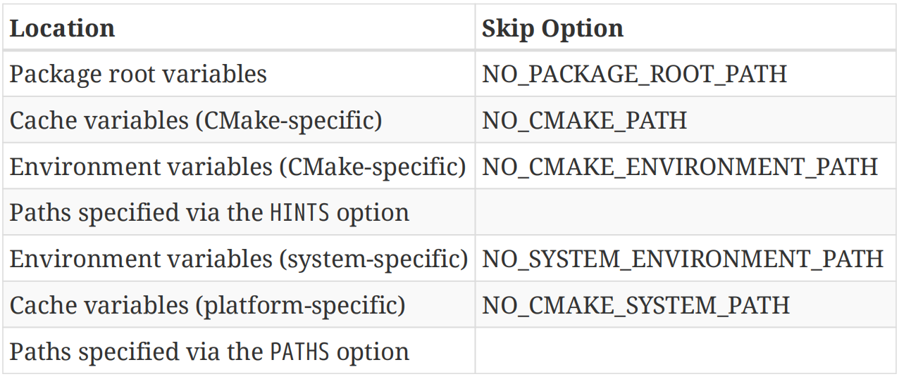
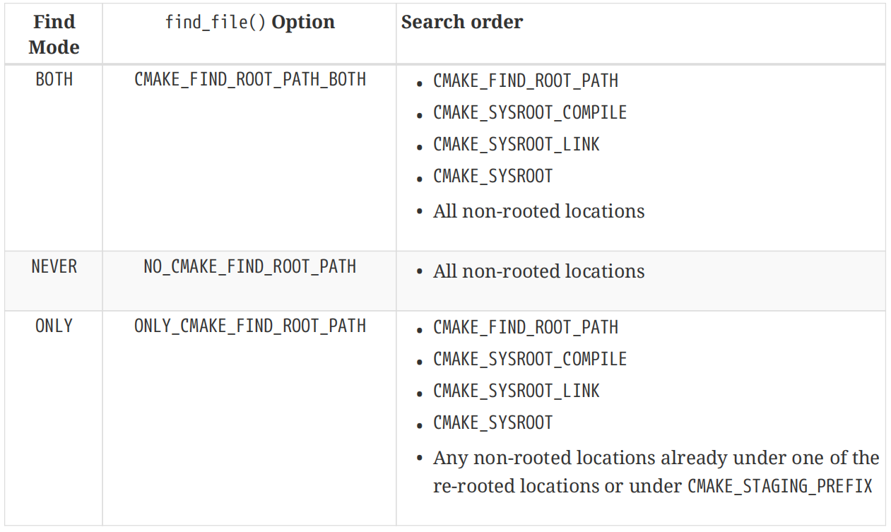
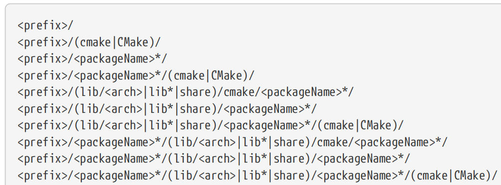
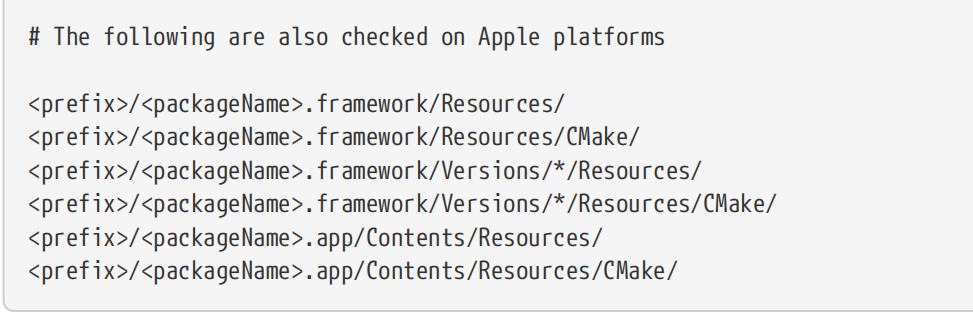
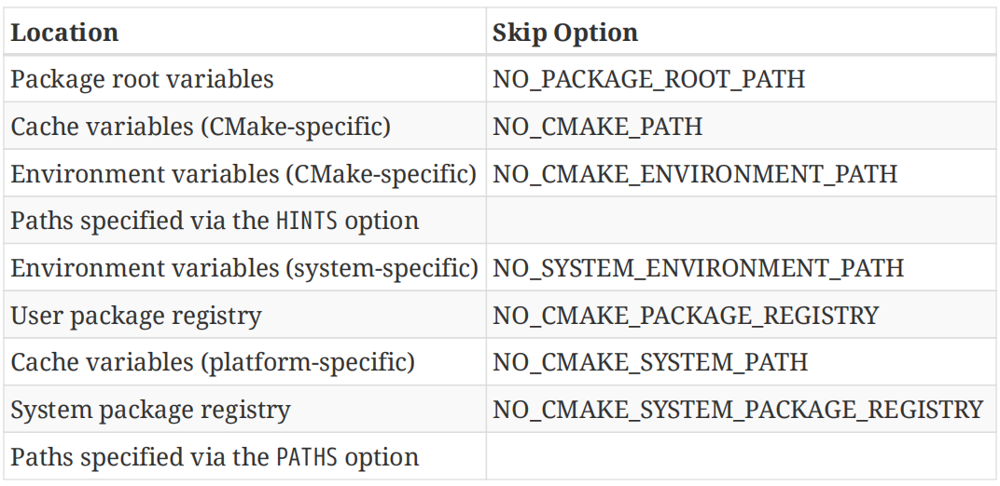
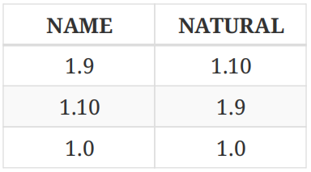
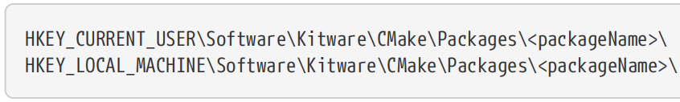
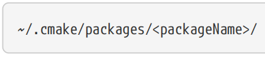
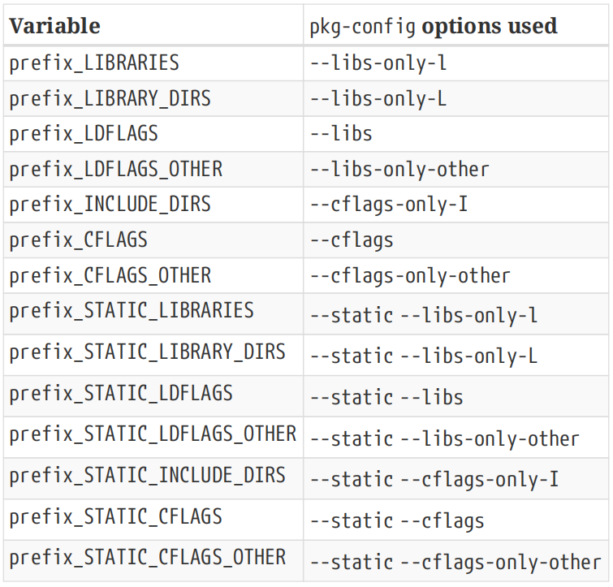

# ----Part III: The Bigger Picture----

For the lucky few, a project may be independent of anything else and only needs to satisfy mild quality constraints or perhaps none at all for throw-away experiments. The more likely scenario is that, at some point, the project needs to move beyond its own isolated existence and interact with external entities. This occurs in two directions:【翻译】对于少数幸运的人来说，一个项目可能独立于其他任何东西，只需要满足轻微的质量限制，或者对于一次性实验可能根本不需要。更有可能的情况是，在某个时候，项目需要超越其孤立的存在，与外部实体互动。这发生在两个方向上：

\#\>\>\>\>\>\>\>\>\>\>\>\>\>\>\>\>\>\>\>\>\>\>\>\>\>\>\>\>\>\>\>\>\>\>\>\>\>\>\>\>\>\>

\#(1)**Dependencies**

The project may depend on other externally provided files, libraries, executables, packages and so on. 【翻译】该项目可能依赖于其他外部提供的文件、库、可执行文件、包等。

\#(2)**Consumers**

Other projects may wish to consume the project in a variety of ways. Some may want to incorporate it at the source level, others may expect a pre-built binary package to be available. Another possibility is the assumption that the project is installed somewhere on the system.【翻译】其他项目可能希望以各种方式使用该项目。有些人可能希望在源代码级别合并它，而另一些人可能希望提供预构建的二进制包。另一种可能性是假设项目安装在系统的某个地方。

\#\<\<\<\<\<\<\<\<\<\<\<\<\<\<\<\<\<\<\<\<\<\<\<\<\<\<\<\<\<\<\<\<\<\<\<\<\<\<\<\<\<\<

Making a project available either as a standalone package or for consumption by other projects also brings an expectation of a certain level of quality. Automated testing is usually a critical part of any robust software delivery strategy, which means it must be easy to define and execute tests and also to report on the results. 【翻译】将项目作为独立包提供或供其他项目使用，也会带来对一定质量水平的期望。自动化测试通常是任何稳健的软件交付策略的关键部分，这意味着它必须易于定义和执行测试，并报告结果。

The CMake suite of tools provides assistance with all of the above. It provides commands that operate at a lower level for finding individual files, libraries, etc. and it also provides modules that build on these commands to give a higher level entry point for dependency management. The CTest framework provides a rich set of automated testing capabilities, while CPack considerably eases the process of creating packages in various formats. This part of the book covers these externally focused topics, showing how to get the most out of what CMake offers while also highlighting common mistakes and pitfalls. 【翻译】CMake工具套件为上述所有功能提供了帮助。它提供了在较低级别操作的命令，用于查找单个文件、库等，还提供了基于这些命令的模块，为依赖关系管理提供了更高级别的入口点。CTest框架提供了一套丰富的自动化测试功能，而CPack大大简化了以各种格式创建包的过程。本书的这一部分涵盖了这些以外部为重点的主题，展示了如何充分利用CMake提供的功能，同时也强调了常见的错误和陷阱。

The last chapter in this part of the book brings the reader full circle back to thinking about how to organize a project. Doing this well requires an appreciation for both the build level features and how a project will interact with other projects. With the benefit of the knowledge gained from the chapters before it, it shows how to structure and define a project to be flexible, robust and easier for developers to work with. 【翻译】本书这一部分的最后一章让读者重新思考如何组织一个项目。做好这项工作需要了解构建级功能以及项目将如何与其他项目交互。借助前几章中获得的知识，它展示了如何构建和定义一个灵活、健壮、易于开发人员使用的项目。

# Ch23. Finding Things

A project of at least modest size will quite likely rely on things provided by something outside of the project itself. For example, it may expect a particular library or tool to be available, or it may need to know the location of a specific configuration file or a header for a library it uses. At a higher level, the project may want to find a complete package that potentially defines a whole range of things including targets, functions, variables and just about anything else a regular CMake project might define.

【译】一个规模适中的项目很可能依赖于项目本身之外的东西。例如，它可能期望特定的库或工具可用，或者它可能需要知道特定配置文件的位置或它使用的库的头部。在更高的层次上，项目可能希望找到一个完整的包，该包可能定义了一系列的东西，包括目标、函数、变量以及常规CMake项目可能定义的任何其他东西。

To assist with this, CMake provides a variety of features which allow projects to find various things and even to make themselves easy to find and be incorporated into other projects. Various find\_…() commands provide the ability to search for specific files, libraries or programs, or indeed for an entire package. CMake modules also add the ability to use pkg-config to provide information about external packages, while other modules facilitate writing package files for other projects to consume. This chapter covers CMake’s support for searching for something already available on the file system. The ability to download missing dependencies is covered in “Chapter 27, External Content” and preparing a project for being found by other projects is addressed in Section 25.7, “Writing A Config Package File”.

【译】为了帮助实现这一点，CMake提供了各种功能，使项目能够找到各种东西，甚至使自己易于找到并融入其他项目。各种find\_…()命令提供了搜索特定文件、库或程序，甚至整个包的能力。CMake模块还增加了使用pkg-config提供外部包信息的能力，而其他模块则便于编写包文件供其他项目使用。本章介绍CMake对搜索文件系统上已有内容的支持。下载缺失依赖项的能力在“第27章，外部内容”中有所介绍，为其他项目找到项目做准备的能力在第25.7节“编写配置包文件”中有所说明。

The basic idea of searching for something is relatively straightforward, but as will become apparent, the details of how the search is conducted can be quite involved. In many cases, the default behaviors are appropriate, but an understanding of the search locations and their ordering can allow projects to tailor the search to account for non-standard behaviors and unusual circumstances.

【译】搜索某物的基本思想相对简单，但很明显，如何进行搜索的细节可能非常复杂。在许多情况下，默认行为是合适的，但了解搜索位置及其顺序可以使项目根据非标准行为和异常情况定制搜索。

## 23.1. Finding Files and Paths

Conceptually, the most basic search task is to find a specific file and the most direct way to achieve this is with the find_file() command. It also serves as a good introduction to the whole family of find\_…() commands, since they all share many of the same options and have similar behavior. The full syntax of this command is as follows:

【译】从概念上讲，最基本的搜索任务是找到一个特定的文件，实现这一点的最直接方法是使用find_file()命令。它还可以很好地介绍整个find\_…()命令家族，因为它们都有许多相同的选项，并且具有相似的行为。此命令的完整语法如下：

\`\`\`cmake

find_file(outVar

name \| NAMES name1 \[name2...\]

\[HINTS path1 \[path2...\] \[ENV var\]...\]

\[PATHS path1 \[path2...\] \[ENV var\]...\]

\[PATH_SUFFIXES suffix1 \[suffix2 ...\]\]

\[NO_DEFAULT_PATH\]

\[NO_PACKAGE_ROOT_PATH\]

\[NO_CMAKE_PATH\]

\[NO_CMAKE_ENVIRONMENT_PATH\]

\[NO_SYSTEM_ENVIRONMENT_PATH\]

\[NO_CMAKE_SYSTEM_PATH\]

\[CMAKE_FIND_ROOT_PATH_BOTH \|

ONLY_CMAKE_FIND_ROOT_PATH \|

NO_CMAKE_FIND_ROOT_PATH\]

\[DOC "description"\]

)

\`\`\`

The command can search for a single file name or it can be given a list of names with the NAMES option. A list can be useful when the file being searched for may have a few variations on its name, such as different operating system distributions choosing different naming conventions, incorporating version numbers or not, accounting for a file changing names from one release to another and so on. The names should be listed in preferred order, since the search will stop at the first one found (the complete set of search locations is checked for a particular name before moving on to the next name). When specifying names that contain some form of version numbering, the CMake documentation recommends listing the name(s) without version details ahead of those that do so that locally built files are more likely to be found ahead of files provided by the operating system.

【译】该命令可以搜索单个文件名，也可以使用names选项为其提供名称列表。当正在搜索的文件的名称可能有一些变化时，列表可能很有用，例如不同的操作系统发行版选择不同的命名约定，是否包含版本号，考虑文件从一个版本更改到另一个版本的名称等等。名称应按优先顺序列出，因为**搜索将在找到的第一个位置停止**（在继续下一个名称之前，会检查完整的搜索位置以查找特定名称）。当指定包含某种版本号的名称时，CMake文档建议在没有版本详细信息的名称之前列出这些名称，这样本地构建的文件更有可能在操作系统提供的文件之前找到。

The search will be conducted over a set of locations checked according to a well defined order. Most locations have an associated option which will cause that location to be skipped if the option is present, thereby allowing the search to be tailored as needed. The following table summarizes the search order:

【译】搜索将在一组根据明确顺序检查的位置上进行。大多数位置都有一个相关的选项，如果该选项存在，则会跳过该位置，从而允许根据需要定制搜索。下表总结了搜索顺序：

**\#(1)Package root variables**

The first location searched only applies when find_file() is invoked from within a Find module (discussed later in this chapter). It was initially added as a search location in CMake 3.9.0, but was removed in 3.9.1 due to backward compatibility issues. It was then re-added again in CMake 3.12 with the problems addressed. Further discussion of this search location is deferred to Section 23.5, “Finding Packages” where its use is more relevant.

【译】搜索的第一个位置仅适用于从find模块中调用find_file()时（本章稍后讨论）。它最初在CMake 3.9.0中作为搜索位置添加，但由于向后兼容性问题，在3.9.1中被删除。然后在CMake 3.12中再次添加，并解决了问题。关于此搜索位置的进一步讨论将推迟到第23.5节“查找包”，其中其使用更为相关。

\#(2)**Cache variables (CMake-specific)**

The CMake-specific cache variable locations are derived from the cache variables CMAKE_PREFIX_PATH, CMAKE_INCLUDE_PATH and CMAKE_FRAMEWORK_PATH. Of these, CMAKE_PREFIX_PATH is perhaps the most convenient, as setting it works not just for find_file(), but also for all the other find\_…() commands. It represents a base point below which a typical directory structure of bin, lib, include and so on is expected and each find\_…() command appends its own subdirectory to construct search paths. In the case of find_file(), for each entry in CMAKE_PREFIX_PATH, the directory \<prefix\>/include will be searched. If the CMAKE_LIBRARY_ARCHITECTURE variable is set, then the architecture-specific directory \<prefix\>/include/\${CMAKE_LIBRARY_ARCHITECTURE} will be searched first to ensure architecturespecific locations take precedence over generic locations. The CMAKE_LIBRARY_ARCHITECTURE variable is normally set automatically by CMake and projects should not generally try to set it themselves.

【译】CMake特定的缓存变量位置来源于缓存变量CMAKE_PREFIX_PATH、CMAKE_INCLUDE_PATH和CMAKE_FRAMEWORK_PATH。其中，CMAKE_PREFIX_PATH可能是最方便的，因为设置它不仅适用于find_file()，也适用于所有其他find\_…()命令。它表示一个基点，低于该基点，将出现bin、lib、include等典型的目录结构，每个find\_…()命令都会附加自己的子目录来构建搜索路径。在find_file()的情况下，对于CMAKE_PREFIX_PATH中的每个条目，将搜索目录\<PREFIX\>/include。如果设置了CMAKE_LIBRARY_ARCHITECTURE变量，则将首先搜索特定于体系结构的目录\<prefix\>/include/\${CMAKE_LIBRY_ARCHITECTURE}，以确保特定于体系架构的位置优先于通用位置。CMAKE_LIBRARY_ARCHITECTURE变量通常由CMAKE自动设置，项目通常不应尝试自行设置。

For the cases where a more specific include or framework path needs to be searched and it is not part of a standard directory layout or package, the CMAKE_INCLUDE_PATH and CMAKE_FRAMEWORK_PATH variables can be used. They each provide a list of directories to be searched, but unlike CMAKE_PREFIX_PATH, no include subdirectory is appended. CMAKE_INCLUDE_PATH is supported by find_file() and find_path(), whereas CMAKE_FRAMEWORK_PATH is supported by those two commands and by find_library(). Other than that, these two sets of paths are handled in the same way. See Section 23.1.1, “Apple-specific Behavior” further below for additional details.【翻译】对于需要搜索更具体的包含或框架路径并且它不是标准目录布局或包的一部分的情况，可以使用CMAKE_include_path和CMAKE_framework_path变量。它们各自提供了一个要搜索的目录列表，但与CMAKE_PREFIX_PATH不同，没有附加包含子目录。CMAKE_INCLUDE_PATH由find_file()和find_PATH()支持，而CMAKE_FRAMEWORK_PATH由这两个命令和find_library()支持。除此之外，这两组路径的处理方式是相同的。更多详细信息，请参阅下文第23.1.1节“苹果特定行为”。

**\#(3)Environment variables (CMake-specific)**

The CMake-specific environment variable locations are very similar to the cache variable locations. The environment variables CMAKE_PREFIX_PATH, CMAKE_INCLUDE_PATH and CMAKE_FRAMEWORK_PATH are treated in the same way as the same-named cache variables, except that on Unix platforms, each list item will be separated by a colon (:) instead of a semi-colon (;). This is to allow the environment variables to use platform-specific path lists defined in the same style as other path lists for each platform. 【译】CMake特定的环境变量位置与缓存变量位置非常相似。环境变量CMAKE_PREFIX_PATH、CMAKE_INCLUDE_PATH和CMAKE_FRAMEWORK_PATH的处理方式与同名缓存变量相同，除了在Unix平台上，每个列表项将用冒号（：）而不是分号（；）分隔。这是为了允许环境变量使用以与每个平台的其他路径列表相同的样式定义的特定于平台的路径列表。

**\#(4)Environment variables (system-specific)**

The system-specific environment variables are INCLUDE and PATH. Both may contain a list separated by the platform-specific path separator (colon on Unix systems, semi-colon on Windows), with each item being added to the set of search locations (INCLUDE is added before PATH). 【译】系统特定的环境变量是INCLUDE和PATH。两者都可能包含一个由特定于平台的路径分隔符分隔的列表（Unix系统上为冒号，Windows上为分号），每个项目都会添加到搜索位置集中（INCLUDE添加在path之前）。

On Windows only (including Cygwin), the PATH entries will be further processed in a more complex way. For each item in PATH, a base path will be computed by dropping any trailing bin or sbin subdirectory from the end. This base path is then used to add one or two paths to the search locations. If CMAKE_LIBRARY_ARCHITECTURE is defined, \<base\>/include/\${CMAKE_LIBRARY_ARCHITECTURE} is added. After that, the \<base\>/include path is added to the set of search paths regardless of whether CMAKE_LIBRARY_ARCHITECTURE is defined. In the search path ordering, these paths are placed immediately before the unmodified PATH item itself. For example, if the PATH environment variable was set to C:\foo\bin;D:\bar and CMAKE_LIBRARY_ARCHITECTURE set to somearch, the following set of search paths would be added in the order shown: 【翻译】仅在Windows（包括Cygwin）上，PATH条目将以更复杂的方式进一步处理。对于PATH中的每个项目，将通过从末尾删除任何尾随bin或sbin子目录来计算基路径。然后，使用此基本路径向搜索位置添加一条或两条路径。如果定义了CMAKE_LIBRARY_ARCHITECTURE，则添加\<base\>/include/\${CMAKE_LIBARRY_ARCHI CTURE}。之后，无论是否定义了CMAKE_LIBRARY_ARCHITECTURE，都会将\<base\>/include路径添加到搜索路径集中。在搜索路径排序中，这些路径被放置在未修改的path项本身之前。例如，如果PATH环境变量设置为C:\foo\bin；D： \bar和CMAKE_LIBRARY_ARCHITECTURE设置为somearch，将按所示顺序添加以下搜索路径集：

• C:\foo\include\somearch

• C:\foo\include

• C:\foo\bin

• D:\bar\include\somearch

• D:\bar\include

• D:\bar

**\#(5)Cache variables (platform-specific)**

The platform-specific cache variable locations are very similar to those used for the CMakespecific ones. The names change slightly but the pattern is the same. The variable names are CMAKE_SYSTEM_PREFIX_PATH, CMAKE_SYSTEM_INCLUDE_PATH and CMAKE_SYSTEM_FRAMEWORK_PATH. These platform-specific variables are not intended to be set by the project or the developer. Rather, they are set automatically by CMake as part of setting up the platform toolchain so that they reflect locations specific to the platform and compilers being used. The exception to this is where a developer provides their own toolchain file, in which case it may be appropriate to set these variables within the toolchain file. 【翻译】特定于平台的缓存变量位置与用于CMake特定缓存变量的位置非常相似。名字略有变化，但模式是一样的。变量名为CMAKE_SYSTEM_PREFIX_PATH、CMAKE_SYSTEM_INCLUDE_PATH和CMAKE_SYSTEM \_FRAMEWORK_PATH。这些特定于平台的变量不是由项目或开发人员设置的。相反，它们是由CMake自动设置的，作为设置平台工具链的一部分，以便它们反映特定于所使用的平台和编译器的位置。例外情况是开发人员提供自己的工具链文件，在这种情况下，在工具链文件中设置这些变量可能是合适的。

**\#(6)HINTS and PATHS**

**\#\>\>\>\>\>\>\>\>\>\>\>\>\>\>\>\>\>\>\>\>\>\>\>\>\>\>\>\>\>\>\>\>\>\>\>\>\>\>\>\>\>\>**

Each of the various groups of variables discussed above is intended to be set by something outside of the project, but the HINTS and PATHS options are where the project itself should inject additional search paths. The main difference between HINTS and PATHS is that PATHS are generally fixed locations that never change and don’t depend on anything else, whereas HINTS are usually computed from other values, such as the location of something already found previously or a path dependent on a variable or property value. PATHS are the last directories searched, but HINTS are searched before any platform- or system-specific locations.【翻译】上面讨论的每组变量都是由项目外部的东西设置的，但HINTS和PATHS选项是项目本身应该注入额外搜索路径的地方。HINTS和PATHS之间的主要区别在于，PATHS通常是固定的位置，永远不会改变，也不依赖于其他任何东西，而HINTS通常是根据其他值计算的，例如之前已经找到的东西的位置，或者依赖于变量或属性值的路径。PATH是最后搜索的目录，但HINTS在任何特定于平台或系统的位置之前搜索。

Both HINTS and PATHS support specifying environment variables which may contain a list of paths in the host’s native format (i.e. colon-separated for Unix systems, semi-colon separated on Windows). This is done by preceding the name of the environment variable with ENV, such as PATHS ENV FooDirs.【翻译】HINTS和PATHS都支持指定环境变量，这些变量可能包含主机本机格式的路径列表（即Unix系统用冒号分隔，Windows上用分号分隔）。这是通过在环境变量的名称前面加上ENV来实现的，例如PATHS ENV FooDirs。

\#\<\<\<\<\<\<\<\<\<\<\<\<\<\<\<\<\<\<\<\<\<\<\<\<\<\<\<\<\<\<\<\<\<\<\<\<\<\<\<\<\<\<

All but the HINTS and PATHS search locations have an associated skip option of the form NO\_…\_PATH which can be used to skip just that set of locations. In addition, the NO_DEFAULT_PATH option can be used to bypass all but the HINTS and PATHS locations, forcing the command to search just specific places controlled by the project. 【翻译】除了HINTS和PATHS搜索位置外，所有搜索位置都有一个NO\_…\_PATH形式的相关跳过选项，可用于跳过该组位置。此外，NO_DEFAULT_PATH选项可用于绕过除HINTS和PATHS位置之外的所有位置，迫使命令仅搜索项目控制的特定位置。

The PATH_SUFFIXES option can be used to provide a list of additional subdirectories to check below each search location. Each search location is used with each suffix in turn, then without any suffix at all before moving on to the next search location. Use this option with care, as it greatly expands the total number of locations to be searched.【翻译】PATH_SUFFIXES选项可用于在每个搜索位置下方提供要检查的其他子目录列表。每个搜索位置依次使用每个后缀，然后在移动到下一个搜索位置之前根本不使用任何后缀。小心使用此选项，因为它大大扩展了要搜索的位置总数。

In many cases, projects only need to specify a single file name to search for and the complexities of the search order are not of particular interest. Perhaps just a few additional paths to search might need to be provided (equivalent to the PATHS option). In such cases, a shorter form of the command can be used:【翻译】在许多情况下，项目只需要指定一个要搜索的文件名，搜索顺序的复杂性并不特别令人感兴趣。也许只需要提供一些额外的搜索路径（相当于paths选项）。在这种情况下，可以使用命令的较短形式：

\`\`\`cmake

find_file(outVar name \[path1 \[path2...\]\])

\`\`\`

Whether the short or long form is used, the ordering of the search locations is designed to search in more specific locations ahead of more generic ones. While this is typically the desired behavior, there may be situations where this is not the case. For example, a project may wish to always look in specific paths first ahead of any search locations provided through cache or environment variables. Projects can enforce a different priority by calling find_file() multiple times with different options controlling the search locations. Once the file is found, the location is cached and all subsequent calls will skip their search. This is where the various NO\_…\_PATH options are most useful. For example, the following enforces searching in the location /opt/foo/include first and only if not found there will the full set of default locations be searched:【翻译】无论使用短格式还是长格式，搜索位置的排序都是为了在更通用的位置之前搜索更具体的位置。虽然这通常是所需的行为，但在某些情况下可能不是这样。例如，一个项目可能希望在通过缓存或环境变量提供的任何搜索位置之前，始终先查找特定路径。项目可以通过多次调用find_file（）并使用不同的选项控制搜索位置来强制执行不同的优先级。一旦找到文件，位置就会被缓存，所有后续调用都将跳过搜索。这就是各种NO\_…\_PATH选项最有用的地方。例如，以下内容强制首先在/opt/foo/include位置进行搜索，只有在未找到的情况下，才会搜索全部默认位置：

\#------------------------------------\>\>\>\>\>\>

find_file(FOO_HEADER foo.h PATHS /opt/foo/include NO_DEFAULT_PATH)

find_file(FOO_HEADER foo.h)

\#------------------------------------\<\<\<\<\<\<

An important requirement for this to work is that the same result variable must be used for each call. It is that cache variable that gets set and that controls skipping subsequent calls once the file has been found. The DOC option can be used to specify documentation for the cache variable storing the result, but projects frequently omit it. Choosing a cache variable name that is self-documenting should make the need for explicit documentation unnecessary. By convention, these cache variables are usually all uppercase and use underscores to separate words.

【翻译】实现这一点的一个重要要求是，每次调用都必须使用相同的结果变量。正是该缓存变量被设置，并控制在找到文件后跳过后续调用。DOC选项可用于指定存储结果的缓存变量的文档，但项目经常省略它。选择一个自文档化的缓存变量名称应该不需要显式的文档。按照惯例，这些缓存变量通常都是大写的，并使用下划线分隔单词。

### 23.1.1. Apple-specific Behavior

Although the find_file() command can be used to find any file, it has its origins in searching for header files. This is why some of the default search paths have an include subdirectory appended. On Apple platforms, frameworks sometimes contain their own header files (see Section 22.3, “Frameworks”) and the find_file() command has additional behaviors related to searching in the appropriate subdirectories within them. For each search location, the command may treat the location as a framework, as an ordinary directory or both. The behavior is controlled by the CMAKE_FIND_FRAMEWORK variable, which is expected to hold one of the following values: 【翻译】虽然find_file（）命令可用于查找任何文件，但它起源于搜索头文件。这就是为什么一些默认搜索路径附加了include子目录的原因。在Apple平台上，框架有时包含自己的头文件（见第22.3节“框架”），find_file（）命令具有与在其中相应的子目录中搜索相关的其他行为。对于每个搜索位置，该命令可以将该位置视为框架、普通目录或两者兼而有之。行为由CMAKE_FIND_FRAMEWORK变量控制，该变量应包含以下值之一：

• FIRST

• LAST

• ONLY

• NEVER

FIRST means to treat the search location as though it was the top directory of a framework and to append the appropriate subdirectories to descend into the Headers location within it. If the named file cannot be found there, then the search location is treated as an ordinary directory rather than a framework and searched again. LAST reverses that order, ONLY will not treat the location as an ordinary directory and NEVER will skip the step that treats the location as a framework. The default for Apple systems is FIRST, which is usually the desired behavior.【翻译】FIRST意味着将搜索位置视为框架的顶部目录，并附加适当的子目录以下降到其中的Header位置。如果在那里找不到指定的文件，则将搜索位置作为普通目录而不是框架，并再次搜索。LAST颠倒了顺序，ONLY不会将该位置视为普通目录，也永远不会跳过将该位置作为框架的步骤。Apple系统的默认设置是FIRST，这通常是所需的行为。

### 23.1.2. Cross-compilation Controls

For cross-compiling scenarios, the set of search locations becomes considerably more complex. Cross compiling toolchains are often collected under their own directory structure to keep them separate from the default host toolchain, so when conducting searches for a particular file, it is generally desirable to first look in the toolchain’s directory structure ahead of those of the host so that a target platform-specific version of the file will be found. This is especially important when finding programs and libraries, but even for finding files, it may be the case that the content of files could change between platforms (e.g. a platform-specific configuration header).【翻译】对于交叉编译场景，搜索位置集变得更加复杂。交叉编译工具链通常收集在它们自己的目录结构下，以使其与默认的宿主工具链分开，因此在搜索特定文件时，通常最好先查看工具链的目录结构，然后再查看宿主的目录结构。这在查找程序和库时尤为重要，但即使是查找文件，文件的内容也可能在平台之间发生变化（例如特定于平台的配置标头）。

To support cross-compilation scenarios, the entire set of search locations can be re-rooted to a different part of the file system. The CMAKE_FIND_ROOT_PATH variable can be set to a list of additional directories at which to re-root the set of search locations (i.e. prepend each item in the list to every search location). The CMAKE_SYSROOT variable can also affect the search root in a similar way. This variable is intended to specify a single directory acting as the system root for a cross-compiling scenario and it should only be set in a toolchain file, never by a project itself. It affects flags used during compilation as well. From CMake 3.9, the more specialized variables CMAKE_SYSROOT_COMPILE and CMAKE_SYSROOT_LINK also have a similar effect. If any of the non-rooted locations are already under one of the locations specified by CMAKE_FIND_ROOT_PATH, CMAKE_SYSROOT, CMAKE_SYSROOT_COMPILE or CMAKE_SYSROOT_LINK, it will not be re-rooted. A non-rooted path that sits under a path specified by the variable CMAKE_STAGING_PREFIX will also not be re-rooted. Furthermore, an undocumented behavior of all find\_…() commands is to not re-root any non-rooted path that starts with a ~ character (this is intended to avoid re-rooting directories that sit under the user’s home directory). 【翻译】为了支持交叉编译场景，可以将整个搜索位置集重新定位到文件系统的不同部分。CMAKE_FIND_ROOT_PATH变量可以设置为一个额外目录的列表，在该列表中重新根目录搜索位置集（即将列表中的每个项目添加到每个搜索位置）。CMAKE_SYSROOT变量也可以以类似的方式影响搜索根。此变量旨在指定一个目录作为交叉编译场景的系统根目录，并且只能在工具链文件中设置，而不能由项目本身设置。它也会影响编译过程中使用的标志。从CMake 3.9开始，更专业的变量CMake_SYSROOT_COMPILE和CMake_SYSROOT_LINK也有类似的效果。如果任何非根位置已经位于CMAKE_FIND_ROOT_PATH、CMAKE_SYSROOT、CMAKE-SYSROOT_COMPILE或CMAKE_SYSROOT_LINK指定的位置之一下，则不会重新根。位于变量CMAKE_STAGING_PREFIX指定的路径下的非根路径也不会被重新根化。此外，所有find\_…（）命令的一个未记录的行为是不重新为任何以~字符开头的非根路径建立根（这是为了避免重新为用户主目录下的目录建立根）。

The default order of searching among the re-rooted and non-rooted locations is controlled by the CMAKE_FIND_ROOT_PATH_MODE_INCLUDE variable. The behavior specified by that variable can also be overridden on a per-call basis by providing one of the CMAKE_FIND_ROOT_PATH_BOTH, ONLY_CMAKE_FIND_ROOT_PATH or NO_CMAKE_FIND_ROOT_PATH options to the find_file() command. The following table summarizes the effects of this mode variable, the associated options and the final search order: 【翻译】在重新根和非根位置之间搜索的默认顺序由CMAKE_FIND_ROOT_PATH_MODE_INCLUDE变量控制。通过向FIND_file（）命令提供CMAKE_FIND_ROOT_PATH_BOTH、ONLY_MAKE_FIND_ROOT\_ PATH或NO_CMAKE_FIND \_ROOT_PATH选项之一，也可以在每次调用的基础上覆盖该变量指定的行为。下表总结了此模式变量、相关选项和最终搜索顺序的影响：

It may be desirable to force find_file() to ignore particular paths that may contain a matching file known to be unsuitable. In a cross-compiling scenario, ignoring some specific host paths may be needed to ensure target-specific rather than host-specific files are found. Projects may set the CMAKE_IGNORE_PATH variable to a list of directories to exclude from the search. These paths are not recursive, so they cannot be used to exclude a whole section of a directory structure, they need to specify each directory explicitly. The CMAKE_SYSTEM_IGNORE_PATH variable does the same thing, but it is intended to be populated by the toolchain setup. Both of these …IGNORE_PATH variables apply regardless of whether cross-compiling or not, but it would be unusual for them to be set when not cross-compiling.【翻译】可能需要强制find_file（）忽略可能包含已知不合适的匹配文件的特定路径。在交叉编译场景中，可能需要忽略某些特定的主机路径，以确保找到特定于目标而非特定于主机的文件。项目可以将CMAKE_IGNORE_PATH变量设置为要从搜索中排除的目录列表。这些路径不是递归的，因此不能用于排除目录结构的整个部分，它们需要明确指定每个目录。CMAKE_SYSTEM_IGNORE_PATH变量执行相同的操作，但它旨在由工具链设置填充。无论是否交叉编译，这两个…IGNORE_PATH变量都适用，但在不交叉编译时设置它们是不寻常的。

Developers should also be aware that find_file() can only provide one location, but some cross compiling situations support build arrangements that can switch between device and simulator builds without re-running CMake. This means that if the results of find_file() depend on which of the two is being used, they are unreliable. This aspect is even more important for finding libraries and is discussed in more detail in Section 23.4, “Finding Libraries” further below.【翻译】开发人员还应该意识到，find_file（）只能提供一个位置，但一些交叉编译情况支持构建安排，可以在设备和模拟器构建之间切换，而无需重新运行CMake。这意味着，如果find_file（）的结果取决于使用哪一个，则它们是不可靠的。这一方面对于查找库更为重要，下文第23.4节“查找库”将对此进行更详细的讨论。

## 23.2. Finding Paths

A project may wish to find the directory containing a particular file rather than the actual file itself. The find_path() command provides this functionality and is identical to find_file() in every way except that the directory of the file to be found is stored in the result variable.【翻译】项目可能希望找到包含特定文件的目录，而不是实际文件本身。find_path（）命令提供了此功能，除了要查找的文件的目录存储在结果变量中之外，它在各方面都与find_file（）相同。

## 23.3. Finding Programs 

Finding programs is only slightly different to finding files, with the find_program() command taking exactly the same set of arguments as find_file(), plus one more optional argument, NAMES_PER_DIR. The short form of the command is also supported. The following describes the differences for find_program() compared to find_file(), and while it may seem complicated, for the most part it just describes the differences one might logically expect but with a few exceptions highlighted: 【翻译】查找程序与查找文件仅略有不同，find_program（）命令采用与find_file（）完全相同的参数集，再加上一个可选参数NAMES_PER_DIR。还支持该命令的缩写形式。以下描述了find_program（）与find_file（）的差异，虽然它看起来很复杂，但在很大程度上，它只是描述了人们在逻辑上可能期望的差异，但突出显示了一些例外情况：

**\#(1)Cache variables (CMake-specific)**

• When searching under CMAKE_PREFIX_PATH, find_file() appends include to each item. find_program() instead appends bin and sbin as search locations to be checked. The CMAKE_LIBRARY_ARCHITECTURE variable has no effect for find_program(). 【翻译】在CMAKE_PREFIX_PATH下搜索时，find_file（）会将include附加到每个项目。find_program（）会附加bin和sbin作为要检查的搜索位置。CMAKE_LIBRARY_ARCHITECTURE变量对find_program（）没有影响。

• CMAKE_PROGRAM_PATH replaces CMAKE_INCLUDE_PATH but is otherwise used in exactly the same way. CMAKE_PROGRAM_PATH is used only by find_program(). 【翻译】CMAKE_PROGRAM_PATH取代了CMAKE_INCLUDE_PATH，但在其他方面使用方式完全相同。CMAKE_PROGRAM_PATH仅由find_PROGRAM（）使用。

• CMAKE_APPBUNDLE_PATH replaces CMAKE_FRAMEWORK_PATH but is otherwise used in exactly the same way. It is used only by find_program() and find_package().【翻译】CMAKE_APPBUNDLE_PATH取代了CMAKE_FRAMEWORK_PATH，但在其他方面的使用方式完全相同。它仅由find_program（）和find_package（）使用。

**\#(2)Environment variables (system-specific)**

• The search locations for standard system environment variables are handled in a considerably simpler manner. INCLUDE has no meaning for find_program() and each item in the PATH is checked without any modification. The behavior is the same on all platforms.【翻译】标准系统环境变量的搜索位置以相当简单的方式处理。INCLUDE对find_program（）没有任何意义，PATH中的每个项目都会被检查，而不会进行任何修改。所有平台上的行为都是一样的。

**\#(3)General**

• Normally, all search locations are checked for a given name before moving on to search for the next name in the list when the NAMES option is used to provide multiple names. The find_program() command supports a NAMES_PER_DIR option which reverses this order, checking each name for a particular search location before moving on to the next location. The NAMES_PER_DIR option was added in CMake 3.4. 【翻译】通常，当使用NAMES选项提供多个名称时，在继续搜索列表中的下一个名称之前，会检查所有搜索位置的给定名称。find_program（）命令支持NAMES_PER_DIR选项，该选项颠倒了此顺序，在移动到下一个位置之前，检查特定搜索位置的每个名称。CMake 3.4中添加了NAMES_PER_DIR选项。

• On Windows (including Cygwin and MinGW), file extensions .com and .exe are automatically checked as well, so there is no need to provide such extensions as part of the program name to find. These extensions are checked first before names without the extensions. Note that .bat and .cmd files will not be searched for automatically. 【翻译】在Windows（包括Cygwin和MinGW）上，文件扩展名.com和.exe也会自动检查，因此不需要在程序名称中提供此类扩展名来查找。在没有扩展名的名称之前，首先检查这些扩展名。请注意，.bat和.cmd文件不会自动搜索。

• Whereas find_file() uses CMAKE_FIND_FRAMEWORK to determine the search order between framework and non-framework paths, find_program() uses CMAKE_FIND_APPBUNDLE which provides similar control between app bundle and non-bundle paths. The supported values are the same for both variables and they have the expected equivalent meaning for bundles. Whereas finding files will look in a Headers subdirectory, finding programs will look in the Contents/MacOS subdirectory and set the result to the executable within the app bundle. 【翻译】find_file（）使用CMAKE_find_FRAMEWORK来确定框架和非框架路径之间的搜索顺序，而find_program（）则使用CMAKE_find_APPBUNDLE，它在应用程序包和非包路径之间提供类似的控制。这两个变量的支持值是相同的，并且它们对bundle具有预期的等效含义。查找文件将在Headers子目录中查找，而查找程序将在Contents/MacOS子目录中查看，并将结果设置为应用程序包中的可执行文件。

• CMAKE_FIND_ROOT_PATH_MODE_INCLUDE has no effect on find_program(), it is replaced by the CMAKE_FIND_ROOT_PATH_MODE_PROGRAM variable which has the equivalent effect but applies exclusively to find_program() only. When cross-compiling, it is usually the case that it is a host platform tool being sought rather than a program on the target platform, so CMAKE_FIND_ROOT_PATH_MODE_PROGRAM is frequently set to NEVER.【翻译】CMAKE_FIND_ROOT_PATH_MODE_INCLUDE对FIND_program（）没有影响，它被具有等效效果但仅适用于FIND_program。交叉编译时，通常情况下，它是一个正在寻找的主机平台工具，而不是目标平台上的程序，因此CMAKE_FIND_ROOT_PATH_MODE_program经常设置为NEVER。

## 23.4. Finding Libraries

Finding libraries is also similar to finding files, with the find_library() command supporting the same set of options as find_file() plus an additional NAMES_PER_DIR option. The following differences apply: 【翻译】查找库也类似于查找文件，find_library（）命令支持与find_file（）相同的选项集，外加一个额外的NAMES_PER_DIR选项。以下差异适用：

**\#(1)Cache variables (CMake-specific)**

\#\>\>\>\>\>\>\>\>\>\>\>\>\>\>\>\>\>\>\>\>\>\>\>\>\>\>\>\>\>\>\>\>\>\>\>\>\>\>\>\>\>\>

• When searching under CMAKE_PREFIX_PATH, find_file() appends include to each item, whereas find_library() instead appends lib. The CMAKE_LIBRARY_ARCHITECTURE variable is also honored in the same way as for find_file(). 【翻译】在CMAKE_PREFIX_PATH下搜索时，find_file（）会将include附加到每个项目上，而find_library（）则会附加lib。CMAKE_LIBRARY_ARCHITECTURE变量的处理方式也与find_file（）相同。

• CMAKE_LIBRARY_PATH replaces CMAKE_INCLUDE_PATH but is otherwise used in exactly the same way. CMAKE_LIBRARY_PATH is used only by find_library(). The CMAKE_FRAMEWORK_PATH variable is used in exactly the same way as for find_file(). 【翻译】CMAKE_LIBRARY_PATH取代了CMAKE_INCLUDE_PATH，但在其他方面的使用方式完全相同。CMAKE_LIBRARY_PATH仅由find_LIBRARY（）使用。CMAKE_FRAMEWORK_PATH变量的使用方式与find_file（）完全相同。

\#\<\<\<\<\<\<\<\<\<\<\<\<\<\<\<\<\<\<\<\<\<\<\<\<\<\<\<\<\<\<\<\<\<\<\<\<\<\<\<\<\<\<

**\#(2)Environment variables (system-specific)**

**\#\>\>\>\>\>\>\>\>\>\>\>\>\>\>\>\>\>\>\>\>\>\>\>\>\>\>\>\>\>\>\>\>\>\>\>\>\>\>\>\>\>\>**

• The search locations for standard system environment variables are handled in a very similar way to find_file(). Instead of INCLUDE, the LIB environment variable is consulted. Furthermore, the search locations based on PATH follow the same complex logic as for find_file(), except that lib is appended to each prefix rather than include. Just as for find_file(), the complex PATH logic only applies on Windows. 【翻译】标准系统环境变量的搜索位置的处理方式与find_file（）非常相似。将参考LIB环境变量而不是INCLUDE。此外，基于PATH的搜索位置遵循与find_file（）相同的复杂逻辑，除了lib附加到每个前缀而不是include。与find_file（）一样，复杂的PATH逻辑仅适用于Windows。

\#\<\<\<\<\<\<\<\<\<\<\<\<\<\<\<\<\<\<\<\<\<\<\<\<\<\<\<\<\<\<\<\<\<\<\<\<\<\<\<\<\<\<

\#(3)**General**

**\#\>\>\>\>\>\>\>\>\>\>\>\>\>\>\>\>\>\>\>\>\>\>\>\>\>\>\>\>\>\>\>\>\>\>\>\>\>\>\>\>\>\>**

• The NAMES_PER_DIR option has exactly the same meaning as it does for find_program() and was also only added in CMake 3.4.

【翻译】NAMES_PER_DIR选项的含义与find_program（）完全相同，并且仅在CMake 3.4中添加。

• Both find_file() and find_library() use CMAKE_FIND_FRAMEWORK to determine the search order between framework and non-framework paths. In the case of find_library(), if a framework is found then the name of the top level .framework directory is what is stored in the result variable. 【翻译】find_file（）和find_library（）都使用CMAKE_find_FRAMEWORK来确定框架和非框架路径之间的搜索顺序。在find_library（）的情况下，如果找到了一个框架，那么顶级.framework目录的名称就是存储在结果变量中的名称。

• CMAKE_FIND_ROOT_PATH_MODE_INCLUDE has no effect on find_library(), it is replaced by the CMAKE_FIND_ROOT_PATH_MODE_LIBRARY variable which has the equivalent effect but applies exclusively to find_library(). On Apple platforms, consider carefully before setting CMAKE_FIND_ROOT_PATH_MODE_LIBRARY to ONLY, as libraries may be built as fat binaries which support multiple target platforms. These fat binaries may not reside under target platformspecific paths, so it may still be necessary to search host platform paths to find them.【翻译】CMAKE_FIND_ROOT_PATH_MODE_INCLUDE对FIND_library（）没有影响，它被CMAKE_FIND \_ROOT_PACH_MODE_library变量替换，该变量具有等效效果，但仅适用于FIND_liibrary（）。在Apple平台上，在将CMAKE_FIND_ROOT_PATH_MODE_LIBRARY设置为ONLY之前，请仔细考虑，因为库可能被构建为支持多个目标平台的胖二进制文件。这些胖二进制文件可能不位于目标平台特定的路径下，因此可能仍然需要搜索主机平台路径来找到它们。

\#\<\<\<\<\<\<\<\<\<\<\<\<\<\<\<\<\<\<\<\<\<\<\<\<\<\<\<\<\<\<\<\<\<\<\<\<\<\<\<\<\<\<

Further behavioral differences apply when using find_library(). Platforms have different conventions for library names, such as prepending lib on most Unix platforms. The file extensions also vary considerably across platforms and DLLs on Windows can also have an associated import library with a different file extension. The find_library() command does its best to abstract away most of these differences, allowing projects to specify just the base name of the library as the name to search for. Where a directory contains both static and shared libraries, the shared library will be the one found. Most of the time, this abstraction works well, but in some circumstances it can be useful to override this behavior. One common case is to give priority to static libraries ahead of shared libraries, potentially only on some platforms and not others. The following naive example would prefer a static foobar library ahead of shared on Linux, but not on macOS or Windows:【翻译】使用find_library（）时，还会出现其他行为差异。平台对库名称有不同的约定，例如在大多数Unix平台上添加lib。文件扩展名也因平台而异，Windows上的DLL也可以有一个具有不同文件扩展名的关联导入库。find_library（）命令尽最大努力抽象掉这些差异中的大部分，允许项目仅指定库的基本名称作为搜索名称。如果目录同时包含静态库和共享库，则将找到共享库。大多数时候，这种抽象工作得很好，但在某些情况下，覆盖这种行为可能很有用。一个常见的情况是，在共享库之前优先考虑静态库，这可能只适用于某些平台，而不适用于其他平台。以下简单的例子更喜欢在Linux上共享静态foobar库，而不是在macOS或Windows上共享：

\#------------------------------------\>\>\>\>\>\>

\# WARNING: Not robust!

find_library(FOOBAR_LIBRARY NAMES libfoobar.a foobar)

\#------------------------------------\<\<\<\<\<\<

Keep in mind that the priority override only applies to libraries found within a particular directory. If the set of search locations is such that a directory containing just a shared library is searched before a directory that contains a static library, then the above technique will not result in the static library being found. The more robust way to ensure that a static library is given priority over shared libraries across all search locations is to use multiple calls to find_library() like so:【翻译】请记住，优先级覆盖仅适用于特定目录中的库。如果搜索位置的集合使得在搜索包含静态库的目录之前搜索仅包含共享库的目录，那么上述技术将无法找到静态库。确保静态库在所有搜索位置上优先于共享库的更稳健的方法是使用多次调用find_library（），如下所示：

\#------------------------------------\>\>\>\>\>\>

\# Better, static library now has priority across

\# all search locations

find_library(FOOBAR_LIBRARY libfoobar.a)

find_library(FOOBAR_LIBRARY foobar)

\#------------------------------------\<\<\<\<\<\<

Note that such techniques cannot be used on Windows because static libraries and the import library for shared libraries (i.e. DLLs) have the same file name, including suffix (e.g. foobar.lib). Therefore, the file name cannot be used to differentiate between the two types of libraries.【翻译】请注意，这些技术不能在Windows上使用，因为静态库和共享库（即DLL）的导入库具有相同的文件名，包括后缀（例如foobar.lib）。因此，文件名不能用于区分这两种类型的库。

Another complication unique to library handling is that many platforms support both 32- and 64-bit architectures and there may be both 32- and 64-bit versions of libraries installed to different locations, but with the same file names. The directory structure used to separate the different architectures on such multilib systems can vary, even between distributions for the same platform. For example, some distributions place 64-bit libraries under lib directories and 32-bit libraries under lib32, whereas others place 64-bit libraries under lib64 and the 32-bit libraries under lib. Other platforms use yet another variation, a libx32 subdirectory. CMake is generally aware of the variations and when setting up the platform defaults, it populates the global properties FIND_LIBRARY_USE_LIB32_PATHS, FIND_LIBRARY_USE_LIB64_PATHS and FIND_LIBRARY_USE_LIBX32_PATHS with appropriate values to control which architecture-specific directories should be searched first, if any. Projects can override these with their own custom prefix using the CMAKE_FIND_LIBRARY_CUSTOM_LIB_SUFFIX variable, but the need for this should be very rare. 【翻译】库处理的另一个独特复杂性是，许多平台同时支持32位和64位架构，并且可能有32位和六十四位版本的库安装在不同的位置，但文件名相同。用于分隔此类多库系统上不同架构的目录结构可能会有所不同，甚至在同一平台的发行版之间也是如此。例如，一些发行版将64位库置于lib目录下，将32位库置于lib32下，而另一些发行版则将64位库置于lib64下，将30位库置于库下。其他平台使用另一种变体，libx32子目录。CMake通常知道这些变化，在设置平台默认值时，它会用适当的值填充全局属性FIND_LIBRARY_USE_LIB32_PATHS、FIND_LIBARY_USE_LB64_PATHS和FIND_LIBARRY_USE_IBX32_PATHS，以控制应首先搜索哪些特定于体系结构的目录（如果有的话）。项目可以使用CMAKE_FIND_LIBRARY_custom_LIB_SFIX变量用自己的自定义前缀覆盖这些前缀，但这种情况应该非常罕见。

When an architecture-specific suffix is active (whether from one of the above global properties or from the CMAKE_FIND_LIBRARY_CUSTOM_LIB_SUFFIX variable), the logic used to augment the search locations with architecture-specific locations is non-trivial. Any directory anywhere in the search location path that ends with lib is augmented with an architecture-specific equivalent. This occurs recursively throughout the path, so a search location like /opt/mylib/foo/lib may result in the expanded set of search locations /opt/mylib64/foo/lib64, /opt/mylib64/foo/lib, /opt/mylib/foo/lib64 and /opt/mylib/foo/lib on some 64-bit systems. Even if a search location does not end with lib, it will still be augmented with an architecture-suffixed location, so a search location /opt/foo may result in /opt/foo64 and /opt/foo being searched on some 64-bit systems.【翻译】当体系结构特定的后缀处于活动状态时（无论是来自上述全局属性之一还是来自CMAKE_FIND_LIBRARY_CUSTOM_LIB_SFFIX变量），用于用体系结构特定位置增强搜索位置的逻辑都是非常重要的。搜索位置路径中以lib结尾的任何目录都会使用特定于架构的等效目录进行增强。这在整个路径中递归发生，因此在某些64位系统上，像/opt/mylib/foo/lib这样的搜索位置可能会导致扩展的搜索位置集/opt/mylib 64/foo/lib64、/opt/myllib 64/foo/lib、/opt/mylo/lib/foo/lib64和/opt/mylrib/foo/libb。即使搜索位置不以lib结尾，它仍然会用一个架构后缀位置进行增强，因此搜索位置/opt/foo可能会导致在某些64位系统上搜索/opt/foo64和/opt/foo。

The details of the architecture-specific search path augmentation are not typically something developers need to concern themselves with. In those situations where undesirable libraries are being found or desired libraries are being missed, it may be more straightforward to coerce the result using variables like CMAKE_LIBRARY_PATH rather than trying to manipulate the architecturespecific logic. A detailed knowledge of the intricacies involved is not typically needed, a simple awareness of the above points should generally be sufficient, if for no other reason than to reduce some of the mystery around how CMake finds libraries in architecture-specific locations.【翻译】特定于架构的搜索路径增强的细节通常不是开发人员需要关心的问题。在发现不需要的库或缺少所需库的情况下，使用CMAKE_LIBRARY_PATH等变量强制结果可能更简单，而不是试图操纵特定于架构的逻辑。通常不需要对所涉及的复杂性有详细的了解，对上述几点的简单认识通常就足够了，如果不是为了减少CMake如何在特定于架构的位置找到库的一些谜团。

Special care needs to be exercised when working with a CMake generator that supports switching between device and simulator configurations at build time. Any find_library() results would generally be unusable for such cases, since they could only ever find a library for either the device or the simulator, but not both. Even if CMake is re-run, it would retain its cached results and so would not update the library location unless the relevant cache entry was manually deleted first. This is a particularly common problem with Xcode builds where projects might want to use find_library() to locate various frameworks or common libraries such as zlib. For these situations, projects have little choice but to specify the linker flags directly without paths instead, leaving the linker to find the library on its search path. For Apple frameworks, this means specifying two values since frameworks are added using -framework \<FrameworkName\>. For ordinary libraries like zlib, the more traditional -lz would be sufficient.【翻译】使用支持在构建时在设备和模拟器配置之间切换的CMake生成器时需要特别小心。任何find_library（）结果通常都不适用于这种情况，因为它们只能为设备或模拟器找到库，而不能同时找到两者。即使重新运行CMake，它也会保留其缓存结果，因此除非先手动删除相关的缓存条目，否则不会更新库位置。在Xcode构建中，这是一个特别常见的问题，项目可能希望使用find_library（）来查找各种框架或通用库，如zlib。对于这些情况，项目别无选择，只能直接指定链接器标志而不指定路径，让链接器在其搜索路径上查找库。对于Apple框架，这意味着指定两个值，因为框架是使用-framework\<FrameworkName\>添加的。对于像zlib这样的普通库，更传统的-lz就足够了。

## 23.5. Finding Packages

The various find\_…() commands discussed in the preceding sections all focus on finding one specific item. Quite often, however, these items are just one part of a larger package and the package as a whole may have its own characteristics that projects could be interested in, such as a version number or support for certain features. Projects will generally want to find the package as a single unit rather than piece together its different parts manually.

【译】前面几节中讨论的各种find\_…()命令都集中在查找一个特定项目上。然而，这些项目往往只是更大软件包的一部分，整个软件包可能有其项目可能感兴趣的特性，例如版本号或对某些功能的支持。项目通常希望将包作为一个整体来查找，而不是手动将其不同部分拼凑在一起。

There are two main ways packages are defined in CMake, either as a module or through config details. Config details are usually provided as part of the package itself and they are more closely aligned with the functionality of the various find\_…() commands discussed in the preceding sections. Modules, on the other hand, are typically defined by something unrelated to the package (usually by CMake or by projects themselves) and as a result, they are harder to keep up to date as the package evolves over time.

【译】在CMake中定义包有两种主要方式，要么作为模块，要么通过配置细节。配置细节通常作为包本身的一部分提供，它们与前几节中讨论的各种find\_…()命令的功能更加一致。另一方面，模块通常由与包无关的东西定义（通常由CMake或项目本身定义），因此，随着包的不断发展，它们更难保持最新。

When a module or config file is loaded, it typically defines variables and imported targets for the package. These may provide the location of programs, libraries, flags to be used by consuming targets and so on. Packages can also define functions and macros, although only modules tend to do this. There is no set of requirements for what will be provided, but there are some conventions which are stated in the CMake developer manual. Project authors must consult the documentation of each module or package config to understand what it provides. As a general guide, older modules tend to provide variables that follow a fairly consistent pattern, whereas newer modules and config implementations usually define imported targets. Where both variables and imported targets are provided, projects should prefer the latter due to their superior robustness and better integration with CMake’s transitive dependency features.

【译】加载模块或配置文件时，它通常会为包定义变量和导入的目标。这些可以提供程序、库、消费目标使用的标志等的位置。包也可以定义函数和宏，尽管只有模块倾向于这样做。对将提供的内容没有一套要求，但CMake开发人员手册中规定了一些约定。项目作者必须查阅每个模块或包配置的文档，以了解它提供了什么。一般来说，较旧的模块倾向于提供遵循相当一致模式的变量，而较新的模块和配置实现通常定义导入的目标。在同时提供变量和导入目标的情况下，项目应该更喜欢后者，因为后者具有更高的鲁棒性，并且与CMake的传递依赖特性更好地集成。

#### \#find_package()短形式

Projects normally look for a package using the find_package() command, which has a short form and a long form. The short form should generally be preferred because of its greater simplicity and because it supports both module and config packages, whereas the long form does not support modules. The long form does, however, provide more control over the search, making it preferable in certain situations. The short form has only a few options:

【译】项目通常使用find_package()命令查找包，该命令有短形式和长形式。通常应首选短形式，因为它更简单，并且支持模块和配置包，而长形式不支持模块。然而，长格式确实提供了对搜索的更多控制，使其在某些情况下更可取。短形式只有几个选项：

\`\`\`cmake

find_package(packageName

\[version \[EXACT\]\]

\[QUIET\] \[REQUIRED\]

\[\[COMPONENTS\] component1 \[component2...\]\]

\[OPTIONAL_COMPONENTS component3 \[component4...\]\]

\[MODULE\]

\[NO_POLICY_SCOPE\]

)

\`\`\`

The optional version argument indicates that the package must be of the specified version or higher, but if the EXACT option is also given, then the package version must match exactly. A package may be optional, meaning the project can use it if available or work without it if the package cannot be found or is not of an appropriate version. Where a package is mandatory, the REQUIRED option should be provided to cause the command to halt with an error if the package could not be found or if the version requirements could not be met. Normally, find_package() will log messages if it is unable to find a package, but the QUIET option can be given to suppress them, which is particularly helpful for optional packages where the lack of the package should not result in warnings that may confuse the developer. QUIET also prevents the status messages that are normally printed when a package is found for the first time.

【译】可选的version参数表示包必须是指定的版本或更高版本，但如果同时给出了EXACT选项，则包版本必须完全匹配。包可能是可选的，这意味着项目可以在可用的情况下使用它，或者在找不到包或包版本不合适的情况下不使用它也可以工作。如果包是强制性的，则应提供REQUIRED选项，以便在找不到包或无法满足版本要求时，命令停止并出错。通常，如果find_package()找不到包，它会记录消息，但可以提供QUIET选项来抑制它们，这对于可选包特别有用，因为缺少包不应导致可能混淆开发人员的警告。QUIET还可以防止在首次发现包裹时通常打印的状态消息。

The component-related options allow a project to indicate what parts of the package they are interested in. Not all packages support components, it is up to the module or config implementation whether or not components are defined and what the components represent. An example where components may be useful is for a large package such as Qt where not all components might be installed. It may not be enough for a project to just say it wants Qt, it may also need to say which parts of Qt. The find_package() command allows the project to specify components as mandatory with the COMPONENTS arguments or as optional with the OPTIONAL_COMPONENTS arguments. For example, the following call requires Qt 5.9 or later to be found and the Gui component must be available. The DBus module, however, is optional. 【译】与组件相关的选项允许项目指示他们感兴趣的包的哪些部分。并非所有包都支持组件，是否定义组件以及组件代表什么取决于模块或配置实现。组件可能有用的一个例子是，对于Qt这样的大型软件包，可能不会安装所有组件。对于一个项目来说，仅仅说它想要Qt可能还不够，它可能还需要说Qt的哪些部分。find_package()命令允许项目将组件指定为components参数的强制组件或optional_components参数的可选组件。例如，以下调用需要找到Qt 5.9或更高版本，并且Gui组件必须可用。然而，DBus模块是可选的。

\`\`\`cmake

find_package(Qt5 5.9 REQUIRED

COMPONENTS Gui

OPTIONAL_COMPONENTS DBus

)

\`\`\`

When the REQUIRED option is present, the COMPONENTS keyword can be omitted and the mandatory components placed after REQUIRED. This is particularly common when there are no optional components. For example:

【译】当存在REQUIRED选项时，可以省略COMPONENTS关键字，并将强制组件放置在REQUIRED之后。当没有可选组件时，这种情况尤其常见。例如：

\`\`\`cmake

find_package(Qt5 5.9 REQUIRED Gui Widgets Network)

\`\`\`

If a package defines components but no components are given to find_package(), it is up to the module or config definition how this is handled. For some packages, it may be treated as though all components were listed, for others it may be interpreted as no components are required (basic details of the package may still be defined though, such as base libraries, package version, etc.). Another possibility is that the lack of components could be treated as an error. Given the variation in behavior, developers should consult the documentation for the package they wish to find.

【译】如果一个包定义了组件，但没有给find_package()任何组件，则如何处理取决于模块或配置定义。对于某些包，可能会将其视为列出了所有组件，而对于其他包，则可能会被解释为不需要组件（但包的基本细节仍可能被定义，如基本库、包版本等）。另一种可能性是，缺少组件可能被视为错误。考虑到行为的变化，开发人员应该查阅他们希望找到的软件包的文档。

The remaining options of the short form are less frequently used. The NO_POLICY_SCOPE keyword is a historical hangover from the CMake 2.6 era and projects should avoid using it. The MODULE keyword restricts the call to searching only for modules and not config packages. Projects should generally avoid using this option since they should not have to concern themselves with the implementation details of how a package is defined, only with stating the requirements on the package. When MODULE is not present, the short form of the find_package() command will first search for a matching module, then if no such module is found it will search instead for a config package.

【译】简短形式的其余选项使用频率较低。NO_POLICY_SCOPE关键字是CMake 2.6时代的遗留问题，项目应避免使用它。MODULE关键字将调用限制为仅搜索模块，而不搜索配置包。项目通常应避免使用此选项，因为他们不必关心如何定义包的实现细节，只需说明包的要求。当MODULE不存在时，find_package()命令的缩写形式将首先搜索匹配的模块，然后如果没有找到这样的模块，它将搜索配置包。

Modules were first discussed back in “Chapter 11, Modules”. While non-package modules are incorporated into a project using the include() command, package modules have a file name of the form Find\<packageName\>.cmake and are intended to be processed by a call to find_package() instead. For this reason, they are commonly referred to as Find modules. Both include() and find_package() respect the CMAKE_MODULE_PATH variable as a list of directories that CMake should search in before the set of modules that come as part of every CMake release.

【译】模块首先在“第11章，模块”中讨论。虽然使用include()命令将非包模块合并到项目中，但包模块的文件名格式为Find\<packageName\>.cmake，并且打算通过调用Find_package()来处理。因此，它们通常被称为查找模块。include()和find_package()都将CMAKE_MODULE_PATH变量视为CMAKE在每个CMAKE版本的模块集之前应该搜索的目录列表。

Find modules are responsible for implementing all aspects of the find_package() call, including locating the package, performing version checks, fulfilling component requirements and logging or not logging messages as appropriate. Not all find modules honor these responsibilities and they may choose to ignore some or all of the information provided beyond the package name, so as always, consult the module documentation to confirm the expected behavior.

【译】Find模块负责实现Find_package()调用的所有方面，包括定位包、执行版本检查、满足组件要求以及根据需要记录或不记录消息。并非所有find模块都履行这些职责，他们可能会选择忽略包名称之外提供的部分或全部信息，因此，与往常一样，请查阅模块文档以确认预期的行为。

Find modules are usually implemented in terms of calls to the various find\_…() commands. As a result, they can sometimes be affected by the cache and environment variables relevant to those commands. The CMAKE_PREFIX_PATH variable is especially convenient for influencing find modules because each path specified acts as a base point below which each find\_…() command appends its own command-specific subdirectories. For packages that follow a reasonably standard layout, adding just the base install location of the package to CMAKE_PREFIX_PATH is often enough for the find module to find all the package components it needs.

【译】Find模块通常通过调用各种Find\_…()命令来实现。因此，它们有时会受到与这些命令相关的缓存和环境变量的影响。CMAKE_PREFIX_PATH变量对于影响查找模块特别方便，因为指定的每个路径都充当基点，在基点以下，每个find\_…()命令都会附加其自己的特定于命令的子目录。对于遵循合理标准布局的包，仅将包的基本安装位置添加到CMAKE_PREFIX_PATH通常就足以让find模块找到它需要的所有包组件。

#### \#find_package()长模式

Compared to find modules, packages with config details offer a much richer, more robust way for projects to retrieve information about that package. A much more extensive set of find_package() options are available in config mode, with the full long form of the command having many similarities to the other find\_…() commands:

【译】与查找模块相比，具有配置详细信息的包为项目检索有关该包的信息提供了更丰富、更健壮的方法。配置模式下提供了一组更广泛的find_package()选项，该命令的**完整长形式**与其他find\_…()命令有很多相似之处：

\`\`\`cmake

find_package(packageName

\[version \[EXACT\]\]

\[QUIET \| REQUIRED\]

\[\[COMPONENTS\] component1 \[component2...\]\]

\[NO_MODULE \| CONFIG\]

\[NO_POLICY_SCOPE\]

\[NAMES name1 \[name2 ...\]\]

\[CONFIGS fileName1 \[fileName2...\]\]

\[HINTS path1 \[path2 ... \]\]

\[PATHS path1 \[path2 ... \]\]

\[PATH_SUFFIXES suffix1 \[suffix2 ...\]\]

\[CMAKE_FIND_ROOT_PATH_BOTH \|

ONLY_CMAKE_FIND_ROOT_PATH \|

NO_CMAKE_FIND_ROOT_PATH\]

\[\<skip-options\>\] \# See further below

)

\`\`\`

When find_package() is called with an option only supported by the long form, the search for a Find module is skipped. The NO_MODULE or CONFIG keywords allow a call that would otherwise match the short form to be treated as the long form and hence only search for config details (both keywords are equivalent).

【译】当调用find_package()时，如果只使用长格式支持的选项，则跳过对find模块的搜索。NO_MODULE或CONFIG关键字允许将原本与短表单匹配的调用视为长表单，因此只搜索配置详细信息（这两个关键字是等效的）。

When searching for config details, find_package() looks for a file named \<packageName\>Config.cmake or the less common \<lowercasePackageName\>-config.cmake by default. The CONFIGS option can be used to specify a different set of file names to search for instead, but use of this option should be rare. Non-standard file names would require every project wanting to find that package to be aware of the non-standard file name.

【译】在搜索配置详细信息时，find_package()默认情况下会查找名为\<packageName\>config.cmake的文件或不太常见的\<lowercasePackageName\>-config.cmake。CONFIGS选项可用于指定一组不同的文件名进行搜索，但很少使用此选项。非标准文件名将要求每个想要找到该包的项目都知道非标准文件名。

When a config file is found, find_package() also looks for an associated version file in the same directory. The version file has Version or -version appended to the base name, so FooConfig.cmake would result in looking for a version file named FooConfigVersion.cmake or FooConfig-version.cmake, while foo-config.cmake would result in looking for foo-configVersion.cmake or foo-configversion.cmake. Packages are not required to provide a version file, but they usually do. If version details are included in a call to find_package() but there is no version file for that package, the version requirements are deemed to have failed.

【译】当找到配置文件时，find_package()还会在同一目录中查找相关的版本文件。版本文件在基名称后附加了version或-version，因此FooConfig.cmake将导致查找名为FooConfigVersion.cmake或FooConfig-version.cmake的版本文件，而foo-config.cmake将导致查找foo-configVersion.cake或foo-config-version.cmake的版本文件。包不需要提供版本文件，但通常会提供。如果版本详细信息包含在find_package()的调用中，但该包没有版本文件，则认为版本要求失败。

The locations searched follow a similar pattern to the other find\_…() commands, except package registries are also supported. Each search location is then treated as a possible package install base point below which a variety of subdirectories may be searched:

【译】搜索的位置遵循与其他find\_…()命令类似的模式，除了也支持包注册表。然后，每个搜索位置都被视为一个可能的软件包安装基点，在该基点以下可以搜索各种子目录：

In the above, \<packageName\> is treated case-insensitively and the lib/\<arch\> subdirectories are only searched if CMAKE_LIBRARY_ARCHITECTURE is set. The lib\* subdirectories represent a set of directories that may include lib64, lib32, libx32 and lib, the last of which is always checked. If the NAMES option is given to find_package(), all of the above directories are checked for each name provided.

【译】在上面，\<packageName\>不区分大小写，只有在设置了CMAKE_LIBRARY_ARCHITECTURE的情况下，才会搜索lib/\<arch\>子目录。lib\*子目录表示一组目录，其中可能包括lib64、lib32、libx32和lib，最后一个目录始终处于选中状态。如果将NAMES选项赋予find_package（），则会检查上述所有目录中提供的每个名称。

The set of search location base points checked follow the order defined in the following table, which shares many similarities to the other find\_…() commands. Most search locations can be disabled by adding the associated NO\_… keyword:【翻译】检查的搜索位置基点集遵循下表中定义的顺序，该顺序与其他find\_…（）命令有许多相似之处。通过添加相关的NO\_…关键字，可以禁用大多数搜索位置：

\#\>\>\>\>\>\>\>\>\>\>\>\>\>\>\>\>\>\>\>\>\>\>\>\>\>\>\>\>\>\>\>\>\>\>\>\>\>\>\>\>\>\>\>\>\>\>\>\>\>\>\>\>\>\>\>\>\>\>\>\>\>\>

\#(1)**Package root variables**

As for the other find\_…() commands, support for package root variables was added as a search location in CMake 3.9.0, removed in 3.9.1 due to backward compatibility issues and re-added again in CMake 3.12. Each time find_package() is called, it pushes \<packageName\>\_ROOT CMake and environment variables onto an internally maintained stack of paths. These paths are used in exactly the same way as CMAKE_PREFIX_PATH, not just for the current call to find_package(), but all find\_..() commands that might be called as part of the find_package() processing. In practice, this means if a find_package() call loads a Find module, then any find\_…() commands the Find module calls internally will use each path in the stack as though it was a CMAKE_PREFIX_PATH first before checking any other paths.

【译】至于其他find\_…（）命令，在CMake 3.9.0中添加了对包根变量的支持作为搜索位置，在3.9.1中由于向后兼容性问题被删除，并在CMake 3.12中再次添加。每次调用find_package（）时，它都会将\<packageName\>\_ROOT CMake和环境变量推送到内部维护的路径堆栈上。这些路径的使用方式与CMAKE_PREFIX_PATH完全相同，不仅适用于当前对find_package（）的调用，而且适用于所有find\_。。（）可能在find_package（）处理过程中被调用的命令。在实践中，这意味着如果find_package（）调用加载了find模块，那么find模块内部调用的任何find\_…（）命令都将使用堆栈中的每个路径，就像它是CMAKE_PREFIX_path一样，然后再检查任何其他路径。

For example, say a find_package(Foo) call resulted in FindFoo.cmake being loaded. Any find\_…() command within FindFoo.cmake would first search \${Foo_ROOT} and \$ENV{Foo_ROOT} (if they were set) before moving on to check other search locations. If FindFoo.cmake contained a call like find_package(Bar) that resulted in FindBar.cmake being loaded, then the stack would contain \${Bar_ROOT}, \$ENV{Bar_ROOT}, \${Foo_ROOT} and \$ENV{Foo_ROOT}. This feature means nested Find modules will search the prefix locations of each of their parent Find modules first, so that information doesn’t have to be manually propagated down via CMAKE_PREFIX_PATH or another similar method. For the most part, projects can ignore this functionality, since it should work transparently without any specific action by the project. It should mostly just be thought of as an automatic convenience.【翻译】例如，假设一个find_package（Foo）调用导致FindFoo.make被加载。FindFoo.make中的任何find\_…（）命令都会首先搜索\${Foo_ROOT}和\$ENV{Foo\_ ROOT}（如果已设置），然后再继续检查其他搜索位置。如果FindFoo.make包含一个类似find_package（Bar）的调用，导致FindBar.cmake被加载，那么堆栈将包含\${Bar_ROOT}、\$ENV{Bar_ROOK}、\${Foo_ROOT}和\$ENV{Foo_OOT}。此功能意味着嵌套的Find模块将首先搜索其父Find模块的前缀位置，这样信息就不必通过CMAKE_prefix_PATH或其他类似方法手动向下传播。在大多数情况下，项目可以忽略此功能，因为它应该透明地工作，而无需项目采取任何具体行动。它主要应该被认为是一种自动的便利。

\#(2)**Cache variables (CMake-specific)**

The CMake-specific cache variable locations are derived from the cache variables CMAKE_PREFIX_PATH, CMAKE_FRAMEWORK_PATH and CMAKE_APPBUNDLE_PATH. These work essentially the same way as they do for the other find\_…() commands except that CMAKE_PREFIX_PATH entries already correspond to package install base points, so no directories like bin, lib, include, etc. are appended.【翻译】CMake特定的缓存变量位置来源于缓存变量CMake_PREFIX_PATH、CMake_FRAMEWORK_PATH和CMake_APPBUNDLE_PATH。这些命令的工作方式与其他find\_…（）命令基本相同，只是CMAKE_PREFIX_PATH条目已经对应于包安装基点，因此没有附加bin、lib、include等目录。

\#(3)**Environment variables (CMake-specific)**

These have the same relationship to the cache variables above as other find\_…() commands. The environment variables CMAKE_PREFIX_PATH, CMAKE_INCLUDE_PATH and CMAKE_FRAMEWORK_PATH all use the platform-specific path separator (colons on Unix platforms, semi-colons on Windows). An additional environment variable \<packageName\>\_DIR is also checked before the other three.【翻译】这些命令与上述缓存变量的关系与其他find\_…（）命令相同。环境变量CMAKE_PREFIX_PATH、CMAKE_INCLUDE_PATH和CMAKE_FRAMEWORK_PATH都使用特定于平台的路径分隔符（Unix平台上的冒号，Windows上的分号）。在检查其他三个环境变量之前，还会检查一个附加的环境变量\<packageName\>\_DIR。

\#(4)**Environment variables (system-specific)**

The only supported system-specific environment variable is PATH. Each entry is used as a package install base point, except any trailing bin or sbin is removed. This is the point at which default system locations like /usr are likely to be searched on most systems.【翻译】唯一支持的系统特定环境变量是PATH。每个条目都用作包安装基点，除非删除了任何尾随bin或sbin。这是大多数系统上可能搜索/usr等默认系统位置的点。

\#(5)**Cache variables (platform-specific)**

The platform-specific cache variable locations follow the same pattern as the other find\_…() commands, providing …SYSTEM… versions of the CMake-specific cache variables. The variable names are CMAKE_SYSTEM_PREFIX_PATH, CMAKE_SYSTEM_FRAMEWORK_PATH and CMAKE_SYSTEM_APPBUNDLE_PATH and are not intended to be set by the project.【翻译】特定于平台的缓存变量位置遵循与其他find\_…（）命令相同的模式，提供特定于CMake的缓存变量的…SYSTEM…版本。变量名为CMAKE_SYSTEM_PREFIX_PATH、CMAKE_SYSTEM_FRAMEWORK_PATH和CMAKE_SYSTEM \_APPBUNDLE_PATH，不打算由项目设置。

\#(6)HINTS **and** PATHS

These work exactly the same way as the other find\_…() commands except they do not support items of the form ENV someVar.【翻译】这些命令的工作方式与其他find\_…（）命令完全相同，除了它们不支持ENV someVar形式的项。

\#(7)**Package registries**

Unique to find_package(), the user and system package registries are intended to provide a way to make packages easily findable without having them installed in standard system locations. See Section 23.5.1, “Package Registries” further below for a more detailed discussion.【翻译】find_package（）的独特之处在于，用户和系统包注册表旨在提供一种方法，使包易于查找，而无需将其安装在标准系统位置。有关更详细的讨论，请参阅下文第23.5.1节“包注册”。

\#\<\<\<\<\<\<\<\<\<\<\<\<\<\<\<\<\<\<\<\<\<\<\<\<\<\<\<\<\<\<\<\<\<\<\<\<\<\<\<\<\<\<\<\<\<\<\<\<\<\<\<\<\<\<\<\<\<\<\<\<\<\<\<\<\<\<

The various NO\_… options work the same way as for the other find\_…() commands, allowing each group of search locations to be bypassed individually. The NO_DEFAULT_PATH keyword causes all but the HINTS and PATHS to be bypassed. The PATH_SUFFIXES option has the expected effect too, accepting further subdirectories to check below each search location.【翻译】各种NO\_…选项的工作方式与其他find\_…（）命令相同，允许单独绕过每组搜索位置。NO_DEFAULT_PATH关键字会导致绕过除HINTS和PATH之外的所有HINTS。PATH_SUFFIXES选项也具有预期的效果，允许在每个搜索位置下方检查更多的子目录。

The find_package() command also supports the same search re-rooting logic as the other find\_…() commands. CMAKE_SYSROOT, CMAKE_STAGING_PREFIX and CMAKE_FIND_ROOT_PATH are all considered in the same way as the other commands and the meanings of the CMAKE_FIND_ROOT_PATH_BOTH, ONLY_CMAKE_FIND_ROOT_PATH and NO_CMAKE_FIND_ROOT_PATH options are also equivalent. The default reroot mode when none of these three options is provided is controlled by the CMAKE_FIND_ROOT_PATH_MODE_PACKAGE variable which has the predictable set of valid values (ONLY, NEVER or BOTH).【翻译】find_package（）命令也支持与其他find\_…（）命令相同的搜索重根逻辑。CMAKE_SYSROOT、CMAKE_STAGING_PREFIX和CMAKE_FIND_ROOT_PATH的考虑方式与其他命令相同，CMAKE_FIND \_ROOT_PATH_BOTH、ONLY_MAKE_FIND_ROOT\_ PATH和NO_CMAKE_FIND \_ROOT_PATH选项的含义也是等效的。当这三个选项都不提供时，默认的重新启动模式由CMAKE_FIND_ROOT_PATH_mode_PACKAGE变量控制，该变量具有可预测的有效值集（仅、从不或两者都有）。

Unlike the other find\_…() commands, when looking for a config file, find_package() does not necessarily stop searching at the first package it finds that matches the criteria. Parts of the search consider a family of search locations and the search results may return multiple matches for that particular sub-branch of the search. Typically this might occur if there are multiple versions of the package installed under some common directory, each with a versioned subdirectory below that common point. In such cases, the CMAKE_FIND_PACKAGE_SORT_ORDER and CMAKE_FIND_PACKAGE_SORT_DIRECTION variables are consulted to sort the candidates based on their version details. CMAKE_FIND_PACKAGE_SORT_DIRECTION must have the value DEC or ASC to indicate a descending (choose the newest) or ascending (choose the oldest) sort direction respectively, while CMAKE_FIND_PACKAGE_SORT_ORDER controls the type of sorting and has documented values of NAME, NATURAL or NONE. If set to NONE or not set at all, no sorting is performed and the first valid package found will be used. The NAME setting sorts lexicographically, while NATURAL sorts by comparing sequences of digits as whole numbers. The following table demonstrates the difference between the last two when sorting in descending order, which is the default if CMAKE_FIND_PACKAGE_SORT_DIRECTION is not set:【翻译】与其他find\_…（）命令不同，在查找配置文件时，find_package（）不一定在找到符合条件的第一个包时停止搜索。部分搜索会考虑一系列搜索位置，搜索结果可能会返回搜索特定子分支的多个匹配项。通常，如果在某个公共目录下安装了多个版本的软件包，每个版本都在该公共点下有一个版本化的子目录，则可能会出现这种情况。在这种情况下，会参考CMAKE_FIND_PACKAGE_SORT_ORDER和CMAKE_FIND \_PACKAGE_SURT_DIRECTION变量，根据候选版本的详细信息对其进行排序。CMAKE_FIND_PACKAGE_SORT_DIRECTION必须具有值DEC或ASC，以分别指示降序（选择最新的）或升序（选择最旧的）排序方向，而CMAKE_FIND PACKAGE_SORT_ORDER控制排序类型，并具有记录的NAME、NATURAL或NONE值。如果设置为NONE或根本不设置，则不执行排序，将使用找到的第一个有效包。NAME设置按字母顺序排序，而NATURAL则通过将数字序列作为整数进行比较来排序。下表显示了按降序排序时最后两个排序之间的差异，如果未设置CMAKE_FIND_PACKAGE_SORT_DIRECTION，则按降序排序是默认值：

In practice, the intricacies of the search logic are usually well beyond the level of detail needed to use the find_package() command effectively. As long as a package follows one of the more common directory layouts and sits under one of the higher level base install locations, the find_package() command will usually find it’s config file without further help.【翻译】在实践中，搜索逻辑的复杂性通常远远超出了有效使用find_package（）命令所需的详细程度。只要一个包遵循更常见的目录布局之一，并位于更高级别的基本安装位置之一，find_package（）命令通常会在没有进一步帮助的情况下找到它的配置文件。

Once a suitable config file for a package has been found, the \<packageName\>\_DIR cache variable will be set to the directory containing that file. Subsequent calls to find_package() will then look in that directory first and if the config file still exists, it is used without further searching. \<packageName\>\_DIR is ignored if there is no longer a config file for the package at that location. This arrangement ensures that subsequent calls to find_package() for the same package are much faster, even from one invocation of CMake to the next, but the search is still performed if the package is removed. Be aware, however, that the caching of the package location can also mean that CMake might not get an opportunity to become aware of a newly added package in a more preferable location. For example, the operating system might come with a fairly old version of a package preinstalled. The first time CMake is run on a project, it finds that old version and stores its location in the cache. The user sees that an old version is being used and decides to install a newer version of the package under some other directory, adds that location to CMAKE_PREFIX_PATH and re-runs CMake. In this scenario, the old version will still be used because the cache still points to the older package’s location. The \<packageName\>\_DIR cache entry would need to be removed or the old version uninstalled before the newer version’s location would be considered.【翻译】一旦找到包的合适配置文件，\<packageName\>\_DIR缓存变量将被设置为包含该文件的目录。随后对find_package（）的调用将首先在该目录中查找，如果配置文件仍然存在，则无需进一步搜索即可使用\<如果该位置不再有包的配置文件，则忽略packageName\>\_DIR。这种安排确保了对同一包的后续find_package（）调用要快得多，即使从一次CMake调用到下一次，但如果包被删除，搜索仍然会执行。但是，请注意，包位置的缓存也可能意味着CMake可能没有机会在更优选的位置发现新添加的包。例如，操作系统可能预装了一个相当旧版本的软件包。CMake第一次在项目上运行时，它会找到旧版本并将其位置存储在缓存中。用户看到正在使用旧版本，决定在其他目录下安装更新版本的软件包，将该位置添加到CMAKE_PREFIX_PATH并重新运行CMAKE。在这种情况下，仍将使用旧版本，因为缓存仍指向旧包的位置。在考虑新版本的位置之前，需要删除\<packageName\>\_DIR缓存条目或卸载旧版本。

One further control is available to influence the handling of specific packages. It is possible to disable every non-REQUIRED call to find_package() for a given packageName by setting the CMAKE_DISABLE_FIND_PACKAGE\_\<packageName\> variable to true early in the project, ideally at the top level or as a cache variable. This can be thought of as a way of turning off an optional package, preventing it from being found via find_package() calls. Note that it will not prevent such calls if they include the REQUIRED keyword.【翻译】另一种控制方法可用于影响特定包裹的处理。通过在项目早期将CMAKE_disable_find_package\_\<packageName\>变量设置为true，可以禁用给定packageName对find_package（）的每个非必需调用，最好是在顶层或作为缓存变量。这可以被认为是一种关闭可选包的方法，防止通过find_package（）调用找到它。请注意，如果此类调用包含REQUIRED关键字，则不会阻止此类调用。

### 23.5.1. Package Registries

Packages tend to be found either in standard system locations or in directories CMake has been told about through CMAKE_PREFIX_PATH or similar. For non-system packages, it can be tedious or undesirable to have to specify the location for each package if they don’t all share a common install prefix. CMake supports a form of package registry which allows references to arbitrary locations to be collected together in one place. This allows the user to maintain an account- or system-wide registry which CMake will consult automatically without further direction. The locations referenced by the registry don’t have to be a full package install, they can also be a directory within a build tree for the package (or any other directory for that matter) as long as the required files are there.【翻译】包通常位于标准系统位置或CMake通过CMake_PREFIX_PATH或类似方式获知的目录中。对于非系统软件包，如果它们不共享共同的安装前缀，那么必须为每个软件包指定位置可能会很乏味或不可取。CMake支持一种包注册表形式，它允许将对任意位置的引用收集在一个地方。这允许用户维护一个帐户或系统范围的注册表，CMake将自动查询该注册表，而无需进一步指示。注册表引用的位置不一定是完整的软件包安装，它们也可以是软件包构建树中的一个目录（或任何其他目录），只要有所需的文件。

On Windows, two registries are provided. A user registry is stored in the Windows registry under the HKEY_CURRENT_USER key, while a system package registry is stored under the HKEY_LOCAL_MACHINE key:【翻译】在Windows上，提供了两个注册表。用户注册表存储在Windows注册表的HKEY_CURRENT_user项下，而系统包注册表存储在HKEY_LOCAL_MACHINE项下：

For a given packageName, each entry under that point is an arbitrary name holding a REG_SZ value.The value is expected to be a directory in which a config file for that package can be found. On Unix platforms, there is no system package registry, only a user package registry stored under the user’s home directory and entries under that point have the same meaning as for Windows:【翻译】对于给定的packageName，该点下的每个条目都是一个包含REG_SZ值的任意名称。该值应该是一个目录，在该目录中可以找到该包的配置文件。在Unix平台上，没有系统包注册表，只有存储在用户主目录下的用户包注册表，该目录下的条目与Windows具有相同的含义：

CMake provides very little assistance with how to actually create these entries on any platform. No automated mechanism is provided for installed packages, but the export() command can be used within a project’s CMakeLists.txt files to add parts of a project’s build tree to the user registry:【翻译】CMake在如何在任何平台上实际创建这些条目方面提供的帮助很少。没有为已安装的软件包提供自动化机制，但可以在项目的CMakeLists.txt文件中使用export（）命令将项目构建树的部分添加到用户注册表中：

\`\`\`cmake

export(PACKAGE packageName)

\`\`\`

This adds the specified package to the user package registry and points it to the current binary directory associated with wherever export() was called. It is then up to the project to ensure that an appropriate config file for the package exists in that directory. If no such config file exists and a find_package() call is made for that package for any project, the registry entry will be automatically removed if permissions allow it. It is common practice for the name of each entry in the package registry to be the MD5 hash of the directory path it points to. This avoids name collisions and is the naming strategy employed by the export(PACKAGE) command.【翻译】这会将指定的包添加到用户包注册表中，并将其指向与调用export()的位置关联的当前二进制目录。然后由项目来确保该目录中存在该包的适当配置文件。如果不存在这样的配置文件，并且对任何项目的该包进行了find_package()调用，则如果权限允许，注册表项将被自动删除。通常的做法是，包注册表中每个条目的名称是它指向的目录路径的MD5哈希。这避免了名称冲突，也是export（package）命令采用的命名策略。

Adding locations from a build tree to the package registry has its dangers. While export(PACKAGE) is available to add a location to the registry, there is no corresponding mechanism to remove it again other than to manually delete the registry entry or to remove the package config file from the build directory. It can be easy to forget to do this, so an old build tree left behind from past experiments can easily be picked up unexpectedly. The use of export(PACKAGE) also has the potential to play havoc with continuous integration systems by making projects pick up build trees of other projects built on the same build slave. One way to prevent this is to set the CMAKE_EXPORT_NO_PACKAGE_REGISTRY variable to ON, which has the effect of disabling all calls to export(PACKAGE). This prevents projects from adding their own build trees to the user package registry. Complementary to this, projects can set CMAKE_FIND_PACKAGE_NO_PACKAGE_REGISTRY or CMAKE_FIND_PACKAGE_NO_SYSTEM_PACKAGE_REGISTRY to ON to make all of their find_package() calls ignore the user and system package registries respectively.【翻译】将构建树中的位置添加到包注册表中有其危险。虽然导出（PACKAGE）可用于向注册表添加位置，但除了手动删除注册表项或从构建目录中删除包配置文件外，没有相应的机制可以再次删除它。很容易忘记这样做，所以过去实验留下的旧构建树很容易被意外地捡起。导出（PACKAGE）的使用也有可能对持续集成系统造成严重破坏，因为它会使项目从基于同一构建从属的其他项目中提取构建树。防止这种情况的一种方法是将CMAKE_EXPORT_NO_PACKAGE_REGISTRY变量设置为ON，这会禁用所有导出调用（PACKAGE）。这可以防止项目将自己的构建树添加到用户包注册表中。作为对此的补充，项目可以将CMAKE_FIND_PACKAGE_NO_PACKAGE_REGISTRY或CMAKE_FIND \_PACKAGENOT_SYSTEM_PACKAGE-REGISTRY设置为ON，以使其所有FIND_PACKAGE（）调用分别忽略用户和系统包注册表。

In practice, package registries are not often used. The limited help provided for adding and removing entries means maintaining the registry is somewhat of a manual process. When a package is installed via the host’s standard package management system, it could conceivably add itself to either the system or user registry as appropriate, then the package’s uninstaller could remove that same entry. While the package locations are well defined and their definition is conceptually easy, few packages bother to do the work to register and unregister themselves. The various different ways a package may find its way onto an end user’s machine makes it somewhat difficult to implement such register/unregister features robustly and simply.【翻译】在实践中，不经常使用包注册表。为添加和删除条目提供的帮助有限，这意味着维护注册表在一定程度上是一个手动过程。当一个包通过主机的标准包管理系统安装时，它可以根据需要将自己添加到系统或用户注册表中，然后该包的卸载程序可以删除相同的条目。虽然包的位置定义得很好，而且它们的定义在概念上很容易，但很少有包会费心去注册和注销自己。一个包可能以各种不同的方式到达最终用户的机器上，这使得稳健而简单地实现这种注册/注销功能有些困难。

### 23.5.2. FindPkgConfig

The find_package() command will generally be the preferred method for finding and incorporating a package into a CMake project, but in certain cases the results can be less than ideal. Some Find modules are yet to be updated to more modern practices and do not provide import targets, relying instead on defining a collection of variables that consuming projects must handle manually. Other modules may fall behind the latest package releases, leading to incompatibilities or incorrect information being provided.【翻译】find_package()命令通常是查找包并将其合并到CMake项目中的首选方法，但在某些情况下，结果可能不太理想。一些Find模块尚未更新到更现代的实践，也没有提供导入目标，而是依赖于定义一组消费项目必须手动处理的变量。其他模块可能落后于最新的软件包版本，导致不兼容或提供的信息不正确。

In some instances, a package may have support for pkg-config, a tool that provides similar information to find_package() but in a different form. If such pkg-config details are available, then the PkgConfig Find module may be used to read that information and provide it in a more CMakefriendly way. Import targets can be automatically created, freeing projets from having to handle various variables manually. The pkg-config details are also likely to match the installed version of the package, since they are typically provided by the package itself.【翻译】在某些情况下，包可能支持pkg-config，这是一种提供与find_package()类似的信息但形式不同的工具。如果可以获得此类pkg-config详细信息，则可以使用PkgConfig find模块读取该信息，并以更适合CMake的方式提供。导入目标可以自动创建，使项目不必手动处理各种变量。pkg-config详细信息也可能与软件包的安装版本相匹配，因为它们通常由软件包本身提供。

The FindPkgConfig module locates the pkg-config executable and defines a few functions that invoke it to find and extract details about packages that have pkg-config support. If the module finds the executable, it sets the PKG_CONFIG_FOUND variable to true and the PKG_CONFIG_EXECUTABLE variable to the location of the tool. The PKG_CONFIG_VERSION_STRING is also set to the tool’s version (except for CMake versions befofe 2.8.8).【翻译】FindPkgConfig模块定位pkg-config可执行文件，并定义了一些调用它的函数，以查找和提取具有pkg-config支持的包的详细信息。如果模块找到可执行文件，则将PKG_CONFIG_FOUND变量设置为true，并将PKG\_ CONFIG_executable变量设置为工具的位置。PKG_CONFIG_VERSION_STRING也设置为工具的版本（CMake 2.8.8之前的版本除外）。

In practice, projects should rarely need to use the PKG_CONFIG_EXECUTABLE variable, since the module also defines two functions which wrap the tool to provide a more convenient way to query package details. These two functions, pkg_check_modules() and pkg_search_module(), accept exactly the same set of options and have similar behavior. The main difference between the two is that pkg_check_modules() checks all the modules given in its argument list, whereas pkg_search_module() stops at the first one it finds that satisfies the criteria. The use of the term module rather than package is established in the history of these commands and may cause some confusion, but they have no direct relationship to regular CMake modules and can essentially be thought of as packages.【翻译】在实践中，项目很少需要使用PKG_CONFIG_EXECUTABLE变量，因为该模块还定义了两个函数，这两个函数封装了该工具，提供了一种更方便的查询包详细信息的方法。这两个函数pkg_check_modules()和pkg_search_module()接受完全相同的选项集，并具有相似的行为。两者之间的主要区别在于，pkg_check_modules()会检查其参数列表中给出的所有模块，而pkg_search_module()会在找到满足条件的第一个模块时停止。在这些命令的历史中，使用了术语模块而不是包，这可能会引起一些混淆，但它们与常规CMake模块没有直接关系，基本上可以被视为包。

\#\>\>\>\>\>\>\>\>\>\>\>\>\>\>\>\>\>\>\>\>\>\>\>\>\>\>\>\>\>\>\>\>\>\>\>\>\>\>\>\>\>\>

pkg_check_modules(prefix

\[REQUIRED\] \[QUIET\]

\[IMPORTED_TARGET\]

\[NO_CMAKE_PATH\]

\[NO_CMAKE_ENVIRONMENT_PATH\]

moduleSpec1 \[moduleSpec2...\]

)

pkg_search_module(prefix

\[REQUIRED\] \[QUIET\]

\[IMPORTED_TARGET\]

\[NO_CMAKE_PATH\]

\[NO_CMAKE_ENVIRONMENT_PATH\]

moduleSpec1 \[moduleSpec2...\]

)

\#\<\<\<\<\<\<\<\<\<\<\<\<\<\<\<\<\<\<\<\<\<\<\<\<\<\<\<\<\<\<\<\<\<\<\<\<\<\<\<\<\<\<

The behavior of these functions has some similarities to find_package(). The REQUIRED and QUIET arguments have the same effect here as they do for the find_package() command. With CMake 3.1 or later, CMAKE_PREFIX_PATH, CMAKE_FRAMEWORK_PATH and CMAKE_APPBUNDLE_PATH are all considered as search locations in the same way too and the NO_CMAKE_PATH and NO_CMAKE_ENVIRONMENT_PATH keywords also have the same meaning here. The PKG_CONFIG_USE_CMAKE_PREFIX_PATH variable can be set to change the default behavior for whether or not these search locations are considered (it will be treated as a boolean switch to turn the search locations on or off), but projects should generally avoid it unless they need to support CMake versions older than 3.1.【翻译】这些函数的行为与find_package（）有一些相似之处。REQUIRED和QUIET参数在这里的效果与find_package（）命令的效果相同。在CMake 3.1或更高版本中，CMake_PREFIX_PATH、CMake_FRAMEWORK_PATH和CMake_APPBUNDLE_PATH也以相同的方式被视为搜索位置，NO_CMake_PATH和NO_CMake_ENVIRONMENT_PATH关键字在这里也有相同的含义。PKG_CONFIG_USE_CMAKE_PREFIX_PATH变量可以设置为更改是否考虑这些搜索位置的默认行为（它将被视为打开或关闭搜索位置的布尔开关），但项目通常应避免使用它，除非它们需要支持早于3.1的CMAKE版本。

The IMPORTED_TARGET option is only supported with CMake 3.6 or later. When given, if the requested module is found then an imported target with the name PkgConfig::\<prefix\> is created. This imported target will have interface details populated from the module’s .pc file, providing such things as header search paths, compiler flags, etc. For this reason, it is highly recommended that this option be used if the minimum CMake version required by the project is 3.6 or later.【翻译】IMPORTED_TAGET选项仅在CMake 3.6或更高版本中受支持。给定后，如果找到了请求的模块，则会创建一个名为PkgConfig:：\<prefix\>的导入目标。此导入的目标将从模块的.pc文件中填充接口详细信息，提供标头搜索路径、编译器标志等。因此，如果项目所需的最低CMake版本为3.6或更高版本，强烈建议使用此选项。

The functions expect one or more moduleSpec arguments to define what to search for. These combine the name of the package/module to find with any version requirements. The supported forms are: 【翻译】这些函数需要一个或多个moduleSpec参数来定义要搜索的内容。这些将包/模块的名称与任何版本要求相结合。支持的表单包括：

• moduleName

• moduleName=version

• moduleName\>=version

• moduleName\<=version

Note the lack of simple \> or \< comparison operators, the only inequality operators supported are \>= and \<=. When no version requirement is included, any version is accepted. Upon return, the functions set a number of variables in the calling scope by calling pkg-config with the appropriate option(s) to extract just the relevant part of the package details:【翻译】请注意，缺少简单的\>或\<比较运算符，唯一支持的不等式运算符是\>=和\<=。如果不包括版本要求，则接受任何版本。返回后，函数通过调用带有适当选项的pkg-config在调用范围内设置多个变量，以仅提取包详细信息的相关部分：

Where multiple items are returned by a set of options (e.g. multiple libraries or multiple search paths), the corresponding variable will hold a CMake list.【翻译】当一组选项（例如多个库或多个搜索路径）返回多个项目时，相应的变量将包含CMake列表。

The above variables are only set if the module requirements are satisfied. The canonical way to check this is using the prefix_FOUND and prefix_STATIC_FOUND variables. For pkg_check_modules(), all moduleSpec requirements must be satisfied for these variables to have a value of true, whereas pkg_search_module() only has to find one matching moduleSpec.

【翻译】只有满足模块要求时，才会设置上述变量。检查这一点的规范方法是使用prefix_FOUND和prefix_STATIC_FOUND变量。对于pkg_check_modules（），必须满足所有moduleSpec要求，这些变量的值才能为true，而pkg_search_module（）只需要找到一个匹配的moduleSpec。

For pkg_check_modules(), some additional per-module variables are also set when modules are found successfully. In the following, if only one moduleSpec is given then YYY = prefix, otherwise YYY = prefix_moduleName. 【翻译】对于pkg_check_modules（），当成功找到模块时，还会设置一些额外的每个模块变量。在下文中，如果只给出一个moduleSpec，则YYY=前缀，否则YYY=prefix_moduleName。

\#\>\>\>\>\>\>\>\>\>\>\>\>\>\>\>\>\>\>\>\>\>\>\>\>\>\>\>\>\>\>\>\>\>\>\>\>\>\>\>\>\>\>

\#(1)YYY_VERSION

The version of the module found, extracted from output of the --modversion option.【翻译】从--modversion选项的输出中提取的模块版本。

\#(2)YYY_PREFIX

The module’s prefix directory. This is obtained by querying for a variable named prefix, which most .pc files typically define and which pkg-config provides by default anyway.【翻译】模块的前缀目录。这是通过查询名为prefix的变量获得的，大多数.pc文件通常都会定义prefix，默认情况下pkg-config也会提供prefix。

\#(3)YYY_INCLUDEDIR

The result of querying for a variable named includedir. This is a common but not required variable.【翻译】查询名为included dir的变量的结果。这是一个常见但不是必需的变量。

\#(4)YYY_LIBDIR

The result of querying for a variable named libdir. Again, this is a common but not required variable.【翻译】查询名为libdir的变量的结果。同样，这是一个常见但不是必需的变量。

\#\<\<\<\<\<\<\<\<\<\<\<\<\<\<\<\<\<\<\<\<\<\<\<\<\<\<\<\<\<\<\<\<\<\<\<\<\<\<\<\<\<\<

In CMake 3.4 and later, the FindPkgConfig module provides an additional function which can be used to extract arbitrary variables from .pc files:【翻译】在CMake 3.4及更高版本中，FindPkgConfig模块提供了一个附加函数，可用于从.pc文件中提取任意变量：

\`\`\`cmake

pkg_get_variable(resultVar moduleName variableName)

\`\`\`

This is used internally by pkg_check_modules() to query the prefix, includedir and libdir variables, but projects can use it to query the value of any arbitrary variable.【翻译】pkg_check_modules（）在内部使用它来查询前缀，包括dir和libdir变量，但项目可以用它来查询任何任意变量的值。

For most common systems, the functions provided by the FindPkgConfig module work fairy reliably. The implementations of those functions do, however, rely on features introduced in pkg-config version 0.20.0. Some older systems (e.g. Solaris 10) come with older versions of pkg-config which result in all calls to the FindPkgConfig functions failing to find any modules successfully and no error message is logged to highlight that the pkg-config version is too old.【翻译】对于大多数常见系统，FindPkgConfig模块提供的功能工作可靠。然而，这些函数的实现确实依赖于pkg-config 0.20.0版本中引入的功能。一些较旧的系统（例如Solaris 10）附带了较旧版本的pkg-config，这导致对FindPkgConfig函数的所有调用都无法成功找到任何模块，

并且没有记录任何错误消息来突出显示pkg-config版本太旧。

## 23.6. Recommended Practices

From CMake 3.0, there has been a conscious shift toward the use of imported targets to represent external libraries and programs rather than populating variables. This allows such libraries and programs to be treated as a coherent unit, collecting together not just the location of the relevant binary, but in the case of libraries, the associated header search paths, compiler defines and further library dependencies that consuming targets will need are also part of the imported target. This makes external libraries and programs as easy to use within a project as any other regular target the project defines. This shift in focus means that finding packages has become much more important than finding individual files, paths, etc. and there is an increasing push for projects to make themselves consumable by other CMake projects as packages. Finding individual files, etc. still has its uses and it is helpful to understand how that can be done, but developers should see it as a stepping stone to packages and/or imported targets rather than an end in itself. Wherever possible, prefer to find packages rather than individual things within packages. 【翻译】从CMake 3.0开始，有意识地转向使用导入的目标来表示外部库和程序，而不是填充变量。这允许将此类库和程序视为一个连贯的单元，不仅收集相关二进制文件的位置，而且在库的情况下，相关的头搜索路径、编译器定义以及消费目标所需的其他库依赖关系也是导入目标的一部分。这使得外部库和程序在项目中与项目定义的任何其他常规目标一样易于使用。这种焦点的转变意味着查找包变得比查找单个文件、路径等更重要，并且越来越多的项目将自己作为包供其他CMake项目使用。查找单个文件等仍然有其用途，了解如何做到这一点是有帮助的，但开发人员应该将其视为打包和/或导入目标的垫脚石，而不是目的本身。在可能的情况下，更喜欢找到包，而不是包中的单个东西。

When finding packages, most complications that arise are related to situations where multiple versions are installed in different locations. The user may not be aware of all the installed versions or there may be expectations about which one should be found ahead of the others. Rather than the project trying to predict such situations, it is generally more advisable to not deviate too far from the default search behavior and let the user provide their own overrides via cache or environment variables. CMAKE_PREFIX_PATH is usually the most convenient way to do this due to the way CMake automatically searches a range of common directory layouts below each prefix path listed. 【翻译】在查找软件包时，出现的大多数复杂情况都与在不同位置安装多个版本的情况有关。用户可能不知道所有已安装的版本，或者可能对哪个版本应该先于其他版本而存在期望。与项目试图预测此类情况相比，通常更建议不要偏离默认搜索行为太远，让用户通过缓存或环境变量提供自己的覆盖。CMAKE_PREFIX_PATH通常是最方便的方法，因为CMAKE会自动搜索列出的每个前缀路径下的一系列常见目录布局。

All of the find\_…() commands except find_package() work in a similar way, caching a successful result to avoid having to repeat the whole find operation the next time the find\_…() command is asked to find the same thing. This is cached even across multiple CMake invocations. Given the potentially large number of locations and directory entries each call may search through, the caching mechanism can save a non-trivial amount of time where there are many such find\_…() invocations throughout the project. There are, however, at least two consequences of this that developers need to be aware of. Firstly, once a find_file(), find_path(), find_program() or find_library() command succeeds, it will stop searching for all subsequent invocations, even if running the command would return a different result or if the entity found previously no longer exists. If the entity is removed, this can result in build errors that can only be rectified by removing the out of date entries from the cache. Developers often simply just delete their entire cache and rebuild again from scratch rather than trying to figure out which cache variables need to be removed. The other aspect of this find behavior that developers should be aware of is that where a call to one of these find\_…() commands fails to find the desired entity, the search will be repeated for every call, even within the same project. An unsuccessful call is not cached. If a project has many such calls, this can slow down the configure step. Developers should therefore carefully consider how the project uses find\_…() commands to try to minimize the likelihood and number of unsuccssful searches. 【翻译】除find_package（）外，所有find\_…（）命令的工作方式都类似，缓存成功的结果，以避免下次要求find\_。即使在多个CMake调用中，这也会被缓存。考虑到每次调用可能搜索的位置和目录条目数量可能很大，缓存机制可以在整个项目中有许多这样的find\_…（）调用的情况下节省大量时间。然而，开发人员需要意识到至少有两个后果。首先，一旦find_file（）、find_path（）、find_program（）或find_library（）命令成功，它将停止搜索所有后续调用，即使运行该命令会返回不同的结果，或者如果之前找到的实体不再存在。如果删除实体，则可能会导致构建错误，只能通过从缓存中删除过期条目来纠正这些错误。开发人员通常只是删除整个缓存并从头开始重新构建，而不是试图找出需要删除哪些缓存变量。开发人员应该注意的查找行为的另一个方面是，如果对这些find\_…（）命令之一的调用未能找到所需的实体，即使在同一个项目中，每次调用都会重复搜索。不成功的呼叫不会被缓存。如果一个项目有很多这样的调用，这可能会减慢配置步骤的速度。因此，开发人员应该仔细考虑项目如何使用find\_…（）命令来尽量减少不成功搜索的可能性和数量。

The situation with find_package() is a little more complicated. If the package is found via a Find module, then it is likely that all of the above concerns will also apply to the package, since the logic is likely to be built upon the other find\_…() commands. If, however, the package is found via config mode, then find_package() will cache a successful result and check that location first on subsequent invocations. If the package no longer has an appropriate config file at the location, the command proceeds with its normal search logic. This unique behavior for config mode is much more robust. 【翻译】find_package（）的情况稍微复杂一些。如果通过Find模块找到该包，那么上述所有问题也可能适用于该包，因为该逻辑可能是基于其他Find\_…（）命令构建的。但是，如果通过配置模式找到该包，则find_package（）将缓存一个成功的结果，并在后续调用时首先检查该位置。如果包的位置不再有适当的配置文件，则命令将继续执行其正常的搜索逻辑。配置模式的这种独特行为要稳健得多。

A particularly tricky situation where the caching of find\_…() results can lead to subtle problems is with continuous integration systems. If incremental builds are being used where the CMake cache of a previous run is kept, then changes made in a project to the way it searches for things might not be reflected in the build. Only when the CMake cache is cleared might such changes take effect. The caching often also means that no details are logged about the entity being found, so the build output gives little clue about the use of the old search details. One might therefore be tempted to require all CI builds to build from scratch, but this may not be feasible for longer builds. A strategy which may help reduce the problem is to schedule a daily build job at a time of low CI load where the build tree is cleared and then the project is built as per normal. This will still keep the incremental behavior during regular hours and it will usually make any cache-related problems self-resolving within a day. The effectiveness of this strategy is reduced during periods where changes are being made on a branch and CI builds are alternating between that branch and other branches, but one would hope that such periods are not common and can be tolerated as long as developers are made aware of potential consequences during that time.

【翻译】在持续集成系统中，缓存find\_…（）结果可能会导致微妙的问题，这是一个特别棘手的情况。如果在保留前一次运行的CMake缓存的地方使用增量构建，那么在项目中对搜索方式所做的更改可能不会反映在构建中。只有清除CMake缓存后，这些更改才会生效。缓存通常也意味着没有记录有关所找到实体的详细信息，因此构建输出几乎没有提供有关使用旧搜索详细信息的线索。因此，人们可能会倾向于要求所有CI构建从头开始构建，但这对于较长的构建可能不可行。一种可能有助于减少问题的策略是在CI负载较低的时候安排每日构建作业，清除构建树，然后按照正常方式构建项目。这仍然会在正常时间内保持增量行为，并且通常会使任何与缓存相关的问题在一天内自行解决。在分支上进行更改并且CI构建在该分支和其他分支之间交替进行的时期，此策略的有效性会降低，但人们希望这种时期并不常见，只要开发人员意识到在此期间的潜在后果，就可以容忍。

The package registry features of the find_package() command should be approached with caution. They have the potential to give unexpected results for continuous integration systems where projects may want to find packages that are also built on the same machine. Unfortunately, there is no environment variable that can be set to disable the use of the registries, but it can be enforced by the projects themselves by setting the CMAKE_FIND_PACKAGE_NO_PACKAGE_REGISTRY CMake variable to OFF (CI jobs would not normally have the required permissions to modify the system package registry, so setting CMAKE_FIND_PACKAGE_NO_SYSTEM_PACKAGE_REGISTRY as well should be unnecessary). In practice, few projects write into the package registry, so unless it is known that such a project might be using the CI system, the need to add this CMake variable to every potentially affected project is low. Projects should also avoid making calls to export(PACKAGE) within CI jobs (arguably they should avoid such calls in general). 【翻译】应该谨慎使用find_package（）命令的包注册表功能。它们有可能为持续集成系统带来意想不到的结果，在这些系统中，项目可能希望找到也构建在同一台机器上的包。遗憾的是，没有可以设置为禁用注册表的环境变量，但可以通过将CMAKE_FIND_PACKAGE_no_PACKAGE_REGISTRY CMAKE变量设置为OFF来由项目本身强制执行（CI作业通常没有修改系统包注册表所需的权限，因此也不必设置CMAKE_FIND \_PACKAGENOT_system_PACKAGE-REGISTRY）。在实践中，很少有项目写入包注册表，因此除非知道这样的项目可能正在使用CI系统，否则将此CMake变量添加到每个可能受影响的项目的需求很低。项目还应避免在CI作业中调用导出（PACKAGE）（可以说，他们通常应该避免此类调用）。

Use of the FindPkgConfig module should be reserved only for those situations where find_package() is not suitable. Typically this is for a package where CMake provides a find module, but that find module is fairly old and does not provide imported targets, or where it falls behind the more recent package releases. The FindPkgConfig module is also useful for searching for packages that CMake knows nothing about and where the package does not provide its own CMake config file, but it does provide a pkg-config (i.e. .pc) file. 【翻译】FindPkgConfig模块的使用应仅限于find_package（）不适用的情况。通常，这适用于CMake提供查找模块的包，但该查找模块相当旧，不提供导入的目标，或者它落后于最新的包版本。FindPkgConfig模块对于搜索CMake一无所知的包也很有用，这些包不提供自己的CMake配置文件，但它确实提供了一个pkg-config（即.pc）文件。

When using a toolchain file for cross-compilation, prefer to set CMAKE_SYSROOT rather than CMAKE_FIND_ROOT_PATH. While both affect the search paths of the various find\_…() commands in the same way, only CMAKE_SYSROOT also ensures that the compiler and linker flags are properly augmented so that header inclusions and library linking work correctly. 【翻译】使用工具链文件进行交叉编译时，最好设置CMAKE_SYSROOT，而不是CMAKE_FIND_ROOT_PATH。虽然两者都以相同的方式影响各种find\_…（）命令的搜索路径，但只有CMAKE_SYSROOT还可以确保编译器和链接器标志得到适当的增强，以便标头包含和库链接正常工作。

In cross-compiling scenarios, it is also typical that searches for programs expect to find binaries that will run on the host, whereas searches for files and libraries typically expect to find things for the target. Therefore, it is very common to see the following in toolchain files to enforce such behavior by default: 【翻译】在交叉编译场景中，搜索程序通常会找到在主机上运行的二进制文件，而搜索文件和库通常会找到目标的内容。因此，在默认情况下，在工具链文件中经常看到以下内容来强制执行此类行为：

\#------------------------------------\>\>\>\>\>\>

set(CMAKE_FIND_ROOT_PATH_MODE_PROGRAM NEVER)

set(CMAKE_FIND_ROOT_PATH_MODE_LIBRARY ONLY)

set(CMAKE_FIND_ROOT_PATH_MODE_INCLUDE ONLY)

\#------------------------------------\<\<\<\<\<\<

One could argue that this should be set in the project rather than relying on it being set in a toolchain file, since technically the developer is free to use any toolchain file if they wish and it is the project that implicitly relies on default behavior that it then chooses to override or not. An added complexity here is that toolchain files are re-read for each project() or enable_language() call, so if a project wants to enforce a particular combination of defaults, it would have to do so after every such call. A reasonable compromise, therefore, is for projects to include the above block before its first project() call and for toolchain writers to also include it. If toolchain authors do not include such a block, at least the project still gets sensible defaults, but if a toolchain file changes the defaults to something else, at least they will then be applied consistently throughout the whole project. Developers should be very wary of using settings other than those shown in the example just above, since it is such a common pattern than projects frequently assume it.

【翻译】有人可能会说，这应该在项目中设置，而不是依赖于在工具链文件中设置，因为从技术上讲，开发人员可以自由使用任何工具链文件，如果他们愿意的话，并且项目隐含地依赖于默认行为，然后选择覆盖或不覆盖。这里的一个额外复杂性是，每个项目（）或enable_language（）调用都会重新读取工具链文件，因此，如果一个项目想要强制执行默认值的特定组合，它必须在每次调用后这样做。因此，一个合理的折衷方案是，项目在第一个project（）调用之前包含上述块，工具链编写者也包含它。如果工具链编写器不包含这样的块，至少项目仍然会得到合理的默认值，但如果工具链文件将默认值更改为其他值，至少它们将在整个项目中得到一致的应用。开发人员应该非常谨慎地使用上面示例中显示的设置之外的设置，因为这是一种比项目经常假设的更常见的模式。

For situations where the developer is able to switch between device and simulator builds without re-running CMake (e.g. when using Xcode for an iOS project), avoid calls to find_library(). Any results obtained by such calls can only ever point to one of either the device or simulator library, not both. Add the underlying linker flags that link only by name and not by path in such cases, such as -framework ARKit or -lz. If the frameworks or libraries cannot be found on the default linker search path, the project will also need to provide linker options to extend the search paths to allow them to be found. 【翻译】对于开发人员能够在设备和模拟器构建之间切换而无需重新运行CMake的情况（例如，在iOS项目中使用Xcode时），避免调用find_library（）。通过此类调用获得的任何结果只能指向设备或模拟器库中的一个，而不能同时指向两者。在这种情况下，添加仅按名称链接而不按路径链接的底层链接器标志，例如-framework ARKit或-lz。如果在默认链接器搜索路径上找不到框架或库，则项目还需要提供链接器选项来扩展搜索路径，以允许找到它们。

It is quite common for online examples and blog posts to show conflicting recommendations over whether to use CMAKE_MODULE_PATH or CMAKE_PREFIX_PATH to control where CMake searches for things. An easy way to remember the difference is that CMAKE_MODULE_PATH is only used by CMake when searching for FindXXX.cmake files. For everything else, including searching for config files, CMAKE_PREFIX_PATH is used. 【翻译】在线示例和博客文章经常显示关于是使用CMAKE_MODULE_PATH还是CMAKE_PREFIX_PATH来控制CMAKE搜索内容的建议存在冲突。记住区别的一个简单方法是，CMAKE_MODULE_PATH仅在CMAKE搜索FindXXX.make文件时使用。对于其他一切，包括搜索配置文件，都使用CMAKE_PREFIX_PATH。
