# Ch24. Testing

A natural follow-on to building a project is to test the artifacts it created. The CMake software suite includes the CTest tool which can be used to automate the testing phase, or even the entire process of configuring, building, testing and even submitting results to a dashboard. This chapter first covers the simpler case of how to use CMake to define tests and execute them using the ctest command line tool. Automating the entire configure-build-test process uses much of that same knowledge and is discussed later in the chapter. 【翻译】构建项目的自然后续是测试它创建的工件。CMake软件套件包括CTest工具，可用于自动化测试阶段，甚至配置、构建、测试甚至将结果提交到仪表板的整个过程。本章首先介绍了如何使用CMake定义测试并使用ctest命令行工具执行测试的简单情况。自动化整个配置构建测试过程使用了大量相同的知识，本章稍后将对此进行讨论。

## 24.1. Defining And Executing A Simple Test

The first step to defining tests in a CMake project is to call enable_testing() somewhere in the top level CMakeLists.txt file. This would typically be done early, soon after the first project() call. The effect of this function is to direct CMake to write out a CTest input file in the CMAKE_CURRENT_BINARY_DIR with details of all the tests defined in the project (more accurately, those tests defined in the current directory scope and below). enable_testing() can be called in a subdirectory without error, but without a call to enable_testing() at the top level, the CTest input file will not be created at the top of the build tree, which is where it is normally expected to be. 【翻译】在CMake项目中定义测试的第一步是调用顶级CMakeLists.txt文件中的enable_testing（）。这通常会在第一个project（）调用后不久尽早完成。此函数的作用是指示CMake在CMake_CURRENT_BINARY_DIR中写出一个CTest输入文件，其中包含项目中定义的所有测试的详细信息（更准确地说，是在当前目录范围及以下定义的测试）。enable_testing（）可以在子目录中调用而不会出错，但如果不在顶层调用enable_testiing（），CTest输入文件将不会在构建树的顶部创建，而这通常是预期的位置。

Defining individual tests is done with the add_test() command:【翻译】使用add_test（）命令定义单个测试：

\`\`\`cmake

add_test(NAME testName

COMMAND command \[arg...\]

\[CONFIGURATIONS config1 \[config2...\]\]

\[WORKING_DIRECTORY dir\]

)

\`\`\`

This command adds a new test called testName which runs the specified command with the given arguments. By default, the test will be deemed to pass if the command returns an exit code of 0, but more flexible pass/fail handling is supported and is discussed in the next section.

【翻译】此命令添加了一个名为testName的新测试，该测试使用给定的参数运行指定的命令。默认情况下，如果命令返回退出代码0，则测试将被视为通过，但支持更灵活的通过/失败处理，下一节将对此进行讨论。

The command can be a full path to an executable or it can be the name of an executable target defined in the project. When a target name is used, CMake will substitute the real path to the executable automatically. This is particularly useful when using multi configuration generators like Xcode or Visual Studio where the location of the executable will be configuration-specific. The following shows a minimal example of a top level project that takes advantage of this behavior: 【翻译】该命令可以是可执行文件的完整路径，也可以是项目中定义的可执行目标的名称。当使用目标名称时，CMake将自动替换可执行文件的实际路径。当使用Xcode或Visual Studio等多配置生成器时，这尤其有用，因为可执行文件的位置将是特定于配置的。下面显示了利用此行为的顶级项目的最小示例：

\#------------------------------------\>\>\>\>\>\>

cmake_minimum_required(VERSION 3.0)

project(CTestExample)

enable_testing()

add_executable(testapp testapp.cpp)

add_test(NAME noArgs COMMAND testapp)

\#------------------------------------\<\<\<\<\<\<

The automatic substitution of a target with its real location does not extend to the command arguments, only the command itself supports such substitution. If the location of a target needs to be given as a command line argument, generator expressions can be used. For example:

【翻译】将目标自动替换为其真实位置不会扩展到命令参数，只有命令本身支持这种替换。如果需要将目标的位置作为命令行参数给出，则可以使用生成器表达式。例如：

\#------------------------------------\>\>\>\>\>\>

add_executable(app1 ...)

add_executable(app2 ...)

add_test(NAME withArgs COMMAND app1 \$\<TARGET_FILE:app2\>)

\#------------------------------------\<\<\<\<\<\<

When running the tests, the user can specify which configuration should be tested. When the project is using a single configuration generator, the configuration does not have to match the build type. In particular, if no configuration is provided, an empty configuration is assumed. Without the optional CONFIGURATIONS keyword, the test will be run for all configurations regardless of the build type or what configuration has been requested by the user. If the CONFIGURATIONS keyword is given, only for those configurations listed will the test be run. Note that an empty configuration is still considered valid, so for the test to run in that scenario, an empty string would have to be one of the CONFIGURATIONS listed. 【翻译】运行测试时，用户可以指定要测试的配置。当项目使用单个配置生成器时，配置不必与构建类型匹配。特别是，如果没有提供配置，则假定为空配置。如果没有可选的CONFIGURATIONS关键字，则将对所有配置运行测试，而不管构建类型或用户请求了什么配置。如果给出CONFIGURATIONS关键字，则仅对列出的配置运行测试。请注意，空配置仍然被认为是有效的，因此要在这种情况下运行测试，空字符串必须是列出的配置之一。

For example, to add a test that should only be executed for configurations that have debug information, the Debug and RelWithDebInfo configurations can be listed. Adding the empty string also makes the test run when no configuration is specified when running the tests: 【翻译】例如，要添加只应针对具有调试信息的配置执行的测试，可以列出debug和RelWithDebInfo配置。当运行测试时未指定配置时，添加空字符串也会使测试运行：

\`\`\`cmake

add_test(NAME debugOnly

COMMAND testapp

CONFIGURATIONS Debug RelWithDebInfo ""

)

\`\`\`

In most cases, the CONFIGURATIONS keyword is not needed and the test would be executed for all configurations, including the empty one. 【翻译】在大多数情况下，不需要CONFIGURATIONS关键字，并且将对所有配置（包括空配置）执行测试。

By default, the test will run in the CMAKE_CURRENT_BINARY_DIR directory, but the WORKING_DIRECTORY option can be used to make the test run in some other location. An example of where this can be useful is to run the same executable in different directories to pick up different sets of input files without having to specify them as command line arguments. 【翻译】默认情况下，测试将在CMAKE_CURRENT_BINARY_DIR目录中运行，但WORKING_directory选项可用于使测试在其他位置运行。一个有用的例子是，在不同的目录中运行相同的可执行文件，以获取不同的输入文件集，而无需将其指定为命令行参数。

\#------------------------------------\>\>\>\>\>\>

add_test(NAME foo

COMMAND testapp

WORKING_DIRECTORY \${CMAKE_CURRENT_LIST_DIR}/foo

)

add_test(NAME bar

COMMAND testapp

WORKING_DIRECTORY \${CMAKE_CURRENT_LIST_DIR}/bar

)

\#------------------------------------\<\<\<\<\<\<

If specifying a working directory, always use an absolute path. If a relative path is given, it will be interpreted as being relative to the directory in which ctest itself was launched, but that might not be the top of the build tree. In order to ensure the working directory is predictable, projects should avoid using a relative WORKING_DIRECTORY. 【翻译】如果指定工作目录，请始终使用绝对路径。如果给出了相对路径，它将被解释为相对于启动ctest本身的目录，但这可能不是构建树的顶部。为了确保工作目录是可预测的，项目应避免使用相对的working_directory。

If the specified working directory does not exist when the test is run, CMake versions 3.11 and earlier will not issue an error message and will still run the test, even though it fails to change the working directory. CMake 3.12 and later will catch the error and treat the test as failed. Regardless of what version of CMake is being used, it is the project’s responsibility to ensure the working directory exists and has appropriate permissions. 【翻译】如果运行测试时指定的工作目录不存在，CMake 3.11及更早版本将不会发出错误消息，即使无法更改工作目录，仍将运行测试。CMake 3.12及更高版本将捕获错误并将测试视为失败。无论使用哪个版本的CMake，项目都有责任确保工作目录存在并具有适当的权限。

A reduced form of the add_test() command is also supported for backward compatibility reasons: 【翻译】出于向后兼容性的原因，还支持add_test（）命令的简化形式：

\`\`\`cmake

add_test(testName command \[args...\])

\`\`\`

This form should not be used in new projects, since it lacks some of the features of the full NAME and COMMAND form. The main differences are that generator expressions are not supported and if command is the name of a target, CMake will not automatically substitute the location of its binary. 【翻译】此表单不应在新项目中使用，因为它缺少完整NAME和COMMAND表单的一些功能。主要区别在于不支持生成器表达式，如果COMMAND是目标的名称，CMake不会自动替换其二进制文件的位置。

To run the tests, the ctest command line tool is used and it would normally be run from the top of the build directory. When run with no command line arguments, it will execute all defined tests one at a time, logging a status message as each test is started and completed, but hiding all test output. An overall summary of the tests will be printed at the end. Typical output would look something like this: 【翻译】要运行测试，使用ctest命令行工具，它通常会从构建目录的顶部运行。当不带命令行参数运行时，它将一次执行所有定义的测试，在每个测试开始和完成时记录状态消息，但隐藏所有测试输出。测试的总体总结将在最后打印出来。典型的输出如下：

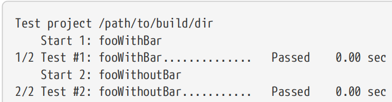

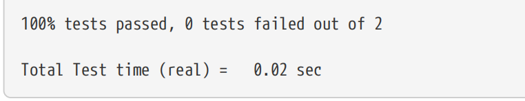

If using a multi configuration generator like Xcode or Visual Studio, ctest needs to be told which configuration it should test. This is done by including the -C configType option where configType will be one of the supported build types (Debug, Release, etc.). For single configuration generators, the -C option is not mandatory, since the build can only produce one configuration, so there is no ambiguity for where to find the binaries to execute. Nevertheless, it can still be useful to specify a configuration to avoid the less intuitive behavior of excluding tests that are defined to only run under certain configurations and where the empty string is not among those listed. 【翻译】如果使用Xcode或Visual Studio等多配置生成器，则需要告知ctest应该测试哪种配置。这是通过包含-C configType选项来实现的，其中configType将是支持的构建类型之一（调试、发布等）。对于单个配置生成器，-C选项不是强制性的，因为构建只能生成一个配置，因此在哪里找到要执行的二进制文件没有歧义。然而，指定一个配置以避免排除仅在某些配置下运行且空字符串不在所列配置中的测试的不那么直观的行为仍然是有用的。

It is possible to tell ctest to show all test output and various other details about the run with the -V option. -VV and -VVV show an increasing level of verbosity, but these are typically only needed by developers working on ctest itself. Even the -V level of verbosity is usually more detail than users want to see, it is more likely that only the output of tests that fail are of interest. ctest can be told to only show the output of failed tests by passing the --output-on-failure option. Alternatively, developers can set the CTEST_OUTPUT_ON_FAILURE environment variable to any value to avoid having to specify it every time (the value isn’t used, ctest merely checks if CTEST_OUTPUT_ON_FAILURE has been set). 【翻译】可以使用-V选项告诉ctest显示所有测试输出和有关运行的各种其他详细信息-VV和-VVV的详细程度越来越高，但通常只有从事ctest本身的开发人员才需要这些。即使是-V级别的冗长通常也比用户想要看到的更详细，更有可能的是，只有失败的测试输出才令人感兴趣。通过传递--output on failure选项，可以告诉ctest只显示失败测试的输出。或者，开发人员可以将CTEST_OUTPUT_ON_FAILURE环境变量设置为任何值，以避免每次都必须指定它（不使用该值，CTEST仅检查是否已设置CTEST_OUT_ON_FAILURE）。

By default, each test will be run with the same environment as the ctest command. If a test requires changes to its environment, this can be done through the ENVIRONMENT test property. This property is expected to be a list of NAME=VALUE items that define environment variables to be set before running the test. Changes are local to that test only and do not affect other tests.

【翻译】默认情况下，每个测试都将在与ctest命令相同的环境中运行。如果测试需要更改其环境，则可以通过ENVIRONG test属性完成。此属性应该是NAME=VALUE项的列表，这些项定义了在运行测试之前要设置的环境变量。更改仅限于该测试，不会影响其他测试。

\`\`\`cmake

set_tests_properties(fooWithoutBar PROPERTIES

ENVIRONMENT "FOO=bar;HAVE_BAZ=1"

)

\`\`\`

Situations where an environment variable needs to modify rather than replace an existing value are less straightforward. If the environment should be based on the one in which CMake is run rather than the ctest command, then the form \$ENV{SOMEVAR} can be used to obtain existing values. A good example of this is when augmenting the PATH environment variable to ensure a test can find the shared libraries it links against on Windows: 【翻译】环境变量需要修改而不是替换现有值的情况不那么简单。如果环境应该基于运行CMake的环境，而不是ctest命令，那么可以使用\$ENV{SOMEVAR}形式来获取现有值。一个很好的例子是，当增加PATH环境变量以确保测试可以在Windows上找到它链接的共享库时：

\#------------------------------------\>\>\>\>\>\>

\# In this example, algo is assumed to be a shared library defined elsewhere

\# in the project and whose binary will be in a different directory to fooTest

add_executable(fooTest ...)

target_link_libraries(fooTest PRIVATE algo)

add_test(NAME fooWithAlgo COMMAND fooTest)

if(WIN32)

set_tests_properties(fooWithAlgo PROPERTIES ENVIRONMENT

"PATH=\$\<SHELL_PATH:\$\<TARGET_FILE_DIR:algo\>\>\$\<SEMICOLON\>\$ENV{PATH}"

)

endif()

\#------------------------------------\<\<\<\<\<\<

Modifying the environment based on the actual environment being used to invoke ctest rather than CMake is more involved and is usually not strictly required. It can be achieved with a combination of cmake -E env invoking a script, with CMake-provided locations being passed as variables to the cmake -E env part, then the script does the actual task of augmenting the run-time environment using those values and invoking the test executable. Such an arrangement is complex, can be fragile and should be avoided unless there is a definite need to support such a use case. 【翻译】根据用于调用ctest而不是CMake的实际环境修改环境更复杂，通常不是严格要求的。它可以通过cmake-E env调用脚本的组合来实现，其中cmake提供的位置作为变量传递给cmake-E nv部分，然后脚本使用这些值来增强运行时环境并调用测试可执行文件。这种安排很复杂，可能很脆弱，除非确实需要支持这样的用例，否则应该避免。

As a convenience primarily for IDE applications, when testing has been enabled, CMake defines a custom build target that invokes ctest with a default set of arguments. For multi configuration generators like Xcode and Visual Studio, this target will be called RUN_TESTS and it will pass the currently selected build type as the configuration to ctest. For single configuration generators, the target is simply called test and it does not specify any configuration when invoking ctest. There is no facility to specify which tests will be executed or any other custom options to pass to ctest when using the RUN_TESTS or test build target. 【翻译】主要是为了方便IDE应用程序，当启用测试时，CMake定义了一个自定义构建目标，该目标使用默认参数集调用ctest。对于Xcode和Visual Studio等多配置生成器，此目标将被称为RUN_TESTS，它将把当前选定的构建类型作为配置传递给ctest。对于单配置生成器，目标简单地称为test，在调用ctest时不指定任何配置。在使用RUN_tests或测试构建目标时，没有指定将执行哪些测试或传递给ctest的任何其他自定义选项的工具。

## 24.2. Pass / Fail Criteria And Other Result Types

Basing the result of a test purely on the exit code of the test command can be quite restrictive. Another supported alternative is to specify regular expressions to match against the test output. The PASS_REGULAR_EXPRESSION test property can be used to specify a list of regular expressions, at least one of which the test output must match for the test to pass. These regular expressions frequently span across multiple lines. Similarly, the FAIL_REGULAR_EXPRESSION test property can be set to a list of regular expressions. If any of these match the test output, the test fails, even if the output also matches a PASS_REGULAR_EXPRESSION or the exit code is 0. A test can have both PASS_REGULAR_EXPRESSION and FAIL_REGULAR_EXPRESSION set, just one of the two or neither. If PASS_REGULAR_EXPRESSION is set and is not empty, the exit code is not considered when determining whether the test passes or fails. 【翻译】将测试结果完全基于测试命令的退出代码可能会非常严格。另一种受支持的替代方法是指定正则表达式以匹配测试输出。PASS_REGULAR_EXPRESSION测试属性可用于指定正则表达式列表，测试输出必须至少匹配一个正则表达式才能通过测试。这些正则表达式经常跨越多行。同样，FAIL_REGULAR_EXPRESSION测试属性可以设置为正则表达式列表。如果其中任何一个与测试输出匹配，则测试失败，即使输出也与PASS_REGULAR_EXPRESSION匹配或退出代码为0。一个测试可以同时设置PASS_REGULAR_EXPRESSION和FAIL_REGULAR_REPRESSION，可以只设置其中一个，也可以两个都不设置。如果PASS_REGULAR_EXPRESSION设置为非空，则在确定测试是通过还是失败时不考虑退出代码。

\#------------------------------------\>\>\>\>\>\>

\# Ignore exit code, check output to determine the pass/fail status

set_tests_properties(fooTest PROPERTIES

PASS_REGULAR_EXPRESSION

"Checking some condition for fooTest: passed

+.\*

All checks passed"

FAIL_REGULAR_EXPRESSION "warning\|Warning\|WARNING"

)

\#------------------------------------\<\<\<\<\<\<

Sometimes a test may need to be skipped, perhaps for reasons that only the test itself can determine. The SKIP_RETURN_CODE test property can be set to a value the test can return to indicate that it was skipped rather than failed. A test that exits with the SKIP_RETURN_CODE will override any other pass/fail criteria.【翻译】有时可能需要跳过测试，可能是因为只有测试本身才能确定的原因。SKIP_RETURN_CODE测试属性可以设置为测试可以返回的值，以指示它被跳过而不是失败。以SKIP_RETURN_CODE退出的测试将覆盖任何其他通过/失败标准。

//-----------------*fooTest.cpp*

*//------------------------------------\>\>\>\>\>\>*

\`\`\`cpp

**int main**(**int** argc, **char**\* argv\[\])

{

**if** (shouldSkip())

> **return 2**; // Skipped

**if** (runTest())

> **return 0**; // Passed

**return 1**; // Failed

}

//------------------------------------\<\<\<\<\<\<

\#----# *CMakeLists.txt*

\#------------------------------------\>\>\>\>\>\>

add_executable(fooTest fooTest.cpp ...)

add_test(NAME foo COMMAND fooTest)

set_tests_properties(foo PROPERTIES

SKIP_RETURN_CODE 2

)

\#------------------------------------\<\<\<\<\<\<

Output from the above test may look similar to the following:【翻译】上述测试的输出可能类似于以下内容：

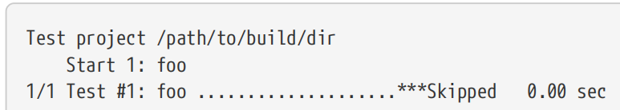

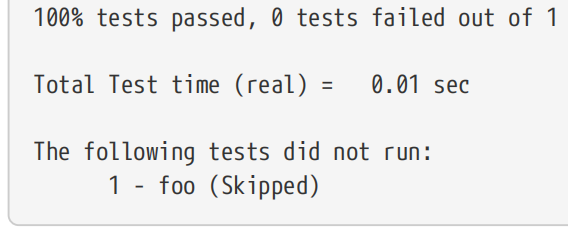

When at least one test fails or is not run for some reason, a summary of all such tests and their status is printed at the end. A test that indicates it should be skipped via its return code is not considered a failure and is still counted in the total number of tests. A test may be skipped for other reasons which could be deemed a failure, such as a test dependency failing to be met (discussed in Section 24.5, “Test Dependencies” below).【翻译】当至少有一个测试失败或因某种原因未运行时，会在末尾打印所有此类测试及其状态的摘要。通过返回代码指示应跳过的测试不被视为失败，仍将计入测试总数。由于其他可能被视为失败的原因，例如未能满足测试依赖性（详见下文第24.5节“测试依赖性”），可以跳过测试。

With CMake 3.9 or later, a DISABLED test property is also supported. This can be used to mark a test as temporarily disabled, which will allow it to be defined, but not executed or even counted in the total number of tests. It will not be considered a test failure, but it will still be shown in the test results with an appropriate status message. Note that such tests should not normally remain disabled for extended periods, the feature is intended as a temporary way to disable a problematic or incomplete test until it can be fixed. 【翻译】在CMake 3.9或更高版本中，还支持DISABLED测试属性。这可用于将测试标记为临时禁用，这将允许对其进行定义，但不执行，甚至不计入测试总数。这不会被视为测试失败，但它仍将在测试结果中显示，并带有适当的状态消息。请注意，此类测试通常不应长时间保持禁用状态，该功能旨在作为一种临时方式，在修复有问题或不完整的测试之前禁用它。

The following simple example demonstrates the DISABLED test behavior:【翻译】以下简单示例演示了DISABLED测试行为：

\#------------------------------------\>\>\>\>\>\>

add_test(NAME fooWithBar ...)

add_test(NAME fooWithoutBar ...)

set_tests_properties(fooWithoutBar PROPERTIES DISABLED YES)

\#------------------------------------\<\<\<\<\<\<

The ctest output for the above may look something like this:【翻译】上面的ctest输出可能看起来像这样：

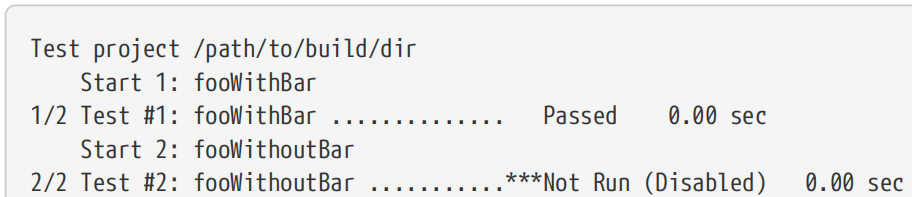

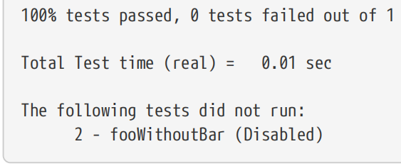

In some cases, a test may be expected to fail. Rather than disabling the test, it may be more appropriate to mark the test as expecting failure so that it continues to be executed. The WILL_FAIL test property can be set to true to indicate this, which will then invert the pass/fail result. This has the added advantage that if the test starts to pass unexpectedly, ctest will consider that a failure and the developer is immediately aware of the change in behavior.【翻译】在某些情况下，测试可能会失败。与其禁用测试，不如将测试标记为预期失败，以便继续执行。WILL_FAIL测试属性可以设置为true来指示这一点，然后将反转通过/失败的结果。这还有一个额外的优点，即如果测试开始意外通过，ctest将认为是失败，开发人员会立即意识到行为的变化。

Another aspect of a test’s pass/fail status is how long it takes to complete. The TIMEOUT test property, if set, specifies the number of seconds the test is allowed to run before it will be terminated and marked as failed. The ctest command line also accepts a --timeout option which has the same effect for any test without a TIMEOUT property set (i.e. it acts as a default timeout). Furthermore, a time limit can also be applied to the entire set of tests as a whole by specifying the --stop-time option to ctest. The argument after --stop-time must be a real time of day rather than a number of seconds, with local time assumed if no timezone is given.【翻译】测试通过/失败状态的另一个方面是完成所需的时间。TIMEOUT测试属性（如果设置）指定测试在终止并标记为失败之前允许运行的秒数。ctest命令行还接受--timeout选项，该选项对任何没有设置timeout属性的测试都有相同的效果（即它充当默认超时）。此外，通过为ctest指定--stop-time选项，也可以将时间限制作为一个整体应用于整个测试集。--stop时间后的参数必须是一天中的实时时间，而不是秒数，如果没有给出时区，则假定为本地时间。

\#------------------------------------\>\>\>\>\>\>

add_test(NAME t1 COMMAND ...)

add_test(NAME t2 COMMAND ...)

set_tests_properties(t2 PROPERTIES TIMEOUT 10)

\#------------------------------------\<\<\<\<\<\<

\`\`\`sh

ctest --timeout 30 --stop-time 13:00

\`\`\`

In the above example, the default per-test timout is set to 30 seconds on the ctest command line. Since t1 has no TIMEOUT property set, it will have a 30 second timeout, whereas t2 has its TIMEOUT property set to 10, which will override the default set on the ctest command line. The tests will be given until 1pm local time to complete.【翻译】在上面的示例中，ctest命令行上的默认每次测试时间设置为30秒。由于t1没有设置TIMEOUT属性，它将有30秒的超时，而t2的TIMEOUT属性设置为10，这将覆盖ctest命令行上的默认设置。测试将在当地时间下午1点前完成。

In some circumstances, a test may need to wait for a particular condition before it starts the test proper. It may be desirable to apply a timeout to just the part of the run after that condition has been met and the real test begins. With CMake 3.6 or later, the TIMEOUT_AFTER_MATCH test property is available to support this behavior. It expects a list containing two items, the first being the number of seconds to be used as a timeout after the condition is met and the second is a regular expression to be matched against the test output. When the regular expression is found, the test’s timeout countdown and start time is reset and the timeout value is set to the first list item. For example, the following will apply an overall timeout of 30 seconds to the test, but once the string Condition met appears in the test output, the test will have 10 seconds to complete from that point and the original 30 second timeout condition will no longer apply.【翻译】在某些情况下，测试可能需要等待特定条件才能开始测试。在满足该条件并开始实际测试后，可能需要对运行的一部分应用超时。在CMake 3.6或更高版本中，TIMEOUT_AFTER_MATCH测试属性可用于支持此行为。它需要一个包含两个项目的列表，第一个是满足条件后用作超时的秒数，第二个是与测试输出匹配的正则表达式。找到正则表达式后，将重置测试的超时倒计时和开始时间，并将超时值设置为第一个列表项。例如，以下将对测试应用30秒的总超时，但一旦测试输出中出现字符串“满足条件”，测试将有10秒的时间完成，原始的30秒超时条件将不再适用。

\`\`\`cmake

set_tests_properties(t2 PROPERTIES

TIMEOUT 30

TIMEOUT_AFTER_MATCH "10;Condition met"

)

\`\`\`

If the test took 25 seconds for the condition to be satisfied, the overall time of the test could be as long as 35 seconds, but because the test’s start time is also reset, ctest would report a time between 0 and 10 seconds (i.e. the time for the condition to be met is not counted). If, on the other hand, the condition fails to be met within 30 seconds, the test will show an overall test time of about 30 seconds.【翻译】如果测试需要25秒才能满足条件，则测试的总时间可能长达35秒，但由于测试的开始时间也被重置，ctest将报告0到10秒之间的时间（即满足条件的时间不计算在内）。另一方面，如果在30秒内未能满足条件，则测试将显示约30秒的总测试时间。

Where possible, use of TIMEOUT_AFTER_MATCH should generally be avoided in favor of other ways to handle preconditions. Section 24.5, “Test Dependencies” and Section 24.4, “Parallel Execution” further below discuss better alternative methods.【翻译】在可能的情况下，通常应避免使用TIMEOUT_AFTER_MATCH，而应采用其他方式处理前提条件。下文第24.5节“测试依赖关系”和第24.4节“并行执行”将进一步讨论更好的替代方法。

## 24.3. Test Grouping And Selection

In larger projects, it is quite common to want to run just a subset of all defined tests. The developer may be focusing on a particular failing test and may not be interested in all the other tests while working on that problem. One way to execute just a specific subset of tests is by giving the -R and -E options to ctest. These options each specify a regular expression to be matched against test names. -R selects tests to be included in the test set, whereas -E excludes tests. Both options can be specified to combine their effects. 【译】在大型项目中，只想运行所有已定义测试的一个子集是很常见的。开发人员可能专注于某个特定的失败测试，在处理该问题时可能对所有其他测试都不感兴趣。执行特定测试子集的一种方法是向ctest提供-R和-E选项。这些选项都指定了一个与测试名称匹配的正则表达式-R选择要包含在测试集中的测试，而-E排除测试。可以指定这两个选项来组合它们的效果。

\#------------------------------------\>\>\>\>\>\>

add_test(NAME fooOnly COMMAND ...)

add_test(NAME barOnly COMMAND ...)

add_test(NAME fooWithBar COMMAND ...)

add_test(NAME fooSpecial COMMAND ...)

add_test(NAME other_foo COMMAND ...)

\#------------------------------------\<\<\<\<\<\<

\`\`\`sh

ctest -R Only \# Run just fooOnly and barOnly

ctest -E Bar \# Run all but fooWithBar

ctest -R '^foo' -E fooSpecial \# Run all tests starting with foo except fooSpecial

ctest -R 'fooSpecial\|other_foo' \# Run only fooSpecial and other_fo

\`\`\`

Sometimes it isn’t always easy to work out a regular expression to capture just the desired tests, or a developer may just want to see all the tests that have been defined without running them. The -N option instructs ctest to only print the tests rather than run them, which can be a useful way to check that the regular expressions yield the desired set of tests. 【译】有时，要计算出一个正则表达式来捕获所需的测试并不总是那么容易，或者开发人员可能只是想查看所有已定义的测试而不运行它们。-N选项指示ctest只打印测试而不是运行测试，这是检查正则表达式是否产生所需测试集的有用方法。

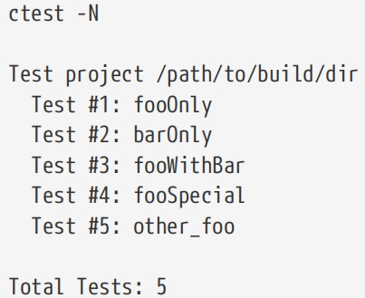

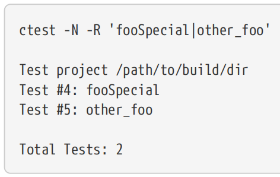

As each test is added, it is given a test number which will remain the same between runs unless another test is added or removed before it in the project. The ctest output shows this number beside the test. When using the -N option, tests are listed in the order they have been defined by the project, but the tests might not necessarily be executed in that order. Tests to be run can be selected by test number rather than name using the -I option. This method is rather fragile, since the addition or removal of a single test can change the number assigned to any number of other tests. Even passing a different configuration via the -C option to ctest can result in the test numbers changing. In most cases, matching by name will be preferable. 【译】随着每个测试的添加，它会被赋予一个测试编号，该编号在运行之间保持不变，除非在项目中添加或删除另一个测试。ctest输出在测试旁边显示此数字。使用-N选项时，测试按项目定义的顺序列出，但测试不一定按此顺序执行。可以使用-I选项按测试编号而不是名称选择要运行的测试。这种方法相当脆弱，因为添加或删除单个测试可能会改变分配给任何数量的其他测试的编号。即使通过-C选项向ctest传递不同的配置，也可能导致测试编号发生变化。在大多数情况下，按名称匹配会更好。

One situation where test numbers can be useful is where two tests have been given exactly the same name. Except when defined in the same directory, both tests are accepted without any warnings being issued. While duplicate test names should generally be avoided, in hierarchical projects involving externally provided tests, this may not always be possible. 【译】测试编号可能有用的一种情况是，两个测试被赋予了完全相同的名称。除非在同一目录中定义，否则两个测试都可以接受，不会发出任何警告。虽然通常应避免重复的测试名称，但在涉及外部提供的测试的分层项目中，这可能并不总是可能的。

The -I option expects an argument which has a somewhat complicated form. The most direct form involves specifying test numbers on the command line, separated by commas with no spaces: 【译】-I选项需要一个形式有点复杂的参数。最直接的形式是在命令行上指定测试编号，用逗号分隔，不带空格：

\`\`\`sh

ctest -I \[start\[,end\[,stride\[,testNum\[,testNum...\]\]\]\]\]

\`\`\`

To specify just individual test numbers, the start, end and stride can be left blank like so: 【译】要仅指定单个测试编号，可以将开始、结束和步幅留空，如下所示：

\`\`\`sh

ctest -I ,,,3,2 \# Selects tests 2 and 3 only

\`\`\`

The same details can be read from a file instead of being specified on the command line by giving the name of the file to the -I option. This can be useful if regularly running the same complicated set of tests and no tests are being added or removed: 【译】通过将文件名指定给-I选项，可以从文件中读取相同的详细信息，而无需在命令行上指定。如果定期运行相同的复杂测试集，并且没有添加或删除测试，这可能很有用：

\# *testNumbers.txt*

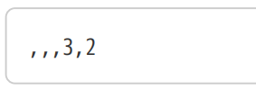

\`\`\`sh

ctest -I testNumbers.txt

\`\`\`

Selecting tests individually by name or number can become cumbersome if a large set of related tests needs to be executed. Tests can be assigned an arbitrary list of labels using the LABELS test property and then tests can be selected by these labels. The -L and -LE options are analogous to the -R and -E options respectively, except they operate on test labels rather than test names. Continuing with the same tests defined in the earlier example: 【译】如果需要执行大量相关测试，按名称或编号单独选择测试可能会变得很麻烦。可以使用labels测试属性为测试分配一个任意的标签列表，然后可以通过这些标签选择测试。-L和-LE选项分别类似于-R和-E选项，除了它们对测试标签而不是测试名称进行操作。继续前面示例中定义的相同测试：

\#------------------------------------\>\>\>\>\>\>

set_tests_properties(fooOnly PROPERTIES LABELS "foo")

set_tests_properties(barOnly PROPERTIES LABELS "bar")

set_tests_properties(fooWithBar PROPERTIES LABELS "foo;bar;multi")

set_tests_properties(fooSpecial PROPERTIES LABELS "foo")

set_tests_properties(other_foo PROPERTIES LABELS "foo")

\#------------------------------------\<\<\<\<\<\<

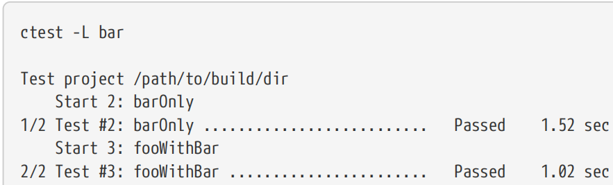

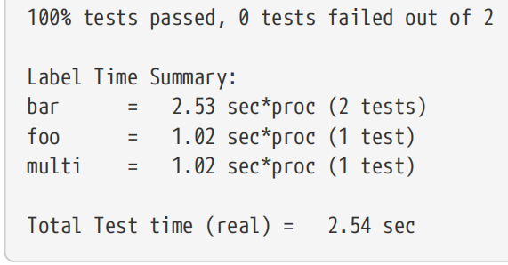

Labels not only enable convenient grouping for test execution, they also provide grouping for basic execution time statistics. As seen in the above example output, the ctest command prints a label summary when any tests in the set of executed tests has its LABELS property set. This allows the developer to get an idea how each label group is contributing to the overall test time. The proc part of the sec\*proc units refers to the number of processors allocated to tests (described in Section 24.4, “Parallel Execution” below). A test that ran for 3 seconds and required 4 processors would report a value of 12. The label time summary can be suppressed with the --no-label-summary option.Another common need is to re-run just those tests that failed the last time ctest was run. This can be a convenient way to re-check just the relevant tests after making a small fix or to re-run tests that failed due to some temporary environmental condition. The ctest command supports a --rerun -failed option which provides this behavior without needing any test names, numbers or labels to be given. 【译】标签不仅为测试执行提供了方便的分组，还为基本的执行时间统计提供了分组。如上述示例输出所示，当已执行测试集中的任何测试都设置了LABELS属性时，ctest命令会打印标签摘要。这使开发人员能够了解每个标签组对整体测试时间的贡献。sec\*proc单元的proc部分是指分配给测试的处理器数量（如下文第24.4节“并行执行”所述）。运行3秒并需要4个处理器的测试将报告值12。可以使用--no label summary选项抑制标签时间摘要。另一个常见的需求是只重新运行上次运行ctest时失败的测试。这是一种方便的方法，可以在进行小修复后仅重新检查相关测试，或者重新运行因某些临时环境条件而失败的测试。ctest命令支持--run-ufailed选项，该选项无需提供任何测试名称、编号或标签即可提供此行为。

Sometimes a particular test or set of tests only fails intermittently, so the test(s) may need to be run many times to try to reproduce a failure. Rather than running ctest itself over and over, the --repeat-until-fail option can be given with the upper limit on the number of times each test can be repeated. If a test fails, it will not be re-run again for that ctest invocation. 【译】有时，一个特定的测试或一组测试只是间歇性失败，因此可能需要多次运行测试来尝试重现失败。与其反复运行ctest本身，不如给出--repeat until fail选项，并对每个测试的重复次数设定上限。如果测试失败，则不会再次运行该ctest调用。

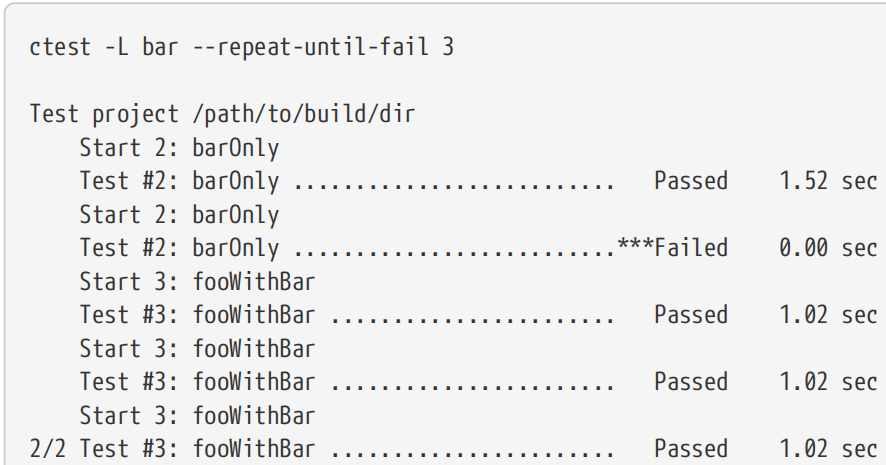

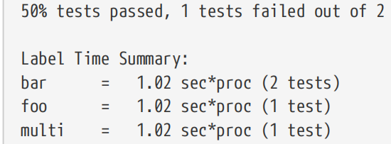

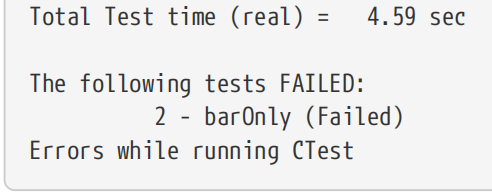

The label summary doesn’t accumulate the total time for the repeated tests, it only uses the time of a test’s last execution. The total test time does, however, count all repeats.【译】标签摘要不会累积重复测试的总时间，它只使用测试上次执行的时间。然而，总测试时间确实计算了所有重复的次数。

## 24.4. Parallel Execution

Maximizing the test throughput can be an important consideration for large projects or where tests take a non-trivial amount of time to complete. The ability to run tests in parallel is a key feature of ctest and is enabled using command line options that are very similar to the standard make tool. The -j option can be used to specify an upper limit on how many tests can be run simultaneously. Unlike most make implementations, a value must be supplied or the option will have no effect. As an alternative, the CTEST_PARALLEL_LEVEL environment variable can be used to specify the number of jobs, but the command line option takes precedence if both are used. This arrangement is particularly useful for continuous integration build slaves, since CTEST_PARALLEL_LEVEL can be set to the number of CPU cores on each slave, freeing every project from having to compute the optimal number of jobs themselves. For those projects that need to restrict the number of parallel jobs, they can still override CTEST_PARALLEL_LEVEL with the -j command line option. 【译】对于大型项目或测试需要大量时间才能完成的项目，最大化测试吞吐量可能是一个重要的考虑因素。并行运行测试的能力是ctest的一个关键特性，可以使用与标准make工具非常相似的命令行选项启用。-j选项可用于指定可同时运行的测试数量的上限。与大多数make实现不同，必须提供值，否则选项将无效。作为替代方案，可以使用CTEST_PARALLEL_LEVEL环境变量指定作业数量，但如果同时使用这两个变量，则命令行选项优先。这种安排对于持续集成构建从属设备特别有用，因为CTEST_PARALLEL_LEVEL可以设置为每个从属设备上的CPU核数，从而使每个项目不必自己计算最佳作业数。对于那些需要限制并行作业数量的项目，它们仍然可以使用-j命令行选项覆盖CTEST_parallel_LEVEL。

A related option is -l which is used to specify a desirable upper limit on the CPU load. ctest will try to avoid starting a new test if it may cause the load to go above this limit. Unfortunately, the shortcomings of this option are immediately apparent at the start of testing. Typically, ctest will initially launch as many tests as the job limit from -j or CTEST_PARALLEL_LEVEL settings allow, exceeding any limit specified by -l. The measured CPU load usually has a lag, which allows ctest to start too many tests initially before the measured load increases. To prevent this occurring, the number of parallel jobs specified by -j or CTEST_PARALLEL_LEVEL should be set to no more than the limit imposed by -l. If neither -j nor CTEST_PARALLEL_LEVEL is set, the -l option will have no effect. Despite these limitations, the -l option can still be useful in helping to reduce CPU overload on shared systems where other processes may also be competing for CPU resources.

【译】一个相关的选项是-l，用于指定CPU负载的理想上限。如果可能导致负载超过此限制，ctest将尽量避免启动新的测试。不幸的是，这种选择的缺点在测试开始时就很明显。通常，ctest最初会根据-j或ctest_PARALLEL_LEVEL设置中的作业限制启动尽可能多的测试，超过-l指定的任何限制。测量的CPU负载通常有滞后，这使得ctest在测量的负载增加之前最初启动了太多的测试。为了防止这种情况发生，由-j或CTEST_parallel_LEVEL指定的并行作业数量应设置为不超过-l施加的限制。如果既没有设置-j也没有设置CTEST_parallel_LEVEL，-l选项将无效。尽管有这些限制，-l选项仍然可以帮助减少共享系统上的CPU过载，因为其他进程也可能在竞争CPU资源。

By default, ctest will assume each test consumes one CPU. For test cases that use more than one CPU, their PROCESSORS test property can be set to indicate how many CPUs they are expected to use. ctest will then use that value when determining whether enough CPU resources are free before starting the test. If PROCESSORS is set to a value higher than the job limit, ctest will behave as though it was set to the job limit when determining whether the test can be started.

【译】默认情况下，ctest将假设每个测试消耗一个CPU。对于使用多个CPU的测试用例，可以设置其PROCESSORS测试属性，以指示预期使用多少CPU。ctest将在开始测试之前确定是否有足够的CPU资源可用时使用该值。如果PROCESSORS设置为高于作业限制的值，则ctest在确定是否可以启动测试时将表现得就像它设置为作业限制一样。

The effect of these options can be seen in the following example outputs, which use the same set of tests as defined earlier. 【译】这些选项的效果可以在以下示例输出中看到，这些输出使用了与前面定义的相同的测试集。

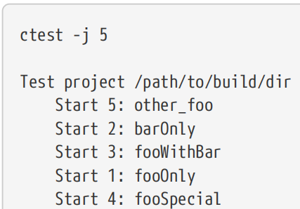

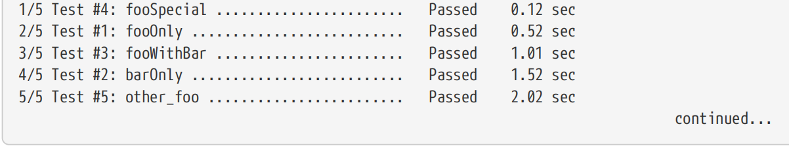

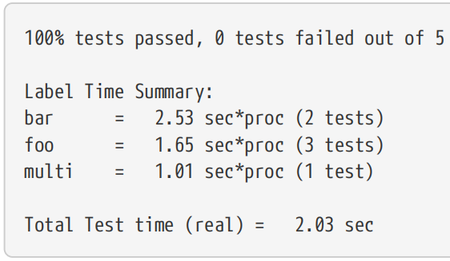

Five tests have been defined and the job limit was given on the command line as 5, so ctest was able to start all tests immediately. The result of each test was recorded as it completed, not the order in which they were started. Reducing the job limit to 2 shows output more like the following: 【译】已经定义了五个测试，并且在命令行上将作业限制设置为5，因此ctest能够立即开始所有测试。每次测试的结果都是在完成时记录的，而不是开始的顺序。将作业限制减少到2会显示如下输出：

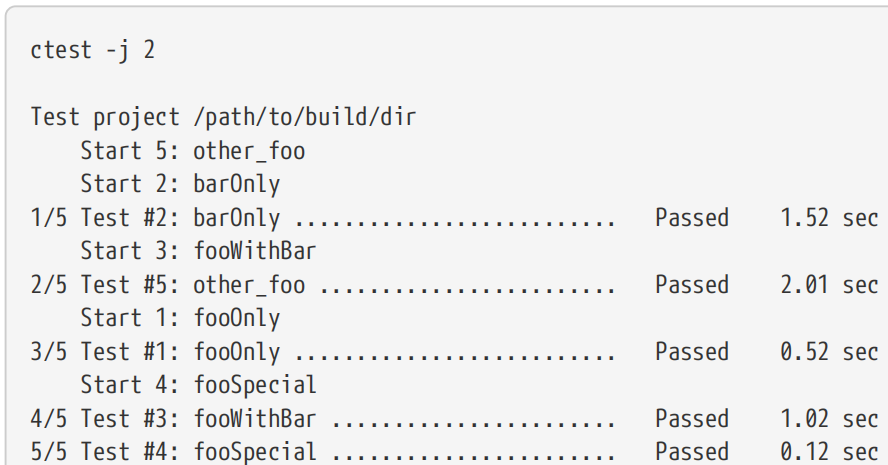

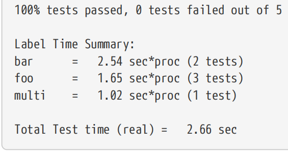

With a large number of tests and a high job limit, the logging of each individual test start and completion can be difficult to follow. The overall test summary at the end of the run then becomes much more important, with each test that didn’t pass listed along with its result. 【译】由于有大量的测试和较高的作业限制，很难跟踪每个单独测试开始和完成的日志记录。运行结束时的总体测试总结变得更加重要，每个未通过的测试都会与其结果一起列出。

Tests sometimes need to ensure that no other test is running in parallel with them. They may be performing an action that is sensitive to other activities on the machine or they may create conditions that would interfere with other tests. To enforce this constraint, the test’s RUN_SERIAL property can be set to true. This is a fairly brutal constraint that can have a strong impact on test throughput, so it should be used sparingly. Quite often, a better alternative is the RESOURCE_LOCK test property, which is used to provide a list of resources the test needs exclusive access to. These resources are arbitrary strings which ctest does not interpret in any way, except to ensure that no other test which has any of those resources listed in its own RESOURCE_LOCK property will run at the same time. This is a great way to serialize tests that need exclusive access to something (e.g. a database, shared memory) without blocking tests that do not use that resource. 【译】测试有时需要确保没有其他测试与它们并行运行。他们可能正在执行对机器上的其他活动敏感的操作，或者他们可能会创造干扰其他测试的条件。为了强制执行此约束，可以将测试的RUN_SERIAL属性设置为true。这是一个相当残酷的约束，可能会对测试吞吐量产生强烈影响，因此应该谨慎使用。通常，更好的替代方案是RESOURCE_LOCK测试属性，它用于提供测试需要独占访问的资源列表。这些资源是任意字符串，ctest不会以任何方式解释这些资源，除非是为了确保在其自己的RESOURCE_LOCA属性中列出任何这些资源的其他测试不会同时运行。这是一种序列化需要独占访问某些东西（例如数据库、共享内存）的测试的好方法，而不会阻止不使用该资源的测试。

\#------------------------------------\>\>\>\>\>\>

set_tests_properties(fooOnly fooSpecial other_foo PROPERTIES RESOURCE_LOCK foo)

set_tests_properties(barOnly PROPERTIES RESOURCE_LOCK bar)

set_tests_properties(fooWithBar PROPERTIES RESOURCE_LOCK "foo;bar")

\#------------------------------------\<\<\<\<\<\<

The following sample output shows that even though the job limit of 5 would allow all tests to be executed simultaneously, ctest delays starting some tests until the resources they need are available. 【译】以下示例输出显示，即使作业限制为5将允许同时执行所有测试，ctest也会延迟启动一些测试，直到它们所需的资源可用。

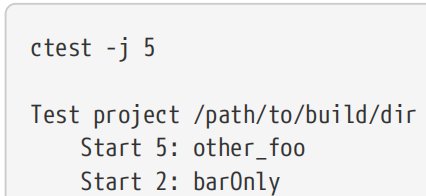

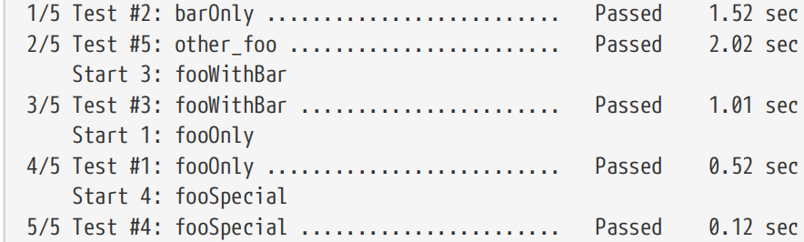

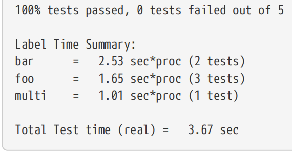

## 24.5. Test Dependencies

Tests can be used to do more than simply verify a particular condition, they can also be used to enforce them. For example, one test may need a server to connect to so that it can verify a client implementation. Rather than relying on the developer to ensure such a server is available, another test case can be created which ensures a server is running. The client test then needs to have some kind of dependency on the server test to make sure they are run in the correct order.

【译】测试不仅可以用来验证特定条件，还可以用来强制执行。例如，一个测试可能需要连接一个服务器，以便它可以验证客户端实现。与其依赖开发人员来确保这样的服务器可用，还可以创建另一个测试用例来确保服务器正在运行。然后，客户端测试需要对服务器测试有某种依赖关系，以确保它们以正确的顺序运行。

The DEPENDS test property allows a form of this constraint to be expressed by holding a list of other tests that must complete before that test can run. The above client/server example could loosely be expressed as follows: 【译】DEPENDS测试属性允许通过保存在测试运行之前必须完成的其他测试的列表来表示此约束的一种形式。上面的客户端/服务器示例可以大致表示如下：

\#------------------------------------\>\>\>\>\>\>

set_tests_properties(clientTest1 clientTest2 PROPERTIES DEPENDS startServer)

set_tests_properties(stopServer PROPERTIES DEPENDS "clientTest1;clientTest2")

\#------------------------------------\<\<\<\<\<\<

A weakness with the DEPENDS test property is that while it defines a test order, it does not consider whether the pre-requisite tests pass or fail. In the above example, if the startServer test case fails, the clientTest1, clientTest2 and stopServer tests will still run. These tests will then likely fail and the test output will show all four tests as failed, where in reality only the startServer test failed and the others should have been skipped. 【译】DEPENDS测试属性的一个弱点是，虽然它定义了测试顺序，但它不考虑先决条件测试是通过还是失败。在上面的示例中，如果startServer测试用例失败，clientTest1、clientTest2和stopServer测试仍将运行。这些测试可能会失败，测试输出将显示所有四个测试都失败，而实际上只有startServer测试失败，其他测试应该被跳过。

CMake 3.7 added support for test fixtures, a concept which allows dependencies between tests to be expressed much more rigorously. A test can indicate it requires a particular fixture by listing that fixture name in its FIXTURES_REQUIRED test property. Any other test with that same fixture name in its FIXTURES_SETUP test property must complete successfully before the dependent test will be started. If any of the setup tests for a fixture fail, all of the tests that require that fixture will be marked as skipped. Similarly, a test can list a fixture in its FIXTURES_CLEANUP test property to indicate that it must be run after any other test with that same fixture listed in its FIXTURES_SETUP or FIXTURES_REQUIRED property. These cleanup tests do not require the setup or fixture-requiring tests to pass, since cleanup may be needed even if the earlier tests fail. 【译】CMake3.7增加了对测试夹具的支持，这一概念允许更严格地表达测试之间的依赖关系。测试可以通过在其FIXTURES_REQUIRED测试属性中列出该夹具名称来指示它需要特定的夹具。在开始依赖测试之前，其FIXTURES_SETUP测试属性中具有相同夹具名称的任何其他测试都必须成功完成。如果夹具的任何设置测试失败，则需要该夹具的所有测试都将被标记为跳过。同样，测试可以在其FIXTURES_CLEANUP测试属性中列出一个夹具，以表明它必须在其FIXURES_SETUP或FIXTURES_REQUIRED属性中列出的具有相同夹具的任何其他测试之后运行。这些清理测试不需要要求测试通过的设置或夹具，因为即使早期的测试失败，也可能需要清理。

All three fixture-related test properties accept a list of fixture names. These names are arbitrary and do not have to relate to the test names, resources they use or any other property. The fixture names should make clear to developers what they represent and so, while not required to, they often do have the same value as those used for RESOURCE_LOCK properties. 【译】所有三个与夹具相关的测试属性都接受夹具名称列表。这些名称是任意的，不必与测试名称、它们使用的资源或任何其他属性相关。夹具名称应该让开发人员清楚它们代表什么，因此，虽然不需要，但它们通常与RESOURCE_LOCK属性使用的值相同。

Consider the earlier client/server example. This can be expressed rigorously using fixtures with the following properties: 【译】考虑前面的客户端/服务器示例。这可以使用具有以下属性的夹具严格表示：

\#------------------------------------\>\>\>\>\>\>

set_tests_properties(startServer PROPERTIES FIXTURES_SETUP server)

set_tests_properties(clientTest1 clientTest2 PROPERTIES FIXTURES_REQUIRED server)

set_tests_properties(stopServer PROPERTIES FIXTURES_CLEANUP server)

\#------------------------------------\<\<\<\<\<\<

In the above, server is the name of the fixture, clientTest1 and clientTest2 will only run if startServer passes and stopServer will run last regardless of the result of any of the other three tests. If parallel execution is enabled, startServer will run first, the two client tests will run simultaneously and stopServer will only run after both client tests have been completed or skipped. 【译】在上面，server是夹具的名称，clientTest1和clientTest2只有在startServer通过时才会运行，stopServer将最后运行，而不管其他三个测试的结果如何。如果启用了并行执行，startServer将首先运行，两个客户端测试将同时运行，stopServer将仅在完成或跳过两个客户端检测后运行。

Another benefit of fixtures can be seen when the developer is running only a subset of tests. Consider the scenario where the developer is working on clientTest2 and is not interested in running clientTest1. When dependencies between tests are expressed using DEPENDS, the developer is responsible for ensuring they also include required tests in the test set, which means they need to understand all the relevant dependencies. This would lead to the ctest command line: 【译】当开发人员只运行测试的一个子集时，可以看到夹具的另一个好处。考虑开发人员正在处理clientTest2而对运行clientTest1不感兴趣的场景。当使用DEPENDS表示测试之间的依赖关系时，开发人员有责任确保它们在测试集中也包含所需的测试，这意味着他们需要了解所有相关的依赖关系。这将导致ctest命令行：

\`\`\`sh

ctest -R "startServer\|clientTest2\|stopServer"

\`\`\`

When fixtures are used, ctest automatically adds any setup or cleanup tests to the set of tests to be executed in order to satisfy fixture requirements. This means the developer need only specify the test they want to focus on and leave the dependencies to ctest: 【译】当使用夹具时，ctest会自动将任何设置或清理测试添加到要执行的测试集中，以满足夹具要求。这意味着开发人员只需指定他们想要关注的测试，并将依赖关系留给ctest：

\`\`\`sh

ctest -R clientTest2

\`\`\`

When using the --rerun-failed option, this same mechanism ensures that setup and cleanup tests are automatically added to the test set in order to satisfy the fixture dependencies of the previously failed tests. 【译】使用--run-ufailed选项时，此机制可确保将设置和清理测试自动添加到测试集中，以满足之前失败的测试的夹具依赖关系。

A fixture may have zero or more setup tests and zero or more cleanup tests. Fixtures may define setup tests with no cleanup tests and vice versa. While not particularly useful, a fixture can have no setup or cleanup tests at all, in which case the fixture has no effect on the tests to be executed or when the tests will run. Similarly, a fixture can have setup and/or cleanup tests associated with it but no tests that require it. These situations can arise during development when tests are being defined or temporarily disabled. For the case of a fixture having no tests that require it, a bug in CMake 3.7 allowed that fixture’s cleanup tests to run before the setup tests, but that bug was fixed in the 3.8.0 release. 【译】一个夹具可能有零个或多个设置测试和零个或更多个清理测试。夹具可以定义没有清理测试的设置测试，反之亦然。虽然不是特别有用，但夹具可能根本没有设置或清理测试，在这种情况下，夹具对要执行的测试或测试何时运行没有影响。同样，夹具可以有与之相关的设置和/或清理测试，但没有需要它的测试。在开发过程中，当定义或临时禁用测试时，可能会出现这些情况。对于没有需要测试的夹具的情况，CMake 3.7中的一个错误允许该夹具的清理测试在安装测试之前运行，但该错误在3.8.0版本中得到了修复。

A more involved example demonstrates how fixtures can be used to express more complex test dependencies. Expanding the previous example, suppose one client test requires just a server, whereas another requires both a server and a database to be available. This is succinctly expressed by defining two fixtures: server and database. For the latter, it is acceptable to simply check whether there is a database available and fail if not, so the database fixture requires no cleanup test. The server and database fixtures are not related, so they need no dependencies between them. These constraints can be expressed like so: 【译】一个更复杂的例子演示了如何使用夹具来表达更复杂的测试依赖关系。扩展前面的示例，假设一个客户端测试只需要一个服务器，而另一个测试需要服务器和数据库都可用。这可以通过定义两个固定装置来简洁地表达：服务器和数据库。对于后者，可以简单地检查是否有可用的数据库，如果没有，则失败，因此数据库夹具不需要进行清理测试。服务器和数据库固定装置不相关，因此它们之间不需要依赖关系。这些约束可以这样表示：

\#------------------------------------\>\>\>\>\>\>

\# Setup/cleanup

set_tests_properties(startServer PROPERTIES FIXTURES_SETUP server)

set_tests_properties(stopServer PROPERTIES FIXTURES_CLEANUP server)

set_tests_properties(ensureDbAvailable PROPERTIES FIXTURES_SETUP database)

\# Client tests

set_tests_properties(clientNoDb PROPERTIES FIXTURES_REQUIRED server)

set_tests_properties(clientWithDb PROPERTIES FIXTURES_REQUIRED "server;database")

\#------------------------------------\<\<\<\<\<\<

While having ctest automatically add fixture dependencies into the test execution set is generally a useful feature, there are also times where this can be undesirable. Continuing with the above example, the developer may want to leave the server running and keep executing just one client test multiple times. They may be making changes, recompiling the code and checking whether the client test passes with each change. To support this level of control, CMake 3.9 introduced the -FS, -FC and -FA options to ctest, each of which requires a regular expression that will be matched against fixture names. The -FS option is used to disable adding fixture setup dependencies for those fixtures that match the regular expression provided. -FC does the same for cleanup tests and -FA combines both, disabling both setup and cleanup tests that match. A common situation is to disable adding any setup/cleanup dependencies at all, which can be done by giving a regular expression of a single period (.). The following demonstrates various examples of these options and their effects: 【译】虽然让ctest自动将夹具依赖项添加到测试执行集中通常是一个有用的功能，但有时这也是不可取的。继续上述示例，开发人员可能希望让服务器保持运行，并多次只执行一个客户端测试。他们可能正在进行更改，重新编译代码，并检查客户端测试是否通过每次更改。为了支持这种级别的控制，CMake 3.9向ctest引入了-FS、-FC和-FA选项，每个选项都需要一个与夹具名称匹配的正则表达式。-FS选项用于禁用为与提供的正则表达式匹配的夹具添加夹具设置依赖项-FC对清理测试也这样做，-FA将两者结合起来，禁用匹配的安装和清理测试。一种常见的情况是完全禁用添加任何设置/清理依赖项，这可以通过给出单个句点（.）的正则表达式来完成。以下展示了这些选项及其效果的各种示例：

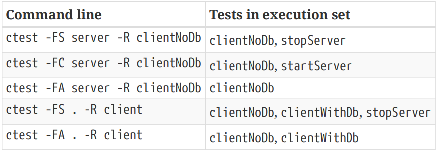

## 24.6. Cross-compiling And Emulators

When an executable target defined by the project is used as the command for add_test(), CMake automatically substitutes the location of the built executable. For a cross-compiling scenario, this won’t typically work, since the host cannot usually run binaries built for a different platform directly. To help with this, CMake provides a CROSSCOMPILING_EMULATOR target property which can be set to a script or executable to be used to launch the target. If this property is set, CMake will prepend it before the target binary and use that as the command to run instead (i.e. the real target binary becomes the first argument to the emulator command provided by CROSSCOMPILING_EMULATOR). This enables tests to be run even when cross-compiling. 【译】当项目定义的可执行目标用作add_test（）的命令时，CMake会自动替换生成的可执行文件的位置。对于交叉编译场景，这通常不起作用，因为主机通常不能直接运行为不同平台构建的二进制文件。为了帮助实现这一点，CMake提供了一个CROSSCOMPILING_EMULATOR目标属性，可以将其设置为用于启动目标的脚本或可执行文件。如果设置了此属性，CMake将在目标二进制文件之前添加它，并将其用作运行的命令（即真正的目标二进制文件成为CROSSCOMPILING_emulator提供的仿真器命令的第一个参数）。这使得即使在交叉编译时也能运行测试。

The CROSSCOMPILING_EMULATOR doesn’t have to be an actual emulator, it just has to be a command that can be run on the host to launch the target executable. While a dedicated emulator for the target platform is the obvious use case, one could also set it to a script that copies the executable to a target machine and runs it remotely (e.g. over a SSH connection). Whichever method is used, developers should be aware that the startup time for an emulator or for preparing to run the binary could be non-trivial and may have an impact on the test timing measurements. This can, in turn, mean that test timeout settings may need to be revised.

【译】CROSSCOMPILING_EMULATOR不一定是一个实际的仿真器，它只需要是一个可以在主机上运行的命令，以启动目标可执行文件。虽然目标平台的专用仿真器是显而易见的用例，但也可以将其设置为将可执行文件复制到目标机器并远程运行（例如通过SSH连接）的脚本。无论使用哪种方法，开发人员都应该意识到，仿真器或准备运行二进制文件的启动时间可能很长，可能会对测试时间测量产生影响。这反过来可能意味着可能需要修改测试超时设置。

The default value for the CROSSCOMPILING_EMULATOR target property is taken from the CMAKE_CROSSCOMPILING_EMULATOR variable, which is the usual way the emulator details would be specified rather than setting each target’s property individually. The variable would typically be set in the toolchain file, since it affects things like try_run() commands in a similar way to how it affects tests and custom commands as described above. See the discussion in Section 21.5, “Compiler Checks” for more on this aspect of the variable’s effects. Even when not cross-compiling, CMake will still honor a non-empty CROSSCOMPILING_EMULATOR target property and prepend it to the command line for tests and custom commands executing that target. This can be quite useful, allowing the property to be temporarily set to a launch script to assist with things like debugging or for data-gathering. It is not recommended to use this technique as a permanent feature of a project’s build, but it may be useful in certain development situations. 【译】CROSSCOMPILING_EMULATOR目标属性的默认值取自CMAKE_CROSSCOMPIING_EMULTOR变量，这是指定仿真器详细信息的通常方式，而不是单独设置每个目标的属性。该变量通常会在工具链文件中设置，因为它对try_run（）命令的影响方式与上述对测试和自定义命令的影响相似。有关变量影响的更多信息，请参阅第21.5节“编译器检查”中的讨论。即使不进行交叉编译，CMake仍将尊重非空的CROSSCOMPILING_EMULATOR目标属性，并将其添加到执行该目标的测试和自定义命令的命令行之前。这可能非常有用，允许将属性临时设置为启动脚本，以协助调试或数据收集等工作。不建议将此技术用作项目构建的永久功能，但在某些开发情况下可能有用。

## 24.7. Build And Test Mode

ctest can be used to not only execute a set of tests, it can drive an entire configure, build and test pipeline. There are two main methods for doing this; a more basic, standalone way and a more powerful approach closely associated with a dashboard reporting tool. The more basic approach is to invoke the ctest tool with the --build-and-test command line option, which has its own expected form: 【译】ctest不仅可以执行一组测试，还可以驱动整个配置、构建和测试流程。有两种主要方法可以做到这一点；与仪表板报告工具密切相关的更基本、独立的方式和更强大的方法。更基本的方法是使用--build and test命令行选项调用ctest工具，该选项有自己的预期形式：

\`\`\`sh

ctest --build-and-test sourceDir buildDir

--build-generator generator

\[options...\]

\[--test-command testCommand \[args...\]\]

\`\`\`

Without any options, the above will run CMake with the specified sourceDir and binaryDir and use the specified generator. All three of these must be specified. If the CMake run was successful, ctest will then build the clean target and lastly it will build the default all target. To run tests as well after the build step, the last option on the command line must be --test-command with its associated testCommand and optionally some arguments. This can be another invocation of ctest to run all tests. 【译】如果没有任何选项，上面将使用指定的sourceDir和binaryDir运行CMake，并使用指定的生成器。所有这三个都必须指定。如果CMake运行成功，ctest将构建干净的目标，最后将构建默认的所有目标。为了在构建步骤后也运行测试，命令行上的最后一个选项必须是--test命令及其关联的testCommand和可选的一些参数。这可能是另一次调用ctest来运行所有测试。

\`\`\`sh

ctest --build-and-test sourceDir buildDir

--build-generator Ninja

--test-command ctest -j 4

\`\`\`

The above carries out a full configure-clean-build-test pipeline. Various options are provided which can be used to modify which parts of the pipeline are run and how they are run. For example, --build-nocmake and --build-noclean disable the configure and clean steps respectively. The --build -two-config option will invoke CMake twice, which handles certain special cases where a second CMake pass is needed to fully configure a project. When using a generator like Visual Studio, it may be necessary to specify extra generator details with --build-generator-platform and --build -generator-toolset, which will be passed through as the -A and -T options respectively to cmake for the configure step. Some generators like Xcode may require the project name to be given so it can find the project file generated by the configure stage, which can be done with the --build-project option. The target to build in the build step can be set using the --build-target option and the build tool can be overridden by passing --build-makeprogram with the alternative tool. 【译】以上执行了一个完整的配置干净构建测试管道。提供了各种选项，可用于修改管道的哪些部分运行以及如何运行。例如，--build nocmake和--build noclean分别禁用配置和清理步骤。--build-two配置选项将调用CMake两次，这将处理某些特殊情况，即需要第二次CMake过程来完全配置项目。当使用像Visual Studio这样的生成器时，可能需要使用--build-generator platform和--build-gegenerator工具集指定额外的生成器详细信息，这些信息将分别作为-a和-T选项传递给cmake进行配置步骤。像Xcode这样的生成器可能需要提供项目名称，以便它可以找到configure阶段生成的项目文件，这可以通过--build-project选项完成。可以使用--build-target选项设置构建步骤中要构建的目标，并且可以通过使用替代工具传递--build-makeprogram来覆盖构建工具。

As can be seen in the above, all of the options related to the --build-and-test mode begin with --build. While most options have intuitive names, the common --build prefix can lead to some unfortunate confusing anomolies. An option with the name --build-options exists which may initially seem to be related to the build step, but is actually used to pass command line options to the cmake command. It also has the additional constraint that it must be last on the command line, unless --test-command is also given, in which case --build-options must precede --test-command. The following example should clarify these constraints. It adds two cache variable definitions to the cmake invocation and also runs the full test suite after the build step.

【译】从上面可以看出，所有与--build和测试模式相关的选项都以--build开头。虽然大多数选项都有直观的名称，但常见的构建前缀可能会导致一些令人困惑的异常。存在一个名为--build-options的选项，它最初可能看起来与构建步骤有关，但实际上用于将命令行选项传递给cmake命令。它还有一个额外的约束，即它必须位于命令行的最后，除非同时给出了--test命令，在这种情况下，--build选项必须位于--test命令之前。以下示例应澄清这些约束。它将两个缓存变量定义添加到cmake调用中，并在构建步骤后运行完整的测试套件。

\`\`\`sh

ctest --build-and-test sourceDir buildDir

--build-generator Ninja

--build-options -DCMAKE_BUILD_TYPE=Debug -DBUILD_SHARED_LIBS=ON

--test-command ctest -j 4

\`\`\`

There are a few other --build-… options, but the above covers the most useful ones. The other remaining option that should be mentioned is --test-timeout, which places a time limit (in seconds) on how long the test command is allowed to run before it is forced to terminate.

【译】还有其他一些构建选项，但上面介绍了最有用的选项。另一个应该提到的选项是--test timeout，它对测试命令在强制终止之前允许运行的时间限制（以秒为单位）。

It is situation-dependent whether controlling the whole pipeline using a single ctest command is better or worse than invoking each of the tools needed for each stage explicitly. The last example above could just as easily be done with the following equivalent sequence of commands on Unix:

【译】使用单个ctest命令控制整个管道比显式调用每个阶段所需的每个工具好还是坏取决于具体情况。上面的最后一个例子同样可以在Unix上用以下等效的命令序列轻松完成：

\`\`\`sh

mkdir -p buildDir

cd buildDir

cmake -G Ninja -DCMAKE_BUILD_TYPE=Debug -DBUILD_SHARED_LIBS=ON sourceDir

cmake --build . --target clean

cmake --build .

ctest -j 4

\`\`\`

Invoking each tool individually allows them to be run with the full set of options, whereas the ctest --build-and-test approach has only a very limited ability to control the build stage.

【译】单独调用每个工具允许它们使用全套选项运行，而ctest-build-and-test方法在控制构建阶段的能力非常有限。

One situation where build and test mode is particularly convenient is where a project needs to perform a complete configure-build-test cycle off to the side, separate from the main build. Since the whole cycle can be controlled by a single ctest invocation, it can be used as the COMMAND part of a call to add_test(), making the process of adding a basic CMake project to the main project’s test suite relatively straightforward. CMake itself uses the ctest build and test mode extensively in its own test suite in exactly this manner. 【译】构建和测试模式特别方便的一种情况是，项目需要执行一个完整的配置构建测试循环，与主构建分开。由于整个周期可以通过单个ctest调用来控制，因此它可以用作add_test（）调用的COMMAND部分，从而使将基本CMake项目添加到主项目的测试套件的过程相对简单。CMake本身就以这种方式在自己的测试套件中广泛使用ctest构建和测试模式。

The following example shows how a separate build can be used to test the API provided by a library built by the main project: 【译】以下示例显示了如何使用单独的构建来测试由主项目构建的库提供的API：

\#------------------------------------\>\>\>\>\>\>

add_library(decoder foo.c bar.c)

add_test(NAME decoder.api

COMMAND \${CMAKE_CTEST_COMMAND}

> --build-and-test \${CMAKE_CURRENT_LIST_DIR}/test_api

\${CMAKE_CURRENT_BINARY_DIR}/test_api

> --build-generator \${CMAKE_GENERATOR}
>
> --build-options -DDECODER_LIB=\$\<TARGET_FILE:decoder\>
>
> --test-command \${CMAKE_CTEST_COMMAND}

)

\#------------------------------------\<\<\<\<\<\<

The test_api source directory would contain its own CMakeLists.txt file whose sole purpose is to configure a build that links against the decoder library, the absolute path to which is set in the DECODER_LIB variable (this is just one of a few ways to pass the library location to the test project). An interesting thing about this sort of test is that it can also be used to verify that a particular test project does not build or to verify that configuring fails with a particular fatal error (e.g. a missing symbol). Such expected fatal build errors cannot be tested in the main project, since it would cause the main project’s build to fail. 【译】test_api源目录将包含自己的CMakeLists.txt文件，其唯一目的是配置一个与解码器库链接的构建，解码器库的绝对路径在decoder_LIB变量中设置（这只是将库位置传递给测试项目的几种方法之一）。这种测试的一个有趣之处在于，它还可以用于验证特定的测试项目是否没有构建，或者验证配置是否因特定的致命错误（例如缺少符号）而失败。这种预期的致命构建错误无法在主项目中测试，因为它会导致主项目的构建失败。

Another scenario where such tests can be helpful is to test the output of a code generator created by the main project. Test fixtures can be used to set up a pair of tests, one to generate the code and the other to perform a test build with it. This is particularly helpful if the code generator creates files that cmake would normally read, such as CMakeLists.txt files. For example:

【译】此类测试可能有所帮助的另一种情况是测试主项目创建的代码生成器的输出。测试夹具可用于设置一对测试，一个用于生成代码，另一个用于使用它执行测试构建。如果代码生成器创建cmake通常会读取的文件，如CMakeLists.txt文件，这将特别有用。例如：

\#------------------------------------\>\>\>\>\>\>

add_executable(codegen generator.cpp)

add_test(NAME generate_code COMMAND codegen)

add_test(NAME build_generated_code

COMMAND \${CMAKE_CTEST_COMMAND}

--build-and-test \${CMAKE_CURRENT_LIST_DIR}/test_generation

\${CMAKE_CURRENT_BINARY_DIR}/test_generation

--build-generator \${CMAKE_GENERATOR}

--test-command \${CMAKE_CTEST_COMMAND}

)

set_tests_properties(generate_code PROPERTIES FIXTURES_SETUP generator)

set_tests_properties(build_generated_code PROPERTIES FIXTURES_REQUIRED generator)

\#------------------------------------\<\<\<\<\<\<

Build and test mode could also be used to verify CMake utility scripts by including them in a small test project and invoking its functionality as appropriate. In effect, this provides a fairly convenient way to implement unit testing of CMake scripts that avoids having to put such tests into the configure stage of the main project. 【译】构建和测试模式也可用于验证CMake实用程序脚本，方法是将它们包含在一个小型测试项目中，并酌情调用其功能。实际上，这提供了一种相当方便的方法来实现CMake脚本的单元测试，避免了将此类测试放入主项目的配置阶段。

While build and test mode is certainly useful for cases like those mentioned above, it lacks the flexibility of a fully scripted run where the full set of options are available for each individual command. The next section introduces an alternative way of invoking ctest which offers more powerful handling of the entire pipeline, including some useful additional reporting capabilities.

【译】虽然构建和测试模式对于上述情况肯定很有用，但它缺乏完全脚本化运行的灵活性，在这种运行中，每个单独的命令都有完整的选项集。下一节将介绍一种调用ctest的替代方法，该方法对整个管道提供了更强大的处理，包括一些有用的附加报告功能。

## 24.8. CDash Integration

CTest has a long history and close relationship with another product called CDash, which is also developed by the same company behind CMake and CTest. CDash is a web-based dashboard which collects results from a software build and test pipeline driven by ctest. It collects warnings and errors from each stage of the pipeline and shows per-stage summaries with the ability to click through to each individual warning or error. A history of past pipelines allows trends to be observed over time and to compare runs. CMake itself has its own fairly extensive dashboard which tracks nightly builds, builds associated with merge requests and so on. A few minutes exploring a sample dashboard will be helpful in understanding the material covered in this section: 【翻译】CTest历史悠久，与另一款名为CDash的产品关系密切，CDash也是由CMake和CTest背后的同一家公司开发的。CDash是一个基于网络的仪表板，它收集由ctest驱动的软件构建和测试管道的结果。它从管道的每个阶段收集警告和错误，并显示每个阶段的摘要，并能够点击每个单独的警告或错误。过去管道的历史可以观察到随时间变化的趋势并比较运行情况。CMake本身有一个相当广泛的仪表板，可以跟踪夜间构建、与合并请求相关的构建等。花几分钟浏览一个示例仪表板将有助于理解本节所涵盖的内容：

<https://open.cdash.org/index.php?project=CMake>

### 24.8.1. Key CDash Concepts

Three important concepts tie together how CTest and CDash execute pipelines and report results: steps (sometimes also referred to as actions), models (also sometimes called modes) and tracks. Steps are the sequence of actions that a pipeline performs. The main set of defined actions in the order they would normally be invoked is: 【翻译】有三个重要概念将CTest和CDash如何执行管道和报告结果联系在一起：步骤（有时也称为操作）、模型（有时也称为模式）和跟踪。步骤是管道执行的一系列操作。按照通常被调用的顺序，定义的主要操作集是：

• Start

• Update

• Configure

• Build

• Test

• Coverage

• MemCheck

• Submit

Not all actions have to be executed, some may not be supported or do not need to be run. Loosely speaking, each row in the CDash dashboard corresponds to a single pipeline and will typically show a summary of each action taken (a commit hash, a total of warnings, errors, failures, etc.). 【翻译】并非所有操作都必须执行，有些操作可能不受支持或不需要运行。粗略地说，CDash仪表板中的每一行都对应于一个管道，通常会显示所采取的每个操作的摘要（提交哈希、警告、错误、失败等的总数）。

Each pipeline must be associated with a model, which is used to define certain behaviors, such as whether or not to continue with later steps after a particular step fails. The model also provides a default set of actions when no specific action is requested. The supported models are:

【翻译】每个管道都必须与一个模型相关联，该模型用于定义某些行为，例如在特定步骤失败后是否继续执行后续步骤。当没有请求特定操作时，该模型还提供了一组默认操作。支持的型号有：

\#(1)**Nightly**

Intended to be invoked once per day, usually by an automated job during a time when the executing machine is less busy. The default set of actions includes all the steps listed above except MemCheck. If the Update step fails, the rest of the steps will still be executed. 【翻译】旨在每天调用一次，通常在执行机器不太繁忙的时候由自动化作业调用。默认操作集包括上面列出的除MemCheck之外的所有步骤。如果更新步骤失败，其余步骤仍将执行。

\#(2)**Continuous**

Very similar to Nightly except that it is intended to be run multiple times a day as needed, usually in response to a change being committed. It defines the same set of default actions as Nightly, but if the Update step fails, the later steps will not be executed.【翻译】与Nightly非常相似，只是它旨在根据需要每天运行多次，通常是为了响应正在提交的更改。它定义了与Nightly相同的默认操作集，但如果更新步骤失败，后续步骤将不会执行。

\#(3)**Experimental**

As the name suggests, this model is intended for ad hoc experiments executed by developers as needed. Its default set of actions includes all steps except Update and MemCheck. If a model other than one of the three defined models is specified or if no model is specified at all, it will be treated as Experimental. 【翻译】顾名思义，该模型旨在用于开发人员根据需要执行的临时实验。其默认操作集包括除更新和MemCheck之外的所有步骤。如果指定了三个已定义模型之一以外的模型，或者根本没有指定模型，则将其视为实验模型。

The track controls which group the pipeline results will be shown under in the dashboard results. Track names can be anything the project or developer wishes to use, but if no track is specified, it will be set to the same as the model. This has led to a common misunderstanding that the model controls the grouping in the dashboard, but it is the track that does this. The Coverage and MemCheck actions are a special case, they effectively ignore the track and their dashboard results are shown in their own dedicated groups (Coverage and Dynamic Analysis respectively).【翻译】跟踪控制着管道结果将在仪表板结果中显示在哪个组下。轨迹名称可以是项目或开发人员希望使用的任何名称，但如果没有指定轨迹，它将被设置为与模型相同。这导致了一个常见的误解，即模型控制着仪表板中的分组，但这是由轨道来实现的。Coverage和MemCheck操作是一种特殊情况，它们有效地忽略了跟踪，其仪表板结果显示在各自的专用组中（分别为Coverage和Dynamic Analysis）。

### 24.8.2. Executing Pipelines And Actions

For a project with the necessary configuration files in place (covered in the next section), entire pipelines or individual steps can be invoked using the following form of the ctest command:

【翻译】对于具有必要配置文件的项目（将在下一节中介绍），可以使用以下形式的ctest命令调用整个管道或单个步骤：

\`\`\`sh

ctest \[-M Model\] \[-T Action\] \[--track Track\] \[otherOptions...\]

\`\`\`

At least one or both of the Model and Action must be specified. As a convenience, the -M and -T options can be combined into a single -D option like so: 【翻译】必须至少指定模型和操作中的一个或两个。为了方便起见，-M和-T选项可以组合成一个-D选项，如下所示：

\`\`\`sh

ctest -D Model\[Action\] \[--track Track\] \[otherOptions...\]

\`\`\`

Arguments to -D can omit the action or append it to the Model. Examples of valid arguments include Continuous, NightlyConfigure, ExperimentalBuild and so on. The -T and -D options can be specified multiple times to list multiple steps in the one ctest invocation if desired. Note that -D is also used to define ctest variables and the ctest command will treat any Model or ModelAction it doesn’t recognize as an attempt to set a variable instead. It may therefore be safer to use the -M and -T options rather than -D. 【翻译】-D的参数可以省略操作或将其附加到模型中。有效参数的示例包括Continuous、NightlyConfigure、ExperimentalBuild等。如果需要，可以多次指定-T和-D选项，以在一个ctest调用中列出多个步骤。请注意，-D也用于定义ctest变量，ctest命令会将任何它不识别的Model或ModelAction视为设置变量的尝试。因此，使用-M和-T选项可能比使用-D更安全。

A nightly run using the default set of steps and reporting its results under the default group Nightly is trivially invoked as: 【翻译】使用默认步骤集并在默认组nightly下报告其结果的夜间运行被轻松调用为：

\`\`\`sh

ctest -M Nightly

\`\`\`

The same thing but with results reported under a different group called Nightly Master would be done like so: 【翻译】同样的事情，但在另一个名为Nightly Master的小组下报告的结果是这样做的：

\`\`\`sh

ctest -M Nightly --track "Nightly Master"

\`\`\`

Consider a custom Experimental pipeline consisting of just Configure, Build and Test steps with results grouped under Simple Tests. This requires the set of steps to be explicitly specified, since it differs from the default set of actions defined for an Experimental model (no Coverage step is being executed). This can be done as either a sequence of ctest invocations with one step per invocation, or they could all be listed together using multiple -T options on the one command line. Both forms are shown for comparison: 【翻译】考虑一个仅由配置、构建和测试步骤组成的自定义实验管道，其结果分组在简单测试下。这需要明确指定步骤集，因为它不同于为实验模型定义的默认操作集（不执行覆盖步骤）。这可以通过一系列ctest调用来完成，每次调用一个步骤，也可以在一个命令行上使用多个-T选项将它们全部列出。两种形式都显示出来进行比较：

\`\`\`sh

\# Separate commands

ctest -T Start -M Experimental --track "Simple Tests"

ctest -T Configure

ctest -T Build

ctest -T Test

ctest -T Submit

\# One command

ctest -M Experimental --track "Simple Tests" \\

-T Start -T Configure -T Build -T Test -T Submit

\`\`\`

The first step should be a Start action, which is used to initialize the pipeline details and to record the model and track names that later steps will use. These details do not need to be repeated for any of the later steps if splitting each action out to its own separate ctest invocation. The last step would be a Submit action, assuming the goal is to submit the final set of results to a dashboard.

【翻译】第一步应该是启动操作，用于初始化管道详细信息，并记录后续步骤将使用的模型和跟踪名称。如果将每个操作拆分为单独的ctest调用，则不需要在以后的任何步骤中重复这些细节。最后一步是Submit操作，假设目标是将最终结果集提交到仪表板。

All output from the above is collected under a Testing subdirectory below the directory in which ctest is invoked. The Start action writes out a file named TAG which contains at least two lines, the first being a date-time for the start of the run in the form YYYYMMDD-hhmm and the second being the track name. CMake 3.12 adds a third line containing the model name. As each step after the Start action is executed, it will create its own output file at Testing/YYYYMMDD-hhmm/\<Action\>.xml and a log file at Testing/Temporary/Last\<Action\>\_YYYYMMDD-hhmm.log (in the case of the MemCheck step, the \<Action\> part will be DynamicAnalysis rather than MemCheck in these file names). The Submit action collects the XML output files and some of the log files and submits them to the nominated dashboard. 【翻译】上述所有输出都收集在调用ctest的目录下的Testing子目录下。Start操作会写出一个名为TAG的文件，其中至少包含两行，第一行是运行开始的日期时间，格式为YYYYMMDD hhmm，第二行是曲目名称。CMake 3.12添加了第三行，其中包含模型名称。在执行Start操作后的每个步骤中，它将在Testing/YYYYMMDD hhmm/\<action\>.xml中创建自己的输出文件，并在Testing/Temployment/Last\<action\>\_YYYYMMDD-hhmm.log中创建日志文件（在MemCheck步骤的情况下，这些文件名中的\<action\>部分将是DynamicAnalysis，而不是MemCheck）。Submit操作收集XML输出文件和一些日志文件，并将其提交到指定的仪表板。

To attach a build note to the whole pipeline, use the -A or --add-notes option with the Submit step to specify the file names to upload, separated by semi-colons if multiple files are being added. This can be a useful way to record extra details about that particular pipeline, such as information from a continuous integration system that initiated the run. 【翻译】要将构建注释附加到整个管道，请在Submit步骤中使用-a或--add notes选项指定要上传的文件名，如果要添加多个文件，则用分号分隔。这可能是一种记录特定管道额外细节的有用方法，例如来自启动运行的持续集成系统的信息。

\`\`\`sh

ctest -T Submit --add-note JobNote.txt

\`\`\`

An --extra-submit option is also supported, but it is intended more for internal use by ctest. It is not a general file upload mechanism and should not be used by developers or projects directly.

【翻译】还支持--extra提交选项，但它更适合ctest内部使用。它不是一种通用的文件上传机制，开发人员或项目不应直接使用。

While the above functionality is intended primarily for integration with CDash, it can also be used for other scenarios too. For example, the Jenkins CI system has a plugin that allows it to read the Test action’s Test.xml output file and record test results in a similar way to CDash. Instead of running ctest in the ordinary way, it can be invoked as a dashboard run with just the Test action. The Jenkins plugin then only needs to be told where to find the Test.xml file and it is able to read the test results. When used this way, even the Start action can be omitted, since ctest will silently perform the equivalent of a Start action with an Experimental model if one of the other steps is executed without any prior Start action. Projects may want to clear any previous contents of the Testing directory before doing so to ensure only the results of the current run are picked up by Jenkins. 【翻译】虽然上述功能主要用于与CDash集成，但它也可用于其他场景。例如，Jenkins CI系统有一个插件，允许它读取Test操作的Test.xml输出文件，并以类似于CDash的方式记录测试结果。它可以作为仪表板运行，只需执行Test操作即可调用，而不是以普通方式运行ctest。Jenkins插件只需要被告知在哪里可以找到Test.xml文件，就可以读取测试结果。当以这种方式使用时，甚至可以省略启动操作，因为如果其他步骤之一在没有任何先前启动操作的情况下执行，ctest将在实验模型中静默地执行与启动操作等效的操作。项目可能希望在这样做之前清除Testing目录的任何先前内容，以确保Jenkins只获取当前运行的结果。

When passing the XML output file of an action to a tool other than CDash, it may be necessary to instruct ctest to not compress the output it captures. By default, the action’s output is compressed and written to the XML file in an ASCII-encoded form, but this can be be prevented by passing the --no-compress-output option to ctest. Only use this option if it is necessary, since it will result in larger output files. 【翻译】当将操作的XML输出文件传递给CDash以外的工具时，可能需要指示ctest不要压缩它捕获的输出。默认情况下，操作的输出被压缩并以ASCII编码的形式写入XML文件，但可以通过将--no compress输出选项传递给ctest来防止这种情况。仅在必要时使用此选项，因为它会导致更大的输出文件。

Another situation where dashboard steps can be useful without CDash is to take advantage of the support for code coverage or memory checking (Valgrind, Purify, various sanitizers, etc.). These dashboard actions can make invoking the relevant tool and collecting results easier. See the next section for details on how to setup and use these tools. 【翻译】在没有CDash的情况下，仪表板步骤可能有用的另一种情况是利用对代码覆盖率或内存检查的支持（Valgrind、Purify、各种消毒剂等）。这些仪表板操作可以使调用相关工具和收集结果更容易。有关如何设置和使用这些工具的详细信息，请参阅下一节。

### 24.8.3. CTest Configuration

Preparing a project for CDash integration is mostly handled by a CTest module provided by CMake. This module should be included by the top level CMakeLists.txt file soon after the project() command. 【翻译】为CDash集成准备项目主要由CMake提供的CTest模块处理。此模块应在project（）命令后不久包含在顶级CMakeLists.txt文件中。

\#------------------------------------\>\>\>\>\>\>

cmake_minimum_required(VERSION 3.0)

project(CDashExample)

\# ... set any variables to customize CTest behavior

include(CTest)

\# ... Define targets and tests as usual

\#------------------------------------\<\<\<\<\<\<

It is important that the CTest module is included by the top level CMakeLists.txt file, since it writes various files in the associated build directory and those generated files are generally expected to be at the top of the build tree. If the project is later incorporated into a parent project via add_subdirectory(), the parent project should also put include(CTest) in its top level CMakeLists.txt so that the necessary files are generated in the right location. 【翻译】CTest模块包含在顶级CMakeLists.txt文件中非常重要，因为它在相关的构建目录中写入各种文件，而生成的文件通常位于构建树的顶部。如果项目后来通过add_subdirectory（）合并到父项目中，父项目还应在其顶层CMakeLists.txt中放入include（CTest），以便在正确的位置生成必要的文件。

The CTest module defines a BUILD_TESTING cache variable which defaults to true. It is used to decide whether the module calls enable_testing() or not, so the project does not have to make its own call to enable_testing() as well. This cache variable can also be used by the project to perform certain processing only if testing is enabled. If the project has many tests that take a long time to build, this can be a useful way to avoid adding them to the build when they are not needed. 【翻译】CTest模块定义了一个BUILD_TESTING缓存变量，默认为true。它用于决定模块是否调用enable_testing（），因此项目也不必自己调用enable_test（）。只有启用了测试，项目才能使用此缓存变量来执行某些处理。如果项目有许多需要很长时间构建的测试，这可能是一种避免在不需要时将其添加到构建中的有用方法。

\#------------------------------------\>\>\>\>\>\>

cmake_minimum_required(VERSION 3.0)

project(CDashExample)

include(CTest)

\# ... define regular targets

if(BUILD_TESTING)

\# ... define test targets and add tests

endif()

\#------------------------------------\<\<\<\<\<\<

The CTest module defines build targets for each Model and for each ModelAction combination. These targets execute ctest with the -D option set to the target name and are intended as a convenient way to execute the whole pipeline or just one dashboard action from within an IDE application. The targets don’t offer any real advantage over invoking ctest directly if working from the command line. 【翻译】CTest模块为每个模型和每个ModelAction组合定义构建目标。这些目标在执行ctest时，将-D选项设置为目标名称，旨在作为一种方便的方式，从IDE应用程序中执行整个管道或仅一个仪表板操作。如果从命令行工作，目标不会比直接调用ctest提供任何真正的优势。

The more important task performed by the CTest module is to write out a configuration file called DartConfiguration.tcl in the build directory. The name of this file is historical, with Dart being the original name of the CDash project. This file records basic details like the source and build directory locations, information about the machine on which the build is being performed, the toolchain used, the location of various tools and other defaults. It will also contain the details of the CDash server, but in order for it do so, the project needs to provide a CTestConfig.cmake file at the top of the source tree with the relevant contents. A suitable CTestConfig.cmake file can be obtained from CDash itself (requires administrator privileges), but it is usually not difficult to create one manually. A minimal example would look something like this: 【翻译】CTest模块执行的更重要的任务是在构建目录中写出一个名为DartConfiguration.tcl的配置文件。此文件的名称是历史性的，Dart是CDash项目的原始名称。此文件记录了基本详细信息，如源代码和构建目录位置、执行构建的机器信息、使用的工具链、各种工具的位置和其他默认值。它还将包含CDash服务器的详细信息，但为了做到这一点，项目需要在源代码树的顶部提供一个包含相关内容的CTestConfig.cmake文件。可以从CDash本身获得合适的CTestConfig.cmake文件（需要管理员权限），但手动创建一个通常并不困难。一个最小的例子看起来像这样：

\#------------------------------------\>\>\>\>\>\>

\# Name used by CDash to refer to the project

set(CTEST_PROJECT_NAME "MyProject")

\# Time to use for the start of each day. Used by

\# CDash to group results by day, usually set to

\# midnight in the local timezone of the CDash server.

set(CTEST_NIGHTLY_START_TIME "01:00:00 UTC")

\# Details of the CDash server to submit to

set(CTEST_DROP_METHOD "http")

set(CTEST_DROP_SITE "my.cdash.org")

set(CTEST_DROP_LOCATION "/submit.php?project=\${CTEST_PROJECT_NAME}")

set(CTEST_DROP_SITE_CDASH YES)

\# Optional, but recommended so that command lines

\# can be seen in the CDash logs

set(CTEST_USE_LAUNCHERS YES)

\#------------------------------------\<\<\<\<\<\<

The DartConfiguration.tcl file written out by the CTest module contains certain configurable options for each of the dashboard actions. Most of these are already set to appropriate values by default, but the Coverage and MemCheck steps have options that may be of interest to developers. These are controlled by CMake variables which the developer can inspect and modify in the CMake cache or can be set directly in the CMakeLists.txt file before the CTest module is included. 【翻译】CTest模块编写的DartConfiguration.tcl文件包含每个仪表板操作的某些可配置选项。默认情况下，其中大多数已经设置为适当的值，但Coverage和MemCheck步骤有开发人员可能感兴趣的选项。这些由CMake变量控制，开发人员可以在CMake缓存中检查和修改这些变量，也可以在包含CTest模块之前直接在CMakeLists.txt文件中设置这些变量。

The Coverage step is assumed to be invoking gcov and the CTest module will search for a command by that name. The COVERAGE_COMMAND cache variable holds the result of that search, but it can be modified by the developer if needed. A second cache variable COVERAGE_EXTRA_FLAGS is used to hold the options that should immediately follow the COVERAGE_COMMAND, so the developer has the ability to control both the command used and the options passed to it. 【翻译】假设Coverage步骤正在调用gcov，CTest模块将按该名称搜索命令。COVERAGE_COMMAND缓存变量保存了搜索结果，但如果需要，开发人员可以对其进行修改。第二个缓存变量COVERAGE_EXTRA_FLAGS用于保存应紧随COVERAGE_COMMAND之后的选项，因此开发人员能够控制所使用的命令和传递给它的选项。

The MemCheck step is more interesting. A number of different memory checkers are supported, including Valgrind, Purify, BoundsChecker and various sanitizers. For the first three, they can be selected by setting MEMORYCHECK_COMMAND to the location of the relevant executable. ctest will then identify the checker from the executable name. For Valgrind, the VALGRIND_COMMAND_OPTIONS variable can also be set to override the options given to valgrind itself. To use one of the sanitizers, set MEMORYCHECK_TYPE to one of the following strings (MEMORYCHECK_COMMAND will then be ignored): 【翻译】MemCheck步骤更有趣。支持多种不同的内存检查器，包括Valgrind、Purify、BoundsChecker和各种消毒剂。对于前三个，可以通过将MEMORYCHECK_COMMAND设置为相关可执行文件的位置来选择它们。ctest将根据可执行文件名识别检查器。对于Valgrind，还可以设置Valgrind_COMMAND_OPTIONS变量来覆盖赋予Valgrind本身的选项。要使用其中一种消毒剂，请将MEMORYCHECK_TYPE设置为以下字符串之一（然后将忽略MEMORYCHECK \_COMMAND）：

• AddressSanitizer

• LeakSanitizer

• MemorySanitizer

• ThreadSanitizer

• UndefinedBehaviorSanitizer

ctest will then launch test executables as normal but with the relevant environment variables set to enable the requested sanitizer. Note that sanitizers require building the project targets with the relevant compiler and linker flags (typically -fsanitize=XXX and perhaps -fno-omit-frame-pointer). For further details on the relevant flags and what the various sanitizers do, consult the Clang or GCC documentation. 【翻译】ctest将正常启动测试可执行文件，但相关环境变量已设置为启用所请求的消毒程序。请注意，清理程序需要使用相关的编译器和链接器标志构建项目目标（通常为-fsanitize=XXX，也可能为-fno省略帧指针）。有关相关标志和各种消毒剂作用的更多详细信息，请参阅Clang或GCC文档。

The above details are enough to be able to perform various dashboard actions and submit results to a CDash server, but there is a chicken-and-egg problem. The Update and Configure steps need to have already been performed to obtain the DartConfiguration.tcl file. Therefore, details of those two steps cannot be captured, or in the case of the Configure step, the output from the first cmake run are lost and one can only get the output from re-running CMake in an already-configured build directory. Nevertheless, all the other steps will have their output captured and that may be enough in some situations. For example, when using a continuous integration system like Gitlab CI or Jenkins, the initial clone or update of the source tree can be handled by the CI system itself. An initial cmake run can be performed and then the rest of the steps can be run as dashboard actions. The final results can be submitted to a CDash server or they may be read directly by the CI system, or possibly both. 【翻译】上述细节足以执行各种仪表板操作并将结果提交给CDash服务器，但存在鸡和蛋的问题。需要已经执行了更新和配置步骤才能获取DartConfiguration.tcl文件。因此，无法捕获这两个步骤的详细信息，或者在Configure步骤的情况下，第一次cmake运行的输出丢失，只能在已配置的构建目录中重新运行cmake获得输出。然而，所有其他步骤的输出都将被捕获，在某些情况下这可能就足够了。例如，当使用Gitlab CI或Jenkins等持续集成系统时，源代码树的初始克隆或更新可以由CI系统本身处理。可以执行初始cmake运行，然后可以将其余步骤作为仪表板操作运行。最终结果可以提交给CDash服务器，也可以直接由CI系统读取，或者两者兼而有之。

To be able to get a complete pipeline captured, including the initial clone or update of an existing source tree and first configure step, one has to write a custom ctest script to establish all the required setup details and call the relevant ctest functions. This can be a much more involved process and isn’t typically necessary when already using another CI system. If the clone/update step doesn’t need to be captured, then the complexity of the custom script is reduced. When used this way, ctest is invoked using the -S or -SP option (they are the same except the latter creates a new process, whereas the former does not). The following demonstrates a fairly straightforward example. 【翻译】为了能够捕获完整的管道，包括现有源树的初始克隆或更新以及第一个配置步骤，必须编写一个自定义ctest脚本来建立所有必需的设置细节并调用相关的ctest函数。这可能是一个更复杂的过程，在已经使用另一个CI系统时通常是不必要的。如果不需要捕获克隆/更新步骤，则可以降低自定义脚本的复杂性。当以这种方式使用时，使用-S或-SP选项调用ctest（它们是相同的，除了后者创建了一个新进程，而前者没有）。下面演示了一个相当简单的示例。

\`\`\`sh

ctest -S MyCustomCTestJob.cmake

\`\`\`

\#---------#*MyCustomCTestJob.cmake*

\#------------------------------------\>\>\>\>\>\>

\# Re-use CDash server details we already have

include(\${CTEST_SCRIPT_DIRECTORY}/CTestConfig.cmake)

\# Basic information every run should set, values here are just examples

site_name(CTEST_SITE)

set(CTEST_BUILD_NAME \${CMAKE_HOST_SYSTEM_NAME})

set(CTEST_SOURCE_DIRECTORY "\${CTEST_SCRIPT_DIRECTORY}")

set(CTEST_BINARY_DIRECTORY "\${CTEST_SCRIPT_DIRECTORY}/build")

set(CTEST_CMAKE_GENERATOR Ninja)

set(CTEST_CONFIGURATION_TYPE RelWithDebInfo)

\# Dashboard actions to execute, always clearing the build directory first

ctest_empty_binary_directory(\${CTEST_BINARY_DIRECTORY})

ctest_start(Experimental)

ctest_configure()

ctest_build()

ctest_test()

ctest_submit()

\#------------------------------------\<\<\<\<\<\<

While the above custom script is fairly straightforward, the following more interesting example shows how custom scripts allow more flexible pipeline behavior to be defined. Rather than waiting to the very end of the run before submitting results to the dashboard, they are submitted progressively after each step (useful if some steps take a long time). The executables are built with address sanitizer support and the address sanitizer check is run instead of regular testing. Some extra files are also uploaded at the end. 【翻译】虽然上述自定义脚本相当简单，但以下更有趣的示例显示了自定义脚本如何允许定义更灵活的管道行为。在将结果提交到仪表板之前，不会等到运行结束，而是在每个步骤之后逐步提交（如果某些步骤需要很长时间，则很有用）。可执行文件是使用地址清理器支持构建的，并且会运行地址清理器检查，而不是定期测试。最后还会上传一些额外的文件。

\#------------------------------------\>\>\>\>\>\>

include(\${CTEST_SCRIPT_DIRECTORY}/CTestConfig.cmake)

site_name(CTEST_SITE)

set(CTEST_BUILD_NAME "\${CMAKE_HOST_SYSTEM_NAME}-ASan")

set(CTEST_SOURCE_DIRECTORY "\${CTEST_SCRIPT_DIRECTORY}")

set(CTEST_BINARY_DIRECTORY "\${CTEST_SCRIPT_DIRECTORY}/build")

set(CTEST_CMAKE_GENERATOR Ninja)

set(CTEST_CONFIGURATION_TYPE RelWithDebInfo)

set(CTEST_MEMORYCHECK_TYPE AddressSanitizer)

set(configureOpts

"-DCMAKE_CXX_FLAGS_INIT=-fsanitize=address -fno-omit-frame-pointer"

"-DCMAKE_EXE_LINKER_FLAGS_INIT=-fsanitize=address -fno-omit-frame-pointer"

)

ctest_empty_binary_directory(\${CTEST_BINARY_DIRECTORY})

ctest_start(Experimental TRACK Sanitizers)

ctest_configure(OPTIONS "\${configureOpts}")

ctest_submit(PARTS Start Configure)

ctest_build()

ctest_submit(PARTS Build)

ctest_memcheck()

ctest_submit(PARTS MemCheck)

ctest_upload(FILES \${CTEST_BINARY_DIRECTORY}/mytest.log

\${CTEST_BINARY_DIRECTORY}/anotherFile.txt

)

ctest_submit(PARTS Upload Submit)

\#------------------------------------\<\<\<\<\<\<

Each of the various ctest\_… commands is detailed in the CMake documentation, along with CTest and CMake variables that can be used to customize each step or affect the processing in various ways. The above should be a good base script that can be used to experiment with the different parameters and variables. 【翻译】CMake文档中详细介绍了各种ctest\_…命令中的每一个，以及可用于自定义每个步骤或以各种方式影响处理的ctest和CMake变量。以上应该是一个很好的基础脚本，可用于实验不同的参数和变量。

Creating a script that also handles cloning/updating the project adds more complexity. Projects often have their own special ways of doing this and they typically need to decide how things like Nightly and Continuous builds should be scheduled. Supporting things like automated builds for merge requests will depend heavily on the capabilities of the repository hosting the project. For those interested in exploring this path, a recommended way to get started is to find a project using a similar repository hosting arrangement and use it as a guide. Some projects include the custom script in their repository for ease of access (many projects from Kitware do this and the scripts have been documented reasonably well). 【翻译】创建一个同时处理克隆/更新项目的脚本会增加复杂性。项目通常有自己的特殊方法来实现这一点，他们通常需要决定如何安排夜间和持续构建等事情。支持合并请求的自动构建等功能在很大程度上取决于托管项目的存储库的能力。对于那些有兴趣探索这条道路的人来说，一个推荐的开始方式是找到一个使用类似存储库托管安排的项目，并将其作为指导。一些项目在其存储库中包含自定义脚本以便于访问（Kitware的许多项目都这样做，并且脚本的记录相当好）。

### 24.8.4. Test Measurements And Results

The above example briefly showed how file uploads can be incorporated into a custom CTest script. The ctest_upload() command provides a basic mechanism for recording files to be uploaded and attached to the build in the CDash results, with the upload being executed as part of a subsequent call to ctest_submit(). Sometimes, however, file uploads should be associated with a particular test rather than the whole scripted run. For this, CMake provides the ATTACHED_FILES and ATTACHED_FILES_ON_FAIL test properties. Both hold a list of files to be uploaded and associated with that particular test, the only difference is that the latter contains files that only get uploaded if the test fails. This is a very useful way to record additional information about the failure to allow further investigation. 【翻译】上面的示例简要展示了如何将文件上传合并到自定义CTest脚本中。ctest_upload（）命令提供了一种基本机制，用于记录要上传并附加到CDash结果中的构建的文件，上传作为后续调用ctest_submit（）的一部分执行。然而，有时文件上传应该与特定的测试相关联，而不是与整个脚本运行相关联。为此，CMake提供了ATTACHED_FILE和ATTACHED_FILES_ON_FAIL测试属性。两者都保存了要上传的文件列表，并与特定的测试相关联，唯一的区别是后者包含只有在测试失败时才会上传的文件。这是一种非常有用的方法，可以记录有关故障的额外信息，以便进行进一步调查。

\#------------------------------------\>\>\>\>\>\>

add_executable(doGen ...)

add_test(NAME generateFile COMMAND doGen)

set_tests_properties(generateFile PROPERTIES

ATTACHED_FILES_ON_FAIL

> \${CMAKE_CURRENT_BINARY_DIR}/generated.c
>
> \${CMAKE_CURRENT_BINARY_DIR}/generated.h

)

\#------------------------------------\<\<\<\<\<\<

Tests can also record a single measurement value which will be recorded and tracked in CDash with each test submission. A measurement generally has the form key=value, although the =value part can be omitted to use an assumed default value of 1. The measurement is recorded as a test property like so: 【翻译】测试还可以记录一个测量值，该值将在每次测试提交时记录并跟踪在CDash中。测量值通常具有key=value的形式，尽管可以省略=value部分以使用假设的默认值1。测量值被记录为测试属性，如下所示：

\#------------------------------------\>\>\>\>\>\>

set_tests_properties(perfRun PROPERTIES

MEASUREMENT mySpeed=\${someValue}

)

\#------------------------------------\<\<\<\<\<\<

Because the measurement value has to be defined before the test is even run, this has limited usefulness. Much more useful is the undocumented feature used heavily by projects such as Vtk and those built around it where measurements can be embedded in the test output itself in a form similar to HTML tags. ctest scans the test output for these measurements, extracts the relevant data and uploads it to CDash as part of the test results. These measurements are then displayed in a result table near the top of the test details page. The simplest type of measurement is defined by the following form: 【翻译】因为必须在测试运行之前定义测量值，所以这种方法的实用性有限。更有用的是Vtk等项目以及围绕它构建的项目大量使用的未记录功能，在这些项目中，测量值可以以类似于HTML标签的形式嵌入测试输出本身。ctest扫描这些测量的测试输出，提取相关数据并将其作为测试结果的一部分上传到CDash。然后，这些测量值将显示在测试详细信息页面顶部附近的结果表中。最简单的测量类型由以下形式定义：

\<DartMeasurement name="key" type="someType"\>value\</DartMeasurement\>

The name attribute will be used as the label for the measurement in the results table and the type attribute will typically be something like text/string or numeric/double. The value is whatever text or numerical content makes sense for the measurement. For numerical values, CDash provides a facility to plot the history of each measurement across recent test runs, which is very useful for spotting changes in behavior over time. 【翻译】name属性将用作结果表中测量的标签，type属性通常类似于text/string或numeric/double。该值是指对测量有意义的任何文本或数字内容。对于数值，CDash提供了一种绘制最近测试运行中每次测量历史的工具，这对于发现行为随时间的变化非常有用。

Another form can be used to embed a file rather than a specific value: 【翻译】另一种形式可用于嵌入文件，而不是特定值：

\<DartMeasurementFile name="key" type="someType"\>filePath\</DartMeasurementFile\>

This second form is most useful for uploading images, where the type attribute would be something like image/png or image/jpeg. The filePath value should be the full absolute path to the file to be uploaded. 【翻译】第二种形式对于上传图像最有用，其中type属性类似于image/png或image/jpeg。filePath值应该是要上传的文件的完整绝对路径。

CDash recognizes a few special measurement names when it comes to images. These can be used to help compare expected and actual images, with CDash even providing a useful interactive UI element for overlapped comparisons. The recognized name attributes and their meanings include: 【翻译】当涉及到图像时，CDash可以识别一些特殊的测量名称。这些可用于帮助比较预期和实际图像，CDash甚至为重叠比较提供了一个有用的交互式UI元素。公认的名称属性及其含义包括：

**\#(1)TestImage**

This is interpreted as the image generated by the test. It can be thought of as the test output and will be shown both on its own and also as part of the interactive comparison image.

【翻译】这被解释为测试生成的图像。它可以被视为测试输出，既可以单独显示，也可以作为交互式比较图像的一部分显示。

**\#(2)ValidImage**

This is equivalent to the expected image for the test. It should generally be of the same dimensions as the TestImage, but is not necessarily required to be of the same image format. It will be included in the interactive image only. 【翻译】这相当于测试的预期图像。它通常应该与TestImage具有相同的尺寸，但不一定需要具有相同的图像格式。它将仅包含在交互式图像中。

**\#(3)DifferenceImage2**

Various tools can be employed to generate an image that represents the difference between two other images. Where the test provides such an image file, it can use this name to include it in the test output measurements uploaded to CDash. It will be incorporated into the interactive comparison image. 【翻译】可以采用各种工具来生成表示另外两个图像之间差异的图像。如果测试提供了这样的图像文件，则可以使用此名称将其包含在上传到CDash的测试输出测量中。它将被合并到交互式比较图像中。

## 24.9. GoogleTest

CMake/ctest provide support for building, executing and determing pass/fail status of tests. The project is responsible for providing the test code itself and this is where testing frameworks like GoogleTest can be useful. Such frameworks complement the features provided by CMake and ctest to facilitate the writing of clear, well-structured test cases that integrate well into the way CMake and ctest work. 【翻译】CMake/ctest为构建、执行和确定测试的通过/失败状态提供支持。该项目负责提供测试代码本身，这就是GoogleTest等测试框架有用的地方。这些框架补充了CMake和ctest提供的功能，有助于编写清晰、结构良好的测试用例，这些测试用例可以很好地集成到CMake和ctest的工作方式中。

CMake has supported GoogleTest via a FindGTest module for quite a long time. The module searches for a pre-built GoogleTest location and creates variables that projects can use to incorporate GoogleTest into their build. From CMake 3.5, import targets are also provided, which are strongly preferred over the use of variables. Using these import targets results in much more robust handling of usage requirements and properties. A simple example of how to use the module with CMake 3.5 or later would be similar to the following: 【翻译】CMake通过FindGTest模块支持GoogleTest已经有很长一段时间了。该模块搜索预构建的GoogleTest位置，并创建变量，项目可以使用这些变量将GoogleTest合并到其构建中。从CMake 3.5开始，还提供了导入目标，这比使用变量更受欢迎。使用这些导入目标可以更稳健地处理使用要求和属性。如何在CMake 3.5或更高版本中使用该模块的简单示例如下：

\#------------------------------------\>\>\>\>\>\>

add_executable(myGTestCases ...)

find_package(GTest REQUIRED)

target_link_libraries(myGTestCases PRIVATE GTest::GTest)

add_test(NAME myGTestCases COMMAND myGTestCases)

\#------------------------------------\<\<\<\<\<\<

The import target takes care of ensuring the relevant header search path is used when building myGTestCases and that things like the appropriate threading library is linked in if needed. The above works on all platforms, hiding a fair amount of complexity associated with different names, runtimes, flags, etc. that are used on the different platforms and compilers. If using the variables defined by the module instead of the import targets, these things mostly have to be handled manually, which is a fairly fragile task. 【翻译】导入目标负责确保在构建myGTestCases时使用相关的标头搜索路径，并在需要时链接适当的线程库等内容。上述方法适用于所有平台，隐藏了与不同平台和编译器上使用的不同名称、运行时、标志等相关的大量复杂性。如果使用模块定义的变量而不是导入目标，这些事情大多必须手动处理，这是一项相当脆弱的任务。

An even more robust approach is to incorporate GoogleTest’s sources directly into the build rather than relying on having pre-built binaries available. This ensures that GoogleTest is built with exactly the same compiler and linker settings as the rest of the project, which avoids many of the subtle issues that can arise when using pre-built GoogleTest binaries. Projects can do this in a number of ways, each with their advantages and drawbacks. Embedding a copy of the sources and headers in the project is the simplest, but it disconnects the project from improvements that may be made to GoogleTest in the future. The GoogleTest git repository can be added to the project as a git submodule, but that too comes with its own robustness issues. A third option of downloading the GoogleTest sources as part of the configure step is discussed in detail in Section 27.2, “FetchContent” and has few drawbacks (it is also made very easy with features added in CMake 3.11). 【翻译】一种更稳健的方法是将GoogleTest的源代码直接整合到构建中，而不是依赖于提供预构建的二进制文件。这确保了GoogleTest使用与项目其他部分完全相同的编译器和链接器设置构建，从而避免了使用预构建的GoogleTest二进制文件时可能出现的许多微妙问题。项目可以通过多种方式做到这一点，每种方式都有其优点和缺点。在项目中嵌入源代码和标头的副本是最简单的，但它会使项目与未来可能对GoogleTest进行的改进脱节。GoogleTest git存储库可以作为git子模块添加到项目中，但这也有其自身的健壮性问题。第27.2节“FetchContent”详细讨论了作为配置步骤的一部分下载GoogleTest源代码的第三种选择，它几乎没有缺点（通过CMake 3.11中添加的功能，它也变得非常容易）。

A test executable that uses GoogleTest typically defines more than one test case. The usual pattern of running the executable once and assuming it is a single test case isn’t really appropriate. Ideally, each GoogleTest test case should be visible to ctest so that each one can be run and assessed individually. The FindGTest module provides a gtest_add_test() function which scans the source code looking for uses of the relevant GoogleTest macros and extracts out each individual test case as its own ctest test. The form of this command has traditionally been the following: 【翻译】使用GoogleTest的测试可执行文件通常定义多个测试用例。运行一次可执行文件并假设它是一个测试用例的通常模式并不合适。理想情况下，每个GoogleTest测试用例都应该对ctest可见，这样每个测试用例都可以单独运行和评估。FindGTest模块提供了一个gtest_add_test（）函数，该函数扫描源代码，查找相关GoogleTest宏的用法，并提取每个单独的测试用例作为自己的ctest测试。该命令的形式传统上如下：

\`\`\`cmake

gtest_add_tests(executable "extraArgs" sourceFiles..)

\`\`\`

From CMake 3.1, the list of sourceFiles to scan can be replaced by the keyword AUTO, in which case the list of sources is obtained by assuming executable is a CMake target and using its SOURCES target property. 【翻译】从CMake 3.1开始，要扫描的sourceFiles列表可以用关键字AUTO替换，在这种情况下，通过假设可执行文件是CMake目标并使用其sources-target属性来获得源列表。

In CMake 3.9, it was recognized that projects may want to use the gtest_add_tests() function with GoogleTest built by the project itself. This meant the project didn’t need a Find module, so the function was moved out to a new GoogleTest module and FindGTest then included it to maintain backward compatibility. An improved form of the function was also added as part of that work: 【翻译】在CMake 3.9中，人们认识到项目可能希望在项目本身构建的GoogleTest中使用gtest_add_tests（）函数。这意味着该项目不需要Find模块，因此该功能被移至新的GoogleTest模块，FindGTest随后将其包含在内以保持向后兼容性。作为该工作的一部分，还增加了该功能的改进形式：

\`\`\`cmake

gtest_add_tests(

TARGET target

\[SOURCES src1...\]

\[EXTRA_ARGS arg1...\]

\[WORKING_DIRECTORY dir\]

\[TEST_PREFIX prefix\]

\[TEST_SUFFIX suffix\]

\[SKIP_DEPENDENCY\]

\[TEST_LIST outVar\]

)

\`\`\`

The old form is still supported, but projects should prefer to use the new form instead where possible, since it is more flexible and more robust. For example, the same target can be given to multiple calls to gtest_add_tests() with different arguments, with each call having a different TEST_PREFIX and/or TEST_SUFFIX to differentiate the sets of tests that get generated. The new form also provides the set of tests found when the TEST_LIST option is given. With the test names available, the project is able to modify the tests’ properties as needed. The following example demonstrates these various capabilities: 【翻译】旧表单仍然受到支持，但项目应尽可能使用新表单，因为它更灵活、更健壮。例如，可以向具有不同参数的gtest_add_tests（）的多个调用提供相同的目标，每个调用都有不同的TEST_PREFIX和/或TEST_SFFIX，以区分生成的测试集。新表单还提供了在给出TEST_LIST选项时发现的测试集。有了可用的测试名称，项目就可以根据需要修改测试的属性。以下示例演示了这些不同的功能：

\#------------------------------------\>\>\>\>\>\>

\# Assume GoogleTest is already part of the build, so we don't need

\# FindGTest and can reference the gtest target directly

include(GoogleTest)

add_executable(testDriver ...)

target_link_libraries(testDriver PRIVATE gtest)

\# Run the testDriver twice with two different arguments

gtest_add_tests(

TARGET testDriver

EXTRA_ARGS --algo=fast

TEST_SUFFIX .Fast

TEST_LIST fastTests

)

gtest_add_tests(

TARGET testDriver

EXTRA_ARGS --algo=accurate

TEST_SUFFIX .Accurate

TEST_LIST accurateTests

)

set_tests_properties(\${fastTests} PROPERTIES TIMEOUT 3)

set_tests_properties(\${accurateTests} PROPERTIES TIMEOUT 20)

set(betaTests \${fastTests} \${accurateTests})

list(FILTER betaTests INCLUDE REGEX Beta)

set_tests_properties(\${betaTests} PROPERTIES LABELS Beta)

\#------------------------------------\<\<\<\<\<\<

The above example creates two sets of tests and then applies different timeout limits to them. The names of the tests will have different suffixes in each group. Without the TEST_SUFFIX options, the second call to gtest_add_tests() would fail because it would try to create tests with the same name as the first call. The example also sets a Beta label to some tests regardless of which test set they belong to. 【翻译】上面的示例创建了两组测试，然后对它们应用了不同的超时限制。每组测试的名称将有不同的后缀。如果没有TEST_SFFIX选项，对gtest_add_tests（）的第二次调用将失败，因为它将尝试创建与第一次调用同名的测试。该示例还为某些测试设置了Beta标签，而不管它们属于哪个测试集。

While gtest_add_tests() works well for simple cases and source files that don’t have unusual formatting, it doesn’t cope with parameterized tests or tests defined through custom macros. It also requires re-running CMake to re-scan the source files whenever the test sources change. If the CMake step isn’t fast, it can be frustrating when working on the test code as CMake will be forced to re-run for the next build after each change. The SKIP_DEPENDENCY option prevents that behavior and relies on the developer manually re-running CMake to update the set of tests, but this is more a temporary workaround when actively working on a test than something that should be left permanently in place. 【翻译】虽然gtest_add_tests（）适用于没有异常格式的简单案例和源文件，但它无法处理参数化测试或通过自定义宏定义的测试。它还需要重新运行CMake，以便在测试源更改时重新扫描源文件。如果CMake步骤不快，在处理测试代码时可能会令人沮丧，因为每次更改后，CMake都将被迫在下一个构建中重新运行。SKIP_REENDENCY选项可防止这种行为，并依赖于开发人员手动重新运行CMake来更新测试集，但这更多的是在积极进行测试时的临时解决方法，而不是应该永久保留的方法。

In CMake 3.10, a new function was added to address the shortcomings of gtest_add_tests() by asking the executable to list its tests when ctest is run instead of scanning the source code at CMake time. Because of this, CMake does not need to be re-run whenever the test source is changed, parameterized tests are handled robustly and there is no restriction on the formatting or way that the tests are defined. The only tradeoff is that the list of tests is not available during the CMake run because it isn’t obtained until actually running ctest. 【翻译】在CMake 3.10中，添加了一个新函数来解决gtest_add_tests（）的缺点，该函数要求可执行文件在运行ctest时列出其测试，而不是在CMake时扫描源代码。因此，每当测试源发生更改时，CMake都不需要重新运行，参数化测试得到了稳健的处理，对测试的格式或定义方式没有限制。唯一的权衡是，在CMake运行期间，测试列表不可用，因为只有在实际运行ctest后才能获得。

\`\`\`cmake

gtest_discover_tests(target

\[EXTRA_ARGS arg1...\]

\[WORKING_DIRECTORY dir\]

\[TEST_PREFIX prefix\]

\[TEST_SUFFIX suffix\]

\[NO_PRETTY_TYPES\]

\[NO_PRETTY_VALUES\]

\[PROPERTIES name1 value1...\]

\[TEST_LIST var\]

\[DISCOVERY_TIMEOUT seconds\] \# See notes below

)

\`\`\`

By default, when generating the names of parameterized tests, the function will attempt to use type or value names rather than a numerical index. This will generally result in much more readable and useful names, but for those cases where this is undesirable, the NO_PRETTY_TYPES and NO_PRETTY_VALUES options can be used to suppress the substitution and just use the index values. 【翻译】默认情况下，在生成参数化测试的名称时，函数将尝试使用类型或值名称，而不是数字索引。这通常会导致更易读和更有用的名称，但对于那些不希望这样做的情况，可以使用NO_PRETTY_TYPES和NO_PRETTY-VALUES选项来抑制替换，只使用索引值。

The DISCOVERY_TIMEOUT option refers to the time taken to run the executable to obtain the list of tests. The default of 5 seconds should be sufficient for all but those executables with a huge number of tests or some other behavior that causes it to take a long time to return the test list. This particular option was originally added in CMake 3.10.1 with the keyword name TIMEOUT, but it was found to cause name clashes with the TIMEOUT test property in a way that led to unexpected but legal behavior. The keyword was changed to DISCOVERY_TIMEOUT in CMake 3.10.3 to prevent those scenarios. 【翻译】DISCOVERY_TIMEOUT选项是指运行可执行文件以获取测试列表所需的时间。默认值5秒应该足够用于所有可执行文件，但那些具有大量测试或其他导致需要很长时间才能返回测试列表的行为的可执行文件除外。这个特殊的选项最初是在CMake 3.10.1中添加的，关键字名为TIMEOUT，但发现它会导致与TIMEOUT测试属性的名称冲突，从而导致意外但合法的行为。在CMake 3.10.3中，关键字被更改为DISCOVERY_TIMEOUT，以防止出现这些情况。

Since the list of tests is not returned to the caller, it is not possible to call set_tests_properties() or set_property() to modify properties of the discovered tests. Instead, gtest_discover_tests() allows properties and their values to be specified as part of the call, which are then written into the ctest input file to be applied when ctest is run. While not providing all the flexibility of being able to iterate through the set of discovered tests in CMake and processing them individually, the ability to set properties of the discovered tests as a whole is usually all that is needed and is not typically a significant restriction. The main exception to this is that it is not possible to set test properties that have names which correspond to keywords in the gtest_discover_tests() command, or where properties require values that are lists. A custom ctest script must be used to handle such cases, an example of which is given below. 【翻译】由于测试列表没有返回给调用者，因此无法调用set_tests_properties（）或set_property（）来修改发现的测试的属性。相反，gtest_discover_tests（）允许在调用中指定属性及其值，然后将其写入ctest输入文件，以便在运行ctest时应用。虽然不能提供在CMake中迭代一组发现的测试并单独处理它们的所有灵活性，但通常只需要将发现的测试的属性设置为一个整体，这通常不是一个重大限制。主要的例外是，无法设置名称与gtest_discover_tests（）命令中的关键字对应的测试属性，或者属性需要列表值的情况。必须使用自定义ctest脚本来处理此类情况，下面给出了一个示例。

The TEST_LIST option works differently for gtest_discover_tests() than for gtest_add_tests(). In this case, the variable name given with this option is used in the ctest input file written out by CMake rather than being available to CMake directly. The TEST_LIST option would only be needed if the project adds some of its own custom logic to the generated ctest input file and wants to refer to the list of generated tests. Even then, only if the same target is being used in multiple calls to gtest_discover_tests() would this be necessary. A default variable name of \<target\>\_TESTS is used if not set by a TEST_LIST option. 【翻译】TEST_LIST选项在gtest_discover_tests（）和gtest_add_tests（）中的工作方式不同。在这种情况下，使用此选项给出的变量名在CMake编写的ctest输入文件中使用，而不是直接供CMake使用。只有当项目将其自己的一些自定义逻辑添加到生成的ctest输入文件中并希望引用生成的测试列表时，才需要TEST_LIST选项。即便如此，只有在多次调用gtest_discover_tests（）时使用同一个目标，才有必要这样做。如果未通过TEST_LIST选项设置，则使用默认变量名\<target\>\_TESTS。

Custom code can be added by appending file names to the list of files held in the TEST_INCLUDE_FILES directory property. Projects must not overwrite this directory property, they should only append to it since gtest_discover_tests() uses the property to build up the set of files to be read by ctest. The following example shows how to use a custom file to manipulate properties on discovered tests and implement the same equivalent logic as the earlier example for gtest_add_tests(), including a workaround for the TIMEOUT name clash corner case:

【翻译】通过将文件名附加到TEST_INCLUDE_files目录属性中保存的文件列表中，可以添加自定义代码。项目不得覆盖此目录属性，它们只应附加到此目录属性，因为gtest_discover_tests（）使用该属性来构建ctest要读取的文件集。以下示例显示了如何使用自定义文件操纵已发现测试的属性，并实现与前面gtest_add_tests（）示例相同的等效逻辑，包括TIMEOUT名称冲突角情况的解决方法：

\#------------------------------------\>\>\>\>\>\>

gtest_discover_tests(

testDriver

EXTRA_ARGS --algo=fast

TEST_SUFFIX .Fast

TEST_LIST fastTests

)

gtest_discover_tests(

testDriver

EXTRA_ARGS --algo=accurate

TEST_SUFFIX .Accurate

TEST_LIST accurateTests

)

set_property(DIRECTORY APPEND PROPERTY

TEST_INCLUDE_FILES \${CMAKE_CURRENT_LIST_DIR}/customTestManip.cmake

)

\#------------------------------------\<\<\<\<\<\<

\#------#*customTestManip.cmake*

\#------------------------------------\>\>\>\>\>\>

\# Set here to work around the TIMEOUT keyword clash with the

\# gtest_discover_tests() call, works with all CMake versions

set_tests_properties(\${fastTests} PROPERTIES TIMEOUT 3)

set_tests_properties(\${accurateTests} PROPERTIES TIMEOUT 20)

set(betaTests \${fastTests} \${accurateTests})

list(FILTER betaTests INCLUDE REGEX Beta)

set_tests_properties(\${betaTests} PROPERTIES LABELS Beta)

\#------------------------------------\<\<\<\<\<\<

Using a custom ctest script adds a little more complexity to the project, but it allows full control over test properties. There is no concern about name clashes with gtest_discover_tests() and properties with list values can be handled safely. 【翻译】使用自定义ctest脚本会增加项目的复杂性，但它允许对测试属性进行完全控制。不必担心与gtest_discover_test（）的名称冲突，并且可以安全地处理具有列表值的属性。

## 24.10. Recommended Practices

Aim to make the name of each test short, yet sufficiently specific to the nature of the test that it is easy to narrow down a test set using regular expressions with the -R and -E options given to ctest. Avoid including test in the name, since it only serves to add extra content to the test output with no benefit. 【翻译】旨在使每个测试的名称简短，同时充分针对测试的性质，以便使用带有-R和-E选项的正则表达式轻松缩小测试集的范围。避免在名称中包含test，因为它只会为测试输出添加额外的内容，没有任何好处。

Assume that the project may one day be incorporated into a much larger hierarchy of projects which may have many other tests. It may be difficult to keep test names unique among all projects, but rather than including a project-specific string in every test name, consider using the LABELS test property to include a project-specific label for each test. These per-project labels should allow the tests to be easily included or excluded by regular expressions given to ctest via -L and -LE options. Tests can have multiple labels, so this places no restriction on how else labels can be used but may make the tests more convenient to work with. 【翻译】假设有一天该项目可能会被合并到一个更大的项目层次结构中，其中可能有许多其他测试。在所有项目中保持测试名称的唯一性可能很困难，但与其在每个测试名称中包含特定于项目的字符串，不如考虑使用LABELS测试属性为每个测试包含特定于该项目的标签。这些每个项目的标签应该允许通过-L和-LE选项给ctest的正则表达式轻松包含或排除测试。测试可以有多个标签，因此这对标签的其他使用方式没有限制，但可能会使测试更便于使用。

Another good use of labels is to identify tests that are expected to take a long time to run. Developers and continuous integration systems may want to run these less frequently, so being able to exclude them based on test labels can be very convenient. Consider adding a label to tests that run for a non-trivial amount of time and that don’t need to run as often. In the absence of any other existing convention, a label of LongRunning is a good choice. 【翻译】标签的另一个很好的用途是识别预计需要很长时间才能运行的测试。开发人员和持续集成系统可能希望降低运行这些测试的频率，因此能够根据测试标签排除它们非常方便。考虑为运行时间较长且不需要频繁运行的测试添加标签。在没有任何其他现有惯例的情况下，LongRunning的标签是一个不错的选择。

As well as using regular expression matching against test names and labels, it is also possible to narrow the set of tests down to a particular directory and below. Instead of running ctest from the top of the build tree, it can be run from subdirectories below it. Only those tests defined from that directory’s associated source directory and below will be known to ctest. To be able to take full advantage of this, tests should not all be collected together in one place and defined with no directory structure. It may be useful to keep tests close to the source code they are testing so that the natural directory structure of the source code can be re-used to also give structure to the tests. If the source code is ever moved around, this approach also makes it easier to move the associated tests with it. 【翻译】除了使用正则表达式匹配测试名称和标签外，还可以将测试集缩小到特定目录及以下。ctest可以从其下的子目录运行，而不是从构建树的顶部运行。ctest只知道从该目录的关联源目录及其下定义的测试。为了能够充分利用这一点，测试不应该全部收集在一个地方，也不应该在没有目录结构的情况下定义。让测试靠近它们正在测试的源代码可能是有用的，这样源代码的自然目录结构就可以被重用，也可以为测试提供结构。如果源代码被移动，这种方法也会使相关测试更容易移动。

It can be tempting to write tests that simply turn on a lot of logging and then use pass/fail regular expressions to determine success. This can be a fairly fragile approach, as developers frequently change logged output under the assumption that it is just for informational purposes. Adding timestamps into the logged output further complicates that approach. Rather than relying on matching logged output, where possible prefer to make the test code itself determine the success or failure status by explicitly testing the expected pre- and post-conditions, intermediate values, etc. Testing frameworks such as GoogleTest make writing and maintaining such tests considerably easier and are strongly recommended (which framework is less important than at least using some suitable framework). 【翻译】编写简单地打开大量日志记录的测试，然后使用通过/失败正则表达式来确定成功，这可能很诱人。这可能是一种相当脆弱的方法，因为开发人员经常在假设日志输出仅用于信息目的的情况下更改日志输出。在日志输出中添加时间戳会使这种方法更加复杂。在可能的情况下，与其依赖于匹配的日志输出，不如让测试代码本身通过明确测试预期的前后条件、中间值等来确定成功或失败状态。GoogleTest等测试框架使编写和维护此类测试变得更加容易，强烈建议使用（哪种框架不如至少使用一些合适的框架重要）。

If using the GoogleTest framework, consider using the gtest_add_tests() and gtest_discover_tests() functions provided by the GoogleTest module. If the test code is simple enough for gtest_add_tests() to find all tests, it offers the simplest and most flexible way of manipulating individual test properties, but it can be less convenient while working on the test code itself since it can require re-running CMake frequently. If the project can require CMake 3.10.3 or later as a minimum version, then gtest_discover_tests() may be more suitable. The main drawback to this function is that setting test properties to values that are lists requires more work, which is particularly relevant if following the advice above regarding the use of test labels. If supporting CMake versions before 3.9 is required, only gtest_add_tests() can be used and only the simpler form of the command. The project will also need to use the FindGTest module rather than the GoogleTest module, which adds further complexity if GoogleTest is being built as part of the project itself. Projects are therefore strongly advised to move to CMake 3.9 or later if using GoogleTest and ideally 3.10.3 or later. 【翻译】如果使用GoogleTest框架，请考虑使用GoogleTest模块提供的gtest_add_tests（）和gtest_discover_tests（）函数。如果测试代码足够简单，gtest_add_tests（）可以找到所有测试，那么它提供了操纵单个测试属性的最简单、最灵活的方法，但在处理测试代码本身时可能不太方便，因为它可能需要经常重新运行CMake。如果项目需要CMake 3.10.3或更高版本作为最低版本，那么gtest_discover_tests（）可能更合适。此功能的主要缺点是，将测试属性设置为列表值需要更多的工作，如果遵循上述关于使用测试标签的建议，这一点尤其重要。如果需要支持3.9之前的CMake版本，则只能使用gtest_add_tests（）和更简单的命令形式。该项目还需要使用FindGTest模块，而不是GoogleTest模块，如果GoogleTest是作为项目本身的一部分构建的，这会增加复杂性。因此，如果使用GoogleTest，强烈建议项目迁移到CMake 3.9或更高版本，最好是3.10.3或更高。

For projects where cross-compiling for a different target platform is a possibility, consider whether tests can be written to run under an emulator or to be copied and executed on a remote system via a script. CMake’s CMAKE_CROSSCOMPILING_EMULATOR variable and the associated CROSSCOMPILING_EMULATOR target property can be used to implement either of these strategies. Ideally, CMAKE_CROSSCOMPILING_EMULATOR would be set in the toolchain file used for the cross-compilation. 【翻译】对于可能针对不同目标平台进行交叉编译的项目，考虑是否可以编写测试以在模拟器下运行，或者通过脚本在远程系统上复制和执行。CMake的CMake_CROSSCOMPILING_EMULATOR变量和相关的CROSSCOMPILING_EMULATORS目标属性可用于实现这些策略中的任何一个。理想情况下，CMAKE_CROSSCOMPILING_EMULATOR将设置在用于交叉编译的工具链文件中。

Make the most of the support for parallel test execution in ctest. Where tests are known to use more than one CPU, set those tests’ PROCESSORS property to provide better guidance to ctest for how to schedule them. If tests need exclusive access to a shared resource, use the RESOURCE_LOCK property to control access to that resource and avoid using the RUN_SERIAL test property unless there is no other alternative. RUN_SERIAL can have a big negative impact on parallel test performance and is rarely justified apart from quick, temporary developer experiments. If the machine on which ctest is being run may have other processes contributing to the CPU load, consider using the -l option to help limit the CPU over-commit. This can be especially useful on developer machines where developers may be building and running tests for multiple projects simultaneously. 【翻译】充分利用ctest对并行测试执行的支持。如果已知测试使用多个CPU，请设置这些测试的PROCESSORS属性，以便为ctest如何安排它们提供更好的指导。如果测试需要独占访问共享资源，请使用resource_LOCK属性来控制对该资源的访问，并避免使用RUN_SERIAL测试属性，除非没有其他选择。RUN_SERIAL会对并行测试性能产生很大的负面影响，除了快速、临时的开发人员实验外，很少有理由这样做。如果运行ctest的机器可能有其他进程导致CPU负载，请考虑使用-l选项来帮助限制CPU过度提交。这在开发人员机器上特别有用，因为开发人员可能同时为多个项目构建和运行测试。

If the minimum CMake version can be set to 3.7 or later, prefer to use test fixtures to define dependencies between tests. Define test cases to setup and clean up resources required by other tests, to start and stop services and so on. When running with a reduced test set as a result of regular expression matching or options like --rerun-failed, ctest automatically adds the required fixture tests to the test set. Fixtures also ensure that tests whose dependencies fail are skipped, unlike the DEPENDS test property which merely controls test order without enforcing a success requirement. To gain fine-grained control over which tests will be automatically added to the test set to satisfy fixture dependencies, use CMake 3.9 or later for the ctest options -FS, -FC and -FA added in that release. Projects can still require only CMake 3.7 as a minimum version. Also prefer to use fixtures over the TIMEOUT_AFTER_MATCH test property due to the clearer dependency relationship and timing control. 【翻译】如果最低CMake版本可以设置为3.7或更高版本，则最好使用测试夹具来定义测试之间的依赖关系。定义测试用例以设置和清理其他测试所需的资源，启动和停止服务等。当由于正则表达式匹配或--run failed等选项而使用缩减的测试集运行时，ctest会自动将所需的夹具测试添加到测试集中。与仅控制测试顺序而不强制执行成功要求的DEPENDS测试属性不同，夹具还确保跳过依赖关系失败的测试。为了获得对哪些测试将自动添加到测试集中以满足夹具依赖性的细粒度控制，请使用CMake 3.9或更高版本作为该版本中添加的ctest选项-FS、-FC和-FA。项目仍然只需要CMake 3.7作为最低版本。由于更清晰的依赖关系和时序控制，也更喜欢使用夹具而不是TIMEOUT_AFTER_MATCH测试属性。

The ctest build and test mode can be a useful way of incorporating small test builds off to the side as test cases in the main project’s test suite. These can be especially effective when some of those test builds need to verify that certain situations lead to configure or build errors. Since test cases can be defined as expected to fail, they can verify such conditions without making the main project’s build fail. Consider using the ctest build and test mode as the COMMAND part of a call to add_test() to define such test cases. 【翻译】ctest构建和测试模式是将小型测试构建作为测试用例合并到主项目测试套件中的一种有用方法。当其中一些测试构建需要验证某些情况是否会导致配置或构建错误时，这些方法尤其有效。由于测试用例可以被定义为预期失败，因此它们可以验证这些条件，而不会使主项目的构建失败。考虑将ctest构建和测试模式用作add_test（）调用的COMMAND部分，以定义此类测试用例。

For running the complete configure, build and test pipeline of the main project, consider the functionality offered by the CDash integration features rather than using the ctest build and test mode. These do a better job of capturing output from the whole pipeline and providing mechanisms for customizing each step’s behavior. It also has additional features that facilitate using code coverage and dynamic analysis tools such as memory checkers, sanitizers, etc. and these features can be used whether submitting results to a CDash server or not. In fact, the custom ctest scripting functionality that drives the whole CDash pipeline can be used without CDash, making it a potentially convenient platform independent way of scripting the whole build and test pipeline for other continuous integration systems as well. A CDash server can also be used in conjunction with other CI systems to provide a richer set of features for recording and comparing build histories, test failure trends and so on. 【翻译】为了运行主项目的完整配置、构建和测试管道，请考虑CDash集成功能提供的功能，而不是使用ctest构建和测试模式。这些可以更好地捕获整个管道的输出，并提供定制每个步骤行为的机制。它还具有其他功能，可以方便地使用代码覆盖率和动态分析工具，如内存检查器、消毒剂等，无论是否向CDash服务器提交结果，都可以使用这些功能。事实上，驱动整个CDash管道的自定义ctest脚本功能可以在没有CDash的情况下使用，这使其成为一种潜在的方便的独立于平台的方式，为其他持续集成系统编写整个构建和测试管道的脚本。CDash服务器还可以与其他CI系统结合使用，以提供更丰富的功能集，用于记录和比较构建历史、测试失败趋势等。
