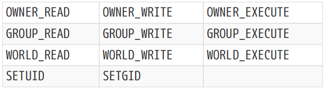
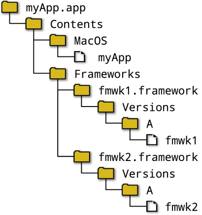

# Ch25. Installing

After all the hard work of developing the source code of a project, creating its various resources, making the build robust and implementing automated tests, the final step of making the software available for distribution is critical. It has a direct effect on the end user’s first impressions of the project and if done poorly, may result in the software being rejected before it even gets a chance to be used. 【译】在开发项目的源代码、创建各种资源、使构建健壮并实施自动化测试的所有辛勤工作之后，使软件可供分发的最后一步至关重要。它对最终用户对项目的第一印象有直接影响，如果做得不好，可能会导致软件在有机会使用之前就被拒绝。

Developers and users may have different expectations for how a project should be made available. For some, simply providing access to the source code repository and expecting end users to checkout and build it themselves is adequate. While this may be part of the delivery model, not all end users may want to get involved at such a low level. Instead, they will frequently expect a prebuilt binary package that they can install and use on their machine, preferably via some already familiar package management system. Given the variety of package managers and delivery formats involved, this can present a daunting challenge for project maintainers. Nevertheless, there are enough common elements between most of them that with some judicious planning, it is possible to support most of the popular ones and cover all major platforms. 【译】开发人员和用户可能对项目的可用性有不同的期望。对于一些人来说，简单地提供对源代码存储库的访问，并期望最终用户自己checkout和构建它就足够了。虽然这可能是交付模式的一部分，但并非所有最终用户都希望在如此低的级别参与其中。相反，他们经常期望有一个预构建的二进制包，可以在他们的机器上安装和使用，最好是通过一些已经熟悉的包管理系统。考虑到所涉及的包管理器和交付格式的多样性，这对项目维护人员来说可能是一个艰巨的挑战。然而，它们中的大多数之间有足够多的共同元素，通过一些明智的规划，可以支持大多数流行的元素并覆盖所有主要平台。

The earlier in a project’s lifecycle the delivery phase is considered, the smoother the final packaging and deployment phases are likely to be. A good starting point is to ask the following questions before development begins, or as early as possible for existing projects: 【译】在项目生命周期的早期考虑交付阶段，最终的打包和部署阶段可能会越顺利。一个好的起点是在开发开始之前，或者对现有项目尽早提出以下问题：

• What platforms should be supported, both initially and potentially in the future? Are there minimum platform API or SDK version requirements in order to support the features of the project? 【译】最初和未来都应该支持哪些平台？是否存在支持项目功能的最低平台API或SDK版本要求？

• What are the package formats that users will be familiar with on each platform ? Can the project be delivered in those formats? Are there any specific package formats that are more important than others or that are mandatory?【译】 用户在每个平台上熟悉哪些包格式？项目能否以这些格式交付？是否有任何特定的包格式比其他格式更重要或是强制性的？

• Do any of the required or desirable package formats have requirements for how software must be laid out, built or delivered? Do project resources have to be provided in specific formats,resolutions, locations, etc.? 【译】任何所需或理想的包格式是否对软件的布局、构建或交付方式有要求？项目资源是否必须以特定的格式、分辨率、位置等提供。？

• Might end users want to install multiple versions of the software simultaneously? 【译】最终用户是否希望同时安装多个版本的软件？

• Should the software support being installed without administrative privileges? 【译】是否应该在没有管理权限的情况下安装软件支持？

• Can the software be made relocatable so that users can install it anywhere on their system (including on any drive, in the case of Windows)? 【译】软件是否可以重新定位，以便用户可以将其安装在系统上的任何位置（包括Windows的任何驱动器上）？

• Does the project expect one or more of its executables to be made available on the deployment machine through the user’s PATH environment variable? Are there parts of the project which should not be exposed on the PATH? 【翻译】项目是否期望通过用户的PATH环境变量在部署计算机上提供一个或多个可执行文件？项目中是否有不应在PATH中公开的部分？

• Does the project provide anything that other CMake projects may want to use in their own builds (libraries, executables, headers, resources, etc.)?【译】该项目是否提供了其他CMake项目可能希望在自己的构建中使用的任何内容（库、可执行文件、头文件、资源等）？

These questions will strongly impact how the software is laid out when installed, which in turn affects how the source code needs to access its own resources and so on. It may even impact the functionality available to the software, so understanding these things early can save wasted effort later. 【翻译】这些问题将强烈影响软件在安装时的布局，进而影响源代码如何访问自己的资源等等。它甚至可能影响软件可用的功能，因此尽早了解这些事情可以节省以后浪费的精力。

This chapter focuses on the <span class="mark">layout</span> aspects and how to assemble the necessary files in their required locations. It also demonstrates how to make a project easy for other CMake projects to consume by providing config package support. Developers from some backgrounds may identify with these aspects as belonging to the realm of make install. The next chapter completes the picture by discussing the various package formats that CMake and CPack can produce. The implementation of that support uses the install functionality described here to install to a clean staging area and then produce the final packages from those contents. 【翻译】本章重点介绍布局方面以及如何在所需位置组装必要的文件。它还演示了如何通过提供配置包支持使项目易于其他CMake项目使用。来自某些背景的开发人员可能会认为这些方面属于make install领域。下一章将通过讨论CMake和CPack可以生成的各种包格式来完成整个过程。该支持的实现使用此处描述的安装功能安装到干净的暂存区，然后根据这些内容生成最终的包。

## 25.1. Directory Layout

Understanding the constraints imposed by the deployment platform(s) is an essential step before decisions can be made about how an installed product should be laid out. Only once those details are clear can a CMake project go about defining what to install to where. A few high level observations can be made which potentially have a strong influence on the installed layout of a project. 【翻译】在决定如何布局已安装的产品之前，了解部署平台施加的约束是至关重要的一步。只有明确了这些细节，CMake项目才能定义安装到哪里。可以进行一些高层观察，这些观察可能会对项目的安装布局产生强烈影响。

• Apple formats (bundles, frameworks, etc.) are heavily prescribed and offer little flexibility, but that also makes it very clear how a project needs to structure its deliverables. As covered back in “Chapter 22, Apple Features”, CMake already handles most of this automatically as part of the build phase, making the app ready for the last part of the Xcode-driven process that performs the final app signing, package creation and submission to the app store. If an install stage is used in CMake/CPack at all, it will largely be to simply package up bundles that follow the prescribed layout. 【翻译】苹果的格式（捆绑包、框架等）被严格规定，几乎没有灵活性，但这也清楚地表明了项目需要如何构建其可交付成果。正如“第22章，苹果功能”中所述，CMake已经在构建阶段自动处理了大部分内容，使应用程序为Xcode驱动过程的最后一部分做好了准备，该过程执行最终的应用程序签名、包创建和提交到应用商店。如果在CMake/CPack中使用安装阶段，则主要是按照规定的布局打包捆绑包。

• For projects intending to support being included as part of a Linux distribution, there will almost certainly be very specific guidelines on where each type of file should be installed. The Filesystem Hierarchy Standard forms the basis of most distributions’ layout and many other Unix-based systems follow a similar structure. Even if not aiming for inclusion in a distribution directly, the FHS still serves as a good guide for how to structure a package to achieve a smooth and robust installation on many Unix-based systems. 【翻译】对于打算支持作为Linux发行版的一部分包含在内的项目，几乎肯定会有关于每种类型文件应安装在何处的非常具体的指导方针。文件系统层次结构标准构成了大多数发行版布局的基础，许多其他基于Unix的系统也遵循类似的结构。即使不打算直接包含在发行版中，FHS仍然可以很好地指导如何构建包，以在许多基于Unix的系统上实现平稳稳健的安装。

• Some projects may want to make one or more executables available on the user’s PATH so they can be invoked easily from a terminal or command line. On Windows, if a project installation modifies the PATH by adding a directory that also contains some of its own DLLs, other applications may then pick up those DLLs instead of the ones that were expected (e.g. from their own private directories or one of the standard system-wide locations). DLLs from popular toolkits such as Qt regularly fall victim to this scenario as a result of packages modifying the PATH in ways they shouldn’t. If a project wants to augment the PATH for its own executables, it should ensure that no DLLs are present in that directory, but this is directly at odds with the need to have the DLLs in the same directory as executables so that Windows can find them at run time. The typical solution to this is to create a directory containing only launch scripts which can then safely be added to the PATH. 【翻译】一些项目可能希望在用户的PATH上提供一个或多个可执行文件，以便可以从终端或命令行轻松调用它们。在Windows上，如果项目安装通过添加一个也包含其自己的一些DLL的目录来修改PATH，则其他应用程序可能会拾取这些DLL，而不是预期的DLL（例如，从它们自己的私有目录或标准系统范围位置之一）。由于包以不应该的方式修改了PATH，Qt等流行工具包中的DLL经常成为这种情况的受害者。如果一个项目想为自己的可执行文件增加PATH，它应该确保该目录中没有DLL，但这与将DLL与可执行文件放在同一目录中的需要直接不一致，这样Windows就可以在运行时找到它们。典型的解决方案是创建一个仅包含启动脚本的目录，然后可以安全地将其添加到PATH中。

### 25.1.1. Relative Layout

With the exception of deployments to Apple platforms, there is a large degree of commonality (or at least potential commonality) across all the major platforms. The install location can be thought of as consisting of a base path and a relative layout below that path. The base path may be something like /usr/…, /opt/… or C:Program Files and obviously varies widely between platforms, but the relative layout below that base point is often very similar. A common arrangement sees executables (and for Windows, also DLLs) installed to a bin directory, libraries to lib or some variant thereof and headers under an include directory. Other file types have somewhat more variability in where they are typically installed, but these three already cover some of the most important file types a project will install.

【翻译】除了部署到苹果平台外，所有主要平台都有很大程度的共性（或至少是潜在的共性）。安装位置可以被认为是由基础路径和该路径下方的相对布局组成的。基本路径可能类似于/usr/…、/opt/…或C:Program Files，显然在不同平台之间差异很大，但该基点以下的相对布局通常非常相似。一种常见的安排是将可执行文件（对于Windows，还有DLL）安装到bin目录中，将库或其变体以及包含目录下的头文件安装到库中。其他文件类型在安装位置上有更多的可变性，但这三种文件类型已经涵盖了项目将安装的一些最重要的文件类型。

On Windows, another variation is for packages to put executables and DLLs at the base install location rather than under a bin subdirectory. While this may be a relatively common practice, it can lead to a fairly crowded base directory, making it harder for users to find other package components. Another variation is for launch scripts to be located in a subdirectory named cmd, which keeps them separated from DLLs in other locations such as bin. 【翻译】在Windows上，另一种变体是将可执行文件和DLL放在基本安装位置，而不是放在bin子目录下。虽然这可能是一种相对常见的做法，但它可能会导致基目录相当拥挤，使用户更难找到其他包组件。另一种变体是将启动脚本放置在名为cmd的子目录中，这使它们与bin等其他位置的DLL分开。

Finding a directory structure that works for most platforms is desirable, since it minimizes the platform-specific logic that has to be implemented by the project’s source code. If the project uses the same relative layout on all platforms, it is easier for an application to find things it needs at run time. In the absence of any other requirements, CMake’s GNUInstallDirs module provides a very convenient way to use a standard directory layout. It is consistent with the common cases mentioned above and it also provides various other standard locations that conform to both GNU coding standards and the FHS. Putting aside the parts that relate to the base install path (covered in the next section), the layout can even be used for Windows deployments.

【翻译】找到一个适用于大多数平台的目录结构是可取的，因为它最大限度地减少了项目源代码必须实现的平台特定逻辑。如果项目在所有平台上使用相同的相对布局，应用程序在运行时更容易找到所需的东西。在没有任何其他要求的情况下，CMake的GNUInstallDirs模块提供了一种使用标准目录布局的非常方便的方法。它与上述常见情况一致，还提供了符合GNU编码标准和FHS的各种其他标准位置。抛开与基本安装路径相关的部分（下一节将介绍），该布局甚至可以用于Windows部署。

Using the GNUInstallDirs module is fairly straightforward, it is included like any other module:

【翻译】使用GNUInstallDirs模块相当简单，它和其他模块一样包含在内：

#------------------------------------>>>>>>

# Minimal inclusion, but see caveat further below

include(GNUInstallDirs)

#------------------------------------<<<<<<

This will create cache variables of the form CMAKE_INSTALL_<dir> where <dir> denotes a particular location. The module’s documentation gives full details of all the defined locations, but some of the more commonly used ones and their intended use include:

【翻译】这将创建形式为CMAKE_INSTALL_<dir>的缓存变量，其中<dir>表示特定位置。该模块的文档提供了所有定义位置的全部详细信息，但一些更常用的位置及其预期用途包括：

#>>>>>>>>>>>>>>>>>>>>>>>>>>>>>>>>>>>>>>>>>>

**#(1)BINDIR**

Executables, scripts and symlinks intended for end users to run directly. Defaults to bin.

【翻译】供最终用户直接运行的可执行文件、脚本和符号链接。默认为bin。

**#(2)SBINDIR**

Similar to BINDIR except intended for system admin use. Defaults to sbin.

【翻译】与BINDIR类似，但仅供系统管理员使用。默认为sbin。

**#(3)LIBDIR**

Libraries and object files. Defaults to lib or some variation of that depending on the host/target platform (including possibly a further architecture-specific subdirectory).

【翻译】库和对象文件。默认为lib或其变体，具体取决于主机/目标平台（可能包括另一个特定于架构的子目录）。

**#(4)LIBEXECDIR**

Executables not directly invoked by users, but might be run via launch scripts or symlinks located in BINDIR or by other means. Defaults to libexec

【翻译】用户不直接调用的可执行文件，但可以通过BINDIR中的启动脚本或符号链接或其他方式运行。默认为libexec

**#(5)INCLUDEDIR**

Header files. Defaults to include. 【翻译】头文件。默认包括。

**#(6)DATAROOTDIR**

Root point of read-only architecture-independent data. Not typically referred to directly, except perhaps to work around caveats for DOCDIR. 【翻译】只读架构无关数据的根点。通常不直接提及，除非是为了规避DOCDIR的警告。

**#(7)DATADIR**

Read-only architecture-independent data such as images and other resources. Defaults to the same as DATAROOTDIR and is the preferred way to refer to locations for arbitrary project data not covered by other defined locations. 【翻译】只读与架构无关的数据，如图像和其他资源。默认值与DATAROOTDIR相同，是参考其他定义位置未涵盖的任意项目数据位置的首选方式。

**#(8)MANDIR**

Documentation in the man format. Defaults to DATAROOTDIR/man 【翻译】man格式的文档。默认为DATAROOTDIR/man

**#(9)**DOCDIR

Generic documentation. Defaults to DATAROOTDIR/doc/PROJECT_NAME (see notes below for why relying on this default value is relatively unsafe). 【翻译】通用文件。默认为DATAROOTDIR/doc/PROJECT_NAME（请参阅下面的注释，了解为什么依赖此默认值相对不安全）。

#<<<<<<<<<<<<<<<<<<<<<<<<<<<<<<<<<<<<<<<<<<

Since each location is defined as a cache variable, they can be overridden if needed. Developers would not normally change them, as install locations should be under the control of the project. Even for the project though, changing the locations from the defaults is not generally advisable, but it can be useful if the project wants to mostly follow the standard layout and only needs to make a few small tweaks.

【翻译】由于每个位置都被定义为缓存变量，因此如果需要，可以覆盖它们。开发人员通常不会更改它们，因为安装位置应该在项目的控制之下。即使对于项目来说，更改默认位置通常也是不可取的，但如果项目想主要遵循标准布局，只需要做一些小的调整，这可能会很有用。

The DOCDIR location deserves special mention, as it defaults to a value that incorporates the PROJECT_NAME variable. PROJECT_NAME is updated by each call to project() and therefore can vary throughout the project hierarchy. The GNUInstallDirs module sets cache variables only if they are not already defined, so the value of CMAKE_INSTALL_DOCDIR will be determined by where the GNUInstallDirs module is first included. To protect against this and allow the default documentation directory to follow the project hierarchy, projects may want to explicitly set the DOCDIR location every time the module is included (the non-cache variable will override the cache variable):

【翻译】DOCDIR位置值得特别提及，因为它默认为包含PROJECT_NAME变量的值。每次调用PROJECT()都会更新PROJECT_NAME，因此在整个项目层次结构中可能会有所不同。GNUInstallDirs模块仅在缓存变量尚未定义时设置缓存变量，因此CMAKE_INSTALL_DOCDIR的值将由GNUInstallDirs模块首次包含的位置决定。为了防止这种情况，并允许默认文档目录遵循项目层次结构，项目可能希望在每次包含模块时显式设置DOCDIR位置（非缓存变量将覆盖缓存变量）：

```cmake

# Explicitly set DOCDIR location each time

include(GNUInstallDirs)

set(CMAKE_INSTALL_DOCDIR
   ${CMAKE_INSTALL_DATAROOTDIR}/doc/${PROJECT_NAME})
```
For the remainder of this chapter, examples will use the CMAKE_INSTALL_<dir> variables for most relative install destinations.

【翻译】在本章的其余部分，示例将使用CMAKE_INSTALL_<dir>变量来实现大多数相对安装目标。

### 25.1.2. Base Install Location

After the relative layout of installed files has been determined, the base install location of that layout must be decided. A number of considerations impact this decision, but perhaps the first question to answer is whether the install should be relocatable. This just means that any install base point can be used and as long as the relative layout is preserved, the installed project will still work as intended. Being relocatable is highly desirable and should be the goal of most projects, since it opens up more use cases, such as:

【翻译】在确定了已安装文件的相对布局后，必须确定该布局的基本安装位置。许多考虑因素会影响这一决定，但也许要回答的第一个问题是安装是否应该可重新定位。这只是意味着可以使用任何安装基点，只要保留了相对布局，安装的项目仍将按预期工作。可重定位是非常可取的，应该是大多数项目的目标，因为它开辟了更多的用例，例如：

• Multiple versions can be installed simultaneously. 【翻译】可以同时安装多个版本。

• Relocatable packages can be installed to shared drives which may have different mount points on different end users’ machines. 【翻译】可重新定位的软件包可以安装到共享驱动器上，这些驱动器在不同最终用户的机器上可能有不同的装载点。

• A set of self-contained relocatable files can be more easily packaged up by a wider range of packaging systems. 【翻译】一组自包含的可重定位文件可以通过更广泛的打包系统更容易地打包。

• Non-admin users can install a relocatable project locally under their own account. 【翻译】非管理员用户可以在自己的帐户下在本地安装可重定位项目。

Not all projects can be made relocatable, some need to place their files in very specific locations (e.g. kernel packages). Some projects can be relocatable except for a few configuration files, in which case a useful strategy can sometimes be to handle those specific files as a scripted post-install step (the next chapter discusses some aspects of this for specific packaging systems).

【翻译】 并非所有项目都可以重新定位，有些项目需要将文件放置在非常特定的位置（例如内核包）。除了少数配置文件外，一些项目可以重新定位，在这种情况下，一个有用的策略有时是将这些特定文件作为脚本安装后步骤进行处理（下一章将讨论特定打包系统的一些方面）。

The choice of base install location is closely tied to the target platform, with each one having its own common practices and guidelines. On Windows, the base install location is usually a subdirectory of C:\Program Files, whereas on most other systems, it is /usr/local or a subdirectory of /opt. CMake provides a number of controls for managing the base install location to mostly abstract away these platform differences. Perhaps the most important is the CMAKE_INSTALL_PREFIX variable, which controls the base install location when the user builds the install target (the target may be called INSTALL with some generator types). The default value of CMAKE_INSTALL_PREFIX is C:\Program Files\{PROJECT_NAME} on Windows and /usr/local on Unix-based platforms.

【翻译】基础安装位置的选择与目标平台密切相关，每个平台都有自己的通用做法和指导方针。在Windows上，基本安装位置通常是C:\Program Files的子目录，而在大多数其他系统上，它是/usr/local或/opt的子目录。CMake提供了许多用于管理基本安装位置的控件，以主要抽象出这些平台差异。也许最重要的是CMAKE_INSTALL_PREFIX变量，它在用户构建安装目标时控制基本安装位置（在某些生成器类型中，目标可能被称为INSTALL）。CMAKE_INSTALL_PREFIX的默认值在Windows上为C:\Program Files\{PROJECT_NAME}，在基于Unix的平台上为/usr/local。

When installing on Linux, the default value does not conform to the File System Hierarchy standard. The FHS requires system packages to use a base location of / or /usr, with the latter more likely to be the desired choice. For add-on packages, they should be installed to /opt/<package> or /opt/<provider>, with a recommendation to use /opt/<provider>/<package>. If <provider> is used, it is formally expected to be a LANANA-registered name or just the lowercase fully qualified domain name of the organization providing the package. This is to avoid clashes between different packages trying to use the same base install location. For most projects, explicitly setting CMAKE_INSTALL_PREFIX for non-Windows platforms to a FHS-compliant /opt/… path is advisable, but this should generally only be done in the top level CMakeLists.txt with an appropriate check that the project is in fact the top level of the source tree (to support hierarchical project arrangements).

【翻译】在Linux上安装时，默认值不符合文件系统层次结构标准。FHS要求系统包使用/或/usr的基本位置，后者更可能是理想的选择。对于附加软件包，应将其安装到/opt/<package>或/opt/<provider>，并建议使用/opt/<provider>/<package]。如果使用<provider>，则正式预期它是LANANA注册名称，或者只是提供包的组织的小写完全限定域名。这是为了避免试图使用相同基本安装位置的不同软件包之间的冲突。对于大多数项目，建议将非Windows平台的CMAKE_INSTALL_PREFIX显式设置为符合FHS的/opt/…路径，但这通常只能在顶级CMakeLists.txt中完成，并适当检查项目是否确实是源代码树的顶级（以支持分层项目安排）。

```cmake

if(NOT WIN32 AND CMAKE_SOURCE_DIR STREQUAL CMAKE_CURRENT_SOURCE_DIR)

set(CMAKE_INSTALL_PREFIX "/opt/mycompany.com/${PROJECT_NAME}")

endif()
```

For cross-compiling scenarios, the CMAKE_STAGING_PREFIX variable can be defined to provide an override for where the install rule installs to. This is to allow installing to an alternate part of the file system while still preserving all the other effects of CMAKE_INSTALL_PREFIX, such as embedding of paths in the installed binaries (covered in Section 25.2.2, “RPATH” later in this chapter). CMAKE_STAGING_PREFIX also affects the search paths of most find\_…() commands.

【翻译】对于交叉编译场景，可以定义CMAKE_STAGING_PREFIX变量，为安装规则的安装位置提供覆盖。这是为了允许安装到文件系统的其他部分，同时仍然保留CMAKE_INSTALL_PREFIX 的所有其他效果，例如在已安装的二进制文件中嵌入路径（本章稍后的第25.2.2节“RPATH”中介绍）。CMAKE_STAGING_PREFIX也会影响大多数find\_…（）命令的搜索路径。

For some packaging scenarios and to allow testing the install process in a location off to the side, CMake supports the common DESTDIR functionality for non-Windows platforms. DESTDIR is not a CMake variable, but rather it is a variable passed to the build tool or set as an environment variable for the build tool to read. It allows the install base location to be placed under some arbitrary location rather than the root of the file system. It is typically used on a command line when invoking the build tool directly, such as:

【翻译】对于某些打包场景，为了允许在侧面的位置测试安装过程，CMake支持非Windows平台的常见DESTDIR功能。DESTDIR不是CMake变量，而是传递给构建工具的变量，或者设置为构建工具读取的环境变量。它允许将安装基础位置放置在某个任意位置，而不是文件系统的根目录下。它通常在直接调用构建工具时在命令行上使用，例如：

```sh
make DESTDIR=/home/me/staging install
env DESTDIR=/home/me/staging ninja install
```

The DESTDIR functionality is somewhat conceptually similar to CMAKE_STAGING_PREFIX, but DESTDIR is specified only at install time and does not affect things like find\_…() commands.CMAKE_STAGING_PREFIX is saved as a cache variable, whereas DESTDIR is an environment variable and is not saved between invocations of the build tool.The combination of CMAKE_INSTALL_PREFIX, CMAKE_STAGING_PREFIX and DESTDIR gives the project and the developer the flexibility to set the base install location as needed and to perform test installs without actually touching the final intended install location. Be aware, however, that the various packaging formats may have their own default base install locations and may completely ignore these three variables in preference to their own package-specific ones.

【翻译】DESTDIR功能在概念上与CMAKE_STAGING_PREFIX有些相似，但DESTDIR仅在安装时指定，不影响find\_…() 命令等。CMAKE_STAGING_PREFIX保存为缓存变量，而DESTDIR是环境变量，在构建工具的调用之间不会保存。CMAKE_INSTALL_PREFIX、CMAKE_STAGING_PREFIX和DESTDIR的组合使项目和开发人员能够根据需要灵活设置基本安装位置，并在不实际接触最终预期安装位置的情况下进行测试安装。但是，请注意，各种打包格式可能有自己的默认基本安装位置，并且可能会完全忽略这三个变量，而不是它们自己的特定于包的变量。

With the structure of the install area defined, attention can now move to the installed content itself.Projects use the install() command to define what to install, where those things should be located and so on. This command has a number of different forms, each focused on a particular type of entity which is specified by the first argument to the command. One of the key forms is for installing targets:

【翻译】定义了安装区域的结构后，现在可以将注意力转移到已安装的内容本身。项目使用install()命令来定义要安装什么、这些东西应该放在哪里等等。此命令有多种不同的形式，每种形式都专注于由命令的第一个参数指定的特定类型的实体。其中一个关键形式是安装目标：

```cmake
install(TARGETS targets...
[EXPORT exportName]
[CONFIGURATIONS configs...]

# One or more blocks of the following
[ [entityType]
 DESTINATION dir
 [PERMISSIONS permissions...]
 [NAMELINK_ONLY | NAMELINK_SKIP]
 [COMPONENT component]
 [NAMELINK_COMPONENT component] # CMake 3.12 or later only
 [EXCLUDE_FROM_ALL]
 [OPTIONAL]
 [CONFIGURATIONS configs...]
]...

# Special case
[INCLUDES DESTINATION incDirs...]

)

```

One or more targets are provided and then the entityType blocks specify how to handle installing the various parts of those targets. Each of the targets must be defined in the same directory scope as the install() command and the entityType must be one of the following:

【译】提供一个或多个目标，然后entityType块指定如何处理安装这些目标的各个部分。每个目标都必须在与install()命令相同的目录范围内定义，并且entityType必须是以下之一：

#>>>>>>>>>>>>>>>>>>>>>>>>>>>>>>>>>>>>>>>>>>

**#(1)RUNTIME**

Install executable binaries. On Windows, this also installs the DLL part of library targets. Apple bundles are excluded.

【翻译】安装可执行二进制文件。在Windows上，这也会安装库目标的DLL部分。苹果捆绑包不包括在内。

**#(2)LIBRARY**

Install shared libraries on all platforms except Windows. Apple frameworks are excluded.

【译】在除Windows之外的所有平台上安装共享库。苹果框架被排除在外。

**#(3)ARCHIVE**

Install static libraries (all platforms). On Windows, this also installs the import library (i.e. .lib) part of shared library targets. Apple frameworks are excluded.

【译】安装静态库（所有平台）。在Windows上，这还会安装共享库目标的导入库（即.lib）部分。苹果框架被排除在外。

**#(4)OBJECTS**

Install the objects associated with object libraries (CMake 3.9 or later only). 【译】安装与对象库关联的对象（仅限CMake 3.9或更高版本）。

**#(5)FRAMEWORK**

On Apple platforms, install frameworks (shared or static), including any content that has been copied into them (e.g. by POST_BUILD custom rules).

【译】在苹果平台上，安装框架（共享或静态），包括复制到其中的任何内容（例如通过POST_BUILD自定义规则）。

**#(6)BUNDLE**

On Apple platforms, install bundles, including any content that has been copied into them.

【译】在苹果平台上，安装捆绑包，包括复制到其中的任何内容。

**#(7)PUBLIC_HEADER**

On non-Apple platforms, this installs files listed in a framework library target’s PUBLIC_HEADER property. On Apple platforms, these header files are handled as part of the FRAMEWORK entity type instead, but for non-Apple platforms, such targets are treated as ordinary shared libraries and the headers need to be explicitly installed as a separate entity type.

【译】在非苹果平台上，这会安装框架库目标的PUBLIC_HEADER属性中列出的文件。在Apple平台上，这些头文件作为FRAMEWORK实体类型的一部分进行处理，但对于非Apple平台，这些目标被视为普通共享库，头文件需要作为单独的实体类型显式安装。

**#(8)PRIVATE_HEADER**

Analogous to the PUBLIC_HEADER entity type, except the affected target property is PRIVATE_HEADER.

【译】类似于PUBLIC_HEADER实体类型，但受影响的目标属性是PRIVATE_HEADER。

**#(9)RESOURCE**

On non-Apple platforms, this installs files listed in a target’s RESOURCE property of a framework or bundle target. On Apple platforms, such files are included as part of the FRAMEWORK or BUNDLE entity type instead.

【译】在非苹果平台上，这会安装框架或捆绑包目标的目标RESOURCE属性中列出的文件。在Apple平台上，此类文件作为FRAMEWORK或BUNDLE实体类型的一部分包含在内。
#<<<<<<<<<<<<<<<<<<<<<<<<<<<<<<<<<<<<<<<<<<

After the entityType, various options can be listed and they only apply to that entity type. For instance, the following shows how to install libraries in a way that puts the respective parts in their expected place on all platforms (assuming they are not Apple frameworks):

【译】在entityType之后，可以列出各种选项，并且这些选项仅适用于该实体类型。例如，下面显示了如何安装库，将各个部分放在所有平台上的预期位置（假设它们不是Apple框架）：

```cmake
install(TARGETS mySharedLib myStaticLib
        RUNTIME DESTINATION ${CMAKE_INSTALL_BINDIR}
        LIBRARY DESTINATION ${CMAKE_INSTALL_LIBDIR}
        ARCHIVE DESTINATION ${CMAKE_INSTALL_LIBDIR}
)
```

The above example shows how the DESTINATION option can specify different locations for different parts of the same target. The command is also flexible enough to handle multiple targets of different types all at once.

【译】 上面的示例显示了DESTINATION选项如何为同一目标的不同部分指定不同的位置。该命令也足够灵活，可以同时处理不同类型的多个目标。

• For mySharedLib, on Windows the DLL would go to the RUNTIME destination and the import library to the ARCHIVE destination. On other platforms, the shared library would be installed to the LIBRARY destination. 【译】对于mySharedLib，在Windows上，DLL将转到RUNTIME目标，导入库将转到ARCHIVE目标。在其他平台上，共享库将安装到library目标。

• The static library of the myStaticLib target would be installed to the ARCHIVE destination. 【译】myStaticLib目标的静态库将安装到ARCHIVE目标。

CMake will usually issue a warning or error if a target provides a particular entity for which there is no corresponding entityType section (e.g. one of the targets is a static library but no ARCHIVE section is provided). As an exception to this, the entityType can be omitted, in which case the options that follow the list of targets will apply to all entity types. This is usually only done when it is obvious that there can only be one entity type for the targets listed:

【译】如果目标提供的特定实体没有相应的entityType部分（例如，其中一个目标是静态库，但没有提供ARCHIVE部分），CMake通常会发出警告或错误。作为例外，可以省略entityType，在这种情况下，目标列表后面的选项将应用于所有实体类型。通常只有在很明显所列目标只能有一种实体类型时才会这样做：

```cmake

# Targets are both executables, so specifying the entity type isn't needed
install(TARGETS exe1 exe2
    DESTINATION  ${CMAKE_INSTALL_BINDIR}
    )
```

Options following an entity type can specify more than just the destination. They can also override the default permissions with the PERMISSIONS option, specifying one or more of the same values as for the file(COPY) command described back in Section 18.2, “Copying Files”:

【译】实体类型后面的选项可以指定的不仅仅是目标。他们还可以使用permissions选项覆盖默认权限，指定一个或多个与第18.2节“复制文件”中描述的文件（COPY）命令相同的值：



As for file(COPY), permissions not supported for the platform will simply be ignored. Note that CMake usually sets appropriate permissions for all targets by default, so one would typically only need to explicitly provide permissions if the installed location needs more restrictive permissions than normal or if one of the SETUID or SETGID permissions needs to be added. For instance:

【译】对于文件（COPY），平台不支持的权限将被忽略。请注意，CMake通常默认为所有目标设置适当的权限，因此通常只需要在安装位置需要比正常情况更严格的权限，或者需要添加SETUID或SETGID权限之一时明确提供权限。例如：

```cmake

\# Intended to only be run by an administrator, so only allow the owner to have access

install(TARGETS onlyOwnerCanRunMe

DESTINATION \${CMAKE_INSTALL_SBINDIR}

PERMISSIONS OWNER_READ OWNER_WRITE OWNER_EXECUTE

)

\# Install with set-group permission

install(TARGETS runAsGroup

DESTINATION \${CMAKE_INSTALL_BINDIR}

PERMISSIONS OWNER_READ OWNER_WRITE OWNER_EXECUTE

GROUP_READ GROUP_EXECUTE SETGID

)
```

For the LIBRARY entity type, some platforms support the creation of symbolic links when version details have been provided for a library target (see Section 20.3, “Shared Library Versioning”). The set of files and symlinks that might exist for a shared library typically look something like this:

【译】对于LIBRARY实体类型，当为库目标提供了版本详细信息时，一些平台支持创建符号链接（见第20.3节“共享库版本控制”）。共享库中可能存在的一组文件和符号链接通常看起来像这样：

```cmake

libmyShared.so.1.3.2 ①

libmyShared.so.1 --\> libmyShared.so.1.3.2 ②

libmyShared.so --\> libmyShared.so.1 ③

```

① The actual versioned binary built by the project. 【译】项目构建的实际版本二进制文件。

② Symbolic link whose name is the soname of the library. When following semantic versioning, this will contain only the major part of the version in its name. 【译】象征性链接，其名称是lib的名称。在遵循语义版本控制时，其名称中仅包含版本的主要部分。

③ Namelink with no version details embedded in the file name. This is required for the library to be found when a linker command line contains an option like -lmyShared.【译】文件名中没有嵌入版本详细信息的名称链接。当链接器命令行包含-lmyShare等选项时，需要找到库。

When installing LIBRARY entities, the NAMELINK_ONLY or NAMELINK_SKIP options can be given. The NAMELINK_ONLY option will result in only the namelink being installed, whereas NAMELINK_SKIP will result in all but the namelink being installed. If a library target has no version details or the platform doesn’t support namelinks, the behavior of these two options changes. NAMELINK_ONLY will then install nothing and NAMELINK_SKIP will install the real library. These options are especially useful when creating separate runtime and development packages, with the namelink part going into the development package and the other files/links going into the runtime package. When a NAMELINK_ONLY option is given, CMake will not warn about missing entity type blocks for other parts of the library not mentioned in that install() command. This is needed because NAMELINK_SKIP and NAMELINK_ONLY cannot both be given in the same install() call, the two have to be split across separate calls (see example below).

【译】安装库实体时，可以给出NAMELINK_ONLY或NAMELINK_SKIP选项。NAMELINK_ONLY选项将只安装NAMELINK，而NAMELINK_SKIP将安装除NAMELINK之外的所有内容。如果库目标没有版本详细信息或平台不支持名称链接，则这两个选项的行为会发生变化。NAMELINK_ONLY将不安装任何东西，NAMELINK_SKIP将安装真正的库。这些选项在创建单独的运行时和开发包时特别有用，其中namelink部分进入开发包，其他文件/链接进入运行时包。当给出NAMELINK_ONLY选项时，CMake不会警告该install（）命令中未提及的库的其他部分缺少实体类型块。这是必要的，因为NAMELINK_SKIP和NAMELINK_ONLY不能在同一个install（）调用中同时给出，两者必须在单独的调用中拆分（见下面的示例）。

Each entityType section can also specify a COMPONENT option. Components are a logical grouping used mainly for packaging and are discussed in detail in the next chapter, but for now, think of them as a way of separating out different install sets. The above mentioned scenario for separate runtime and development packages could be set up as follows:

【译】每个entityType部分还可以指定一个COMPONENT选项。组件是一种逻辑分组，主要用于打包，下一章将详细讨论，但现在，将它们视为分离不同安装集的一种方式。上述单独运行时和开发包的场景可以设置如下：

```cmake

install(TARGETS myShared myStatic

RUNTIME

> DESTINATION \${CMAKE_INSTALL_BINDIR}
>
> COMPONENT MyProj_Runtime

LIBRARY

> DESTINATION \${CMAKE_INSTALL_LIBDIR}
>
> NAMELINK_SKIP
>
> COMPONENT MyProj_Runtime

ARCHIVE

> DESTINATION \${CMAKE_INSTALL_LIBDIR}
>
> COMPONENT MyProj_Development

)

\# Because NAMELINK_ONLY is given, CMake won't complain about a missing RUNTIME block

install(TARGETS myShared

LIBRARY

> DESTINATION \${CMAKE_INSTALL_LIBDIR}
>
> NAMELINK_ONLY
>
> COMPONENT MyProj_Development

)

```

From CMake 3.12, a simpler way of splitting out the namelink to a different component is available using the NAMELINK_COMPONENT option. This option can be used in conjunction with COMPONENT, but only within a LIBRARY block. Using this new option, the above can be expressed more concisely: 【翻译】从CMake 3.12开始，使用namelink_CONCOMPENT选项可以更简单地将名称链接拆分到不同的组件。此选项可以与COMPONENT结合使用，但只能在LIBRARY块中使用。使用这个新选项，可以更简洁地表达上述内容：

```cmake

install(TARGETS myShared myStatic

RUNTIME

DESTINATION \${CMAKE_INSTALL_BINDIR}

COMPONENT MyProj_Runtime

LIBRARY

DESTINATION \${CMAKE_INSTALL_LIBDIR}

COMPONENT MyProj_Runtime

NAMELINK_COMPONENT MyProj_Development \# Requires CMake 3.12 or later

ARCHIVE

DESTINATION \${CMAKE_INSTALL_LIBDIR}

COMPONENT MyProj_Development

)

```

If no COMPONENT is given for a block, it is associated with a default component whose name is given by the variable CMAKE_INSTALL_DEFAULT_COMPONENT_NAME. If that variable is not set, Unspecified is used as the default component name. An example where it can be helpful to change the default component name is where a third party child project doesn’t use any install components. To keep that child project’s install artifacts separate from the main project, the default name can be changed just before calling add_subdirectory() to pull the child project into the main build. 【翻译】如果没有为块指定COMPONENT，则它与默认组件相关联，该默认组件的名称由变量CMAKE_INSTALL_default_COMPONENT_name给出。如果未设置该变量，则使用“未指定”作为默认组件名称。更改默认组件名称可能会有所帮助的一个例子是，第三方子项目不使用任何安装组件。为了使子项目的安装工件与主项目分开，可以在调用add_subdirectory（）将子项目拉入主构建之前更改默认名称。

The EXCLUDE_FROM_ALL option can be used to restrict an entity block to only get installed for component-specific installs. By default, an install is not component-specific and all components are installed, but packaging implementations may install specific components individually. Documentation was added in CMake 3.12 to show how to do this from the command line as well. For most projects, EXCLUDE_FROM_ALL is unlikely to be needed. 【翻译】EXCLUDE_FROM_ALL选项可用于限制实体块仅在特定于组件的安装中安装。默认情况下，安装不是特定于组件的，所有组件都已安装，但打包实现可以单独安装特定组件。CMake 3.12中添加了文档，以显示如何从命令行执行此操作。对于大多数项目，不太可能需要EXCLUDE_FROM_ALL。

The OPTIONAL keyword is also rarely used. If the entity type of a target is expected to be present but it is missing (e.g. the import library of a Windows DLL for an ARCHIVE entity type section), CMake will not consider it an error. Use this option with caution, as it has the ability to mask misconfiguration of the build/install logic. 【翻译】OPTIONAL关键字也很少使用。如果目标的实体类型应该存在但缺失（例如，用于ARCHIVE实体类型部分的Windows DLL的导入库），CMake不会将其视为错误。谨慎使用此选项，因为它能够掩盖构建/安装逻辑的错误配置。

An entity type block can also be made configuration-specific by adding a CONFIGURATIONS option to it. That entity type will only be installed if the current build type is one of those listed. An entity type cannot be listed more than once for a single install() command, so if different configurations need different details, multiple calls are needed. The following example shows how to install the Debug and Release versions of static libraries in different directories:

【翻译】通过向实体类型块添加CONFIGURATIONS选项，也可以使其具有配置特定性。只有当当前构建类型是列出的类型之一时，才会安装该实体类型。对于单个install（）命令，实体类型不能列出多次，因此，如果不同的配置需要不同的详细信息，则需要多次调用。以下示例显示了如何在不同目录中安装静态库的调试和发布版本：

```cmake

install(TARGETS myStatic

ARCHIVE

> DESTINATION \${CMAKE_INSTALL_LIBDIR}/Debug
>
> CONFIGURATIONS Debug

)

install(TARGETS myStatic

ARCHIVE

> DESTINATION \${CMAKE_INSTALL_LIBDIR}/Release
>
> CONFIGURATIONS Release RelWithDebInfo MinSizeRel

)

```

The CONFIGURATIONS keyword can also precede all entity blocks and act as a default for those that don’t provide their own configuration override. In the following example, all blocks get installed only for Release builds, except for the ARCHIVE block which is installed for Debug and Release. 【翻译】CONFIGURATIONS关键字也可以位于所有实体块之前，并作为那些不提供自己的配置覆盖的默认值。在下面的示例中，除了为调试和发布安装的ARCHIVE块外，所有块仅在发布版本中安装。

```cmake

install(TARGETS myShared myStatic

CONFIGURATIONS Release

RUNTIME

> DESTINATION \${CMAKE_INSTALL_BINDIR}

LIBRARY

> DESTINATION \${CMAKE_INSTALL_LIBDIR}

ARCHIVE

> DESTINATION \${CMAKE_INSTALL_LIBDIR}
>
> CONFIGURATIONS Debug Release

)

```

### 25.2.1. Interface Properties

If the targets are exported (discussed in Section 25.3, “Installing Exports” further below), they have the opportunity to set interface properties to be consumed by other projects’ targets. The various INTERFACE target properties are carried through to the exported details of the installed target automatically, but special handling is needed to account for the distinctly different needs of building the target versus those for consuming the installed target. Consider the following code sample: 【翻译】如果目标被导出（详见下文第25.3节“安装导出”），他们就有机会设置其他项目目标所使用的接口属性。各种INTERFACE目标属性会自动传递到已安装目标的导出详细信息中，但需要特殊处理来考虑构建目标与使用已安装目标明显不同的需求。考虑以下代码示例：

```cmake

add_library(foo STATIC ...)

target_include_directories(foo

INTERFACE \${CMAKE_CURRENT_BINARY_DIR}/somewhere

\${MyProject_BINARY_DIR}/anotherDir

)

install(TARGETS foo

DESTINATION ...

)

```

Within the build itself, anything linking to foo will have the absolute paths to somewhere and anotherDir added to its header search path. When foo is installed, it may be packaged up and deployed to an entirely different machine. Clearly the path to somewhere and anotherDir would no longer make sense, but the above example would add them to consuming targets’ header search path anyway. What is needed is a way to say "Use path xxx when building and path yyy when installing", which is exactly what the BUILD_INTERFACE and INSTALL_INTERFACE generator expressions do: 【翻译】在构建本身中，任何链接到foo的东西都会有到某处的绝对路径，并在其头部搜索路径中添加另一个Dir。安装foo后，它可能会被打包并部署到完全不同的机器上。显然，到某处和另一个Dir的路径将不再有意义，但上述示例无论如何都会将它们添加到消费目标的标头搜索路径中。我们需要的是一种方式来表达“构建时使用路径xxx，安装时使用路径yyy”，这正是BUILD_INTERFACE和INSTALLINTERFACE生成器表达式的作用：

```cmake

include(GNUInstallDirs)

target_include_directories(foo

INTERFACE

> \$\<BUILD_INTERFACE:\${CMAKE_CURRENT_BINARY_DIR}/somewhere\>
>
> \$\<BUILD_INTERFACE:\${MyProject_BINARY_DIR}/anotherDir\>
>
> \$\<INSTALL_INTERFACE:\${CMAKE_INSTALL_INCLUDEDIR}\>

)

```

\$\<BUILD_INTERFACE:xxx\> will expand to xxx for the build tree and expand to nothing when installing, whereas \$\<INSTALL_INTERFACE:yyy\> does the opposite, ensuring that yyy is only added for the installed target. In the case of INSTALL_INTERFACE, yyy is usually a relative path, which is treated as being relative to the base install location. 【翻译】\$\<BUILD_INTERFACE:xxx\>将在构建树中扩展为xxx，并在安装时扩展为无，而\$\<INSTALLINTERFACE:yyy\>则相反，确保yyy仅为已安装的目标添加。在INSTALLINTERFACE的情况下，yyy通常是一个相对路径，被视为相对于基本安装位置。

While the header search path within the build tree may vary from target to target, it is very common for the targets to all share the same header search path once installed. In the above example, CMAKE_INSTALL_INCLUDEDIR is used and is likely to be repeated for every installable target, but specifying it individually for each target is not the most convenient approach. The INCLUDES option of the install() command can be used instead to specify the same information for a group of targets. All the directories given after INCLUDES DESTINATION are added to the INTERFACE_INCLUDE_DIRECTORIES property of each target listed. This leads to a more concise description of header search path details. 【翻译】虽然构建树中的标头搜索路径可能因目标而异，但安装后目标共享相同的标头搜索道路是很常见的。在上面的示例中，使用了CMAKE_INSTALL_INCLUDEDIR，并且可能会对每个可安装的目标重复使用，但为每个目标单独指定它并不是最方便的方法。install（）命令的INCLUDES选项可用于为一组目标指定相同的信息。在INCLUDESDESTINATION之后给出的所有目录都将添加到列出的每个目标的INTERFACE_INCLUDE_directories属性中。这使得标题搜索路径的详细信息描述更为简洁。

```cmake

add_library(myStatic STATIC ...)

add_library(myHeaderOnly INTERFACE ...)

target_include_directories(myStatic

PUBLIC \$\<BUILD_INTERFACE:\${CMAKE_CURRENT_BINARY_DIR}/static_exports\>

)

target_include_directories(myHeaderOnly

INTERFACE \$\<BUILD_INTERFACE:\${CMAKE_CURRENT_LIST_DIR}\>

)

install(TARGETS myStatic myHeaderOnly

ARCHIVE

> DESTINATION \${CMAKE_INSTALL_LIBDIR}

INCLUDES

> DESTINATION \${CMAKE_INSTALL_INCLUDEDIR}

)

```

Unlike the other entity type blocks, multiple directories can be listed for INCLUDES DESTINATION if required, although this is likely to be less common in practice. Also note that an INCLUDES block supports none of the other details that other entityType blocks support, it may only specify a DESTINATION keyword followed by one or more locations. 【翻译】与其他实体类型块不同，如果需要，可以为INCLUDESTINATION列出多个目录，尽管这在实践中可能不太常见。还要注意，INCLUDES块不支持其他entityType块支持的其他细节，它只能指定一个DESTINATION关键字，后跟一个或多个位置。

### 25.2.2. RPATH

When a library or executable is loaded by the operating system, it has to find all the other shared libraries the binary has been linked against. Different platforms have different ways of handling this. Windows relies on finding all required libraries by searching the locations in the PATH environment variable as well as the directory in which the binary is located. Other platforms use different environment variables specifically intended for the purpose, such as LD_LIBRARY_PATH or variations thereof, in conjunction with other mechanisms such as libraries listed in conf files. A drawback to the dependence on environment variables is that it relies on the person or process loading the binary to have set up the environment correctly. 【翻译】当操作系统加载库或可执行文件时，它必须找到二进制文件链接的所有其他共享库。不同的平台有不同的处理方式。Windows依赖于通过搜索PATH环境变量中的位置以及二进制文件所在的目录来查找所有必需的库。其他平台使用专门用于此目的的不同环境变量，如LD_LIBRARY_PATH或其变体，并结合其他机制，如conf文件中列出的库。依赖环境变量的一个缺点是，它依赖于加载二进制文件的人或进程来正确设置环境。

In many cases, the package providing the binary already knows where many of the dependent libraries can be found, since they may have been part of the same package. Most non-Windows platforms support binaries being able to encode library search paths directly into the binaries themselves. The generic name for this feature is run path or RPATH support, although the actual name may have platform-specific variations. With embedded RPATH details, a binary can be selfcontained and not have to rely on any paths being provided by the environment or system configuration. Furthermore, an RPATH can contain certain placeholders that allow it to effectively define relative paths that are only resolved to absolute paths at run time. The placeholders allow that resolution to be made based on the location of the binary, so relocatable packages can define RPATH details that only hard-code paths based on the package’s relative layout. 【翻译】在许多情况下，提供二进制文件的包已经知道在哪里可以找到许多依赖库，因为它们可能是同一包的一部分。大多数非Windows平台支持二进制文件能够将库搜索路径直接编码到二进制文件本身中。此功能的通用名称是运行路径或RPATH支持，尽管实际名称可能因平台而异。通过嵌入RPATH细节，二进制文件可以自给自足，不必依赖于环境或系统配置提供的任何路径。此外，RPATH可以包含某些占位符，使其能够有效地定义在运行时仅解析为绝对路径的相对路径。占位符允许根据二进制文件的位置进行解析，因此可重定位包可以定义RPATH细节，这些细节仅基于包的相对布局进行硬编码路径。

Just as was the case for interface properties in the previous section, there are conflicting needs for RPATH in the build tree and for installed binaries. In the build tree, developers need the binaries to be able to find the shared libraries they link to so that executables can be run (e.g. for debugging, test execution and so on). On platforms that support RPATH, CMake will embed the required paths by default, thereby giving developers the most convenient experience without requiring any further setup. These RPATH details are only suitable for that particular build tree though, so when the targets are installed, CMake rewrites them with replacement paths (the default replacement yields an empty RPATH). 【翻译】与上一节中的接口属性一样，构建树中的RPATH和已安装的二进制文件存在冲突的需求。在构建树中，开发人员需要二进制文件能够找到它们链接到的共享库，以便运行可执行文件（例如用于调试、测试执行等）。在支持RPATH的平台上，CMake默认会嵌入所需的路径，从而为开发人员提供最方便的体验，而不需要任何进一步的设置。这些RPATH细节只适用于特定的构建树，因此当安装目标时，CMake会用替换路径重写它们（默认替换会产生一个空的RPATH）。

The RPATH defaults are a reasonable starting point, but they are unlikely to be suitable for installed targets. Projects will want to override the default behavior to ensure that both build tree and installed scenarios are suitably catered for. CMake allows separate control of the build and install RPATH locations, so projects can implement a strategy that best fits their needs. The following target properties and variables can be useful for influencing the RPATH behavior:

【翻译】RPATH默认值是一个合理的起点，但它们不太可能适用于已安装的目标。项目将希望覆盖默认行为，以确保构建树和安装场景都得到适当的满足。CMake允许对构建和安装RPATH位置进行单独控制，因此项目可以实施最适合其需求的策略。以下目标属性和变量可用于影响RPATH行为：

\#\>\>\>\>\>\>\>\>\>\>\>\>\>\>\>\>\>\>\>\>\>\>\>\>\>\>\>\>\>\>\>\>\>\>\>\>\>\>\>\>\>\>

**\#(1)BUILD_RPATH**

This target property can be used to provide additional search paths to be embedded in the build tree’s binary. This will be in addition to the paths automatically added by CMake for that binary’s link dependencies, so only extra paths CMake cannot work out on its own should be specified. This property should only be needed if the binary loads non-linked libraries at run time using dlopen() or some equivalent mechanism, such as when loading optional plugin modules. This property is initialized by the value of the CMAKE_BUILD_RPATH variable at the time the target is created by add_library() or add_executable(). While the automatically added paths have been supported in CMake for a long time, the BUILD_RPATH property and the CMAKE_BUILD_RPATH variable were only added in CMake 3.8. 【翻译】此目标属性可用于提供要嵌入构建树二进制文件中的其他搜索路径。这将是CMake为该二进制文件的链接依赖关系自动添加的路径之外的额外路径，因此只应指定CMake无法自行解决的额外路径。只有当二进制文件在运行时使用dlopen（）或一些等效机制加载非链接库时，才需要此属性，例如加载可选插件模块时。在通过add_library（）或add_executable（）创建目标时，此属性由CMAKE_BUILD_RPATH变量的值初始化。虽然CMake支持自动添加的路径已有很长一段时间，但BUILD_RPATH属性和CMake_BUILD_RPATH变量仅在CMake 3.8中添加。

**\#(2)INSTALL_RPATH**

This target property specifies the RPATH of the binary when it is installed. Unlike the build RPATH, CMake does not provide any install RPATH contents by default, so the project should set this property to a list of paths that reflect the installed layout. Details further below discuss how this can be done. This property is initialized by the value of the CMAKE_INSTALL_RPATH variable when the target is created. 【翻译】此目标属性指定安装二进制文件时的RPATH。与构建RPATH不同，CMake默认情况下不提供任何安装RPATH内容，因此项目应将此属性设置为反映已安装布局的路径列表。下文将详细讨论如何做到这一点。创建目标时，此属性由CMAKE_INSTALL_RPATH变量的值初始化。

**\#(3)INSTALL_RPATH_USE_LINK_PATH**

When this target property is set to true, the path of each library this target links to is added to the set of install RPATH locations, but only if the path points to a location outside the project’s source and binary directories. This is mainly useful for embedding absolute paths to external libraries that are not part of the project, but that are expected to be at the same location on all machines the project will be deployed to. Use this with caution, as such assumptions can reduce the robustness of the installed package (paths may change with future releases of the external libraries, system administrators may choose non-default installation configurations, etc.). This property is initialized by the value of the CMAKE_INSTALL_RPATH_USE_LINK_PATH variable when the target is created. 【翻译】当此目标属性设置为true时，此目标链接到的每个库的路径都会添加到安装RPATH位置集中，但前提是路径指向项目源代码和二进制目录之外的位置。这主要用于将绝对路径嵌入到不属于项目的外部库，但预计这些外部库将位于项目将部署到的所有计算机上的同一位置。请谨慎使用，因为这样的假设可能会降低已安装包的稳健性（路径可能会随着外部库的未来版本而变化，系统管理员可能会选择非默认安装配置等）。创建目标时，此属性由CMAKE_INSTALL_RPATH_USE_LINK_PATH变量的值初始化。

**\#(4)BUILD_WITH_INSTALL_RPATH**

Some projects use a build layout that mirrors the installed layout, in which case the install RPATH may also be suitable for the build tree. By setting this target property to true, the build RPATH is not used and the install RPATH will be embedded in the binary at build time instead. Note that this may cause build problems during linking when using placeholders supported by the loader but not the linker (discussed further below). This property is initialized by the CMAKE_BUILD_WITH_INSTALL_RPATH variable when the target is created. 【翻译】一些项目使用镜像已安装布局的构建布局，在这种情况下，安装RPATH也可能适用于构建树。通过将此目标属性设置为true，不使用构建RPATH，而是在构建时将安装RPATH嵌入二进制文件中。请注意，当使用加载器支持的占位符而不是链接器支持的占位符时，这可能会在链接过程中导致构建问题（下面将进一步讨论）。创建目标时，此属性由CMAKE_BUILD_WITH_INSTALL_RPATH变量初始化。

**\#(5)SKIP_BUILD_RPATH**

When this target property is set to true, no build RPATH is set. BUILD_RPATH will be ignored and CMake will not automatically add RPATH entries for libraries the target links to. Note that this can cause builds to fail if dependent libraries link to other libraries, so use with caution. This property is initialized by the value of the CMAKE_SKIP_BUILD_RPATH variable when the target is created. It is also overridden by BUILD_WITH_INSTALL_RPATH if that property is set to true. 【翻译】当此目标属性设置为true时，不会设置构建RPATH。BUILD_RPATH将被忽略，CMake不会自动为目标链接到的库添加RPATH条目。请注意，如果依赖库链接到其他库，这可能会导致构建失败，因此请谨慎使用。创建目标时，此属性由CMAKE_SKIP_BUILD_RPATH变量的值初始化。如果该属性设置为true，它也会被BUILD_WITH_INSTALL_RPATH覆盖。

**\#(6)CMAKE_SKIP_INSTALL_RPATH**

This variable is the install equivalent of CMAKE_SKIP_BUILD_RPATH. Setting it to true causes INSTALL_RPATH target properties to be ignored and will likely cause the installed targets to fail to find their dependent libraries at run time, so its usefulness is questionable. Note that there is no SKIP_INSTALL_RPATH target property, only the CMAKE_SKIP_INSTALL_RPATH variable.【翻译】此变量与CMAKE_SKIP_BUILD_RPATH的安装等效。将其设置为true会导致忽略INSTALL_RPATH目标属性，并可能导致安装的目标在运行时无法找到其依赖库，因此其有用性值得怀疑。请注意，没有SKIP_INSTALL_RPATH目标属性，只有CMAKE_SKIP_INSTALL_RPATH变量。

**\#(7)CMAKE_SKIP_RPATH**

Setting this variable to true causes all RPATH support to be disabled and all of the above properties and variables will be ignored. It is generally not desirable to do this unless the project is managing the run time library loading itself in some other way, but in general the RPATH functionality should generally be preferred. 【翻译】将此变量设置为true会导致禁用所有RPATH支持，并忽略上述所有属性和变量。通常不希望这样做，除非项目以其他方式管理运行时库加载本身，但一般来说，RPATH功能通常是首选。

\#\<\<\<\<\<\<\<\<\<\<\<\<\<\<\<\<\<\<\<\<\<\<\<\<\<\<\<\<\<\<\<\<\<\<\<\<\<\<\<\<\<\<

Install RPATH locations should ideally be based on relative paths. This is achieved on most Unixbased platforms by using the \$ORIGIN placeholder to represent the location of the binary in which the RPATH is embedded. For example, the following is a common way of defining install RPATH details for projects that follow the a similar layout to that defined by the default GNUInstallDirs module: 【翻译】理想情况下，RPATH的安装位置应基于相对路径。在大多数基于Unix的平台上，这是通过使用\$ORIGIN占位符来表示嵌入RPATH的二进制文件的位置来实现的。例如，以下是为遵循与默认GNUInstallDirs模块定义的布局类似的布局的项目定义安装RPATH详细信息的常见方法：

```cmake

set(CMAKE_INSTALL_RPATH \$ORIGIN \$ORIGIN/../lib)

```

To make this more robust and account for potential changes from the default layout, a little more work is needed. One has to work out the relative path from the executables directory to the libraries directory, which can be achieved as follows: 【翻译】为了使其更加稳健，并考虑到默认布局的潜在变化，还需要做更多的工作。必须计算出从可执行文件目录到库目录的相对路径，可以按如下方式实现：

```cmake

include(GNUInstallDirs)

file(RELATIVE_PATH relDir

\${CMAKE_CURRENT_BINARY_DIR}/\${CMAKE_INSTALL_BINDIR}

\${CMAKE_CURRENT_BINARY_DIR}/\${CMAKE_INSTALL_LIBDIR})

set(CMAKE_INSTALL_RPATH \$ORIGIN \$ORIGIN/\${relDir})

```

All targets defined after the above will have an INSTALL_RPATH that directs the loader to look in the same directory as the binary as well as something like ../lib or its platform equivalent relative to the binary’s location. Thus, for executables installed to bin and shared libraries installed to lib, this will ensure both can find any other libraries provided by the project. This is highly recommended as a starting point when first adding RPATH support to projects. Note that Apple targets work a little differently and may have a considerably different layout, so the above needs to be adapted further to cover that platform (discussed in the next section). 【翻译】在上述内容之后定义的所有目标都将有一个INSTALL_RPATH，它指示加载器在与二进制文件相同的目录中查找，以及类似于..的内容/lib或其平台等效物相对于二进制文件的位置。因此，对于安装到bin的可执行文件和安装到lib的共享库，这将确保两者都能找到项目提供的任何其他库。强烈建议将此作为首次向项目添加RPATH支持的起点。请注意，Apple目标的工作方式略有不同，布局可能也大不相同，因此上述内容需要进一步调整以覆盖该平台（将在下一节中讨论）。

One weakness to be aware of is that while loaders understand \$ORIGIN, the linker most likely will not. This can lead to problems when something links to a library which itself links to another library. The first level of linking does not present a problem, since the library will be listed directly on the linker command line, but the second level of library dependency has to be found by the linker. When the linker doesn’t understand \$ORIGIN, it can’t find the second level library via RPATH details. Therefore, unless the path is also specified by some other option like -L, linking will fail even though the first level library technically contains all the information needed. This is a known issue in general that is not specific to CMake, it is simply a weakness of popular linkers (notably the GNU ld linker). 【翻译】需要注意的一个弱点是，虽然加载器理解\$ORIGIN，但链接器很可能不会。当某物链接到一个库，而该库又链接到另一个库时，这可能会导致问题。第一级链接没有问题，因为库将直接在链接器命令行上列出，但第二级库依赖关系必须由链接器找到。当链接器不理解\$ORIGIN时，它无法通过RPATH详细信息找到二级库。因此，除非路径也由其他选项（如-L）指定，否则即使一级库在技术上包含所需的所有信息，链接也会失败。这是一个众所周知的问题，并非特定于CMake，它只是流行链接器（特别是GNU ld链接器）的一个弱点。

Depending on the various properties and variables mentioned above, CMake may be required to change the embedded RPATH details of a target when it is being installed. There are two ways this can be done. If the binary is in the ELF format, then by default CMake uses an internal tool to rewrite the RPATH directly in the installed binary. The RPATH value in the ELF headers are of fixed size, but CMake ensures there will be enough space for the install RPATH by padding the build RPATH if necessary. The details of how this is done are largely hidden from the developer, other than perhaps some odd-looking options on the linker command line at build time. For non-ELF platforms, CMake re-links the binary at install time, specifying the install RPATH details instead. Historically, this can sometimes confuse developers who wonder why something that has already been built needs to be linked again, but ultimately the re-linking is a pragmatic way to get the desired end result. The re-linking behavior can be forced for ELF platforms too by setting the CMAKE_NO_BUILTIN_CHRPATH variable to true, but this should not generally be used unless the internal RPATH rewriting fails for some reason. 【翻译】根据上述各种属性和变量，在安装目标时，可能需要CMake来更改目标的嵌入式RPATH详细信息。有两种方法可以做到这一点。如果二进制文件是ELF格式，则默认情况下CMake使用内部工具直接在安装的二进制文件中重写RPATH。ELF头文件中的RPATH值大小固定，但CMake通过在必要时填充构建RPATH来确保有足够的空间来安装RPATH。除了在构建时链接器命令行上的一些看起来很奇怪的选项外，开发人员基本上无法了解如何完成此操作的细节。对于非ELF平台，CMake在安装时重新链接二进制文件，并指定安装RPATH的详细信息。从历史上看，这有时会让开发人员感到困惑，他们想知道为什么已经构建的东西需要再次链接，但最终重新链接是一种获得预期最终结果的实用方法。通过将CMAKE_NO_BUILTIN_CRPATH变量设置为true，ELF平台也可以强制重新链接行为，但除非内部RPATH重写因某种原因失败，否则通常不应使用。

When cross compiling, a few other variables can modify the RPATH locations embedded in binaries. Any RPATH location that starts with the CMAKE_STAGING_PREFIX will automatically have that prefix replaced with the CMAKE_INSTALL_PREFIX. This is true for both build and install RPATH locations. Any install RPATH location that begins with the CMAKE_SYSROOT will have that prefix stripped entirely. 【翻译】交叉编译时，其他一些变量可以修改二进制文件中嵌入的RPATH位置。任何以CMAKE_STAGING_PREFIX开头的RPATH位置都将自动将该前缀替换为CMAKE_INSTALL_PREFIX。对于RPATH的构建和安装位置都是如此。任何以CMAKE_SYSROOT开头的RPATH安装位置都将完全删除该前缀。

### 25.2.3. Apple-specific Targets

Apple’s loader and linker work a little differently to other Unix platforms. Whereas libraries on platforms like Linux encode just the library name into a shared library (i.e. the soname), Apple platforms encode the full path to the library. This full path is referred to as the install_name and the path part of the install_name is sometimes called the install_name_dir. Anything linking to the library also encodes the full install_name as the library to search for. When everything is installed to the expected location, this works well, but for relocatable packages (which includes most app bundles), this is too inflexible. As a way of dealing with this, Apple supports relative base points similar to \$ORIGIN, but the placeholders are different: 【译】 苹果的加载器和链接器的工作方式与其他Unix平台略有不同。Linux等平台上的库只将库名称编码到共享库中（即soname），而苹果平台则将库的完整路径编码。此完整路径称为install_name，install_name的路径部分有时称为install_name_dir。链接到库的任何内容也会将完整的install_name编码为要搜索的库。当所有内容都安装到预期位置时，这会很好地工作，但对于可重定位包（包括大多数应用程序包）来说，这太不灵活了。作为一种处理方式，Apple支持类似于\$ORIGIN的相对基点，但占位符不同：

\#\>\>\>\>\>\>\>\>\>\>\>\>\>\>\>\>\>\>\>\>\>\>\>\>\>\>\>\>\>\>\>\>\>\>\>\>\>\>\>\>\>\>

**@loader_path**

This is more or less Apple’s equivalent of \$ORIGIN, but the linker is able to understand it and therefore doesn’t suffer the problems other linkers experience with being unable to decode \$ORIGIN. 【译】这或多或少相当于苹果的\$ORIGIN，但链接器能够理解它，因此不会遇到其他链接器无法解码\$ORIGIN的问题。

**@executable_path**

This will be replaced by the location of the program being executed. For libraries pulled in as dependencies of other libraries, this is less helpful, since it requires the libraries to know the location of any executable that may use them. This is generally undesirable, so @loader_path is usually the better choice. 【译】这将被正在执行的程序的位置所取代。对于作为其他库的依赖项引入的库，这没有多大帮助，因为它要求库知道可能使用它们的任何可执行文件的位置。这通常是不可取的，因此@loader_path通常是更好的选择。

**@rpath**

This can be used as a placeholder for part of the install_name_dir or it can replace the install_name_dir completely. 【译】这可以用作install_name_dir的一部分的占位符，也可以完全替换install_name-dir。

\#\<\<\<\<\<\<\<\<\<\<\<\<\<\<\<\<\<\<\<\<\<\<\<\<\<\<\<\<\<\<\<\<\<\<\<\<\<\<\<\<\<\<

The combination of @loader_path and @rpath can be used to achieve the same behavior as other Unix platforms that support \$ORIGIN. CMake provides additional Apple-specific controls to help set things up appropriately: 【译】@loader_path和@rpath的组合可用于实现与支持\$ORIGIN的其他Unix平台相同的行为。CMake提供了额外的Apple特定控件，以帮助正确设置：

\#\>\>\>\>\>\>\>\>\>\>\>\>\>\>\>\>\>\>\>\>\>\>\>\>\>\>\>\>\>\>\>\>\>\>\>\>\>\>\>\>\>\>

**\#(1)MACOSX_RPATH**

When this target property is set to true, CMake automatically sets the install_name_dir to @rpath when building for Apple platforms. This is the default behavior since CMake 3.0 and is almost always desirable. It can be overridden by INSTALL_NAME_DIR. If the CMAKE_MACOSX_RPATH variable is set at the time the target is created, it is used to initialize the value of the MACOSX_RPATH property.【译】当此目标属性设置为true时，CMake在为Apple平台构建时会自动将install_name_dir设置为@rpath。这是CMake 3.0以来的默认行为，几乎总是可取的。它可以被INSTALL_NAME_DIR覆盖。如果在创建目标时设置了CMAKE_MACOSX_RPATH变量，则它用于初始化MACOSX_RPPATH属性的值。

**\#(2)INSTALL_NAME_DIR**

This target property is used to explicitly set the install_name_dir part of the library’s install_name. The default install_name usually has the form @rpath/libsomename.dylib, but for cases where @rpath is not appropriate, INSTALL_NAME_DIR can specify an alternative. The property is initialized with the value of the CMAKE_INSTALL_NAME_DIR variable at the time it is created. This property is ignored on non-Apple platforms.【译】此目标属性用于显式设置库的install_name的install_name_dir部分。默认的install_name通常采用@rpath/libsomename.dylib的形式，但对于@rpath不合适的情况，install_name_DIR可以指定一个替代方案。该属性在创建时使用CMAKE_INSTALL_NAME_DIR变量的值进行初始化。此属性在非Apple平台上被忽略。

\#\<\<\<\<\<\<\<\<\<\<\<\<\<\<\<\<\<\<\<\<\<\<\<\<\<\<\<\<\<\<\<\<\<\<\<\<\<\<\<\<\<\<

For non-bundle layouts, the \$ORIGIN behavior can be extended to cover the Apple case as well:【译】对于非捆绑布局，\$ORIGIN行为也可以扩展到涵盖Apple案例：

```cmake

if(APPLE)

set(basePoint @loader_path)

else()

set(basePoint \$ORIGIN)

endif()

include(GNUInstallDirs)

file(RELATIVE_PATH relDir

\${CMAKE_CURRENT_BINARY_DIR}/\${CMAKE_INSTALL_BINDIR}

\${CMAKE_CURRENT_BINARY_DIR}/\${CMAKE_INSTALL_LIBDIR}

)

set(CMAKE_INSTALL_RPATH \${basePoint} \${basePoint}/\${relDir})

```

Once Apple bundles or frameworks are used, the Apple layout is completely different to other platforms and the above strategy is not useful. For such cases, there are different strategies for defining the run time search paths. For example, a macOS app bundle may end up with the following structure after installing the relevant targets or as a result of copying frameworks as postbuild steps (only relevant parts of the bundle structure are shown):【译】一旦使用了苹果捆绑包或框架，苹果的布局就与其他平台完全不同，上述策略也没有用。对于这种情况，有不同的策略来定义运行时搜索路径。例如，在安装相关目标后，或者作为构建后步骤复制框架的结果，macOS应用程序包可能最终具有以下结构（仅显示了包结构的相关部分）：



RPATH details for the above arrangement could be implemented by setting the INSTALL_RPATH target property of myApp to @executable_path/../Frameworks and for fmwk1 and fmwk2 it would be set to @loader_path/../../... To support the post-build framework copy scenario as well, use the install RPATH details at build time. Omitting details for post-build framework copying and code signing, such an arrangement might look something like this:【译】上述安排的RPATH详细信息可以通过将myApp的INSTALL_RPATH目标属性设置为@executive_path/..来实现/框架，对于fmwk1和fmwk2，它将被设置为@loader_path/../../。。。为了支持构建后框架复制场景，请在构建时使用安装RPATH详细信息。省略构建后框架复制和代码签名的细节，这样的安排可能看起来像这样：

```cmake

set(CMAKE_BUILD_WITH_INSTALL_RPATH YES)

set(CMAKE_BUILD_WITH_INSTALL_NAME_DIR YES)

add_executable(myApp MACOSX_BUNDLE ...)

add_library(fmwk1 SHARED ...)

add_library(fmwk2 SHARED ...)

target_link_libraries(myApp PRIVATE fmwk1) \# Only needs fmwk1 directly...

target_link_libraries(fmwk1 PRIVATE fmwk2) \# ... but fmwk1 needs fmwk2

set_target_properties(myApp PROPERTIES

INSTALL_RPATH @executable_path/../Frameworks

)

set_target_properties(fmwk1 fmwk2 PROPERTIES

FRAMEWORK TRUE

INSTALL_RPATH @loader_path/../../..

)

```

If the project’s strategy is to only embed the framework at install time, the following is then sufficient:【译】

```cmake

install(TARGETS fmwk1 fmwk2 myApp

BUNDLE DESTINATION .

FRAMEWORK DESTINATION myApp.app/Contents/Frameworks

)

```

On the other hand, if the project wishes to embed the framework at build time, a post-build step can be implemented relatively easy. Note, however, that the TARGET_BUNDLE_DIR and TARGET_BUNDLE_CONTENT_DIR generator expressions used in the following example are only available in CMake 3.9 or later:【译】另一方面，如果项目希望在构建时嵌入框架，那么构建后的步骤可以相对容易地实现。但是请注意，以下示例中使用的TARGET_BUNDLE_DIR和TARGET_BNDLE_CONTENT_DIR生成器表达式仅在CMake 3.9或更高版本中可用：

```cmake

add_custom_command(TARGET myApp POST_BUILD

COMMAND rsync -a

> \$\<TARGET_BUNDLE_DIR:fmwk1\>
>
> \$\<TARGET_BUNDLE_DIR:fmwk2\>
>
> \$\<TARGET_BUNDLE_CONTENT_DIR:myApp\>/Frameworks/

)

```

The above copying step has robustness issues like not removing old contents, but for some situations it is good enough, or at least is a good starting point.【译】上述复制步骤存在鲁棒性问题，例如不删除旧内容，但在某些情况下，它已经足够好了，或者至少是一个很好的起点。

If the bundle needs to be signed, then embedding frameworks in general is not well supported by CMake. As highlighted back in “Chapter 22, Apple Features”, Apple assumes code signing is handled by Xcode as part of the build process rather than as some post install step, and CMake offers very little assistance with the signing process. Projects currently have to implement their own logic if they wish to sign bundles with embedded frameworks.【译】如果需要对包进行签名，那么CMake通常不支持嵌入框架。正如“第22章，苹果功能”中所强调的那样，苹果认为代码签名是由Xcode作为构建过程的一部分而不是作为安装后的某个步骤来处理的，而CMake在签名过程中提供的帮助很少。如果项目希望与嵌入式框架签署捆绑包，目前必须实现自己的逻辑。

Another complication arises if a project wishes to create universal binaries for iOS (sometimes also referred to as fat binaries). A build may be for the device or it may be for its simulator. Normally, an install only installs one architecture, but CMake 3.5 and later offers some assistance in the form of the IOS_INSTALL_COMBINED target property. If this property is true, then when the target is installed for a device build, it also builds the simulator architecture, installs it and combines the two into a single binary. The reverse is also true, such that installing a simulator build results in the device platform being built and installed as well. This feature still relies on the project implementing its own code signing logic, if relevant.【译】如果一个项目希望为iOS创建通用二进制文件（有时也称为胖二进制文件），则会出现另一个复杂问题。构建可能是针对设备的，也可能是针对其模拟器的。通常，安装只安装一种架构，但CMake 3.5及更高版本以IOS_install_COMBINED目标属性的形式提供了一些帮助。如果此属性为真，那么当为设备构建安装目标时，它还会构建模拟器架构，安装它并将两者组合成一个二进制文件。反之亦然，安装模拟器构建也会导致设备平台的构建和安装。此功能仍然依赖于项目实现自己的代码签名逻辑（如果相关）。

When it comes to embedding headers in frameworks, CMake provides a little more help. As outlined in Section 22.3, “Frameworks”, targets can list their public and private headers in the PUBLIC_HEADER and PRIVATE_HEADER target properties. These are then installed as part of installing the framework itself with no further configuration needed. When those same targets are built on nonApple platforms, there won’t be any framework structure to hold the headers (the targets would be treated as ordinary shared libraries), but the headers can still be installed to a nominated location:【译】当涉及到在框架中嵌入头文件时，CMake提供了更多的帮助。如第22.3节“框架”所述，目标可以在public_HEADER和private_HEADER目标属性中列出其公共和私有标头。然后，这些将作为安装框架本身的一部分进行安装，无需进一步配置。当这些相同的目标构建在非苹果平台上时，将没有任何框架结构来容纳头文件（目标文件将被视为普通共享库），但头文件仍然可以安装到指定位置：

```cmake

install(TARGETS myShared

FRAMEWORK \# Apple framework case

DESTINATION ...

LIBRARY \# Non-Apple case

DESTINATION ...

PUBLIC_HEADER

DESTINATION ...

PRIVATE_HEADER

DESTINATION ...

)

```

## 25.3. Installing Exports

When targets are installed, they can specify the name of an export set to which they belong using the EXPORT option with install(TARGETS). That export set can then be installed using a different form of the command:【译】安装目标后，它们可以使用安装时的export选项指定它们所属的导出集的名称（targets）。然后，可以使用不同形式的命令安装该导出集：

```cmake

install(EXPORT exportName

DESTINATION dir

\[FILE name.cmake\]

\[NAMESPACE namespace\]

\[PERMISSIONS permissions...\]

\[EXPORT_LINK_INTERFACE_LIBRARIES\]

\[COMPONENT component\]

\[EXCLUDE_FROM_ALL\]

\[CONFIGURATIONS configs...\]

)

```

Installing an export set creates a file at the nominated destination dir with the specified name.cmake file name (it must end in .cmake). If the FILE option is not given, a default file name based on the exportName is used. The generated file will contain CMake commands that define an imported target for each target in the export set. The purpose of this file is for other projects to include it so that they can refer to this project’s targets and have full information about the interface properties and inter-target relationships. With some limitations, the consuming project can then treat the imported targets just like any of its own regular targets. These export files are not usually included directly by projects, they are intended to be used by a config package, which is then found by other projects using the find_package() command (this is covered in more detail in Section 25.7, “Writing A Config Package File” later in this chapter). 【译】安装导出集会在指定的目标目录下创建一个文件，该文件具有指定的name.cmake文件名（它必须以.cmake结尾）。如果未给出FILE选项，则使用基于exportName的默认文件名。生成的文件将包含CMake命令，这些命令为导出集中的每个目标定义一个导入的目标。此文件的目的是让其他项目包含它，以便他们可以引用此项目的目标，并获得有关接口属性和目标间关系的完整信息。在某些限制下，消费项目可以像对待任何自己的常规目标一样对待导入的目标。这些导出文件通常不直接包含在项目中，它们旨在供配置包使用，然后由其他项目使用find_package（）命令找到（这在本章后面的第25.7节“编写配置包文件”中有更详细的介绍）。

When the NAMESPACE option is given, each target will have namespace prepended to its name when creating its associated imported target. Consider the following example: 【译】当给出NAMESPACE选项时，每个目标在创建其关联的导入目标时，其名称前都会添加命名空间。考虑以下示例：

```cmake

add_library(myShared SHARED ...)

add_library(BagOfBeans::myShared ALIAS myShared)

install(TARGETS myShared

EXPORT BagOfBeans

DESTINATION \${CMAKE_INSTALL_LIBDIR}

)

install(EXPORT BagOfBeans

DESTINATION \${CMAKE_INSTALL_LIBDIR}/cmake/BagOfBeans

NAMESPACE BagOfBeans::

)

```

The above example follows the advice from Section 16.4, “Recommended Practices” where each regular target also has a namespaced ALIAS associated with it. When installing the export for the non-alias myShared target, the same namespace is used as for the alias target (i.e. BagOfBeans::). This allows projects that consume the exported details to refer to the target in the same way as this project can refer to the alias (BagOfBeans::myShared). Consuming projects can then elect to add this project directly via add_subdirectory() or pull in the export file via find_package(), yet still use the same BagOfBeans::myShared target name regardless of which method was chosen. This important pattern is emerging as a fairly common expectation on projects among the CMake community, so it is in most projects’ interests to try to follow it. 【译】上述示例遵循了第16.4节“推荐做法”的建议，其中每个常规目标也有一个与之关联的命名空间ALIAS。在为非别名myShared目标安装导出时，使用与别名目标相同的命名空间（即BagOfBeans:：）。这允许使用导出详细信息的项目以与此项目引用别名（BagOfBeans:：myShared）相同的方式引用目标。然后，消费项目可以选择通过add_subdirectory（）直接添加此项目，或通过find_package（）拉入导出文件，但无论选择哪种方法，仍然使用相同的BagOfBeans:：myShared目标名称。这一重要模式正成为CMake社区对项目的一种相当普遍的期望，因此尝试遵循它符合大多数项目的利益。

The name of the export set given after the EXPORT keyword does not have to be related to the NAMESPACE. The namespace is usually closely associated with the project name, but a range of different strategies can be appropriate for the naming of export sets. For example, a project could define multiple export sets with targets that share a single namespace and where the export sets might correspond to logical units that could be installed as a whole. These export sets might each correspond to a single install COMPONENT or they might collect together multiple components. The following demonstrates these cases: 【译】export关键字后给出的导出集名称不必与NAMESPACE相关。名称空间通常与项目名称密切相关，但一系列不同的策略可能适用于导出集的命名。例如，一个项目可以定义多个导出集，这些导出集具有共享单个命名空间的目标，并且这些导出集可能对应于可以作为一个整体安装的逻辑单元。这些导出集可能每个都对应一个安装组件，也可能收集多个组件。以下展示了这些案例：

```cmake

\# Single component export

install(TARGETS algo1 EXPORT MyProj_algoFree

DESTINATION ... COMPONENT MyProj_free

)

install(EXPORT MyProj_algoFree

DESTINATION ... COMPONENT MyProj_free

)

\# Multi component export

install(TARGETS algo2 EXPORT MyProj_algoPaid

DESTINATION ... COMPONENT MyProj_licensed_A

)

install(TARGETS algo3 EXPORT MyProj_algoPaid

DESTINATION ... COMPONENT MyProj_licensed_B

)

install(EXPORT MyProj_algoPaid

DESTINATION ... COMPONENT MyProj_licensed_dev

)

```

In the above examples, the export set contains just the algo1 target, which is a member of the MyProj_free component. The export file is also a member of the MyProj_free component, so when that component is installed, both the library and the export file will be installed together. The situation is different for the multi component export where the export set contains algo2 from the MyProj_licensed_A component and algo3 from the MyProj_licensed_B component, but the export file is in its own separate component. Therefore, the targets can be installed with or without the export file based on whether or not the MyProj_licensed_dev component is installed. 【译】在上述示例中，导出集仅包含algo1目标，它是MyProj_free组件的成员。导出文件也是MyProj_free组件的成员，因此安装该组件时，库和导出文件将一起安装。对于多组件导出，情况有所不同，其中导出集包含MyProj_licensed_A组件的algo2和MyProj_licensed_B组件的algo3，但导出文件位于其自己的单独组件中。因此，根据是否安装了MyProj_licensed_dev组件，可以在安装或不安装导出文件的情况下安装目标。

The multi component export case above highlights an important aspect of how export sets and components need to be installed. It is an error to install the export file without also installing the actual targets that the export file points to. Thus, if the user installs the MyProj_licensed_dev component, then the MyProj_licensed_A and MyProj_licensed_B components must also be installed. 【译】上面的多组件导出案例突出了如何安装导出集和组件的一个重要方面。安装导出文件而不安装导出文件指向的实际目标是错误的。因此，如果用户安装了MyProj_licensed_dev组件，则还必须安装MyProj_licensed_A和MyProj-licensed_B组件。

Of the remaining options of the install(EXPORT) command, a number have similar effects as they do for install(TARGETS). The PERMISSIONS, EXCLUDE_FROM_ALL and CONFIGURATIONS options apply to the installed export file rather than the targets themselves, but are otherwise equivalent. The destination used for install(EXPORT) is up to the project, but there are some conventions that may be useful to follow. The motivations for these are tied to the main way the exported files are used as part of config packages, so discussion of this topic is delayed to Section 25.7, “Writing A Config Package File” further below. 【译】在install（EXPORT）命令的其余选项中，有一些与install（TARGETS）的效果相似。PERMISSIONS、EXCLUDE_FROM_ALL和CONFIGURATIONS选项适用于已安装的导出文件，而不是目标本身，但在其他方面是等效的。用于安装的目标（导出）取决于项目，但有一些约定可能很有用。这些动机与导出文件作为配置包的一部分的主要使用方式有关，因此关于此主题的讨论推迟到下文第25.7节“编写配置包文件”。

The EXPORT_LINK_INTERFACE_LIBRARIES option is for supporting old pre-3.0 CMake behavior and relates to link interface libraries. It’s use is discouraged and projects are advised to update to at least 3.0 as a minimum CMake version instead.【译】EXPORT_LINK_INTFACE_LIBRARIES选项用于支持旧的3.0之前的CMake行为，并与链接接口库有关。不鼓励使用它，建议项目至少更新到3.0作为CMake的最低版本。

There is a very similar form of the install() command specifically for exporting targets for use with Android ndk-build projects: 【译】install（）命令有一种非常相似的形式，专门用于导出目标以供Android ndk构建项目使用：

```cmake

install(EXPORT_ANDROID_MK exportName

DESTINATION dir

\[FILE name.mk\]

\[NAMESPACE namespace\]

\[PERMISSIONS permissions...\]

\[EXPORT_LINK_INTERFACE_LIBRARIES\]

\[COMPONENT component\]

\[EXCLUDE_FROM_ALL\]

\[CONFIGURATIONS configs...\]

)

```

Whereas install(EXPORT) creates a file for other CMake projects to consume, install(EXPORT_ANDROID_MK) creates an Android.mk file that ndk-build can include. The Android.mk file provides all the usage requirements attached to the exported targets, so the ndk-build project will be aware of all the compiler defines, header search paths and so on needed to link to them. The name of the exported file can be changed with the FILE option, but the name must end with .mk. All other options have the same behavior as for the install(EXPORT) form. install(EXPORT_ANDROID_MK) requires CMake 3.7 or later, but projects may want to require at least 3.11 to avoid a bug that affected static libraries with private dependencies. 【译】install（EXPORT）创建了一个文件供其他CMake项目使用，install（EXPORT_ANDRMK）创建了ndk-build可以包含的ANDROID.MK文件。Android.mk文件提供了导出目标的所有使用要求，因此ndk构建项目将知道链接到它们所需的所有编译器定义、标头搜索路径等。可以使用file选项更改导出文件的名称，但名称必须以.mk结尾。所有其他选项的行为与安装（EXPORT）表单相同。安装（EXPORT_ANDRMKMK）需要CMake 3.7或更高版本，但项目可能希望至少需要3.11，以避免影响具有私有依赖关系的静态库的错误。

In some situations, it may be desirable to have an export file without actually having to do an install. Example scenarios include sub-builds that compile for a different platform to the main build or third party projects that cannot be added to the main build directly due to clashing target names, misuse of variables like CMAKE_SOURCE_DIR and so on. For these sort of situations, CMake provides the export() command which writes an export file directly into the build tree: 【译】在某些情况下，可能希望有一个导出文件，而不必实际进行安装。示例场景包括为与主构建不同的平台编译的子构建，或由于目标名称冲突、滥用CMAKE_SOURCE_DIR等变量而无法直接添加到主构建的第三方项目。对于这些情况，CMAKE提供了export（）命令，该命令将导出文件直接写入构建树：

```cmake

export(EXPORT exportName

\[NAMESPACE namespace\]

\[FILE fileName\]

)

```

The above is essentially equivalent to a simplified install(EXPORT) command except the export file is written immediately. The reduced set of available options all have the same meaning as they do for install(EXPORT), although the fileName can include a path (it must still end in .cmake). Some other forms of the export() command allow exporting individual targets instead of an export set, but if export sets are already defined, the above form is likely to be the easiest to use and maintain.除了立即写入导出文件外，上述命令基本上相当于简化的安装（EXPORT）命令。减少的可用选项集与安装（导出）的含义相同，尽管fileName可以包含路径（它仍然必须以.cmake结尾）。export（）命令的其他一些形式允许导出单个目标而不是导出集，但如果已经定义了导出集，则上述形式可能是最容易使用和维护的。

## 25.4. Installing Files And Directories

In contrast to targets, installing individual files and directories is less complicated. Files are installed using the following form: 【译】与目标相比，安装单个文件和目录不那么复杂。使用以下表单安装文件：

```cmake

install(\<FILES \| PROGRAMS\> files...

DESTINATION dir

\[RENAME newName\]

\[PERMISSIONS permissions...\]

\[COMPONENT component\]

\[EXCLUDE_FROM_ALL\]

\[OPTIONAL\]

\[CONFIGURATIONS configs...\]

)

```

Most of the options are already familiar and have the same meaning as they do for install(TARGETS). The only difference between install(FILES) and install(PROGRAMS) is that the latter adds execute permissions by default if PERMISSIONS is not given. This is intended for installing things like shell scripts which need to be executable, but are not CMake targets. The RENAME option can only be given if files is a single file. It allows that file to be given a different name when installed. 【译】大多数选项已经很熟悉了，并且与安装（TARGETS）的含义相同。install（FILES）和install（PROGRAMS）之间的唯一区别是，如果未给出permissions，后者默认会添加执行权限。这是为了安装需要可执行但不是CMake目标的shell脚本等。只有当文件是单个文件时，才能给出RENAME选项。它允许在安装时为该文件命名。

In some situations, a project may want to install the binaries associated with an imported target, but the install(TARGETS) form does not allow imported targets to be installed directly. One way around this is to install the file(s) associated with the imported target as ordinary files. All of the usage requirements associated with the target won’t be preserved, but it does at least allow the binaries to be installed. The \$\<TARGET_FILE:…\> generator expression and others like it are particularly useful when employing this technique. A disadvantage of doing this is that it puts the onus back on the project to handle all the platform differences, which is particularly problematic for imported library targets. 【译】在某些情况下，项目可能希望安装与导入的目标关联的二进制文件，但安装（TARGETS）表单不允许直接安装导入的目标。一种解决方法是将与导入目标关联的文件作为普通文件安装。与目标相关的所有使用要求都不会被保留，但它至少允许安装二进制文件。使用此技术时，\$\<TARGET_FILE:…\>生成器表达式和其他类似表达式特别有用。这样做的缺点是，它将处理所有平台差异的责任重新放在了项目上，这对导入的库目标来说尤其成问题。

```cmake

\# Assume myImportedExe is an imported target for an executable not built by this project

install(PROGRAMS \$\<TARGET_FILE:myImportedExe\>

DESTINATION \${CMAKE_INSTALL_BINDIR}

)

```

Installing directories follows a similar pattern to files, but the set of supported options is expanded: 【译】安装目录遵循与文件类似的模式，但支持的选项集得到了扩展：

```cmake

install(DIRECTORY dirs...

DESTINATION dir

\[FILE_PERMISSIONS permissions... \| USE_SOURCE_PERMISSIONS\]

\[DIRECTORY_PERMISSIONS permissions...\]

\[COMPONENT component\]

\[EXCLUDE_FROM_ALL\]

\[OPTIONAL\]

\[CONFIGURATIONS configs...\]

\[MESSAGE_NEVER\]

\[FILES_MATCHING\]

\# The following block can be repeated as many times as needed

\[ \[PATTERN pattern \| REGEX regex\]

\[EXCLUDE\]

\[PERMISSIONS permissions...\] \]

)

```

In the absence of any of the optional arguments, for each dirs location the entire directory tree starting at that point is installed into the destination dir. If the source name ends with a trailing slash, then the contents of the source directory are copied rather than the source directory itself.

【译】在没有任何可选参数的情况下，对于每个目录位置，从该点开始的整个目录树都会安装到目标目录中。如果源名称以尾随斜线结尾，则会复制源目录的内容，而不是源目录本身。

```cmake

\# Results in somewhere/foo/...

install(DIRECTORY foo DESTINATION somewhere)

\# Results in somewhere/...

install(DIRECTORY foo/ DESTINATION somewhere)

```

The COMPONENT, EXCLUDE_FROM_ALL, OPTIONAL and CONFIGURATIONS options have the same meaning as for other install() commands. The MESSAGE_NEVER option prevents the log message for each file installed, but one could argue that this should not be used for consistency with messages for all other installed contents. 【译】COMPONENT、EXCLUDE_FROM_ALL、OPTIONAL和CONFIGURATIONS选项与其他install（）命令具有相同的含义。MESSAGE_NEVER选项可阻止每个已安装文件的日志消息，但有人可能会认为，这不应用于与所有其他已安装内容的消息保持一致。

A few options are supported for controlling the permissions of files and directories separately. If USE_SOURCE_PERMISSIONS is given, each file installed will retain the same permissions as its source. 【译】支持一些选项来分别控制文件和目录的权限。如果给定了USE_SOURCE_PERMISSIONS，则安装的每个文件将保留与其源文件相同的权限。

FILE_PERMISSIONS overrides that and uses the specified permissions instead. If neither option is given, files will have the same default permissions as if the install(FILE) command had been used. For directories created by the install, the DIRECTORY_PERMISSIONS option can be used to override the defaults, which are the same as for files except execute permissions are also added.

【译】FILE_APERMISSIONS会覆盖该权限，并使用指定的权限。如果两个选项都没有给出，则文件将具有与使用install（FILE）命令时相同的默认权限。对于安装创建的目录，可以使用DIRECTORY_PERMISSIONS选项覆盖默认值，默认值与文件相同，除了还添加了执行权限。

The remaining options allow the set of files to be filtered according to one or more wildcard patterns or regular expressions. Each pattern or regex is tested against the full path to each file and directory (always specified with forward slashes, even on Windows). Wildcard patterns must match the end of the full path, not just some portion in the middle, whereas a regex can match any part of the path and is therefore more flexible. If the pattern or regex is followed by the EXCLUDE keyword, then all matching files and directories will not be installed. This is a useful way of excluding just a few specific things from the directory tree, but the reverse can also be implemented by giving the FILES_MATCHING keyword (once) before any PATTERN or REGEX blocks, which then means only those files and directories that do match one of the patterns or regexes will be installed. If neither FILES_MATCHING nor EXCLUDE is given, then the only effect of the pattern or regex is to override the permissions with a PERMISSIONS block. 【译】其余选项允许根据一个或多个通配符模式或正则表达式过滤文件集。每个模式或正则表达式都会根据每个文件和目录的完整路径进行测试（即使在Windows上，也总是用正斜杠指定）。通配符模式必须匹配完整路径的结尾，而不仅仅是中间的某个部分，而regex可以匹配路径的任何部分，因此更灵活。如果模式或正则表达式后面跟着EXCLUDE关键字，则不会安装所有匹配的文件和目录。这是一种从目录树中排除一些特定内容的有用方法，但反过来也可以通过在任何PATTERN或REGEX块之前给出FILES_MATCHING关键字（一次）来实现，这意味着只会安装与其中一个模式或正则表达式匹配的文件和目录。如果既没有给出FILES_MATCHING也没有给出EXCLUDE，那么模式或正则表达式的唯一效果就是用permissions块覆盖权限。

Some examples should help clarify the above points. The following example adapted slightly from the CMake documentation installs all headers from the src directory and below, preserving the directory structure. 【译】一些例子应该有助于澄清上述观点。以下示例略微改编自CMake文档，安装src目录及以下的所有头文件，保留目录结构。

```cmake

install(DIRECTORY src/

DESTINATION include

FILES_MATCHING

PATTERN \*.h

)

```

The next example copies sample code and some scripts, overriding the permissions of the latter to ensure they are executable: 【译】下一个示例复制示例代码和一些脚本，覆盖后者的权限以确保它们是可执行的：

```cmake

install(DIRECTORY src/

DESTINATION samples

FILES_MATCHING

REGEX "example\\.(h\|c\|cpp\|cxx)"

PATTERN \*.txt

PATTERN \*.sh

> PERMISSIONS OWNER_READ OWNER_WRITE OWNER_EXECUTE
>
> GROUP_READ GROUP_EXECUTE
>
> WORLD_READ WORLD_EXECUTE

)

```

The following installs documentation, skipping over some common hidden files: 【译】以下安装文档，跳过一些常见的隐藏文件：

```cmake

install(DIRECTORY doc/ todo/ licenses

DESTINATION doc

FILES_MATCHING

REGEX \\.(DS_Store\|svn) EXCLUDE

)

```

The next example omits any FILES_MATCHING or EXCLUDE options so that patterns and regexes only modify permissions and not filter the list of files and directories: 【译】下一个示例省略了任何FILES_MATCHING或EXCLUDE选项，这样模式和正则表达式只会修改权限，而不会过滤文件和目录列表：

```cmake

install(DIRECTORY admin_scripts

DESTINATION private

PATTERN \*.sh

> PERMISSIONS OWNER_READ OWNER_WRITE OWNER_EXECUTE
>
> GROUP_READ GROUP_EXECUTE

)

```

In all cases, install(DIRECTORY) preserves the directory structure of the source. To create a single empty directory in the install area, the list of sources can be empty and the DESTINATION will still be created. 【译】在所有情况下，install（DIRECTORY）都会保留源代码的目录结构。要在安装区域中创建一个空目录，源列表可以为空，但仍将创建DESTINATION。

```cmake

install(DIRECTORY DESTINATION somewhere/emptyDir)

```

## 25.5. Custom Install Logic

There can be situations where simply copying things into the install area isn’t enough. There may be a need for arbitrary processing to be performed as part of the install, such as to rewrite parts of a file or to generate content programmatically. For these cases, CMake provides the ability to add custom logic to the install step. 【译】在某些情况下，仅仅将内容复制到安装区域是不够的。可能需要在安装过程中执行任意处理，例如重写文件的某些部分或以编程方式生成内容。对于这些情况，CMake提供了在安装步骤中添加自定义逻辑的能力。

```cmake

install(SCRIPT fileName \| CODE cmakeCode

> \[COMPONENT component\]
>
> \[EXCLUDE_FROM_ALL\]

)

```

The CODE form can be used to embed CMake commands directly as a single string, whereas the SCRIPT form will use include() to read in the script at install time. Note that it is unspecified at what point in the installation process the custom code is invoked, but the current behavior is such that install() commands are generally processed in the order they appear in the directory scope (but this does not extend to install() calls nested within subdirectories). 【译】CODE表单可用于将CMake命令直接嵌入为单个字符串，而SCRIPT表单将在安装时使用include（）读取脚本。请注意，它没有指定在安装过程中的哪个点调用自定义代码，但当前的行为是，install（）命令通常按照它们在目录作用域中出现的顺序进行处理（但这并不扩展到嵌套在子目录中的install（。

Multiple SCRIPT and/or CODE blocks can be combined in the one command and they will be executed in the order specified. The COMPONENT and EXCLUDE_FROM_ALL options have their usual meanings but cannot be given more than once. 【译】多个SCRIPT和/或CODE块可以组合在一个命令中，并将按照指定的顺序执行。COMPONENT和EXCLUDE_FROM_ALL选项具有其通常的含义，但不能多次给出。

```cmake

install(CODE \[\[ message("Starting custom script") \]\]

> SCRIPT myCustomLogic.cmake
>
> CODE \[\[ message("Finished custom script") \]\]
>
> COMPONENT MyProj_Runtime

)

```

## 25.6. Installing Dependencies

When creating packages, a common desire is to make them self-contained. This can extend to including not just the project’s own build artifacts, but also external dependencies such as compiler runtime libraries. CMake provides some modules which can potentially make this task easier. 【译】在创建包时，一个共同的愿望是使它们自给自足。这可以扩展到不仅包括项目自己的构建工件，还包括编译器运行时库等外部依赖项。CMake提供了一些模块，这些模块可能会使这项任务变得更容易。

The InstallRequiredSystemLibraries module is intended to provide projects with the details of relevant run time libraries for the major compilers. This coverage includes Intel (all major platforms) and Visual Studio (Windows only). Using the module is fairly straightforward, with projects either choosing to let the module define the install() commands on its behalf or it can ask for the relevant variables to be populated so it can create the necessary commands itself. In the simplest case, projects can rely on the defaults, although setting at least the component for the install() commands is recommended. 【译】InstallRequiredSystemLibraries模块旨在为项目提供主要编译器的相关运行时库的详细信息。此覆盖范围包括英特尔（所有主要平台）和Visual Studio（仅限Windows）。使用该模块相当简单，项目要么选择让模块代表它定义install（）命令，要么可以要求填充相关变量，以便它自己创建必要的命令。在最简单的情况下，项目可以依赖默认值，但建议至少为install（）命令设置组件。

```cmake

set(CMAKE_INSTALL_SYSTEM_RUNTIME_COMPONENT MyProj_Runtime)

include(InstallRequiredSystemLibraries)

```

The default install locations are bin for Windows and lib for all other platforms. This is likely to match the typical install layout of most projects, but it can be overridden with the CMAKE_INSTALL_SYSTEM_RUNTIME_DESTINATION variable: 【译】默认安装位置是Windows的bin和所有其他平台的lib。这可能与大多数项目的典型安装布局相匹配，但可以用CMAKE_install_SYSTEM_RUNTIME_DESTINATION变量覆盖：

```cmake

include(GNUInstallDirs)

if(WIN32)

set(CMAKE_INSTALL_SYSTEM_RUNTIME_DESTINATION \${CMAKE_INSTALL_BINDIR})

else()

set(CMAKE_INSTALL_SYSTEM_RUNTIME_DESTINATION \${CMAKE_INSTALL_LIBDIR})

endif()

set(CMAKE_INSTALL_SYSTEM_RUNTIME_COMPONENT MyProj_Runtime)

include(InstallRequiredSystemLibraries)

```

If a project wants to define the install() commands itself, it needs to set CMAKE_INSTALL_SYSTEM_RUNTIME_LIBS_SKIP to true before including the module. The project can then access the list of runtime libraries using the CMAKE_INSTALL_SYSTEM_RUNTIME_LIBS variable: 【译】如果项目想要自己定义install（）命令，则需要在包含模块之前将CMAKE_install_SYSTEM_RUNTIME_LIBS_SKIP设置为true。然后，项目可以使用CMAKE_INSTALL_SYSTEM_runtime_LIBS变量访问运行时库列表：

```cmake

set(CMAKE_INSTALL_SYSTEM_RUNTIME_LIBS_SKIP TRUE)

include(InstallRequiredSystemLibraries)

include(GNUInstallDirs)

if(WIN32)

install(FILES \${CMAKE_INSTALL_SYSTEM_RUNTIME_LIBS}

DESTINATION \${CMAKE_INSTALL_BINDIR}

)

else()

install(FILES \${CMAKE_INSTALL_SYSTEM_RUNTIME_LIBS}

DESTINATION \${CMAKE_INSTALL_LIBDIR}

)

endif()

```

When using Intel compilers, the default install() commands install more than just the contents of CMAKE_INSTALL_SYSTEM_RUNTIME_LIBS. They also install some directories not provided to the project through any documented variable. For those developers interested in exploring whether these additional contents are desirable or not, search for CMAKE_INSTALL_SYSTEM_RUNTIME_DIRECTORIES in the module’s implementation to see how these additional contents are constructed. 【译】使用英特尔编译器时，默认的install（）命令安装的不仅仅是CMAKE_install_SYSTEM_RUNTIME_LIBS的内容。它们还安装了一些未通过任何记录的变量提供给项目的目录。对于那些有兴趣探索这些附加内容是否可取的开发人员，请在模块实现中搜索CMAKE_INSTALL_SYSTEM_RUNTIME_DIRECTORIES，查看这些附加内容是如何构造的。

Some further controls are available when using Visual Studio compilers to install various other run time components, such as Windows Universal CRT, MFC and OpenMP libraries. The installation of debug versions of runtime libraries can also be enforced. These are all described clearly in the module’s documentation, so the interested reader is referred to there for further details. 【译】使用Visual Studio编译器安装各种其他运行时组件（如Windows通用CRT、MFC和OpenMP库）时，可以使用一些其他控件。还可以强制安装运行时库的调试版本。这些在模块的文档中都有明确的描述，因此感兴趣的读者可以参考那里了解更多细节。

Another pair of modules can also be used to install a project’s run time dependencies. The BundleUtilities and GetPrerequisites modules take a different approach, directly interrogating the installed binaries using platform-specific tools and recursively copying in missing libraries. These modules can be considerably more difficult to use and are not generally suitable for handling compiler run time dependencies. They can sometimes be effective in finding and installing dependencies that may not be all that predictable, such as for complex cross-platform toolkits like Qt (the DeployQt4 module uses both modules extensively). Most projects will be better off spending the effort to work out their actual dependencies and install them directly to ensure the build process is more predictable and reliable, optionally using InstallRequiredSystemLibraries to take care of the compiler runtime dependencies. 【译】另一对模块也可用于安装项目的运行时依赖项。BundleUtilities和GetCrequisites模块采用不同的方法，使用特定于平台的工具直接查询已安装的二进制文件，并递归复制缺失的库。这些模块可能更难使用，通常不适合处理编译器运行时依赖关系。它们有时可以有效地查找和安装可能不太可预测的依赖关系，例如Qt等复杂的跨平台工具包（DeployQt4模块广泛使用这两个模块）。大多数项目最好花时间计算出它们的实际依赖关系，并直接安装它们，以确保构建过程更可预测和可靠，可以选择使用InstallRequiredSystemLibraries来处理编译器运行时的依赖关系。

## 25.7. Writing A Config Package File

The preferred way for an installed project to make itself available for other CMake projects to consume is to provide a config package file. This file is found by consuming projects using the find_package() command, as introduced back in Section 23.5, “Finding Packages”. The name of the config file must match one of two forms: 【译】一个已安装的项目使其可供其他CMake项目使用的首选方式是提供一个配置包文件。此文件是通过使用find_package（）命令消费项目来找到的，如第23.5节“查找包”中所述。配置文件的名称必须与以下两种形式之一匹配：

• \<packageName\>Config.cmake

• \<lowercasePackageName\>-config.cmake

The first of the above forms is perhaps a little more common and is consistent with other functionality provided by CMake discussed further below, but both are otherwise equivalent. The file is expected to provide imported targets for all the libraries and executables the installed project wants to make available. The directory into which the config file is installed should be one of the default locations that find_package() will search if the base point of the install is added to the CMAKE_PREFIX_PATH variable. This ensures that the config file will be easy to find. From Section 23.5, “Finding Packages”, the full set of locations that will be searched is: 【译】上述第一种形式可能更常见，与下面进一步讨论的CMake提供的其他功能一致，但两者在其他方面是等效的。该文件预计将为已安装项目希望提供的所有库和可执行文件提供导入目标。如果将安装基点添加到CMAKE_PREFIX_PATH变量中，则安装配置文件的目录应该是find_package（）将搜索的默认位置之一。这确保了配置文件易于查找。根据第23.5节“查找包裹”，将搜索的全套位置是：

```cmake

\<prefix\>/

\<prefix\>/(cmake\|CMake)/

\<prefix\>/\<packageName\>\*/

\<prefix\>/\<packageName\>\*/(cmake\|CMake)/

\<prefix\>/(lib/\<arch\>\|lib\*\|share)/cmake/\<packageName\>\*/

\<prefix\>/(lib/\<arch\>\|lib\*\|share)/\<packageName\>\*/

\<prefix\>/(lib/\<arch\>\|lib\*\|share)/\<packageName\>\*/(cmake\|CMake)/

\<prefix\>/\<packageName\>\*/(lib/\<arch\>\|lib\*\|share)/cmake/\<packageName\>\*/

\<prefix\>/\<packageName\>\*/(lib/\<arch\>\|lib\*\|share)/\<packageName\>\*/

\<prefix\>/\<packageName\>\*/(lib/\<arch\>\|lib\*\|share)/\<packageName\>\*/(cmake\|CMake)/

```

On Apple platforms, the following subdirectories may also be searched:

【译】在Apple平台上，还可以搜索以下子目录：

```cmake

\<prefix\>/\<packageName\>.framework/Resources/

\<prefix\>/\<packageName\>.framework/Resources/CMake/

\<prefix\>/\<packageName\>.framework/Versions/\*/Resources/

\<prefix\>/\<packageName\>.framework/Versions/\*/Resources/CMake/

\<prefix\>/\<packageName\>.app/Contents/Resources/

\<prefix\>/\<packageName\>.app/Contents/Resources/CMake/

```

Clearly that’s a large set of candidates, but the best choice depends somewhat on how the project expects to be installed. When packaging for inclusion in a Linux distribution, the distribution itself may have policies for where such files are expected to be. Rather than forcing each distribution to carry its own patches to the project to ensure the config file is installed according to its policies,projects should ideally provide a way to pass the required details into the build. A cache variable is ideal for this purpose, since the project can specify a default, but it can be overridden without having to change the project at all. In the absence of any other constraints, two very simple and commonly used locations are \<prefix\>/cmake and \<prefix\>/lib/cmake/\<packageName\>, with variations on the latter being a little friendlier to multi-architecture deployments (see examples below). 【译】显然，这是一个很大的候选集，但最佳选择在一定程度上取决于项目的预期安装方式。在打包以包含在Linux发行版中时，发行版本身可能有关于此类文件预期位置的策略。与其强制每个发行版将自己的补丁携带到项目中以确保配置文件按照其策略安装，项目最好提供一种将所需详细信息传递到构建中的方法。缓存变量是实现此目的的理想选择，因为项目可以指定默认值，但可以覆盖它，而无需更改项目。在没有任何其他约束的情况下，两个非常简单且常用的位置是\<prefix\>/cmake和\<prefix\>/lib/cmake/\<packageName\>，后者的变体对多架构部署更友好（见下面的示例）。

For projects that provide an Android.mk file from an install(EXPORT_ANDROID_MK) command, CMake has no specific convention for its location. A reasonable arrangement would be to use a dedicated ndk-build directory within the package layout, but it is ultimately up to the project.

【译】对于通过安装（EXPORT_ANDRaintMK）命令提供Android.mk文件的项目，CMake对其位置没有特定的约定。一个合理的安排是在包布局中使用一个专用的ndk构建目录，但最终取决于项目。

### 25.7.1. Config Files For CMake Projects

For simple CMake projects that use only a single export set and that have no dependencies, the install(EXPORT) command can be used to create a basic config file directly: 【译】对于只使用单个导出集且没有依赖关系的简单CMake项目，可以使用install（export）命令直接创建基本配置文件：

```cmake

include(GNUInstallDirs)

install(EXPORT myProj

DESTINATION \${CMAKE_INSTALL_LIBDIR}/cmake/MyProj

NAMESPACE MyProj::

FILE MyProjConfig.cmake

)

```

Note how the destination uses the CMAKE_INSTALL_LIBDIR cache variable defined by the GNUInstallDirs module to increase the likelihood that Linux distributions won’t need to make any changes. The GNUInstallDirs module already accounts for the common cases and by defining cache variables, it allows easy customization if required. 【译】请注意，目标如何使用GNUInstallDirs模块定义的CMAKE_INSTALL_LIDIR缓存变量来增加Linux发行版不需要进行任何更改的可能性。GNUInstallDirs模块已经考虑了常见情况，通过定义缓存变量，如果需要，它允许轻松定制。

In practice, the config file is not normally directly generated like this. More often, a separate config file is prepared which brings in exported files via include() commands. A slightly expanded example using two export sets demonstrates the technique: 【译】在实践中，配置文件通常不会像这样直接生成。更常见的是，会准备一个单独的配置文件，通过include（）命令引入导出的文件。使用两个导出集的稍微扩展的示例演示了该技术：

\#-------#*MyProjConfig.cmake*

```cmake

include("\${CMAKE_CURRENT_LIST_DIR}/MyProj_Runtime.cmake")

include("\${CMAKE_CURRENT_LIST_DIR}/MyProj_Development.cmake")

```

\#--------#*CMakeLists.txt*

```cmake

\# Define targets, etc...

\# Create two separate export sets installed to the same place

\# and a manually written config file that will include them

include(GNUInstallDirs)

install(EXPORT MyProj_Runtime

DESTINATION \${CMAKE_INSTALL_LIBDIR}/cmake/MyProj

NAMESPACE MyProj::

FILE MyProj_Runtime.cmake

COMPONENT MyProj_Runtime

)

install(EXPORT MyProj_Development

DESTINATION \${CMAKE_INSTALL_LIBDIR}/cmake/MyProj

NAMESPACE MyProj::

FILE MyProj_Development.cmake

COMPONENT MyProj_Development

)

install(FILES MyProjConfig.cmake

DESTINATION \${CMAKE_INSTALL_LIBDIR}/cmake/MyProj

)

```

The above MyProjConfig.cmake is still very simple. No externally provided dependencies are needed and the config file assumes that both the runtime and the development components are always both installed. Consider then a scenario where the runtime component depends on some other package named BagOfBeans. The config file is responsible for ensuring that the required targets from BagOfBeans are available, which it typically does by calling find_package(). As a convenience, the find_dependency() macro from the CMakeFindDependencyMacro module can sometimes be used as a wrapper around find_package() to handle the QUIET and REQUIRED keywords transparently. The find_dependency() macro also has the additional behavior that if it fails to find the requested package, processing of the config file stops immediately and control returns to the caller. It is as though a return() call was made immediately after the failed find_dependency() call. In practice, this results in simple, clean specification of dependencies with graceful handling of dependency failures. 【译】上面的MyProjConfig.cmake仍然非常简单。不需要外部提供的依赖关系，配置文件假定运行时和开发组件始终都已安装。然后考虑一个场景，其中运行时组件依赖于名为BagOfBeans的其他包。配置文件负责确保BagOfBeans中所需的目标可用，通常通过调用find_package（）来实现。为了方便起见，CMakeFindDependencyMacro模块中的find_dependency（）宏有时可以用作find_package（）的包装器，以透明地处理QUIET和REQUIRED关键字。find_dependency（）宏还有一个额外的行为，如果它找不到请求的包，配置文件的处理将立即停止，控制权将返回给调用者。就好像在find_dependency（）调用失败后立即进行了return（）调用。在实践中，这会导致简单、干净的依赖关系规范，以及对依赖关系失败的优雅处理。

#-------#*MyProjConfig.cmake*

```cmake

include(CMakeFindDependencyMacro)

find_dependency(BagOfBeans)

include("\${CMAKE_CURRENT_LIST_DIR}/MyProj_Runtime.cmake")

include("\${CMAKE_CURRENT_LIST_DIR}/MyProj_Development.cmake")

```

Project authors should be aware that find_dependency() contains an optimization that bypasses the call if it detects that the requested package has already been found previously. This works fine unless later calls need to request a different set of package components. The first time find_dependency() succeeds, it effectively locks in the set of components found. If later calls to find_dependency() pass a different set of components, they are ignored. Therefore, if the dependency supports package components, projects should instead call find_package() directly and handle the QUIET and REQUIRED options themselves. These options are passed to the config file as the variables ${CMAKE_FIND_PACKAGE_NAME}_FIND_QUIETLY and ${CMAKE_FIND_PACKAGE_NAME}_FIND_REQUIRED. Always use ${CMAKE_FIND_PACKAGE_NAME} rather than hard-coding the package name because there may be upper/lowercase differences. 【译】项目作者应该知道，find_dependency（）包含一个优化，如果它检测到之前已经找到了请求的包，则可以绕过调用。除非以后的调用需要请求一组不同的包组件，否则这可以很好地工作。find_dependency（）第一次成功时，它有效地锁定了找到的组件集。如果稍后对find_dependency（）的调用传递了一组不同的组件，它们将被忽略。因此，如果依赖关系支持包组件，项目应该直接调用find_package（）并自己处理QUIET和REQUIRED选项。这些选项作为变量传递给配置文件${CMAKE_FIND_PACKAGE_NAME}_FIND_QUIETLY以及${CMAKE_FIND_PACKAGE_NAME}_FIND_REQUIRED.始终使用${CMAKE_FIND_PACKAGE_NAME}，而不是硬编码包名，因为可能存在大小写差异。

```cmake

unset(extraArgs)

if(${CMAKE_FIND_PACKAGE_NAME}_FIND_QUIETLY)

list(APPEND extraArgs QUIET)

endif()

if(${CMAKE_FIND_PACKAGE_NAME}_FIND_REQUIRED)

list(APPEND extraArgs REQUIRED)

endif()

find_package(BagOfBeans COMPONENTS Foo Bar ${extraArgs})

```

If the project wishes to support some of its own components being optional, then the complexity of the config file increases fairly significantly. The steps involved to fully support such functionality can be summarized as follows: 【译】如果项目希望支持一些可选的组件，那么配置文件的复杂性会显著增加。完全支持此类功能所涉及的步骤可以总结如下：

#>>>>>>>>>>>>>>>>>>>>>>>>>>>>>>>>>>>>>>>>>>

• Build up the set of project components that need to be found. Start with the set of required and optional components from the find_package() call and add any that are needed to satisfy project dependencies. 【译】构建需要找到的项目组件集。从find_package（）调用中的一组必需和可选组件开始，添加满足项目依赖关系所需的任何组件。

• Work out the set of external dependencies needed by that set of project components. Some will be mandatory, others may be optional, so two separate external dependency sets will need to be derived. 【译】计算出该组项目组件所需的外部依赖关系。有些是强制性的，有些可能是可选的，因此需要导出两个单独的外部依赖集。

• Find the external dependencies and if any required dependencies fail to laod, the project find operation must also fail and control should return immediately with an appropriate error message. Missing optional external dependencies should not cause failure or an error message.

【译】找到外部依赖关系，如果任何所需的依赖关系失败，项目查找操作也必须失败，控制应立即返回相应的错误消息。缺少可选的外部依赖项不应导致失败或错误消息。

• Update the set of project components to remove any that depend on a missing optional external dependency. This may require further culling of the project component set if the removed components are themselves dependencies of other components. 【译】更新项目组件集以删除任何依赖于缺失的可选外部依赖关系的组件。如果删除的组件本身是其他组件的依赖项，则可能需要进一步剔除项目组件集。

• Load the project components that remain. 【译】加载剩余的项目组件。

#<<<<<<<<<<<<<<<<<<<<<<<<<<<<<<<<<<<<<<<<<<

Projects also need to decide what to do if no components are specified at all. This could be treated as though all components had been specified as optional components or even as required components. Another strategy is to load the minimal set of essential components and omit all others. The most appropriate strategy will depend on the nature of the project’s components. The set of requested components will be available in the ${CMAKE_FIND_PACKAGE_NAME}_FIND_COMPONENTS variable and if a component was specified as being required rather than optional, ${CMAKE_FIND_PACKAGE_NAME}_FIND_REQUIRED_<comp> will be true for that component.

【译】如果根本没有指定组件，项目还需要决定该做什么。这可以被视为所有组件都被指定为可选组件，甚至被指定为必需组件。另一种策略是加载最小的基本组件集，并省略所有其他组件。最合适的策略将取决于项目组成部分的性质。所请求的组件集将在 ${CMAKE_FIND_PACKAGE_NAME}_FIND_COMPONENTS 变量，如果组件被指定为必需而不是可选的  ${CMAKE_FIND_PACKAGE_NAME}_FIND_REQUIRED_ 对于该组件，<comp>将为真。

Config files should not report errors using message(), they should instead store the error message in a variable named ${CMAKE_FIND_PACKAGE_NAME}_NOT_FOUND_MESSAGE. This will then be picked up by find_package() which will wrap it with details about where in the project the error was raised. ${CMAKE_FIND_PACKAGE_NAME}_FOUND should also be set to false to indicate failure. This allows find_package() to properly implement a call that does not use the REQUIRED keyword. If the package config file called message(FATAL_ERROR …), then the package could never be treated as optional by the caller.

【译】配置文件不应使用message（）报告错误，而应将错误消息存储在名为的变量中  ${CMAKE_FIND_PACKAGE_NAME}_NOT_FOUND_MESSAGE .然后，find_package（）将获取此信息，并将其包裹在项目中引发错误的位置的详细信息中 ${CMAKE_FIND_PACKAGE_NAME}_FOUND 也应设置为false以表示失败。这允许find_package（）正确实现不使用REQUIRED关键字的调用。如果包配置文件调用了message（FATAL_ERROR…），则调用者永远不会将包视为可选的。

#------------------------------------>>>>>>

# Work out the set of components to load

if(${CMAKE_FIND_PACKAGE_NAME}_FIND_COMPONENTS)

set(comps ${CMAKE_FIND_PACKAGE_NAME}_FIND_COMPONENTS)

# Ensure Runtime is included if Development was specified

if(Development IN_LIST comps AND NOT Runtime IN_LIST comps)

> list(APPEND comps Runtime)

endif()

else()

# No components given, look for all components

set(comps Runtime Development)

endif()

# Find external dependencies, storing comps in a safer variable name.

# In this example, BagOfBeans is only needed by the Development component.

set(${CMAKE_FIND_PACKAGE_NAME}_comps ${comps})

if(Development IN_LIST ${comps})

find_dependency(BagOfBeans)

endif()

# Check all required components are available before trying to load any

foreach(comp IN LISTS ${CMAKE_FIND_PACKAGE_NAME}_comps)

if(${CMAKE_FIND_PACKAGE_NAME}_FIND_REQUIRED_${comp} AND

NOT EXISTS ${CMAKE_CURRENT_LIST_DIR}/MyProj${comp}.cmake)

> set(${CMAKE_FIND_PACKAGE_NAME}_NOT_FOUND_MESSAGE
>
> "MyProj missing required dependency: ${comp}")
>
> set(${CMAKE_FIND_PACKAGE_NAME}_FOUND FALSE)
>
> return()

endif()

endforeach()

foreach(comp IN LISTS ${CMAKE_FIND_PACKAGE_NAME}_comps)

# All required components are known to exist. The OPTIONAL keyword

# allows the non-required components to be missing without error.

include(${CMAKE_CURRENT_LIST_DIR}/MyProj${comp}.cmake OPTIONAL)

endforeach()

#------------------------------------<<<<<<

The above example demonstrates the recommended practice of not creating any imported targets before first checking whether the required components can be satisfied. This prevents imported targets being created for some components but not others in the event of a failure.

【译】上面的示例演示了在首先检查是否可以满足所需组件之前不创建任何导入目标的推荐做法。这可以防止在发生故障时为某些组件创建导入的目标，但不为其他组件创建导入目标。

A close companion to the config file is its associated version file. If a version file is provided, it is expected to have a name conforming to one of two forms and it must be in the same directory as the config file: 【译】与配置文件密切相关的是其关联的版本文件。如果提供了版本文件，则其名称应符合以下两种形式之一，并且必须与配置文件位于同一目录中：

• <packageName>ConfigVersion.cmake

• <lowercasePackageName>-config-version.cmake

The form of the version file name generally follows the same form as its associated config file (i.e. FooConfigVersion.cmake would go with FooConfig.cmake, whereas foo-config-version.cmake would typically be paired with foo-config.cmake). The purpose of the version file is to inform find_package() whether the package meets the specified version requirements. find_package() sets a number of variables before the version file is loaded: 【译】版本文件名的形式通常与其关联的配置文件遵循相同的形式（即FooConfigVersion.cmake将与FooConfig.cmake一起使用，而foo-config-version.cmake通常与foo-config.cmake配对）。版本文件的目的是通知find_package（）包是否满足指定的版本要求。find_package（）在加载版本文件之前设置多个变量：

• PACKAGE_FIND_NAME

• PACKAGE_FIND_VERSION

• PACKAGE_FIND_VERSION_MAJOR

• PACKAGE_FIND_VERSION_MINOR

• PACKAGE_FIND_VERSION_PATCH

• PACKAGE_FIND_VERSION_TWEAK

• PACKAGE_FIND_VERSION_COUNT

These variables contain the version details specified as the VERSION argument to find_package(). If no such argument was given, then PACKAGE_FIND_VERSION will be empty and the other PACKAGE_FIND_VERSION_* variables will be set to 0. PACKAGE_FIND_VERSION_COUNT holds the count of how many version components have been specified and the rest of the variables have their obvious meaning. The version file needs to check the requested details against the actual version of the package and then set the following variables: 【译】这些变量包含作为find_package（）的version参数指定的版本详细信息。如果没有给出这样的参数，则PACKAGE_FIND_VERSION将为空，其他PACKAGE_FIND _VERSION_*变量将设置为0。PACKAGE_FIND_VERSION_COUNT保存了指定的版本组件数量，其余变量具有明显的含义。版本文件需要对照包的实际版本检查请求的详细信息，然后设置以下变量：

**#>>>>>>>>>>>>>>>>>>>>>>>>>>>>>>>>>>>>>>>>>>**

#(1)PACKAGE_VERSION

This is the actual package version, which is expected to be in the usual **major.minor.patch.tweak**

format (not all components are required). 【译】这是实际的软件包版本，预计采用通常的major.minor.patch.tweak格式（并非所有组件都是必需的）。

**#(2)PACKAGE_VERSION_EXACT**

Only set to true if the package version and the requested version are an exact match. 【译】仅当包版本和请求的版本完全匹配时，才设置为true。

**#(3)PACKAGE_VERSION_COMPATIBLE**

Only set to true if the package version is compatible with the requested version. It is up to the package itself how it determines compatibility. For projects that follow semantic versioning principles as covered back in Section 20.3, “Shared Library Versioning”, the variable would be set according to the following rules: 【译】仅当包版本与请求的版本兼容时，才设置为true。如何确定兼容性取决于软件包本身。对于遵循第20.3节“共享库版本控制”中所述语义版本控制原则的项目，将根据以下规则设置变量：

• If any version component is missing, treat it as 0. 【译】如果缺少任何版本组件，请将其视为0。

• If the major version components are different, the result is false. 【译】如果主要版本组件不同，则结果为false。

• If the major version components are the same, the result is false if the minor version component of the package is less than the one required. 【译】如果主要版本组件相同，如果包的次要版本组件小于所需的版本组件，则结果为false。

• If the major and minor version components are the same, the result is false if the patch version component of the package is less than the one required. 【译】如果主版本组件和次版本组件相同，如果软件包的补丁版本组件小于所需的版本组件，则结果为false。

• If the major, minor and patch version components are the same, the result is false if the tweak version component of the package is less than the one required. 【译】如果主版本、次版本和补丁版本组件相同，如果包的调整版本组件小于所需的版本组件，则结果为false。

• For all other cases, the result is set to true. 【译】对于所有其他情况，结果设置为true。

**#(4)PACKAGE_VERSION_UNSUITABLE**

Only set to true if the version file needs to indicate that the package cannot satisfy any version requirement (basically the package doesn’t have a version number, so any version requirement should be treated as a failure). 【译】仅当版本文件需要指示包无法满足任何版本要求时才设置为true（基本上包没有版本号，因此任何版本要求都应被视为失败）。

**#<<<<<<<<<<<<<<<<<<<<<<<<<<<<<<<<<<<<<<<<<<**

The find_package() command will use this information to pass back the following variables to its caller, all of which are analogous to the similar ones it passed in to the version file (the returned values here will be the actual version of the package, not the version requirements passed to the find_package() command): 【译】find_package（）命令将使用此信息将以下变量传递回其调用者，所有这些变量都类似于它传递给版本文件的类似变量（这里返回的值将是包的实际版本，而不是传递给find_packages（）命令的版本要求）：

• <packageName>_VERSION

• <packageName>_VERSION_MAJOR

• <packageName>_VERSION_MINOR

• <packageName>_VERSION_PATCH

• <packageName>_VERSION_TWEAK

• <packageName>_VERSION_COUNT

While projects are free to manually create a version file, a much simpler and most likely more robust approach is to use the write_basic_package_version_file() command provided by the CMakePackageConfigHelpers module: 【译】虽然项目可以自由手动创建版本文件，但一种更简单、最有可能更稳健的方法是使用CMakePackageConfigHelpers模块提供的write_basic_package_version_file（）命令：

```cmake

write_basic_package_version_file(outFile

[VERSION requiredVersion]

COMPATIBILITY compat

)

```

If a VERSION argument is given, the requiredVersion is expected to be in the usual major.minor.patch.tweak form, but only the major part is compulsory. If the VERSION option is not given, the PROJECT_VERSION variable is used instead (as set by the project() command). The COMPATIBILITY option specifies a strategy for how the compatibility should be determined. The compat argument must be one of the following values (be aware that most of the names are a little misleading): 【译】如果给出VERSION参数，则所需的VERSION应采用通常的major.minor.patch.tweak形式，但只有main部分是必需的。如果未给出VERSION选项，则使用PROJECT_VERSION变量（由PROJECT（）命令设置）。COMPATIBILITY选项指定了如何确定兼容性的策略。compat参数必须是以下值之一（请注意，大多数名称都有点误导）：

#>>>>>>>>>>>>>>>>>>>>>>>>>>>>>>>>>>>>>>>>>>

**#(1)AnyNewerVersion**

The package version must be equal to or greater than the specified version. 【译】包版本必须等于或大于指定版本。

**#(2)SameMajorVersion**

The package version must be equal to or greater than the specified version and the major part of the package version number must be the same as the one in the requiredVersion. This corresponds to the same compatibilty requirements as semantic versioning. 【译】包版本必须等于或大于指定版本，包版本号的主要部分必须与所需版本中的版本号相同。这对应于与语义版本控制相同的兼容性要求。

**#(3)SameMinorVersion**

The package version must be equal to or greater than the specified version and the major and minor parts of the package version number must be the same as those in the requiredVersion. This choice is only supported with CMake 3.11 or later. 【译】包版本必须等于或大于指定版本，包版本号的主要部分和次要部分必须与所需版本中的部分相同。仅CMake 3.11或更高版本支持此选项。

**#(4)ExactVersion**

The major, minor and patch parts of the package version number must be the same as those in the requiredVersion. The tweak part is ignored. This strategy is particularly misleading and discussions are in progress to potentially deprecate it in favour of a new, clearer strategy. 【译】软件包版本号的主要、次要和补丁部分必须与所需版本中的相同。调整部分被忽略。这一战略尤其具有误导性，目前正在进行讨论，可能会反对这一战略，转而支持一项新的、更明确的战略。

#<<<<<<<<<<<<<<<<<<<<<<<<<<<<<<<<<<<<<<<<<<

The CMakePackageConfigHelpers module also provides one other command that may sometimes be useful. The configure_package_config_file() command is intended to make it easier for projects to define a relocatable package by providing some path handling conveniences. It is not typically needed for most projects, but when the package config file needs to refer to installed files relative to the base install location rather than the location of the config file itself, it provides a simpler way to do so robustly. The command has the following form: 【译】CMakePackageConfigHelpers模块还提供了另一个有时可能有用的命令。configure_package_config_file（）命令旨在通过提供一些路径处理便利，使项目更容易定义可重定位的包。大多数项目通常不需要它，但当包配置文件需要引用相对于基本安装位置而不是配置文件本身的位置的已安装文件时，它提供了一种更简单、更稳健的方法。该命令具有以下形式：

```cmake

configure_package_config_file(inputFile outputFile

INSTALL_DESTINATION path

[INSTALL_PREFIX prefix]

[PATH_VARS var1 [var2...] ]

[NO_SET_AND_CHECK_MACRO]

[NO_CHECK_REQUIRED_COMPONENTS_MACRO]

)

```

The command should be used as a replacement for configure_file() to copy a <Project>Config.cmake.in file with substitutions. It will replace variables of the form @PACKAGE_<somevar>@ with the contents of <somevar> converted to an absolute path. The original contents are treated as being relative to the base install location. Each variable to be transformed in this way needs to be listed with the PATH_VARS option. For this functionality to work, the input file must have @PACKAGE_INIT@ at or near the top before any use of the variables being replaced. 【译】该命令应作为configure_file（）的替代，用于复制带有替换的<Project>Config.cmake.in文件。它将用转换为绝对路径的<somevar>的内容替换@PACKAGE_<somevar>@形式的变量。原始内容被视为相对于基础安装位置。以这种方式转换的每个变量都需要与PATH_VARS选项一起列出。为了使此功能正常工作，在替换任何变量之前，输入文件的顶部或附近必须有@PACKAGE_INIT@。

The INSTALL_DESTINATION is the directory into which outputFile will be installed, relative to the INSTALL_PREFIX. When INSTALL_PREFIX is omitted, it defaults to CMAKE_INSTALL_PREFIX, which is usually the desired value. The INSTALL_PREFIX would normally only be provided if the outputFile will be used directly in a build tree rather than being installed (i.e. it is used in conjunction with an export(EXPORT) command). 【译】相对于INSTALL_PREFIX，INSTALL_DESTINATION是安装outputFile的目录。当省略INSTALL_PREFIX时，它默认为CMAKE_INSTALL_PREFIX，这通常是所需的值。通常只有当outputFile将直接在构建树中使用而不是安装时（即它与导出（export）命令结合使用），才会提供INSTALL_PREFIX。

The NO_SET_AND_CHECK_MACRO and NO_CHECK_REQUIRED_COMPONENTS_MACRO options prevent @PACKAGE_INIT@ from defining some helper functions. Before imported targets became the preferred way to provide package targets, variables needed to be used. To facilitate this, a set_and_check() macro was provided by configure_package_config_file() which would only set a variable if it was not already defined. Projects providing imported targets should not need this macro and can add the NO_SET_AND_CHECK_MACRO to prevent it being defined. Similarly, in the past when all details were provided through variables, it was customary to check whether all required variables were set at the end before returning. A macro called check_required_components() was defined for this purpose, but projects providing imported targets should perform these checks themselves and only define the imported targets if all components will be found. This makes the check_required_components() macro redundant.

【译】NO_SET_AND_CHECK_MACRO和NO_CHECK_REGUIED_COMPONENT_MACRO选项阻止@PACKAGE_INIT@定义一些辅助函数。在导入目标成为提供包目标的首选方式之前，需要使用变量。为了便于实现这一点，configure_package_config_file（）提供了一个set_and_check（）宏，该宏仅在尚未定义的情况下设置变量。提供导入目标的项目不需要此宏，可以添加NO_SET_and_CHECK_macro以防止其被定义。同样，在过去，当所有细节都通过变量提供时，通常会在返回之前检查是否在末尾设置了所有必需的变量。为此定义了一个名为check_required_components（）的宏，但提供导入目标的项目应该自己执行这些检查，并且只有在找到所有组件时才定义导入目标。这使得check_required_components（）宏变得多余。

An example should help clarify the typical usage of this command:

【译】一个例子应该有助于阐明此命令的典型用法:

#------#*CMakeLists.txt*

#------------------------------------>>>>>>

include(GNUInstallDirs)

include(CMakePackageConfigHelpers)

set(cmakeModulesDir cmake)

configure_package_config_file(MyProjConfig.cmake.in MyProjConfig.cmake

INSTALL_DESTINATION ${CMAKE_INSTALL_LIBDIR}/cmake/MyProj

PATH_VARS cmakeModulesDir

NO_SET_AND_CHECK_MACRO

NO_CHECK_REQUIRED_COMPONENTS_MACRO

)

install(FILES ${CMAKE_CURRENT_BINARY_DIR}/MyProjConfig.cmake

DESTINATION ${CMAKE_INSTALL_LIBDIR}/cmake/MyProj

COMPONENT ...

)

#------------------------------------<<<<<<

#-----#*MyProjConfig.cmake.in*

#------------------------------------>>>>>>

@PACKAGE_INIT@

list(APPEND CMAKE_MODULE_PATH "@PACKAGE_cmakeModulesDir@")

# Include the project's export files, etc...

#------------------------------------<<<<<<

### 25.7.2. Config Files For Non-CMake Projects

The config file mechanism isn’t restricted to projects built by CMake, it can also be used for nonCMake projects too (although this is not yet all that common). While CMake projects can make use of various CMake features to more easily create the required files, non-CMake projects have to define them manually. For such projects, it is also important to keep the files simple, since they will likely be maintained by people not so familiar with CMake. A good first step is to initially forgo component support and just make the package available as a simple set of imported targets. For projects that only need to provide libraries, the following shows a fairly minimal config file that should serve as a good starting point: 【译】配置文件机制不仅限于由CMake构建的项目，它也可以用于非CMake项目（尽管这还不是很常见）。虽然CMake项目可以利用各种CMake功能更容易地创建所需的文件，但非CMake项目必须手动定义它们。对于此类项目，保持文件简单也很重要，因为它们可能由不太熟悉CMake的人维护。一个好的第一步是最初放弃组件支持，只将包作为一组简单的导入目标提供。对于只需要提供库的项目，下面显示了一个相当小的配置文件，应该作为一个很好的起点：

#------------------------------------>>>>>>

# Compute the base point of the install by getting the directory of this

# file and moving up the required number of directories

set(_IMPORT_PREFIX "${CMAKE_CURRENT_LIST_DIR}")

foreach(i RANGE 1 NumSubdirLevels) ①

get_filename_component(_IMPORT_PREFIX "${_IMPORT_PREFIX}" PATH)

if(_IMPORT_PREFIX STREQUAL "/")

> set(_IMPORT_PREFIX "")
>
> break()

endif()

endforeach()

# Use a prefix specific to this project

set(projPrefix MyProj)

# Example of defining a static library imported target

add_library(${projPrefix}::myStatic STATIC IMPORTED)

set_target_properties(${projPrefix}::myStatic PROPERTIES

IMPORTED_LOCATION "${_IMPORT_PREFIX}/lib/libmyStatic.a" ②

)

# Example of defining a shared library imported target with version details

add_library(${projPrefix}::myShared SHARED IMPORTED)

set_target_properties(${projPrefix}::myShared PROPERTIES

IMPORTED_LOCATION "${_IMPORT_PREFIX}/lib/libmyShared.so.1.6.3" ③

IMPORTED_SONAME "libmyShared.so.1" ④

)

# Another example of a shared library, this time for Windows

add_library(${projPrefix}::myDLL SHARED IMPORTED)

set_target_properties(${projPrefix}::myDLL PROPERTIES

IMPORTED_LOCATION "${_IMPORT_PREFIX}/bin/myShared.dll"

IMPORTED_IMPLIB "${_IMPORT_PREFIX}/lib/myShared.lib" ⑤

)

#------------------------------------<<<<<<

① NumSubdirLevels is the number of subdirectory levels this config file is below the base install point. For example, if the file is found at lib/cmake/Foo/FooConfig.cmake, then NumSubdirLevels should be 3. 【译】NumSubirLevels是此配置文件低于基本安装点的子目录级别数。例如，如果文件位于lib/cmake/Foo/FooConfig.cmake，则NumSubirLevels应为3。

② Specify the path to the library relative to the base install point, which was previously found and stored in _IMPORT_PREFIX. 【译】指定相对于基本安装点的库路径，该安装点之前已在_IMPORT_PREFIX中找到并存储。

③ The example shows how the shared library version number would be placed at the end of the file name for platforms such as Linux. This is obviously going to be platform specific. 【译】该示例显示了如何将共享库版本号放置在Linux等平台的文件名末尾。这显然是特定于平台的。

④ For platforms that support sonames, IMPORTED_SONAME is essentially the name that will be embedded in binaries that link to this target. On Apple platforms, this would typically have a form that includes @rpath and potentially some subdirectory components. 【译】对于支持sonames的平台，IMPORTED_SONAME本质上是将嵌入到链接到此目标的二进制文件中的名称。在苹果平台上，这通常有一个包含@rpath和一些子目录组件的表单。

⑤ For Windows, the location of the import library assocated with the DLL must also be provided for anything to be able to link to it. If the intention is only to provide the DLL (e.g. so it is available at run time but not for directly linking against), the IMPORTED_IMPLIB can be omitted, but this would be less common. 【译】对于Windows，还必须提供与DLL关联的导入库的位置，以便能够链接到它。如果目的只是提供DLL（例如，这样它在运行时可用，但不能直接链接），则可以省略IMPORTED_IMPLIB，但这种情况不太常见。

The above is quite basic and obviously the various IMPORTED_… properties would need to be tailored for each platform, but the non-CMake project is free to use whatever mechanisms it finds convenient to produce the installed config file’s contents. For added robustness, each imported library would only be added if it did not already exist, as the following demonstrates:

【译】上述内容相当基本，显然需要为每个平台定制各种IMPORTED_…属性，但非CMake项目可以自由使用任何方便的机制来生成已安装的配置文件的内容。为了增强稳健性，每个导入的库只有在不存在的情况下才会被添加，如下所示：

#------------------------------------>>>>>>

if(NOT TARGET ${projPrefix}::myStatic)

add_library(${projPrefix}::myStatic STATIC IMPORTED)

set_target_properties(${projPrefix}::myStatic PROPERTIES

IMPORTED_LOCATION "${_IMPORT_PREFIX}/lib/libmyStatic.a"

)

endif()

#------------------------------------<<<<<<

## 25.8. Recommended Practices

Installation is a non-trivial topic that requires good planning and an understanding of each intended deployment platform. It is common for a project to initially focus on only a single platform or just a subset of the final intended set of platforms, but delaying any planning for installation and deployment can result in having to deal with unexpected complexities and platform differences late in a project’s release cycle. Projects should have a clear understanding of the installed file and directory structure, as well as the full set of packaging scenarios that will eventually be supported. This can strongly affect how a project is structured, including such fundamental things as how functionality is split up between libraries and what symbols need to be visible in the binaries as a result. 【译】安装是一个不平凡的话题，需要良好的规划和对每个预期部署平台的理解。一个项目最初只关注一个平台或最终预期平台集的一个子集是很常见的，但推迟任何安装和部署计划可能会导致在项目发布周期的后期不得不处理意外的复杂性和平台差异。项目应该清楚地了解已安装的文件和目录结构，以及最终将支持的全套打包场景。这会强烈影响项目的结构，包括如何在库之间分割功能以及因此需要在二进制文件中显示哪些符号等基本问题。

Projects should prefer to follow standard package layouts where possible. Using a module like GNUInstallDirs can greatly simplify that task, even for packages on Windows. If that is not possible or is undesirable, projects may still want to at least consider if the same directory structure can be used on the different platforms to simplify application development. 【译】项目应尽可能遵循标准包布局。使用像GNUInstallDirs这样的模块可以大大简化这项任务，即使对于Windows上的软件包也是如此。如果这是不可能的或不可取的，项目可能仍然希望至少考虑是否可以在不同的平台上使用相同的目录结构来简化应用程序开发。

Projects are strongly encouraged to make their packages relocatable. Unless the package needs to be installed to a very specific location, relocatable packages have significant advantages. They offer much greater flexibility to end users, they more easily support a wide range of packaging systems and they are easier to test during development. 【译】强烈鼓励项目使其软件包可迁移。除非需要将软件包安装到非常特定的位置，否则可重定位软件包具有显著的优势。它们为最终用户提供了更大的灵活性，更容易支持各种包装系统，也更容易在开发过程中进行测试。

The selection of the default install base point is platform specific and the defaults provided by CMake are not always ideal, but package creation often overrides them anyway. Avoid including a package version number in the install base path, especially for relocatable packages. Prefer to leave that decision up to the user doing the install since different usage scenarios call for different directory structures which might not be compatible with a version-specific path. Projects should also prefer to follow appropriate standards where relevant, such as the Filesystem Hierarchy Standard for Linux (also generally appropriate for most other Unix-based platforms except Apple). 【译】默认安装基点的选择是特定于平台的，CMake提供的默认值并不总是理想的，但包创建通常会覆盖它们。避免在安装基础路径中包含软件包版本号，特别是对于可重定位的软件包。最好让用户自行决定安装，因为不同的使用场景需要不同的目录结构，这些结构可能与特定版本的路径不兼容。项目还应优先遵循适当的标准，例如Linux的文件系统层次结构标准（通常也适用于除苹果以外的大多数其他基于Unix的平台）。

When defining target usage requirements, use the When defining target usage requirements, use the $<BUILD_INTERFACE:…> generator expression to properly express the header search paths to be used by the build. For any library target that will be installed, prefer to set the header search path using the INCLUDES DESTINATION section of the install(TARGETS) command rather than using $<INSTALL_INTERFACE:…> generator expressions on the target itself. This can be more convenient and more concise. Ensure that the INCLUDES DESTINATION uses a relative path that is relative to the install base point.  【译】定义目标使用要求时，使用$<BUILD_INTERFACE:…>生成器表达式正确表示构建要使用的标头搜索路径。对于要安装的任何库目标，最好使用install（TARGETS）命令的INCLUDES DESTINATION部分设置标头搜索路径，而不是在目标本身上使用$<INSTALLINTERFACE:…>生成器表达式。这可以更方便、更简洁。确保INCLUDES DESTINATION使用相对于安装基点的相对路径。
```cmake       
add_library(foo ...) 

# Not ideal: embeds build paths in installed export files 
target_include_directories(foo PUBLIC ${CMAKE_CURRENT_BINARY_DIR}) 

# Better: separate paths for build and install, with the latter 
# added as part of the install() command rather than with the target 
include(GNUInstallDirs) 
target_include_directories(foo PUBLIC   
$<BUILD_INTERFACE:${CMAKE_CURRENT_BINARY_DIR}> 
) 
install(TARGETS foo ...   
INCLUDES DESTINATION ${CMAKE_INSTALL_INCLUDEDIR} 
)
```

Always assign a COMPONENT to each installed entity and use project specific component names. When the project is used as part of a large project hierarchy, this allows a parent project to control how child components should be treated. A good pattern to follow would be <ProjectName>_<ComponentName>, such as MyProj_Runtime. When installing export sets, use the same project name as the namespace, with two colons appended (i.e. MyProj::). Following these naming conventions will make working with the installed project more intuitive, but more importantly it will also prevent name clashes with other projects’ packages. 【译】始终为每个已安装的实体分配一个组件，并使用特定于项目的组件名称。当项目用作大型项目层次结构的一部分时，这允许父项目控制如何处理子组件。一个好的模式是<ProjectName>_<ComponentName>，比如MyProj_Runtime。安装导出集时，使用与命名空间相同的项目名称，并附加两个冒号（即MyProj:：）。遵循这些命名约定将使使用已安装的项目更加直观，但更重要的是，它还将防止与其他项目的包发生名称冲突。

If the project provides libraries that other projects are expected to link against, prefer to define separate components for runtime support and for development. This allows a parent hierarchical project to re-use the runtime component to package up just the shared libraries and things needed for execution and avoid packaging development-only entities like static libraries, header files and so on. It also potentially reduces the work of package maintainers (e.g. for Linux distributions) where packages are often split up into runtime and devel packages. 【译】如果该项目提供了其他项目需要链接的库，则最好为运行时支持和开发定义单独的组件。这允许父层次结构项目重用运行时组件，仅打包共享库和执行所需的东西，并避免打包仅用于开发的实体，如静态库、头文件等。它还可能减少包维护者的工作（例如对于Linux发行版），在这些包中，包通常被拆分为运行时和开发包。

In package config files, always ensure no imported targets are created unless the find_package() call is going to be successful. This means all required components must be available and all required target dependencies should exist before creating any imported targets. To bring in the dependencies, use find_dependency() from the CMakeFindDependencyMacro module rather than calling find_package() from within a package config file, unless the dependency supports package components. If calling find_package() to bring in a dependency, ensure the QUIET and REQUIRED options are passed through correctly to the dependency’s find_package() call. Also use the appropriate variables to define success/failure and to report an error message back to the original find_package() command rather than calling message(FATAL_ERROR …) or similar.

【译】在包配置文件中，除非find_package（）调用成功，否则始终确保不创建导入的目标。这意味着在创建任何导入的目标之前，所有必需的组件都必须可用，并且所有必需的目标依赖关系都应该存在。要引入依赖关系，请使用CMakeFindDependencyMacro模块中的find_dependency（），而不是在包配置文件中调用find_package（），除非依赖关系支持包组件。如果调用find_package（）来引入依赖关系，请确保将QUIET和REQUIRED选项正确传递给依赖关系的find_packages（）调用。还可以使用适当的变量来定义成功/失败，并向原始find_package（）命令报告错误消息，而不是调用message（FATAL_error…）或类似命令。

Prefer to use the InstallRequiredSystemLibraries module for handling the installation of compiler runtime dependencies. This allows the project to avoid having to duplicate all the complex logic for finding the appropriate files for different Visual Studio versions, SDKs, toolkit selection, etc. If support for Intel compilers is important, understand the various libraries that this module installs by default and decide whether or not these libraries are all needed. Projects using OpenMP in particular will most likely want to use the default install commands rather than define their own so that the required libraries do not have to be manually defined.【译】更倾向于使用InstallRequiredSystemLibraries模块来处理编译器运行时依赖项的安装。这使得项目不必重复为不同的Visual Studio版本、SDK、工具包选择等查找适当文件的所有复杂逻辑。如果对英特尔编译器的支持很重要，请了解此模块默认安装的各种库，并决定是否需要所有这些库。特别是使用OpenMP的项目，很可能希望使用默认的安装命令，而不是定义自己的命令，这样就不必手动定义所需的库。
