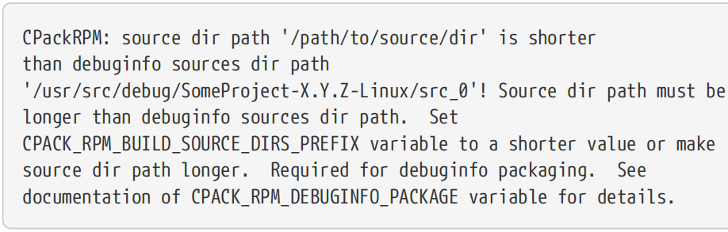
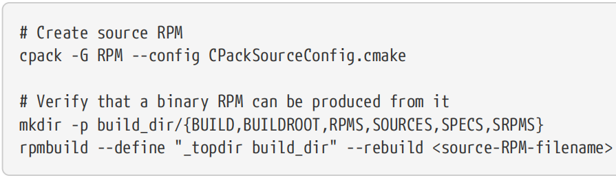

# Ch26. Packaging

The creation of release packages is an area where developers frequently feel out of their depth. The various packaging systems, platform differences and conventions can present a very steep learning curve for anyone wanting to master the art of creating robust, well presented packages across multiple platforms. Each package management system invariably uses its own unique form of input specification for what each package contains, how it should be installed, how package components relate to each other, how to integrate with the operating system and so on. Differences between platforms and even between different distributions of the same platform are not always obvious and are frequently only learnt after experiencing problems from an unforeseen behavior or constraint (Windows path length restrictions and differing conventions on Linux for system library directory names are great examples of this). 【译】发布包的创建是开发人员经常感到力不从心的领域。对于任何想要掌握在多个平台上创建健壮、呈现良好的包的艺术的人来说，各种包装系统、平台差异和惯例都可能带来非常陡峭的学习曲线。每个包管理系统都会使用自己独特的输入规范形式，包括每个包包含的内容、如何安装、包组件如何相互关联、如何与操作系统集成等。平台之间的差异，甚至同一平台的不同发行版之间的差异并不总是显而易见的，通常只有在遇到不可预见的行为或约束问题后才能了解（Windows路径长度限制和Linux上系统库目录名称的不同约定就是很好的例子）。

Despite all these differences, there is a substantial degree of commonality in terms of the packaging concepts used. While each system or platform might implement things differently, much of their packaging functionality can be described in a fairly generic way. CMake and CPack take advantage of this and present a well defined interface for specifying these common aspects, which are then translated into the necessary package system input files and commands to produce packages in various formats. This provides a much shorter learning curve for developers, resulting in a relatively quick path to producing packages across the platforms of interest.

【译】尽管存在所有这些差异，但在所使用的包装概念方面存在很大程度的共性。虽然每个系统或平台的实现方式可能不同，但它们的大部分打包功能都可以用一种相当通用的方式来描述。CMake和CPack利用了这一点，并提供了一个定义良好的接口来指定这些常见方面，然后将其转换为必要的包系统输入文件和命令，以生成各种格式的包。这为开发人员提供了更短的学习曲线，从而在感兴趣的平台上相对快速地生成包。

CMake and CPack not only abstract away the common aspects of packaging, they also simplify the use of many packager specific features as well. By providing a simpler interface to these features, CMake and CPack enable developers to exploit more advanced packaging features in a more familiar way. For the most part, this is done by setting a few relevant variables or calling functions with the appropriate arguments, all of which are defined in the documentation for each packager’s CMake module. 【译】CMake和CPack不仅抽象了打包的共同点，还简化了许多打包器特定功能的使用。通过为这些功能提供更简单的界面，CMake和CPack使开发人员能够以更熟悉的方式利用更高级的打包功能。在大多数情况下，这是通过设置一些相关变量或使用适当的参数调用函数来实现的，所有这些参数都在每个打包器的CMake模块的文档中定义。

CPack packaging is implemented internally as one or more installs to a staging area which is then used to produce the final package(s). These installs are controlled by calls to the install() command, which were covered in depth in the preceding chapter. This chapter now presents the second half of that process, describing the variables and commands that specify the package meta data and configuration of the packages themselves.

【译】CPack打包在内部实现为一个或多个安装到暂存区，然后用于生产最终包。这些安装是通过调用install（）命令来控制的，这在前一章中有详细介绍。本章现在介绍该过程的后半部分，描述指定包元数据和包本身配置的变量和命令。

## 26.1. Packaging Basics

Setting up and executing packaging is handled in a similar way to testing. The cpack command line tool reads an input file and produces the appropriate package(s) based on that file’s contents. If no input file is explicitly given on the command line, cpack will use CPackConfig.cmake in the current directory. This input file is most commonly produced by CMake through the inclusion of the CPack module, just like how including the CTest module generates the input file for ctest. Projects can customize the content of the generated packaging input file through CMake variables and commands. 【译】

The CPack module enables a few default package formats based on the target platform. The set of package formats to be created can be overridden on the cpack command line with the -G option. If multiple formats should be built, they can be provided as a semicolon-separated list like so: 【译】

\`\`\`sh

cpack -G "ZIP;RPM"

\`\`\`

If the CMake project was configured to use a multi configuration generator like Xcode or Visual Studio, cpack needs to know which configuration’s executables it should package up. This is done by giving a -C option to cpack (the -C option is ignored by single configuration CMake generators):

【译】

\`\`\`sh

cpack -C Release

\`\`\`

The cpack command supports a few other options, but -G and -C are two of the more commonly used. Most other details are typically provided through the input file. This is in part because instead of invoking cpack directly, developers can build the package build target which will first build the default all target and then invoke cpack with minimal options. It is therefore more convenient for the project to ensure the cpack input file defines all required settings. CMake will automatically create the package target if the top of the build tree contains a file called CPackConfig.cmake. 【译】

The easiest way to create the cpack input file is by including the CPack module, which can only be done once for the entire CMake project. This inclusion is usually done at or near the end of the top level CMakeLists.txt file, either directly or through a subdirectory’s CMakeLists.txt. Making the inclusion conditional on whether the project has a parent also ensures the project only tries to define packaging if it is the top level project. For example: 【译】

\#------------------------------------\>\>\>\>\>\>

cmake_minimum_required(VERSION 3.0)

project(MyProj)

\# ...Define targets, add subdirectories, etc...

\# End of the CMakeLists.txt file

if(CMAKE_SOURCE_DIR STREQUAL CMAKE_CURRENT_SOURCE_DIR)

add_subdirectory(packaging) \# include(CPack) will happen in here

endif()

\#------------------------------------\<\<\<\<\<\<

At the point where the CPack module is included, the CPackConfig.cmake file is written to the top of the build tree (i.e. CMAKE_BINARY_DIR). Since CMake checks for this file only after it finishes processing CMakeLists.txt files, it will therefore always create the package build target if the CPack module is included. 【译】

While defaults are provided for most aspects of the packaging configuration, these defaults are not always appropriate. Most projects will want to set some basic details before including the CPack module to provide better alternatives. In particular, it is recommended that the following variables be explicitly set before calling include(CPack): 【译】

\#\>\>\>\>\>\>\>\>\>\>\>\>\>\>\>\>\>\>\>\>\>\>\>\>\>\>\>\>\>\>\>\>\>\>\>\>\>\>\>\>\>\>

\#(1)CPACK_PACKAGE_NAME

The package name is one of the more fundamental pieces of metadata. It is used as part of the default file name for packages, it may appear in various places within UI installers and it will most likely be the name that end users will use to refer to the project. Ideally, it would not contain spaces, since spaces are replaced by other characters in some contexts. If this variable is not explicitly set, CMAKE_PROJECT_NAME is used as a default. 【译】

\#(2)CPACK_PACKAGE_DESCRIPTION_SUMMARY

This variable provides a short sentence of no more than a few words about the project. It should be suitable for being shown in lists of packages where space is restricted and it should give end users an idea of what the package is about. It may also be shown to the user in other situations and is only used for informational purposes. From CMake 3.9, the default value is taken from CMAKE_PROJECT_DESCRIPTION, whereas for earlier CMake versions the default is an empty string. 【译】

\#(3)CPACK_PACKAGE_VENDOR

The vendor is usually only used for information rather than affecting package structure or behavior, but it is helpful for end users if it is set appropriately. The default value of Humanity is not generally suitable for anything other than acting as a placeholder until it is set properly. Prefer to use a real company or organization name rather than a domain name. 【译】

**\#(4)CPACK_PACKAGE_VERSION_MAJOR, CPACK_PACKAGE_VERSION_MINOR, CPACK_PACKAGE_VERSION_PATCH**

These are used to construct the overall package version and may appear as part of package file names, in package metadata and in installer UIs. The version information is a critical part of packaging that projects should always explicitly set. The default values of 0, 1 and 1 respectively are only helpful as placeholders and should never be relied upon for formal release packages. A convenient pattern is to use the version details provided to the project() command: 【译】

\#------------------------------------\>\>\>\>\>\>

set(CPACK_PACKAGE_VERSION_MAJOR \${PROJECT_VERSION_MAJOR})

set(CPACK_PACKAGE_VERSION_MINOR \${PROJECT_VERSION_MINOR})

set(CPACK_PACKAGE_VERSION_PATCH \${PROJECT_VERSION_PATCH})

\#------------------------------------\<\<\<\<\<\<

cpack will automatically populate CPACK_PACKAGE_VERSION based on these three variables, but this only occurs when cpack runs, so CPACK_PACKAGE_VERSION won’t yet be populated during CMake processing. From CMake 3.12, the default values for these variables are taken from the newly added CMAKE_PROJECT_VERSION_MAJOR, CMAKE_PROJECT_VERSION_MINOR and CMAKE_PROJECT_VERSION_PATCH variables instead. These variables are set by the VERSION details of the project() command in the top level CMakeLists.txt file, so they are much more likely to provide sensible defaults than the fairly arbitrary pre-3.12 values of 0, 1 and 1. That said, relying on these variables to provide defaults assumes that the project is always the top level project, which might not always be the case. Therefore, it is safer to always explicitly set them to what the project really wants. 【译】

**\#(5)CPACK_PACKAGE_INSTALL_DIRECTORY**

Some packagers will append this to the base install point to create a package specific directory. It’s default value can vary, but may include the package name and version. The presence of the version number in the default value is often undesirable, such as for installers that are able to upgrade a project in-place. To ensure better default behavior, projects may want to set this to the same as CPACK_PACKAGE_NAME. 【译】

**\#(6)CPACK_VERBATIM_VARIABLES**

This variable should always be explicitly set to true. It ensures all contents written to the cpack configuration file are properly escaped. The default value is false only to preserve backward compatibility with earlier CMake versions, but the old behavior can lead to an ill-formed configuration file and should not be used. 【译】

\#\<\<\<\<\<\<\<\<\<\<\<\<\<\<\<\<\<\<\<\<\<\<\<\<\<\<\<\<\<\<\<\<\<\<\<\<\<\<\<\<\<\<

More variables will often be set to improve the end user experience, especially for UI installers:

【译】

\#\>\>\>\>\>\>\>\>\>\>\>\>\>\>\>\>\>\>\>\>\>\>\>\>\>\>\>\>\>\>\>\>\>\>\>\>\>\>\>\>\>\>

**\#(1)CPACK_PACKAGE_DESCRIPTION_FILE**

This is the name of a text file containing a slightly longer description of the project. The contents of the file may be shown in introductory screens of an installer or added to package meta data. Always use an absolute path to the file. As an alternative, the description can be provided directly as the contents of a variable named CPACK_PACKAGE_DESCRIPTION. While this was not documented for CMake 3.11 or earlier, it has been supported even from early versions of CMake.

【译】

**\#(2)CPACK_RESOURCE_FILE_WELCOME**

Some installers show a welcome message in their opening screen. This variable specifies a file name whose contents should be shown for such cases. If it is not set, then for those installers that show a welcome message, CPack provides a default which acts as a placeholder, but it is a relatively poor substitute not suitable for official releases. Projects should always set this if distributing an installer that shows a welcome screen. Always use an absolute path to the file.

【译】

**\#(3)CPACK_RESOURCE_FILE_LICENSE**

Most UI installers present a license page to the user and may ask them to accept the license before continuing. The text shown for the license is taken from the file named by this variable. Some generic placeholder text is used if the variable is not set, but projects are strongly advised to provide their own more suitable license details. Always use an absolute path to the file.

【译】

**\#(4)CPACK_RESOURCE_FILE_README**

Some UI installers provide a separate page showing the contents of the file named by this variable. It serves as an opportunity to give the user some information before they proceed with the installation and by default has generic but typically unsuitable text. Projects should prefer to give a file with some more appropriate content via this variable if they intend to create installers which show such pages. Always use an absolute path to the file.

【译】

**\#(5)CPACK_PACKAGE_ICON**

This variable may also be commonly set, but be aware that most of the package generators have their own different requirements for the format and use of icons within the package and associated places. Some generators ignore this variable, others use it in different ways.

【译】

\#\<\<\<\<\<\<\<\<\<\<\<\<\<\<\<\<\<\<\<\<\<\<\<\<\<\<\<\<\<\<\<\<\<\<\<\<\<\<\<\<\<\<

An example that follows the above guidelines may look something like this: 【译】

\#------------------------------------\>\>\>\>\>\>

set(CPACK_PACKAGE_NAME MyProj)

set(CPACK_PACKAGE_VENDOR MyCompany)

set(CPACK_PACKAGE_DESCRIPTION_SUMMARY "CPack example project")

set(CPACK_PACKAGE_INSTALL_DIRECTORY \${CPACK_PACKAGE_NAME})

set(CPACK_PACKAGE_VERSION_MAJOR \${PROJECT_VERSION_MAJOR})

set(CPACK_PACKAGE_VERSION_MINOR \${PROJECT_VERSION_MINOR})

set(CPACK_PACKAGE_VERSION_PATCH \${PROJECT_VERSION_PATCH})

set(CPACK_VERBATIM_VARIABLES YES)

set(CPACK_PACKAGE_DESCRIPTION_FILE \${CMAKE_CURRENT_LIST_DIR}/Description.txt)

set(CPACK_RESOURCE_FILE_WELCOME \${CMAKE_CURRENT_LIST_DIR}/Welcome.txt)

set(CPACK_RESOURCE_FILE_LICENSE \${CMAKE_CURRENT_LIST_DIR}/License.txt)

set(CPACK_RESOURCE_FILE_README \${CMAKE_CURRENT_LIST_DIR}/Readme.txt)

include(CPack)

\#------------------------------------\<\<\<\<\<\<

To facilitate running cpack with no arguments and the use of the package build target, the CPACK_GENERATOR variable should be set to the desired package formats. If not set, a fairly conservative default set of generators will be used. Since not all formats are supported or appropriate on all platforms, setting this variable requires logic to specify only those formats that make sense. The following example selects one generic archive format and one native package format for the target platform (if identified):

【译】

\#------------------------------------\>\>\>\>\>\>

if(WIN32)

set(CPACK_GENERATOR ZIP WIX)

elseif(APPLE)

set(CPACK_GENERATOR TGZ productbuild)

elseif(CMAKE_SYSTEM_NAME STREQUAL "Linux")

set(CPACK_GENERATOR TGZ RPM)

else()

set(CPACK_GENERATOR TGZ)

endif()

\#------------------------------------\<\<\<\<\<\<

The CPack module also defines the necessary details that allow a source package to be produced. It creates a CPackSourceConfig.cmake file which can be used instead of CPackConfig.cmake and when the project is configured to use a Makefile or Ninja generator, a package_source build target is defined as well. Producing the source package is relatively straightforward, with either of the following two commands achieving the same thing. 【译】

\`\`\`sh

\# All build generators

cpack -G TGZ --config CPackSourceConfig.cmake

\# Makefile and Ninja build generators only

cmake --build . --target package_source

\`\`\`

The source package contains the entire source directory tree. The CPACK_SOURCE_IGNORE_FILES variable can be used to filter out parts of the source tree, holding a list of regular expressions that each full file path will be compared against. All matching files will be omitted from the source package. The default value of this variable ignores repository directories like .git, .svn, etc. as well as some common temporary files. If a project overrides CPACK_SOURCE_IGNORE_FILES, it will need to ensure it also specifies any such relevant patterns. To avoid problems with escaping and quoting in the regular expressions, it is strongly recommended to set CPACK_VERBATIM_VARIABLES to true. 【译】

\#------------------------------------\>\>\>\>\>\>

set(CPACK_VERBATIM_VARIABLES YES)

set(CPACK_SOURCE_IGNORE_FILES

/\\.git/

\\.swp

\\.orig

/CMakeLists\\.txt\\.user

/privateDir/

)

\#------------------------------------\<\<\<\<\<\<

## 26.2. Components

If a project defines no components in any of its install() commands, then all package generators will produce a single monolithic package that contains all installed contents. When a project does define components, it provides more flexibility for how it can be packaged. Relationships can also be specified between components, allowing hierarchical component structures to be defined and dependencies between them to be enforced at install time. Each package generator makes use of these component details in different ways, with some creating separate packages for different components, while others present user selectable components in a single UI installer. Some installers even support downloading individual components on demand at install time. 【译】

The previous chapter demonstrated how to define components as part of install() commands. Those commands only assign content to components, they do not define any other component details. The relationships between components are specified using commands from the CPackComponents module, which is automatically included as part of including the CPack module. These commands also provide additional metadata for components which some installers use to present information to the user during installation. 【译】

The most important command from the CPackComponents module is cpack_add_component(), which describes a single component: 【译】

\`\`\`cmake

cpack_add_component(componentName

\[DISPLAY_NAME name\]

\[DESCRIPTION description\]

\[DEPENDS comp1 \[comp2...\] \]

\[GROUP group\]

\[REQUIRED \| DISABLED\]

\[HIDDEN\]

\[INSTALL_TYPES type1 \[type2...\] \]

\[DOWNLOADED\]

\[ARCHIVE_FILE archiveFileName\]

\[PLIST plistFileName\]

)

\`\`\`

While all keywords are optional, the DISPLAY_NAME and DESCRIPTION should at least be provided so that meaningful details are presented to the user during installation and so that non-UI installers have enough metadata for users to understand what a package is for. If the component should only be installed if one or more other components are installed, those components should be listed with the DEPENDS option. Note that not all package types fully enforce these dependencies. A component can be placed under a particular group with the GROUP option, which can be further described using the cpack_add_component_group() command (discussed further below). 【译】

If a component should always be installed, the REQUIRED keyword should be given. The user will then not be able to disable that component through an installer’s UI. Without this keyword, the component can be enabled or disabled by the user, with the default initial state being enabled. To change this default to disabled, add the DISABLED keyword. Whether a component is required or not, it can also be hidden from installer UIs by adding the HIDDEN keyword. A non-required but hidden component would generally also be disabled and the installer would then only install that component if another enabled component depended on it. 【译】

The remaining options have more specialized effects that apply to only a small number of package generators. An install type is a preset selection of components which can be used to simplify the choices a user has to make at install time. A component can be assigned to any number of install types with the INSTALL_TYPES option, where each type is a name that is defined separately by the cpack_add_install_type() command like so: 【译】

\`\`\`cmake

cpack_add_install_type(typeName \[DISPLAY_NAME uiName\])

\`\`\`

The DISPLAY_NAME option can be omitted if typeName is already sufficiently descriptive, but for install types that should be shown using multiple words, DISPLAY_NAME must be used and uiName will be a quoted string. There are no predefined install types, but it is common to see packages provide install types with names like Full, Minimal or Default. Of the actively maintained package generators provided by CMake, only NSIS supports the install types feature.

【译】

For those generators that support downloadable components, adding the DOWNLOADED keyword to cpack_add_component() makes the component downloaded on demand rather than being included in the package directly. The ARCHIVE_FILE option can be used to customize the file name of the downloadable component. The only actively maintained generator provided by CMake that supports downloadable components is IFW, so discussion of this feature is deferred to Section 26.4.2, “Qt Installer Framework (IFW)”. Similarly, the PLIST option (only available with CMake 3.9 or later) is used exclusively by the productbuild package generator (see Section 26.4.6, “productbuild”).

【译】

If no components are defined with GROUP details, the components will act as a simple flat list in most UI installers. When grouping is used, it enables an arbitrarily deep hierarchical structure to be defined instead, where groups can contain components and other groups. A group is defined using the following command from the CPackComponents module: 【译】

\`\`\`cmake

cpack_add_component_group(groupName

\[DISPLAY_NAME name\]

\[DESCRIPTION description\]

\[PARENT_GROUP parent\]

\[EXPANDED\]

\[BOLD_TITLE\]

)

\`\`\`

This command can appear before or after cpack_add_component() calls that refer to the groupName. The DISPLAY_NAME and DESCRIPTION options serve the same purpose as their counterparts in the cpack_add_component() command. The PARENT_GROUP is the group’s equivalent of the GROUP option, allowing it to be placed under another group to support arbitrary group hierarchies. When the EXPANDED keyword is given, the group will initially be expanded in the installer UI and the presence of the BOLD_TITLE keyword will make that group show up as bold. 【译】

Component names should ideally be project specific to allow hierarchical project arrangements to effectively select which components to package and how to present them in installers (or in the case of non-UI installers, how to structure the component-specific packages). Group names are less restrictive, since they may contain components and groups from across different projects. A group name cannot be the same as any component name. 【译】

The effect of both cpack_add_component() and cpack_add_component_group() is to define a range of component-specific variables in the current scope. The CPackComponent documentation lists some of these variables and suggests that the variables can be set directly, but this is not recommended. The commands offer a more robust and more readable way of defining component and group details and should be preferred. They should also be called in the same scope as the include(CPack) call, ideally immediately after it. Technically the constraint is not quite as strict as this, but defining the component details in a different scope can be more fragile. 【译】

An example should help consolidate some of the above concepts and discussions. 【译】

\#------------------------------------\>\>\>\>\>\>

set(CPACK_PACKAGE_NAME ...)

\# ... set other variables as per earlier example

include(CPack)

cpack_add_component(MyProj_Runtime

DISPLAY_NAME Runtime

DESCRIPTION "Shared libraries and executables"

REQUIRED

INSTALL_TYPES Full Developer Minimal

)

cpack_add_component(MyProj_Development

DISPLAY_NAME "Developer pre-requisites"

DESCRIPTION "Static libraries and headers needed for building apps"

DEPENDS MyProj_Runtime

GROUP MyProj_SDK

INSTALL_TYPES Full Developer

)

cpack_add_component(MyProj_Samples

DISPLAY_NAME "Code samples"

GROUP MyProj_DevHelp

INSTALL_TYPES Full Developer

DISABLED

)

cpack_add_component(MyProj_ApiDocs

DISPLAY_NAME "API documentation"

GROUP MyProj_DevHelp

INSTALL_TYPES Full Developer

DISABLED

)

cpack_add_component_group(MyProj_SDK

DISPLAY_NAME SDK

DESCRIPTION "Developer tools, libraries, etc."

)

cpack_add_component_group(MyProj_DevHelp

DISPLAY_NAME Documentation

DESCRIPTION "Code samples and API docs"

PARENT_GROUP MyProj_SDK

)

cpack_add_install_type(Full)

cpack_add_install_type(Minimal)

cpack_add_install_type(Developer DISPLAY_NAME "SDK Development")

\#------------------------------------\<\<\<\<\<\<

Project generators can be asked to process components in one of three ways, the choice being controlled by the CPACK_COMPONENTS_GROUPING variable which can be set to one of the following values: 【译】

\#\>\>\>\>\>\>\>\>\>\>\>\>\>\>\>\>\>\>\>\>\>\>\>\>\>\>\>\>\>\>\>\>\>\>\>\>\>\>\>\>\>\>

**\#(1)ALL_COMPONENTS_IN_ONE**

A single package with all requested components will be created. Component and group structure is ignored. 【译】

**\#(2)ONE_PER_GROUP**

Each top level component group should create a package. Those components that are not part of a group will also create their own package. This is the default if CPACK_COMPONENTS_GROUPING is not set and is usually the desirable arrangement, but for some UI installers it hides components that projects may prefer be shown. 【译】

**\#(3)IGNORE**

Each component creates its own package irrespective of any component groups. This setting can be more suitable for some UI installers to ensure that no components are hidden unless explicitly configured to be so. 【译】

\#\<\<\<\<\<\<\<\<\<\<\<\<\<\<\<\<\<\<\<\<\<\<\<\<\<\<\<\<\<\<\<\<\<\<\<\<\<\<\<\<\<\<

Two more variables also affect how generators interpret components. If CPACK_MONOLITHIC_INSTALL is set to true, components are disabled completely and all components are installed and bundled into a single package. This is a fairly brutal switch, so test the results carefully on all relevant platforms, paying special attention to look out for any unexpected files. For legacy reasons, each generator also has its own setting for whether or not components are supported by default. This setting can be overridden on a per-generator basis by the CPACK\_\<GENNAME\>\_COMPONENT_INSTALL variable, which can be set to true or false as needed. 【译】

When performing a component-based install, projects are not required to include all components in the final package(s). The set of components that will be included are controlled by the CPACK_COMPONENTS_ALL variable, which must be set before the call to include(CPack). When not set, cpack packages all components, but the project can explicitly set this variable to only list the components it wants packaged. For example, if a project wanted to control whether documentation and code samples should be packaged, it could be achieved like so: 【译】

\#------------------------------------\>\>\>\>\>\>

if(NOT MYPROJ_PACKAGE_HELP)

set(CPACK_COMPONENTS_ALL

> MyProj_Runtime
>
> MyProj_Development

)

endif()

include(CPack)

\#------------------------------------\<\<\<\<\<\<

Rather than explicitly listing all the components to be packaged, a project may want to install all but a few specific components. The full set of components is available in the read-only pseudo property COMPONENTS, which can only be retrieved via the get_cmake_property() command. The project can start with that list of components and then remove the unwanted entries.

【译】

\#------------------------------------\>\>\>\>\>\>

if(NOT MYPROJ_PACKAGE_HELP)

get_cmake_property(CPACK_COMPONENTS_ALL COMPONENTS)

list(REMOVE_ITEM CPACK_COMPONENTS_ALL

> MyProj_Samples
>
> MyProj_ApiDocs

)

endif()

include(CPack)

\#------------------------------------\<\<\<\<\<\<

The selection of which set of components to install and how the components should be handled may seem a little complex at first. In practice, the main area that causes difficulty is understanding how each package generator handles the different values of CPACK_COMPONENTS_GROUPING. The later sections in this chapter explain the behavior of each generator type, but some quick experiments on a test project can often be just as instructional for coming to terms with the effects of the different settings. 【译】

## 26.3. Multi Configuration Packages

CPack is inherently geared towards producing packages for a single build configuration. In most cases, packages are created for the Release build type, but for things like SDK projects, it may be desirable to include both debug and release versions of libraries. It takes a little more work to be able to build and package up both configurations into a single set of packages. 【译】

CPack provides the advanced variable CPACK_INSTALL_CMAKE_PROJECTS which can be used to incorporate multiple build trees into the one packaging run. It is expected to hold one or more quadruples where each quadruple consists of: 【译】

• The build directory. 【译】

• The project name (only important for multi configuration generators). 【译】

• The component to install. The special value ALL means to install the components listed in the CMAKE_COMPONENTS_ALL variable. Other values require a similar CMAKE_COMPONENTS_XXX variable to be defined which holds just that one component name. For example, if the component to install was called Runtime, then a variable CMAKE_COMPONENTS_RUNTIME would need to be defined and have the value Runtime. 【译】

• The relative location within the package to install to. The only safe value for this is a single forward slash (/) due to the way different package generators use it.【译】

The project can define sets of quadruples, one for the release build and the rest for the debug build. The build directory for the release build can simply be CMAKE_BINARY_DIR, but for the debug build, a second separate build directory needs to have been created and built. 【译】

The debug quadruples would only need to add those components that are different between the two build configurations, but whether using the default ALL component or using specific components, special care needs to be exercised to ensure installed files don’t unexpectedly overwrite each other. Listing the release component last will ensure that any files that have the same name and install location will end up with the release version when packaged. 【译】

\#------------------------------------\>\>\>\>\>\>

set(CPACK_COMPONENTS_MYPROJ_RUNTIME MyProj_Runtime)

set(CPACK_COMPONENTS_MYPROJ_DEVELOPMENT MyProj_Development)

unset(CPACK_INSTALL_CMAKE_PROJECTS)

if(MYPROJ_DEBUG_BUILD_DIR)

list(APPEND CPACK_INSTALL_CMAKE_PROJECTS

\${MYPROJ_DEBUG_BUILD_DIR} \${CMAKE_PROJECT_NAME} MyProj_Runtime /

\${MYPROJ_DEBUG_BUILD_DIR} \${CMAKE_PROJECT_NAME} MyProj_Development /

)

endif()

list(APPEND CPACK_INSTALL_CMAKE_PROJECTS

\${CMAKE_BINARY_DIR} \${CMAKE_PROJECT_NAME} ALL /

)

include(CPack)

\#------------------------------------\<\<\<\<\<\<

When using multi configuration generators like Xcode or Visual Studio, the MYPROJ_DEBUG_BUILD_DIR directory in the above example needs to be configured to only support the Debug build type rather than the usual default set. This is the only way to force it to install debug build outputs instead of the same configuration as the main project. When running cmake in that debug build directory, explicitly set the CMAKE_CONFIGURATION_TYPES cache variable to Debug to get the necessary arrangement. 【译】

While it is possible to use just the one build directory for multi configuration generators, the techniques to do so are more fragile and complex. In contrast, the above technique works for all build and package generator types. Furthermore, it can be extended to incorporate builds for different architectures or even completely separate projects into one unified package or set of packages. 【译】

## 26.4. Package Generators

CPack supports the creation of packages in a variety of formats, all of which loosely fall into one of the following categories: 【译】

\#\>\>\>\>\>\>\>\>\>\>\>\>\>\>\>\>\>\>\>\>\>\>\>\>\>\>\>\>\>\>\>\>\>\>\>\>\>\>\>\>\>\>

**\#(1)Simple archives**

Archives can be in a variety of formats, such as zip, tarball, bz2 and so on. They are the most basic of all the package formats, since they are just an archive of files that the user is expected to unpack somewhere on their file system. They are the most widely supported of all the package formats and are the easiest to work with when the end user wants to have multiple different versions of a project available or installed simultaneously. 【译】

**\#(2)UI installers**

These tend to have deep integration with the target platform they support, providing features like adding and removing components once installed, integration with desktop menus and so on. They typically present the user with some means of selecting which components to install and are usually very intuitive, so novice users tend to prefer them. CMake supports NSIS and WIX installers on Windows, DragNDrop (i.e. DMG) and productbuild on Mac and the Qt Installer Framework (IFW) on Windows, Mac and Linux. On Mac, some older installer types are still supported, but they should be considered effectively deprecated and are only mentioned briefly in the sections that follow. 【译】

**\#(3)Non-UI packages**

These are aimed at a specific package manager. RPM and DEB are very popular on Linux, with FreeBSD and Cygwin packages also being supported for their respective platforms. 【译】

**\#(4)Product-specific packages**

CMake 3.12 added initial support for the NuGet package format for .NET. 【译】

\#\<\<\<\<\<\<\<\<\<\<\<\<\<\<\<\<\<\<\<\<\<\<\<\<\<\<\<\<\<\<\<\<\<\<\<\<\<\<\<\<\<\<

Regardless of which type of package is to be generated, the same CPackConfig.cmake file is used in each case. This generally doesn’t present an issue, since generator-specific configuration is normally made possible through generator-specific variables where needed. If certain logic needs to be added only for a particular generator and the existing variables offered by CMake and CPack are insufficient, the CPACK_PROJECT_CONFIG_FILE variable can be set to the name of a file that will be included once for each package generator being invoked. Each time it is read, the CPACK_GENERATOR variable will hold the name of the generator being processed rather than the whole list of generators. This allows that file to override settings made in CPackConfig.cmake for only those generators that need it. The full cpack run loosely follows the steps in the following pseudo code: 【译】

\#------------------------------------\>\>\>\>\>\>

include(CPackConfig.cmake)

function(generate CPACK_GENERATOR)

\# CPACK_GENERATOR is a single generator local to this function scope

if(CPACK_PROJECT_CONFIG_FILE)

> include(\${CPACK_PROJECT_CONFIG_FILE})

endif()

\# ...invoke package generator

endfunction()

\# Here CPACK_GENERATOR is the list of generators to be processed,

\# as set by CPackConfig.cmake or on the cpack command line

foreach(generator IN LISTS CPACK_GENERATOR)

generate(\${generator})

endforeach()

\#------------------------------------\<\<\<\<\<\<

An example where the above can be useful is to set CPACK_PACKAGE_ICON to a generator specific value, since different generators expect this icon to be in different formats and therefore the file name needs to be generator specific. 【译】

The remainder of this chapter discusses each of the actively maintained package generators provided by CMake/CPack. 【译】

### 26.4.1. Simple Archives

CPack supports the creation of archives in a number of different formats. The most widely supported are ZIP and TGZ, the former being common for Windows platforms and the latter producing gzipped tarballs (.tar.gz or .tgz) that are supported essentially everywhere else. Other available archive formats include TBZ2 (.tar.bz2), TXZ (.tar.xz), TZ (.tar.Z) and 7Z (7zip archives, .7z). For maximum portability, ZIP and TGZ should generally be preferred, but some of the other formats may produce smaller archives and may be suitable for platforms where those formats are commonly supported. 【译】

A self-extracting archive format is also supported by cpack. This can be requested using the generator name STGZ, which produces a Unix shell script with the archive embedded at the end of that script. This can be thought of as a form of console-based UI installer, but in practice it offers only very basic functionality and users may prefer a simple archive that they can unpack themselves. 【译】

For legacy reasons, archive generators have components disabled by default. To enable componentbased archives, CPACK_ARCHIVE_COMPONENT_INSTALL must be set to true and then CPACK_COMPONENTS_GROUPING will determine the set of archive files that will be generated. 【译】

When performing a non-component install, the final package file name can be controlled using the CPACK_ARCHIVE_FILE_NAME variable. For component-based installs, the name of each component’s package is controlled by CPACK_ARCHIVE\_\<COMP\>\_FILE_NAME, where \<COMP\> is the uppercased component or group name. The appropriate archive extension will be appended to the specified file name (i.e. .tar.gz, .zip, etc.). 【译】

A common convention for archive files is to make the top level of the extracted directory structure be the same as the name of the archive file without the file extension (i.e. the same as CPACK_PACKAGE_FILE_NAME). For non-component installs, this is already the default behavior for the archive generators, but for multi component packages, no top level directory is used by default. Projects can enforce a common top level directory for component archives by setting CPACK_COMPONENT_INCLUDE_TOPLEVEL_DIRECTORY to true. Since this variable is shared by all package generators, a generator specific override would be the most appropriate way to do this:

【译】

\#------#CMakeLists.txt

\#------------------------------------\>\>\>\>\>\>

set(CPACK_PROJECT_CONFIG_FILE

\${CMAKE_CURRENT_LIST_DIR}/cpackGeneratorOverrides.cmake

)

\#------------------------------------\<\<\<\<\<\<

\#------#*cpackGeneratorOverrides.cmake*

\#------------------------------------\>\>\>\>\>\>

if(CPACK_GENERATOR MATCHES "^(7Z\|TBZ2\|TGZ\|TXZ\|TZ\|ZIP)\$")

set(CPACK_COMPONENT_INCLUDE_TOPLEVEL_DIRECTORY YES)

endif()

\#------------------------------------\<\<\<\<\<\<

Developers should note that some archive formats, platforms and file systems have limitations on the length of file names and paths. For example, POSIX.2 requires file names to be 100 characters or less and paths to be 255 characters or less for the extended tar interchange format, while older tar formats may restrict the entire path to 100 characters or less. When unpacking an archive onto an eCryptFS file system, file names have an empirically derived limit of about 140 characters. Unpacking on Windows can have a 260 character path length limit, depending on certain settings and OS version. UTF-8 file names and paths further complicate the picture and may shorten the effective character limits even more. 【译】

With these constraints in mind, projects should avoid using long paths and file names in their installed package contents. These restrictions are most evident with archive package types, but since other non-archive formats also use archives internally and deploy to systems with these restrictions, shorter paths and file names should be preferred in general. 【译】

### 26.4.2. Qt Installer Framework (IFW)

The IFW package generator offers the broadest platform support of all UI-based package formats provided by CPack. Installers can be built for Windows, Mac and Linux from the same configuration details, making it a good choice when a project wants to have a consistent UI installer across all major desktop platforms. It also has easy to use localization of component and group display names and descriptions as well as extensive customizability. 【译】

The defaults for the UI appearance and installer icons are often sufficient, but some projects may want to customize a few aspects to improve the branding, especially around the use of icons. The CPACK_PACKAGE_ICON variable is ignored for this generator, which relies instead on three separate IFW-specific variables to control the icons for different contexts: 【译】

• CPACK_IFW_PACKAGE_ICON (.ico for Windows, .icns for Mac, ignored for Linux)

• CPACK_IFW_PACKAGE_WINDOW_ICON (always .png)

• CPACK_IFW_PACKAGE_LOGO (preferably .png)

Unfortunately, these variables are not handled consistently between platforms, so it can be difficult to set them correctly. For simplicity, it may be preferable to set all three to the same image, albeit potentially in different formats and/or sizes. Testing on each platform of interest is recommended to ensure the installer presents itself as expected. The following example shows how such a configuration may be specified: 【译】

\#------------------------------------\>\>\>\>\>\>

\# Define generic setup for all generator types...

\# IFW-specific configuration

if(WIN32)

set(CPACK_IFW_PACKAGE_ICON \${CMAKE_CURRENT_LIST_DIR}/Logo.ico)

elseif(APPLE)

set(CPACK_IFW_PACKAGE_ICON \${CMAKE_CURRENT_LIST_DIR}/Logo.icns)

endif()

set(CPACK_IFW_PACKAGE_WINDOW_ICON \${CMAKE_CURRENT_LIST_DIR}/Logo.png)

set(CPACK_IFW_PACKAGE_LOGO \${CMAKE_CURRENT_LIST_DIR}/Logo.png)

include(CPack)

include(CPackIFW)

\# Define components and component groups...

\#------------------------------------\<\<\<\<\<\<

Component-based installation is enabled by default for the IFW generator. A single installer is always produced, but CPACK_COMPONENTS_GROUPING controls how much of the component hierarchy is shown to the user: 【译】

\#\>\>\>\>\>\>\>\>\>\>\>\>\>\>\>\>\>\>\>\>\>\>\>\>\>\>\>\>\>\>\>\>\>\>\>\>\>\>\>\>\>\>

**\#(1)ALL_COMPONENTS_IN_ONE**

No component hierarchy is shown, the default enabled components will always be installed.

【译】

**\#(2)ONE_PER_GROUP**

Only the first level of groups is shown along with any components that do not belong to any groups. Subgroups and components under any group will be hidden. 【译】

**\#(3)IGNORE**

All components that are not explicitly hidden will be shown regardless of where they are in the group hierarchy. This is likely to be the option most projects will want to use. 【译】

\#\<\<\<\<\<\<\<\<\<\<\<\<\<\<\<\<\<\<\<\<\<\<\<\<\<\<\<\<\<\<\<\<\<\<\<\<\<\<\<\<\<\<

Components and groups can be configured in further detail beyond what the generic commands provide: 【译】

\#------------------------------------\>\>\>\>\>\>

cpack_ifw_configure_component(componentName

\[NAME componentNameId\]

\[DISPLAY_NAME displayName...\]

\[DESCRIPTION description...\]

\[VERSION \<version\>\]

\[DEPENDS compId1 \[compId2...\] \]

\[REPLACES compId3 \[compId4...\] \]

\# Other options not shown

)

\# The cpack_ifw_configure_component_group() command supports all

\# of the above options too

\#------------------------------------\<\<\<\<\<\<

The DISPLAY_NAME and DESCRIPTION of each component or component group can be given alternative contents for different languages and locales. These two options accept a list of pairs where the first value of a pair is the language or locale ID and the second value is the text for that language. The very first value in the list can be given without a preceding language or locale ID and it will be used as the default text if none of the languages or locale IDs match the user’s current setting at install time. 【译】

\#------------------------------------\>\>\>\>\>\>

cpack_ifw_configure_component(MyProj_Docs

DISPLAY_NAME Documentation

de Dokumentation

pl Dokumentacja

)

cpack_ifw_configure_component_group(MyProj_Colors

DISPLAY_NAME en Colors

en_AU Colours

DESCRIPTION en "Available color palettes"

en_AU "Available colour palettes"

)

\#------------------------------------\<\<\<\<\<\<

The VERSION option allows per-component and per-group version numbers to be specified. This is used by online installers to determine whether an update is available (see further below). If VERSION is not given, it defaults to CPACK_PACKAGE_VERSION. 【译】

The DEPENDS option is analogous to the same option in cpack_add_component() except that the form of the compId1… entries is different. These need to follow the QtIFW style, which is a hierarchical string rather than a raw componentName. Each level of the grouped hierarchy is dot-separated, as demonstrated by the following example: 【译】

\#------------------------------------\>\>\>\>\>\>

include(CPack)

include(CPackIFW)

cpack_add_component(foo GROUP groupA)

cpack_add_component(bar GROUP groupB)

cpack_add_component_group(groupA)

cpack_add_component_group(groupB)

cpack_ifw_configure_component(bar DEPENDS groupA.foo)

\#------------------------------------\<\<\<\<\<\<

The name used internally within the installer for a component can be overridden with the NAME option. This name would be used to identify the component in DEPENDS arguments and also when checking if a newer version of a component is available. A top level group name can be set with the CPACK_IFW_PACKAGE_GROUP variable and is often set to a reverse domain name to ensure component names don’t clash in large, multi vendor installers. This top level group name must then be included when listing dependencies with the DEPENDS option, as the following modification of the above example shows: 【译】

\#------------------------------------\>\>\>\>\>\>

set(CPACK_IFW_PACKAGE_GROUP com.examplecompany.product)

include(CPack)

include(CPackIFW)

cpack_add_component(foo GROUP groupA)

cpack_add_component(bar GROUP groupB)

cpack_add_component_group(groupA)

cpack_add_component_group(groupB)

cpack_ifw_configure_component(bar

DEPENDS com.examplecompany.product.groupA.foo

)

\#------------------------------------\<\<\<\<\<\<

CPACK_IFW_PACKAGE_GROUP is just one example of a large number of extra variables that can be set to provide IFW-specific configuration. Such variables should be set before include(CPackIFW) is called and can modify the appearance and behavior of the installer in a variety of ways. The CPackIFW module documentation provides a complete listing of all supported variables and their effects, many of which have analogous settings in the QtIFW product’s native configuration settings. Most of those variables have sensible defaults and should be seen more as opportunities for customization rather than things that need to be set. One exception to this is the variables relating to the name of the maintenance tool installed along with the rest of the product, which allows the user to modify the set of installed components or remove the product completely. By default, this tool is given the name maintenancetool, but this gives no indication of what the tool relates to. On some platforms, the tool name can show up in desktop or application menus and the default name can be confusing for users. Therefore, projects should provide a more specific name, which can be done like so: 【译】

\#------------------------------------\>\>\>\>\>\>

set(CPACK_IFW_PACKAGE_MAINTENANCE_TOOL_NAME \${PROJECT_NAME}\_MaintenanceTool)

set(CPACK_IFW_PACKAGE_MAINTENANCE_TOOL_INI_FILE

\${CPACK_IFW_PACKAGE_MAINTENANCE_TOOL_NAME}.ini)

include(CPackIFW)

\#------------------------------------\<\<\<\<\<\<

The .ini file is used by the installer to maintain state information between invocations. Setting the name of the .ini file is optional, but making the name consistent with the installer itself is preferable. With the above settings, the user will see a name that relates to the project if the maintenance tool shows up in their desktop or applications menu. 【译】

A significant feature of the IFW generator is its ability to create online installers. Some or all components can be downloaded on demand instead of bundling them as part of the installer itself. This is particularly advantageous if some optional components are quite large. An added benefit of an online installer is that individual components can be upgraded if newer versions are made available from the online repositories, which provides a very convenient upgrade path. Users run the maintenance tool which contacts the set of online repositories to determine the available components and their versions. Individual components can then be added, removed or upgraded as desired. 【译】

The first step in configuring a project to support downloadable components is to specify where the installer will download them from. A primary default repository is specified with the generic cpack_configure_downloads() command: 【译】

\`\`\`cmake

cpack_configure_downloads(baseUrl

\[ALL\]

\[ADD_REMOVE \| NO_ADD_REMOVE\]

\[UPLOAD_DIRECTORY dir\]

)

\`\`\`

The baseUrl is the location where the installer will look for downloadable components. The installer will expect to find a file called Updates.xml under that location. If the ALL keyword is present, all components are treated as downloadable regardless of whether they were explicitly marked as to be downloadable or not. This is a convenient way of making a fully online installer with no embedded packages, which yields the smallest possible installer. 【译】

The ADD_REMOVE keyword directs the installer to make the package available to Windows' Add/Remove Programs functionality, which will then run the maintenance tool when the user elects to modify the package through that part of the Windows system settings. The ALL keyword implies ADD_REMOVE, but giving NO_ADD_REMOVE overrides that behavior. 【译】

The UPLOAD_DIRECTORY option is used by other CPack generator types that support downloadable components (although none of those are actively maintained), but it is ignored by the IFW generator. When cpack runs, it creates downloadable packages in a separate directory so that the contents of that whole directory can be uploaded to the baseUrl location (which must be done manually). The UPLOAD_DIRECTORY option is intended to allow the project to override where this separate directory is located, but the IFW generator always creates a directory called repository located multiple levels deep under the base \_CPack_Packages directory. 【译】

The IFW generator allows projects to specify additional repositories for the maintenance tool and installer to access. This can be useful if different components are provided by different vendors or where some components have a different release schedule to others. 【译】

\`\`\`cmake

cpack_ifw_add_repository(repoName

URL baseUrl

\[DISPLAY_NAME displayName\]

\[DISABLED\]

\[USERNAME username\]

\[PASSWORD password\]

)

\`\`\`

The repoName is an internal tracking name and the baseUrl has a similar meaning as for cpack_configure_downloads(). The DISPLAY_NAME option should generally be used to give a meaningful name, otherwise the baseUrl is shown as the repository name, which tends to be less user friendly. If the repository needs a user name and password, it can be supplied, but keep in mind that the password will be stored unencrypted and should be considered insecure. The DISABLED keyword indicates that the repository should be disabled by default, but the user can enable it in the installer or maintenance tool’s UI. 【译】

An example of a main repository for release packages and a secondary repository for preview packages (disabled by default) could be configured like this: 【译】

\#------------------------------------\>\>\>\>\>\>

include(CPack)

include(CPackIFW)

cpack_configure_downloads(https://example.com/packages/product/release ALL)

cpack_ifw_add_repository(secondaryRepo

DISPLAY_NAME "Preview features"

URL https://example.com/packages/product/preview

DISABLED

)

\#------------------------------------\<\<\<\<\<\<

Unfortunately, the cpack_configure_downloads() command does not currently support specifying a display name, so the main URL it supplies will always be shown as a bare URL rather than a more user friendly name. 【译】

One drawback of this package generator is that the installer produced doesn’t provide an easy way for users to trigger an unattended command line install. This is a limitation of the Qt Installer Framework itself, not of CMake or CPack. The installer also has extra overhead compared to most other generator types because it includes the Qt support needed for the installer’s interface, networking and so on. This can make the size of even a trivial installer 18Mb or more, compared to a few hundred kB for other generator types. 【译】

The above discussion only covers the main aspects of the IFW generator, there are considerably more capabilities available which allow projects to customize the installer and maintenance tool extensively. For many projects, the above functionality already allows flexible, robust and crossplatform installers to be created. If further tailoring is needed, the features presented will serve as a solid base on which to extend. 【译】

### 26.4.3. WIX

The WIX package generator produces .msi installers for Windows using the WiX toolset. Compared to the IFW package generator, it has a similar degree of UI customizability and offers the following advantages: 【译】WIX包生成器使用WIX工具集为Windows生成.msi安装程序。与IFW包生成器相比，它具有类似程度的UI可定制性，并具有以下优点：

\#\>\>\>\>\>\>\>\>\>\>\>\>\>\>\>\>\>\>\>\>\>\>\>\>\>\>\>\>\>\>\>\>\>\>\>\>\>\>\>\>\>\>

• Command line (i.e. unattended) installs are directly supported through an option to the msiexec tool. 【译】通过msiexec工具的选项直接支持命令行（即无人值守）安装。

• Installers are tightly integrated into Windows’ Add/Remove functionality. 【译】安装程序与Windows的添加/删除功能紧密集成。

• The default appearance should be familiar to most users. 【译】大多数用户应该熟悉默认外观。

\#\<\<\<\<\<\<\<\<\<\<\<\<\<\<\<\<\<\<\<\<\<\<\<\<\<\<\<\<\<\<\<\<\<\<\<\<\<\<\<\<\<\<

On the other hand, it has the following disadvantages compared to IFW: 【译】另一方面，与IFW相比，它有以下缺点：

\#\>\>\>\>\>\>\>\>\>\>\>\>\>\>\>\>\>\>\>\>\>\>\>\>\>\>\>\>\>\>\>\>\>\>\>\>\>\>\>\>\>\>

• No simple, direct way of providing localized component names and descriptions. 【译】没有简单、直接的方法来提供本地化的组件名称和描述。

• CPACK_WIX_COMPONENT_INSTALL and CPACK_COMPONENTS_GROUPING are both ignored (see below). 【译】CPACK_WIX_COMPONENT_INSTALL和CPACK_COMPONENTS_GROUPING都被忽略（见下文）。

• No support for downloadable components. 【译】不支持可下载组件。

• Multiple versions with the same upgrade GUID cannot be installed simultaneously (see below). Each install replaces the previous one, even if in a completely different directory.【译】具有相同升级GUID的多个版本不能同时安装（见下文）。每次安装都会替换上一次安装，即使是在完全不同的目录中。

\#\<\<\<\<\<\<\<\<\<\<\<\<\<\<\<\<\<\<\<\<\<\<\<\<\<\<\<\<\<\<\<\<\<\<\<\<\<\<\<\<\<\<

By default, the WIX generator produces a component-based package which will always be presented in the UI as though CPACK_COMPONENTS_GROUPING had been set to IGNORE. If a componentbased package is undesirable, CPACK_MONOLITHIC_INSTALL can be set to true, but then all defined components are always installed. It is not possible to only include some components in a monolithic installer and if CPACK_COMPONENTS_ALL is set, CMake will issue a warning and ignore CPACK_COMPONENTS_ALL. 【译】默认情况下，WIX生成器生成一个基于组件的包，该包将始终显示在UI中，就像CPACK_COMPONENTS_GROUPING已设置为IGNORE一样。如果不希望使用基于组件的包，则可以将CPACK_MONOLITHIC_INSTALL设置为true，但所有定义的组件都会始终安装。在单片安装程序中不可能只包含一些组件，如果设置了CPACK_components_ALL，CMake将发出警告并忽略CPACK_COMPANENTS_ALL。

A key part of a WIX installer is that it contains a product GUID and an upgrade GUID. If any other installed package has the same upgrade GUID, that other package will be upgraded rather than installing the new package as a separate product. If the upgrade GUIDs are the same but the product GUIDs are different, then the upgrade is considered a major upgrade and the new installer will completely replace the old package. Where the product GUID is also the same, the new installer should be able to perform a minor upgrade as long as the installer reports a newer version number than the currently installed package. Service packs are an example where the same product GUID is maintained as the base version they apply to. Unless creating a fairly advanced installer or packaging strategy, projects will typically need to change the product GUID with each release, as the constraints from Windows itself for keeping the same product GUID from one package to another are fairly stringent. 【译】WIX安装程序的一个关键部分是它包含产品GUID和升级GUID。如果任何其他已安装的软件包具有相同的升级GUID，则将升级该其他软件包，而不是将新软件包作为单独的产品安装。如果升级GUID相同，但产品GUID不同，则升级被视为重大升级，新安装程序将完全替换旧包。如果产品GUID也相同，只要安装程序报告的版本号比当前安装的软件包更新，新安装程序就应该能够执行小幅升级。Service Pack是一个示例，其中维护的产品GUID与它们应用的基本版本相同。除非创建相当高级的安装程序或打包策略，否则项目通常需要在每次发布时更改产品GUID，因为Windows本身对将相同的产品GUID从一个包保留到另一个包的约束相当严格。

CPack provides direct support for setting the product and upgrade GUIDs. The CPACK_WIX_PRODUCT_GUID and CPACK_WIX_UPGRADE_GUID variables can be set before calling include(CPack) to control them manually, or they can be left unset to allow cpack to generate new values each time it is invoked. For the product GUID, this automatic generation is likely to be the desired behavior, but the upgrade GUID should ideally never change for the life of the product. Projects should obtain a GUID and set CPACK_WIX_UPGRADE_GUID to that value, then ideally never change it again. This will ensure all future releases are able to upgrade older releases seamlessly. The actual GUID can be obtained by a variety of means such as command line tools, web-based UUID generators or even with CMake itself using the string(UUID) command. For some products, it may make sense for the upgrade GUID to change with each major release to allow an older major release to co-exist with a newer one, thereby facilitating the users’ migration path. 【译】CPack为设置产品和升级GUID提供直接支持。CPACK_WIX_PRODUCT_GUID和CPACK_WIX_UPGRADE_GUID变量可以在调用include（CPACK）之前设置，以手动控制它们，也可以不设置，以便每次调用CPACK时都能生成新值。对于产品GUID，这种自动生成可能是所需的行为，但理想情况下，升级GUID在产品的生命周期内永远不会改变。项目应获取一个GUID并将CPACK_WIX_UPGRADE_GUID设置为该值，然后最好不要再更改它。这将确保所有未来的版本都能无缝升级旧版本。实际的GUID可以通过多种方式获得，例如命令行工具、基于web的UUID生成器，甚至使用字符串（UUID）命令使用CMake本身。对于某些产品，升级GUID随每个主要版本而更改可能是有意义的，以允许较旧的主要版本与较新的版本共存，从而方便用户的迁移路径。

One of the criteria around when a product GUID must change is if the name of the .msi file changes.Since the installer’s file name would typically include some version details, this means each release would be considered a major upgrade. If the user installs the new version, it would completely replace any previously installed version. The new version can be installed to a different directory and the old one would be removed. It may be tempting to then use a default installation directory (controlled by CPACK_PACKAGE_INSTALL_DIRECTORY) that includes a version number, but users would likely prefer the default directory to stay the same across upgrades. The default directory should ideally only change if the upgrade GUID changes, since that is the identifier that provides the continuity from one version to another. 【译】产品GUID何时必须更改的一个标准是.msi文件的名称是否更改。由于安装程序的文件名通常会包含一些版本详细信息，这意味着每个版本都将被视为一次重大升级。如果用户安装了新版本，它将完全替换之前安装的任何版本。新版本可以安装到其他目录，旧版本将被删除。然后，可能会使用包含版本号的默认安装目录（由CPACK_PACKAGE_INSTALL_directory控制），但用户可能更希望默认目录在升级过程中保持不变。理想情况下，默认目录应仅在升级GUID更改时更改，因为这是提供从一个版本到另一个版本的连续性的标识符。

When installing a new package and another package with the same upgrade GUID is already installed, a check is made between the versions. Only if the new package is of a later version will the upgrade be allowed to proceed. Only the first three version number components are considered in this test, so versions 2.7.4.3 and 2.7.4.9 would be considered the same version from an upgrade perspective. Projects intending to use the WIX generator should therefore avoid using more than three version number components. If allowing CPACK_PACKAGE_VERSION to be automatically set from the individual CPACK_PACKAGE_VERSION_xxx version parts, this will already be enforced. 【译】安装新软件包时，如果已安装具有相同升级GUID的另一个软件包，则会在版本之间进行检查。只有当新软件包的版本更高时，才允许继续升级。本测试仅考虑前三个版本号组件，因此从升级的角度来看，版本2.7.4.3和2.7.4.9将被视为同一版本。因此，打算使用WIX生成器的项目应避免使用三个以上的版本号组件。如果允许从各个CPACK_PACKAGE_VERSION_xxxx版本部分自动设置CPACK_PACKE_VERSION，则这将被强制执行。

Most of the UI defaults are acceptable for a basic WIX package. Projects may want to provide a product icon to use in place of the generic MSI installer icon for improved branding in the Add/Remove area, but the defaults are otherwise generally acceptable. The following example shows basic configuration of a WIX installer. 【译】对于基本的WIX包，大多数UI默认值都是可以接受的。项目可能希望提供一个产品图标来代替通用的MSI安装程序图标，以改善“添加/删除”区域中的品牌，但默认值通常是可以接受的。以下示例显示了WIX安装程序的基本配置。

\#------------------------------------\>\>\>\>\>\>

\# Define generic setup for all generator types...

\# WIX-specific configuration

set(CPACK_WIX_PRODUCT_ICON \${CMAKE_CURRENT_LIST_DIR}/Logo.ico)

set(CPACK_WIX_UPGRADE_GUID XXXXXXXX-XXXX-XXXX-XXXX-XXXXXXXXXXXX)

include(CPack)

\# Define components and component groups...

\#------------------------------------\<\<\<\<\<\<

### 26.4.4. NSIS

The NSIS package generator produces installer executables for Windows using the “Nullsoft Scriptable Install System”. It shares a number of similar characteristics with the IFW and WIX generators, including a degree of UI customizability and support for component hierarchies.

Advantages of the NSIS generator include: 【译】NSIS包生成器使用“Nullsoft脚本化安装系统”为Windows生成安装程序可执行文件。它与IFW和WIX生成器有许多相似的特性，包括一定程度的UI可定制性和对组件层次结构的支持。 NSIS发生器的优点包括：

• The installer executable directly supports unattended installs through a dedicated command line option. 【译】安装程序可执行文件通过专用命令行选项直接支持无人值守安装。

• It is the only actively maintained CPack generator that supports install types. 【译】它是唯一一个支持安装类型的主动维护的CPack生成器。

• Pre/post-install and pre-uninstall commands are directly supported, although these must be implemented as NSIS commands.【译】直接支持安装前/安装后和卸载前命令，尽管这些命令必须作为NSIS命令实现。

The NSIS generator has a few drawbacks: 【译】NSIS生成器有几个缺点：

• CPACK_NSIS_COMPONENT_INSTALL and CPACK_COMPONENTS_GROUPING are both ignored. The NSIS generator has the same restrictions as the WIX generator in this regard. 【译】CPACK_NSIS_COMPONENT_INSTALL和CPACK_COMPONENTS_GROUPING都被忽略。在这方面，NSIS生成器与WIX生成器具有相同的限制。

• No support for downloadable components. 【译】不支持可下载组件。

• Once a product is installed, users cannot change the set of installed components without redoing the install. 【译】安装产品后，如果不重新安装，用户就无法更改已安装的组件集。

• Only basic UI customization is supported and there is no direct support for localization of any UI contents. These are limitations of CPack’s generator, not of NSIS itself, which does offer some facilities via its own native scripting language. 【译】仅支持基本的UI自定义，不直接支持任何UI内容的本地化。这些是CPack生成器的局限性，而不是NSIS本身的局限性。NSIS确实通过自己的原生脚本语言提供了一些功能。

• Although it is possible to install different versions to different locations, they share registry details and so are not fully isolated from each other. Only one version will show up in the Add/Remove area of the Windows settings. 【译】虽然可以将不同版本安装到不同的位置，但它们共享注册表详细信息，因此彼此之间并不完全隔离。Windows设置的“添加/删除”区域中只会显示一个版本。

By default, these installers will only perform an upgrade of an existing install if the new package is installed to the same directory as the old one. Projects can set the CPACK_NSIS_ENABLE_UNINSTALL_BEFORE_INSTALL variable to true to force the installer to check the registry for an existing installation of the package first. This check does not rely on the install location, so it is a more reliable way to check for an existing installation to be upgraded. As a result, setting this variable to true is recommended for most projects. 【译】默认情况下，如果新软件包安装到与旧软件包相同的目录中，这些安装程序将仅执行现有安装的升级。项目可以将CPACK_NSIS_ENABLE_UNNSTALL_BEFORE_INSTALL变量设置为true，以强制安装程序首先检查注册表中是否存在该软件包的现有安装。此检查不依赖于安装位置，因此它是检查要升级的现有安装的更可靠的方法。因此，对于大多数项目，建议将此变量设置为true。

NSIS installers benefit from overriding the default appearance in a number of areas. The icons used for the installer, uninstaller and the product itself as shown in the Add/Remove area should be set, as the defaults are either of low quality or produce blank boxes. The name displayed for the product should also be explicitly set to avoid inappropriate default text supplied by CPack. The following example shows a basic configuration with overrides to avoid the defaults that most projects would find unsuitable. 【译】NSIS安装程序在许多方面都受益于覆盖默认外观。应设置“添加/删除”区域中显示的用于安装程序、卸载程序和产品本身的图标，因为默认值要么质量低，要么产生空白框。还应明确设置产品显示的名称，以避免CPack提供不恰当的默认文本。以下示例显示了一个具有覆盖的基本配置，以避免大多数项目认为不合适的默认值。

\#------------------------------------\>\>\>\>\>\>

\# Define generic setup for all generator types...

\# NSIS-specific configuration

set(CPACK_NSIS_MUI_ICON \${CMAKE_CURRENT_LIST_DIR}/InstallerIcon.ico) ①

set(CPACK_NSIS_MUI_UNIICON \${CMAKE_CURRENT_LIST_DIR}/UninstallerIcon.ico) ②

set(CPACK_NSIS_INSTALLED_ICON_NAME bin/MainApp.exe) ③

set(CPACK_NSIS_DISPLAY_NAME "My Project Suite") ④

set(CPACK_NSIS_PACKAGE_NAME "My Project") ⑤

set(CPACK_NSIS_ENABLE_UNINSTALL_BEFORE_INSTALL YES)

include(CPack)

\# Define components and component groups...

\#------------------------------------\<\<\<\<\<\<

① The icon used for the installer itself. Windows may overlay further content to indicate that the installer requires administrator privileges. Use an absolute path to ensure NSIS can find the icon when creating the installer. 【译】用于安装程序本身的图标。Windows可能会覆盖其他内容，以指示安装程序需要管理员权限。使用绝对路径确保NSIS在创建安装程序时可以找到图标。

② The icon used for the uninstaller that will be copied to the installation directory. Again, use an absolute path to the icon. 【译】用于卸载程序的图标将被复制到安装目录。再次使用图标的绝对路径。

③ This controls the icon used for the product in the Add/Remove area. It must be a path to either an icon file (.ico) or an executable that has an embedded application icon of its own. The path should be to the installed location, relative to the base point of the install. 【译】这将控制“添加/删除”区域中用于产品的图标。它必须是指向图标文件（.ico）或具有自己的嵌入式应用程序图标的可执行文件的路径。路径应指向相对于安装基点的安装位置。

④ The name shown for the package in the Add/Remove area only. 【译】仅在“添加/删除”区域中显示的包名称。

⑤ The name used in many places in the installer’s UI and also in the title bar during installation. The word Setup may be appended to it in some contexts. 【译】安装程序UI中许多地方使用的名称，以及安装过程中标题栏中使用的名称。在某些上下文中，可能会附加“设置”一词。

### 26.4.5. DragNDrop

On Mac, products are commonly distributed as a .dmg file. These act like a disk image and can contain anything from a single application through to a whole suite of applications, documentation links and so on. A symlink to the /Applications area is frequently provided as part of the image so that users can easily drag applications onto it to install them, hence the name DragNDrop for this generator type. Configuration variables specific to this generator type use DMG in their name rather than DRAGNDROP, but note that cpack will only recognize DragNDrop as the name of the generator itself. 【译】在Mac上，产品通常以.dmg文件的形式分发。这些功能类似于磁盘映像，可以包含从单个应用程序到整套应用程序、文档链接等的任何内容。映像中经常提供指向/applications区域的符号链接，以便用户可以轻松地将应用程序拖动到其上进行安装，因此这种生成器类型被称为DragNDrop。特定于此生成器类型的配置变量在其名称中使用DMG，而不是DRAGNDROP，但请注意，cpack只会将DRAGNDROP识别为生成器本身的名称。

The .dmg format is closer to an archive than a UI installer. Components are used to control whether one or multiple .dmg files are created and what each .dmg file contains, but there is no install-time UI to choose components. The user is expected to open the .dmg file(s) and drag the contents to the desired location to install them. CPACK_COMPONENTS_ALL controls which components are installed and the CPACK_COMPONENTS_GROUPING variable controls how those components are distributed between .dmg file(s) as follows: 【译】.dmg格式比UI安装程序更接近于存档。组件用于控制是创建一个还是多个.dmg文件以及每个.dmg文件包含什么，但没有安装时UI来选择组件。用户需要打开.dmg文件并将内容拖动到所需位置进行安装。CPACK_COMPONENTS_ALL控制安装哪些组件，CPACK_COMPANENTS_GROUPING变量控制这些组件在.dmg文件之间的分布方式，如下所示：

\#------------------------------------\>\>\>\>\>\>

**\#(1)ALL_COMPONENTS_IN_ONE**

All components will be included in a single .dmg file. 【译】所有组件都将包含在一个.dmg文件中。

**\#(2)ONE_PER_GROUP**

Each top level component group and each component not in a group will be put in its own separate .dmg file. 【译】每个顶级组件组和不在组中的每个组件都将放在自己的单独.dmg文件中。

**\#(3)IGNORE**

Each component will be put in its own separate .dmg file and all component groups will be ignored. 【译】每个组件都将放在自己的单独.dmg文件中，所有组件组都将被忽略。

\#------------------------------------\<\<\<\<\<\<

This generator type requires little customization beyond the defaults. The size and layout of the Finder window displayed when the disk image is opened can be controlled by providing a custom .DS_Store file. The project will need to either prepare such a file manually using an example folder containing the same things as the final disk image, or it can be created programmatically in AppleScript. The CPACK_DMG_DS_STORE variable can be used to name a pre-prepared .DS_Store file or CPACK_DMG_DS_STORE_SETUP_SCRIPT can point to an AppleScript file to be run at package generation time. For either case, a background image can be set with the CPACK_DMG_BACKGROUND_IMAGE variable if desired, but leaving the background at the blank default is relatively common. For cases where the disk image should not provide a symlink to the /Applications folder, the project should set CPACK_DMG_DISABLE_APPLICATIONS_SYMLINK to true. 【译】这种生成器类型除了默认值外几乎不需要自定义。打开磁盘映像时显示的Finder窗口的大小和布局可以通过提供自定义来控制。DS_存储文件。该项目需要使用包含与最终磁盘映像相同内容的示例文件夹手动准备这样的文件，或者可以在AppleScript中以编程方式创建。CPACK_DMG_DS_STORE变量可用于命名预先准备好的。DS_Store文件或CPACK_DMG_DS_Store_SETUP_SCRIPT可以指向在包生成时运行的AppleScript文件。对于任何一种情况，如果需要，都可以使用CPACK_DMG_background_image变量设置背景图像，但将背景保留为空白默认值相对常见。对于磁盘映像不应提供到/Applications文件夹的符号链接的情况，项目应将CPACK_DMG_DISABLE_Applications_symlink设置为true。

An icon can be specified for the disk image by setting CPACK_PACKAGE_ICON to an icon in .icns format. This icon is only used to represent the .dmg file when mounted, not for the .dmg file itself. The specified icon may show up in the Finder title bar or certain Finder views, but it is otherwise not a prominently displayed icon. 【译】通过将CPACK_PACKAGE_icon设置为.icns格式的图标，可以为磁盘映像指定图标。此图标仅用于表示装载时的.dmg文件，不用于.dmg文件本身。指定的图标可能会显示在Finder标题栏或某些Finder视图中，但它不是突出显示的图标。

Limited language localization is provided through the CPACK_DMG_SLA_DIR and CPACK_DMG_SLA_LANGUAGES variables. These can be used to provide specific phrases used during the license agreement phase of opening the disk image and to provide a localized version of the license agreement itself. See the CPackDMG module’s documentation for how these two variables are used and the requirements around the language files that need to be provided.

【译】通过CPACK_DMG_SLA_DIR和CPACK_DMG_SLA_LANGUAGES变量提供有限的语言本地化。这些可用于提供在打开磁盘映像的许可协议阶段使用的特定短语，并提供许可协议本身的本地化版本。有关如何使用这两个变量以及需要提供的语言文件的要求，请参阅CPackDMG模块的文档。

The Bundle generator type is related to the DragNDrop generator. It uses the same set of DMG variables, plus some of its own. The Bundle generator was originally intended for producing a single app bundle potentially for submission to the Apple App Store. These days, such app bundles are better prepared during the build itself using CMake’s Xcode generator, as this more closely follows the process expected by Apple. See “Chapter 22, Apple Features” for the recommended way of preparing such app bundles rather than using the CPack Bundle generator type. 【译】Bundle生成器类型与DragNDrop生成器有关。它使用相同的DMG变量集，加上一些自己的变量。Bundle生成器最初旨在生成一个可能提交给苹果应用商店的单一应用包。如今，使用CMake的Xcode生成器在构建过程中可以更好地准备此类应用程序包，因为这更符合苹果公司的预期过程。有关准备此类应用程序包的推荐方法，请参阅“第22章，Apple功能”，而不是使用CPack Bundle生成器类型。

### 26.4.6. productbuild

An alternative to the DragNDrop generator is productbuild. Instead of producing a .dmg disk image, it produces a .pkg package for use with the macOS Installer app. CPACK_COMPONENTS_GROUPING is ignored and the installer always behaves as though this variable had been set to IGNORE. CPACK_MONOLITHIC_INSTALL should not be set to true with this generator, as doing so can produce broken installers. Installer types are not supported and there is very little ability to customize the UI, although the defaults are typically sufficient anyway.

【译】DragNDrop生成器的替代方案是productbuild。它不会生成.dmg磁盘映像，而是生成一个.pkg包，供macOS Installer应用程序使用。CPACK_COMPONENTS_GROUPING被忽略，安装程序始终表现得好像此变量已设置为IGNORE。此生成器不应将CPACK_MONOLITHIC_INSTALL设置为true，因为这样做会导致安装程序损坏。安装程序类型不受支持，自定义UI的能力很小，尽管默认值通常就足够了。

Compared to the IFW generator, the main advantage of productbuild is the ability to sign the installer. This is easily configured by setting the CPACK_PRODUCTBUILD_IDENTITY_NAME (and also CPACK_PRODUCTBUILD_KEYCHAIN_PATH if required) to the signing details. Often just specifying the default identity is enough, which can be done like so:

【译】与IFW生成器相比，productbuild的主要优点是能够为安装程序签名。通过将CPACK_PRODUCTBUILD_IDENTITY_NAME（如果需要，还可以将CPACK_PRODUCTBUILD \_KEYCHAIN_PATH）设置为签名详细信息，可以轻松配置。通常，只需指定默认标识就足够了，可以这样做：

\#------------------------------------\>\>\>\>\>\>

set(CPACK_PRODUCTBUILD_IDENTITY_NAME "Developer ID Installer")

include(CPack)

\#------------------------------------\<\<\<\<\<\<

The productbuild generator lacks support for downloadable components, so the creation of online installers is not possible. Upgrades are handled by replacing the previous contents of an existing install. Like for NSIS installers, the set of installed components cannot be modifed without reinstalling the product. It is also not typically possible to install multiple versions simultaneously to different directories. 【译】productbuild生成器缺乏对可下载组件的支持，因此无法创建在线安装程序。升级是通过替换现有安装的先前内容来处理的。与NSIS安装程序一样，如果不重新安装产品，就无法修改已安装的组件集。通常也不可能将多个版本同时安装到不同的目录中。

Installers produced by the productbuild generator are relocatable by default. What this means is that when the package is installed on an end user’s machine, if the OS knows of an app bundle with the same name as one of the apps provided by the package, the installer will overwrite that existing app no matter where it is on the file system. The app will not be installed to the default /Applications area in these cases, which usually means it also won’t show up in places where the user expects it to. This situation commonly arises for developers on the machine they are using to build and test packages. The app bundle produced by the build is known to the OS, so when installing the package, the build tree’s app bundle is used as the install location for that app instead of the expected location in /Applications. There will also be another copy of the app in the \_CPack_Packages staging directory of the build tree which can yield similar behaviour. To properly test the installer, all copies of the app bundles being installed would need to be removed from the developer’s machine first before running the installer. 【译】默认情况下，productbuild生成器生成的安装程序是可重新定位的。这意味着，当包安装在最终用户的计算机上时，如果操作系统知道与包提供的应用程序之一同名的应用程序包，则安装程序将覆盖现有的应用程序，无论它在文件系统上的哪个位置。在这些情况下，应用程序不会安装到默认/应用程序区域，这通常意味着它也不会出现在用户期望的地方。这种情况通常发生在他们用来构建和测试软件包的机器上的开发人员身上。操作系统已知构建生成的应用程序包，因此在安装该包时，构建树的应用程序束用作该应用程序的安装位置，而不是/Applications中的预期位置。构建树的_CPack_Packages暂存目录中还将有另一个应用程序副本，可以产生类似的行为。为了正确测试安装程序，在运行安装程序之前，需要先从开发人员的计算机上删除正在安装的应用程序包的所有副本。

One workaround to the above relocation problem is to mark components as not relocatable. This prevents the installer from selecting the location of an existing app bundle, but the tradeoff is that it also prevents the user from moving app bundles around should they so wish. To make a component non-relocatable, a custom plist file needs to be provided for each component using the PLIST option to the cpack_add_component() command. The plist file should be obtained by using the --analyze option to the pkgbuild command, the other options for which can be found by looking at the verbose output of a cpack command for the project: 【译】解决上述重新定位问题的一种方法是将组件标记为不可重新定位。这可以防止安装程序选择现有应用程序包的位置，但代价是，如果用户愿意，它也可以防止用户移动应用程序包。为了使组件不可重定位，需要使用cpack_add_component（）命令的plist选项为每个组件提供一个自定义plist文件。plist文件应该通过使用pkgbuild命令的--analyze选项来获取，其他选项可以通过查看项目的cpack命令的详细输出来找到：

\`\`\`sh

cpack -G productbuild -V

\`\`\`

A typical plist file might look something like this:【译】一个典型的plist文件可能看起来像这样：

\<?xml version="1.0" encoding="UTF-8"?\>

\<!DOCTYPE plist PUBLIC "-//Apple//DTD PLIST 1.0//EN"

"http://www.apple.com/DTDs/PropertyList-1.0.dtd"\>

\<plist version="1.0"\>

\<array\>

\<dict\>

> \<key\>BundleHasStrictIdentifier\</key\>
>
> \<true/\>
>
> \<key\>BundleIsRelocatable\</key\>
>
> \<true/\>
>
> \<key\>BundleIsVersionChecked\</key\>
>
> \<true/\>
>
> \<key\>BundleOverwriteAction\</key\>
>
> \<string\>upgrade\</string\>
>
> \<key\>RootRelativeBundlePath\</key\>
>
> \<string\>Applications/MyApp.app\</string\>

\</dict\>

\</array\>

\</plist\>

Change the BundleIsRelocatable dictionary item to false to prevent the OS from relocating the app on install. There will be one \<dict\>\</dict\> section for each app bundle in the component. Once a plist file has been generated and updated, it can be used like so:

【译】将BundleIsRelocable字典项更改为false，以防止操作系统在安装时重新定位应用程序。组件中的每个应用程序包都有一个\<dict\>\</dict\>部分。一旦生成并更新了plist文件，就可以这样使用它：

\`\`\`cmake

cpack_add_component(MyProj_Runtime

... \# Other options

PLIST runtime.plist

)

\`\`\`

The productbuild generator should be considered a replacement for the older and no longer supported PackageMaker generator. Apple no longer provides the PackageMaker app, so developers using newer versions of macOS must use productbuild instead.

【译】productbuild生成器应被视为旧的、不再受支持的PackageMaker生成器的替代品。苹果不再提供PackageMaker应用程序，因此使用较新版本macOS的开发人员必须使用productbuild。

### 26.4.7. RPM

On Linux systems, RPM is one of the two dominant package management formats. RPM packages do not have UI features of their own, they are essentially just archives with a fairly extensive set of metadata and some scripting features. The system’s package manager uses these to manage dependencies between packages, provide information to the user, trigger pre/post install and uninstall scripts and so on. 【译】在Linux系统上，RPM是两种主要的包管理格式之一。RPM包没有自己的UI功能，它们本质上只是具有相当广泛的元数据集和一些脚本功能的存档。系统的包管理器使用这些来管理包之间的依赖关系，向用户提供信息，触发安装前/安装后和卸载脚本等。

Since the package itself has no UI features, there is no customization needed in that area, but the RPM generator provides extensive customizability of the metadata through a large number of variables. Many of these variables do not need to be explicitly set, since the majority of the defaults are appropriate for projects that don’t need to do anything complex. For packages that do not need to invoke pre/post install or uninstall scripts and for which inter-package dependencies can be automatically determined by the underlying package creation tool, the amount of customization is similar to that of other package generators. 【译】由于包本身没有UI功能，因此不需要在该领域进行定制，但RPM生成器通过大量变量提供了元数据的广泛可定制性。其中许多变量不需要显式设置，因为大多数默认值适用于不需要做任何复杂事情的项目。对于不需要调用安装前/安装后或卸载脚本，并且底层包创建工具可以自动确定包间依赖关系的包，定制量与其他包生成器相似。

The RPM generator supports component installs, but components are disabled by default. When components are disabled, only a single .rpm is produced and the behavior is as though CPACK_MONOLITHIC_INSTALL was set to true. All components are included in the package in such cases. If components are enabled, then CPACK_COMPONENTS_GROUPING has its usual meaning and multiple .rpm files will be created. Components are enabled by setting CPACK_RPM_COMPONENT_INSTALL to true and the set of installed components is controlled by CPACK_COMPONENTS_ALL as usual. 【译】RPM生成器支持组件安装，但默认情况下组件被禁用。当组件被禁用时，只会产生一个.rpm，行为就像CPACK_MONOLITHIC_INSTALL被设置为true一样。在这种情况下，所有组件都包含在包装中。如果启用了组件，则CPACK_components_GROUPING具有其通常的含义，并将创建多个.rpm文件。通过将CPACK_RPM_COMPONENT_INSTALL设置为true来启用组件，安装的组件集由CPACK_Components_ALL像往常一样控制。

\#------------------------------------\>\>\>\>\>\>

\# Define generic setup for all generator types...

set(CPACK_COMPONENTS_GROUPING ONE_PER_GROUP)

\# RPM-specific configuration

set(CPACK_RPM_COMPONENT_INSTALL YES)

include(CPack)

\# Define components and component groups...

\#------------------------------------\<\<\<\<\<\<

The component or group names might not be suitable for use as package names, which are typically visible to the user as part of the .rpm file name, within RPM package manager UI applications, etc. These names can be set on a per-component basis with CPACK_RPM\_\<COMP\>\_PACKAGE_NAME where \<COMP\> is the uppercased component name. When creating a package with components disabled, the single monolithic package name can be overridden by setting CPACK_RPM_PACKAGE_NAME instead. 【译】组件或组名可能不适合用作包名，这些包名通常在rpm包管理器UI应用程序等中作为.rpm文件名的一部分对用户可见。这些名称可以使用CPACK_RPM\_\<COMP\>\_PACKAGE_NAME按每个组件设置，其中\<COMP\>是大写的组件名称。当创建禁用组件的包时，可以通过设置CPACK_RPM_package_name来覆盖单个单片包名称。

\#------------------------------------\>\>\>\>\>\>

add_executable(sometool ...)

install(TARGETS sometool ... COMPONENT MyProjUtils)

set(CPACK_RPM_MYPROJUTILS_PACKAGE_NAME myproj-tools)

include(CPack)

\#------------------------------------\<\<\<\<\<\<

The name of the .rpm files can also be customized and it is likely that projects will want to do so. The name of each component’s .rpm file is controlled by the CPACK_RPM\_\<COMP\>\_FILE_NAME variable (or just CPACK_RPM_FILE_NAME for non-component packaging). The default value for these variables follows this pattern: 【译】.rpm文件的名称也可以自定义，项目很可能希望这样做。每个组件的.rpm文件名称由CPACK_rpm\_\<COMP\>\_file_name变量控制（或者对于非组件打包，只需CPACK_rpm_file_name）。这些变量的默认值遵循以下模式：

\<CPACK_PACKAGE_FILE_NAME\>\[-\<component\>\].rpm

The \<component\> part is the original component name (i.e. no change in upper/lowercase). One drawback to this default file name is that it does not include any version or architecture details, but such information would normally be required (or at least desirable). It is generally preferable to instruct cpack to let the underlying package creation tool select a better default package name, which can be done by setting CPACK_RPM\_\<COMP\>\_FILE_NAME to the special string RPM-DEFAULT. Examples of typical file names produced by this arrangement are given below.

【译】\<component\>部分是原始组件名称（即大小写不变）。这种默认文件名的一个缺点是它不包括任何版本或架构细节，但通常需要（或至少是可取的）这些信息。通常最好指示cpack让底层包创建工具选择一个更好的默认包名，这可以通过将cpack_RPM\_\<COMP\>\_FILE_name设置为特殊字符串RPM-default来实现。下面给出了这种排列产生的典型文件名的示例。

The RPM-DEFAULT package file name will automatically include the architecture. If the architecture needs to be explicitly specified, such as to mark a package as noarch to indicate it is not architecture specific, the per-component CPACK_RPM\_\<COMP\>\_PACKAGE_ARCHITECTURE variable can be set to the required value or CPACK_RPM_PACKAGE_ARCHITECTURE can be set to act as the default if no component specific override is set (it is also used for monolithic packages). The default value for the architecture is computed by cpack as the output of uname -m, but if building a 32-bit package on a 64-bit host, this would be wrong and so the project would need to explicitly set the architecture value. 【译】RPM-DEFAULT包文件名将自动包含架构。如果需要显式指定架构，例如将包标记为noarch以表示它不是特定于架构的，则可以将每个组件的CPACK_RPM\_\<COMP\>\_package_architecture变量设置为所需的值，或者如果没有设置特定于组件的覆盖，则可以设置CPACK_RPMITAPAGE_ARCTITECTURE作为默认值（它也用于单片包）。体系结构的默认值由cpack计算为uname-m的输出，但如果在64位主机上构建32位包，这将是错误的，因此项目需要显式设置体系结构值。

RPM files are required to have version information. The RPM generator will use CPACK_PACKAGE_VERSION by default, but a RPM-specific version number can also be set using CPACK_RPM_PACKAGE_VERSION if required (but the need for this should be rare). Note that it is not currently possible to specify per-component versions, the CPack RPM generator is currently limited to using the same version for all components. In addition to the package version, RPM packages also have a separate release number, which is specified using CPACK_RPM_PACKAGE_RELEASE. This release number is the release of the package itself, not of the product, so the package version would normally remain constant if the release number is increased (e.g. to fix a packaging issue). If the package version changes, the release number is usually reset back to 1, which is the default value if CPACK_RPM_PACKAGE_RELEASE is not specified. An optional epoch can also be specified by CPACK_RPM_PACKAGE_EPOCH and its use may be more common on some systems or repositories than others. The full version has the format E:X.Y.Z-R where E is the epoch and must be a number if provided. When no epoch is set, the full version has the format X.Y.Z-R. Unless it is known that an epoch value is required, projects should generally leave the epoch unset. 【译】RPM文件需要包含版本信息。默认情况下，RPM生成器将使用CPACK_PACKAGE_VERSION，但如果需要，也可以使用CPACK_RPM_PACKAGE_VERSION设置RPM特定的版本号（但这种情况应该很少发生）。请注意，目前无法指定每个组件的版本，CPack RPM生成器目前仅限于对所有组件使用相同的版本。除了软件包版本外，RPM软件包还有一个单独的版本号，该版本号使用CPACK_RPM_package_release指定。此版本号是软件包本身的版本，而不是产品的版本，因此如果版本号增加（例如修复包装问题），软件包版本通常会保持不变。如果软件包版本更改，则版本号通常重置为1，如果未指定CPACK_RPM_package_release，则该值为默认值。可选的纪元也可以由CPACK_RPM_PACKAGE_epoch指定，它在某些系统或存储库上的使用可能比其他系统或存储库更常见。完整版本的格式为E:X.Y.Z-R，其中E是纪元，如果提供，则必须是数字。当没有设置纪元时，完整版本的格式为X.Y.Z-R。除非知道需要纪元值，否则项目通常应该不设置纪元。

Unless the project explicitly overrides CPACK_PACKAGE_VERSION and CPACK_RPM_PACKAGE_ARCHITECTURE, their values won’t be available within CMakeLists.txt files because the defaults for these variables are only computed when cpack processes the input file, not when CMake runs. This means it is a lot more work to robustly set the package file name directly rather than using RPM-DEFAULT. The following example shows how to make use of the RPM-DEFAULT feature: 【译】除非项目显式重写CPACK_PACKAGE_VERSION和CPACK_RPM_PACKAGE_ARCHITECTURE，否则它们的值在CMakeLists.txt文件中不可用，因为这些变量的默认值仅在CPACK处理输入文件时计算，而不是在CMake运行时计算。这意味着直接稳健地设置包文件名比使用RPM-DEFAULT要多得多。以下示例显示了如何使用RPM-DEFAULT功能：

\#------------------------------------\>\>\>\>\>\>

set(CPACK_RPM_PACKAGE_RELEASE 5) \# Optional, default of 1 is often okay

if(CMAKE_SIZEOF_VOID_P EQUAL 4)

set(CPACK_RPM_PACKAGE_ARCHITECTURE i686)

endif()

set(CPACK_RPM_MYPROJUTILS_PACKAGE_NAME myproj-tools)

set(CPACK_RPM_MYPROJUTILS_FILE_NAME RPM-DEFAULT)

include(CPack)

\#------------------------------------\<\<\<\<\<\<

For the above, assuming CPACK_PACKAGE_VERSION evaluates to a string of the form X.Y.Z, the example would typically lead to package file names like: 【译】对于上述情况，假设CPACK_PACKAGE_VERSION的计算结果为X.Y.Z格式的字符串，则该示例通常会导致包文件名如下：

\#\>\>\>\>\>\>\>\>\>\>\>\>\>\>\>\>\>\>\>\>\>\>\>\>\>\>\>\>\>\>\>\>\>\>\>\>\>\>\>\>\>\>

myproj-tools-X.Y.Z-5.i686.rpm

myproj-tools-X.Y.Z-5.x86_64.rpm

\#\<\<\<\<\<\<\<\<\<\<\<\<\<\<\<\<\<\<\<\<\<\<\<\<\<\<\<\<\<\<\<\<\<\<\<\<\<\<\<\<\<\<

As discussed in the previous chapter, the default base install point is unlikely to be desirable on Linux systems and this extends to the creation of RPM packages. In fact, for all but Windows systems, a more appropriate base point should generally be set for packaging too by explicitly setting the CPACK_PACKAGING_INSTALL_PREFIX variable. Extending the example from the previous chapter, the project may want to do something like the following: 【译】正如前一章所讨论的，默认的基本安装点在Linux系统上不太可能是理想的，这也延伸到了RPM包的创建。事实上，对于除Windows系统之外的所有系统，通常也应该通过显式设置CPACK_packaging_INSTALL_PREFIX变量来为打包设置更合适的基点。扩展上一章的示例，该项目可能希望执行以下操作：

\#------------------------------------\>\>\>\>\>\>

if(NOT WIN32 AND CMAKE_SOURCE_DIR STREQUAL CMAKE_CURRENT_SOURCE_DIR)

set(CMAKE_INSTALL_PREFIX "/opt/mycompany.com/\${PROJECT_NAME}")

set(CPACK_PACKAGING_INSTALL_PREFIX \${CMAKE_INSTALL_PREFIX})

endif()

\#------------------------------------\<\<\<\<\<\<

A feature unique to RPM packages is that they can include relocation paths. Packages can specify one or more path prefixes which the user can then choose to relocate to another part of their file system at install time. To support this feature, the CPACK_RPM_PACKAGE_RELOCATABLE variable must be set to true and then CPACK_RPM_RELOCATION_PATHS can contain a list of path prefixes that the user will be allowed to relocate. If using this feature, developers should consult the CPackRPM module documentation to understand how relative paths are treated and the various default fallbacks that apply to both of these variables. Note also that if the project is included as part of a Linux distribution, the distribution maintainers will likely need to override both the install prefix variables and the relocation directories, so prefer to keep things simple.

【译】RPM包的一个独特功能是它们可以包含重新定位路径。软件包可以指定一个或多个路径前缀，然后用户可以在安装时选择将其重新定位到文件系统的另一部分。为了支持此功能，必须将CPACK_RPM_PACKAGE_RELOCATABLE变量设置为true，然后CPACK_RPM \_RELOCATION PATHS可以包含允许用户重新定位的路径前缀列表。如果使用此功能，开发人员应查阅CPackRPM模块文档，了解如何处理相对路径以及适用于这两个变量的各种默认回退。另请注意，如果项目作为Linux发行版的一部分包含在内，发行版维护人员可能需要覆盖安装前缀变量和重新定位目录，因此最好保持简单。

The RPM package creation tool would normally be expected to strip executables and shared libraries of all debug symbols before adding them to the package. The rationale is that the size of release binaries should be minimized and they would normally hide implementation details and not provide debugging facilities. Normally, stripping is controlled by the CPACK_STRIP_FILES variable, which determines whether or not stripping is performed as part of the staged install during packaging, but in the case of the RPM generator, the RPM package creation tool often performs its own stripping by default. Therefore, even if CPACK_STRIP_FILES is false or unset, stripping may still occur. The underlying problem is that the package creation tool rpmbuild typically has a post staging install section which strips binaries and performs other tasks before creating the final .rpm package. Traditionally, the workaround offered by cpack is to override that behavior by setting the CPACK_RPM_SPEC_INSTALL_POST variable, usually to something like /bin/true. That approach is deprecated in favour of using CPACK_RPM_SPEC_MORE_DEFINE instead: 【译】RPM包创建工具通常会在将可执行文件和共享库中的所有调试符号添加到包中之前将其剥离。其基本原理是，应尽量减少发布二进制文件的大小，它们通常会隐藏实现细节，不提供调试功能。通常，剥离由CPACK_STRIP_FILES变量控制，该变量决定在打包过程中是否将剥离作为分阶段安装的一部分执行，但在RPM生成器的情况下，默认情况下RPM包创建工具通常会执行自己的剥离。因此，即使CPACK_STRIP_FILES为假或未设置，剥离仍可能发生。潜在的问题是，包创建工具rpmbuild通常有一个测试后安装部分，在创建最终的.rpm包之前，该部分会剥离二进制文件并执行其他任务。传统上，cpack提供的解决方法是通过将cpack_RPM_SPEC_INSTALL_POST变量设置为/bin/true之类的值来覆盖该行为。这种方法已被弃用，取而代之的是使用CPACK_RPM_SPEC_MORE_DEFINE：

\#------------------------------------\>\>\>\>\>\>

\# Prevent stripping and other post-install steps during package creation

set(CPACK_RPM_SPEC_MORE_DEFINE "%define \_\_spec_install_post /bin/true")

\#------------------------------------\<\<\<\<\<\<

While the above technique for preventing stripping works, it also discards all the other operations that would normally be applied (e.g. automatic byte code compilation for python files, architecturespecific post processing). A potentially better alternative is to allow stripping of the binaries in the .rpm and produce a separate debuginfo package. Initial support for producing debuginfo packages was added in CMake 3.7 and was further improved in 3.8 and 3.9. Enabling this feature usually just requires setting CPACK_RPM_DEBUGINFO_PACKAGE or the component specific equivalent CPACK_RPM\_\<COMP\>\_DEBUGINFO_PACKAGE to true. The debuginfo packages produced will contain source files as well as the debug information. The sources are taken from CMAKE_SOURCE_DIR and CMAKE_BINARY_DIR by default, but this can be overridden with the CPACK_BUILD_SOURCE_DIRS variable if required. Parts of the source directory hierarchy can be excluded using the CPACK_RPM_DEBUGINFO_EXCLUDE_DIRS and CPACK_RPM_DEBUGINFO_EXCLUDE_DIRS_ADDITION variables, although projects probably only want to set the latter. The former is typically used to exclude system directories and has an appropriate default value. Distribution maintainers may want to override CPACK_RPM_DEBUGINFO_EXCLUDE_DIRS independently of what the project would set in CPACK_RPM_DEBUGINFO_EXCLUDE_DIRS_ADDITION, hence the use of two separate variables.

【译】虽然上述防止剥离的技术有效，但它也丢弃了通常应用的所有其他操作（例如python文件的自动字节码编译、特定于架构的后处理）。一个可能更好的选择是允许剥离.rpm中的二进制文件，并生成一个单独的debuginfo包。CMake 3.7中添加了对生成debuginfo包的初始支持，并在3.8和3.9中进一步改进。启用此功能通常只需要将CPACK_RPM_DEBUGINFO_PACKAGE或特定于组件的等效CPACK_RPM\_\<COMP\>\_DEBUGINFO-PACKAGE设置为true。生成的debuginfo包将包含源文件和调试信息。默认情况下，源取自CMAKE_SOURCE_DIR和CMAKE_BINARY_DIR，但如果需要，可以用CPACK_BUILD_SOURCE_DIRS变量覆盖。可以使用CPACK_RPM_DEBUGINFO_EXCLUDE_DIRS和CPACK_RPMID_DEBUGINFO_XCLUDE_DIRS_ADDITION变量排除源目录层次结构的部分内容，尽管项目可能只想设置后者。前者通常用于排除系统目录，并具有适当的默认值。分发维护者可能希望覆盖CPACK_RPM_DEBUGINFO_EXCLUDE_DIRS，而与项目在CPACK_RPM \_DEBUGINFO\_ EXCLUDE_DEIRS_ADDITION中设置的内容无关，因此使用两个单独的变量。

When producing debuginfo packages, an error such as the following may sometimes be encountered: 【译】在生成debuginfo包时，有时可能会遇到以下错误：

Due to the way paths are rewritten as part of the debuginfo processing, the path to the source tree needs to be longer than the intended installed location of the sources. Note that this may impact continuous integration systems where the location of the source tree is typically fixed. This need for a longer path length may be in conflict with other constraints where the path length may need to be minimized, so consider carefully whether such constraints may apply to the project. 【译】由于路径是作为debuginfo处理的一部分重写的，因此到源代码树的路径需要比源代码的预期安装位置长。请注意，这可能会影响源树位置通常固定的持续集成系统。这种对更长路径长度的需求可能与需要最小化路径长度的其他约束相冲突，因此请仔细考虑这些约束是否适用于该项目。

Source RPMs can also be produced by the RPM generator. These are similar to the debuginfo packages but only contain the sources and no debugging information. They are produced in the same way as source packages for other package generators and the CPackRPM module documentation includes basic instructions showing how to build a binary RPM from the source RPM, which may be a useful verification step. 【译】源RPM也可以由RPM发生器产生。这些类似于debuginfo包，但只包含源代码，不包含调试信息。它们的生成方式与其他包生成器的源包相同，CPackRPM模块文档包括基本说明，显示了如何从源RPM构建二进制RPM，这可能是一个有用的验证步骤。

The CPackRPM module provides many more variables than the ones discussed above. Details about what the packages provide or require can be specified or the package creation tool can be directed to automatically compute them. If the package replaces or conflicts with other packages, this can also be specified. Scripts to be run before or after package installation and uninstallation can be given, or if complete control is needed the project can provide its own custom .spec file template instead of using the default one provided by cpack (although this should be avoided if possible, since it negates much of the functionality already provided by cpack).

【译】CPackRPM模块提供的变量比上面讨论的要多得多。可以指定包提供或要求的详细信息，或者可以指示包创建工具自动计算它们。如果该包替换其他包或与其他包冲突，也可以指定。可以给出在包安装和卸载之前或之后运行的脚本，或者如果需要完全控制，项目可以提供自己的自定义.spec文件模板，而不是使用cpack提供的默认模板（尽管如果可能的话，应该避免这样做，因为它否定了cpack已经提供的大部分功能）。

### 26.4.8. DEB

The DEB format is the other dominant package format for Linux systems and both DEB and RPM share many similar characteristics. DEB packages are also basically just archives with associated metadata, which the system’s package manager uses to enforce dependencies, trigger scripts and so on. 【译】DEB格式是Linux系统的另一种主要包格式，DEB和RPM都有许多相似的特征。DEB包基本上也只是带有相关元数据的存档，系统的包管理器使用这些元数据来强制依赖关系、触发脚本等。

One difference between DEB and RPM is that the preparation of DEB packages does not require a special tool, unlike RPM packages which do. This allows DEB packages to be created on systems that do not themselves use the DEB format, which means it is possible to produce both RPM and DEB packages on RPM-based systems such as RedHat, SuSE, etc. The main caveat to this is that when creating DEB packages on non-DEB systems, tools such as dpkg-shlibdeps are not available, so things like automatic dependencies cannot be computed. 【译】DEB和RPM之间的一个区别是，与RPM包不同，DEB包的准备不需要特殊的工具。这允许在本身不使用DEB格式的系统上创建DEB包，这意味着可以在基于RPM的系统（如RedHat、SuSE等）上同时生成RPM和DEB包。对此的主要警告是，在非DEB系统上创建DEB包时，dpkg shlibdeps等工具不可用，因此无法计算自动依赖关系等。

Components are handled in a very similar way to RPM and have analogous configuration variables. Components are enabled by setting CPACK_DEB_COMPONENT_INSTALL to true (this variable does not follow the naming used for all other DEB-specific variables, which have a name prefixed by CPACK_DEBIAN\_ rather than CPACK_DEB\_). Package names have analogous CPACK_DEBIAN_PACKAGE_NAME and CPACK_DEBIAN\_\<COMP\>\_PACKAGE_NAME variables, while file names are controlled by CPACK_DEBIAN_FILE_NAME and CPACK_DEBIAN\_\<COMP\>\_FILE_NAME. The same file naming issues apply to DEB as for RPM, except the special value DEB-DEFAULT should be used instead of RPM-DEFAULT. If providing any other value, the file name must end in .deb or .ipk. Versioning for DEB is also handled in a very similar way to RPM, as is specifying an architecture. Equivalent DEB variables are provided, with DEBIAN replacing RPM in the variable names. 【译】组件的处理方式与RPM非常相似，并且具有类似的配置变量。通过将CPACK_DEB_COMPONENT_INSTALL设置为true来启用组件（此变量不遵循用于所有其他DEB特定变量的命名，这些变量的名称前缀为CPACK_DEBIAN_而不是CPACK_DEB\_）。包名具有类似的CPACK_DEBIAN_Package_NAME和CPACK_DEBIAN\_\<COMP\>\_Package_NAME变量，而文件名由CPACK_DEBIAN_file_NAME和PACK_DEBIA\_\<COMP\>\_file_NAME控制。DEB和RPM的文件命名问题相同，除了应使用特殊值DEB-DEFAULT代替RPM-DEFAULT。如果提供任何其他值，文件名必须以.deb或.ipk结尾。DEB的版本控制也以与RPM非常相似的方式处理，指定架构也是如此。提供了等效的DEB变量，其中DEBIAN替换了变量名中的RPM。

The DEB package generator has fewer variables to influence how dependencies are handled compared to RPM. If packaging is being performed on a DEB-based host where the dpkg-shlibdeps tool is available, the shared library dependencies can be automatically computed by setting CPACK_DEBIAN_PACKAGE_SHLIBDEPS or the component specific CPACK_DEBIAN\_\<COMP\>\_PACKAGE_SHLIBDEPS variables to true. Manually specified dependencies can be provided through the CPACK_DEBIAN_PACKAGE_DEPENDS and CPACK_DEBIAN\_\<COMP\>\_PACKAGE_DEPENDS variables and will be merged with the automatically determined ones if both manual and automatic dependencies are used. Note, however, that if a component-specific dependency variable is set, the non-component variable is not used for that component. If automatic dependency computation is enabled, it populates the component-specific variables, so if the project sets only CPACK_DEBIAN_PACKAGE_DEPENDS, it will be ignored for those components where automatic dependencies are populated. Therefore, it may be more robust to always populate CPACK_DEBIAN\_\<COMP\>\_PACKAGE_DEPENDS rather than CPACK_DEBIAN_PACKAGE_DEPENDS when automatic dependencies are enabled. Projects should also set CPACK_DEBIAN_ENABLE_COMPONENT_DEPENDS to true if inter-component dependencies are specified via the DEPENDS option to cpack_add_component(), which will then enforce those dependencies in the generated component packages.

【译】与RPM相比，DEB包生成器影响依赖关系处理方式的变量更少。如果在基于DEB的主机上执行打包，并且dpkg shlibdeps工具可用，则可以通过将CPACK_DEBIAN_PACKAGE_SHLIBEPS或特定于组件的CPACK_DEBIAN\_\<COMP\>\_PACKAGE_SHLIDEPS变量设置为true来自动计算共享库依赖关系。手动指定的依赖关系可以通过CPACK_DEBIAN_PACKAGE_DEPENDS和CPACK_DEBIAN\_\<COMP\>\_PACKAGE_DEPENS变量提供，如果同时使用手动和自动依赖关系，则将与自动确定的依赖关系合并。但是，请注意，如果设置了特定于组件的依赖变量，则非组件变量不会用于该组件。如果启用了自动依赖关系计算，它将填充特定于组件的变量，因此如果项目仅设置CPACK_DEBIAN_PACKAGE_DEPENDS，则对于填充了自动依赖项的组件，它将被忽略。因此，在启用自动依赖关系时，始终填充CPACK_DEBIAN\_\<COMP\>\_PACKAGE_DEPENDS而不是CPACK_DEBIAN_PACKAGE_DEPENDS可能更稳健。如果通过CPACK_add_COMPONENT（）的DEPENDS选项指定了组件间依赖关系，则项目还应将CPACK_DEBIAN_ENABLE_COMPONENT_DEPENDS设置为true，这将在生成的组件包中强制执行这些依赖关系。

Related to the above, each package can also specify the shared libraries it requires. On platforms that provide the readelf tool, these library dependencies can be determined automatically by setting CPACK_DEBIAN_PACKAGE_GENERATE_SHLIBS to true. The readelf tool is then used to determine the shared libraries each shared object needs and that information is added to the package. The CPACK_DEBIAN_PACKAGE_GENERATE_SHLIBS_POLICY variable controls whether exact (=) or minimum (\>=) requirements are enforced.

【译】与上述内容相关，每个包还可以指定它所需的共享库。在提供readelf工具的平台上，通过将CPACK_DEBIAN_PACKAGE_GENERATE_SHLIBS设置为true，可以自动确定这些库依赖关系。然后使用readelf工具确定每个共享对象所需的共享库，并将该信息添加到包中。CPACK_DEBIAN_PACKAGE_GENERATE_SHLIBS_POLICY变量控制是否强制执行精确（=）或最小（\>=）要求。

The CPackDeb module documentation details a number of other DEB-specific variables not mentioned above. In particular, some variables can be used to specify what the package(s) require, provide, replace and so on. Some DEB-specific metadata items can also be set, such as maintainer details, package group or category, etc. Developers should consult the module documentation for the full set of supported variables. 【译】CPackDeb模块文档详细介绍了上面未提及的许多其他DEB特定变量。特别是，一些变量可用于指定包的需求、提供、替换等。还可以设置一些特定于DEB的元数据项，如维护者详细信息、包组或类别等。开发人员应查阅模块文档，以获取全套支持的变量。

### 26.4.9. FreeBSD

The FreeBSD package generator is relatively immature, being added only in CMake 3.10. It does not support components and always produces a single .pkg file. Some FreeBSD-specific variables can be set to specify basic package metadata, with a few falling back to DEB or RPM specific variables. Much of the package configuration can be specified by the generic CPACK\_… variables rather than generator specific variables, so configuration of this generator can be fairly basic. Project developers are advised to consult the CPackFreeBSD module documentation for available features and limitations. 【译】FreeBSD包生成器相对不成熟，仅在CMake 3.10中添加。它不支持组件，并且总是生成一个.pkg文件。一些FreeBSD特定的变量可以设置为指定基本的包元数据，少数变量可以回退到DEB或RPM特定的变量。大部分包配置都可以通过通用的CPACK\_…变量而不是特定于生成器的变量来指定，因此此生成器的配置可能相当基本。建议项目开发人员查阅CPackFreeBSD模块文档，了解可用功能和限制。

### 26.4.10. Cygwin

An even more basic package generator is that for Cygwin. It is essentially just a wrapper around a BZip2 archive and offers next to no configuration beyond the generic variables. Projects may wish to consider using one of the simple archive formats instead. 【译】一个更基本的包生成器是Cygwin的。它本质上只是一个围绕BZip2存档的包装器，除了通用变量外几乎不提供任何配置。项目可能希望考虑使用一种简单的归档格式。

### 26.4.11. NuGet

Support for the NuGet package format has been added in CMake 3.12. The new module supports a number of similar options as other package generators, all of which are listed in the module’s documentation. These options should mostly be fairly self-explanatory and they follow similar patterns to other generators already discussed above. Developers should be aware that as this package generator is new to CMake, it will not yet have wide public testing, so checking for fixes and updates in later CMake releases is advisable. 【译】CMake 3.12中添加了对NuGet包格式的支持。新模块支持许多与其他包生成器类似的选项，所有这些选项都列在模块的文档中。这些选项大多应该是不言自明的，它们遵循与上面已经讨论过的其他生成器类似的模式。开发人员应该知道，由于这个包生成器是CMake的新版本，它还没有进行广泛的公开测试，因此建议在以后的CMake版本中检查修复和更新。

## 26.5. Recommended Practices

One of the first decisions to be made regarding packaging is which package formats the project will provide for its releases. A good starting point is to consider providing at least one simple archive format and then one native format for each target platform. The archive format is convenient when end users want to install multiple versions of the product simultaneously, since they can then just unpack the release archives to different directories. As long as the packages are fully relocatable, this is a simple and effective strategy. For the broadest compatibility, ZIP archives are recommended for Windows and TGZ for Unix-based systems. 【译】关于打包，首先要做的决定之一是项目将为其发布提供哪些包格式。一个好的起点是考虑为每个目标平台提供至少一种简单的归档格式，然后提供一种本机格式。当最终用户想要同时安装产品的多个版本时，存档格式很方便，因为他们可以将发布存档解压缩到不同的目录中。只要包是完全可重定位的，这是一种简单有效的策略。为了获得最广泛的兼容性，建议在Windows上使用ZIP存档，在基于Unix的系统上使用TGZ存档。

Different non-archive formats are appropriate depending on the target platform. If a UI installer is appropriate for all platforms, then consider using the IFW generator for a consistent end user experience regardless of platform. These installers also offer the greatest customizability, localization and options for downloadable components. If more native installers are preferred, then the choices will depend on what the project considers more important. For Windows, either WIX or NSIS may be appropriate and the capabilities are fairly similar. For Mac, a multi component project may prefer the productbuild generator for a cleaner installation experience, but the DragNDrop generator is more likely to be preferred by end users for non-component projects since it offers more simplicity and flexibility. On Linux, consider providing both RPM and DEB packages for the broadest adoption by end users if not using the IFW generator for cross-platform consistency. 【译】根据目标平台的不同，不同的非归档格式是合适的。如果UI安装程序适用于所有平台，那么无论平台如何，都可以考虑使用IFW生成器来获得一致的最终用户体验。这些安装程序还为可下载组件提供了最大的可定制性、本地化和选项。如果首选更多的本地安装程序，那么选择将取决于项目认为更重要的内容。对于Windows，WIX或NSIS可能是合适的，功能也相当相似。对于Mac，多组件项目可能更喜欢productbuild生成器以获得更清晰的安装体验，但对于非组件项目，DragNDrop生成器更有可能被最终用户所青睐，因为它提供了更多的简单性和灵活性。在Linux上，如果不使用IFW生成器实现跨平台一致性，请考虑提供RPM和DEB包，以供最终用户最广泛地采用。

Give particular consideration to whether end users should be able to install the product on a headless system. This directly impacts both the choice of package formats and the way components need to be defined and packaged. For a headless system, a non-UI installation method must be available and packages should not require UI-related dependencies. This means UI components need to be separated out from non-UI components. This is especially important for RPM and DEB package formats where inter-package dependencies are typically enforced by the package manager, so a component package that requires UI dependencies would potentially pull in a large number of unwanted UI-related packages for a headless system. 【译】特别考虑最终用户是否应该能够在无头系统上安装产品。这直接影响到包格式的选择以及需要定义和打包组件的方式。对于无头系统，必须提供非UI安装方法，并且包不应需要与UI相关的依赖关系。这意味着UI组件需要与非UI组件分开。这对于RPM和DEB包格式尤为重要，在这些格式中，包间依赖关系通常由包管理器强制执行，因此需要UI依赖关系的组件包可能会为无头系统引入大量不需要的UI相关包。

When defining component names, allow for the possibility that the project may be used as a child of some larger project hierarchy. Include the project name in the component name to prevent name clashes between projects. The component names shown to users in UI installers, package file names, etc. can be set to something different rather than relying on the component name used internally within the CMake project. In fact, setting custom display names and descriptions for components is encouraged, including providing localized values where the package format supports it. 【译】在定义组件名称时，考虑到项目可能被用作某个更大项目层次结构的子级。在组件名称中包含项目名称，以防止项目之间的名称冲突。UI安装程序中显示给用户的组件名称、包文件名等可以设置为不同的名称，而不是依赖CMake项目内部使用的组件名称。事实上，鼓励为组件设置自定义显示名称和描述，包括在包格式支持的情况下提供本地化值。

When setting component details, prefer to use the commands defined by the relevant CMake modules rather than setting variables directly. Commands such as cpack_add_component(), cpack_add_component_group(), etc. use named arguments which make setting various options very readable and easier to maintain. They are also more robust, since any error in argument names will be caught by the command, whereas setting variables directly will silently go unnoticed if variable names are misspelt. 【译】设置组件详细信息时，最好使用相关CMake模块定义的命令，而不是直接设置变量。cpack_add_component（）、cpack_add_component_group（）等命令使用命名参数，使设置各种选项变得非常可读且易于维护。它们也更稳健，因为参数名称中的任何错误都会被命令捕获，而如果变量名称拼写错误，直接设置变量将不会被注意到。

When configuring details for the various generators, a potentially large number of variables can influence the way contents are packaged. In many cases, the defaults are acceptable, but some details should always be set by the project. Projects should explicitly set all three of the CPACK_PACKAGE_VERSION_MAJOR, CPACK_PACKAGE_VERSION_MINOR and CPACK_PACKAGE_VERSION_PATCH variables, since the default version details are rarely suitable or might not always be reliable. The package name, description and vendor details should also always be set. To ensure robust escaping of variable values in generated input files, always explicitly set CPACK_VERBATIM_VARIABLES to true. 【译】在为各种生成器配置详细信息时，可能会有大量变量影响内容的打包方式。在许多情况下，默认值是可以接受的，但一些细节应该始终由项目设置。项目应明确设置所有三个CPACK_PACKAGE_VERSION_MAJOR、CPACK_PACKE_VERSION_MINOR和CPACK_PACKAGE_VERSION_PATCH变量，因为默认版本详细信息很少适用或可能并不总是可靠的。还应始终设置包名称、描述和供应商详细信息。为确保生成的输入文件中变量值的稳健转义，请始终将CPACK_VERBATIM_WARIABLES显式设置为true。

In most cases, projects will want to avoid including a version number in the name of the default installation directory. A number of installers support updating an existing install in-place, so any version number in the directory name will be inappropriate after a product upgrade. Users may also prefer the directory name to stay the same across upgrades so that they can write wrapper scripts, launchers, etc. that work across versions. Simple archive packages are the exception to this, which is why the default behavior for non-component archive generation mostly follows the common convention of placing extracted contents under an appropriately named subdirectory that includes both the package name and the version. For component based packages, projects will want to set CPACK_COMPONENT_INCLUDE_TOPLEVEL_DIRECTORY to true to get similar behavior. 【译】在大多数情况下，项目会希望避免在默认安装目录的名称中包含版本号。许多安装程序支持就地更新现有安装，因此产品升级后目录名称中的任何版本号都是不合适的。用户也可能希望目录名在升级过程中保持不变，这样他们就可以编写跨版本工作的包装器脚本、启动器等。简单的归档包是例外，这就是为什么非组件归档生成的默认行为主要遵循将提取的内容放置在适当命名的子目录下的常见约定，该子目录包括包名和版本。对于基于组件的包，项目希望将CPACK_component_INCLUDE_TOPLEVEL_DIRECTORY设置为true以获得类似的行为。

RPM and DEB packages should prefer to set package file names to RPM-DEFAULT and DEB-DEFAULT respectively. This ensures that package file names follow the common naming conventions and it is also a much simpler way of incorporating the package version and architecture details into the package file names. Do not rely on the default RPM or DEB package file names provided by CPack, since they omit the version and architecture details. 【译】RPM和DEB包应该更喜欢将包文件名分别设置为RPM-DEFAULT和DEB-DEFAULT。这确保了包文件名遵循常见的命名约定，也是将包版本和架构细节合并到包文件名中的一种更简单的方法。不要依赖CPack提供的默认RPM或DEB包文件名，因为它们省略了版本和体系结构的详细信息。

If debug information should be retained for release packages when using the RPM generator, consider using the debuginfo functionality rather than preventing the stripping step of package creation. Preventing stripping requires disabling other potentially desirable aspects of package generation and requires exposing debug details as part of the release package. The debuginfo functionality allows a proper release package to be provided, with debugging details captured in a separate package that can be distributed or not to end users. 【译】如果在使用RPM生成器时应保留发布包的调试信息，请考虑使用debuginfo功能，而不是阻止包创建的剥离步骤。防止剥离需要禁用包生成的其他潜在理想方面，并需要将调试细节作为发布包的一部分公开。debuginfo功能允许提供适当的发布包，调试细节捕获在单独的包中，该包可以分发或不分发给最终用户。

If multi architecture or debug-and-release packages need to be produced from a single cpack invocation, use the CPACK_INSTALL_CMAKE_PROJECTS variable to incorporate components from multiple build trees. When using such an arrangement, always install the release components last in case both debug and release components install artifacts to the same file name and directory. Ideally this should not occur anyway, but for cases where it may make sense to do so, the release artifact is likely to be the preferred one. 【译】如果需要从单个cpack调用生成多架构或调试和发布包，请使用cpack_INSTALL_CMAKE_PROJECTS变量合并来自多个构建树的组件。使用这种安排时，始终最后安装发布组件，以防调试和发布组件将工件安装到相同的文件名和目录中。理想情况下，无论如何都不应该发生这种情况，但对于这样做可能有意义的情况，发布工件可能是首选的。

Explore and understand the UI customization options provided by each UI installer that the project will support. Defining appropriate product icons is highly recommended to ensure a professional look and feel. Projects should also always provide their own readme, welcome and license details so that the placeholder text provided by CPack is not used by any of the installers or packages’ metadata. 【译】探索并了解项目将支持的每个UI安装程序提供的UI自定义选项。强烈建议定义适当的产品图标，以确保专业的外观和感觉。项目还应始终提供自己的自述文件、欢迎和许可证详细信息，以便CPack提供的占位符文本不会被任何安装程序或包的元数据使用。
