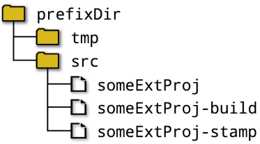
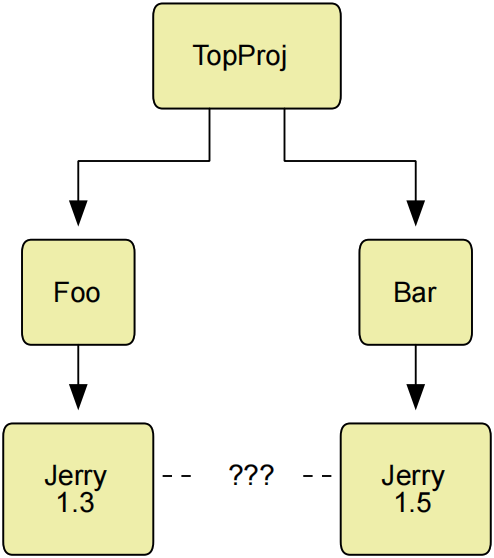
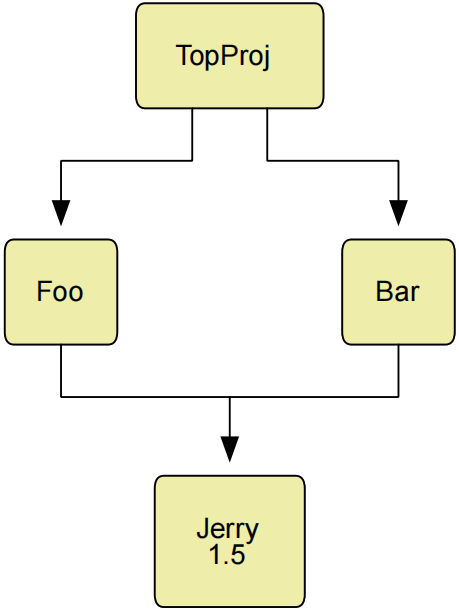
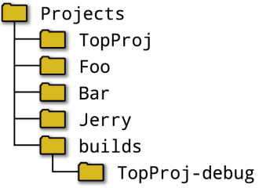
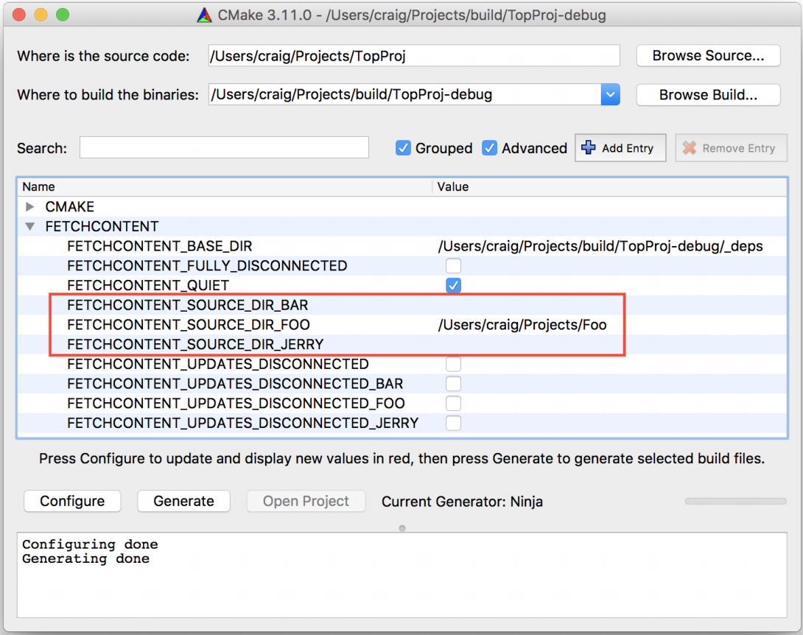

# Ch27. External Content

For any project of modest complexity, it is likely that it will rely on one or more external dependencies. These could be commonly available toolkits such as zlib, OpenSSL, Boost, etc., private projects by the same organization or content to be used as resources, test data and so on. In some situations, the project can expect the operating system to supply all required dependencies. This would be appropriate if the project is being distributed as part of that operating system, for example. For standalone projects, it is more likely that the project should be in control of the exact version of its dependencies to ensure that builds are repeatable and that release packages have known origins. This is especially important when building on continuous integration systems being shared with other projects that might have different dependency requirements. 【译】对于任何适度复杂的项目，它很可能依赖于一个或多个外部依赖关系。这些可能是常用的工具包，如zlib、OpenSSL、Boost等，同一组织或内容的私有项目用作资源、测试数据等。在某些情况下，项目可以期望操作系统提供所有必需的依赖关系。例如，如果项目作为该操作系统的一部分分发，这将是合适的。对于独立项目，项目更有可能控制其依赖项的确切版本，以确保构建是可重复的，并且发布包具有已知的来源。当构建与可能具有不同依赖性要求的其他项目共享的持续集成系统时，这一点尤为重要。

CMake provides a few choices for how to bring external content into a build. At a fairly raw level, the file(DOWNLOAD) command can be used to retrieve a specific file, either during the configure stage or as part of processing a CMake file in script mode (i.e. cmake -P). While this has its uses, it is usually well short of the level of functionality needed to incorporate whole projects. For downloading and building an entire dependency, the traditional approach in CMake has been to use the ExternalProject module. This has been a part of CMake for a long time and has a variety of uses apart from simply doing a download and build. The FetchContent module added in CMake 3.11 is built on top of ExternalProject and opens up a variety of new use cases, including handling dependencies shared between projects and supporting entire project hierarchies in one build. The ExternalData module offers another alternative for handling external content at build time, with a focus on data for test cases. 【译】CMake为如何将外部内容引入构建提供了一些选择。在相当原始的级别上，file（DOWNLOAD）命令可用于检索特定文件，无论是在配置阶段，还是作为在脚本模式下处理CMake文件的一部分（即CMake-P）。虽然这有其用途，但它通常远低于整合整个项目所需的功能级别。对于下载和构建整个依赖关系，CMake中的传统方法是使用ExternalProject模块。这已经是CMake的一部分很长时间了，除了简单的下载和构建外，还有各种用途。CMake 3.11中添加的FetchContent模块构建在ExternalProject之上，并开辟了各种新的用例，包括处理项目之间共享的依赖关系，以及在一个构建中支持整个项目层次结构。ExternalData模块为在构建时处理外部内容提供了另一种选择，重点是测试用例的数据。

## 27.1. ExternalProject

The ExternalProject module’s main purpose is to enable downloading and building external projects that cannot be easily made part of the main project directly. The external project is added as its own separate child build, effectively isolated from the main project and treated more or less as a black box. This means it can be used to build projects for a different architecture, different build settings or even to build a project with a build system other than CMake. It can also be used to handle a project that defines targets or install components that clash with those of the main project. 【译】ExternalProject模块的主要目的是允许下载和构建无法直接成为主项目一部分的外部项目。外部项目作为其自己的独立子构建添加，与主项目有效隔离，或多或少被视为一个黑匣子。这意味着它可以用于为不同的架构、不同的构建设置构建项目，甚至可以使用CMake以外的构建系统构建项目。它还可以用于处理定义目标的项目或安装与主项目冲突的组件。

ExternalProject works by defining a set of build targets in the main project that represent the distinct stages of obtaining and building the external project. These are then collected under a single CMake target which represents the whole sequence. Timestamps are used to keep track of which stages have already been performed and do not need to be repeated unless relevant details change. The default set of stages are as follows: 【译】ExternalProject通过在主项目中定义一组构建目标来工作，这些目标代表了获取和构建外部项目的不同阶段。然后，这些数据被收集在一个代表整个序列的CMake目标下。时间戳用于跟踪哪些阶段已经执行，除非相关细节发生变化，否则不需要重复。默认阶段集如下：

\#\>\>\>\>\>\>\>\>\>\>\>\>\>\>\>\>\>\>\>\>\>\>\>\>\>\>\>\>\>\>\>\>\>\>\>\>\>\>\>\>\>\>

**\#(1)Download**

Various methods can be used to obtain the external project’s source. These include downloading an archive from a URL and unpacking it automatically, or cloning/checking out from a source code repository such as git, subversion, mercurial or CVS. Alternatively, projects can define their own custom commands if none of the supported download options are appropriate.【译】可以使用各种方法来获取外部项目的来源。这些包括从URL下载存档并自动解压缩，或从git、subversion、mercurial或CVS等源代码存储库克隆/签出。或者，如果支持的下载选项都不合适，项目可以定义自己的自定义命令。

\#(2)**Update/Patch**

Once the source code has been downloaded, a patch can be applied to it (in the case of archive downloads) or it can be brought up to date (for source code repositories). Custom commands can be provided to override the default behavior if necessary. 【译】下载源代码后，可以对其应用补丁（在下载存档的情况下），也可以对其进行更新（对于源代码存储库）。如有必要，可以提供自定义命令来覆盖默认行为。

\#(3)**Configure**

If the external project uses CMake as its build system, this step executes cmake on the downloaded source. Some information is passed through from the main build to make configuring external CMake projects fairly seamless. For non-CMake external projects, a custom command can be provided to run the equivalent steps, such as running a configure script with appropriate options.【译】如果外部项目使用CMake作为其构建系统，则此步骤将在下载的源代码上执行CMake。从主构建中传递一些信息，使配置外部CMake项目变得相当无缝。对于非CMake外部项目，可以提供自定义命令来运行等效步骤，例如运行具有适当选项的配置脚本。

\#(4)**Build**

By default, the configured external project is built with the same build tool as the main project if CMake was used to configure the build. Custom commands can be provided for the build stage to use a different build tool or to perform some other task. 【译】默认情况下，如果使用CMake配置构建，则配置的外部项目将使用与主项目相同的构建工具构建。可以为构建阶段提供自定义命令，以使用不同的构建工具或执行其他任务。

\#(5)**Install**

The external project can be installed to a local directory, typically to somewhere within the main project’s build tree. The main project then knows where to expect the external project’s build artifacts to be and can incorporate them into its own build. The default behavior depends on whether or not the configure stage assumed a CMake build was being invoked. 【译】外部项目可以安装到本地目录，通常安装到主项目构建树中的某个位置。然后，主项目知道外部项目的构建工件在哪里，并可以将它们合并到自己的构建中。默认行为取决于配置阶段是否假设正在调用CMake构建。

\#(6)**Test**

The external project may come with its own set of tests which the main project might or might not wish to run. The ExternalProject module provides flexibility in whether or not to run a test stage (by default it doesn’t) and whether it should come before or after the install stage. If the test stage is enabled, a default test target will be assumed to exist in the external project, but custom commands can be specified to provide full control over what the test stage does.

【译】外部项目可能带有自己的一组测试，主项目可能希望也可能不希望运行这些测试。ExternalProject模块提供了是否运行测试阶段（默认情况下不运行）以及是否应在安装阶段之前或之后运行测试阶段的灵活性。如果启用了测试阶段，则默认测试目标将假定存在于外部项目中，但可以指定自定义命令来提供对测试阶段功能的完全控制。

\#\<\<\<\<\<\<\<\<\<\<\<\<\<\<\<\<\<\<\<\<\<\<\<\<\<\<\<\<\<\<\<\<\<\<\<\<\<\<\<\<\<\<

The module allows other custom stages to be defined and inserted into any point in the above workflow, but the default set of stages are typically sufficient for most projects. The details for the default stages are all set by the main function provided by the module, ExternalProject_Add(). This function accepts many options, all of which are detailed in the module’s documentation. A selection of the more commonly used ones and some typical scenarios are given below to help guide the reader on how to make the most of what ExternalProject offers. 【译】该模块允许定义其他自定义阶段并将其插入到上述工作流中的任何点，但默认阶段集通常足以满足大多数项目的需求。默认阶段的详细信息都由模块提供的主函数ExternalProject_Add（）设置。此函数接受许多选项，所有选项都在模块的文档中详细说明。下面给出了一些更常用的选项和一些典型场景，以帮助指导读者如何充分利用ExternalProject提供的功能。

### 27.1.1. Tour Of Main Features

The simplest case involves downloading a source archive from a URL and building it as a CMake project. The minimal information needed to achieve this is just the URL, which is provided like so:

【译】最简单的情况是从URL下载源代码存档并将其构建为CMake项目。实现这一目标所需的最少信息就是URL，其提供方式如下：

\#------------------------------------\>\>\>\>\>\>

include(ExternalProject)

ExternalProject_Add(someExtProj

URL http://somecompany.com/releases/myproj_1.2.3.tar.gz

)

\#------------------------------------\<\<\<\<\<\<

The first argument to the function is always the name of a build target to be created in the main project. This target will be used to refer to the external project’s whole build process. By default, it is added to the main project’s all target, but this can be disabled by adding the usual EXCLUDE_FROM_ALL option, which has the same effect as it does for commands like add_executable(), add_custom_target(), etc. In the above example, building the someExtProj target will result in the following being performed during the build stage of the main project:

【译】函数的第一个参数始终是要在主项目中创建的构建目标的名称。该目标将用于指代外部项目的整个构建过程。默认情况下，它被添加到主项目的所有目标中，但可以通过添加通常的EXCLUDE_FROM_all选项来禁用它，该选项与add_executable()、add_custom_target()等命令的效果相同。在上面的示例中，构建someExtProj目标将导致在主项目的构建阶段执行以下操作：

• Download the tarball and unpack it. 【译】下载tarball并打开包装。

• Run cmake with default options based on the main build. 【译】使用基于主构建的默认选项运行cmake。

• Invoke the same build tool as the main project for the default target. 【译】为默认目标调用与主项目相同的构建工具。

• Build the external project’s install target.【译】构建外部项目的安装目标。

These steps all use a separate set of directories created in the build directory to hold the sources, build outputs, timestamps and other temporary files associated with the external project’s build. The structure of these directories depends on a few different factors and the module documentation provides a detailed explanation of how the directory structure is chosen. A simpler starting point is to show how the main project can control the locations rather than relying on the defaults. The base location of the directories can be set using the PREFIX option.

【译】这些步骤都使用在构建目录中创建的一组单独的目录来保存与外部项目构建相关的源代码、构建输出、时间戳和其他临时文件。这些目录的结构取决于几个不同的因素，模块文档详细解释了如何选择目录结构。一个更简单的起点是展示主项目如何控制位置，而不是依赖默认值。可以使用PREFIX选项设置目录的基本位置。

\`\`\`cmake

ExternalProject_Add(someExtProj

PREFIX prefixDir

URL http://somecompany.com/releases/myproj_1.2.3.tar.gz

)

\`\`\`

When used this way, the directory layout will be based under prefixDir, which should generally be provided as an absolute path and would normally be somewhere within the main project’s build area. The default relative directory layout created under this location is shown below. The unpacked archive will be in prefixDir/src/someExtProj and the CMake build will use prefixDir/src/someExtProj-build as its build directory. 【译】当以这种方式使用时，目录布局将基于前缀Dir，前缀Dir通常应作为绝对路径提供，并且通常位于主项目的构建区域内的某个位置。在此位置下创建的默认相对目录布局如下所示。解压缩的存档将位于prefixDir/src/someExtProj中，CMake构建将使用prefixDir/strc/someExtProj构建作为其构建目录。

The EP_PREFIX and EP_BASE directory properties can be set to influence the above layout, see the ExternalProject documentation for details. The prefix and these directory properties only provide coarse control over the directory structure. For those cases where it is needed, ExternalProject_Add() allows some or all of the individual directories to be set directly:

【译】EP_PREFIX和EP_BASE目录属性可以设置为影响上述布局，有关详细信息，请参阅ExternalProject文档。前缀和这些目录属性仅提供对目录结构的粗略控制。对于需要它的情况，ExternalProject_Add（）允许直接设置部分或全部单个目录：

\`\`\`cmake

ExternalProject_Add(someExtProj

DOWNLOAD_DIR downloadDir

SOURCE_DIR sourceDir

BINARY_DIR binaryDir

INSTALL_DIR installDir

TMP_DIR tmpDir

STAMP_DIR stampDir

URL http://somecompany.com/releases/myproj_1.2.3.tar.gz

)

\`\`\`

In practice, the TMP_DIR and STAMP_DIR would rarely be used, but the others are of more direct relevance to the main project and are sometimes provided. The default install location will be up to the external project, which will typically be a system wide location, so it is very common for INSTALL_DIR to be specified to facilitate collecting all the final artifacts of external projects in one place within the build directory (further steps are required to make the external projects use the specified INSTALL_DIR, as later examples will show). 【译】在实践中，TMP_DIR和STAMP_DIR很少使用，但其他两个与主项目更直接相关，有时会提供。默认安装位置将取决于外部项目，这通常是一个系统范围的位置，因此指定install_DIR以方便在构建目录中的一个位置收集外部项目的所有最终工件是很常见的（需要进一步的步骤来使外部项目使用指定的install_DIR，如后面的示例所示）。

Another useful technique is to provide SOURCE_DIR and give a location of an existing directory that has already been populated. When used this way, no download method needs to be given, in which case the command will simply use the existing contents of the specified source directory. This can be a very convenient way of building a part of the main project’s source tree for a different platform. For example: 【译】另一种有用的技术是提供SOURCE_DIR，并给出已填充的现有目录的位置。当以这种方式使用时，不需要给出下载方法，在这种情况下，命令将只使用指定源目录的现有内容。这是为不同平台构建主项目源代码树的一部分的一种非常方便的方法。例如：

\`\`\`camke

ExternalProject_Add(firmware

SOURCE_DIR \${CMAKE_CURRENT_LIST_DIR}/firmware

INSTALL_DIR \${CMAKE_CURRENT_BINARY_DIR}/firmware-artifacts

\#... other options to configure differently

)

\`\`\`

When the external project also uses CMake as its build system, it can be desirable to add cmake command line options to influence its configuration. The most direct way to achieve this is using the CMAKE_ARGS option, which should be followed by the arguments to be passed to the external project’s cmake command. The above example can be extended to use a toolchain file, configure a release build and use the nominated install directory like so: 【译】当外部项目也使用CMake作为其构建系统时，可能需要添加CMake命令行选项来影响其配置。实现这一点的最直接方法是使用CMAKE_ARGS选项，后面应该是要传递给外部项目CMAKE命令的参数。上述示例可以扩展为使用工具链文件、配置发布版本并使用指定的安装目录，如下所示：

\`\`\`cmake

ExternalProject_Add(firmware

SOURCE_DIR \${CMAKE_CURRENT_LIST_DIR}/firmware

INSTALL_DIR \${CMAKE_CURRENT_BINARY_DIR}/firmware-artifacts

CMAKE_ARGS -D CMAKE_TOOLCHAIN_FILE=\${CMAKE_CURRENT_LIST_DIR}/fwtoolchain.cmake

> -D CMAKE_BUILD_TYPE=Release

-D CMAKE_INSTALL_PREFIX=\<INSTALL_DIR\> \# See further below

)

\`\`\`

If more than a couple of CMake options need to be set, the length of the generated cmake command line could become a problem. An alternative is to specify cache variables to be defined using CMAKE_CACHE_ARGS rather than defining them via CMAKE_ARGS. These arguments are expected to be in the form -Dvariable:TYPE=value and will be converted to a file containing commands of the form set(variable value CACHE TYPE "" FORCE). This file is then passed to the cmake command line with a -C option. The effect is the same as if the variables had been set directly on the cmake command line via -D options. There are other options which can be used to change the CMake generator and a few other less common aspects of how CMake is invoked, but these are less frequently used. Consult the module documentation for further details. 【译】如果需要设置多个CMake选项，则生成的CMake命令行的长度可能会成为问题。另一种方法是使用CMAKE_cache_ARGS指定要定义的缓存变量，而不是通过CMAKE_ARGS定义它们。这些参数的格式应为-Dvariable:TYPE=value，并将转换为包含格式集命令的文件（变量值CACHE TYPE“”FORCE）。然后，使用-C选项将此文件传递给cmake命令行。其效果与通过-D选项直接在cmake命令行上设置变量的效果相同。还有其他选项可用于更改CMake生成器，以及其他一些不太常见的CMake调用方式，但这些选项的使用频率较低。有关更多详细信息，请参阅模块文档。

If the external project does not use CMake as its build system, the CONFIGURE_COMMAND option can be given to provide an alternative custom command to be executed instead of running cmake. For example, many projects provide a configure script, which could be set up like so:

【译】如果外部项目不使用CMake作为其构建系统，则可以提供CONFIGURE_COMMAND选项，以提供要执行的替代自定义命令，而不是运行CMake。例如，许多项目都提供了一个配置脚本，可以这样设置：

\`\`\`cmake

ExternalProject_Add(someAutotoolsProj

URL someUrl

CONFIGURE_COMMAND \<SOURCE_DIR\>/configure

...

)

\`\`\`

The configure command is run in the build directory, but the configure script will be in the source directory. Rather than explicitly having to define the directory layout to be used for the external project, the above demonstrates an alternative strategy whereby the default structure is used, but the command’s placeholder support provides the location of the source directory. The previous example also used a placeholder for the install directory passed as the value for CMAKE_INSTALL_PREFIX. A placeholder is just the option name for a particular directory surrounded by angle brackets, the most commonly used being \<SOURCE_DIR\>, \<BINARY_DIR\> and \<INSTALL_DIR\>. \<DOWNLOAD_DIR\> is also available with CMake 3.11 or later. The full list of placeholders is given in the module documentation. 【译】configure命令在构建目录中运行，但configure脚本将在源目录中。上面演示了一种替代策略，即使用默认结构，但命令的占位符支持提供源目录的位置，而不必明确定义用于外部项目的目录布局。前面的示例还为作为CMAKE_install_PREFIX值传递的安装目录使用了占位符。占位符只是尖括号包围的特定目录的选项名称，最常用的是\<SOURCE_DIR\>、\<BINARY_DIR\>和\<INSTALL_DIR\>\<下载_DIR\>也可用于CMake 3.11或更高版本。模块文档中给出了占位符的完整列表。

If the CONFIGURE_COMMAND option is not used, the project is assumed to be a CMake build and the external project’s build step will use the same build tool as the main project. For such cases, the default behavior of the build step is suitable and no special handling is needed. When CONFIGURE_COMMAND is provided, the default build tool is assumed to be make and the default build command is to invoke make without any explicit target. If a non-default target should be built instead or a build tool other than make is needed, a custom build command must be provided. For example: 【译】如果不使用CONFIGURE_COMMAND选项，则假定该项目是CMake构建，外部项目的构建步骤将使用与主项目相同的构建工具。对于这种情况，构建步骤的默认行为是合适的，不需要特殊处理。当提供CONFIGURE_COMMAND时，默认构建工具假定为make，默认构建命令是在没有任何显式目标的情况下调用make。如果应该构建非默认目标，或者需要make以外的构建工具，则必须提供自定义构建命令。例如：

\#------------------------------------\>\>\>\>\>\>

find_program(MAKE_EXECUTABLE NAMES nmake gmake make)

ExternalProject_Add(someAutotoolsProj

URL someUrl

CONFIGURE_COMMAND \<SOURCE_DIR\>/configure

BUILD_COMMAND \${MAKE_EXECUTABLE} specialTool

)

\#------------------------------------\<\<\<\<\<\<

The custom build command could do anything, it doesn’t have to be a known build tool. It can even be set to an empty string to effectively bypass the build stage. Predictably, the same pattern continues for the install stage too. For CMake projects, the main project’s build tool will be invoked to build a target called install by default, whereas for non-CMake projects the default command is simply make install. The INSTALL_COMMAND option can be used to provide a custom install command or it can be set to an empty string to disable the install stage altogether. This is often used when the main project can use the results of the build stage without needing any further install. 【译】自定义构建命令可以做任何事情，它不必是已知的构建工具。它甚至可以设置为空字符串，以有效地绕过构建阶段。可以预见的是，同样的模式在安装阶段也会持续下去。对于CMake项目，默认情况下将调用主项目的构建工具来构建一个名为install的目标，而对于非CMake项目来说，默认命令只是make install。INSTALL_COMMAND选项可用于提供自定义安装命令，也可以将其设置为空字符串以完全禁用安装阶段。当主项目可以使用构建阶段的结果而不需要任何进一步的安装时，通常会使用这种方法。

\`\`\`cmake

ExternalProject_Add(someAutotoolsProj

URL someUrl

CONFIGURE_COMMAND \<SOURCE_DIR\>/configure

BUILD_COMMAND \${MAKE_EXECUTABLE} specialTool

INSTALL_COMMAND "" \# Effectively disable the install stage

)

\`\`\`

Care should be taken to handle the install stage properly. If the external project uses CMake as its build system, the destination of the default install rule is controlled by the CMAKE_INSTALL_PREFIX cache variable. If this variable is not set, the default location will be used, which typically results in the external project being installed to a system wide location, which is not usually the desired outcome (certainly not if the project is being built within a continuous integration system). Similarly, if the external project uses a build system other than CMake, the default install command will be make install, which again will likely try to install to a system wide location. For the CMake case, setting the cache variable via CMAKE_ARGS as shown in the earlier example addresses the situation, while for a Makefile based project, something like the following is usually appropriate: 【译】应注意正确处理安装阶段。如果外部项目使用CMake作为其构建系统，则默认安装规则的目标由CMake_install_PREFIX缓存变量控制。如果未设置此变量，将使用默认位置，这通常会导致外部项目安装到系统范围内的位置，而这通常不是预期的结果（如果项目是在持续集成系统中构建的，则肯定不会）。同样，如果外部项目使用CMake以外的构建系统，默认的安装命令将是make install，它很可能会再次尝试安装到系统范围内的位置。对于CMake的情况，如前面的示例所示，通过CMake_ARGS设置缓存变量可以解决这种情况，而对于基于Makefile的项目，通常可以采用以下方式：

\`\`\`cmake

ExternalProject_Add(otherProj

URL ...

INSTALL_DIR \${CMAKE_CURRENT_BINARY_DIR}/otherProj-install

CONFIGURE_COMMAND \<SOURCE_DIR\>/configure

INSTALL_COMMAND \${MAKE_EXECUTABLE} DESTDIR=\<INSTALL_DIR\> install

)

\`\`\`

The INSTALL_DIR option doesn’t do anything other than define a value for the \<INSTALL_DIR\> placeholder. It is up to the caller to use the \<INSTALL_DIR\> placeholder to pass that information through to wherever it is needed. Projects should use INSTALL_DIR to define the location and then use the \<INSTALL_DIR\> placeholder rather than embedding the path directly in options like INSTALL_COMMAND. This ensures that the location can be queried later if required, as covered in Section 27.1.3, “Miscellaneous Features” further below. 【译】INSTALL_DIR选项除了为\<INSTALL_DIR\>占位符定义值外，什么也不做。由调用者使用\<INSTALL_DIR\>占位符将信息传递到需要的地方。项目应使用INSTALL_DIR定义位置，然后使用\<INSTALL_DIR\>占位符，而不是将路径直接嵌入到INSTALL_COMMAND等选项中。这确保了在需要时可以稍后查询位置，如下文第27.1.3节“其他功能”所述。

The test stage is handled slightly differently and does nothing by default. To enable it, one of the test-specific options must be given, such as TEST_BEFORE_INSTALL YES or TEST_AFTER_INSTALL YES.Once enabled, the pattern is the same as for the build and install stages, with the appropriate build tool invoking the test target by default, but TEST_COMMAND can be given to provide alternative behavior. 【译】测试阶段的处理方式略有不同，默认情况下不做任何事情。要启用它，必须给出一个特定于测试的选项，例如test_BEFORE_INSTALL YES或test_FTER_INSTALL YES。启用后，模式与构建和安装阶段相同，默认情况下，适当的构建工具会调用测试目标，但可以提供test_COMMAND以提供替代行为。

Of course, ExternalProject has considerably more downloading support than just a basic URL to download. For archives, it supports the main project giving a hash of the file to be downloaded. This not only has the obvious advantage of verifying the downloaded contents, it also allows the module to check a file it might have downloaded previously and avoid re-downloading it again if it knows it already has one with the correct hash. The hash value can be for any algorithm that the file() command supports, but it is typically either MD5 or SHA1. The hash is given with the URL_HASH option as in the following example: 【译】当然，ExternalProject的下载支持远不止一个基本的下载URL。对于档案，它支持主项目提供要下载的文件的哈希值。这不仅具有验证下载内容的明显优势，还允许模块检查它之前可能下载过的文件，如果它知道它已经有一个具有正确哈希值的文件，则避免再次下载。哈希值可以用于file（）命令支持的任何算法，但通常是MD5或SHA1。哈希值使用URL_hash选项给出，如下例所示：

\#------------------------------------\>\>\>\>\>\>

ExternalProject_Add(someAutotoolsProj

URL someUrl

URL_HASH MD5=b4a78fe5c9f2ef73cd3a6b07e79f2283

\#... other options

)

\#------------------------------------\<\<\<\<\<\<

Specifying a hash is strongly recommended. CMake will issue a warning if the URL option is used without an accompanying URL_HASH option (as a special case to maintain backward compatibility with older CMake versions, the URL_MD5 option can be used to provide a MD5 hash, but projects should avoid it in favor of the more flexible URL_HASH option). 【译】强烈建议指定哈希值。如果使用URL选项时没有附带URL_HASH选项，CMake将发出警告（作为保持与旧CMake版本向后兼容性的特殊情况，URL_MD5选项可用于提供MD5哈希，但项目应避免使用它，而应使用更灵活的URL_HASH选项）。

It is also possible to specify more than one URL and let the project try each in turn until one succeeds. This can be useful when the available servers to connect to might change depending on the network connection, VPN settings, etc. or to try local servers before potentially slower remote servers. This feature cannot be used with file:// urls. 【译】也可以指定多个URL，并让项目依次尝试每个URL，直到成功为止。当要连接的可用服务器可能会根据网络连接、VPN设置等而变化，或者在可能较慢的远程服务器之前尝试本地服务器时，这可能很有用。此功能不能与file://urls一起使用。

\`\`\`cmake

ExternalProject_Add(someProj

URL http://mirrors.mycompany.com/releases/someproj-1.2.3.tar.gz

https://somewhereelse.com/artifacts/someproj-1.2.3.tar.gz

URL_HASH MD5=b4a78fe5c9f2ef73cd3a6b07e79f2283

\#... other options

)

\`\`\`

When downloading archives, the archive format is detected based on the file contents after download and the archive is unpacked automatically. The automatic unpacking can be disabled if needed and various aspects of how the download itself is configured can be controlled. See the module documentation for details on the relevant options for these less common scenarios.

【译】下载档案时，根据下载后的文件内容检测档案格式，并自动解包档案。如果需要，可以禁用自动解包，并且可以控制下载本身配置的各个方面。有关这些不太常见场景的相关选项的详细信息，请参阅模块文档。

Downloaded contents don’t have to be from an archive, the module can also work directly with source code repositories for git, subversion, mercurial or CVS. Each of these require the repository to be named with a \<REPOTYPE\>\_REPOSITORY option and then other repository specific options may also be given. 【译】下载的内容不必来自存档，该模块还可以直接与git、subversion、mercurial或CVS的源代码存储库一起工作。其中每一个都要求使用\<REPOTYPE\>\_repository选项命名存储库，然后还可以给出其他特定于存储库的选项。

\`\`\`cmake

ExternalProject_Add(myProj

GIT_REPOSITORY git@somecompany.com/git/myproj.git

GIT_TAG 3a281711d1243351190bdee50a40d81694aa630a

)

\`\`\`

The above example shows the typical information needed to clone a git repository and checkout a particular commit. If the GIT_TAG option is omitted, the latest commit on the default branch (usually master) will be used. The name of a tag or branch can also be given with GIT_TAG instead of a commit hash. While GIT_TAG does support these different choices, it should be noted that only a commit hash is truly unambiguous. With git, the commit referenced by a branch or tag name can move over time, so using them does not guarantee a repeatable build. Similarly, omitting GIT_TAG altogether is the same as giving the name of the default branch, so it too won’t always point at the same commit. 【译】上面的示例显示了克隆git存储库和签出特定提交所需的典型信息。如果省略GIT_TAG选项，则将使用默认分支（通常是主分支）上的最新提交。标签或分支的名称也可以用GIT_tag而不是提交哈希给出。虽然GIT_TAG确实支持这些不同的选择，但应该注意的是，只有提交哈希才是真正明确的。使用git，分支或标记名称引用的提交可能会随着时间的推移而移动，因此使用它们并不能保证可重复的构建。同样，完全省略GIT_TAG与给出默认分支的名称相同，因此它也不会总是指向同一个提交。

There is another reason to only use commit hashes with GIT_TAG. Because a tag or branch name can change over time, ExternalProject_Add() will need to contact the remote end every time CMake is run, even if it already has the named tag or branch cloned and checked out. It does this because it cannot be sure that the tag or branch hasn’t moved without fetching from the remote. This round trip every time CMake is re-run can be expensive, especially if the project is using many external projects. If a commit hash is used instead, then ExternalProject_Add() can determine whether it already has the commit locally without needing to contact the remote. Therefore, once the commit has been successfully fetched, no further network connection is needed for any subsequent CMake runs. 【译】还有另一个原因是只使用GIT_TAG的提交哈希。因为标记或分支名称会随着时间而变化，所以每次运行CMake时，ExternalProject_Add（）都需要联系远程端，即使它已经克隆并签出了命名的标记或分支。它这样做是因为如果不从远程获取，它无法确定标记或分支是否没有移动。每次重新运行CMake时，这种往返可能会很昂贵，特别是如果项目使用了许多外部项目。如果使用提交哈希，则ExternalProject_Add（）可以确定它是否已经在本地进行了提交，而无需联系远程。因此，一旦成功获取了提交，任何后续的CMake运行都不需要进一步的网络连接。

Other options can be used to customize the git behavior, including specifying a different default remote name, control of git submodules, shallow clones and arbitrary git config options. Consult the module documentation for further details. 【译】其他选项可用于自定义git行为，包括指定不同的默认远程名称、控制git子模块、浅层克隆和任意git配置选项。有关更多详细信息，请参阅模块文档。

Checking out from a subversion repository is fairly similar to git: 【译】从subversion存储库中检出与git非常相似：

\`\`\`cmake

ExternalProject_Add(myProj

SVN_REPOSITORY svn+ssh@somecompany.com/svn/myproj/trunk

SVN_REVISION -r31227

)

\`\`\`

The SVN_REVISION option specifies a svn command line option that is expected to specify the commit to check out. This will frequently be a global revision number specified with the -r option as shown above, but could technically be any valid command line option. If SVN_REVISION is omitted, the latest revision is used, but projects should strive to always provide this option to ensure the build is repeatable. A few other security-related subversion options are supported by ExternalProject_Add(), such as for authenticating with the repository and specifying certificate trust settings. Consult the ExternalProject module documentation for details on these less frequently used options. 【译】SVN_REVISION选项指定了一个SVN命令行选项，该选项应指定要签出的提交。这通常是用-r选项指定的全局修订号，如上所示，但在技术上可以是任何有效的命令行选项。如果省略SVN_REVISION，则使用最新版本，但项目应努力始终提供此选项，以确保构建是可重复的。ExternalProject_Add（）支持其他一些与安全相关的颠覆选项，例如用于与存储库进行身份验证和指定证书信任设置。有关这些不常用选项的详细信息，请参阅ExternalProject模块文档。

In comparison, the support for Mercurial and CVS is very basic. In the case of Mercurial, only the repository and tag can be specified, while for CVS the module is also required: 【译】相比之下，对Mercurial和CVS的支持非常基础。对于Mercurial，只能指定存储库和标签，而对于CVS，还需要模块：

\`\`\`cmake

ExternalProject_Add(myProjHg

HG_REPOSITORY http://somecompany.com/hg/myproj

HG_TAG dd2ce38a6b8a

)

ExternalProject_Add(myProjCVS

CVS_REPOSITORY http://somecompany.com/cvs/myproj

CVS_MODULE someModule

CVS_TAG -rsomeTag

)

\`\`\`

The CVS_TAG option is analogous to the SVN_REVISION option in that it is placed on the cvs command line directly, so it must include any required command option prefix such as shown above. 【译】CVS_TAG选项类似于SVN_REVISION选项，因为它直接放置在CVS命令行上，因此它必须包含任何必需的命令选项前缀，如上所示。

### 27.1.2. Step Management

Sometimes it can be useful or even necessary to refer to one of the steps in the ExternalProject sequence, such as to add a dependency on another CMake target that provides an input to a particular step. The STEP_TARGETS option can be given to ExternalProject_Add() to tell it to create CMake targets for the specified set of steps. These targets have names of the form mainName-step, where mainName is the target name given as the first argument to ExternalProject_Add() and step is the step the target represents. For example, the following would result in targets named myProjconfigure and myProj-install being defined: 【译】有时，引用ExternalProject序列中的一个步骤是有用的，甚至是必要的，例如添加对另一个CMake目标的依赖关系，该目标为特定步骤提供输入。STEP_TARGES选项可以提供给ExternalProject_Add（），告诉它为指定的步骤集创建CMake目标。这些目标的名称格式为mainName step，其中mainName是作为ExternalProject_Add（）的第一个参数给出的目标名称，step是目标表示的步骤。例如，以下操作将导致定义名为myProj configure和myProj install的目标：

\`\`\`cmake

ExternalProject_Add(myProj

GIT_REPOSITORY git@somecompany.com/git/myproj.git

GIT_TAG 3a281711d1243351190bdee50a40d81694aa630a

STEP_TARGETS configure install

)

\`\`\`

Adding dependencies for these step targets requires a little more care. To make a step target depend on some other CMake target, the project should use the ExternalProject_Add_StepDependencies() function provided by the module rather than calling add_dependencies(). This ensures that things like the step timestamps are handled correctly. The form of that command is as follows:

【译】为这些步骤目标添加依赖关系需要更加小心。要使步骤目标依赖于其他CMake目标，项目应使用模块提供的ExternalProject_Add_StepRdependencies（）函数，而不是调用Add_dependencies（）。这确保了正确处理步骤时间戳等事项。该命令的形式如下：

\`\`\`cmake

ExternalProject_Add_StepDependencies(mainName step otherTarget1...)

\`\`\`

The following example shows how to use this function to make the configure step of the previous example depend on an executable built by the main project: 【译】以下示例显示了如何使用此函数使上例的配置步骤依赖于主项目构建的可执行文件：

\#------------------------------------\>\>\>\>\>\>

add_executable(preConfigure ...)

ExternalProject_Add_StepDependencies(myProj configure preConfigure)

\#------------------------------------\<\<\<\<\<\<

To make an ordinary CMake target depend on a step target, add_dependencies() is fine: 【译】要使普通的CMake目标依赖于step目标，add_dependencies（）很好：

\#------------------------------------\>\>\>\>\>\>

add_executable(postInstall ...)

add_dependencies(postInstall myProj-install)

\#------------------------------------\<\<\<\<\<\<

If a particular step of one external project needs to depend on a step of a different external project,ExternalProject_Add_StepDependencies() must once again be used:

【译】如果一个外部项目的特定步骤需要依赖于不同外部项目的步骤，则必须再次使用ExternalProject_Add_StepDependencies()：

\`\`\`cmake

ExternalProject_Add(earlier

STEP_TARGETS build

...

)

ExternalProject_Add(later

STEP_TARGETS build

...

)

ExternalProject_Add_StepDependencies(later build earlier-build)

\`\`\`

The above arrangement can be useful if earlier defines tests that are time consuming to run, but in a parallel build the later project doesn’t need to wait for those tests, only for earlier to be built.

【译】如果早期定义的测试运行起来很耗时，那么上述安排可能很有用，但在并行构建中，后期项目不需要等待这些测试，只需要等待早期构建。

When the same set of step targets need to be defined for multiple external projects, rather than repeating them each time, they can be made the default by setting the EP_STEP_TARGETS directory property instead. 【译】当需要为多个外部项目定义同一组步骤目标时，而不是每次重复它们，可以通过设置EP_step_targets目录属性将其设置为默认值。

\#------------------------------------\>\>\>\>\>\>

set_property(DIRECTORY PROPERTY EP_STEP_TARGETS build)

ExternalProject_Add(earlier ...)

ExternalProject_Add(later ...)

ExternalProject_Add_StepDependencies(later build earlier-build)

\#------------------------------------\<\<\<\<\<\<

For many projects though, such granularity of dependencies offers only limited gains and the complexity may not be worth it. The whole external project can be made dependent on another target by using the DEPENDS option with ExternalProject_Add(), which is much simpler:

【译】然而，对于许多项目来说，这种依赖关系的粒度只提供了有限的收益，复杂性可能不值得。通过使用ExternalProject_Add（）的DEPENDS选项，可以使整个外部项目依赖于另一个目标，这要简单得多：

\#------------------------------------\>\>\>\>\>\>

add_executable(preConfigure ...)

ExternalProject_Add(myProj

DEPENDS preConfigure

...

)

\#------------------------------------\<\<\<\<\<\<

The DEPENDS option takes care of ensuring all of the step dependencies are handled correctly just as ExternalProject_Add_StepDependencies() does when setting up more granular dependencies. 【译】DEPENDS选项负责确保所有步骤依赖关系都得到正确处理，就像ExternalProject_Add_step.dependencies（）在设置更细粒度的依赖关系时所做的那样。

Projects are not limited to only the default steps, they can create their own custom steps and insert them into the step workflow with whatever dependency relationships they require. The ExternalProject_Add_Step() function provides this capability: 【译】项目不仅限于默认步骤，它们还可以创建自己的自定义步骤，并将其插入到步骤工作流中，并具有所需的任何依赖关系。ExternalProject_Add_Step（）函数提供了此功能：

\`\`\`cmake

ExternalProject_Add_Step(mainName step

\[COMMAND command \[args...\] \]

\[COMMENT comment\]

\[WORKING_DIRECTORY dir\]

\[DEPENDS filesWeDependOn...\]

\[DEPENDEES stepsWeDependOn...\]

\[DEPENDERS stepsDependOnUs...\]

\[BYPRODUCTS byproducts...\]

\[ALWAYS bool\]

\[EXCLUDE_FROM_MAIN bool\]

\[LOG bool\]

\[USES_TERMINAL bool\]

)

\`\`\`

COMMAND is used to define the action to take when the step is executed. It is analogous to the custom command that can be specified for each of the default steps. COMMENT can be supplied to provide a custom message when executing the step, but as noted back in Section 17.1, “Custom Targets”, such comments are not always shown, so consider them helpful but not essential. The WORKING_DIRECTORY option has the same meaning as for an add_custom_target() command. 【译】COMMAND用于定义执行步骤时要采取的操作。它类似于可以为每个默认步骤指定的自定义命令。可以在执行步骤时提供注释以提供自定义消息，但正如第17.1节“自定义目标”中所述，此类注释并不总是显示出来，因此认为它们是有帮助的，但不是必需的。WORKING_DIRECTORY选项与add_custom_target（）命令的含义相同。

Comprehensive dependency details can be provided with the custom step. If the command depends on a specific file or set of files, they should be listed with the DEPENDS option. For files generated as part of the build, they must be generated by custom commands created in the same directory scope. The DEPENDEES and DEPENDERS options define where this custom step sits in the step workflow of the external project. Care must be taken to fully specify all direct dependencies or else the custom step will potentially execute out of sequence. The BYPRODUCTS option should also be used if the custom step produces a file that something else in the external project or main project depends on. Without this, the Ninja generator will likely complain about a missing build rule. 【译】自定义步骤可以提供全面的依赖关系详细信息。如果命令依赖于特定的文件或文件集，则应将其与depends选项一起列出。对于作为构建的一部分生成的文件，它们必须由在同一目录范围内创建的自定义命令生成。依赖项和依赖项选项定义了此自定义步骤在外部项目的步骤工作流中的位置。必须注意完全指定所有直接依赖关系，否则自定义步骤可能会按顺序执行。如果自定义步骤生成外部项目或主项目中其他部分所依赖的文件，也应使用BYPRODUCTS选项。否则，Ninja生成器可能会抱怨缺少构建规则。

A custom step can be made to always appear out of date by setting the ALWAYS option to true. Projects should generally only do this if no other step depends on it, since anything depending on it would then also be always considered out of date and this may lead to builds doing more work than they need to. If the custom step is intended to only be built on demand, then setting both ALWAYS and EXCLUDE_FROM_MAIN to true is usually the desired combination. The remaining options LOG and USES_TERMINAL are discussed in the next section. 【译】通过将“始终”选项设置为true，可以使自定义步骤始终显示为过期。项目通常只有在没有其他步骤依赖它的情况下才应该这样做，因为依赖它的任何东西都会被认为是过时的，这可能会导致构建比需要做的更多。如果自定义步骤只打算按需构建，那么将always和EXCLUDE_FROM_MAIN都设置为true通常是理想的组合。下一节将讨论其余的选项LOG和USES_TERMINAL。

All of the default steps are created by calls to ExternalProject_Add_Step() internally from within ExternalProject_Add(). Projects must not try to redefine them, which means custom steps cannot not be named mkdir, download, update, skip-update, patch, configure, build, install or test.

【译】所有默认步骤都是通过从ExternalProject_Add()内部调用ExternalProject_Add_Step()创建的。项目不得尝试重新定义它们，这意味着自定义步骤不能命名为mkdir、下载、更新、跳过更新、补丁、配置、构建、安装或测试。

The actions and inter-step dependencies are defined by ExternalProject_Add_Step(), but in order for a target to be created for a custom step, the ExternalProject_Add_StepTargets() function must be called as well. This function is also called internally by ExternalProject_Add() to create targets for steps listed in its STEP_TARGETS option or set via the EP_STEP_TARGETS directory property.

【译】动作和步骤间依赖关系由ExternalProject_Add_step()定义，但为了为自定义步骤创建目标，还必须调用ExternalProject_Add_StepTargets()函数。此函数也由ExternalProject_Add()在内部调用，为STEP_targets选项中列出的步骤或通过EP_STEP_targets目录属性设置的步骤创建目标。

\`\`\`cmake

ExternalProject_Add_StepTargets(mainName \[NO_DEPENDS\] steps...)

\`\`\`

The NO_DEPENDS option is rarely desirable and is not recommended for most scenarios (see the discussion of this option in the module documentation for further details). The following example demonstrates how to define a package custom step which depends on the build step, but is only executed when explicitly requested. 【译】NO_DEPENDS选项很少可取，也不建议在大多数情况下使用（有关更多详细信息，请参阅模块文档中对此选项的讨论）。以下示例演示了如何定义包自定义步骤，该步骤取决于构建步骤，但仅在明确请求时执行。

\#------------------------------------\>\>\>\>\>\>

ExternalProject_Add_Step(myProj package

COMMAND \${CMAKE_COMMAND} --build \<BINARY_DIR\> --target package

DEPENDEES build

ALWAYS YES

EXCLUDE_FROM_MAIN YES

)

ExternalProject_Add_StepTargets(myProj package)

\#------------------------------------\<\<\<\<\<\<

### 27.1.3. Miscellaneous Features

For any of the default or custom steps, a custom command can be specified. For ExternalProject_Add(), the relevant options are those that end with \_COMMAND, while for External_Project_Add_Step() it is the COMMAND option that provides the custom command to execute. Both of these functions allow more than one command to be given by appending further COMMAND options that immediately follow the first. Each command is then executed in order for that step. 【译】对于任何默认或自定义步骤，都可以指定自定义命令。对于ExternalProject_Add()，相关选项以_COMMAND结尾，而对于External_Project_Add_Step()，COMMAND选项提供要执行的自定义命令。这两个函数都允许通过在第一个命令后立即附加其他command选项来给出多个命令。然后，按照该步骤的顺序执行每个命令。

\#------------------------------------\>\>\>\>\>\>

ExternalProject_Add(myProj

CONFIGURE_COMMAND \${CMAKE_COMMAND} -E echo "Starting custom configure"

> COMMAND ./configure
>
> COMMAND \${CMAKE_COMMAND} -E echo "Custom configure completed"

BUILD_COMMAND \${CMAKE_COMMAND} -E echo "Starting custom build"

> COMMAND \${MAKE_EXECUTABLE} mySpecialTarget
>
> COMMAND \${CMAKE_COMMAND} -E echo "Custom build completed"

)

ExternalProject_Add_Step(myProj package

COMMAND \${CMAKE_COMMAND} -E echo "Starting packaging step"

COMMAND \${CMAKE_COMMAND} --build \<BINARY_DIR\> --target package

COMMAND \${CMAKE_COMMAND} -E echo "Packaging completed"

DEPENDEES build

ALWAYS YES

EXCLUDE_FROM_MAIN YES

)

ExternalProject_Add_StepTargets(myProj package)

\#------------------------------------\<\<\<\<\<\<

Another feature for commands is the ability to give them access to the terminal, which can be important for things like repository access that may require the user to provide a password for a private key, etc. While this is not suitable for continuous integration builds with no terminal available, it is sometimes useful for developers in their day to day activities. For the default steps, access to the terminal is controlled on a per step basis with options to ExternalProject_Add() of the form USES_TERMINAL\_\<STEP\>, where \<STEP\> is the uppercased step name and the value given for the option is a true or false constant. For custom steps, the USES_TERMINAL option for the ExternalProject_Add_Step() command has the same effect. If using a git or subversion repository for the download, then giving the download and update steps access to the terminal is advisable. 【译】命令的另一个功能是允许它们访问终端，这对于可能需要用户提供私钥密码的存储库访问等非常重要。虽然这不适合没有可用终端的持续集成构建，但它有时对开发人员的日常活动很有用。对于默认步骤，使用USES_terminal\_\<step\>形式的ExternalProject_Add（）选项按步骤控制对终端的访问，其中\<step\>是大写的步骤名称，为该选项给定的值是true或false常量。对于自定义步骤，ExternalProject_Add_Step（）命令的USES_TERMINAL选项具有相同的效果。如果使用git或subversion存储库进行下载，那么建议允许下载和更新步骤访问终端。

\`\`\`cmake

ExternalProject_Add(myProj

GIT_REPOSITORY git@somecompany.com/git/myproj.git

GIT_TAG 3a281711d1243351190bdee50a40d81694aa630a

USES_TERMINAL_DOWNLOAD YES

USES_TERMINAL_UPDATE YES

)

\`\`\`

Steps should only be given access to the terminal if it is needed. The effect of doing so is mostly relevant for the Ninja generator, where the custom step will be placed into the console job pool. All targets allocated to the console pool are forced to run serially and the output of any tasks running in other job pools in parallel is buffered until the current console job completes. Be especially careful not to give the build step access to the terminal unless absolutely necessary, since it has the potential to have a significant negative impact on the overall build performance of the project. 【译】只有在需要时，才应允许步骤访问终端。这样做的效果主要与Ninja生成器相关，其中自定义步骤将被放置在控制台作业池中。分配给控制台池的所有目标都被强制串行运行，并行运行在其他作业池中的任何任务的输出都会被缓冲，直到当前控制台作业完成。特别注意，除非绝对必要，否则不要让构建步骤访问终端，因为它有可能对项目的整体构建性能产生重大负面影响。

In some cases, it can be useful to capture the output from individual steps to file rather than have it go to the terminal (or to wherever that has been redirected). This is especially useful where there is a large amount of output that will only be of interest if there is an error or other unexpected problem. To redirect a step’s output to file, set the LOG\_\<STEP\> option to ExternalProject_Add() or the LOG option to ExternalProject_Add_Step() to a true value. The terminal output will then only show a short message indicating whether or not the step was successful and where the log files can be found, which will be in the timestamp directory (i.e. STAMP_DIR). 【译】在某些情况下，将单个步骤的输出捕获到文件中，而不是将其发送到终端（或重定向到任何地方），这可能很有用。这在有大量输出的情况下特别有用，只有在出现错误或其他意外问题时才会引起人们的兴趣。要将步骤的输出重定向到文件，请将LOG\_\<step\>选项设置为ExternalProject_Add（），或将LOG选项设置为ExternalProject_Add_step（），使其为真值。终端输出将仅显示一条短消息，指示步骤是否成功以及日志文件的位置，该消息将位于时间戳目录中（即STAMP_DIR）。

\`\`\`cmake

ExternalProject_Add(myProj

GIT_REPOSITORY git@somecompany.com/git/myproj.git

GIT_TAG 3a281711d1243351190bdee50a40d81694aa630a

LOG_BUILD YES

LOG_TEST YES

)

\`\`\`

In some situations, a project may find itself wanting to know whether a particular option was given to ExternalProject_Add() or what the effective value of a particular option is. Placeholders such as \<SOURCE_DIR\> and so on cover many of the common scenarios where the details need to be referred to within the call to ExternalProject_Add(), but for other cases the module provides the ExternalProject_Get_Property() command. It’s syntax differs significantly from other property retrieval commands like get_property(): 【译】在某些情况下，项目可能会发现自己想知道是否给了ExternalProject_Add()一个特定的选项，或者特定选项的有效值是多少。占位符（如\<SOURCE_DIR\>等）涵盖了许多需要在调用ExternalProject_Add()时引用细节的常见场景，但在其他情况下，模块提供了ExternalProject_Get_Property()命令。它的语法与其他属性检索命令（如get_property()）有很大不同：

\`\`\`cmake

ExternalProject_Get_Property(mainName propertyName...)

\`\`\`

No output variable name is given, instead a variable matching the name of the property to be retrieved is created. This allows multiple properties to be retrieved in one call. 【译】没有给出输出变量名称，而是创建了一个与要检索的属性名称匹配的变量。这允许在一次调用中检索多个属性。

\#------------------------------------\>\>\>\>\>\>

ExternalProject_Get_Property(myProj SOURCE_DIR LOG_BUILD)

set(msg "myProj source will be in \${SOURCE_DIR}")

if(LOG_BUILD)

string(APPEND msg " and its build output will be redirected to log files")

endif()

message(STATUS "\${msg}")

\#------------------------------------\<\<\<\<\<\<

### 27.1.4. Common Issues

The ExternalProject module is both powerful and effective when used correctly, but it can also sometimes lead to problems that can be difficult to trace. One of the most common problems encountered is when trying to set up multiple external projects where one project wants to be able to use build outputs from another. This generally requires the main project to do two things:

【译】如果使用得当，ExternalProject模块既强大又有效，但有时也会导致难以跟踪的问题。遇到的最常见问题之一是，当试图设置多个外部项目时，一个项目希望能够使用另一个项目的构建输出。这通常需要主项目做两件事：

• Specify the dependency relationships between the two projects. 【译】指定两个项目之间的依赖关系。

• Give the depender project the information it needs to find the dependee.【译】为依赖者项目提供查找依赖者所需的信息。

The first point is easy enough to establish by creating a dependency for the configure step of the depender on the main target of the dependee. The second point requires understanding how the depender wants to know about the location of the dependee. For example, if it uses find_package(), find_library(), etc. to locate the dependee, then setting its CMAKE_PREFIX_PATH may be sufficient. The following working example demonstrates this technique, building both zlib and libpng as external projects and installing them to the same directory. Since libpng requires zlib, giving it the common install area for CMAKE_PREFIX_PATH allows it to find zlib. The example ensures zlib is installed before libpng runs its configure step, which is when libpng will use CMAKE_PREFIX_PATH. 【译】第一点很容易通过为依赖者的配置步骤创建对被依赖者的主要目标的依赖关系来建立。第二点需要理解依赖者如何知道被依赖者的位置。例如，如果它使用find_package（）、find_library（）等来定位依赖对象，那么设置其CMAKE_PREFIX_PATH可能就足够了。下面的工作示例演示了这种技术，将zlib和libpng都构建为外部项目，并将它们安装到同一目录中。由于libpng需要zlib，因此给它CMAKE_PREFIX_PATH的公共安装区域可以让它找到zlib。该示例确保在libpng运行其配置步骤之前安装zlib，此时libpng将使用CMAKE_PREFIX_PATH。

\#------------------------------------\>\>\>\>\>\>

cmake_minimum_required(VERSION 3.0)

project(ExtProjDeps)

include(ExternalProject)

set(installDir \${CMAKE_CURRENT_BINARY_DIR}/install)

ExternalProject_Add(zlib

INSTALL_DIR \${installDir}

URL https://zlib.net/zlib-1.2.11.tar.gz

URL_HASH SHA256=c3e5e9fdd5004dcb542feda5ee4f0ff0744628baf8ed2dd5d66f8ca1197cb1a1

CMAKE_ARGS -DCMAKE_INSTALL_PREFIX:PATH=\<INSTALL_DIR\>

)

ExternalProject_Add(libpng

INSTALL_DIR \${installDir}

URL ftp://ftp-osl.osuosl.org/pub/libpng/src/libpng16/libpng-1.6.34.tar.gz

URL_HASH MD5=03fbc5134830240104e96d3cda648e71

CMAKE_ARGS -DCMAKE_INSTALL_PREFIX:PATH=\<INSTALL_DIR\>

-DCMAKE_PREFIX_PATH:PATH=\<INSTALL_DIR\>

)

ExternalProject_Add_StepDependencies(libpng configure zlib)

\#------------------------------------\<\<\<\<\<\<

The above arrangement where the main project does nothing more than define a set of external projects is often referred to as a superbuild, a topic discussed further in the next chapter. 【译】上面的安排，即主项目只做定义一组外部项目，通常被称为超级构建，下一章将进一步讨论这个话题。

Another dependency-related issue that can arise when using the Ninja generator is Ninja complaining that it doesn’t know how to build a particular file that an external project is supposed to be supplying. The following example demonstrates such a situation. 【译】使用Ninja生成器时可能出现的另一个与依赖性相关的问题是Ninja抱怨它不知道如何构建外部项目应该提供的特定文件。以下示例演示了这种情况。

\#------------------------------------\>\>\>\>\>\>

ExternalProject_Add(myProj

\# Relevant options to download and build a library "someLib"

...

)

ExternalProject_Get_Property(myProj INSTALL_DIR)

add_library(MyProj::someLib STATIC IMPORTED)

set_target_properties(MyProj::someLib PROPERTIES

\# Platform-specific due to hard-coded library location and file name

IMPORTED_LOCATION \${INSTALL_DIR}/lib/libsomeLib.a

)

add_dependencies(MyProj::someLib myProj)

\#------------------------------------\<\<\<\<\<\<

The Ninja generator will try to find libsomeLib.a at the expected location, but it won’t yet exist before the myProj external project is built for the first time. Ninja will then halt with an error saying it doesn’t know how to build the missing dependency. Other generators may be more relaxed in their dependency checking and not complain, but that should not be considered confirmation of correctly specified dependencies. A solution to the above is to add a BUILD_BYPRODUCTS option to the ExternalProject_Add() call to specify the build outputs (available in CMake 3.2 or later). Ninja will then have all the information it needs to satisfy its dependencies. 【译】Ninja生成器将尝试在预期的位置找到libsomeLib.a，但在首次构建myProj外部项目之前，它还不存在。Ninja将停止运行，并显示一个错误，表示它不知道如何构建缺失的依赖关系。其他生成器在依赖性检查方面可能更放松，不会抱怨，但这不应被视为对正确指定的依赖性的确认。解决上述问题的方法是在ExternalProject_add（）调用中添加BUILD_BYPRODUCTS选项，以指定构建输出（在CMake 3.2或更高版本中可用）。Ninja将拥有满足其依赖关系所需的所有信息。

\`\`\`cmake

ExternalProject_Add(myProj

BUILD_BYPRODUCTS \<INSTALL_DIR\>/lib/libsomeLib.a

\# Relevant options to download and build the above library

...

)

\`\`\`

The above situation is an example of the sort of problems that arise when mixing ExternalProject with targets defined in the main project. This is difficult to do robustly and usually involves having to manually specify platform specific details that CMake normally handles on the project’s behalf (e.g. library names and locations). Projects should consider whether a superbuild arrangement would be more appropriate and not try to create build targets of their own when using ExternalProject. 【译】上述情况是将外部项目与主项目中定义的目标混合时出现的问题的一个例子。这很难稳健地完成，通常需要手动指定CMake通常代表项目处理的平台特定细节（例如库名称和位置）。项目应该考虑超级构建安排是否更合适，在使用ExternalProject时不要试图创建自己的构建目标。

Dependency problems can also arise in other situations. Consider the earlier example where ExternalProject was used to enable building firmware artifacts with a different toolchain to the main build. 【译】依赖性问题也可能在其他情况下出现。考虑前面的示例，其中ExternalProject用于使用与主构建不同的工具链来构建固件工件。

\`\`\`cmake

ExternalProject_Add(firmware

SOURCE_DIR \${CMAKE_CURRENT_LIST_DIR}/firmware

INSTALL_DIR \${CMAKE_CURRENT_BINARY_DIR}/firmware-artifacts

CMAKE_ARGS -D CMAKE_TOOLCHAIN_FILE=\${CMAKE_CURRENT_LIST_DIR}/fwtoolchain.cmake

> -D CMAKE_BUILD_TYPE=Release
>
> -D CMAKE_INSTALL_PREFIX=\<INSTALL_DIR\>

)

\`\`\`

The above would build successfully and all would appear to be in order. If the developer then went and made a change to the sources in the firmware source directory, the main project would not rebuild the firmware targets. This is because ExternalProject uses timestamps to record successful completion of the steps, so unless something changes in the way the dependencies are computed, the main project thinks the firmware project is still up to date. This can be addressed by forcing the firmware build target to always be considered out of date using the BUILD_ALWAYS option: 【译】上述内容将成功构建，一切似乎都井然有序。如果开发人员随后对固件源目录中的源代码进行了更改，则主项目将不会重建固件目标。这是因为ExternalProject使用时间戳来记录步骤的成功完成，因此除非依赖关系的计算方式发生变化，否则主项目认为固件项目仍然是最新的。这可以通过使用build_always选项强制固件构建目标始终被视为过期来解决：

\`\`\`cmake

ExternalProject_Add(firmware

SOURCE_DIR \${CMAKE_CURRENT_LIST_DIR}/firmware

INSTALL_DIR \${CMAKE_CURRENT_BINARY_DIR}/firmware-artifacts

CMAKE_ARGS -D CMAKE_TOOLCHAIN_FILE=\${CMAKE_CURRENT_LIST_DIR}/fwtoolchain.cmake

> -D CMAKE_BUILD_TYPE=Release
>
> -D CMAKE_INSTALL_PREFIX=\<INSTALL_DIR\>

BUILD_ALWAYS YES

)

\`\`\`

This will result in the firmware project’s build tool being invoked every time the main project is built. If nothing has changed in the firmware project, its build step will do no work, but if there has been a change, then anything that has become out of date will be rebuilt as expected.

【译】这将导致每次构建主项目时都会调用固件项目的构建工具。如果固件项目中没有任何更改，则其构建步骤将不起作用，但如果发生了更改，则任何过时的内容都将按预期重建。

## 27.2. FetchContent

Some of the strengths of ExternalProject are also its weaknesses. It allows external project builds to be completely isolated from the main project, so it can use a different toolchain, target a different platform, use a different build type or even an entirely different build system. The cost of these benefits is that the main project knows nothing about what the external project produces. That information has to be provided to the main build manually if anything in the main build needs to refer to the external project’s outputs. This is the sort of thing that CMake is meant to do on the project’s behalf, so it can be a backward step to use ExternalProject in this way. 【译】ExternalProject的一些优点也是它的缺点。它允许外部项目构建与主项目完全隔离，因此它可以使用不同的工具链，针对不同的平台，使用不同的构建类型，甚至完全不同的构建系统。这些好处的代价是，主要项目对外部项目的产出一无所知。如果主构建中的任何内容需要引用外部项目的输出，则必须手动将该信息提供给主构建。这是CMake代表项目所做的事情，因此以这种方式使用ExternalProject可能是一个倒退。

For external projects that also use CMake as their build system, the flexibility to build it with different settings to the main project is often unnecessary. In fact, the more common case is likely to be that the external project should be built with the same settings as the main project, but this is not all that easy to do using ExternalProject. Often a much more convenient arrangement would be to add it to the main build directly using add_subdirectory() as though it was part of the main project’s own sources. This cannot be done with the traditional use of ExternalProject because the source isn’t downloaded until build time. Projects may use alternative strategies such as git submodules to overcome this, but they are not without their own drawbacks too. 【译】对于也使用CMake作为构建系统的外部项目，使用与主项目不同的设置进行构建的灵活性通常是不必要的。事实上，更常见的情况可能是，外部项目应该使用与主项目相同的设置构建，但使用ExternalProject并不是那么容易做到。通常，一种更方便的安排是直接使用add_subdirectory（）将其添加到主构建中，就像它是主项目自己的源代码的一部分一样。这无法通过传统的ExternalProject来实现，因为源代码直到构建时才下载。项目可能会使用git子模块等替代策略来克服这一点，但它们也有自己的缺点。

The FetchContent module was added in CMake 3.11 to solve problems like those mentioned above. It uses ExternalProject internally to set up a sub-build which downloads and updates the external content, but it does this during the configure stage. This means the downloaded content is available immediately, so the main project can then bring it into the main build via add_subdirectory(), make use of it as resources and so on. 【译】CMake 3.11中添加了FetchContent模块来解决上述问题。它在内部使用ExternalProject来设置下载和更新外部内容的子构建，但这是在配置阶段完成的。这意味着下载的内容可以立即使用，因此主项目可以通过add_subdirectory（）将其带入主构建中，将其用作资源等等。

In projects that depend on many external projects, it can sometimes be the case that those external projects in turn share some common dependencies. It would be undesirable to download and build those common dependencies multiple times, but ExternalProject on its own doesn’t directly provide a way to handle that. The FetchContent module offers a solution to this scenario as well. It allows dependency details of external projects to be defined separately from the command that is used to initiate the download. The first time download details are specified for a given dependency, they are saved internally and any later attempts to define them are silently ignored. When the project is asked to populate the dependency, it uses those saved details and any other parts of the project can simply re-use that content instead of downloading them again. This "first setter wins" approach means that a parent project can override dependency details of external child projects pulled in via add_subdirectory(). 【译】在依赖于许多外部项目的项目中，有时这些外部项目会共享一些共同的依赖关系。多次下载和构建这些常见的依赖关系是不可取的，但ExternalProject本身并没有直接提供一种处理方法。FetchContent模块也为这种情况提供了一种解决方案。它允许外部项目的依赖关系细节与用于启动下载的命令分开定义。第一次为给定的依赖关系指定下载详细信息时，它们会在内部保存，以后任何定义它们的尝试都会被默默地忽略。当要求项目填充依赖关系时，它会使用这些保存的详细信息，项目的任何其他部分都可以简单地重复使用这些内容，而不是再次下载。这种“第一个设置者获胜”的方法意味着父项目可以覆盖通过add_subdirectory（）拉入的外部子项目的依赖关系细节。

The canonical pattern for how the FetchContent module is intended to be used is demonstrated by the following example: 【译】以下示例演示了如何使用FetchContent模块的规范模式：

\#------------------------------------\>\>\>\>\>\>

include(FetchContent)

FetchContent_Declare(googletest ①

GIT_REPOSITORY https://github.com/google/googletest.git

GIT_TAG ec44c6c1675c25b9827aacd08c02433cccde7780 \# release-1.8.0

)

FetchContent_GetProperties(googletest) ②

if(NOT googletest_POPULATED)

FetchContent_Populate(googletest)

add_subdirectory(\${googletest_SOURCE_DIR} \${googletest_BINARY_DIR}) ③

endif()

\#------------------------------------\<\<\<\<\<\<

① Record details of where GoogleTest should be obtained from. If somewhere else in the project has already done this, the details declared here will be ignored. 【译】记录从哪里获取GoogleTest的详细信息。如果项目中的其他地方已经这样做了，这里声明的细节将被忽略。

② Populate the GoogleTest contents, but only if some other part of the project hasn’t already done so. 【译】填充GoogleTest内容，但前提是项目的其他部分尚未这样做。

③ Always provide both xxx_SOURCE_DIR and xxx_BINARY_DIR to add_subdirectory(). When xxx_SOURCE_DIR points to a location not in the current binary directory (and this is typically what occurs), add_subdirectory() requires the associated binary directory to be given as well. 【译】始终同时提供xxx_SOURCE_DIR和xxx_BINARY_DIR以添加_subdirectory（）。当xxx_SOURCE_DIR指向不在当前二进制目录中的位置时（通常会发生这种情况），add_subdirectory（）也需要给出相关的二进制目录。

The FetchContent_Declare() command requires its first argument to be the name of the dependency being declared (this name is treated case insensitively). The arguments that follow the name are expected to be any of the options supported by ExternalProject_Add(), except those relating to the configure, build, install or test steps. In practice, the only options typically given are those that define a download method, such as the git details in the GoogleTest example above. 【译】FetchContent_Declare（）命令要求其第一个参数是所声明的依赖项的名称（此名称不区分大小写）。名称后面的参数应该是ExternalProject_Add（）支持的任何选项，但与配置、构建、安装或测试步骤相关的选项除外。在实践中，通常给出的唯一选项是定义下载方法的选项，例如上面GoogleTest示例中的git细节。

The FetchContent_GetProperties() command allows the project to check whether a particular dependency has already been populated and also retrieve some directory details. The full form of the command is as follows: 【译】FetchContent_GetProperties（）命令允许项目检查特定依赖项是否已填充，并检索一些目录详细信息。命令的完整形式如下：

\`\`\`cmake

FetchContent_GetProperties(name

\[SOURCE_DIR srcDirVar\]

\[BINARY_DIR binDirVar\]

\[POPULATED doneVar\]

)

\`\`\`

The SOURCE_DIR, BINARY_DIR and POPULATED options can be used to specify the name of a variable in which to store the associated property for the name dependency. If none of these options are given, then the command sets the variables \<lcname\>\_SOURCE_DIR, \<lcname\>\_BINARY_DIR and \<lcname\>\_POPULATED in the caller’s scope, where \<lcname\> is the name converted to lowercase. The optional arguments are not needed if the canonical pattern is being followed. 【译】SOURCE_DIR、BINARY_DIR和POPULATED选项可用于指定变量的名称，在该变量中存储名称依赖关系的相关属性。如果这些选项都没有给出，那么该命令会在调用者的作用域中设置变量\<lcname\>\_SOURCE_DIR、\<lcname\>\_BINARY_DIR和\<lcname\>\_POPULATED，其中\<lcname\]是转换为小写的名称。如果遵循规范模式，则不需要可选参数。

The POPULATED property will be true if FetchContent_Populate() has already been called somewhere in the project for the specified name. If it is true, then the SOURCE_DIR property specifies where the downloaded contents can be found. Since the downloaded contents might not be an immediate subdirectory of the place where FetchContent_Populate() is called, the BINARY_DIR property is almost always needed as well for the call to add_subdirectory().

【译】如果已经在项目中的某个位置为指定名称调用了FetchContent_Populate（），则POPULATED属性将为true。如果为真，则SOURCE_DIR属性指定下载内容的位置。由于下载的内容可能不是调用FetchContent_Populate（）的地方的直接子目录，因此调用add_subdirectory（）时几乎总是需要BINARY_DIR属性。

If FetchContent_GetProperties() has confirmed that the specified content has not yet been populated, then the FetchContent_Populate() command can be called to carry out the content population. When used as part of a project with the canonical form shown above, it will accept just one argument, which is the name of the dependency to populate. Using the saved details declared earlier, the content is populated if it hasn’t already been populated by a previous cmake run. The \<lcname\>\_POPULATED, \<lcname\>\_SOURCE_DIR and \<lcname\>\_BINARY_DIR variables will also be set in the caller’s scope in exactly the same way as they are for a call to FetchContent_GetProperties(name). 【译】如果FetchContent_GetProperties()已确认指定内容尚未填充，则可以调用FetchContent_Populate()命令来执行内容填充。当用作具有上述规范形式的项目的一部分时，它将只接受一个参数，即要填充的依赖项的名称。使用之前声明的已保存详细信息，如果内容尚未被之前的cmake运行填充，则填充内容。\<lcname\>\_POPULATED、\<lcname\]\_SOURCE_DIR和\<lcname\>\_BINARY_DIR变量也将以与调用FetchContent_GetProperties（name）完全相同的方式设置在调用者的作用域中。

The following example highlights the way the FetchContent module allows a top level project to override the details set by the lower level dependencies. Consider a top level project TopProj which depends on external projects Foo and Bar. Both Foo and Bar in turn both depend on another external project, Jerry, but they each want slightly different versions of it. 【译】以下示例强调了FetchContent模块允许顶级项目覆盖低级依赖项设置的详细信息的方式。考虑一个顶级项目TopProj，它依赖于外部项目Foo和Bar。Foo和Bar都依赖于另一个外部项目Jerry，但他们都想要稍微不同的版本。

Only one copy of Jerry should be downloaded and built, which Foo and Bar would then use. When these projects are combined into one build, the selected version of Jerry has to override the version normally used by Foo or Bar, or possibly even both. The top level project is responsible for ensuring that a valid version is selected such that Foo and Bar can build against it. This example assumes that while Foo uses version 1.3 when built on its own, it can safely use a later version. The desired arrangement and an example that implements it looks like this:

【译】只应下载并构建一个Jerry副本，然后Foo和Bar将使用该副本。当这些项目合并到一个构建中时，选定的Jerry版本必须覆盖Foo或Bar通常使用的版本，甚至可能两者都使用。顶层项目负责确保选择一个有效的版本，以便Foo和Bar可以根据它进行构建。这个例子假设，虽然Foo在自己构建时使用1.3版本，但它可以安全地使用更高版本。所需的安排和实现它的示例如下：

\#-----------#*TopProj CMakeLists.txt*

\#------------------------------------\>\>\>\>\>\>

\# Declare the direct dependencies

include(FetchContent)

FetchContent_Declare(foo GIT_REPOSITORY ... GIT_TAG ...)

FetchContent_Declare(bar GIT_REPOSITORY ... GIT_TAG ...)

\# Override the Jerry dependency to ensure we get what we want

FetchContent_Declare(jerry

URL https://somecompany.com/releases/jerry-1.5.tar.gz

URL_HASH ...

)

\# Populate the direct dependencies but leave Jerry to be populated by foo

FetchContent_GetProperties(foo)

if(NOT foo_POPULATED)

FetchContent_Populate(foo)

add_subdirectory(\${foo_SOURCE_DIR} \${foo_BINARY_DIR})

endif()

FetchContent_GetProperties(bar)

if(NOT bar_POPULATED)

FetchContent_Populate(bar)

add_subdirectory(\${bar_SOURCE_DIR} \${bar_BINARY_DIR})

endif()

\#------------------------------------\<\<\<\<\<\<

\#------#*Foo \#CMakeLists.txt*

\#------------------------------------\>\>\>\>\>\>

include(FetchContent)

FetchContent_Declare(jerry

URL https://somecompany.com/releases/jerry-1.3.tar.gz

URL_HASH ...

)

FetchContent_GetProperties(jerry)

if(NOT jerry_POPULATED)

FetchContent_Populate(jerry)

add_subdirectory(\${jerry_SOURCE_DIR} \${jerry_BINARY_DIR})

endif()

\#------------------------------------\<\<\<\<\<\<

The CMakeLists.txt file for Bar would be identical to that of Foo except the URL would specify jerry-1.5.tar.gz instead of jerry-1.3.tar.gz. The above skeleton example allows Foo and Bar to be built as standalone projects on their own, or they can be incorporated into another project like TopProj and still have the required flexibility to resolve the common dependencies. 【译】Bar的CMakeLists.txt文件将与Foo的文件相同，除了URL将指定jerry-1.5.tar.gz而不是jerry-1.3.tar.gz。上面的骨架示例允许Foo和Bar作为独立项目自行构建，也可以将它们合并到TopProj等其他项目中，并且仍然具有解决常见依赖关系所需的灵活性。

### 27.2.1. Developer Overrides

There may be occasions when a developer wants to work on multiple projects at once, making changes in both the main project and its dependencies or across multiple dependencies, etc. When changing parts of an external project, the developer will want to work with a local copy rather than have to update the remote location it is downloaded from each time. The FetchContent module offers direct support for this mode of operation by allowing the source directory of any external dependency to be overridden with a CMake cache variable. These variables have names of the form FETCHCONTENT_SOURCE_DIR\_\<DEPNAME\> where \<DEPNAME\> is the dependency name in uppercase. 【译】有时，开发人员可能希望同时处理多个项目，对主项目及其依赖项或多个依赖项进行更改等。当更改外部项目的某些部分时，开发人员将希望使用本地副本，而不必每次更新下载的远程位置。FetchContent模块通过允许用CMake缓存变量覆盖任何外部依赖项的源目录，为这种操作模式提供了直接支持。这些变量的名称格式为FETCHCONTENT_SOURCE_DIR\_\<DEPNAME\>，其中\<DEPNAME\>是大写的依赖项名称。

In the previous example, consider a situation where the developer wants to make a change to Foo and see how it affects the main project. They can create a separate clone of Foo outside of the main project and then set FETCHCONTENT_SOURCE_DIR_FOO to that location. The TopProj project would use the source of that local copy and not modify it in any way, but it would still use the same build directory for it within its own TopProj build area. The only difference would be where the source comes from and by setting FETCHCONTENT_SOURCE_DIR_FOO, the developer would take over control of the content. They would be free to change anything in their local copy, make further commits, switch branches or whatever else may be needed, then rebuild the main TopProj project without having to change TopProj at all. 【译】在前面的示例中，考虑开发人员想要对Foo进行更改的情况，并查看它对主项目的影响。他们可以在主项目之外创建Foo的单独克隆，然后将FETCHCONTENT_SOURCE_DIR_Foo设置到该位置。TopProj项目将使用该本地副本的源代码，而不会以任何方式对其进行修改，但它仍将在自己的TopProj构建区域内使用相同的构建目录。唯一的区别在于源代码的来源，通过设置FETCHCONTENT_source_DIR_FOO，开发人员将接管内容的控制权。他们可以自由地更改本地副本中的任何内容，进行进一步的提交，切换分支或其他任何可能需要的操作，然后重建主TopProj项目，而无需更改TopProj。

An arrangement that works well for the above usage is to have a common directory under which the developer checks out the different projects they want to work with. The main project can then be pointed at these local checkouts when needed, but still use the default downloaded contents otherwise. Such an arrangement may look like this for the above example: 【译】一种适用于上述用途的安排是有一个公共目录，开发人员可以在该目录下签出他们想要使用的不同项目。然后，可以在需要时将主项目指向这些本地签出，但在其他情况下仍使用默认下载的内容。对于上述示例，这样的安排可能看起来像这样：

If the developer wanted to make some changes to Foo and test it with a build of TopProj, they could set FETCHCONTENT_SOURCE_DIR_FOO to /…/Projects/Foo, but all of the build output from the Foo dependency would still be under Projects/builds/TopProj-debug. If FETCHCONTENT_SOURCE_DIR_BAR was left unset, then Bar would still be downloaded rather than using the local checkout in Projects/Bar. The developer could switch to that local checkout just as easily by setting FETCHCONTENT_SOURCE_DIR_BAR at any time. Because the relevant cache variables all share the same prefix, they are easy to find in the CMake GUI or ccmake tool. This in turn makes it trivial to see which projects are currently using a local copy instead of the default downloaded contents. 【译】如果开发人员想对Foo进行一些更改并使用TopProj的构建进行测试，他们可以将FETCHCONTENT_SOURCE_DIR_Foo设置为/…/Projects/Foo，但Foo依赖项的所有构建输出仍将在Projects/builds/TopProj debug下。如果FETCHCONTENT_SOURCE_DIR_BAR未设置，则BAR仍将被下载，而不是使用Projects/BAR中的本地签出。开发人员可以随时通过设置FETCHCONTENT_SOURCE_DIR_BAR轻松切换到本地结账。因为相关的缓存变量都共享相同的前缀，所以很容易在CMake GUI或ccmake工具中找到它们。这反过来使得查看哪些项目当前使用本地副本而不是默认下载内容变得轻而易举。

A significant advantage of the above scenario is that it integrates well with IDE features like code refactoring tools, etc. The IDE sees the whole project, including its dependencies, so when local checkouts of those dependencies are used, refactoring can be performed transparently across multiple projects just as easily as if they were all part of the same project. Even if not using any local checkouts of dependencies, the IDE has greater opportunity to build up a more complete code model for auto completion, following symbols and so on. 【译】上述场景的一个显著优点是，它与IDE功能（如代码重构工具等）集成良好。IDE可以看到整个项目，包括其依赖关系，因此当使用这些依赖关系的本地签出时，可以在多个项目之间透明地执行重构，就像它们都是同一项目的一部分一样容易。即使不使用任何依赖关系的本地签出，IDE也有更大的机会构建一个更完整的代码模型，用于自动完成、遵循符号等。

### 27.2.2. Other Uses For FetchContent

FetchContent enables more than just downloading an external project’s source code and adding it to the main project via add_subdirectory(). Another use case is to collect commonly used CMake modules in a central repository and re-use them across many projects. Multiple collections can be pulled in via this mechanism, which makes it relatively straightforward to incorporate useful CMake scripts from other projects without having to embed copies in the main project’s own sources. The following demonstrates an example where an external git repository is downloaded and its cmake subdirectory is added to the CMake module search path of the main project. 【译】FetchContent不仅可以下载外部项目的源代码，还可以通过add_subdirectory()将其添加到主项目中。另一个用例是在中央存储库中收集常用的CMake模块，并在许多项目中重用它们。通过这种机制可以引入多个集合，这使得从其他项目中整合有用的CMake脚本变得相对简单，而不必在主项目自己的源代码中嵌入副本。下面演示了一个示例，其中下载了一个外部git存储库，并将其cmake子目录添加到主项目的cmake模块搜索路径中。

\#------------------------------------\>\>\>\>\>\>

include(FetchContent)

FetchContent_Declare(JoeSmithUtils GIT_REPOSITORY ... GIT_TAG ...)

FetchContent_GetProperties(JoeSmithUtils)

if(NOT joesmithutils_POPULATED)

FetchContent_Populate(JoeSmithUtils)

list(APPEND CMAKE_MODULE_PATH \${joesmithutils_SOURCE_DIR}/cmake)

endif()

\#------------------------------------\<\<\<\<\<\<

Another scenario takes advantage of the fact that the FetchContent module can be used even before the first project() call. This feature allows the module to provide toolchain files which the developer can then use for the main project. 【译】另一种情况利用了FetchContent模块甚至可以在第一个project（）调用之前使用的事实。此功能允许模块提供工具链文件，然后开发人员可以将其用于主项目。

\#------------------------------------\>\>\>\>\>\>

cmake_minimum_required(VERSION 3.11)

include(FetchContent)

FetchContent_Declare(CompanyXToolchains

GIT_REPOSITORY ...

GIT_TAG ...

SOURCE_DIR \${CMAKE_BINARY_DIR}/toolchains

)

FetchContent_GetProperties(CompanyXToolchains)

if(NOT companyxtoolchains_POPULATED)

FetchContent_Populate(CompanyXToolchains)

endif()

project(MyProj)

\#------------------------------------\<\<\<\<\<\<

\`\`\`sh

cmake -DCMAKE_TOOLCHAIN_FILE=toolchains/toolchain_betacxx.cmake ...

\`\`\`

In the above example, the directory into which the toolchains are downloaded is explicitly overridden using the SOURCE_DIR option. Assuming the CompanyXToolchains project is just a simple collection of toolchain files with no subdirectories, this makes their location both predictable and easy for developers to use. Where organizations work with very specific toolchains that are expected to always be installed to the same place, this can be a very effective way to facilitate a whole team using common build setups. The technique could even be extended to download the actual toolchains themselves. 【译】在上面的示例中，使用SOURCE_DIR选项显式覆盖下载工具链的目录。假设CompanyXToolchains项目只是一个没有子目录的简单工具链文件集合，这使得它们的位置既可预测又易于开发人员使用。如果组织使用非常特定的工具链，并且这些工具链预计总是安装在同一个地方，这可能是一种非常有效的方法，可以帮助整个团队使用通用的构建设置。该技术甚至可以扩展到下载实际的工具链本身。

### 27.2.3. Restrictions

For the most part, the FetchContent module comes with some strong advantages, but there are some restrictions to be aware of. The main limitation is that CMake target names must be unique across the whole set of projects being combined, so if two external projects define a target with the same name, they cannot both be added via add_subdirectory(). If projects are following a naming convention that uses a project specific prefix or something similar, then this limitation is fairly easy to avoid. The difficulties tend to come from projects which never expected to be used in this way and which use fairly generic names that are likely to be commonplace. For those projects that do use project specific target names, the name of the binary that is created can still be controlled separately using the OUTPUT_NAME target property. For example: 【译】在大多数情况下，FetchContent模块具有一些强大的优势，但也有一些限制需要注意。主要的限制是，CMake目标名称在组合的整个项目集中必须是唯一的，因此，如果两个外部项目定义了一个同名目标，则不能通过add_subdirectory（）同时添加它们。如果项目遵循使用项目特定前缀或类似前缀的命名约定，那么这种限制很容易避免。困难往往来自那些从未想过会以这种方式使用的项目，这些项目使用了相当通用的名称，这些名称可能很常见。对于那些使用特定于项目的目标名称的项目，仍然可以使用OUTPUT_name目标属性单独控制创建的二进制文件的名称。例如：

\#------------------------------------\>\>\>\>\>\>

add_library(BagOfBeans_varieties ...)

set_target_properties(BagOfBeans_varieties PROPERTIES

OUTPUT_NAME beantypes

)

add_executable(BagOfBeans_planter )

set_target_properties(BagOfBeans_planter PROPERTIES

OUTPUT_NAME planter

)

\#------------------------------------\<\<\<\<\<\<

The OUTPUT_NAME property and other related properties are covered in more detail in Section 28.5.2, “Target Outputs”. 【译】OUTPUT_NAME属性和其他相关属性在第28.5.2节“目标输出”中有更详细的介绍。

A similar but slightly less severe limitation applies for install components. Ideally, each project would name their install components with a project specific prefix or something equally unique. This allows a parent project to pick out just the components it wants to include in its own packaging. If two or more external project dependencies use the same install component names, then the parent project cannot separate them and has to treat them as one. Whether this matters or not will be situation dependent, but again it can be easily avoided by ensuring projects use good naming conventions for their install components. 【译】类似但稍微不那么严格的限制适用于安装组件。理想情况下，每个项目都会用项目特定的前缀或同样独特的东西来命名其安装组件。这允许父项目只选择它想包含在自己的包中的组件。如果两个或多个外部项目依赖项使用相同的安装组件名称，则父项目无法将它们分开，必须将它们视为一个。这是否重要取决于具体情况，但通过确保项目对其安装组件使用良好的命名约定，可以很容易地避免这种情况。

The practice of absorbing of an external dependency into a larger parent build via add_subdirectory() is not yet all that widespread. Many projects have never considered that use case and it is not unusual to encounter patterns that make a project hard to incorporate in this way. A common example is where a project assumes it is the top level project and it uses variables like CMAKE_SOURCE_DIR and CMAKE_BINARY_DIR where alternatives like CMAKE_CURRENT_SOURCE_DIR and CMAKE_CURRENT_BINARY_DIR may be more appropriate. Such problems are usually easy to fix, but it requires write access to the project, having changes accepted by project maintainers, vendoring a copy of the project in which the relevant fix can be made or other similar measures. 【译】通过add_subdirectory（）将外部依赖性吸收到更大的父构建中的做法还没有那么普遍。许多项目从未考虑过这种用例，遇到使项目难以以这种方式整合的模式并不罕见。一个常见的例子是，一个项目假设它是顶级项目，并使用CMAKE_SOURCE_DIR和CMAKE_BINARY_DIR等变量，其中CMAKE_CURRENT_SOURCE_DIR和CMAKE_CCURRENT_BINARY-DIR等替代方案可能更合适。这些问题通常很容易修复，但需要对项目进行写访问，项目维护人员接受更改，提供可以进行相关修复的项目副本或其他类似措施。

## 27.3. ExternalData

Another module called ExternalData provides an alternative way of managing files to be downloaded at build time. The focus of this module is on downloading test data when a particular target representing that data is built. In some ways, it is similar to how ExternalProject works, but the way the two modules define the content to be downloaded is considerably different. The ExternalProject module allows the download details to be explicitly defined and it supports a variety of methods. The ExternalData module takes a different approach, expecting individual files to be available under one of a set of project-defined base URL locations, with paths and file names encoded using a particular hashing method. The actual file is represented in the project’s source tree by a placeholder file of the same name, except with the name of a hashing algorithm appended as a file name suffix. The module provides a function to translate string arguments of a special form into their final downloaded location and name, along with a wrapper around the add_test() function to make it easier to pass these resolved locations to test commands. 【译】另一个名为ExternalData的模块提供了一种管理在构建时下载的文件的替代方法。本模块的重点是在构建表示测试数据的特定目标时下载测试数据。在某些方面，它与ExternalProject的工作方式相似，但这两个模块定义要下载的内容的方式却大不相同。ExternalProject模块允许显式定义下载详细信息，并支持多种方法。ExternalData模块采用不同的方法，期望单个文件在一组项目定义的基本URL位置之一下可用，路径和文件名使用特定的哈希方法编码。实际文件在项目的源代码树中由一个同名占位符文件表示，除了附加了哈希算法的名称作为文件名后缀。该模块提供了一个函数，用于将特殊形式的字符串参数转换为其最终下载的位置和名称，以及围绕add_test()函数的包装器，以便更容易地将这些解析的位置传递给测试命令。

In practice, the steps involved in setting up the necessary support for ExternalData tend to make it less attractive. The server from which the data is to be downloaded has to use a defined structure and treats every file separately. Every time a new file is added or an existing file is updated, it has to be manually hashed and uploaded to a path and file name that matches that hash. If the file is large but has only a small difference to the previous iteration, the file still has to be fully copied. In comparison, the ExternalProject module can achieve the same thing with one of its repository based download methods, but the steps involved are easy and familiar for most developers. Choosing an appropriate repository based method also allows small changes in large files to be handled efficiently. 【译】在实践中，为外部数据建立必要支持所涉及的步骤往往会降低其吸引力。从中下载数据的服务器必须使用定义的结构，并单独处理每个文件。每次添加新文件或更新现有文件时，都必须手动对其进行哈希处理，并将其上传到与该哈希匹配的路径和文件名。如果文件很大，但与前一次迭代只有很小的差异，则仍必须完全复制文件。相比之下，ExternalProject模块可以通过其基于存储库的下载方法之一实现相同的功能，但所涉及的步骤对大多数开发人员来说都很容易和熟悉。选择适当的基于存储库的方法还可以有效地处理大文件中的小更改。

One reason to consider using ExternalData is its support for a file series rather than just an individual file. This is more of a niche scenario that typically arises for tests that process a sequence of files. Even then, one could potentially implement similar functionality with ExternalProject and a foreach() loop, which may still be simpler to set up than the fairly rigid structure ExternalData requires. If the project has tests that are heavily focused on time series data or other similarly sequential data sets, then it may be worth at least evaluating whether ExternalData offers a preferable way to obtain that data on demand at build time. Consult the module’s documentation for reference details, or for a more practical introduction, the article on this topic available from the same site as this book may be helpful. 【译】考虑使用ExternalData的一个原因是它支持文件系列，而不仅仅是单个文件。这更像是一种小众场景，通常出现在处理一系列文件的测试中。即便如此，人们也可以使用ExternalProject和foreach（）循环来实现类似的功能，这可能比ExternalData所要求的相当严格的结构更容易设置。如果项目的测试主要集中在时间序列数据或其他类似的顺序数据集上，那么至少值得评估ExternalData是否提供了一种在构建时按需获取数据的优选方法。有关参考细节或更实用的介绍，请参阅该模块的文档，本书同一网站上关于此主题的文章可能会有所帮助。

## 27.4. Recommended Practices

Both ExternalProject and FetchContent provide ways to incorporate external content into a parent project. ExternalProject is good for bringing in external projects that are mature, have good packaging and provide well defined config files that find_package() can use to import the relevant targets. It also has the advantage that external dependencies are only downloaded if the build needs them and the downloading can be done in parallel with other build tasks. It can be less convenient when developers need to work across multiple projects and make changes, especially if any modest amount of refactoring is involved. Since ExternalProject has been part of CMake for a long time, there is also an established body of material available for it online, but despite this, it is common to see developers struggle with getting it set up robustly. A particularly common weakness is hard-coding paths and file names of libraries in platform specific ways as a result of blending ExternalProject with other targets in the main project instead of a classical superbuild arrangement. Give careful thought to the maturity and quality of packaging of the external dependencies and whether the main project can use a superbuild arrangement before choosing to make use of ExternalProject. Prefer not to use it if the main project cannot be converted to a superbuild arrangement. 【译】ExternalProject和FetchContent都提供了将外部内容合并到父项目中的方法。ExternalProject有助于引入成熟、包装良好的外部项目，并提供定义良好的配置文件，find_package（）可用于导入相关目标。它还有一个优点，即只有在构建需要时才会下载外部依赖项，并且下载可以与其他构建任务并行完成。当开发人员需要跨多个项目工作并进行更改时，这可能不太方便，特别是在涉及少量重构的情况下。由于ExternalProject长期以来一直是CMake的一部分，因此也有一套现成的在线材料可供使用，但尽管如此，开发人员仍然很难对其进行稳健的设置。一个特别常见的弱点是，由于将ExternalProject与主项目中的其他目标混合，而不是传统的超级构建安排，以特定于平台的方式对库的路径和文件名进行硬编码。在选择使用ExternalProject之前，请仔细考虑外部依赖项的包装的成熟度和质量，以及主项目是否可以使用超级构建安排。如果主项目无法转换为超级建筑安排，则最好不要使用它。

The FetchContent module is a good choice where other projects need to be added to the build in a way that allows them to be worked on at the same time. It affords developers the freedom to work across projects and temporarily switch to local checkouts, change branches, test with different release versions and various other use cases in a seamless manner. It is also friendly to IDE tools, since the whole build appears as a single project, so things like code completion and so on often provide greater insight and may be more reliable than if the projects had been loaded separately. If adding dependencies to an existing mature project, FetchContent can be much less disruptive than ExternalProject, since it doesn’t require any restructuring of the main project. It is also well suited to incorporating external projects that are relatively immature and which don’t yet have install components and packaging implemented. A further advantage of FetchContent is that it inherently results in using the same compiler and settings across the whole project hierarchy. If a minimum CMake version of 3.11 or higher is acceptable, consider whether FetchContent is a more convenient and natural fit for the project than ExternalProject. It is also strongly recommended to become familiar with tools like ccache for speeding up the build, as the benefits are especially pronounced when using FetchContent. 【译】FetchContent模块是一个不错的选择，因为需要以允许同时处理其他项目的方式将其添加到构建中。它为开发人员提供了跨项目工作的自由，并以无缝的方式临时切换到本地签出、更改分支、使用不同的发布版本和各种其他用例进行测试。它对IDE工具也很友好，因为整个构建看起来是一个单一的项目，所以像代码完成等事情通常会提供更深入的见解，并且可能比单独加载项目更可靠。如果向现有的成熟项目添加依赖项，FetchContent的破坏性比ExternalProject小得多，因为它不需要对主项目进行任何重组。它也非常适合整合相对不成熟且尚未实现安装组件和打包的外部项目。FetchContent的另一个优点是，它固有地导致在整个项目层次结构中使用相同的编译器和设置。如果最低CMake版本为3.11或更高是可以接受的，请考虑FetchContent是否比ExternalProject更方便、更自然地适合该项目。强烈建议熟悉ccache等工具，以加快构建速度，因为使用FetchContent时，好处尤其明显。

Whether using ExternalProject or FetchContent, if download details are being defined for a git repository, prefer to set GIT_TAG to the commit hash rather than a branch or tag name. This is more efficient, since it avoids making any network connection if the local clone already has that commit. 【译】无论是使用ExternalProject还是FetchContent，如果为git存储库定义了下载详细信息，最好将git_TAG设置为提交哈希，而不是分支或标记名称。这更有效，因为如果本地克隆已经进行了提交，它可以避免建立任何网络连接。

If the project wants to download test data on demand, check whether the ExternalData module is an appropriate choice. The ExternalProject module may be simpler to use and is likely to be better understood by most developers, but in specific cases such as working with file sequences, ExternalData could potentially be simpler. If in doubt, prefer ExternalProject for its easier interface and potentially more efficient handling of small changes to large data sets. 【译】如果项目想按需下载测试数据，请检查ExternalData模块是否是合适的选择。ExternalProject模块可能更易于使用，大多数开发人员可能更容易理解，但在特定情况下，例如使用文件序列，ExternalData可能更简单。如有疑问，请选择ExternalProject，因为它的界面更简单，对大数据集的小更改的处理可能更有效。

When working on a project, always assume it will some day be used as a child of some other parent project. This provides the most flexibility for how the project can be used in the future. Common problems to look out for include: 【译】在处理一个项目时，始终假设它有一天会被用作其他父项目的子项目。这为未来如何使用该项目提供了最大的灵活性。需要注意的常见问题包括：

• Do not assume the project is the top level project. Use variables like CMAKE_CURRENT_SOURCE_DIR and CMAKE_CURRENT_BINARY_DIR rather than CMAKE_SOURCE_DIR and CMAKE_BINARY_DIR when referring to locations relative to the project’s own directory structure. 【译】不要想当然地认为该项目是顶级项目。在引用相对于项目自己的目录结构的位置时，使用CMAKE_CURRENT_SOURCE_DIR和CMAKE_CCURRENT_BINARY_DIR等变量，而不是CMAKE_SOURCE_DIR和CMAKE_BINARY-DIR。

• Use target names that are project specific. Avoid generic names, even for internal utility targets, since CMake requires globally unique target names for all but non-global imported targets across the whole project hierarchy. 【译】使用特定于项目的目标名称。避免使用通用名称，即使是内部实用程序目标，因为CMake要求整个项目层次结构中除非全局导入目标外的所有目标都具有全局唯一的目标名称。

• Similarly, use install component names that are project specific and avoid generic names. 【译】同样，使用特定于项目的安装组件名称，避免使用通用名称。

• Prefer to provide some granularity in the set of install components the project defines so that parent projects can choose which parts they might want to install. Consider different ways the project might be deployed, in whole or in part, and make sure the install components allow the different combinations of installed contents to be captured. 【译】更倾向于在项目定义的安装组件集中提供一些粒度，以便父项目可以选择他们可能想要安装的部分。考虑整个或部分部署项目的不同方式，并确保安装组件允许捕获已安装内容的不同组合。

• Always use the namespace-aliased name of a target when linking if such an alias target is available (i.e. prefer to link to MyProj::mpfoo rather than just mpfoo). This allows the project to be used in both ExternalProject and FetchContent scenarios. 【译】如果目标别名可用，则在链接时始终使用目标的命名空间别名（即更喜欢链接到MyProj:：mpfoo，而不仅仅是mpfoo）。这允许该项目在ExternalProject和FetchContent场景中使用。

• Avoid forcibly setting cache variables. Prefer instead to use regular CMake variables to override any potential cache variable in the current scope and below. Even better would be to use target or directory properties if they provide the necessary behavior.【译】避免强制设置缓存变量。更倾向于使用常规的CMake变量来覆盖当前作用域及以下任何潜在的缓存变量。如果目标或目录属性提供了必要的行为，那么使用它们会更好。
