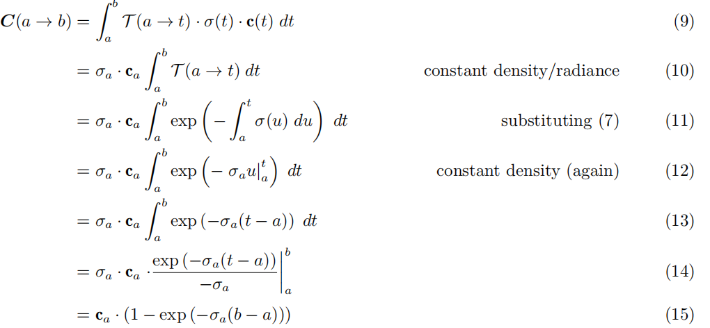

# 【三维重建】NeRF原理+代码讲解
     
杀生丸学AI   已于 2023-08-07 21:42:29
  
本文链接：[https://blog.csdn.net/qq_45752541/article/details/130072505](https://blog.csdn.net/qq_45752541/article/details/130072505) 

 
#### 文章目录

-   [一、技术原理] 
-   -   1.概览
    -   2.基于神经辐射场（Neural Radiance Field）的体素渲染算法
    -   3.体素渲染算法
    -   4.位置信息编码（Positional encoding） 
    -   5.多层级体素采样 
-   [二、代码讲解] 
-   -   [1.数据读入] 
    -   [2.创建nerf] 

    -   -   [1.计算焦距focal与其他设置]
        -   [2.从图像（像素）到射线（起点O和方向d）]
        -   [3.get_embedder获取位置编码] 
        -   [3.创建nerf] 
    -   [3.渲染过程]
    -   -   [1.图像坐标-\>真实世界坐标]
        -   [2.渲染]
    -   [4.计算损失] 
-   [三、几何学原理]
 
------------------------------------------------------------------------


[NeRF](https://so.csdn.net/so/search?q=NeRF&spm=1001.2101.3001.7020)是2020年ECCV论文，任务是**做新视角的合成**，是借助[深度学习] 技术的计算机图形学任务，实现了摄像机级别的逼真的新视图合成。仅仅2年时间，相关work和论文就已经大量涌现。

**论文**：https://arxiv.org/abs/2003.08934
**TensorFlow代码**：https://github.com/bmild/nerf
**PyToch代码**：https://github.com/yenchenlin/nerf-pytorch
**官方数据**;；https://drive.google.com/drive/folders/128yBriW1IG_3NJ5Rp7APSTZsJqdJdfc1
` 提示：具体的NeRF专用数据格式代码，请见本博主的博客【3D点云】数据入门`

## 一、技术原理

> 以下为原理简述，更多物理公式推导请看最后一章

### 1.概览

NeRF可以简要概括为用一个MLP（全连层而非卷积，加上激活层）神经网络去隐式地学习一个静态3D场景，实现复杂场景的任意新视角合成（渲染）。

为了训练网络，针对一个**静态场景**，**需要提供包含大量相机参数已知的图片的训练集，以及图片对应的相机所处3D坐标，相机朝向**（2D，但实际使用3D单位向量表示方向）。

使用多视角的数据进行训练，空间中目标位置具有更高的密度和更准确的颜色，促使[神经网络]预测一个连续性更好的场景模型。

以任意的相机位置+朝向作为输入，经过训练好的神经网络进行体绘制（Volume Rendering），即可以从渲染出图片结果了。


### 2.基于神经辐射场（Neural Radiance Field）的体素渲染[算法] 

NeRF[函数] 是将一个连续的场景表示为一个输入为5D向量的函数，包括一个空间点的3D坐标位置x=(x,y,z)，以及方向(θ,ϕ)；

输出为视角相关的该3D点的颜色c=(r,g,b)，和对应位置（体素）的密度σ。

实践中，用3D笛卡尔单位向量d来表示方向，因此这个神经网络可以写作：ϜΘ:(x,d)→(c,σ)。
 
在具体的实现中，x首先输入到MLP网络中，并输出σ和一个256维的中间特征，中间特征和d再一起输入到额外的全连接层（128维）中预测颜色，如下图所示。 


因此，**体素密度只和空间位置有关**，**而颜色则与空间位置以及观察的视角有关**。基于view
dependent
的颜色预测，能够得到不同视角下不同的光照效果。输入数据x和d都先经过了位置信息编码（Position
Encoding），即γ(∙)。

输入的位置
x，指的是由各个相机原点出发的，经过对应图像中每一像素引起的射线，所经过的采样点位置，方向指该射线的方向；输出的体素密度σ和方向相关的颜色值c=(r,g,b)，共同决定了该位置在后续渲染时所提供的对渲染结果的数值；上述网络中的权重/参数，为所有的像素射线共享。

### 3.体素渲染算法

**传统体渲染方法**

**体素密度σ(x**)可以被理解为，一条穿过空间的射线，在x处被一个无穷小的粒子终止的概率，这个概率是可微分的，可以将其近似理解为**该位置点的不透明度**。

相机沿着特定方向进行观测，其观测射线上的点是连续的，则该相机成像平面上对应的像素颜色，可以理解为由对应射线经过的点的颜色积分得到。

将一条射线的原点标记为o，射线方向（即相机视角）标记为d，则可将射线表示为r(t)=o+td，t的近端和远端边界分别为tn和tf。 


可将这条射线的颜色，用积分的方式表示为：\
\
其中，T(t)表示的是射线从tn到t这一段的累计透明度，即，该射线从tn到t都没有因击中任何粒子而被停下的概率，具体写作：\
\
在连续的辐射场中，针对任意视角进行渲染，就需要对穿过目标虚拟相机的每个像素的射线，求取上述颜色积分，从而得到每个像素的颜色，渲染出该视角下的成像图片

**分段近似渲染方法**

用NeRF难以估计射线上的连续点，这就对其进行分段近似。作者提出了一种**分层抽样（Stratified
Sampling）的方法**：首先将射线需要积分的区域\[tn,tf\]均匀分为N份，再在每个小区域进行均匀随机采样。则以上预测颜色C（r）的积分，可以简化为求和的形式：\
\
其中，δ~i~
为两个近邻采样点之间的距离，此处T(t)改写作：\
这种**从所有采样点的(ci,σi)集合求和得到射线渲染颜色的方法也是可微分**的，并且可以简化为传统的透明度混合算法，其中alpha值
α~i~=1−exp(−σ~i~δ~i~)。

### []{#t5}[]{#4Positional_encoding_71}4.位置信息编码（Positional encoding）

由于神经网络难以学习到高频信息，直接将**位置**和**视角**作为网络的输入，渲染效果分辨率低；使用位置信息编码的方式**将输入先映射到高频**可以有效地解决这个问题。

γ用于将输入映射到高维空间中，论文中使用的是正余弦周期函数的形式：\
\
位置和视角先进行归一化，到\[-1,1\]之间。对3D位置， γ(x)设置
L=10；视角信息γ(d)设置 L=4。

### 5.多层级体素采样

NeRF的渲染策略是对相机出发的每条射线都进行N个采样，将颜色加权的求和，得到该射线颜色。**由于大量的对渲染没有贡献的空的或被遮挡的区域仍要进行采样计算，这样占用了过多的计算量**。

作者设计了一种"coarse to
fine"的多层级体素采样方法，同时优化coarse和fine两个网络：首先，使用分层采样的方法**均匀采集较为稀疏的Nc个点**，在这些采样点上计算coarse网络的渲染结果，改写前述的离散求和函数：\
\
w~i~=T~i~\*(1-exp(−σ~i~δ~i~))，对w~i~进行归一化：\
归一化后的 ω~i~
可以看作是沿着射线方向的概率密度函数，如下左图所示。通过这个概率密度函数，我们可以粗略地得到射线方向上物体的分布情况：\
\
随后，基于粗采样得到的概率密度函数，使用逆变换采样（inverse transform
sampling）方法，再采样出Nf个密集点，如上右图。**这个方法可以从包含更多可见内容的区域中得到更多的采样点**，然后在Nc+Nf的采样点集合上，计算refine网络的渲染结果。

针对不同的场景，需要进行独立训练一个NeRF。**训练损失**直接定义为：渲染结果的颜色，与图像真实像素值dL2损失。**同时优化coarse和fine网络**。

## 二、代码讲解

` 提示：具体的NeRF专用数据格式代码，请见本博主的博客【3D点云】数据入门`\
项目提供了8个数据集，这里介绍其中两个：。\
nerf_synthetic 其中包含lego小车不同角度的图片和Camera 的位姿


第二个是 nerf_llff_data\
这个数据集是由真实照片制作的，Camera的位姿是由colmap生成的，位姿保存在poses_bound.npy的文件中\
` 提示：具体的NeRF专用数据格式代码，请见本博主的博客【3D点云】数据入门`

### 1.数据读入

load_blender_data函数：将所有图片和相机的位姿读入imgs和pos数组中。

```python
if args.dataset_type == 'blender':
        # 一般使用合成数据集
        images, poses, render_poses, hwf, i_split = load_blender_data(args.datadir, args.half_res, args.testskip)
            # images:(138,400,400,4) poses每帧的位姿(138,4,4)  render_poses 40个新视角的内参(40,4,4)  
            #hwf 宽高焦距[400,400,555]               train[0,1,2,...99], val[100,101,...112],,test[113,114,..137]
```

json文件中记录位姿部分的内容：

```json
    "camera_angle_x": 0.6911112070083618,
    "frames": [
        {
            "file_path": "./test/r_0",
            "rotation": 0.031415926535897934,
            "transform_matrix": [
                [
                    -0.9999999403953552,
                    0.0,
                    0.0,
                    0.0
                ],
                [
                    0.0,
                    -0.7341099977493286,
                    0.6790305972099304,
                    2.737260103225708
                ],
                [
                    0.0,
                    0.6790306568145752,
                    0.7341098785400391,
                    2.959291696548462
                ],
                [
                    0.0,
                    0.0,
                    0.0,
                    1.0
                ]
            ]
        },
```

函数 load_blender_data：

```py
def load_blender_data(basedir, half_res=False, testskip=1):
    splits = ['train', 'val', 'test']
    metas = {}
    for s in splits:
        with open(os.path.join(basedir, 'transforms_{}.json'.format(s)), 'r') as fp:
            metas[s] = json.load(fp)
    # meta包含训练，验证，测试三个key值。以val为例，metas['val']包含'camera_angle_x', 'frames'两个key；
   # camera_angle_x为一个角度(如0.691)，frames包含若干帧，每个帧内含有文件名、rotation、transform_matrix(4*4矩阵)三个key


# 1.循环训练、验证、测试
for s in splits:
        meta = metas[s]

        for frame in meta['frames'][::skip]:                         # train时skip=1，否则为8
            fname = os.path.join(basedir, frame['file_path'] + '.png')
            imgs.append(imageio.imread(fname))                                                # 0~255
            poses.append(np.array(frame['transform_matrix']))                    # 4*4
        imgs = (np.array(imgs) / 255.).astype(np.float32) #  (RGBA)            #（100，800，800，4）
        poses = np.array(poses).astype(np.float32)                                           # (100,4,4)
        counts.append(counts[-1] + imgs.shape[0])                                          # [0,100]
        all_imgs.append(imgs)
        all_poses.append(poses)

    i_split = [np.arange(counts[i], counts[i+1]) for i in range(3)]     # train[0,1,2,...99], val[100,101,...112],,test[113,114,..137]
    
    imgs = np.concatenate(all_imgs, 0)                 # (138,800,800,4)
    poses = np.concatenate(all_poses, 0)              # (138,4,4)
    
    H, W = imgs[0].shape[:2]
    camera_angle_x = float(meta['camera_angle_x'])                   # test 中的 0.694
    focal = .5 * W / np.tan(.5 * camera_angle_x)                                # camera焦距
    
    render_poses = torch.stack([pose_spherical(angle, -30.0, 4.0) for angle in np.linspace(-180,180,40+1)[:-1]], 0)    
    # 将360度分成40等份，每个角度一个（4*4）内参矩阵

# 2.  根据性能决定是否降低分辨率：True 时，宽、高、焦距减半
    if half_res:                       
        H = H//2  ，W = W//2，  focal = focal/2.

        imgs_half_res = np.zeros((imgs.shape[0], H, W, 4))
        for i, img in enumerate(imgs):
            imgs_half_res[i] = cv2.resize(img, (W, H), interpolation=cv2.INTER_AREA)
        imgs = imgs_half_res

    return imgs, poses, render_poses, [H, W, focal], i_split        
     # （138,400,400,4)（138,4,4) (40,4,4)  [400,400,555]               train[0,1,2,...99], val[100,101,...112],,test[113,114,..137]
```

### 2.创建nerf

#### 1.计算焦距focal与其他设置

```python
focal = .5 * W / np.tan(.5 * camera_angle_x)
```

NeRF渲染过程中需要在一条 Camera Ray
上采集采样点，累计获得像素点的RGB值。采样时要确定图片的远近位置，near和far的值为距离相机中心的距离（由于blender是合成资料集，near和far是在制作资料集时设定好的）：

```python
# 1.设置参数
near = 2.
far = 6.
K = np.array([  [focal, 0, 0.5*W],    [0, focal, 0.5*H],      [0, 0, 1] ])           # 根据焦距，创建相机内参矩阵
1234AI写代码
```

**背景设为白色 white_bkgd**

imges 维度：(n \* h \* w \* 4)， n
为帧数，wh宽高，RGB做了0～1归一化，第四维透明度（0代表有物体，1代表没有物体）。

```py
parser.add_argument("--white_bkgd", action='store_true',
                    help='set to render synthetic data on a white bkgd (always use for dvoxels)')
                    
# True时把透明的背景变成白色，返回一个 RGB 图像：
if args.white_bkgd:
    images = images[...,:3]*images[...,-1:] + (1.-images[...,-1:])
```

#### 2.从图像（像素）到射线（起点O和方向d）

就一个函数 get_rays：**输入是某张图像的
宽高、焦距和外参**(3\*4矩阵，用于从相机到世界坐标)，**输出是图像所有像素所在的射线**：

```py
def get_rays(H, W, focal, c2w):
    i, j = torch.meshgrid(torch.linspace(0, W - 1, W),
                          torch.linspace(0, H - 1, H))  # pytorch's meshgrid has indexing='ij'
    i = i.t()
    j = j.t()
    # 下面是计算每个像素点，到图像中心（W/2， 和/2）的距离，并除以焦距138
    dirs = torch.stack([(i - W * .5) / focal, -(j - H * .5) / focal, -torch.ones_like(i)], -1)  # (378,504,3)

    # 将射线方向，利用c2w矩阵 从相机坐标系，旋转到世界坐标系
    rays_d = torch.sum(dirs[..., np.newaxis, :] * c2w[:3, :3],
                       -1)                  # dot product, equals to: [c2w.dot(dir) for dir in dirs]
    # Translate camera frame's origin to the world frame. It is the origin of all rays.
    rays_o = c2w[:3, -1].expand(rays_d.shape)            # c2w矩阵的最后一列，就是射线原点
    return rays_o, rays_d 
```

####  3.get_embedder 获取位置编码

论文讲到PE的必要性：直接输入5D坐标，网路uo难以捕捉高频信息，使重建图像模糊。通过
γ
函数将数据升至高维后再输入网络，可以增加输出的细节（输入升至高维可以增大两个点的距离）。\
论文中对3D位置坐标和两个视角坐标的编码方式不同：对于3D位置坐标，论文中使用频率为10的PE，对于2D坐标，论文中使用频率为4的PE。

下面是参数配置的代码，以及生成PE过程（对应上一章第四节）：

```py
parser.add_argument("--multires", type=int, default=10,
                    help='log2 of max freq for positional encoding (3D location)')
parser.add_argument("--multires_views", type=int, default=4,
                    help='log2 of max freq for positional encoding (2D direction)')

 freq_bands = 2.**torch.linspace(0., max_freq=9, steps=10)                              # [2^0,  2^1,  2^2,  2^3,  ... 2^9] =  [1, 2, 4, 8,... 256, 512]
 freq_bands_angle =     2.**torch.linspace(0., max_freq=3, steps=4)               # [1,2,4,8]
 #  freq_bands:  [2^0,  2^1,  2^2,  2^3,  ... 2^9]  =  [1, 2, 4, 8,... 256, 512]

for freq in freq_bands:
    for p_fn in self.kwargs['periodic_fns']:
        embed_fns.append(lambda x, p_fn=p_fn, freq=freq : p_fn(x * freq))  # sin(x * 2^n)  参考位置编码公式
        out_dim += d  # 每使用子编码公式一次就要把输出维度加 3，因为每个待编码的位置维度是 3
                    
self.embed_fns = embed_fns  # 相当于是一个编码公式列表
self.out_dim = out_dim
        
def embed(self, inputs):
# 对各个输入进行编码，给定一个输入，使用编码列表中的公式分别对他编码
    return torch.cat([fn(inputs) for fn in self.embed_fns], -1)
 
```

####  3.创建nerf

```py
output_ch = 5 
skips = [4]
model = NeRF(D=args.netdepth=8,      W=args.netwidth=256,   input_ch=63,       output_ch=5,  
             skips=4,   input_ch_views=27, use_viewdirs=True).to(device)        # 输入5维坐标经过位置编码成63
```

model共分为5部分，网络如下。forward过程在后面渲染部分\


```
  (pts_linears): ModuleList(
    (0): Linear(in_features=63, out_features=256, bias=True)
    (1): Linear(in_features=256, out_features=256, bias=True)
    (2): Linear(in_features=256, out_features=256, bias=True)
    (3): Linear(in_features=256, out_features=256, bias=True)
    (4): Linear(in_features=256, out_features=256, bias=True)
    (5): Linear(in_features=319, out_features=256, bias=True)
    (6): Linear(in_features=256, out_features=256, bias=True)
    (7): Linear(in_features=256, out_features=256, bias=True)
  )
  (views_linears): ModuleList(
    (0): Linear(in_features=283, out_features=128, bias=True)
  )
  (feature_linear): Linear(in_features=256, out_features=256, bias=True)
  (alpha_linear): Linear(in_features=256, out_features=1, bias=True)
  (rgb_linear): Linear(in_features=128, out_features=3, bias=True)
) 
```

由于args.N_importance=64 \>
0，则网络**需要第二次精细采样，需创建一个相同NeRF结构，作为精细网络。**

```py
N_rand = args.N_rand           # 射线数，即采样点数量 512
use_batching = not args.no_batching # False，每次训练都会从同一帧中获取不同的Batchsize个像素
```

### 3.渲染过程

#### 1.图像坐标-\>真实世界坐标

1.  迭代循环20000个iter

```py
for i in trange(start, N_iters):
       img_i = np.random.choice(i_train)                              # 从1～100序列中，随机选一帧图像
       target = images[img_i]
       target = torch.Tensor(target).to(device)                     # （400，400，1）
       pose = poses[img_i, :3,:4]                                                 # （3，4）相机位姿 
```

2.  get_rays函数，将 camera 坐标和 c2w(camera to world)
    矩阵相乘，得到真实世界下的坐标（c2w就是每一帧的位姿pose）：\
    

```py
rays_o, rays_d = get_rays(H, W, K, torch.Tensor(pose))   # rays_o: (3) --> (H=400,400,3)  rays_d: (400,400,3)
```

```py
def get_rays(H, W, K, c2w):
    i, j = torch.meshgrid(torch.linspace(0, W-1, W), torch.linspace(0, H-1, H))  # pytorch's meshgrid has indexing='ij'    c2w位姿
    i = i.t()
    j = j.t()
    dirs = torch.stack([(i-K[0][2])/K[0][0], -(j-K[1][2])/K[1][1], -torch.ones_like(i)], -1)                # (400,400,3) :   [ (-200-200)/555,-1 ]
    # Rotate ray directions from camera frame to the world frame
    rays_d = torch.sum(dirs[..., np.newaxis, :] * c2w[:3,:3], -1)  # dot product: [c2w.dot(dir) for dir in dirs]            (400,400,3,3)->(400,400,3)
    # Translate camera frame's origin to the world frame. It is the origin of all rays.
    rays_o = c2w[:3,-1].expand(rays_d.shape)                # 所有射线的原点相同，只需要广播：(3) --> (400,400,3)
    return rays_o, rays_d
```

4.  图像上选取射线（ (400,400,3) -\> (512,3) ）

400\*400个点中，随机选512个点的射线和原点(上步已计算出来，都是三维坐标)

```py
    if i < args.precrop_iters:
        # 迭代次数少于250，只从图像中心的一部分采样射线
        dH = int(H//2 * args.precrop_frac)            # 400/4 = 100
        dW = int(W//2 * args.precrop_frac)           # 400/4 = 100
        coords = torch.stack(    torch.meshgrid(   torch.linspace(H//2 - dH, H//2 + dH - 1, 2*dH), 
                                                                                            torch.linspace(W//2 - dW, W//2 + dW - 1, 2*dW) ), -1)                                                                     
        # 维度 (200,200,2) : 100~299的密集坐标

    else:
            coords = torch.stack(torch.meshgrid(torch.linspace(0, H-1, H), torch.linspace(0, W-1, W)), -1)  # (H, W, 2)


    coords = torch.reshape(coords, [-1,2])                                                   # (H * W, 2)    (40000,2)
    select_inds = np.random.choice(coords.shape[0], size=[N_rand], replace=False)         # (N_rand=512) 40000个密集点，采样512根射线
    select_coords = coords[select_inds].long()  # (N_rand, 2)
    rays_o = rays_o[select_coords[:, 0], select_coords[:, 1]]                # (N_rand, 3)
    rays_d = rays_d[select_coords[:, 0], select_coords[:, 1]]                # (N_rand, 3)
    batch_rays = torch.stack([rays_o, rays_d], 0)                                      # (2, N_rand=512, 3)
    target_s = target[select_coords[:, 0], select_coords[:, 1]]               #   (400,400,3)中选出）512，3）
```

#### 2.渲染

下面是主函数：

```py
rgb, disp, acc, extras = render(H, W, K,  chunk=32768 ,   rays=batch_rays,    verbose=i < 10,
                                                             retraw=True,    **render_kwargs_train)
```

```py
def render(H, W, K, chunk=1024*32, rays=None, c2w=None, ndc=True,   near=0., far=1.,
                        use_viewdirs=False, c2w_staticcam=None,  **kwargs):

        rays_o, rays_d = rays

    if use_viewdirs:
        viewdirs = rays_d
        viewdirs = viewdirs / torch.norm(viewdirs, dim=-1, keepdim=True)          # 射线方向做归一化 （512，3）
        viewdirs = torch.reshape(viewdirs, [-1,3]).float()

    sh = rays_d.shape # [..., 3]

    near, far = near * torch.ones_like(rays_d[...,:1]), far * torch.ones_like(rays_d[...,:1])         # (512,1):[2]   (512,1):[6]
    rays = torch.cat([rays_o, rays_d, near, far], -1)                                                           #  (512,8)
    if use_viewdirs:
        rays = torch.cat([rays, viewdirs], -1)                                                                            #  (512,11)

    all_ret = batchify_rays(rays, chunk, **kwargs)
    # 内部循环若干次，每次渲染一定数量的ray。具体展开函数为：
               ret = render_rays(rays_flat[i:i+chunk], **kwargs)
               
```

**01. 512条射线上采样32个点，并得到其真实坐标。**

```py
def render_rays(ray_batch,    network_fn,  network_query_fn,  N_samples, retraw=False,
                                                 lindisp=False,    perturb=0.,  N_importance=0,  network_fine=None,
                                                  white_bkgd=False,   raw_noise_std=0.,  verbose=False,  pytest=False):                    
                     
rays_o, rays_d = ray_batch[:,0:3], ray_batch[:,3:6]           # [N_rays, 3] each
viewdirs = ray_batch[:,-3:] if ray_batch.shape[-1] > 8 else None
bounds = torch.reshape(ray_batch[...,6:8], [-1,1,2])         #  near/far  (512,1,2)
near, far = bounds[...,0], bounds[...,1] # [-1,1]                      # 2, 6

t_vals = torch.linspace(0., 1., steps=N_samples)                # 0~1之间，间隔采样32个点
z_vals = near * (1.-t_vals) + far * (t_vals)                                # (512, 32)  2～6之间，间隔取32个点
z_vals = z_vals.expand([N_rays, N_samples])                      # (512, 32)

 if perturb > 0.:                                                                                    # perturb= 1.0
        mids = .5 * (z_vals[...,1:] + z_vals[...,:-1])                            # (512, 31)              [2.06, ...5.9]
        upper = torch.cat([mids, z_vals[...,-1:]], -1)                      # (512, 32)              [2.06, ...6.0]
        lower = torch.cat([z_vals[...,:1], mids], -1)                        # (512, 32)              [2.00, ...5.9]
        t_rand = torch.rand(z_vals.shape)                                      # (512,32) ： 0~1之间随机数

z_vals = lower + (upper - lower) * t_rand                        # (512, 32)  添加扰动后：每条ray扰动不同，例如 [2.03, 2.12,... 5.97] 

pts = rays_o[...,None,:] + rays_d[...,None,:] * z_vals[...,:,None] # [N_rays=512 , N_samples=32 , 3]      得到 32个采样点的3维坐标
#  (512,1,3)*(512,32,1) = (512,32,3) 
```

**02. 分别对坐标xyz、角度θα做位置编码。**

```py
raw = network_query_fn(pts, viewdirs, network_fn)
def run_network(inputs, viewdirs, fn, embed_fn, embeddirs_fn, netchunk=1024*64):

inputs_flat = torch.reshape(inputs, [-1, inputs.shape[-1]])      # (512,32,3) --> (16384,3)
embedded = embed_fn(inputs_flat)                                                  #(16384,3) --> (16384,63)
if viewdirs is not None:
    input_dirs = viewdirs[:,None].expand(inputs.shape)             # (512,32,3) 来源于ray_d(512,3)
    input_dirs_flat = torch.reshape(input_dirs, [-1, input_dirs.shape[-1]])     # (16384,3)
    embedded_dirs = embeddirs_fn(input_dirs_flat)                   # (16384,27)
    embedded = torch.cat([embedded, embedded_dirs], -1)
```

**03. NeRF 网络的前向过程**


batchify_rays:按照Batchsize的大小进行训练需要可能会out of memory。\
每次训练1024个像素点，训练网络输入1024\*256（192个fine采样点，64个coarse采样点），需要分成批次。

```py
outputs_flat = batchify(fn, netchunk)(embedded)
# 1024 * 256的数据切成1024 * 32子块进行训练，返回值也是按子块返回

forward：
# 网络输入：位置input_pts（16384, 63）, 角度input_views（16384, 27）16384=512*32

h = input_pts
 for i, l in enumerate(self.pts_linears):
        h = self.pts_linears[i](h)
        h = F.relu(h)
        if i in self.skips:         
            h = torch.cat([input_pts, h], -1)        # 网络在第四层时，输出与原始输入拼接为319维

if self.use_viewdirs:
    alpha = self.alpha_linear(h)
    feature = self.feature_linear(h)
    h = torch.cat([feature, input_views], -1)
        
    for i, l in enumerate(self.views_linears):
        h = self.views_linears[i](h)
        h = F.relu(h)

    rgb = self.rgb_linear(h)
    outputs = torch.cat([rgb, alpha], -1)              # (16384, 4)
    outputs = torch.reshape(outputs, list(inputs.shape[:-1]) + [outputs_flat.shape[-1]])
    # (512, 32, 4) 
```

**04. 网络输出结果后处理：raw2outputs**

网络**输出为每条射线上，每个点的RGB值与强度值**，需要将其转化为每条射线的颜色值，和深度图。

```py
rgb_map, disp_map, acc_map, weights, depth_map = raw2outputs(raw, z_vals, rays_d, raw_noise_std, white_bkgd, pytest=pytest)

def raw2outputs(raw, z_vals, rays_d, raw_noise_std=0, white_bkgd=False, pytest=False):
    """
    参数:
        raw: [射线数, 线上采样点数, 4]. 模型输出结果
        z_vals: [射线数, 线上采样点数 ]. 射线上采样距离
        rays_d: [射线数, 3]. 每条射线方向
    返回值:
        rgb_map: [射线数, 3]. Estimated RGB color of a ray.
        disp_map: [射线数]. Disparity map视差图. Inverse of depth map.
        acc_map: [射线数]. 射线上权重之和.
        weights: [射线数, 线上采样点数]. 每个采样点权重.
        depth_map: [射线数]. 估计的到目标距离.
    """
    raw2alpha = lambda raw, dists, act_fn=F.relu: 1.-torch.exp(-act_fn(raw)*dists)       # 预定义求解α的公式

    dists = z_vals[...,1:] - z_vals[...,:-1]                                                                                                  # 每个采样点之间的距离 （512，31）
    dists = torch.cat([dists, torch.Tensor([1e10]).expand(dists[...,:1].shape)], -1)             # [N_rays, N_samples] 最后补一维

    dists = dists * torch.norm(rays_d[...,None,:], dim=-1)                                                            # (512,32)

    rgb = torch.sigmoid(raw[...,:3])  # [N_rays, N_samples, 3]
    noise = 0.
    alpha = raw2alpha(raw[...,3] + noise, dists)  # [N_rays, N_samples]
    # weights = alpha * tf.math.cumprod(1.-alpha + 1e-10, -1, exclusive=True)
    weights = alpha * torch.cumprod(torch.cat([torch.ones((alpha.shape[0], 1)), 1.-alpha + 1e-10], -1), -1)[:, :-1]     # （512，32）
    rgb_map = torch.sum(weights[...,None] * rgb, -2)  # [N_rays, 3]

    depth_map = torch.sum(weights * z_vals, -1)                     # （512，32）--> (512)
    disp_map = 1./torch.max(1e-10 * torch.ones_like(depth_map), depth_map / torch.sum(weights, -1))
    acc_map = torch.sum(weights, -1)                                            # (512)

    if white_bkgd:
        rgb_map = rgb_map + (1.-acc_map[...,None])

    return rgb_map, disp_map, acc_map, weights, depth_map 
```

**05. 精细采样**\
这步是对射线上weights比较大的区域，进行二次精细采样。\


> 采样数**N_importance**=64，**z_vals_mid**是采样间隔:\[2.02,2.12,...5.89\]

> 根据上步计算的weights累乘，得到新的z_vals(从\[2.01,...5.98\]到\[2.48,4.48\]).非重要部分，可以掠过以下代码

```py
z_samples = sample_pdf(z_vals_mid, weights[...,1:-1], N_importance, det=(perturb==0.), pytest=pytest)
#  返回值z_samples 维度 (512,64)

def sample_pdf(bins, weights, N_samples, det=False, pytest=False):
    # Get pdf
    weights = weights + 1e-5                                                                   # (512,30 )           
    pdf = weights / torch.sum(weights, -1, keepdim=True)       # (512,30)
    cdf = torch.cumsum(pdf, -1)                                                            # (512,30 ) 
    cdf = torch.cat([torch.zeros_like(cdf[...,:1]), cdf], -1)  # (batch, len(bins))

    # 随机采样
    u = torch.rand(list(cdf.shape[:-1]) + [N_samples])             # (512,64)
    u = u.contiguous()
    inds = torch.searchsorted(cdf, u, right=True)                              # (512,64) 在累乘的weithts中，找到比u(512,64)大的值的索引
    below = torch.max(torch.zeros_like(inds-1), inds-1)
    above = torch.min((cdf.shape[-1]-1) * torch.ones_like(inds), inds)
    inds_g = torch.stack([below, above], -1)  # (batch, N_samples, 2)

    # cdf_g = tf.gather(cdf, inds_g, axis=-1, batch_dims=len(inds_g.shape)-2)
    # bins_g = tf.gather(bins, inds_g, axis=-1, batch_dims=len(inds_g.shape)-2)
    matched_shape = [inds_g.shape[0], inds_g.shape[1], cdf.shape[-1]]           # (512,64,31)
    cdf_g = torch.gather(cdf.unsqueeze(1).expand(matched_shape), 2, inds_g)          # (512,64,2)  在31个采样点累乘weights中，找到inds_g的那个weitht
    bins_g = torch.gather(bins.unsqueeze(1).expand(matched_shape), 2, inds_g)     # (512,64,2)  

    denom = (cdf_g[...,1]-cdf_g[...,0])                                                                                                # (512，64)
    denom = torch.where(denom<1e-5, torch.ones_like(denom), denom)                     # (512，64) 小于0.0001就选1，大于则取denom
    t = (u-cdf_g[...,0])/denom
    samples = bins_g[...,0] + t * (bins_g[...,1]-bins_g[...,0])                                                      # (512,64)

    return samples 
```

**重新对采样点进行渲染，步骤同上(可忽略)**

```py
z_vals, _ = torch.sort(torch.cat([z_vals, z_samples], -1), -1)
pts = rays_o[...,None,:] + rays_d[...,None,:] * z_vals[...,:,None] # [N_rays, N_samples + N_importance, 3]

run_fn = network_fn if network_fine is None else network_fine
raw = network_query_fn(pts, viewdirs, run_fn)

rgb_map, disp_map, acc_map, weights, depth_map = raw2outputs(raw, z_vals, rays_d, raw_noise_std, white_bkgd, pytest=pytest)
```

###  4.计算损失

```py
        img_loss = img2mse(rgb, target_s)    # mse loss
        trans = extras['raw'][...,-1]
        loss = img_loss
        psnr = mse2psnr(img_loss)                   # 5.2564
 
```

##  三、几何学原理

神经辐射场采用简单的体渲染作为一种方法，通过利用可见性的概率概念来使得通过射线-三角形\
交叉点变得可微分。这是通过假设场景由一团发光粒子组成的来实现的，这些粒子的密度在空间中发\
生变化
（在基于物理的渲染的术语中，这将被描述为具有吸收和发射但没有散射的体积。\
在下文中，为了说明简单，并且不失一般性，我们**假设发射的光不作为观察方向的函数而改变**。

**透射率.** 设密度场为 σ(x)，其中 x∈R^3^ 表示射线撞击粒子的微分似然度
（即在行进无穷小的距离时撞\
击粒子的概率）。我们重新参数化沿给定射线 r=(o, d) 的密度作为标量函数
σ(t)，因为沿射线的任何点\
x 都可以写成 r(t)=o+td。密度与透射率函数 T (t)
密切相关，它表示光线在区间 \[0, t) 上传播而没有击\
中任何粒子的概率。那么当走差分步 dt 时 没有撞击粒子的概率 T (t+dt) 等于
T (t)，即射线到达 t 的\
可能性，乘以 (1 − dt · σ(t))，在该步骤中没有击中任何东西的概率：\
\
这是一个经典的微分方程，可以如下求解:\


其中我们将 T (a → b) 定义为光线从距离 a 到 b
而没有碰到粒子的概率，这与前面的符号 T (t) =\
T (0 → t)。

**概率解释.** 请注意，我们也可以将函数 1 − T (t)（通常称为
不透明度）解释为累积分布函数 （CDF），\
表示射线确实在某个时间之前到达距离 t 并击中粒子的概率。那么 T (t) · σ(t)
是相应的概率密度函数\
(PDF)，给出了射线在距离 t 处正好停止的可能性。

**体积渲染**. 我们现在可以计算当光线从 t=0 传播到 D
时体积中的粒子发出的光的预期值，合成在背景\
颜色之上。由于在 t 处停止的概率密度为 T (t) · σ(t)，因此预期颜色为\
\
其中 c~bg~ 是根据残差透射率 T (D)
与前景场景合成的背景色。不失一般性，我们在下文中省略了背景\
术语。

**同质媒体**. 我们可以通过积分计算一些具有恒定颜色 ca 和密度 σa 在射线段
\[a, b\] 上的均匀体积介质的\
颜色：

\
**透射率是乘法**. 请注意，透射率分解如下：

\
这也来自 T 的概率解释，因为射线没有击中 \[a, c\]
内的任何粒子的概率是它没有击中任何粒子的两个\
独立事件的概率的乘积在 \[a, b\] 或 \[b, c\] 内。

**分段常数数据的透射率**.给定一组区间\
在第 n 段内具有恒定密度 σ~n~，并且 t~1~=0 和
δ~n~=t~n+1~−t~n~，透射率等于

\
**分段常数数据的体积渲染**.
结合以上，我们可以通过具有分段常数颜色和密度的介质来评估体绘制积\
分：\
\
这导致来自 NeRF \[3, Eq.3\] 的体绘制方程：


结合恒定的每间隔密度，该恒等式产生与 (24) 相同的表达式.
