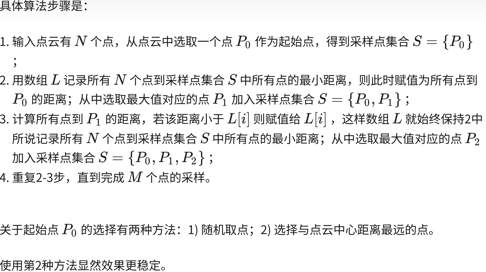

# 1. 下采样在点云处理中的关键作用——以PointNet++为例【初学者无门槛理解版！】

于 2024-12-16 22:40:34 发布
原文链接：https://blog.csdn.net/qq_41889538/article/details/144519585
计算机视觉

## 一、前言
随着3D传感器技术的快速发展，点云数据在计算机视觉、机器人导航、自动驾驶等领域中的应用日益广泛。点云作为一种高效的3D数据表示方式，能够精确地描述物体的几何形状和空间分布。然而，点云数据通常具有高维度和稀疏性的特点，这给后续的处理和分析带来了诸多挑战。为了有效地从点云中提取有用的特征，深度学习模型如PointNet和PointNet++应运而生。
PointNet作为点云处理的开创性工作，通过直接对点进行独立处理并提取全局特征，展示了深度学习在3D数据处理中的潜力。然而，PointNet在捕捉局部几何信息和多尺度特征方面存在不足。为此，PointNet++在PointNet的基础上引入了层次化的特征提取机制，其中下采样（Downsampling）扮演了至关重要的角色。本文将深入探讨下采样在点云处理中的作用，并以PointNet++为例详细说明其在实现层次化特征提取中的重要性

## 二、下采样在点云处理中的作用
2.1 减少数据冗余
点云数据通常包含大量密集且相邻的点，这些点在局部区域内可能传达相似的几何信息。直接处理所有点不仅会导致数据冗余，还会增加计算复杂度。下采样通过选择具有代表性的点，减少了点的数量，从而降低了数据冗余，使模型能够更高效地学习到有意义的特征

形象解释：想象你在绘制一幅森林的图画，每一棵树都是一个点。如果你试图描绘每一片叶子，图画会变得异常复杂且难以辨认。而如果你只画出每棵树的轮廓和主要枝干，整个森林的形状依然清晰可见，同时大大减少了需要处理的细节

2.2 支持层次化特征提取
层次化特征提取是现代深度学习模型的重要特性，它能够在不同的尺度上捕捉数据的多层次信息。下采样在每一层选择关键点，代表更大范围的几何结构，使得后续的网络层能够在更高层次上处理点云数据，逐步构建从局部到全局的特征表示
PointNet++采用层次化的网络结构，通过逐层下采样和特征聚合来构建多层次的点云表示。下采样在每一层选择关键点，代表更大范围的几何结构，使得后续的网络层能够在更高层次上处理点云数据，逐步构建从局部到全局的特征表示。如果不进行下采样，所有层都需要处理整个点云，无法实现这种逐层抽象的过程，导致模型难以捕捉不同尺度的几何信息
如果不进行下采样，所有层都需要处理整个点云，这将导致以下问题：

难以构建多层次结构：每一层都处理相同数量的点，缺乏从局部到全局逐步抽象的过程，导致模型难以捕捉不同尺度的几何信息。
特征混淆：高密度的点云可能导致特征在不同层之间混淆，难以有效区分不同层次的几何结构。
形象解释：分形图案的绘制
想象你在绘制一棵树的图案：
1、第一步（高分辨率）：

你先画出树的每一个细小的枝叶（类似于点云中的所有点）。
这时候，每个细节都被精细地描绘，但整个图案可能显得杂乱且难以把握整体形状。
2、第二步（下采样）：

接下来，你决定简化图案，只保留主要的树干和较粗的主要枝干。
这样，虽然失去了许多细节，但你能够更清晰地看到树的整体结构和主要形态。
3、第三步（进一步下采样）：

最后，你只画出树的轮廓，忽略所有枝干和叶子。
此时，你只关注树的整体形状和主要轮廓，能够轻松地识别出这是一棵树。
这个过程展示了如何通过逐步简化细节来构建从局部到全局的层次化理解

将上述比喻应用到 PointNet++ 上：

1、初始层（高分辨率）：

网络首先处理所有的点（如树的每一个枝叶），提取局部的细节特征。
这些特征反映了点云的细微结构，但处理所有点会导致信息过载和冗余。
2、下采样（中等分辨率）：

通过下采样，网络选择具有代表性的点（类似于保留主要的枝干）。
这些代表性点覆盖了更广泛的区域，帮助网络理解更大范围的结构。
这样，网络能够在更高层次上捕捉到局部区域的整体形状，而不仅仅是细节。
3、进一步下采样（低分辨率）：

继续下采样，选择更少但更具代表性的点（类似于绘制树的轮廓）。
这些点涵盖了整个点云的主要结构，帮助网络理解全局的形状和几何信息。
2.3 扩大感受野
感受野（Receptive Field）指的是网络中某一层的神经元能够感知的输入区域范围。通过下采样，模型在每一层处理的点数减少，但这些点覆盖的空间范围更广，从而扩大了每一层的感受野。这使得网络能够捕捉到更大范围的几何结构，提升整体特征的抽象能力。

没有下采样：每一层都处理所有点，感受野相对较小，难以捕捉到更大范围的几何结构。
有下采样：每次下采样后，处理的点数量减少，但这些点覆盖的空间范围更广。每一层的特征提取基于更大范围的点，从而扩大了感受野，能够捕捉到更高层次的特征。
形象解释：想象你在查看一幅地图

不下采样：你查看每一个小镇的位置，难以理解整个国家的地理布局。
下采样：你每隔几个小镇查看一次，能够更容易地把握整个国家的主要地理特征，如山脉、河流。
进一步下采样：你只查看几个关键城市，快速理解国家的整体形状和主要方向。
通过下采样，PointNet++能够在每一层上覆盖更广泛的区域，捕捉更高层次的特征信息

2.4 避免过拟合和噪声干扰
高密度的点云数据往往包含噪声和细微的变化，过多的点可能导致模型过拟合，难以泛化到新数据。下采样通过选择代表性的点，过滤掉部分噪声和冗余信息，使模型更关注于重要的几何特征，提高了模型的鲁棒性和泛化能力。

形象解释：假设你在学习一门新语言。如果你试图记住每一个单词的所有细微变化，可能会感到非常困难且容易混淆。然而，如果你先学习常用的核心词汇，再逐步扩展到更复杂的表达，学习效果会更好。

2.5 构建多尺度表示
通过逐层下采样，模型能够在不同的尺度上构建点云的多层次表示。例如，初始层处理细节特征，中间层捕捉中等尺度的结构，顶层则关注全局形状。这种多尺度表示使得模型在处理复杂形状和细节丰富的点云时表现更为出色。
举例说明： 积木搭建

第一层：详细描绘每一块积木的位置，捕捉基础细节。
第二层：简化部分细节，构建出主要结构。
第三层：进一步简化，形成整个建筑物的轮廓。
这种逐层构建的过程，使得模型能够从不同尺度上理解和处理点云数据。

## 三、PointNet++中的下采样机制
PointNet++在PointNet的基础上，通过引入层次化的特征提取机制，显著提升了对点云数据的理解能力。下采样在PointNet++中的具体作用和实现如下：

3.1 最远点采样（Farthest Point Sampling, FPS）
PointNet++采用最远点采样算法来选择具有代表性的点。FPS通过迭代选择距离当前已选点集最远的点，确保选出的点在空间上均匀分布。这种方法有效地覆盖了整个点云空间，避免了点的集中分布，提高了特征提取的全面性。
形象解释：想象你在分发水果给一群人。为了确保每个人都能均匀地得到水果，你会尽量选择距离其他人最远的人来分发。这种方法确保了每个人之间的距离尽可能大，避免了集中分布。

3.2 层次化网络结构
PointNet++通过多层次的网络结构逐步下采样和聚合特征。每一层包含以下步骤：

采样：使用FPS选择关键点，减少点的数量。
分组：在每个关键点的局部区域内聚集邻近点，形成局部组。
特征提取：对每个局部组应用PointNet网络，提取局部特征。
特征聚合：将局部特征与关键点的全局特征结合，形成更高层次的特征表示。
形象解释：积木搭建的例子，层次化网络结构就像是在不同高度搭建不同层次的建筑，每一层都基于前一层的基础上进行构建，逐步提升建筑的复杂度和规模

这种层次化的结构使得PointNet++能够在不同尺度上捕捉点云的特征，从而有效地理解复杂的几何形状

3.3 多尺度融合
PointNet++不仅在每一层进行下采样，还在不同尺度上融合特征。通过多层次的特征提取，模型能够结合不同尺度的几何信息，增强特征表达能力。这种多尺度特征融合使得PointNet++在分类、分割等任务中表现出色

形象解释：想象你在绘制一幅复杂的风景画，使用不同的笔刷和颜色来捕捉从远处的山脉到近处的花草。每一种笔刷和颜色代表了不同尺度和细节的信息，通过融合这些信息，整幅画面变得更加丰富和生动

3.4 处理全局和局部特征
下采样不仅减少了点的数量，还帮助模型在不同层次上捕捉全局和局部特征。初始层关注局部细节，中间层捕捉中等尺度的结构，顶层则理解全局形状。这种全局与局部特征的结合，使得PointNet++能够更全面地理解点云数据。

举例说明： 例如，在处理一辆汽车的点云数据时：

初始层：捕捉轮胎的细节，如轮廓和纹理。
中间层：识别车门和车窗的整体形状。
顶层：理解整个汽车的整体轮廓和结构。
这种多层次的特征提取，使得模型能够准确识别和分类复杂的物体。

## 四、不进行下采样的影响
如果PointNet++不进行下采样，将面临以下几个问题：

1、计算复杂度大幅增加
每一层都需要处理所有原始点，导致计算资源消耗显著增加，难以实现深层次的网络结构。例如，处理数百万个点将需要巨大的内存和计算能力，实际应用中难以实现

2、难以实现层次化特征提取
缺乏下采样，网络无法逐层构建多层次的点云表示，难以捕捉不同尺度的几何信息。就像试图在一幅过于详细的地图上同时理解全局和局部特征，容易导致信息混乱。

3、特征冗余和混淆
高密度点云数据中的冗余信息会导致特征提取过程中信息混淆，降低模型的准确性和鲁棒性。模型可能难以区分不同区域的关键特征，导致分类和分割任务的性能下降。

4、泛化能力下降
大量冗余点可能导致模型过拟合，难以在不同形状和复杂度的点云数据上泛化。例如，模型在训练数据上表现良好，但在新环境或新物体上的识别效果不佳

不进行下采样就像试图在一张过于详细的地图上进行导航，既耗时又容易迷失方向。下采样帮助我们简化信息，提取关键特征，使得导航过程更加高效和准确
## 五、总结
下采样在点云处理，特别是在PointNet++这样的深度学习模型中，扮演着至关重要的角色。通过减少点的数量，降低数据冗余，支持层次化特征提取，扩大感受野，避免过拟合和噪声干扰，下采样不仅提升了模型的计算效率，更增强了其特征表达能力和泛化能力。PointNet++通过引入最远点采样和层次化的网络结构，充分利用下采样机制，实现了对点云数据的多尺度理解和高效处理。

通过形象化的解释和具体的例子，我们可以更清晰地理解下采样在点云处理中的重要性。下采样不仅是提升效率的工具，更是实现深层次特征提取和模型性能提升的基础。未来，随着点云数据规模的不断增长和应用场景的日益多样化，下采样技术将在点云处理领域中发挥更加重要的作用
 
                        
======================================================
# 2.算法笔记 | 最远点采样 (FPS, Farthest Point Sampling)

https://zhuanlan.zhihu.com/p/571453439
编辑于 2025-01-27 11:21・福建
最远点采样 (FPS, Farthest Point Sampling) 用于在 N 个点的点云上均匀地采样 M 个点，使这些点可以比较好地表征点云的整体轮廓。

简单概括该算法的思路：在N 个点的点云上迭代的选取 M 个点。每次选取与当前已选取点集合S={P0,P1,...Pi}  中所有点的最小距离最大的点，加入集合 S 。
不难看出，该算法的时间复杂度是 O(NM) 。

具体算法步骤是：

(1)输入点云有 N 个点，从点云中选取一个点 P0 作为起始点，得到采样点集合 
 S={P0}；
(2)用数组 L 记录所有 N 个点到采样点集合S 中所有点的最小距离，则此时赋值为所有点到 P0 的距离；从中选取最大值对应的点 P1 加入采样点集合S= {P0,P1}；
(3)计算所有点到 P1 的距离，若该距离小于L[i] 则赋值给 L[i]，这样数组 就始终保持2中所说记录所有 N 个点到采样点集合S 中所有点的最小距离；从中选取最大值对应的点 P2 加入采样点集合 ；
重复2-3步，直到完成 M 个点的采样。

关于起始点 
 的选择有两种方法：1) 随机取点；2) 选择与点云中心距离最远的点。

使用第2种方法显然效果更稳定。