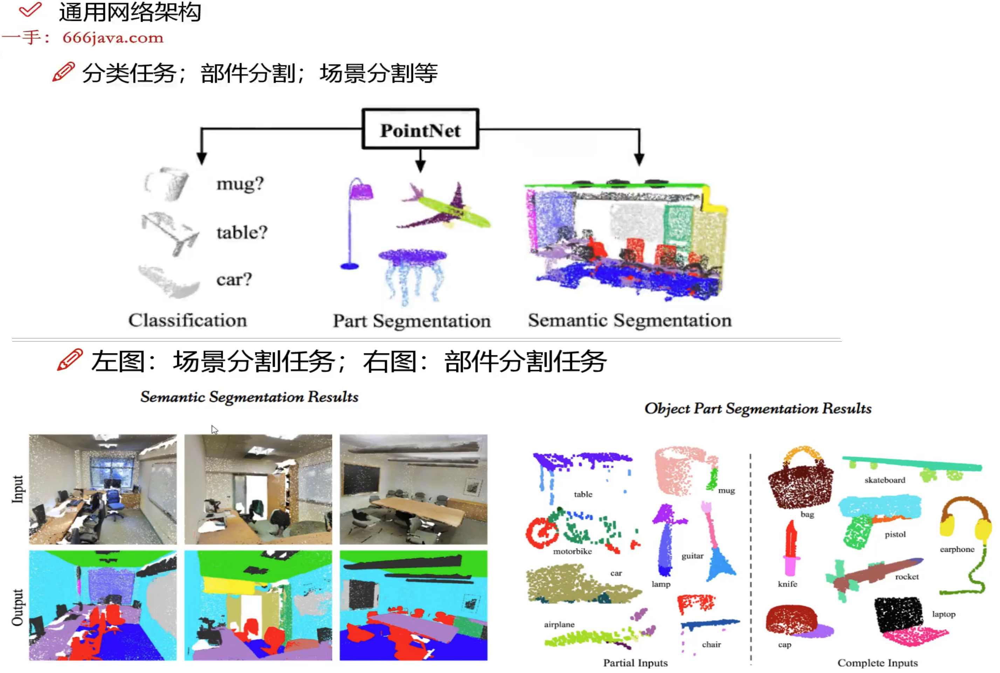
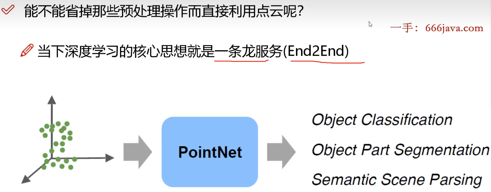
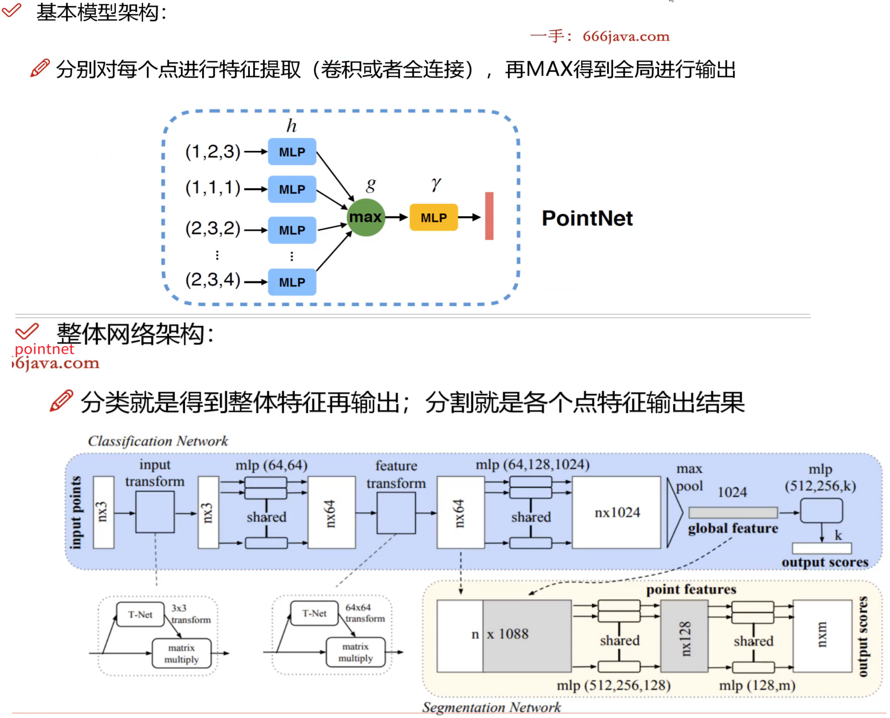
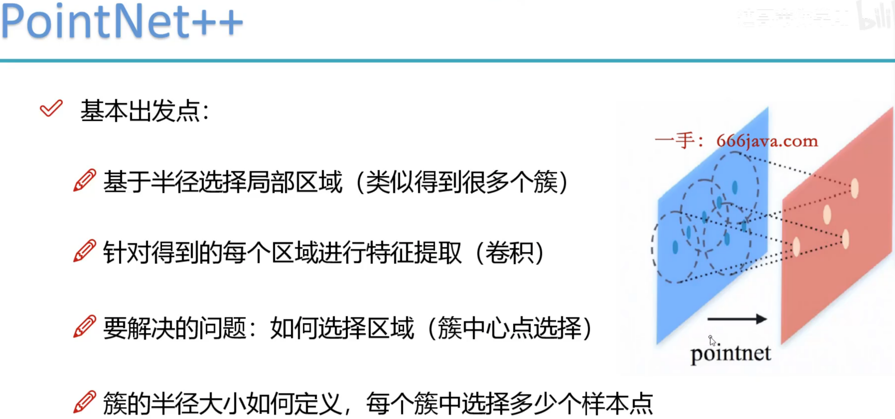
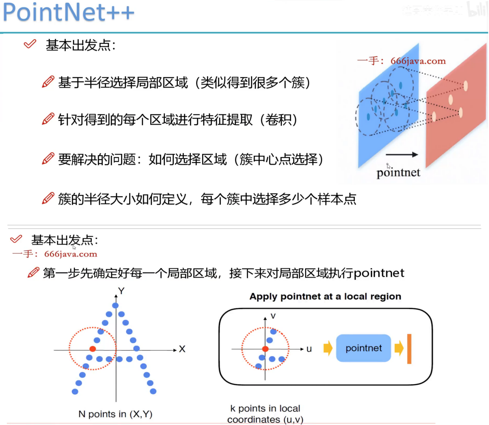
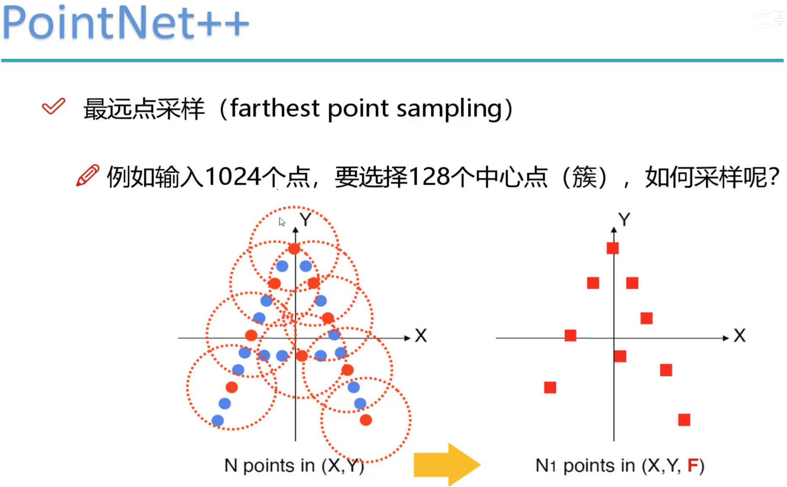

# 1.B站3D点云+三维重建 
2024-06-26 16:38:07
https://www.bilibili.com/video/BV19m421V7iU?spm_id_from=333.788.player.switch&vd_source=4212b105520112daf65694a1e5944e23&p=7

【已完结】这可能是B站目前唯一能将【3D点云+三维重建】讲清楚的教程了，原理解读+实战分析，迪哥一次性全讲明白！—人工智能/神经网络/深度学习
## 1.1-点云数据概述05:47
## 2.2-点云应用领域与发展分析09:27


## 3.3-点云分割任务05:48
## 4.4-点云补全任务06:30
## 5.5-点云检测与配准任务08:37
## 6.6-点云数据特征提取概述与预告 05:12


## 7.1-3D数据应用领域与点云介绍 08:19
## 8.2-点云数据可视化展示05:18

## 9.3-点云数据特性和及要解决的问题11:18



### 点云数据特点：
无序性：只是点而已，排列顺序不影响
近密远疏的特性：扫描与视角不同导致
非结构化数据，直接CNN有点难
要解决的任务就是如何对点云数据进行特征提取
 
 
## 10.4-PointNet算法出发点解读06:29


## 11.5-PointNet算法网络架构解读10:40


 


## 12.6-PointNet升级版算法要解决的问题08:03

### (1).PointNet有哪些问题呢？
> 1. 跟当下主流网络不符，没有局部特征融合，要不自己，要么一个整体
> 2. 没有关系概念，局部样本点之间肯定存在关系的，没有考虑到
> 3. PointNet++版本要从局部入手，多利用局部特征
> 4. 整体思想不变，只不过在特征提取处使用类似图卷积的方式来整合特征

### (2).PointNet的基本出发点
 

## 13.7-最远点采样方法07:02
 

最远点采样 
 

## 14.8-分组Group方法原理解读11:17

### (1)PointNet++ 分组（gouping）
* 例如：输入为batch*1024*6（1024个点，每个点对应3个坐标3个法向量信息）
* 分组后输出为：batch*128*16*6(128个中心点，每个簇16个样本)
* 实际计算时是选择多种半径，多种样本点个数，目的是特征更丰富
* 例如：半径=(0.1，0.2，0.4）；对应簇的样本个数（16，32，64)


## 15.1-项目文件概述05:03
### (1) github.com/yanx27/Pointnet_Pointnet2_pytorch
git clone https://github.com/yanx27/Pointnet_Pointnet2_pytorch.git

https://github.com/yanx27/Pointnet_Pointnet2_pytorch/blob/master/models/pointnet2_cls_msg.py
https://github.com/yanx27/Pointnet_Pointnet2_pytorch/blob/master/test_classification.py


## 16.2-数据读取模块配置08:39


## 17.3-DEBUG解读网络模型架构06:30


18.4-最远点采样介绍05:26
19.5-采样得到中心点08:35
20.6-组区域划分方法06:51
21.7-实现group操作得到各中心簇09:39
22.8-特征提取模块整体流程10:22
23.9-预测结果输出模块09:03
24.10-分类任务总结03:21
25.1-点云补全要解决的问题03:49
26.2-基本解决方案概述06:40
27.3-整体网络概述07:14
28.4-网络计算流程09:37
29.5-输入与计算结果06:50
30.1-数据与项目配置解读08:47
31.2-待补全数据准备方法07:27
32.3-整体框架概述06:51
33.4-MRE特征提取模块08:21
34.5-分层预测输出模块06:05
35.6-补全点云数据07:31
36.7-判别模块05:44
37.1-点云配准任务概述04:31
38.2-配准要完成的目标解读06:00
39.3-训练数据构建1
06:31
40.4-任务基本流程 
05:46
41.5-数据源配置方法
07:48
42.6-参数计算模块解读
05:36
43.7-基于模型预测输出参数
07:05
44.8-特征构建方法分析
09:33
45.9-任务总结
07:44
学完即可就业！一口气刷完3D点云、车道线检测、轨迹预测、三维重建、环境感知、深度估计、关键点特征匹配、行人重识别等八大自动驾驶算法与实战！真的比刷剧还爽！
强推！基于Transformer的自动驾驶BEV纯视觉感知，博士手把手两个小时带你强势理解视觉感知算法-BEVformer！太强了！建议收藏！
【已完结】2025最新3D点云教程：PointNet、PointNet++、PF-Net、GCN算法完全解读！迪哥精讲点云配准、点云分割、点云补全、点云数据处理
【能写进简历的项目】3小时带你掌握基于GNN+Transformer的驾驶轨迹预测，论文解读+项目实战，看完就能跑通！毕设/课设/计算机视觉/图神经网络
【能写进简历的项目】3小时带你掌握基于深度学习的

================================================
# 2. osgdraco是什么，osgearth编译时必需它吗

### **osgDraco 是什么？**

`osgDraco` 是一个基于 **OpenSceneGraph (OSG)** 的插件，用于加载和渲染 **Draco 压缩格式**的 3D 几何数据。

#### **核心信息：**
1. **Draco 压缩格式**：  
   - 由 Google 开发的开源 3D 网格和点云压缩格式，可显著减小文件体积（通常压缩率为 20-50%）。
   - 支持保留几何精度、纹理坐标、法线等属性。

2. **osgDraco 的作用**：  
   - 作为 OSG 的插件（`.osgPlugins-<版本号>/osgdb_draco.so`），允许 OSG 直接加载 `.drc` 文件。
   - 实现 Draco 数据的实时解压缩和渲染，无需预处理。

3. **应用场景**：  
   - 大规模 3D 地形、点云数据的传输和加载（如数字孪生、地理信息系统）。
   - 减少网络带宽需求，提升渲染性能。


### **osgEarth 编译时是否必需 osgDraco？**

**答案：不是必需的，但推荐安装。**

#### **具体说明：**
1. **非必需性**：  
   - osgEarth 本身支持多种地形数据格式（如 GeoTIFF、JPEG、PNG、TIN 等）。
   - 即使不安装 osgDraco，osgEarth 仍能正常编译和运行。

2. **推荐安装的原因**：  
   - **性能优化**：  
     - 若地形数据采用 Draco 压缩（如 Cesium 提供的 3D Tiles 中的 `.b3dm` 或 `.pnts` 可能内嵌 Draco 数据），osgDraco 可加速加载和解压。
   - **格式兼容性**：  
     - 某些高级地形数据源（如大规模点云或高精度网格）可能仅提供 Draco 格式。
   - **未来趋势**：  
     - 随着 WebGL 和 WebGPU 对 Draco 的支持增加，osgDraco 可能成为处理压缩 3D 数据的标准插件。


### **osgEarth 与 osgDraco 的集成步骤**

若需在 osgEarth 中使用 osgDraco，需按以下步骤操作：

1. **安装依赖**：  
   ```bash
   # Ubuntu/Debian
   sudo apt-get install libdraco-dev

   # 或从源码编译 Draco
   git clone https://github.com/google/draco.git
   cd draco && mkdir build && cd build
   cmake .. && make -j8 && sudo make install
   ```

2. **编译 osgDraco**：  
   ```bash
   git clone https://github.com/OpenMW/osgDraco.git
   cd osgDraco && mkdir build && cd build
   cmake -DOSG_DIR=/path/to/osg ..
   make -j8 && sudo make install
   ```

3. **配置 osgEarth**：  
   - 编译 osgEarth 时，确保 CMake 能找到 Draco 和 osgDraco：  
     ```bash
     cmake -DOPENSCENEGRAPH_INCLUDE_DIR=/path/to/osg/include \
           -DOPENSCENEGRAPH_LIBRARY_DIR=/path/to/osg/lib \
           -DDraco_DIR=/path/to/draco/cmake ..
     ```

4. **验证安装**：  
   - 检查 OSG 插件目录是否存在 `osgdb_draco.so`（Linux）或 `osgdb_draco.dll`（Windows）。
   - 测试命令：  
     ```bash
     osgviewer your_model.drc
     ```


### **总结**
- **osgDraco** 是 OSG 的 Draco 格式加载插件，用于优化 3D 数据的压缩和渲染。
- **osgEarth 编译时不需要 osgDraco**，但安装后可增强对 Draco 格式地形数据的支持，提升性能。
- 若项目涉及大规模压缩 3D 数据，建议集成 osgDraco；否则可跳过此依赖。