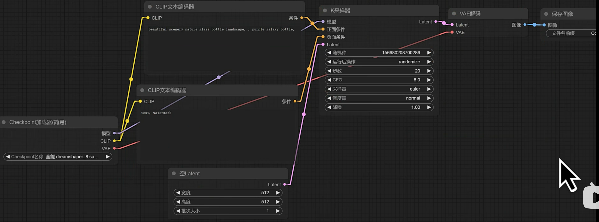

【B站最全ComFyui教程ya】ComFyui工作流教程 从零基础入门到精通ComFyui教程 AI绘画商业变现
2.3万 2025-05-20 16:12:02
https://www.bilibili.com/video/BV1iWJtzuE5o/?spm_id_from=333.788.videopod.episodes&vd_source=4212b105520112daf65694a1e5944e23&p=3

# 01【Comfyui教程】课程概览与ComfyUI的优势
03:04

==================================================
# 02【Comfyui教程】ComfyUI界面导览与最基础生图流程
18:18

==================================================
# 03【Comfyui教程】文生图与背后的运行逻辑
21:43

## K采样器的参数

步数一般设置为 20～～30

CFG越高，和提示词越接近；一般设置为5～8

采样器参数一般设置 为 dpmpp_2m\ dpmpp_2m_sde

调度器一般选择 karras

## 更详细的AI生图流程：
 

## 提示词如何写
提示词先后顺序： 质量词汇 -->主体 --> 氛围词汇

正向提示词：
 

反向提示词 是一些描述 "模糊 混乱，低质量，无细节" 的词汇。
 

 

==================================================
# 04【Comfyui教程】图生图与背后的运行逻辑
12:52

## 图生图工作流

 
## 降噪参数
通过给原图添加噪声 才生成新图；所以如果 降噪参数为0,输出原图；如果降噪参数为1,输出 几乎看不出原图的新图。

在正常的生图流程中，降噪值为0.35-0.6之间，生成的图像就会和原图较为近似；
如果设置是0.6，甚至是0.75级以上，就将赋子AI更多的想象空间。

## 生图质量不好，总是灰蒙蒙的
生图质量不好，色彩不鲜艳，总是灰蒙蒙的。这跟VAE有关。大模型匹配的VAE可能不如社区玩家提供的VAE。

解决方法：添加一个 VAE加载器，选择合适的VAE模型：
 

 ## 图生图的完整逻辑图
 

## 动漫图片转写实风格图片的工作流示例
 

==================================================
# 05【Comfyui教程】 AIGC有关网站与模型下载
11:24
## 5.1国内网站
### 5.1.1.LiblibAI
https://www.liblib.art/ 

ComfyUI的大模型存放路径： ComfyUI/models/checkpoints
         lora存放路径： ComfyUI/models/loras

### 5.1.2. novelai.dev
https://novelai.dev/

#### (1)法术解析功能，

#### (2) AIGodLike开源冒险社区
类似于 LiblibAI的模型广场

### 5.1.3.promlib
https://promlib.com/

## 5.2国外网站

### 5.2.1  civitai.me
https://civitai.me/

### 5.2.2 ComfyUI_IPAdapter_plus
https://github.com/cubiq/ComfyUI_IPAdapter_plus.git

### 5.2.3 huggingface

https://huggingface.co/black-forest-labs/FLUX.1-dev

### 5.2.4 joy-caption
根据输入的图片反推提示词
https://huggingface.co/spaces/fancyfeast/joy-caption-pre-alpha

==================================================
# 06【Comfyui教程】高清放大与细节添加
16:58
https://www.bilibili.com/video/BV1iWJtzuE5o?spm_id_from=333.788.videopod.episodes&vd_source=4212b105520112daf65694a1e5944e23&p=6

==================================================
# 07【Comfyui教程】Controlnet（上）
12:33

==================================================
# 08【Comfyui教程】 Controlnet（下）
12:21

==================================================
# 09【Comfyui教程】IPAdapter
07:44

==================================================
# 10【Comfyui教程】综合案例 老照片修复工作流
16:09