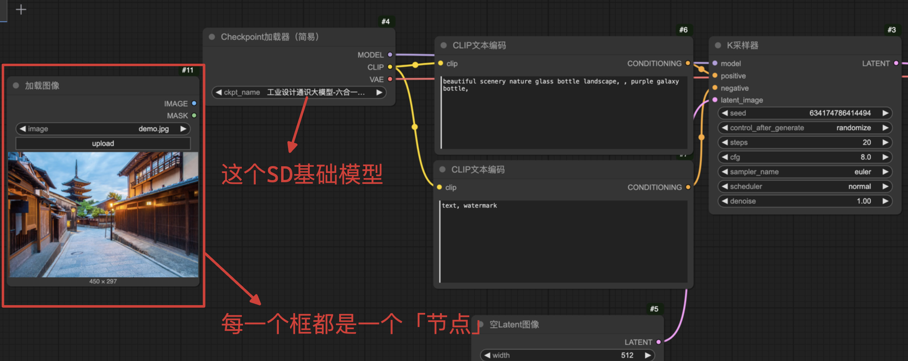
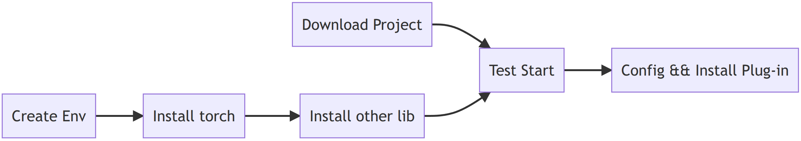
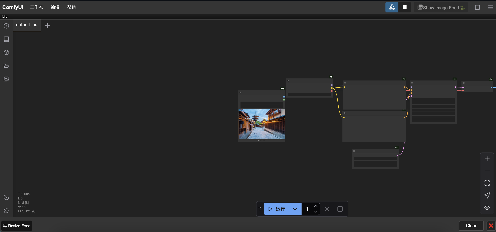

# 开启图像生成之旅：ComfyUI在Ubuntu上的安装全攻略

[北上ing][已于 2025-04-30 16:20:20 修改]  
于 2025-04-30 07:11:49 首次发布
 

本文链接：[https://blog.csdn.net/qq_34348690/article/details/147623498](https://blog.csdn.net/qq_34348690/article/details/147623498) 

> 笔者于2025.4在Ubuntu18.04上搭建ComfyUI，作此记录给大家参考于交流用。
>
> 对于如何增加常用插件，则另起篇章讲述。
>
> 项目原址：[Github 73K](https://github.com/comfyanonymous/ComfyUI)

### 一、ComfyUI

#### #1. ComfyUI的概念

ComfyUI是一个开源的、基于节点的Web应用。它允许用户根据一系列文本提示（Prompt）生成图像。

ComfyUI使用[扩散模型]作为基础模型，并结合ControlNet、Lora和LCM低阶自适应等模型，每个工具都由程序中的一个节点表示。如下图所示：



这是ComfyUI的工作界面，其中每一个大框都是「节点」。

注：本SD基础模型引自合囤科技，[该模型](https://www.liblib.art/modelinfo/50e25a71c40347c783dfe2e90f55c1b3?from=search&versionUuid=39dfb44c5f974bdc9bfadd4ec123717a){rel="nofollow"}开源可供下载。

####  #2. 搭建流程图

 
------------------------------------------------------------------------
 

###  二、开发环境搭建

####  #1.下载项目

```sh
git clone https://github.com/comfyanonymous/ComfyUI.git
mv ComfyUI comfyui 
```

SD权重路径默认为：`models/checkpoints`

VAE文件路径默认为：`models/vae`

插件路径默认为：`custom_nodes`

------------------------------------------------------------------------

#### #2.配置虚拟环境

```sh
conda create -n comfyui python=3.10 # 官方推荐该python3.12但ComfyUI的常用插件不支持
conda activate comfyui

# torch
pip install --pre torch torchvision torchaudio --index-url https://download.pytorch.org/whl/nightly/cu121   # 我用cuda12.1

# other lib
pip install -r requirements.txt 
```

------------------------------------------------------------------------
###  三、测试启动

```sh
# 进入项目根路径
cd comfyui
# 测试启动
python main.py 
```

其他参数解析：（这里仅介绍笔者觉得最常用的）
-   `--listen`：是否进本地可访问
-   `--port`：服务的端口
-   `--preview-method auto`：开启预览VAE解码前的图像

然后访问网页测试效果，如下图所示：



------------------------------------------------------------------------

\

###  四、配置 && Debug

#### #1. 修改模型文件的路径为sdwebui的模型存放地址

将`extra_model_paths.yaml.example`重命名为`extra_model_paths.yaml`以启用该文件，

然后修改文件中的`base_paths`并设置为`stablediffusion-webui`的项目路径。重启服务后出现以下信息就是成功读取：

``` {.set-code-show .prettyprint index="3"}
Adding extra search path checkpoints ../sd-webui/models/Stable-diffusion
Adding extra search path configs ../sd-webui/models/Stable-diffusion
Adding extra search path vae ../sd-webui/models/VAE
Adding extra search path loras ../sd-webui/models/Lora
Adding extra search path loras ../sd-webui/models/LyCORIS
Adding extra search path upscale_models ../sd-webui/models/ESRGAN
Adding extra search path upscale_models ../sd-webui/models/RealESRGAN
Adding extra search path upscale_models ../sd-webui/models/SwinIR
Adding extra search path embeddings ../sd-webui/embeddings
Adding extra search path hypernetworks ../sd-webui/models/hypernetworks
Adding extra search path controlnet ../sd-webui/models/ControlNet
Checkpoint files will always be loaded safely. 
```

------------------------------------------------------------------------

#### #2. 安装插件管理器ComfyUI-Manager（可选）

在`comfyui/custom_nodes`下执行：

``` {.set-code-show .prettyprint index="4"}
git clone https://github.com/ltdrdata/ComfyUI-Manager comfyui-manager 
```

> 该操作需翻墙，否则控制台会跳出`Failed to perform initial fetching 'model-list.json': Cannot connect to host raw.githubusercontent.com:443 ssl:default`

------------------------------------------------------------------------

#### #3. （了解即可）技术细节的浅尝辄止

> 笔者遇到了「ComfyUI资源请求异常」，死磕这块好一会...

与StableDiffusion-webui基于Gradio构建Web应用不同，ComfyUI并不基于Gradio开发。

ComfyUI使用aiohttp完成异步网络服务，如下图所示：

``` {.set-code-show .prettyprint index="5"}
@routes.get("/userdata/{file}")
async def get_userdata(request):
    path = get_user_data_path(request, check_exists=True)
    if not isinstance(path, str):
        return path

    return web.FileResponse(path) 
```

其中：

-   `@routes.get()`就是路由设置，用于匹配url请求；
-   `async def`是匹配成功后调用的函数，它用于处理URL请求。举个栗子：上面这个函数就是在请求获取工作流文件等资源。

> 到底咯，如果这篇文章对您有些许帮助，请帮忙点个赞👍或收个藏📃。您的支持是我继续创作的动力💪！
>
> ------------------------------------------------------------------------
>
> **当暴风雨⚡️过去，你不会记得自己是如何度过的，你甚至不确定暴风雨是否真的结束了。但你已经不再是当初走进暴风雨的那个人了，这就是暴风雨的意义💪。**
 
============================================================
# 2. error"ckpt_name: 'v1-5-pruned-emaonly-fp16.safetensors' not in []"when runing template "image generator"

```sh
Prompt outputs failed validation: 
CheckpointLoaderSimple:
    ◦ Value not in list: ckpt_name: 'v1-5-pruned-emaonly-fp16.safetensors' not in []
```

这个错误表明 ComfyUI 无法找到指定的模型文件 "v1-5-pruned-emaonly-fp16.safetensors"。以下是完整的解决方案：

## 2.1问题原因
> 模型文件缺失：模型文件未放置在正确的目录中 
> 文件名不匹配：在 prompt 中使用的模型文件名与实际文件名不一致
> 路径配置错误：ComfyUI 的模型路径设置不正确

## 2.2解决方案步骤
### 2.2.1.确认模型位置

```sh
# 定位模型目录
find ~ -type d -name "ComfyUI*" 2>/dev/null | grep ComfyUI
cd /path/to/found/ComfyUI_directory

# 检查模型是否存在
ls models/checkpoints/
```
### 2.2.2 正确安装模型

下载 Stable Diffusion v1.5 模型：
```sh
cd models/checkpoints/
wget https://huggingface.co/runwayml/stable-diffusion-v1-5/resolve/main/v1-5-pruned-emaonly.safetensors
```
### 2.2.3 修复模型名称 (关键步骤)

```sh
# 选项1：重命名文件以匹配提示
mv v1-5-pruned-emaonly.safetensors v1-5-pruned-emaonly-fp16.safetensors
# 选项2：修改提示使用正确文件名
# 在JSON/prompt中使用"v1-5-pruned-emaonly.safetensors"
```
### 2.2.4.刷新模型列表

```sh
# 删除缓存后重启 ComfyUI：
rm extra_model_paths.yaml
rm models/checkpoints/*.yaml
```
### 2.2.5验证模型被识别

启动 ComfyUI：
```sh
python main.py --port 7822
```

在启动日志中查找类似内容：
```
Loaded 1 checkpoint:
v1-5-pruned-emaonly.safetensors [7.7GB]
```
## 2.3 替代解决方案
如果无法找到原始模型目录，可以：
### 2.3.1创建符号链接：
```sh
ln -s /path/to/actual/model /path/to/ComfyUI/models/checkpoints/v1-5-pruned-emaonly-fp16.safetensors
```
### 2.3.2手动创建模型列表：
```sh
echo "checkpoints:" > extra_model_paths.yaml
echo "  - name: 'v1-5-pruned-emaonly-fp16.safetensors'" >> extra_model_paths.yaml
echo "    path: '/absolute/path/to/model/file'" >> extra_model_paths.yaml
```

## 2.4验证步骤
在 ComfyUI 中创建一个简单的测试工作流：
```json
"prompt": {

    "3": {
      "inputs": {
        "ckpt_name": "v1-5-pruned-emaonly-fp16.safetensors"
      },
      "class_type": "CheckpointLoaderSimple"
    },
    "4": {
      "inputs": {
        "text": "test",
        "clip": [
          "3",
]

      },
      "class_type": "CLIPTextEncode"
}
```
执行工作流，观察是否成功加载模型

如果仍遇到问题，请提供：
> 1.确切的 ComfyUI 安装路径
> 2.完整的 models/checkpoints 目录内容
> 3.使用的完整提示JSON