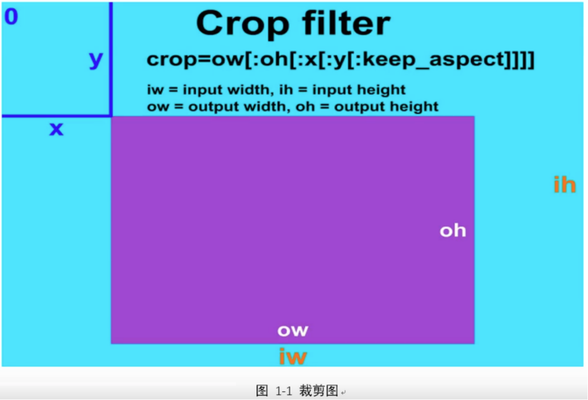

=========================================================
# 1.ffmpeg -i 10-piano-music1.mp4 -vf crop


你提供的 FFmpeg 命令不完整。`-vf crop` 是视频裁剪的参数，但你没有指定具体的裁剪尺寸和位置。`crop` 滤镜的基本语法是：

```
crop=out_w:out_h:x:y
```

其中：
- `out_w`：输出宽度
- `out_h`：输出高度
- `x`：起始 X 坐标（可选，默认为居中）
- `y`：起始 Y 坐标（可选，默认为居中）
 


### 常见用法示例

(1). **裁剪为特定尺寸（从左上角开始）**：
   ```bash
   ffmpeg -i input.mp4 -vf crop=640:480:0:0 output.mp4
   ```

(2). **居中裁剪**（仅指定宽高，自动居中）：
   ```bash
   ffmpeg -i input.mp4 -vf crop=640:480 output.mp4
   ```

(3). **按比例裁剪**（例如裁剪掉左右各 10%）：
   ```bash
   ffmpeg -i input.mp4 -vf crop=in_w*0.8:in_h output.mp4
   ```

(4). **使用变量裁剪**（基于输入尺寸计算）：
   ```bash
   ffmpeg -i input.mp4 -vf crop=in_w-200:in_h-100 output.mp4
   ```

### 建议补充完整命令

如果你想裁剪视频，请提供具体的裁剪需求，例如：
- 你想要的输出尺寸
- 裁剪的起始位置
- 是否需要居中裁剪

例如，如果你想将视频裁剪为 1280x720 并居中：

```bash
ffmpeg -i 10-piano-music1.mp4 -vf crop=1280:720 output.mp4
```

或者，如果你想从左上角开始裁剪一个 640x480 的区域：

```bash
ffmpeg -i 10-piano-music1.mp4 -vf crop=640:480:0:0 output.mp4
```

请根据你的具体需求调整参数。
 
==============================================

# 2. ffmpeg -vf crop
https://www.bilibili.com/video/BV1oY41137AA/?spm_id_from=333.337.search-card.all.click&vd_source=4212b105520112daf65694a1e5944e23
<18-ffmpeg过滤器-裁剪05:19>

 

ffmpeg -i input.jpg -vf crop=iw/3:ih:0:0 out.jp9
ffplay -i input.jpg -vf crop=iw/3:ih:0:0 out.jpg
ffplay -i input.jpg -uf crop=iw/3:ih:iw/3x1:0
ffplay -i input.jpg -uf crop=iw/3:ih:iw/3x2:0

ffplay -i input.mp4 -vf crop=iw/3:ih:iw/3×2:0