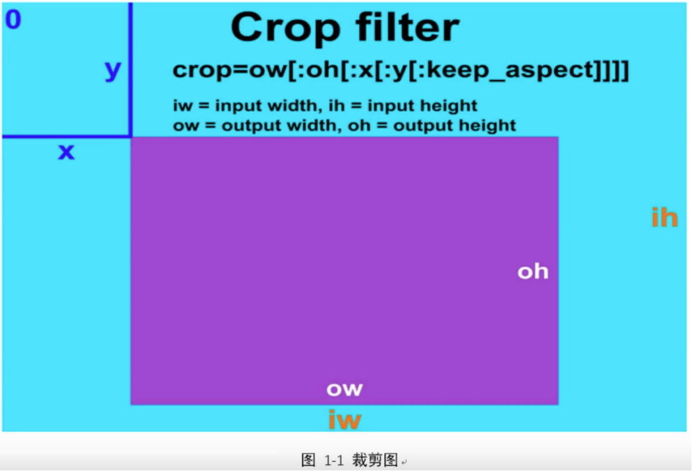

=========================================================
# 1.ffmpeg -i 10-piano-music1.mp4 -vf crop


你提供的 FFmpeg 命令不完整。`-vf crop` 是视频裁剪的参数，但你没有指定具体的裁剪尺寸和位置。`crop` 滤镜的基本语法是：

```
crop=out_w:out_h:x:y
```

其中：
- `out_w`：输出宽度
- `out_h`：输出高度
- `x`：起始 X 坐标（可选，默认为居中）
- `y`：起始 Y 坐标（可选，默认为居中）
 


### 常见用法示例

(1). **裁剪为特定尺寸（从左上角开始）**：
   ```bash
   ffmpeg -i input.mp4 -vf crop=640:480:0:0 output.mp4
   ```

(2). **居中裁剪**（仅指定宽高，自动居中）：
   ```bash
   ffmpeg -i input.mp4 -vf crop=640:480 output.mp4
   ```

(3). **按比例裁剪**（例如裁剪掉左右各 10%）：
   ```bash
   ffmpeg -i input.mp4 -vf crop=in_w*0.8:in_h output.mp4
   ```

(4). **使用变量裁剪**（基于输入尺寸计算）：
   ```bash
   ffmpeg -i input.mp4 -vf crop=in_w-200:in_h-100 output.mp4
   ```

### 建议补充完整命令

如果你想裁剪视频，请提供具体的裁剪需求，例如：
- 你想要的输出尺寸
- 裁剪的起始位置
- 是否需要居中裁剪

例如，如果你想将视频裁剪为 1280x720 并居中：

```bash
ffmpeg -i 10-piano-music1.mp4 -vf crop=1280:720 output.mp4
```

或者，如果你想从左上角开始裁剪一个 640x480 的区域：

```bash
ffmpeg -i 10-piano-music1.mp4 -vf crop=640:480:0:0 output.mp4
```

请根据你的具体需求调整参数。
 
==============================================

# 2. ffmpeg -vf crop
https://www.bilibili.com/video/BV1oY41137AA/?spm_id_from=333.337.search-card.all.click&vd_source=4212b105520112daf65694a1e5944e23
<18-ffmpeg过滤器-裁剪05:19>

 

ffmpeg -i input.jpg -vf crop=iw/3:ih:0:0 out.jp9
ffplay -i input.jpg -vf crop=iw/3:ih:0:0 out.jpg
ffplay -i input.jpg -uf crop=iw/3:ih:iw/3x1:0
ffplay -i input.jpg -uf crop=iw/3:ih:iw/3x2:0

ffplay -i input.mp4 -vf crop=iw/3:ih:iw/3×2:0

=============================================
# 3.ffmpeg 的 concat 协议在默认情况下会拒绝带有绝对路径的文件

## 问题：
```shell
videoList_path=${videos_dir}/video_list.txt
finalVideo_path=${videos_dir}/finalVideo.mp4
ffmpeg -f concat -i ${videoList_path} -codec copy ${finalVideo_path}
```
其中videoList_path的内容如下：
```
file '/home/abner/abner2/zdev/ai/av/a-story-video-maker//v2dat/01-huhua-xiaoshenyi/videos_dir/1-1/outVideo0.mp4'
file '/home/abner/abner2/zdev/ai/av/a-story-video-maker//v2dat/01-huhua-xiaoshenyi/videos_dir/1-2/outVideo0.mp4'
file '/home/abner/abner2/zdev/ai/av/a-story-video-maker//v2dat/01-huhua-xiaoshenyi/videos_dir/1-3/outVideo0.mp4'
file '/home/abner/abner2/zdev/ai/av/a-story-video-maker//v2dat/01-huhua-xiaoshenyi/videos_dir/1-4/outVideo0.mp4'
```

出错
[concat @ 0x56c89f0a17c0] Unsafe file name '/home/abner/abner2/zdev/ai/av/a-story-video-maker//v2dat/01-huhua-xiaoshenyi/videos_dir/1-1/outVideo0.mp4'
[in#0 @ 0x56c89f0a16c0] Error opening input: Operation not permitted
Error opening input file /home/abner/abner2/zdev/ai/av/a-story-video-maker//v2dat/01-huhua-xiaoshenyi/videos_dir/video_list.txt.
Error opening input files: Operation not permitted

## 答案

出现这个错误的核心原因是 **ffmpeg 的 concat 协议在默认情况下会拒绝带有绝对路径的文件**，认为其“不安全”，从而导致“Operation not permitted”。以下是具体的解决方法：


### 解决思路：让 ffmpeg 允许绝对路径，或改用相对路径
#### 方法 1：添加 `-safe 0` 参数（推荐）
在 `ffmpeg` 命令中加入 `-safe 0` 选项，允许 concat 协议使用绝对路径的文件：
```shell
ffmpeg -f concat -safe 0 -i ${videoList_path} -codec copy ${finalVideo_path}
```
- **原理**：`-safe 0` 会禁用 ffmpeg 对文件路径的安全检查，允许列表中使用绝对路径。


#### 方法 2：将视频列表中的路径改为相对路径
如果不想使用 `-safe 0`，可以将 `video_list.txt` 中的绝对路径改为相对于 `video_list.txt` 所在目录的相对路径。  
假设 `video_list.txt` 位于 `${videos_dir}`（即 `/home/abner/abner2/zdev/ai/av/a-story-video-maker//v2dat/01-huhua-xiaoshenyi/videos_dir/`），则修改后的 `video_list.txt` 内容为：
```
file '1-1/outVideo0.mp4'
file '1-2/outVideo0.mp4'
file '1-3/outVideo0.mp4'
file '1-4/outVideo0.mp4'
```
- **原理**：相对路径不涉及“绝对路径安全检查”，ffmpeg 会默认允许。


### 额外说明：路径中的重复斜杠问题
你的路径中存在 `//`（如 `a-story-video-maker//v2dat`），虽然 Linux 会自动忽略重复斜杠（视为单个 `/`），但建议清理为单斜杠，避免潜在问题（可在生成 `video_list.txt` 时处理）。


修改后重新运行命令，即可正常拼接视频。推荐优先使用方法 1，操作更简单直接。