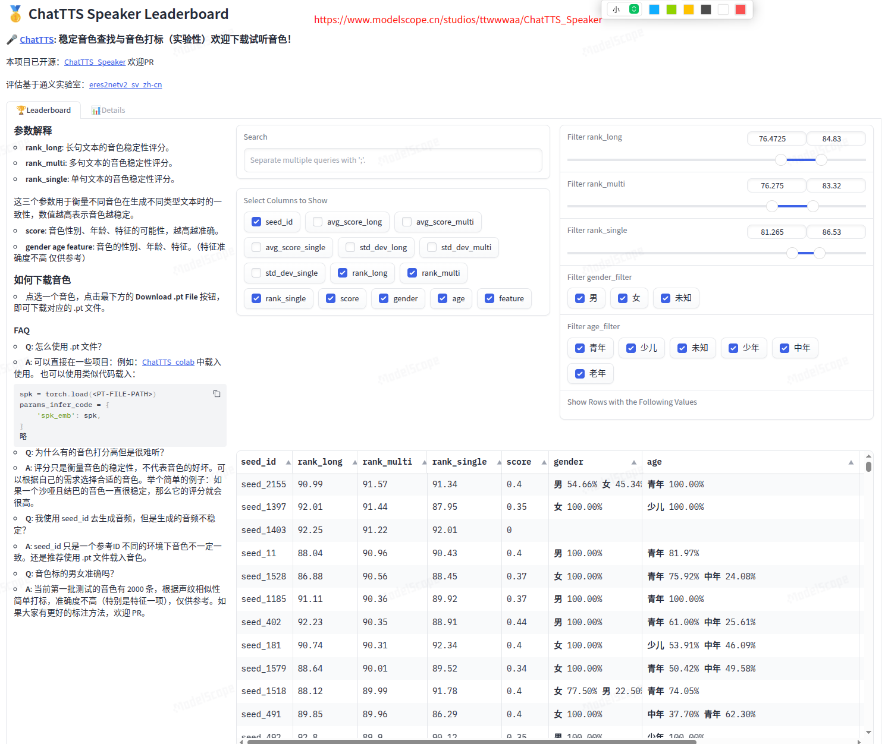

# 0. ChatTTS，模仿人类最像的TTS工具，新增保存固定音色功能
      

 无言以对 发布于 2024-06-02 22:44・IP 属地安徽
 https://zhuanlan.zhihu.com/p/701252969
 AI生成语音成精了，ChatTTS，迄今为止模仿人类最像的开源文本转语音工具使用教程，新增保存固定音色功能，附本地一键整合下载


<figure data-size="normal">

<figcaption>ChatTTS改良版 -
高度逼真的人类情感文本生成语音工具（TTS）本地一键整合包下</figcaption>
</figure>
https://link.zhihu.com/?target=https%3A//deepface.cc/thread-196-1-1.html

## 0.1 先介绍下ChatTTS

和之前发布的 [Fish Speech](https://deepface.cc/thread-196-1-1.html) 类似，都是免费开源的文本生成语音的AI软件，但不同的是，ChatTTS测试下来，对于人类情感语调的模仿，应该是目前开源项目做的最好的，是一款高度接近人类情感、音色、语调的文本语音合成项目。不像其他的语音合成项目，出来的音调很生硬，一听就知道是合成的。ChatTTS的合成效果，高度模仿人类情感，不仔细听，根本分不清是真人还是合成。关键是开源免费。目前只支持中英两种语言。

项目地址：https://github.com/2noise/ChatTTS/

今天分享这个项目的一键整合包，解压即用。显卡要求也不高，4G显存就可以用，但速度慢了些，做自媒体的朋友必备神器。

本地一键整合包下载地址：[deepface.cc/thread-221-1-1.html](https://deepface.cc/thread-221-1-1.html) 
  

这次发布的改良版 WebUI
来自民间大佬，大佬GitHub主页[github.com/craii/ChatTTS_WebUI](https://github.com/craii/ChatTTS_WebUI) 

如上图，新增更多详细的调参设置，最大的亮点就是新增了**固定音色**保存功能，相比之前的版本，每次生成的音色都不固定，听起来有点不协调。这次的版本，可以手动保存固定的音色，方便同一个素材使用相同的音色。

## 0.2 具体使用方法：
 
 
<figure data-size="normal">

<figcaption>ChatTTS改良版 -
高度逼真的人类情感文本生成语音工具（TTS）本地一键整合包下</figcaption>
</figure>

输入文本和参数后，按照上图操作，输入一个音色名称，点保存。

保存音色后，需要重启服务，即关闭任务栏黑色启动窗口，重新运行一键启动即可。

重启进入页面后，就可以在音色下拉列表里找到上一次保存的音色，这样就可以统一音色了。

<figure data-size="normal">

<figcaption>ChatTTS改良版 -
高度逼真的人类情感文本生成语音工具（TTS）本地一键整合包下</figcaption>
</figure>

下面看下官方的介绍

ChatTTS是专门为对话场景设计的文本转语音模型，例如LLM助手对话任务。它支持英文和中文两种语言。最大的模型使用了10万小时以上的中英文数据进行训练。在[HuggingFace]{search-entity="0"}中开源的版本为4万小时训练且未SFT的版本.

## 0.3先说下ChatTTS的主要特点

对话式 TTS:
ChatTTS针对对话式任务进行了优化，实现了自然流畅的语音合成，同时支持多说话人。

细粒度控制:
该模型能够预测和控制细粒度的韵律特征，包括笑声、停顿和插入词等。

更好的韵律:
ChatTTS在韵律方面超越了大部分开源TTS模型。同时提供预训练模型，支持进一步的研究。

## 0.4最后说说使用

使用很简单，双击一键启动，等待自动跳转到WebUI界面，输入一段需要转换的文字，选择男声或者女生，最后点合成即可。

可以在合成文字里加入情感控制词，比如常见的笑声，直接在需要加入笑声的文字后插入\[laugh\]即可。

## 0.5软件使用常见问题 

我要多少显存? Infer的速度是怎么样的?
对于30s的音频, 至少需要4G的显存. 对于4090D, 1s生成约7个字所对应的音频. RTF约0.65.
模型稳定性似乎不够好, 会出现其他说话人或音质很差的现象.
这是自回归模型通常都会出现的问题. 说话人可能会在中间变化, 可能会采样到音质非常差的结果, 这通常难以避免. 可以多采样几次来找到合适的结果.


除了笑声还能控制什么吗? 还能控制其他情感吗?
在现在放出的模型版本中, 只有[laugh]和[uv_break], [lbreak]作为字级别的控制单元. 在未来的版本中我们可能会开源其他情感控制的版本

<=====================================================================>
<=====================================================================>
<------------------------------------------------------------------------------>
<------------------------------------------------------------------------------>
# 1. chattts websites:
(1) https://chattts.com/
(2) https://chattts.in/zh

(3)魔搭社区-ModelScope
https://www.modelscope.cn/studios/ttwwwaa/ChatTTS_Speaker


https://www.modelscope.cn/studios/henjicc/ChatTTS/summary

## 1.1
FireRedTTS \ CosyVoice
<------------------------------------------------------------------------->
<------------------------------------------------------------------------->
<------------------------------------------------------------------------->


# 2.chatTTS文本转语音 实践相关记录

Cici_ovo 于 2024-10-28 10:54:38 发布
原文链接：https://blog.csdn.net/lonelyxxyo/article/details/143285104

这里不再详细介绍chatTTS了，感兴趣的朋友可以自行去搜索一下相关介绍，这篇文章主要想记录一下自己的使用经历，作为经验or教训，方便以后自己学习或使用~

## 2.1文本转语音
以下是直接输入文本转语音的一段代码

```python
import requests  # 导入 requests 库，用于发送 HTTP 请求
 
def getAudio(savename, url):
    """
    下载指定 URL 的音频文件并保存为指定文件名
    :param savename: 保存的文件名
    :param url: 音频文件的下载地址
    """
    response = requests.get(url)  # 发送 GET 请求到指定的 URL
    # 检查请求是否成功
    if response.status_code == 200:  # 如果状态码为 200，表示请求成功
        # 打开本地文件并写入内容
        with open(savename, "wb") as file:  # 以二进制写入模式打开文件
            file.write(response.content)  # 将下载的音频内容写入文件
        print("音频文件已成功下载到本地。")  # 打印成功消息
        return True  # 返回 True，表示下载成功
    else:
        print(f"下载失败，状态码: {response.status_code}")  # 打印错误消息和状态码
        return False  # 返回 False，表示下载失败
 
def chattts(msg, audioname):
    """
    将文本转换为音频并保存为指定文件名
    :param msg: 要转换为音频的文本
    :param audioname: 保存的音频文件名
    """
    res = requests.post('http://192.168.88.251:9966/tts', data={  # 发送 POST 请求
        "text": msg,  # 文本内容
        "prompt": "",  # 提示
        "voice": "3333",  # 语音类型
        "temperature": 0.3,  # 随机性
        "top_p": 0.7,  # 生成控制参数
        "top_k": 20,  # 生成控制参数
        "skip_refine": 0,  # 跳过细化
        "custom_voice": 0,  # 自定义语音
        "is_split": 1  # 是否分割
    })
    print(res.json())  # 打印响应的 JSON 数据
    url = res.json()['url']  # 提取音频文件的 URL
    print(url)  # 打印音频文件的 URL
    getAudio(audioname, url)  # 调用 getAudio 函数，将音频文件保存到本地
 
chattts('文本内容', '1.wav')  # 调用 chattts 函数，传入要转换的文本和保存的音频文件名
```

## 2.2读取txt文档内容，逐行生成wav
然后我这里有一个txt文档，是关于一个视频的台词内容，所以我就想把代码修改一下：让它自己读取这个txt文档，我这个文档内容是一行一行的，每一行也比较简短不超过20个字符，每一行生成一个wav文件，再读取下一行生成...以此类推，并且把这些音频文件都放在一个新文件夹中。

因为尝试过直接让chatTTS生成整个文档内容，结果生成失败了，具体失败原因还未探究

以下是示例代码 
```python
import requests  # 导入 requests 库，用于发送 HTTP 请求
import os  # 导入 os 模块，用于处理文件和目录
 
def getAudio(savename, url):
    """
    下载指定 URL 的音频文件并保存为指定文件名
    :param savename: 保存的文件名
    :param url: 音频文件的下载地址
    """
    response = requests.get(url)  # 发送 GET 请求到指定的 URL
    if response.status_code == 200:  # 检查请求是否成功
        with open(savename, "wb") as file:  # 以二进制写入模式打开文件
            file.write(response.content)  # 将下载的音频内容写入文件
        print(f"音频文件 {savename} 已成功下载到本地。")  # 打印成功消息
        return True  # 返回 True，表示下载成功
    else:
        print(f"下载失败，状态码: {response.status_code}")  # 打印错误消息和状态码
        return False  # 返回 False，表示下载失败
 
def chattts(msg, audioname):
    """
    将文本转换为音频并保存为指定文件名
    :param msg: 要转换为音频的文本
    :param audioname: 保存的音频文件名
    """
    res = requests.post('http://192.168.88.251:9966/tts', data={  # 发送 POST 请求到 TTS 服务
        "text": msg,  # 文本内容
        "prompt": "",  # 提示
        "voice": "3333",  # 语音类型
        "temperature": 0.3,  # 随机性
        "top_p": 0.7,  # 生成控制参数
        "top_k": 20,  # 生成控制参数
        "skip_refine": 0,  # 跳过细化
        "custom_voice": 0,  # 自定义语音
        "is_split": 1  # 是否分割
    })
    
    if res.status_code == 200:  # 检查请求是否成功
        print(res.json())  # 打印响应的 JSON 数据
        url = res.json().get('url')  # 提取音频文件的 URL
        if url:  # 如果 URL 存在
            getAudio(audioname, url)  # 调用 getAudio 函数，将音频文件保存到本地
        else:
            print("未能获取音频文件的 URL。")  # 如果 URL 不存在，打印错误消息
    else:
        print(f"请求失败，状态码: {res.status_code}")  # 打印请求失败的状态码
 
def process_subtitles(file_path, output_dir):
    """
    处理字幕文件，将每行文本转换为音频文件
    :param file_path: 字幕文件的路径
    :param output_dir: 输出音频文件的目录
    """
    os.makedirs(output_dir, exist_ok=True)  # 创建输出目录，如果不存在
    with open(file_path, 'r', encoding='utf-8') as file:  # 打开字幕文件
        lines = file.readlines()  # 读取所有行
        
    for index, line in enumerate(lines):  # 遍历每行
        line = line.strip()  # 去除行首尾空白字符
        if line:  # 确保行不为空
            audioname = f'{output_dir}/line_{index + 1}.wav'  # 生成音频文件名
            chattts(line, audioname)  # 调用 chattts 函数，将文本转换为音频
 
# 主函数
if __name__ == "__main__":
    input_file = 'Subtitlesn.txt'  # 指定输入字幕文件路径
    output_folder = 'output_wav_files'  # 指定输出文件夹
    process_subtitles(input_file, output_folder)  # 调用 process_subtitles 函数处理字幕文件
```

最后这个文件夹以及生成的音频也是成功被生成

## 2.3实践合成wav文件效果较差（改进/解决中...）
然后就得想办法，把这些音频文件合成一个音频文件，通过以下代码，导致合成的音频顺序比较乱

```python
from pydub import AudioSegment  # 从 pydub 库导入 AudioSegment，用于处理音频文件
import os  # 导入 os 模块，用于处理文件和目录
 
# 设置文件夹路径
folder_path = 'output_wav_files'  # 定义包含 WAV 文件的文件夹路径
output_file = 'combined.wav'  # 定义合成后输出的音频文件名
 
# 初始化一个空的音频段
combined = AudioSegment.empty()  # 创建一个空的 AudioSegment 对象，用于合成音频
 
# 遍历文件夹中的所有 WAV 文件
for file in os.listdir(folder_path):  # 获取文件夹中所有文件的列表
    if file.endswith('.wav'):  # 检查文件是否以 .wav 结尾
        file_path = os.path.join(folder_path, file)  # 生成完整的文件路径
        audio_segment = AudioSegment.from_wav(file_path)  # 从 WAV 文件创建 AudioSegment 对象
        combined += audio_segment  # 将当前音频段合成到 combined 对象中
 
# 导出合成后的音频
combined.export(output_file, format='wav')  # 将合成后的音频导出为指定的 WAV 文件
```
暂时实践经历就做到这，后续有更好的解决办法会再次记录~