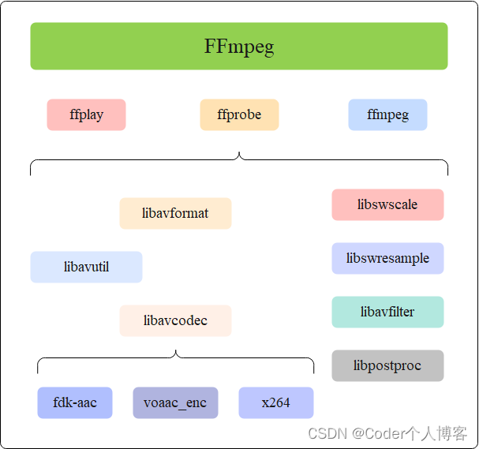
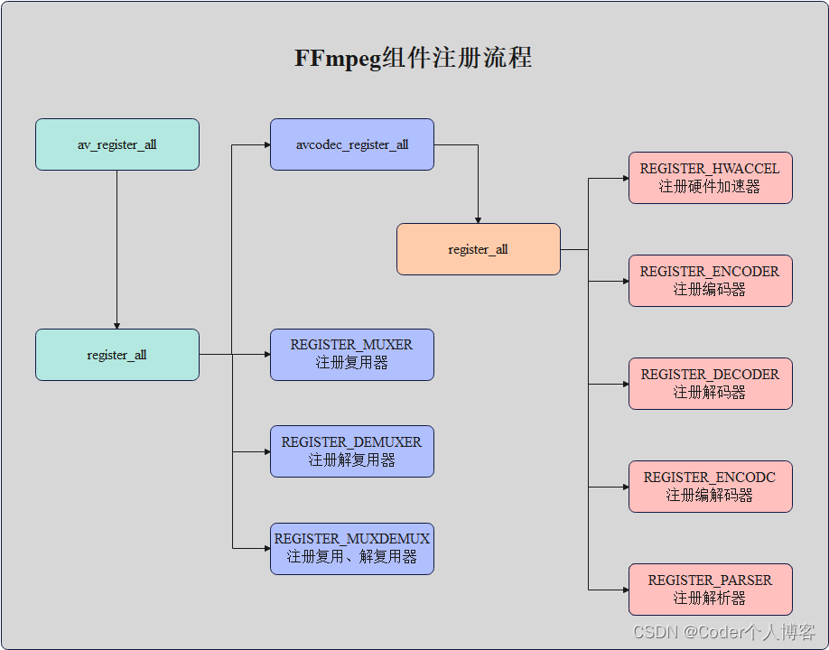
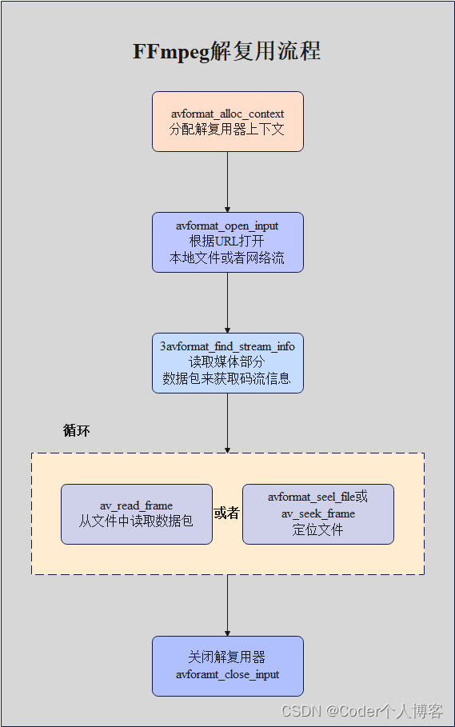
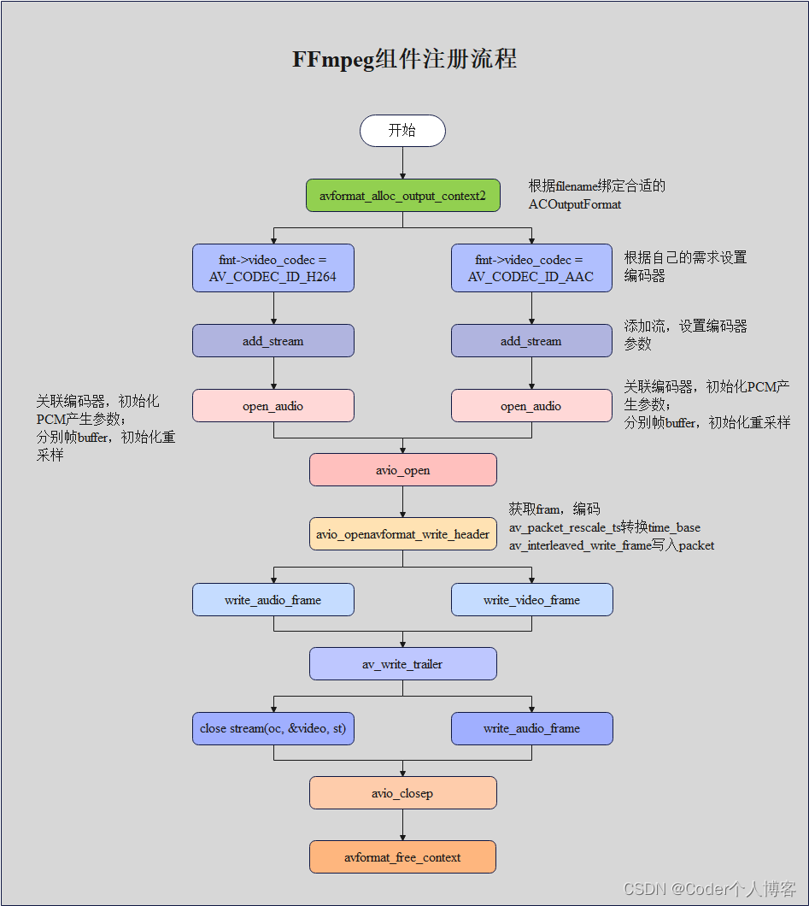
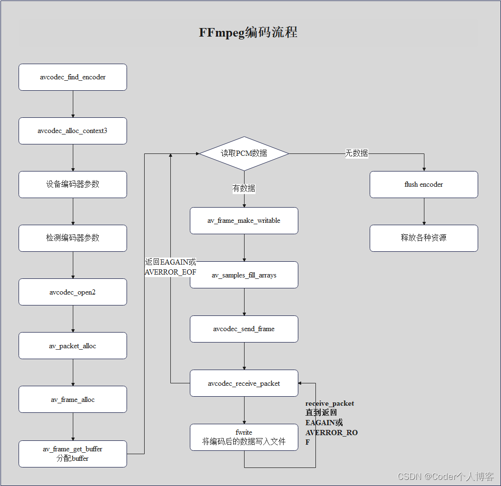
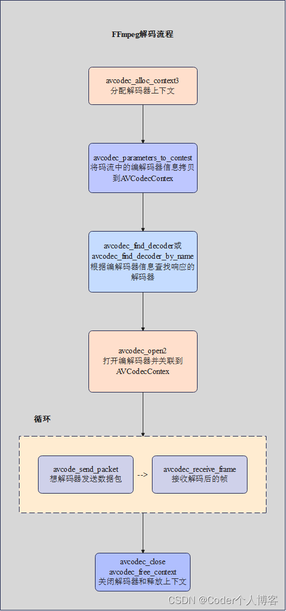
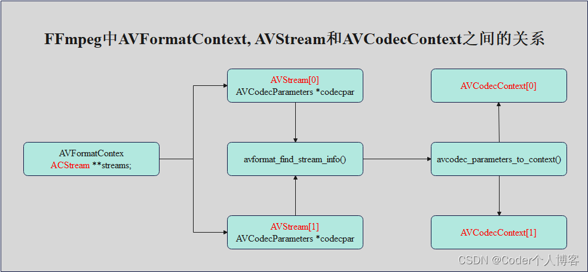
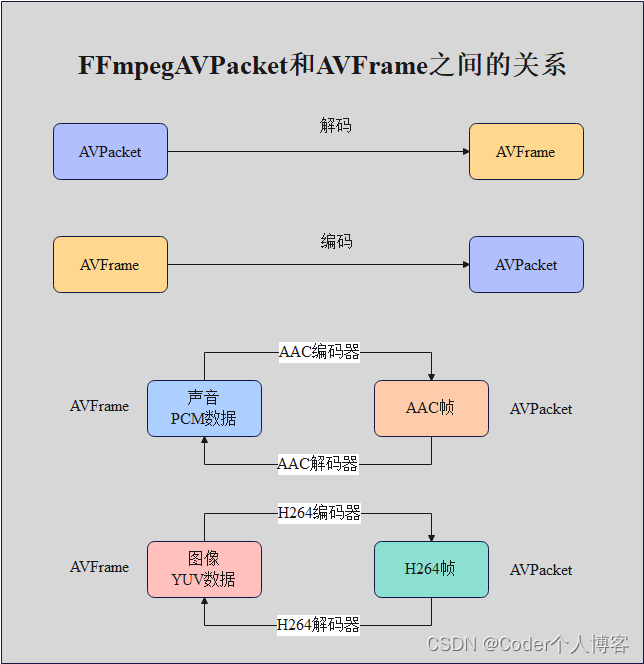

# FFmpeg架构全面分析 

Coder个人博客 已于 2023-07-24 08:40:04 

https://blog.csdn.net/code_lyb/article/details/131400834

#### 文章目录

> - 一、简介 
> 
> - 二、源码获取及编译
> 
> -   - 2.1、源码获取
>     - 2.2、编译安装
> 
> - 三、架构及流程分析
> 
> -   - 3.1、整体架构
>     - 3.2、音视频播放流程 
>     - 3.3、组件注册流程 
>     - 3.4、解复用流程 
>     - 3.5、解封装流程 
>     - 3.6、编码流程 
>     - 3.7、解码流程 
> 
> -  四、重点数据结构分析 
> 
> -   -   4.1、重点数据结构 
> 
>     -   -   4.1.1、AVFormatContext 
>         -   4.1.2、Demuxer 
>         -   4.1.3、AVOutputFormat muxer 
>         -   4.1.4、AVStream 
>         -   4.1.5、AVCodec
>         -   4.1.6、AVPacket
>         -   4.1.7、AVFrame
> 
>     -   4.2、重点数据结构之间的关系
> 
>     -   -  4.2.1、AVFormatContext和AVInputFormat之间的关系
>         -  4.2.2、AVCodecContext和AVCodec之间的关系
>         -  4.2.3、AVFormatContext、AVStream和AVCodecContext之间的关系
>         -  4.2.4、AVPacket和AVFrame之间的关系
 

------------------------------------------------------------------------

  **团队博客:** [**汽车电子社区**](https://bbs.csdn.net/forums/automotive-electronics)

------------------------------------------------------------------------

## 一、简介

  它的官网为：https://ffmpeg.org/ ，由Fabrice Bellard（法国著名[程序员] Born in 1972）于2000年发起创建的开源项目。该人是个牛人，在很多领域都有很大的贡献。

  FFmpeg是多媒体领域的万能工具。只要涉及音视频领域的处理，基本上没有它做不了的事情！通俗点讲，从视频录制、视频编辑再到播放，它都能做！

  最近比较火的抖音，还有国内的一些视频点播厂商，像爱奇艺、腾讯视频、优酷视频，还有播放器，像QQ影音、暴风影音等，都离不开它！否则非常痛苦！为什么呢？

  因为又要招一大帮人来把多媒体领域内的基础工具（音视频编解码器、文件格式和协议库、滤镜库等等）实现掉。

## 二、源码获取及编译

### 2.1、源码获取

```sh
git clone https://github.com/FFmpeg/FFmpeg.git
```
```
正克隆到 'FFmpeg'...
remote: Enumerating objects: 694571, done.
remote: Counting objects: 100% (234/234), done.
remote: Compressing objects: 100% (96/96), done.
remote: Total 694571 (delta 141), reused 226 (delta 138), pack-reused 694337
接收对象中: 100% (694571/694571), 348.75 MiB | 798.00 KiB/s, 完成.
处理 delta 中: 100% (545422/545422), 完成.
123456789
```

### 2.2、编译安装

(1)、执行X86下需执行：./configure \--disable-x86asm命令进行配置\
(2)、执行make -j16命令进行编译。\
(3)、执行sudo make install命令进行安装。

  执行过程中会有如下内容输出：

```
xxx@xxx:~/workspace/learn/FFmpeg/FFmpeg$ ./configure --disable-x86asm
install prefix            /usr/local
source path               .
C compiler                gcc
C library                 glibc
ARCH                      x86 (generic)
big-endian                no
runtime cpu detection     yes
standalone assembly       no
x86 assembler             nasm
MMX enabled               yes
MMXEXT enabled            yes
3DNow! enabled            yes
3DNow! extended enabled   yes
SSE enabled               yes
SSSE3 enabled             yes
AESNI enabled             yes
AVX enabled               yes
AVX2 enabled              yes
AVX-512 enabled           yes
AVX-512ICL enabled        yes
XOP enabled               yes
FMA3 enabled              yes
FMA4 enabled              yes
i686 features enabled     yes
CMOV is fast              yes
EBX available             yes
EBP available             yes
debug symbols             yes
strip symbols             yes
optimize for size         no
optimizations             yes
static                    yes
shared                    no
postprocessing support    no
network support           yes
threading support         pthreads
safe bitstream reader     yes
texi2html enabled         no
perl enabled              yes
pod2man enabled           yes
makeinfo enabled          yes
makeinfo supports HTML    yes
xmllint enabled           yes
pseudocolor             split

Enabled bsfs:
aac_adtstoasc           dts2pts                 filter_units            hevc_mp4toannexb        mp3_header_decompress   pcm_rechunk             trace_headers
av1_frame_merge         dump_extradata          h264_metadata           imx_dump_header         mpeg2_metadata          pgs_frame_merge         truehd_core
av1_frame_split         dv_error_marker         h264_mp4toannexb        media100_to_mjpegb      mpeg4_unpack_bframes    prores_metadata         vp9_metadata
av1_metadata            eac3_core               h264_redundant_pps      mjpeg2jpeg              noise                   remove_extradata        vp9_raw_reorder
chomp                   evc_frame_merge         hapqa_extract           mjpega_dump_header      null                    setts                   vp9_superframe
dca_core                extract_extradata       hevc_metadata           mov2textsub             opus_metadata           text2movsub             vp9_superframe_split

Enabled indevs:
alsa                    fbdev                   lavfi                   oss                     v4l2                    xcbgrab

Enabled outdevs:
alsa                    fbdev                   oss                     v4l2

License: LGPL version 2.1 or later
12345678910111213141516171819202122232425262728293031323334353637383940414243444546474849505152535455565758596061
```

  4、执行ffmpeg -version命令查看版本信息

``` {.set-code-show .prettyprint index="2"}
xxx@xxx:~/workspace/learn/FFmpeg/FFmpeg$ ffmpeg -version
ffmpeg version N-111280-gd51b0580e4 Copyright (c) 2000-2023 the FFmpeg developers
built with gcc 7 (Ubuntu 7.5.0-3ubuntu1~18.04)
configuration: --disable-x86asm
libavutil      58. 13.101 / 58. 13.101
libavcodec     60. 21.100 / 60. 21.100
libavformat    60.  9.100 / 60.  9.100
libavdevice    60.  2.100 / 60.  2.100
libavfilter     9.  8.102 /  9.  8.102
libswscale      7.  3.100 /  7.  3.100
libswresample   4. 11.100 /  4. 11.100
xxx@xxx:~/workspace/learn/FFmpeg/FFmpeg$
123456789101112
```

## 三、架构及流程分析

### 3.1、整体架构

  \
  1、**AVUtil：**
核心工具库，许多其他模块都会依赖该库做一些基本的音视频处理操作，如log信息、版本信息等。

  2、**AVFormat：**
文件格式和协议库，封装了Protocol层和Demuxer、Muxer层。其中实现了目前多媒体领域中的绝大多数媒体封装格式，包括封装和解封装，如MP4、FLV、KV、TS等文件封装格式，RTMP、RTSP、MMS、HLS等网络协议封装格式。FFmpeg是否支持某种媒体封装格式，取决于编译时是否包含了该格式的封装库。根据实际需求，可进行媒体封装格式的扩展，增加自己定制的封装格式，即在AVFormat中增加自己的封装处理模块。

  3、**AVCodec：**
编解码库，封装了Codec库，AVCodec中实现了目前多媒体领域绝大多数常用的编解码格式，即支持编码，也支持解码。AVCodec除了支持MPEG4、AAC、MJPEG等自带的媒体编解码格式之外，还支持第三方的编解码器，如H.264（AVC）编码，需要使用x264编码器；H.265（HEVC）编码，需要使用x264编码器；MP3（mp3lame）编码，需要使用libmp3lame编码器。如果希望增加自己的编码格式，或者 **硬件**编解码，则需要在AVCodec中增加相应的编解码模块。默认不会添加libx264、libfdk_aac等三方库的，但可以插件形式添加，然后提供统一接口。

  4、**AVFilter：**
提供了一个通用的音频、视频、字幕等滤镜处理框架。在AVFilter中，滤镜框架可以有多个输入和多个输出。

  5、**AVDevice：**
输入输出设备库，音/视频的输入输出需要确保该模块已经打开

  6、**SwrRessample：**
该模块可用于音频重采样，可以对数字音频进行声道数、数据格式、采样率、等多种基本信息的转换，同时支持音频通道布局转换与布局调整。

  7、**SWScale：**
提供了高级别的图像转换API，例如它允许进行图像缩放和像素格式转换，常见于将图像从1080p转换成720p或者480p等的缩放，或者将图像数据从YUV420p转换成YUYV，或者YUV转RGB等图像格式转换。

  8、**PostProc：** 该模块可用于进行后期处理，当我们使用AVFilter的时
候需要打开该模块的开关，因为Filter中会使用到该模块的一些基础函数。

###  3.2、音视频播放流程

![\[图片\]](./image/1e23638637d159534fc1acd220b26e83.png)

### 3.3、[组件]注册流程

  

### 3.4、解复用流程

  \
  1、**avformat_alloc_context()：**
负责申请一个AVFormatContext结构的内存,并进行简单初始化。

  2、**avformat_free_context()：**
释放该结构里的所有东西以及该结构本身。

  3、**avformat_close_input()：**
关闭解复用器。关闭后就不再需要使用avformat_free_context 进行释放。

  4、**avformat_open_input()：** 打开输入视频文件。

  5、**avformat_find_stream_info()：** 获取音视频文件信息。

  6、**av_read_frame()：** 读取音视频包。

  7、**avformat_seek_file()：** 定位文件。

  8、**av_seek_frame()：** 定位文件。

### 3.5、解封装流程

  

  ffmpeg 的 Mux 主要分为 三步操作：\
    1、**avformat_write_header：** 写文件头\
    2、**av_write_frame/av_interleaved_write_frame：** 写[packet]
    3、**av_write_trailer：** 写⽂件尾

### 3.6、编码流程

  \
  1、**avcodec_find_encoder：** 根据指定的AVCodecID查找注册的编码器。

  2、**avcodec_alloc_context3：** 为AVCodecContext分配内存。

  3、**avcodec_open2：** 打开编码器。

  4、**avcodec_send_frame：** 将AVFrame⾮压缩数据给编码器。

  5、**avcodec_receive_packet：**
获取到编码后的AVPacket数据，收到的packet需要⾃⼰释放内存。

  6、**av_frame_get_buffer:**
为⾳频或视频帧分配新的buffer。在调⽤这个函数之前，必须在AVFame上设置好以下属性：format(视频为像素格式，⾳频为样本格式)、nb_samples(样本个数，针对⾳频)、channel_layout(通道类型，针对⾳频)、width/height(宽⾼，针对视频）。

  7、**av_frame_make_writable：**
确保AVFrame是可写的，使av_frame_make_writable()的问题是，在最坏的情况下，它会在您使⽤encode再次更改整个输⼊frame之前复制它.
如果frame不可写，av_frame_make_writable()将分配新的缓冲区，并复制这个输⼊input
frame数据，避免和编码器需要缓存该帧时造成冲突。

  8、**av_samples_fill_arrays：** 填充⾳频帧。

###  3.7、解码流程

  

  1、**avcodec_alloc_context3():** 分配解码器上下文
avcodec_find_decoder()：根据ID查找解码器。

  2、**avcodec_find_decoder_by_name()：** 根据解码器名字
avcodec_open2()： 打开编解码器。

  3、**avcodec_decode_video2()：** 解码一帧视频数据。

  4、**avcodec_decode_audio4()：** 解码一帧音频数据。

  5、**avcodec_send_packet()：** 发送编码数据包 avcodec_receive_frame():
接收解码后数据。

  6、**avcodec_free_context()：** 释放解码器上下文，包含了
avcodec_close()。

  7、**avcodec_close()：** 关闭解码器。

## 四、重点数据结构分析

### 4.1、重点数据结构

#### 4.1.1、AVFormatContext

  封装格式上下文结构体，也是统领全局的结构体，保存了视频文件封装格式相关信息。
AVInputFormat。

```cpp
typedef struct AVFormatContext {
    const AVClass *av_class;
    const struct AVInputFormat *iformat;
    const struct AVOutputFormat *oformat;
    void *priv_data;
    AVIOContext *pb;
    int ctx_flags;
    unsigned int nb_streams;
    AVStream **streams;
    char *url;
    int64_t start_time;
    int64_t duration;
    int64_t bit_rate;
    unsigned int packet_size;
    int max_delay;
    int flags;
#define AVFMT_FLAG_GENPTS       0x0001 ///< Generate missing pts even if it requires parsing future frames.
#define AVFMT_FLAG_IGNIDX       0x0002 ///< Ignore index.
#define AVFMT_FLAG_NONBLOCK     0x0004 ///< Do not block when reading packets from input.
#define AVFMT_FLAG_IGNDTS       0x0008 ///< Ignore DTS on frames that contain both DTS & PTS
#define AVFMT_FLAG_NOFILLIN     0x0010 ///< Do not infer any values from other values, just return what is stored in the container
#define AVFMT_FLAG_NOPARSE      0x0020 ///< Do not use AVParsers, you also must set AVFMT_FLAG_NOFILLIN as the fillin code works on frames and no parsing -> no frames. Also seeking to frames can not work if parsing to find frame boundaries has been disabled
#define AVFMT_FLAG_NOBUFFER     0x0040 ///< Do not buffer frames when possible
#define AVFMT_FLAG_CUSTOM_IO    0x0080 ///< The caller has supplied a custom AVIOContext, don't avio_close() it.
#define AVFMT_FLAG_DISCARD_CORRUPT  0x0100 ///< Discard frames marked corrupted
#define AVFMT_FLAG_FLUSH_PACKETS    0x0200 ///< Flush the AVIOContext every packet.
#define AVFMT_FLAG_BITEXACT         0x0400
#define AVFMT_FLAG_SORT_DTS    0x10000 ///< try to interleave outputted packets by dts (using this flag can slow demuxing down)
#define AVFMT_FLAG_FAST_SEEK   0x80000 ///< Enable fast, but inaccurate seeks for some formats
#define AVFMT_FLAG_SHORTEST   0x100000 ///< Stop muxing when the shortest stream stops.
#define AVFMT_FLAG_AUTO_BSF   0x200000 ///< Add bitstream filters as requested by the muxer

    int64_t probesize;
    int64_t max_analyze_duration;
    const uint8_t *key;
    int keylen;
    unsigned int nb_programs;
    AVProgram **programs;
    enum AVCodecID video_codec_id;
    enum AVCodecID audio_codec_id;
    enum AVCodecID subtitle_codec_id;
    unsigned int max_index_size;
    unsigned int max_picture_buffer;
    unsigned int nb_chapters;
    AVChapter **chapters;
    AVDictionary *metadata;
    int64_t start_time_realtime;
    int fps_probe_size;
    int error_recognition;
    AVIOInterruptCB interrupt_callback;
    int debug;
#define FF_FDEBUG_TS        0x0001
    int64_t max_interleave_delta;
    int strict_std_compliance;
    int event_flags;
#define AVFMT_EVENT_FLAG_METADATA_UPDATED 0x0001
    int max_ts_probe;
    int avoid_negative_ts;
#define AVFMT_AVOID_NEG_TS_AUTO             -1 ///< Enabled when required by target format
#define AVFMT_AVOID_NEG_TS_DISABLED          0 ///< Do not shift timestamps even when they are negative.
#define AVFMT_AVOID_NEG_TS_MAKE_NON_NEGATIVE 1 ///< Shift timestamps so they are non negative
#define AVFMT_AVOID_NEG_TS_MAKE_ZERO         2 ///< Shift timestamps so that they start at 0
    int ts_id;
    int audio_preload;
    int max_chunk_duration;
    int max_chunk_size;
    int use_wallclock_as_timestamps;
    int avio_flags;
    enum AVDurationEstimationMethod duration_estimation_method;
    int64_t skip_initial_bytes;
    unsigned int correct_ts_overflow;
    int seek2any;
    int flush_packets;
    int probe_score;
    int format_probesize;
    char *codec_whitelist;
    char *format_whitelist;
    int io_repositioned;
    const AVCodec *video_codec;
    const AVCodec *audio_codec;
    const AVCodec *subtitle_codec;
    const AVCodec *data_codec;
    int metadata_header_padding;
    void *opaque;
    av_format_control_message control_message_cb;
    int64_t output_ts_offset;
    uint8_t *dump_separator;
    enum AVCodecID data_codec_id;
    char *protocol_whitelist;
    int (*io_open)(struct AVFormatContext *s, AVIOContext **pb, const char *url,
                   int flags, AVDictionary **options);
#if FF_API_AVFORMAT_IO_CLOSE
    attribute_deprecated
    void (*io_close)(struct AVFormatContext *s, AVIOContext *pb);
#endif
    char *protocol_blacklist;
    int max_streams;
    int skip_estimate_duration_from_pts;
    int max_probe_packets;
    int (*io_close2)(struct AVFormatContext *s, AVIOContext *pb);
} AVFormatContext;
123456789101112131415161718192021222324252627282930313233343536373839404142434445464748495051525354555657585960616263646566676869707172737475767778798081828384858687888990919293949596979899100101
```

#### 4.1.2、Demuxer

  每种封装格式（例如FLV, MKV, MP4, AVI）对应一个该结构体。

```cpp
typedef struct Demuxer {
    InputFile f;

    // name used for logging
    char log_name[32];

    int64_t wallclock_start;

    /**
     * Extra timestamp offset added by discontinuity handling.
     */
    int64_t ts_offset_discont;
    int64_t last_ts;

    /* number of times input stream should be looped */
    int loop;
    /* actual duration of the longest stream in a file at the moment when
     * looping happens */
    int64_t duration;
    /* time base of the duration */
    AVRational time_base;

    /* number of streams that the user was warned of */
    int nb_streams_warn;

    double readrate_initial_burst;

    AVThreadMessageQueue *in_thread_queue;
    int                   thread_queue_size;
    pthread_t             thread;
    int                   non_blocking;

    int                   read_started;
} Demuxer;
12345678910111213141516171819202122232425262728293031323334
```

#### 4.1.3、AVOutputFormat muxer

```cpp
typedef struct AVOutputFormat {
    const char *name;
    /**
     * Descriptive name for the format, meant to be more human-readable
     * than name. You should use the NULL_IF_CONFIG_SMALL() macro
     * to define it.
     */
    const char *long_name;
    const char *mime_type;
    const char *extensions; /**< comma-separated filename extensions */
    /* output support */
    enum AVCodecID audio_codec;    /**< default audio codec */
    enum AVCodecID video_codec;    /**< default video codec */
    enum AVCodecID subtitle_codec; /**< default subtitle codec */
    /**
     * can use flags: AVFMT_NOFILE, AVFMT_NEEDNUMBER,
     * AVFMT_GLOBALHEADER, AVFMT_NOTIMESTAMPS, AVFMT_VARIABLE_FPS,
     * AVFMT_NODIMENSIONS, AVFMT_NOSTREAMS, AVFMT_ALLOW_FLUSH,
     * AVFMT_TS_NONSTRICT, AVFMT_TS_NEGATIVE
     */
    int flags;

    /**
     * List of supported codec_id-codec_tag pairs, ordered by "better
     * choice first". The arrays are all terminated by AV_CODEC_ID_NONE.
     */
    const struct AVCodecTag * const *codec_tag;

    const AVClass *priv_class; ///< AVClass for the private context
} AVOutputFormat;
123456789101112131415161718192021222324252627282930
```

#### 4.1.4、AVStream

  视频文件中每个视频（音频）流对应一个该结构体。\
  AVCodecContext编解码器上下文结构体，保存了视频（音频）编解码相关信息。

```cpp
typedef struct AVStream {
    /**
     * A class for @ref avoptions. Set on stream creation.
     */
    const AVClass *av_class;

    int index;    /**< stream index in AVFormatContext */
    /**
     * Format-specific stream ID.
     * decoding: set by libavformat
     * encoding: set by the user, replaced by libavformat if left unset
     */
    int id;

    /**
     * Codec parameters associated with this stream. Allocated and freed by
     * libavformat in avformat_new_stream() and avformat_free_context()
     * respectively.
     *
     * - demuxing: filled by libavformat on stream creation or in
     *             avformat_find_stream_info()
     * - muxing: filled by the caller before avformat_write_header()
     */
    AVCodecParameters *codecpar;

    void *priv_data;

    /**
     * This is the fundamental unit of time (in seconds) in terms
     * of which frame timestamps are represented.
     *
     * decoding: set by libavformat
     * encoding: May be set by the caller before avformat_write_header() to
     *           provide a hint to the muxer about the desired timebase. In
     *           avformat_write_header(), the muxer will overwrite this field
     *           with the timebase that will actually be used for the timestamps
     *           written into the file (which may or may not be related to the
     *           user-provided one, depending on the format).
     */
    AVRational time_base;

    /**
     * Decoding: pts of the first frame of the stream in presentation order, in stream time base.
     * Only set this if you are absolutely 100% sure that the value you set
     * it to really is the pts of the first frame.
     * This may be undefined (AV_NOPTS_VALUE).
     * @note The ASF header does NOT contain a correct start_time the ASF
     * demuxer must NOT set this.
     */
    int64_t start_time;

    /**
     * Decoding: duration of the stream, in stream time base.
     * If a source file does not specify a duration, but does specify
     * a bitrate, this value will be estimated from bitrate and file size.
     *
     * Encoding: May be set by the caller before avformat_write_header() to
     * provide a hint to the muxer about the estimated duration.
     */
    int64_t duration;

    int64_t nb_frames;                 ///< number of frames in this stream if known or 0

    /**
     * Stream disposition - a combination of AV_DISPOSITION_* flags.
     * - demuxing: set by libavformat when creating the stream or in
     *             avformat_find_stream_info().
     * - muxing: may be set by the caller before avformat_write_header().
     */
    int disposition;

    enum AVDiscard discard; ///< Selects which packets can be discarded at will and do not need to be demuxed.

    /**
     * sample aspect ratio (0 if unknown)
     * - encoding: Set by user.
     * - decoding: Set by libavformat.
     */
    AVRational sample_aspect_ratio;

    AVDictionary *metadata;

    /**
     * Average framerate
     *
     * - demuxing: May be set by libavformat when creating the stream or in
     *             avformat_find_stream_info().
     * - muxing: May be set by the caller before avformat_write_header().
     */
    AVRational avg_frame_rate;

    /**
     * For streams with AV_DISPOSITION_ATTACHED_PIC disposition, this packet
     * will contain the attached picture.
     *
     * decoding: set by libavformat, must not be modified by the caller.
     * encoding: unused
     */
    AVPacket attached_pic;

    /**
     * An array of side data that applies to the whole stream (i.e. the
     * container does not allow it to change between packets).
     *
     * There may be no overlap between the side data in this array and side data
     * in the packets. I.e. a given side data is either exported by the muxer
     * (demuxing) / set by the caller (muxing) in this array, then it never
     * appears in the packets, or the side data is exported / sent through
     * the packets (always in the first packet where the value becomes known or
     * changes), then it does not appear in this array.
     *
     * - demuxing: Set by libavformat when the stream is created.
     * - muxing: May be set by the caller before avformat_write_header().
     *
     * Freed by libavformat in avformat_free_context().
     *
     * @see av_format_inject_global_side_data()
     */
    AVPacketSideData *side_data;
    /**
     * The number of elements in the AVStream.side_data array.
     */
    int            nb_side_data;

    /**
     * Flags indicating events happening on the stream, a combination of
     * AVSTREAM_EVENT_FLAG_*.
     *
     * - demuxing: may be set by the demuxer in avformat_open_input(),
     *   avformat_find_stream_info() and av_read_frame(). Flags must be cleared
     *   by the user once the event has been handled.
     * - muxing: may be set by the user after avformat_write_header(). to
     *   indicate a user-triggered event.  The muxer will clear the flags for
     *   events it has handled in av_[interleaved]_write_frame().
     */
    int event_flags;
/**
 * - demuxing: the demuxer read new metadata from the file and updated
 *     AVStream.metadata accordingly
 * - muxing: the user updated AVStream.metadata and wishes the muxer to write
 *     it into the file
 */
#define AVSTREAM_EVENT_FLAG_METADATA_UPDATED 0x0001
/**
 * - demuxing: new packets for this stream were read from the file. This
 *   event is informational only and does not guarantee that new packets
 *   for this stream will necessarily be returned from av_read_frame().
 */
#define AVSTREAM_EVENT_FLAG_NEW_PACKETS (1 << 1)

    /**
     * Real base framerate of the stream.
     * This is the lowest framerate with which all timestamps can be
     * represented accurately (it is the least common multiple of all
     * framerates in the stream). Note, this value is just a guess!
     * For example, if the time base is 1/90000 and all frames have either
     * approximately 3600 or 1800 timer ticks, then r_frame_rate will be 50/1.
     */
    AVRational r_frame_rate;

    /**
     * Number of bits in timestamps. Used for wrapping control.
     *
     * - demuxing: set by libavformat
     * - muxing: set by libavformat
     *
     */
    int pts_wrap_bits;
} AVStream;
123456789101112131415161718192021222324252627282930313233343536373839404142434445464748495051525354555657585960616263646566676869707172737475767778798081828384858687888990919293949596979899100101102103104105106107108109110111112113114115116117118119120121122123124125126127128129130131132133134135136137138139140141142143144145146147148149150151152153154155156157158159160161162163164165166167168169
```

#### 4.1.5、AVCodec

  每种视频（音频）编解码器(例如H.264解码器)对应一个该结构体。

```cpp
typedef struct AVCodec {
    /**
     * Name of the codec implementation.
     * The name is globally unique among encoders and among decoders (but an
     * encoder and a decoder can share the same name).
     * This is the primary way to find a codec from the user perspective.
     */
    const char *name;
    /**
     * Descriptive name for the codec, meant to be more human readable than name.
     * You should use the NULL_IF_CONFIG_SMALL() macro to define it.
     */
    const char *long_name;
    enum AVMediaType type;
    enum AVCodecID id;
    /**
     * Codec capabilities.
     * see AV_CODEC_CAP_*
     */
    int capabilities;
    uint8_t max_lowres;                     ///< maximum value for lowres supported by the decoder
    const AVRational *supported_framerates; ///< array of supported framerates, or NULL if any, array is terminated by {0,0}
    const enum AVPixelFormat *pix_fmts;     ///< array of supported pixel formats, or NULL if unknown, array is terminated by -1
    const int *supported_samplerates;       ///< array of supported audio samplerates, or NULL if unknown, array is terminated by 0
    const enum AVSampleFormat *sample_fmts; ///< array of supported sample formats, or NULL if unknown, array is terminated by -1
#if FF_API_OLD_CHANNEL_LAYOUT
    /**
     * @deprecated use ch_layouts instead
     */
    attribute_deprecated
    const uint64_t *channel_layouts;         ///< array of support channel layouts, or NULL if unknown. array is terminated by 0
#endif
    const AVClass *priv_class;              ///< AVClass for the private context
    const AVProfile *profiles;              ///< array of recognized profiles, or NULL if unknown, array is terminated by {FF_PROFILE_UNKNOWN}

    /**
     * Group name of the codec implementation.
     * This is a short symbolic name of the wrapper backing this codec. A
     * wrapper uses some kind of external implementation for the codec, such
     * as an external library, or a codec implementation provided by the OS or
     * the hardware.
     * If this field is NULL, this is a builtin, libavcodec native codec.
     * If non-NULL, this will be the suffix in AVCodec.name in most cases
     * (usually AVCodec.name will be of the form "<codec_name>_<wrapper_name>").
     */
    const char *wrapper_name;

    /**
     * Array of supported channel layouts, terminated with a zeroed layout.
     */
    const AVChannelLayout *ch_layouts;
} AVCodec;
12345678910111213141516171819202122232425262728293031323334353637383940414243444546474849505152
```

#### 4.1.6、AVPacket

  存储一帧压缩编码数据。

```cpp
typedef struct AVPacket {
    /**
     * A reference to the reference-counted buffer where the packet data is
     * stored.
     * May be NULL, then the packet data is not reference-counted.
     */
    AVBufferRef *buf;
    /**
     * Presentation timestamp in AVStream->time_base units; the time at which
     * the decompressed packet will be presented to the user.
     * Can be AV_NOPTS_VALUE if it is not stored in the file.
     * pts MUST be larger or equal to dts as presentation cannot happen before
     * decompression, unless one wants to view hex dumps. Some formats misuse
     * the terms dts and pts/cts to mean something different. Such timestamps
     * must be converted to true pts/dts before they are stored in AVPacket.
     */
    int64_t pts;
    /**
     * Decompression timestamp in AVStream->time_base units; the time at which
     * the packet is decompressed.
     * Can be AV_NOPTS_VALUE if it is not stored in the file.
     */
    int64_t dts;
    uint8_t *data;
    int   size;
    int   stream_index;
    /**
     * A combination of AV_PKT_FLAG values
     */
    int   flags;
    /**
     * Additional packet data that can be provided by the container.
     * Packet can contain several types of side information.
     */
    AVPacketSideData *side_data;
    int side_data_elems;

    /**
     * Duration of this packet in AVStream->time_base units, 0 if unknown.
     * Equals next_pts - this_pts in presentation order.
     */
    int64_t duration;

    int64_t pos;                            ///< byte position in stream, -1 if unknown

    /**
     * for some private data of the user
     */
    void *opaque;

    /**
     * AVBufferRef for free use by the API user. FFmpeg will never check the
     * contents of the buffer ref. FFmpeg calls av_buffer_unref() on it when
     * the packet is unreferenced. av_packet_copy_props() calls create a new
     * reference with av_buffer_ref() for the target packet's opaque_ref field.
     *
     * This is unrelated to the opaque field, although it serves a similar
     * purpose.
     */
    AVBufferRef *opaque_ref;

    /**
     * Time base of the packet's timestamps.
     * In the future, this field may be set on packets output by encoders or
     * demuxers, but its value will be by default ignored on input to decoders
     * or muxers.
     */
    AVRational time_base;
} AVPacket;
123456789101112131415161718192021222324252627282930313233343536373839404142434445464748495051525354555657585960616263646566676869
```

#### 4.1.7、AVFrame

  存储一帧解码后像素（采样）数据

```cpp
typedef struct AVFrame {
#define AV_NUM_DATA_POINTERS 8
    uint8_t *data[AV_NUM_DATA_POINTERS];

    int linesize[AV_NUM_DATA_POINTERS];

    uint8_t **extended_data;

    int width, height;

    int nb_samples;

    int format;

#if FF_API_FRAME_KEY
    attribute_deprecated
    int key_frame;
#endif

    enum AVPictureType pict_type;
    AVRational sample_aspect_ratio;
    int64_t pts;
    int64_t pkt_dts;
    AVRational time_base;

#if FF_API_FRAME_PICTURE_NUMBER
    attribute_deprecated
    int coded_picture_number;
    attribute_deprecated
    int display_picture_number;
#endif

    int quality;

    void *opaque;

    int repeat_pict;

#if FF_API_INTERLACED_FRAME
    attribute_deprecated
    int interlaced_frame;

    attribute_deprecated
    int top_field_first;
#endif

#if FF_API_PALETTE_HAS_CHANGED
    attribute_deprecated
    int palette_has_changed;
#endif

#if FF_API_REORDERED_OPAQUE
    attribute_deprecated
    int64_t reordered_opaque;
#endif

    int sample_rate;

#if FF_API_OLD_CHANNEL_LAYOUT
    attribute_deprecated
    uint64_t channel_layout;
#endif

    AVBufferRef *buf[AV_NUM_DATA_POINTERS];

    AVBufferRef **extended_buf;

    int        nb_extended_buf;

    AVFrameSideData **side_data;
    int            nb_side_data;

#define AV_FRAME_FLAG_CORRUPT       (1 << 0)

#define AV_FRAME_FLAG_KEY (1 << 1)

#define AV_FRAME_FLAG_DISCARD   (1 << 2)

#define AV_FRAME_FLAG_INTERLACED (1 << 3)

#define AV_FRAME_FLAG_TOP_FIELD_FIRST (1 << 4)
    int flags;

    enum AVColorRange color_range;

    enum AVColorPrimaries color_primaries;

    enum AVColorTransferCharacteristic color_trc;

    enum AVColorSpace colorspace;

    enum AVChromaLocation chroma_location;

    int64_t best_effort_timestamp;

#if FF_API_FRAME_PKT
    attribute_deprecated
    int64_t pkt_pos;
#endif

#if FF_API_PKT_DURATION
    attribute_deprecated
    int64_t pkt_duration;
#endif
    AVDictionary *metadata;
    int decode_error_flags;
#define FF_DECODE_ERROR_INVALID_BITSTREAM   1
#define FF_DECODE_ERROR_MISSING_REFERENCE   2
#define FF_DECODE_ERROR_CONCEALMENT_ACTIVE  4
#define FF_DECODE_ERROR_DECODE_SLICES       8

#if FF_API_OLD_CHANNEL_LAYOUT
    attribute_deprecated
    int channels;
#endif

#if FF_API_FRAME_PKT
    attribute_deprecated
    int pkt_size;
#endif

    AVBufferRef *hw_frames_ctx;
    AVBufferRef *opaque_ref;
    size_t crop_top;
    size_t crop_bottom;
    size_t crop_left;
    size_t crop_right;
    AVBufferRef *private_ref;
    AVChannelLayout ch_layout;
    int64_t duration;
} AVFrame;
123456789101112131415161718192021222324252627282930313233343536373839404142434445464748495051525354555657585960616263646566676869707172737475767778798081828384858687888990919293949596979899100101102103104105106107108109110111112113114115116117118119120121122123124125126127128129130131
```

### 4.2、重点数据结构之间的关系

####  4.2.1、AVFormatContext和AVInputFormat之间的关系

  AVFormatContext API调用\
  AVInputFormat 主要是FFMPEG内部调用\
  **数据：**\
     AVFormatContext 封装格式上下文结构体\
    struct AVInputFormat \*iformat;\
  **方法：**\
  AVInputFormat 每种封装格式（例如FLV, MKV, MP4）\
  int (\*read_header)(struct AVFormatContext \* );\
  int (\*read_packet)(struct AVFormatContext \*, AVPacket \*pkt);

####  4.2.2、AVCodecContext和AVCodec之间的关系

**数据：**
  AVCodecContext 编码器上下文结构体
  struct AVCodec *codec;
**方法：**
  AVCodec 每种视频（音频）编解码器
  int (*decode)(AVCodecContext *, void *outdata, int *outdata_size,
AVPacket *avpkt);
  int (*encode2)(AVCodecContext *avctx, AVPacket *avpkt,
   const AVFrame *frame, int *got_packet_ptr);

####  4.2.3、AVFormatContext、AVStream和AVCodecContext之间的关系

  

####  4.2.4、AVPacket和AVFrame之间的关系

  


        
 