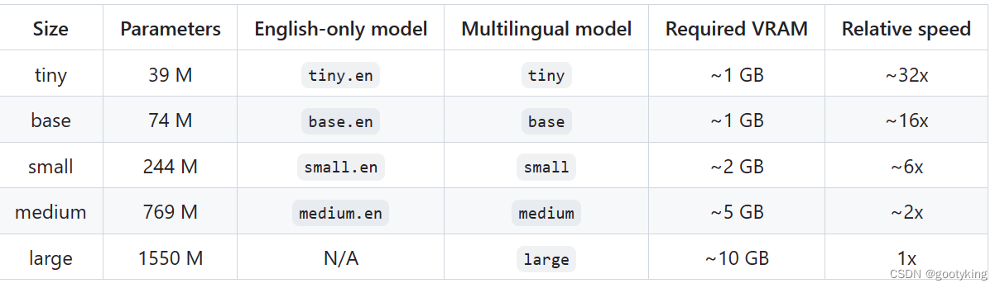

 
# 语音识别神器 Whisper 的几个小技巧_如何设定whisper只输出中文 
 
 2025-03-27 19:34:08 发布
       
### 1、前言

[OpenAI]开源的免费离线[语音识别] 神器[Whisper] ，我在安装使用后发现一些问题，于是搜了半天最终汇总了这几个[主要的]小技巧，希望对大家有帮助，不用满世界再搜了。

我主要用于中文的识别，所以就只说中文相关的了，我的环境是：
-   系统：Ubuntu22.04
-   Python:3.9.9(conda)

具体怎么正常使用或者怎么安装，官方MD很详细了，不行再搜搜也就有了，我就没记录。

官方github：[GitHub - openai/whisper: Robust Speech Recognition via
Large-Scale Weak
Supervision](https://github.com/openai/whisper "GitHub - openai/whisper: Robust Speech Recognition via Large-Scale Weak Supervision")

###  2、模型选哪个

        whisper提供了5个模型，见下表：

 

       
每个模型具体要求都在表里了，我试过前4个，对于中文识别，我的体会是，必须得medium，前3个中文识别有点差。medium足够用，虽然也会有错误的情况，但不多了。我推测large肯定会更上一层楼，然而large有点大且显存占得大就没下载。
        所以，medium性价比最高。

### 3、whisper 加标点符号的问题
        我使用时，发现输出的文件里中文完全没有标点符号哎，这可咋整，找了半天程序里也没这参数啊。不断大海捞针地搜了搜，发现有篇文章写了个方法说要通过prompt，告诉程序个例子。于是通过测试，总结了一个成功的方法是这样的：
        运行时加这个参数initial_prompt，它的值要写上对当前识别音频的内容总结（自己提前知道），最后还要加上句号，效果最佳。比如我要识别一段会议的录音，所以这个参数就这么写：

        initial_prompt = "这是一段会议记录。"

        哦对了，我是在程序里调接口用，如果用命令号，就直接加
--initial_prompt "这是一段会议记录。"
（应该是这么写，不对的话再调整调整格式）

        于是标点符号的问题解决了。

### []{#t3}4、whisper  中文简体繁体字的问题

       
标点符号问题解决了，结果有时候识别出来的内容突然有一段变成了繁体字，于是又开始一顿搜寻，最终解决方法还是要在initial_prompt里给出例子。       
就是要在prompt里加上这句："以下是普通话的句子。"，注意，这里要全部用简体中文写，程序就造了。       
所以如果想输出繁体字，那这句话就用繁体写："以下是普通話的句子。"

### []{#t4} 5、总结

        综述所述，最后就固定一个prompt的写法，就能解决这俩问题。

        initial_prompt = "以下是普通话的句子，这是一段会议记录。"

-    如果想输出繁体字，上面内容就全用繁体字写。
-    后半句写语音的内容概括，并且一定要加上句号。

**        祝大家成功！**
                                                  
