# 1. docker 获取Nvidia 镜像 \| cuda \|cudnn
  
一颗小树x[已于 2023-09-14 23:29:34 修改]
 
 
本文分享如何使用 获取Nvidia镜像，包括cuda10、cuda11等不同版本，cudnn7、cudnn8等，快速搭建[深度学习]环境。

#### 1、来到docker hub官网，查看有那些Nvidia 镜像

[https://hub.docker.com/r/nvidia/cuda/tags?page=2&name=11.3](https://hub.docker.com/r/nvidia/cuda/tags?page=2&name=11.3) 

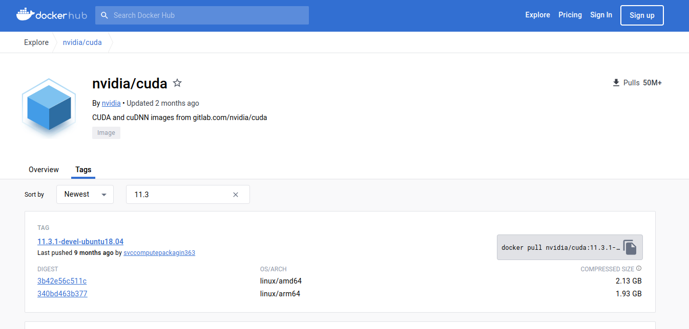 

这里可以输入cuda的版本比如11.6，或筛选出相关的镜像：

[https://hub.docker.com/r/nvidia/cuda/tags?page=1&name=11.6](https://hub.docker.com/r/nvidia/cuda/tags?page=1&name=11.6) 

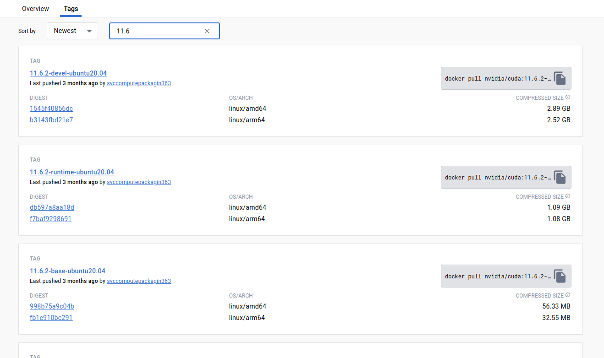 

旁边还有镜像名称的排序方式：

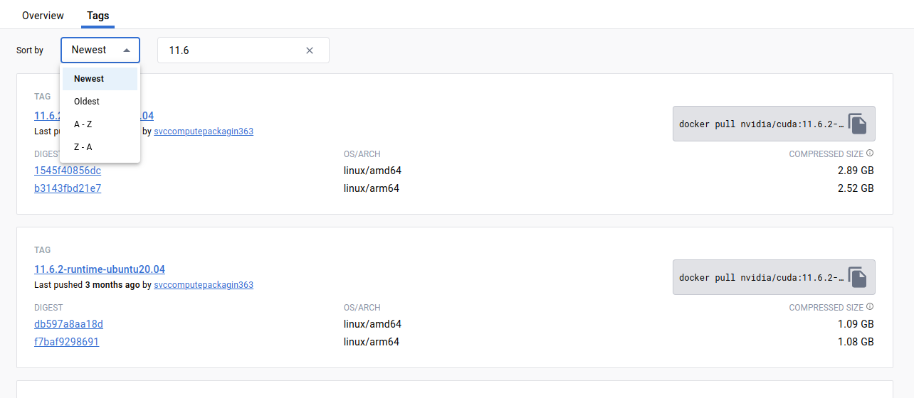 

#### 2、拉取镜像到本地

选择好想要的镜像，比如：[11.3.1-cudnn8-devel-ubuntu20.04](https://hub.docker.com/layers/nvidia/cuda/11.3.1-cudnn8-devel-ubuntu20.04/images/sha256-052b3b515d9653f9c6e358e5b70f8bb9d75c17a8b2039055674dfa7caa970791?context=explore)
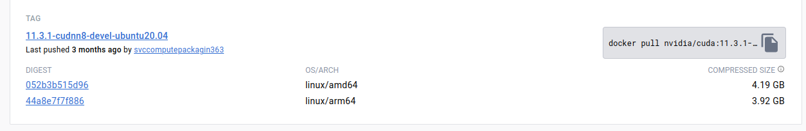 
点击右边的复制按键

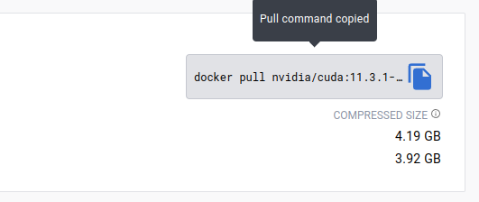 

复制到命令：

```sh
docker pull nvidia/cuda:11.3.1-cudnn8-devel-ubuntu20.04AI写代码
```

然后到命令终端执行：

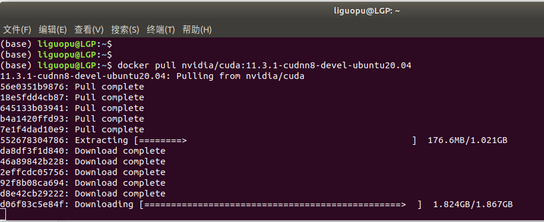 

这时就开始把nvidia/cuda:11.3.1-cudnn8-devel-ubuntu20.04镜像，拉到本地啦，需要等待一会。

####  3、查看镜像，打开镜像

拉取镜像完成后，用docker images命令查看镜像的情况：

```sh
docker images
```

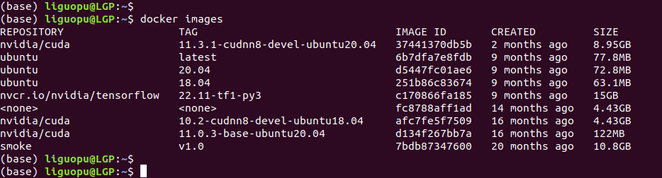 

能看到nvidia/cuda:11.3.1-cudnn8-devel-ubuntu20.04镜像在本地了，镜像大小是8.95G。

#### **打开镜像（常规模式--支持使用GPU）**

```sh
docker run -i -t --gpus all nvidia/cuda:11.3.1-cudnn8-devel-ubuntu20.04  /bin/bash
```

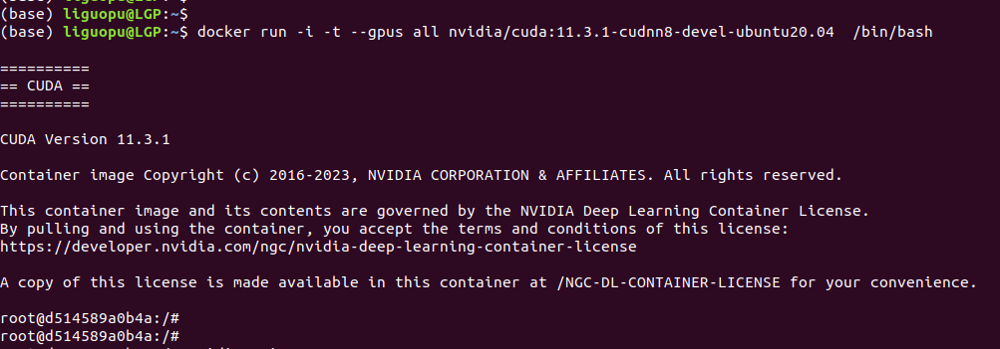 

**打开镜像（增强模式--支持使用GPU、映射目录、设置内存）**

```sh
docker run -i -t -v /home/liguopu/:/guopu:rw --gpus all --shm-size 16G nvidia/cuda:11.3.1-cudnn8-devel-ubuntu20.04  /bin/bash
```

平常进入了docker环境，然后创建或产生的文件，在退出docker环境后会"自动销毁"；或者想运行本地主机的某个程序，发现在docker环境中找不到。

我们可以通过映射目录的方式，把本地主机的某个目录，映射到docker环境中，这样产生的文件会保留在本地主机中。
通过-v 把本地主机目录 /home/liguopu/映射到docker环境中的/guopu 目录；其权限是rw，即能读能写。

**默认分配很小的内存**，在训练 模型 时不够用，可以通过参数设置：比如，我电脑有32G内参，想放16G到docker中使用，设置为 --shm-size 16G。

#### 4、测试镜像cuda和cudnn

用 nvidia-smi 看看显卡信息

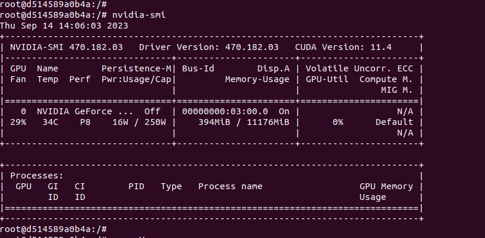 

这里看到的CUDA Version: 11.4，是和主机一致的，但我们想要的是11.3，没关系继续往下看。

用nvcc -V 命令查看，才是实际的cuda版本，后面搭建 [深度学习环境]，也是依赖这里的cuda 11.3。

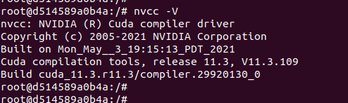 

用ls /usr/local/命令看看cuda安装路径

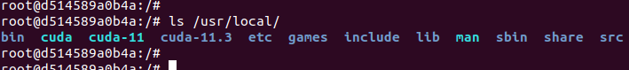 

下面就开始搭建深度学习环境啦

####  5、安装conda环境

默认的系统镜像可能没有conda也没有python，我们可以安装[Anaconda]，来搭建深度学习环境

 这里有两个下载地址可以选择，分别是官方下载地址、清华大学[开源软件]镜像站。

官方下载地址：[Free Download |Anaconda](https://www.anaconda.com/download/)


 如果觉得官方地址下载慢，可以尝试下清华大学的下载地址：

清华大学开源软件镜像站：[Index of anaconda archive| 清华大学开源软件镜像站 | Tsinghua Open Source Mirror](https://mirrors.tuna.tsinghua.edu.cn/anaconda/archive/?C=M&O=D)

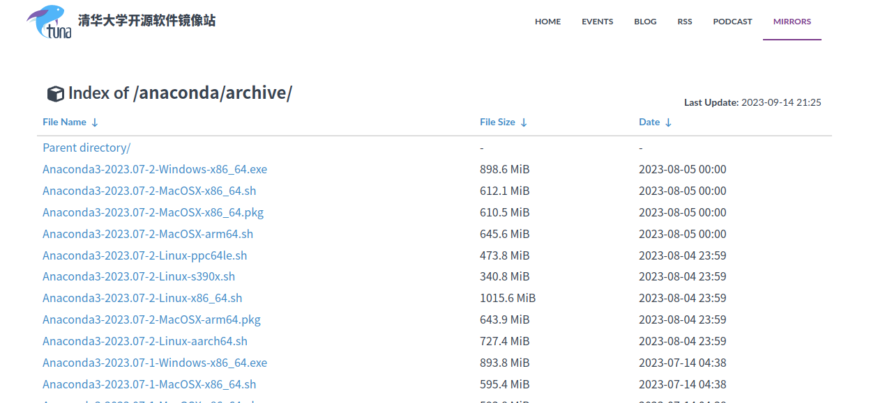

比如选择：[Anaconda3-2023.07-2-Linux-x86_64.sh](https://mirrors.tuna.tsinghua.edu.cn/anaconda/archive/Anaconda3-2023.07-2-Linux-x86_64.sh)

**安装Anaconda3**

进入下载文件的位置，打开终端terminal在文件目录下，使用bash执行安装就可以啦：

> bash Anaconda3-2023.07-2-Linux-x86_64.sh

安装过程：

1）输入回车键确认安装；

2）阅读Anaconda最终用户许可协议，按下回车浏览完信息；

3）问我们是否接受该协议，只能接受了，输入yes；（Do you accept the
license terms? \[yes\|no\]）

4）提示安装到以下位置，回车确认即可；（Anaconda3 will now be installed
into this location:）

5）是否加入环境变量，通常是选择yes的；这个根据自己情况选择，如果经常用conda环境开发，建议选择yes（Do
you wish the installer to initialize Anaconda3 in your
/home/linuxidc/.bashrc ? \[yes\|no\]）

开始安装页面

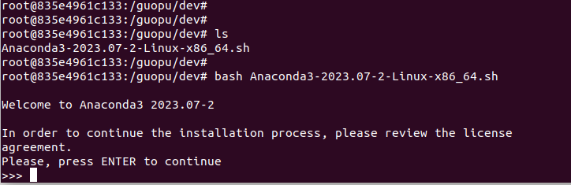 

安装过程：

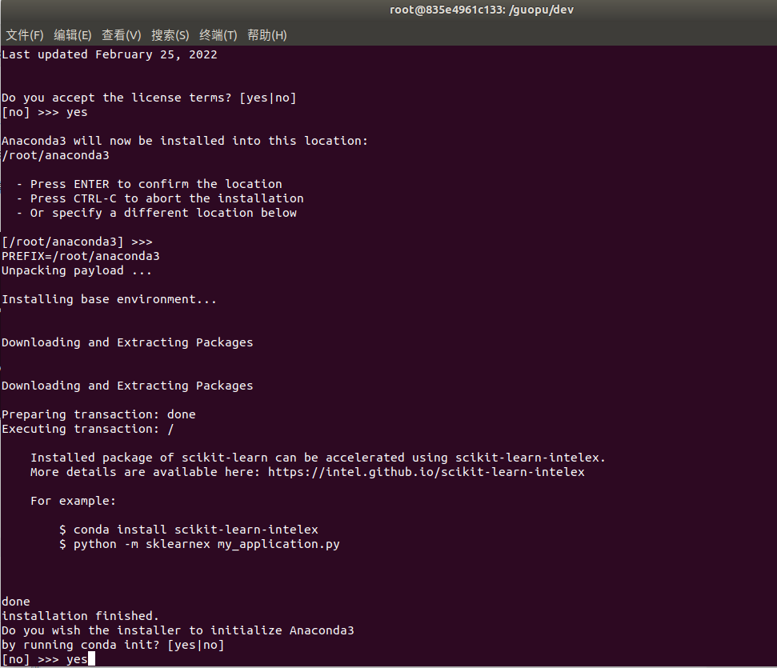 

完成conda安装：

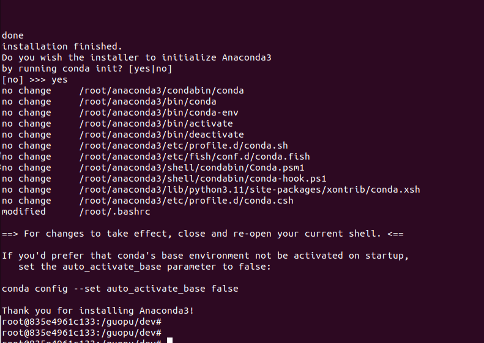 

用另一个终端打开这个镜像创建的容器：

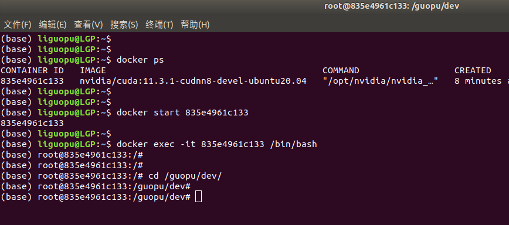 

能看到能conda的初始环境了，说明conda安装成功啦。
