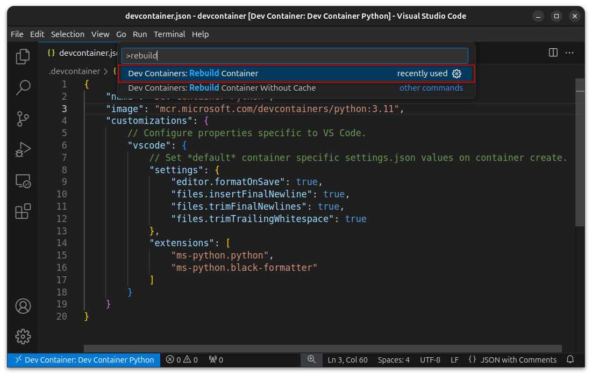

# 1. VS Code Dev Containers 教程：从基础到进阶配置

本文介绍了如何在VSCode中使用DevContainers，包括安装**Remote Development插件**、利用预设镜像或自定义Dockerfile构建镜像，以及配置devcontainer.json文件。详细步骤覆盖了从基础配置到高级定制的过程。

## 1.1. 简介

Development Containers(简写为 dev container)可以让你使用容器作为一个完整的[开发环境]，用容器可以隔离不同的开发环境,
允同时使用不同的开发环境. 便于分享开发环境, 提高开发效率.

VS Code 支持 dev container. 本教程将介绍如何使用VS Code 的 dev container 功能.

------------------------------------------------------------------------

###  2. 环境要求

在开始之前, 请确保已安装以下工具:

-   **Docker**: 用于管理和运行容器化的开发环境. 官网教程: [Get Docker](https://docs.docker.com/get-docker/) 
-   **VS Code**: 提供便捷的开发体验并支持 Remote Development 扩展.    官网教程: [Visual Studio Code](https://code.visualstudio.com/)

------------------------------------------------------------------------

### 3. 配置步骤

本节将详细介绍如何从零开始配置 Dev
Container，包括插件安装、镜像使用和自定义 Dockerfile。

#### 3.1. 安装 "Remote Development" 插件

##### 3.1.1 从插件栏安装

1.  打开 VS Code 的扩展(Extensions)视图, 搜索 ["Remote Development"](https://marketplace.visualstudio.com/items?itemName=ms-vscode-remote.vscode-remote-extensionpack) 插件.
2.  点击 "Install" 安装. 
    

#####  3.1.2 使用命令行安装:

1.  打开`Terminal`(通过菜单栏: `Terminal/终端` -\> `New Terminal/新建终端`)

```
code --install-extension ms-vscode-remote.vscode-remote-extensionpack
```
 
------------------------------------------------------------------------

####  3.2. 使用已有镜像创建开发容器

##### 步骤 1: 创建配置文件夹

在工作目录下创建 `.devcontainer` 文件夹.

```  
mkdir .devcontainer
```

##### 步骤 2: 创建 `devcontainer.json` 配置文件

在 `.devcontainer` 文件夹下创建 `devcontainer.json` 文件, 内容如下:

``` 
{
  "name": "Dev Container Python",
  "image": "mcr.microsoft.com/devcontainers/python:3.11"
}
```

这个文件内容后续会根据不同需要调整.

此时,目录结构如下:

``` 
$ tree -a .
.
└── .devcontainer
    └── devcontainer.json
```

如图所示:


##### 步骤 3: 打开 dev container:

按照如下步骤操作:

1.  打开 VS Code 的命令面板(快捷键: `Ctrl+Shift+P`)
2.  搜索\"Remote-Containers: Reopen in Container"
3.  选择\"Remote-Containers: Reopen in Container". 
    

此时 VS Code 会自动下载镜像并启动一个 python 的 dev container.
顺利完成后如图所示:


##### 一些预制的镜像

以下是常见开发语言的预制镜像:

 
 | 语言 | 镜像 | 说明
 |----------|----------------------------------------------------|---
 | `C++`    | `mcr.microsoft.com/devcontainers/cpp:ubuntu-22.04` | 支持常见的 C++ 构建工具
 | `Go`     | `mcr.microsoft.com/devcontainers/go:1.21`          | 适用于 Go 语言开发
 | `Java`   | `mcr.microsoft.com/devcontainers/java:21`          | 包含 Java 开发环境和工具
 | `Python` | `mcr.microsoft.com/devcontainers/python:3.11`      | 预装 Python 和常用依赖
 
更多的镜像可以参考: [Dev Container 样例](https://github.com/devcontainers/images/tree/main/src)

#### 3.3 从`Dockerfile`构建镜像并使用

##### 步骤 1: 修改 `devcontainer.json` 配置文件

如果需要自定义镜像,
则需要将`image`改为`build`,并指定构建镜像的`Dockerfile`.

```json
{
  "name": "Dev Container Python",
  "build": {
    "dockerfile": "Dockerfile"
  },
  "runArgs": ["--name", "devcontainer-python"]
}
```

##### 步骤 2: 创建`Dockerfile`

`Dockerfile` 文件内容:

```Dockerfile
FROM ubuntu:22.04

# 设为noninteractive模式来减少警告
ENV DEBIAN_FRONTEND=noninteractive


# 安装必要的软件, 可以根据自己的需求定制安装软件
RUN apt update -y && \
    apt -y install --no-install-recommends apt-utils dialog && \
    apt -y install \
    build-essential \
    iproute2 \
    poppler-utils \
    procps \
    python3 \
    python3-pip \
    sudo \
    && apt autoremove -y \
    && apt clean -y

# 添加用户的GID/UID必须与你本机用户的GID/UID匹配, 以免引起权限问题.
# 如果你本机的GID/UID与下面的设置(1000/1000)不一致, 请修改此文件.
# 参考: https://aka.ms/vscode-remote/containers/non-root-user
ARG USER_UID=1000
ARG USER_GID=$USER_UID

# 创建一个非root用户
# 参考: https://aka.ms/vscode-remote/containers/non-root-user
RUN groupadd --gid $USER_GID vscode \
    && useradd -s /bin/bash --uid $USER_UID --gid $USER_GID -m vscode \
    && echo vscode ALL=\(root\) NOPASSWD:ALL > /etc/sudoers.d/vscode \
    && chmod 0440 /etc/sudoers.d/vscode

# 切回到dialog模式
ENV DEBIAN_FRONTEND=dialog
```

此时的文件结构如下:

```sh
$ tree -a .
.
└── .devcontainer
    ├── Dockerfile
    └── devcontainer.json

1 directory, 2 files
```

需要注意的是, 自定义的镜像中需要支持如下命令或者库:

-   `curl`
-   `freetype`
-   `gcompat`
-   `libxext`
-   `libxi`
-   `libxrender`
-   `libxtst`
-   `procps`
-   `ps`
-   `unzip`

##### 步骤 3: 打开 dev container

此时步骤同前. 在命令面板中查找并执行命令: **"Remote-Containers: Reopen in Container"**

------------------------------------------------------------------------

### 4. 在 `devcontainer.json`配置编辑器

除了基本的 Dev Container 配置，你还可以在 devcontainer.json 中定义 VS
Code 插件和编辑器设置，以提高开发效率。

####  4.1 在 `devcontainer.json` 中安装 VS Code 插件

通常我们会在 vs code 中安装一些插件, 我们可以将这些插件写入到配置文件,
这样在构建 [docker]镜像成功之后, vscode 会自动安装这些插件.
配置方法如下:

#####  4.1.1 配置文件

在 `customizations.vscode.extensions`路径下插入一个数组, 样例如下:

```json
{
  "name": "Dev Container Python",
  "image": "mcr.microsoft.com/devcontainers/python:3.11",
  "customizations": {
    "vscode": {
      "extensions": ["ms-python.python", "ms-python.black-formatter"]
    }
  }
} 
```

#####  4.1.2 如何获取插件 ID

1.  搜索到你想要安装的插件
2.  在对应插件的介绍页查找`Identifier`
3.  拷贝对应的`Identifier`并填入上面的配置中

如图所示:\


##### 4.1.3 常用 VSCode 插件

根据不同的开发需求, 可以选择一些常用插件:

前端开发:

-   **esbenp.prettier-vscode**: Prettier 代码格式化工具.
-   **dbaeumer.vscode-eslint**: ESLint 语法检查.
-   **ms-vscode.vscode-typescript-next**: TypeScript 支持.

后端开发:

-   **ms-python.python**: Python 插件.
-   **golang.go**: Go 语言插件.
-   **ms-vscode.cpptools**: C/C++ 插件.

容器和 DevOps:

-   **ms-azuretools.vscode-docker**: Docker 工具.
-   **hashicorp.terraform**: Terraform 插件.

Markdown 和文档工具:

-   **yzhang.markdown-all-in-one**: Markdown 插件.
-   **bierner.markdown-preview-github-styles**: GitHub 风格的 Markdown
    预览.

####  4.2 在 `devcontainer.json` 中配置编辑器行为

vscode 同样支持将编辑器的设置保存到`devcontainer.json`中.

```json
{
  "name": "Dev Container Python",
  "image": "mcr.microsoft.com/devcontainers/python:3.11",
  "customizations": {
    "vscode": {
      "settings": {
        "editor.formatOnSave": true,
        "files.insertFinalNewline": true,
        "files.trimFinalNewlines": true,
        "files.trimTrailingWhitespace": true
      },
      "extensions": ["ms-python.python", "ms-python.black-formatter"]
    }
  }
}
```

#### 4.3 更新配置并重建容器

如果你是在 dev container 中修改了`devcontainer.json`并想让它立即生效,
那你需要重新构建.

1.  打开编辑器命令面板(快捷键`Ctrl+Shift+P`)
2.  搜索并打开`Rebuild`\
    

------------------------------------------------------------------------

###  5. 总结

Dev Containers
提供了一种高效且一致的开发环境管理方式，适用于多种语言和工具链的开发需求。通过合理配置
devcontainer.json 和
Dockerfile，你可以在团队中实现开发环境的共享，显著提升开发效率和协作体验。

### 参考资料

1.  [`devcontainer.json` 配置参考, by Docker](https://containers.dev/implementors/json_reference/){rel="nofollow"}
2.  [Developing inside a Container, by
    Microsoft](https://code.visualstudio.com/docs/devcontainers/containers){rel="nofollow"}
3.  [VS Code
    插件市场](https://marketplace.visualstudio.com/){rel="nofollow"}

###  进一步阅读

笔者主要是以 C++为主要工作语言, 如下是更多的关于 C++ 开发环境的文章.

-   [Windows 11 CLion C++ Dev Container
    开发环境配置](https://www.arong-xu.com/posts/clion-dev-containers-complete-guide/){rel="nofollow"}
-   [VS Code C++
    开发环境配置](https://www.arong-xu.com/posts/configure-vscode-as-cpp-ide/){rel="nofollow"}
-   [Vcpkg 使用全攻略: 支持 VS Code, Visual Studio 和
    CLion](https://www.arong-xu.com/posts/cpp-package-management-vcpkg-from-zero-to-hero/){rel="nofollow"}
-   [CMake 入门教程:
    从基础到实践](https://www.arong-xu.com/cmake-column/hands-on-cmake/){rel="nofollow"}


# <==========================================================>
# <==========================================================>

# 2.# vscode 中docker与dev container插件的使用  
  
本文链接：[https://blog.csdn.net/youxixixixi/article/details/145715406](https://blog.csdn.net/youxixixixi/article/details/145715406)

## 2.1 基础配置

-   安装vscode。
-   在vscode安装 Docker 插件与ms-vscode-remote.remote-containers插件。

##  2.2Docker 学习

这里可以参考：[阮一峰docker教程](https://ruanyifeng.com/blog/2018/02/docker-tutorial.html){rel="nofollow"}、[菜鸟教程docker](https://www.runoob.com/docker/docker-tutorial.html){rel="nofollow"}、[雪雁docker](https://www.cnblogs.com/codelove/p/10606434.html){rel="nofollow"}

> 容器container是镜像image的实例化。

##  2.3生成 dockerfile

> 一种途径是自行编写dockerfile，另一种途径是使用插件自动生成再进行修改。

dockerfile的编写：[知乎](https://zhuanlan.zhihu.com/p/79949030){rel="nofollow"}、[CSDN](https://blog.csdn.net/x1131230123/article/details/135769591)

无论是自行编写还是自动生成，需要知道的是，镜像`image`是由多个"层"组成的。每一层都是镜像构建过程中的一个步骤，每次Docker 执行一个命令（例如 RUN、COPY、ADD等）时，都会生成一个新的层。这些层共同构成了 `Docker`镜像的内容。就使用`dev container`而言，`dockerfile`应该仅包含环境配置，不应该包含对应的项目功能代码包。

自动生成示例：

使用Docker扩展可以非常方便的从VisualStudio Code构建，管理和部署容器化应用程序，可以自动生成dockerfile、docker-compose.yml和.dockerignore文件（按F1并搜索Docker：将Docker文件添加到Workspace）\


-   `Add Docker Files to Workspace`用于生成一个单独的 Docker配置文件（Dockerfile）和与之配套的基础配置文件。可能还会生成与应用环境相关的文件，例如 .dockerignore。
-   `Add Docker Compose Files to Workspace` 用于生成支持多服务编排的 Docker Compose 配置文件（docker-compose.yml）。如果你的项目需要多个服务（例如后端服务、数据库服务、缓存服务）共同运行，这是更适合的选项。

接着：根据项目选择基本配置，由于不同项目需要配置不同，跟着导引选择。 


-   `ASP.NET Core` 是用于构建 Web应用程序的跨平台框架，适用于构建现代化的 Web 服务和应用。它支持 HTTP
    请求处理、Web API、WebSocket、以及其他网络相关的功能。
-   `Console`
    应用是一个基于命令行界面的应用程序，通常用于执行后台任务、处理批量操作、定时任务等。

这些信息自行GPT即可。

## 2.4build

上面步骤完成之后，你的项目会有`dockerfile`和`.dockerignore`，或许会有`docker-compose.debug.yml`、`docker-compose.yml`。

在资源管理器中选中`dockerfile`并且右键点击，找到`build image..`选项，接着输入\<镜像名\>:\<标签\>\


这一步相当于:`docker build -t <your-image-name>:<your-tag> .`

-   `-t your-image-name:your-tag`：这里你可以指定镜像的名称和标签。例如，your-image-name
    是镜像的名称，your-tag 是标签（如 latest 或 v1.0）。
-   `.`：表示 Docker 构建上下文是当前目录，这意味着 Docker
    会在当前目录下查找 Dockerfile。

接着等待结果。注意保持网络畅通无阻，在`git clone into..`这一步很容易Failed
to connect to github.com port 443: Timed out 。\


这样就算构建image成功了：\


这时候你将在docker插件页面的左侧中见到刚刚 `build` 的
`consimulation:2.0.0`，如下图。`registeries`可以连接到`dockerhub`和`github`账号，不过本人`dockerhub`的状态一直是`fetch failed`。

可以在终端输入`docker images`查看已经构建的images。`docker container ps`则可以查看目前正在运行的容器的CONTAINER
ID、镜像名称、端口映射等等状态。\


右键点击刚刚build的image，可以看到`run`和`run interactive`两个选项:

-   `Run`
    是直接启动容器并执行指定的命令。这通常用于容器启动后不需要用户干预的场景。容器在后台运行，不会直接打开交互式终端，适合用于以下情况：
-   `Run Interactive`
    则是以交互模式启动容器，并附加到容器的终端。这意味着你可以与容器内部进行交互，通常是进入容器的命令行（shell）进行操作。

此时也可以在终端输入`docker run -it --rm <image_name>:<tag> /bin/zsh`。这里的`/bin/zsh`是启动容器时执行的命令，也可以是`/bin/bash`等等，取决于dockerfile的配置。`-it`中`-i` 表示以交互模式运行容器，`-t`会为容器分配一个伪终端（terminal），这使得你能够与容器进行交互。`--rm`代表容器在退出后会被自动删除。这意味着容器停止后会被清除，不会留下任何痕迹。

启动示例：


在vscode中下载dev container插件，`ctrl+shift+p`选择rebuild and reopen in container。


接着会发现，我们的image实例化之后的容器虽然在build时没有包含代码功能包，但我们是可以发现存在于本地项目下的代码功能包却在dockercontainer开发容器中。这样就可以对已经构建的容器进行测试了。

##  2.5 devcontainer文件

当你`build`好`image`之后，这时你的的`image`还在本地，本机可以作为宿主机。

Visual Studio Code Dev Containers扩展允许您使用Docker容器作为功能齐全的开发环境。项目中的文件告诉 VS Code如何使用定义良好的工具和运行时堆栈devcontainer.json访问（或创建） Dev Containers 。该VS Code的容器配置存储在devcontainer.json文件中。该文件类似于用于launch.json调试配置的文件，但用于启动（或附加到）
Dev Containers 。

这一部分可以参考：[vscode文档](https://vscode.github.net.cn/docs/devcontainers/create-dev-container)、[一起学docker](https://learnku.com/docs/learn-docker-together/1/pei-zhi-bian-ji-lian-lu/13233)<=讲的挺好的

使用docker插件自动生成:
按下F1，输入`add development container configuration files...`\


选择：`来自dockerfile`。


选择配置：


编写流程：

1、在 Command Palette 中，使用 Remote-Containers: Add Development
Container Configuration Files 命令开始配置开发容器

2、按需编辑 .devcontainer 文件夹的内容

3、使用 Remote-Containers: Reopen in Container 来验证自己的配置是否可行

4、如果看到错误，在弹出的对话框中选择 Open Folder Locally

5、在窗口重新加载之后，控制台中会出现一份 build log
（构建日志），以便查找问题点。再次按需编辑 .devcontainer
文件夹的内容。（如果你把构建日志关闭了以后，又想再看一下的话，可以使用
Remote-Containers: Open Log File 命令再次打开）

6、运行 `Remote-Containers: Rebuild and Reopen in Container `
命令，如果需要，回到第 4 步。如此反复。

如果你已经成功构建了容器，仍旧可以在连上容器以后，按需编辑 .devcontainer
文件夹里面的内容。之后在 Command Palette 中，选中 Remote-Containers:
Rebuild Container 命令，让修改的内容生效。

编写好.devcontainer/devcontainer.json文件之后，就能畅通无阻使用`ctrl+shift+p`在开发容器玩耍了。
